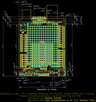
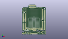
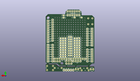
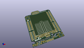

Contents
========

* [PROJ-SPAR-13819-STAN-01>Arduino ProtoShield Bare PCB](#proj-spar-13819-stan-01arduino-protoshield-bare-pcb)
	* [Images](#images)
	* [Interactive BOM](#interactive-bom)
	* [OOMP Parts](#oomp-parts)
	* [Tags](#tags)
  
![][im]
# PROJ-SPAR-13819-STAN-01>Arduino ProtoShield Bare PCB

- ID: PROJ-SPAR-13819-STAN-01
- Hex ID: PRS13819
- Name: Arduino ProtoShield Bare PCB
- Description: 

## Images
  
  

|eagleImage|kicadPcb3dFront|kicadPcb3dBack|kicadPcb3d|
| :---: | :---: | :---: | :---: |
|||||

## Interactive BOM

- Interactive BOM page: [ibom.html](kicad/bom/ibom.html)

## OOMP Parts
  

|OOMP Parts|
| :---: |
|UNMATCHED-UNMATCHED-X-UNMATCHED-01, 5V, 30.797499999999996, 1.4605, 180,5V, 1X01, SparkFun-Connectors, (1.2125, 0.0575), R180|
|UNMATCHED-UNMATCHED-X-UNMATCHED-01, 5V_RAIL, 10.16, 13.97, 0,5V_RAIL, 1X07_NO_SILK, SparkFun-Connectors, (0.4, 0.55), R0|
|UNMATCHED-UNMATCHED-X-UNMATCHED-01, GND, 28.2575, 1.4605, 180,GND, 1X01, SparkFun-Connectors, (1.1125, 0.0575), R180|
|UNMATCHED-UNMATCHED-X-UNMATCHED-01, GND_RAIL_1, 43.18, 13.97, 180,GND_RAIL_1, 1X07_NO_SILK, SparkFun-Connectors, (1.7, 0.55), R180|
|UNMATCHED-UNMATCHED-X-UNMATCHED-01, GND_RAIL_2, 38.099999999999994, 11.43, 0,GND_RAIL_2, 1X03_NO_SILK, SparkFun-Connectors, (1.5, 0.45), R0|
|UNMATCHED-UNMATCHED-X-UNMATCHED-01, ICSP, 30.430000099999997, 11.417000026, 180,ICSP, ICSP, 2X3, SparkFun-Connectors, (1.1980315, 0.44948819), R180|
|<table><tr><td></td><td> JP1</td><td>[HEAD-I01-X-PI10-01 2.54 mm 10 Pin Header](https://github.com/oomlout/oomlout_OOMP_parts/tree/main/HEAD-I01-X-PI10-01/)</td><td>[H10](https://github.com/oomlout/oomlout_OOMP_parts/tree/main/HEAD-I01-X-PI10-01/)</td></tr></table>|
|<table><tr><td></td><td> JP2</td><td>[HEAD-I01-X-PI06-01 2.54 mm 6 Pin Header](https://github.com/oomlout/oomlout_OOMP_parts/tree/main/HEAD-I01-X-PI06-01/)</td><td>[H06](https://github.com/oomlout/oomlout_OOMP_parts/tree/main/HEAD-I01-X-PI06-01/)</td></tr></table>|
|<table><tr><td></td><td> JP7</td><td>[HEAD-I01-X-PI06-01 2.54 mm 6 Pin Header](https://github.com/oomlout/oomlout_OOMP_parts/tree/main/HEAD-I01-X-PI06-01/)</td><td>[H06](https://github.com/oomlout/oomlout_OOMP_parts/tree/main/HEAD-I01-X-PI06-01/)</td></tr></table>|
|UNMATCHED-UNMATCHED-X-UNMATCHED-01, JP8, 53.339999999999996, 66.03999999999999, 180,JP8, ARDUINO_R3_SHIELDR3_PROTO_SHIELD, UNO_R3_PROTO_SHIELD, TempLibrary, (2.1, 2.6), R180|
|<table><tr><td></td><td> JP10</td><td>[HEAD-I01-X-PI06-01 2.54 mm 6 Pin Header](https://github.com/oomlout/oomlout_OOMP_parts/tree/main/HEAD-I01-X-PI06-01/)</td><td>[H06](https://github.com/oomlout/oomlout_OOMP_parts/tree/main/HEAD-I01-X-PI06-01/)</td></tr></table>|
|<table><tr><td></td><td> JP11</td><td>[HEAD-I01-X-PI08-01 2.54 mm 8 Pin Header](https://github.com/oomlout/oomlout_OOMP_parts/tree/main/HEAD-I01-X-PI08-01/)</td><td>[H08](https://github.com/oomlout/oomlout_OOMP_parts/tree/main/HEAD-I01-X-PI08-01/)</td></tr></table>|
|<table><tr><td></td><td> JP12</td><td>[HEAD-I01-X-PI08-01 2.54 mm 8 Pin Header](https://github.com/oomlout/oomlout_OOMP_parts/tree/main/HEAD-I01-X-PI08-01/)</td><td>[H08](https://github.com/oomlout/oomlout_OOMP_parts/tree/main/HEAD-I01-X-PI08-01/)</td></tr></table>|
|UNMATCHED-UNMATCHED-X-UNMATCHED-01, JP13, 21.59, 16.509999999999998, M180,JP13, D_RAIL1, SMT-JUMPER_2_NO_NO-SILK, SparkFun-Jumpers, (0.85, 0.65), MR180|
|UNMATCHED-UNMATCHED-X-UNMATCHED-01, JP14, 19.049999999999997, 16.509999999999998, M180,JP14, D_RAIL1, SMT-JUMPER_2_NO_NO-SILK, SparkFun-Jumpers, (0.75, 0.65), MR180|
|UNMATCHED-UNMATCHED-X-UNMATCHED-01, JP15, 16.509999999999998, 16.509999999999998, M180,JP15, D_RAIL1, SMT-JUMPER_2_NO_NO-SILK, SparkFun-Jumpers, (0.65, 0.65), MR180|
|UNMATCHED-UNMATCHED-X-UNMATCHED-01, JP16, 21.59, 19.049999999999997, M180,JP16, D_RAIL2, SMT-JUMPER_2_NO_NO-SILK, SparkFun-Jumpers, (0.85, 0.75), MR180|
|UNMATCHED-UNMATCHED-X-UNMATCHED-01, JP17, 19.049999999999997, 19.049999999999997, M180,JP17, D_RAIL2, SMT-JUMPER_2_NO_NO-SILK, SparkFun-Jumpers, (0.75, 0.75), MR180|
|UNMATCHED-UNMATCHED-X-UNMATCHED-01, JP18, 16.509999999999998, 19.049999999999997, M180,JP18, D_RAIL2, SMT-JUMPER_2_NO_NO-SILK, SparkFun-Jumpers, (0.65, 0.75), MR180|
|UNMATCHED-UNMATCHED-X-UNMATCHED-01, JP19, 21.59, 21.59, M180,JP19, D_RAIL3, SMT-JUMPER_2_NO_NO-SILK, SparkFun-Jumpers, (0.85, 0.85), MR180|
|UNMATCHED-UNMATCHED-X-UNMATCHED-01, JP20, 19.049999999999997, 21.59, M180,JP20, D_RAIL3, SMT-JUMPER_2_NO_NO-SILK, SparkFun-Jumpers, (0.75, 0.85), MR180|
|UNMATCHED-UNMATCHED-X-UNMATCHED-01, JP21, 16.509999999999998, 21.59, M180,JP21, D_RAIL3, SMT-JUMPER_2_NO_NO-SILK, SparkFun-Jumpers, (0.65, 0.85), MR180|
|UNMATCHED-UNMATCHED-X-UNMATCHED-01, JP22, 21.59, 24.13, M180,JP22, D_RAIL4, SMT-JUMPER_2_NO_NO-SILK, SparkFun-Jumpers, (0.85, 0.95), MR180|
|UNMATCHED-UNMATCHED-X-UNMATCHED-01, JP23, 19.049999999999997, 24.13, M180,JP23, D_RAIL4, SMT-JUMPER_2_NO_NO-SILK, SparkFun-Jumpers, (0.75, 0.95), MR180|
|UNMATCHED-UNMATCHED-X-UNMATCHED-01, JP24, 16.509999999999998, 24.13, M180,JP24, D_RAIL4, SMT-JUMPER_2_NO_NO-SILK, SparkFun-Jumpers, (0.65, 0.95), MR180|
|UNMATCHED-UNMATCHED-X-UNMATCHED-01, JP25, 21.59, 26.669999999999998, M180,JP25, D_RAIL5, SMT-JUMPER_2_NO_NO-SILK, SparkFun-Jumpers, (0.85, 1.05), MR180|
|UNMATCHED-UNMATCHED-X-UNMATCHED-01, JP26, 19.049999999999997, 26.669999999999998, M180,JP26, D_RAIL5, SMT-JUMPER_2_NO_NO-SILK, SparkFun-Jumpers, (0.75, 1.05), MR180|
|UNMATCHED-UNMATCHED-X-UNMATCHED-01, JP27, 16.509999999999998, 26.669999999999998, M180,JP27, D_RAIL5, SMT-JUMPER_2_NO_NO-SILK, SparkFun-Jumpers, (0.65, 1.05), MR180|
|UNMATCHED-UNMATCHED-X-UNMATCHED-01, JP28, 21.59, 29.209999999999997, M180,JP28, D_RAIL6, SMT-JUMPER_2_NO_NO-SILK, SparkFun-Jumpers, (0.85, 1.15), MR180|
|UNMATCHED-UNMATCHED-X-UNMATCHED-01, JP29, 19.049999999999997, 29.209999999999997, M180,JP29, D_RAIL6, SMT-JUMPER_2_NO_NO-SILK, SparkFun-Jumpers, (0.75, 1.15), MR180|
|UNMATCHED-UNMATCHED-X-UNMATCHED-01, JP30, 16.509999999999998, 29.209999999999997, M180,JP30, D_RAIL6, SMT-JUMPER_2_NO_NO-SILK, SparkFun-Jumpers, (0.65, 1.15), MR180|
|UNMATCHED-UNMATCHED-X-UNMATCHED-01, JP31, 21.59, 31.75, M180,JP31, D_RAIL7, SMT-JUMPER_2_NO_NO-SILK, SparkFun-Jumpers, (0.85, 1.25), MR180|
|UNMATCHED-UNMATCHED-X-UNMATCHED-01, JP32, 19.049999999999997, 31.75, M180,JP32, D_RAIL7, SMT-JUMPER_2_NO_NO-SILK, SparkFun-Jumpers, (0.75, 1.25), MR180|
|UNMATCHED-UNMATCHED-X-UNMATCHED-01, JP33, 16.509999999999998, 31.75, M180,JP33, D_RAIL7, SMT-JUMPER_2_NO_NO-SILK, SparkFun-Jumpers, (0.65, 1.25), MR180|
|UNMATCHED-UNMATCHED-X-UNMATCHED-01, JP34, 21.59, 34.29, M180,JP34, D_RAIL8, SMT-JUMPER_2_NO_NO-SILK, SparkFun-Jumpers, (0.85, 1.35), MR180|
|UNMATCHED-UNMATCHED-X-UNMATCHED-01, JP35, 19.049999999999997, 34.29, M180,JP35, D_RAIL8, SMT-JUMPER_2_NO_NO-SILK, SparkFun-Jumpers, (0.75, 1.35), MR180|
|UNMATCHED-UNMATCHED-X-UNMATCHED-01, JP36, 16.509999999999998, 34.29, M180,JP36, D_RAIL8, SMT-JUMPER_2_NO_NO-SILK, SparkFun-Jumpers, (0.65, 1.35), MR180|
|UNMATCHED-UNMATCHED-X-UNMATCHED-01, JP37, 21.59, 36.83, M180,JP37, D_RAIL9, SMT-JUMPER_2_NO_NO-SILK, SparkFun-Jumpers, (0.85, 1.45), MR180|
|UNMATCHED-UNMATCHED-X-UNMATCHED-01, JP38, 19.049999999999997, 36.83, M180,JP38, D_RAIL9, SMT-JUMPER_2_NO_NO-SILK, SparkFun-Jumpers, (0.75, 1.45), MR180|
|UNMATCHED-UNMATCHED-X-UNMATCHED-01, JP39, 16.509999999999998, 36.83, M0,JP39, D_RAIL9, SMT-JUMPER_2_NO_NO-SILK, SparkFun-Jumpers, (0.65, 1.45), MR0|
|UNMATCHED-UNMATCHED-X-UNMATCHED-01, JP40, 31.75, 36.83, M180,JP40, D_RAIL18, SMT-JUMPER_2_NO_NO-SILK, SparkFun-Jumpers, (1.25, 1.45), MR180|
|UNMATCHED-UNMATCHED-X-UNMATCHED-01, JP41, 34.29, 36.83, M180,JP41, D_RAIL18, SMT-JUMPER_2_NO_NO-SILK, SparkFun-Jumpers, (1.35, 1.45), MR180|
|UNMATCHED-UNMATCHED-X-UNMATCHED-01, JP42, 36.83, 36.83, M180,JP42, D_RAIL18, SMT-JUMPER_2_NO_NO-SILK, SparkFun-Jumpers, (1.45, 1.45), MR180|
|UNMATCHED-UNMATCHED-X-UNMATCHED-01, JP43, 31.75, 34.29, M180,JP43, D_RAIL18, SMT-JUMPER_2_NO_NO-SILK, SparkFun-Jumpers, (1.25, 1.35), MR180|
|UNMATCHED-UNMATCHED-X-UNMATCHED-01, JP44, 34.29, 34.29, M180,JP44, D_RAIL18, SMT-JUMPER_2_NO_NO-SILK, SparkFun-Jumpers, (1.35, 1.35), MR180|
|UNMATCHED-UNMATCHED-X-UNMATCHED-01, JP45, 36.83, 34.29, M180,JP45, D_RAIL18, SMT-JUMPER_2_NO_NO-SILK, SparkFun-Jumpers, (1.45, 1.35), MR180|
|UNMATCHED-UNMATCHED-X-UNMATCHED-01, JP46, 31.75, 31.75, M180,JP46, D_RAIL18, SMT-JUMPER_2_NO_NO-SILK, SparkFun-Jumpers, (1.25, 1.25), MR180|
|UNMATCHED-UNMATCHED-X-UNMATCHED-01, JP47, 34.29, 31.75, M180,JP47, D_RAIL18, SMT-JUMPER_2_NO_NO-SILK, SparkFun-Jumpers, (1.35, 1.25), MR180|
|UNMATCHED-UNMATCHED-X-UNMATCHED-01, JP48, 36.83, 31.75, M180,JP48, D_RAIL18, SMT-JUMPER_2_NO_NO-SILK, SparkFun-Jumpers, (1.45, 1.25), MR180|
|UNMATCHED-UNMATCHED-X-UNMATCHED-01, JP49, 31.75, 29.209999999999997, M180,JP49, D_RAIL17, SMT-JUMPER_2_NO_NO-SILK, SparkFun-Jumpers, (1.25, 1.15), MR180|
|UNMATCHED-UNMATCHED-X-UNMATCHED-01, JP50, 34.29, 29.209999999999997, M180,JP50, D_RAIL17, SMT-JUMPER_2_NO_NO-SILK, SparkFun-Jumpers, (1.35, 1.15), MR180|
|UNMATCHED-UNMATCHED-X-UNMATCHED-01, JP51, 36.83, 29.209999999999997, M180,JP51, D_RAIL17, SMT-JUMPER_2_NO_NO-SILK, SparkFun-Jumpers, (1.45, 1.15), MR180|
|UNMATCHED-UNMATCHED-X-UNMATCHED-01, JP52, 31.75, 26.669999999999998, M180,JP52, D_RAIL16, SMT-JUMPER_2_NO_NO-SILK, SparkFun-Jumpers, (1.25, 1.05), MR180|
|UNMATCHED-UNMATCHED-X-UNMATCHED-01, JP53, 34.29, 26.669999999999998, M180,JP53, D_RAIL16, SMT-JUMPER_2_NO_NO-SILK, SparkFun-Jumpers, (1.35, 1.05), MR180|
|UNMATCHED-UNMATCHED-X-UNMATCHED-01, JP54, 36.83, 26.669999999999998, M180,JP54, D_RAIL16, SMT-JUMPER_2_NO_NO-SILK, SparkFun-Jumpers, (1.45, 1.05), MR180|
|UNMATCHED-UNMATCHED-X-UNMATCHED-01, JP55, 31.75, 24.13, M180,JP55, D_RAIL15, SMT-JUMPER_2_NO_NO-SILK, SparkFun-Jumpers, (1.25, 0.95), MR180|
|UNMATCHED-UNMATCHED-X-UNMATCHED-01, JP56, 34.29, 24.13, M180,JP56, D_RAIL15, SMT-JUMPER_2_NO_NO-SILK, SparkFun-Jumpers, (1.35, 0.95), MR180|
|UNMATCHED-UNMATCHED-X-UNMATCHED-01, JP57, 36.83, 24.13, M180,JP57, D_RAIL15, SMT-JUMPER_2_NO_NO-SILK, SparkFun-Jumpers, (1.45, 0.95), MR180|
|UNMATCHED-UNMATCHED-X-UNMATCHED-01, JP58, 31.75, 21.59, M180,JP58, D_RAIL14, SMT-JUMPER_2_NO_NO-SILK, SparkFun-Jumpers, (1.25, 0.85), MR180|
|UNMATCHED-UNMATCHED-X-UNMATCHED-01, JP59, 34.29, 21.59, M180,JP59, D_RAIL14, SMT-JUMPER_2_NO_NO-SILK, SparkFun-Jumpers, (1.35, 0.85), MR180|
|UNMATCHED-UNMATCHED-X-UNMATCHED-01, JP60, 36.83, 21.59, M180,JP60, D_RAIL14, SMT-JUMPER_2_NO_NO-SILK, SparkFun-Jumpers, (1.45, 0.85), MR180|
|UNMATCHED-UNMATCHED-X-UNMATCHED-01, JP61, 31.75, 19.049999999999997, M180,JP61, D_RAIL13, SMT-JUMPER_2_NO_NO-SILK, SparkFun-Jumpers, (1.25, 0.75), MR180|
|UNMATCHED-UNMATCHED-X-UNMATCHED-01, JP62, 34.29, 19.049999999999997, M180,JP62, D_RAIL13, SMT-JUMPER_2_NO_NO-SILK, SparkFun-Jumpers, (1.35, 0.75), MR180|
|UNMATCHED-UNMATCHED-X-UNMATCHED-01, JP63, 36.83, 19.049999999999997, M180,JP63, D_RAIL13, SMT-JUMPER_2_NO_NO-SILK, SparkFun-Jumpers, (1.45, 0.75), MR180|
|UNMATCHED-UNMATCHED-X-UNMATCHED-01, JP64, 31.75, 16.509999999999998, M180,JP64, D_RAIL12, SMT-JUMPER_2_NO_NO-SILK, SparkFun-Jumpers, (1.25, 0.65), MR180|
|UNMATCHED-UNMATCHED-X-UNMATCHED-01, JP65, 34.29, 16.509999999999998, M180,JP65, D_RAIL12, SMT-JUMPER_2_NO_NO-SILK, SparkFun-Jumpers, (1.35, 0.65), MR180|
|UNMATCHED-UNMATCHED-X-UNMATCHED-01, JP66, 36.83, 16.509999999999998, M180,JP66, D_RAIL12, SMT-JUMPER_2_NO_NO-SILK, SparkFun-Jumpers, (1.45, 0.65), MR180|
|UNMATCHED-UNMATCHED-X-UNMATCHED-01, JP67, 25.4, 17.779999999999998, M270,JP67, D_RAIL10, SMT-JUMPER_2_NO_NO-SILK, SparkFun-Jumpers, (1, 0.7), MR270|
|UNMATCHED-UNMATCHED-X-UNMATCHED-01, JP68, 25.4, 20.32, M270,JP68, D_RAIL10, SMT-JUMPER_2_NO_NO-SILK, SparkFun-Jumpers, (1, 0.8), MR270|
|UNMATCHED-UNMATCHED-X-UNMATCHED-01, JP69, 25.4, 22.86, M270,JP69, D_RAIL10, SMT-JUMPER_2_NO_NO-SILK, SparkFun-Jumpers, (1, 0.9), MR270|
|UNMATCHED-UNMATCHED-X-UNMATCHED-01, JP70, 25.4, 25.4, M270,JP70, D_RAIL10, SMT-JUMPER_2_NO_NO-SILK, SparkFun-Jumpers, (1, 1), MR270|
|UNMATCHED-UNMATCHED-X-UNMATCHED-01, JP71, 25.4, 27.94, M270,JP71, D_RAIL10, SMT-JUMPER_2_NO_NO-SILK, SparkFun-Jumpers, (1, 1.1), MR270|
|UNMATCHED-UNMATCHED-X-UNMATCHED-01, JP72, 25.4, 30.479999999999997, M270,JP72, D_RAIL10, SMT-JUMPER_2_NO_NO-SILK, SparkFun-Jumpers, (1, 1.2), MR270|
|UNMATCHED-UNMATCHED-X-UNMATCHED-01, JP73, 25.4, 33.019999999999996, M270,JP73, D_RAIL10, SMT-JUMPER_2_NO_NO-SILK, SparkFun-Jumpers, (1, 1.3), MR270|
|UNMATCHED-UNMATCHED-X-UNMATCHED-01, JP74, 25.4, 35.559999999999995, M270,JP74, D_RAIL10, SMT-JUMPER_2_NO_NO-SILK, SparkFun-Jumpers, (1, 1.4), MR270|
|UNMATCHED-UNMATCHED-X-UNMATCHED-01, JP75, 25.4, 38.099999999999994, M270,JP75, D_RAIL10, SMT-JUMPER_2_NO_NO-SILK, SparkFun-Jumpers, (1, 1.5), MR270|
|UNMATCHED-UNMATCHED-X-UNMATCHED-01, JP76, 27.94, 17.779999999999998, M270,JP76, D_RAIL11, SMT-JUMPER_2_NO_NO-SILK, SparkFun-Jumpers, (1.1, 0.7), MR270|
|UNMATCHED-UNMATCHED-X-UNMATCHED-01, JP77, 27.94, 20.32, M270,JP77, D_RAIL11, SMT-JUMPER_2_NO_NO-SILK, SparkFun-Jumpers, (1.1, 0.8), MR270|
|UNMATCHED-UNMATCHED-X-UNMATCHED-01, JP78, 27.94, 22.86, M270,JP78, D_RAIL11, SMT-JUMPER_2_NO_NO-SILK, SparkFun-Jumpers, (1.1, 0.9), MR270|
|UNMATCHED-UNMATCHED-X-UNMATCHED-01, JP79, 27.94, 25.4, M270,JP79, D_RAIL11, SMT-JUMPER_2_NO_NO-SILK, SparkFun-Jumpers, (1.1, 1), MR270|
|UNMATCHED-UNMATCHED-X-UNMATCHED-01, JP80, 27.94, 27.94, M270,JP80, D_RAIL11, SMT-JUMPER_2_NO_NO-SILK, SparkFun-Jumpers, (1.1, 1.1), MR270|
|UNMATCHED-UNMATCHED-X-UNMATCHED-01, JP81, 27.94, 30.479999999999997, M270,JP81, D_RAIL11, SMT-JUMPER_2_NO_NO-SILK, SparkFun-Jumpers, (1.1, 1.2), MR270|
|UNMATCHED-UNMATCHED-X-UNMATCHED-01, JP82, 27.94, 33.019999999999996, M270,JP82, D_RAIL11, SMT-JUMPER_2_NO_NO-SILK, SparkFun-Jumpers, (1.1, 1.3), MR270|
|UNMATCHED-UNMATCHED-X-UNMATCHED-01, JP83, 27.94, 35.559999999999995, M270,JP83, D_RAIL11, SMT-JUMPER_2_NO_NO-SILK, SparkFun-Jumpers, (1.1, 1.4), MR270|
|UNMATCHED-UNMATCHED-X-UNMATCHED-01, JP84, 27.94, 38.099999999999994, M270,JP84, D_RAIL11, SMT-JUMPER_2_NO_NO-SILK, SparkFun-Jumpers, (1.1, 1.5), MR270|
|HEAD-I01-X-PI01-01, JP_2, 33.3375, 1.4605, 180,JP_2, 1X01, SparkFun-Connectors, (1.3125, 0.0575), R180|
|HEAD-I01-X-PI01-01, JP_3, 23.1775, 1.4605, 180,JP_3, 1X01, SparkFun-Connectors, (0.9125, 0.0575), R180|
|HEAD-I01-X-PI01-01, JP_4, 25.717499999999998, 1.4605, 180,JP_4, 1X01, SparkFun-Connectors, (1.0125, 0.0575), R180|
|UNMATCHED-UNMATCHED-X-UNMATCHED-01, L1, 2.54, 2.413, 0,L1, LED_3MM, SparkFun-LED, (0.1, 0.095), R0|
|UNMATCHED-UNMATCHED-X-UNMATCHED-01, L2, 19.049999999999997, 2.54, 0,L2, LED_3MM, SparkFun-LED, (0.75, 0.1), R0|
|RESE-UNMATCHED-X-O331-01, R1, 10.033, 1.27, 180,R1, 330, AXIAL-0.3, SparkFun-Resistors, (0.395, 0.05), R180|
|RESE-UNMATCHED-X-O331-01, R2, 11.557, 3.556, 0,R2, 330, AXIAL-0.3, SparkFun-Resistors, (0.455, 0.14), R0|
|RESE-UNMATCHED-X-O103-01, R4, 39.6875, 3.8099999999999996, 180,R4, 10k, AXIAL-0.3, SparkFun-Resistors, (1.5625, 0.15), R180|
|UNMATCHED-UNMATCHED-X-UNMATCHED-01, S4, 4.444999999999999, 55.626, 90,S4, MOMENTARY-SWITCH-SPST-PTH-6.0MM, TACTILE_SWITCH_PTH_6.0MM, SparkFun-Switches, (0.175, 2.19), R90|
|UNMATCHED-UNMATCHED-X-UNMATCHED-01, SW2, 48.5775, 3.8099999999999996, 0,SW2, MOMENTARY-SWITCH-SPST-PTH-6.0MM, TACTILE_SWITCH_PTH_6.0MM, SparkFun-Switches, (1.9125, 0.15), R0|
|UNMATCHED-UNMATCHED-X-UNMATCHED-01, VDD_RAIL, 15.239999999999998, 11.43, 0,VDD_RAIL, 1X04_NO_SILK, SparkFun-Connectors, (0.6, 0.45), R0|

## Tags

- hexID: PRS13819
- oompType: PROJ
- oompSize: SPAR
- oompColor: 13819
- oompDesc: STAN
- oompIndex: 01
- oompName: Arduino ProtoShield Bare PCB
- sources: All source files from https://github.com/sparkfun/Arduino_ProtoShield_Bare_PCB (source licence details in srcLicense.md)
- linkBuyPage: https://www.sparkfun.com/products/13819
- oompPart: UNMATCHED-UNMATCHED-X-UNMATCHED-01, 5V, 30.797499999999996, 1.4605, 180
- oompPart: UNMATCHED-UNMATCHED-X-UNMATCHED-01, 5V_RAIL, 10.16, 13.97, 0
- oompPart: UNMATCHED-UNMATCHED-X-UNMATCHED-01, GND, 28.2575, 1.4605, 180
- oompPart: UNMATCHED-UNMATCHED-X-UNMATCHED-01, GND_RAIL_1, 43.18, 13.97, 180
- oompPart: UNMATCHED-UNMATCHED-X-UNMATCHED-01, GND_RAIL_2, 38.099999999999994, 11.43, 0
- oompPart: UNMATCHED-UNMATCHED-X-UNMATCHED-01, ICSP, 30.430000099999997, 11.417000026, 180
- oompPart: HEAD-I01-X-PI10-01, JP1, 45.72, 34.29, 90
- oompPart: HEAD-I01-X-PI06-01, JP2, 29.209999999999997, 66.675, 180
- oompPart: HEAD-I01-X-PI06-01, JP7, 29.209999999999997, 62.357, 180
- oompPart: UNMATCHED-UNMATCHED-X-UNMATCHED-01, JP8, 53.339999999999996, 66.03999999999999, 180
- oompPart: HEAD-I01-X-PI06-01, JP10, 7.619999999999999, 11.43, 90
- oompPart: HEAD-I01-X-PI08-01, JP11, 7.619999999999999, 29.209999999999997, 90
- oompPart: HEAD-I01-X-PI08-01, JP12, 45.72, 11.43, 90
- oompPart: UNMATCHED-UNMATCHED-X-UNMATCHED-01, JP13, 21.59, 16.509999999999998, M180
- oompPart: UNMATCHED-UNMATCHED-X-UNMATCHED-01, JP14, 19.049999999999997, 16.509999999999998, M180
- oompPart: UNMATCHED-UNMATCHED-X-UNMATCHED-01, JP15, 16.509999999999998, 16.509999999999998, M180
- oompPart: UNMATCHED-UNMATCHED-X-UNMATCHED-01, JP16, 21.59, 19.049999999999997, M180
- oompPart: UNMATCHED-UNMATCHED-X-UNMATCHED-01, JP17, 19.049999999999997, 19.049999999999997, M180
- oompPart: UNMATCHED-UNMATCHED-X-UNMATCHED-01, JP18, 16.509999999999998, 19.049999999999997, M180
- oompPart: UNMATCHED-UNMATCHED-X-UNMATCHED-01, JP19, 21.59, 21.59, M180
- oompPart: UNMATCHED-UNMATCHED-X-UNMATCHED-01, JP20, 19.049999999999997, 21.59, M180
- oompPart: UNMATCHED-UNMATCHED-X-UNMATCHED-01, JP21, 16.509999999999998, 21.59, M180
- oompPart: UNMATCHED-UNMATCHED-X-UNMATCHED-01, JP22, 21.59, 24.13, M180
- oompPart: UNMATCHED-UNMATCHED-X-UNMATCHED-01, JP23, 19.049999999999997, 24.13, M180
- oompPart: UNMATCHED-UNMATCHED-X-UNMATCHED-01, JP24, 16.509999999999998, 24.13, M180
- oompPart: UNMATCHED-UNMATCHED-X-UNMATCHED-01, JP25, 21.59, 26.669999999999998, M180
- oompPart: UNMATCHED-UNMATCHED-X-UNMATCHED-01, JP26, 19.049999999999997, 26.669999999999998, M180
- oompPart: UNMATCHED-UNMATCHED-X-UNMATCHED-01, JP27, 16.509999999999998, 26.669999999999998, M180
- oompPart: UNMATCHED-UNMATCHED-X-UNMATCHED-01, JP28, 21.59, 29.209999999999997, M180
- oompPart: UNMATCHED-UNMATCHED-X-UNMATCHED-01, JP29, 19.049999999999997, 29.209999999999997, M180
- oompPart: UNMATCHED-UNMATCHED-X-UNMATCHED-01, JP30, 16.509999999999998, 29.209999999999997, M180
- oompPart: UNMATCHED-UNMATCHED-X-UNMATCHED-01, JP31, 21.59, 31.75, M180
- oompPart: UNMATCHED-UNMATCHED-X-UNMATCHED-01, JP32, 19.049999999999997, 31.75, M180
- oompPart: UNMATCHED-UNMATCHED-X-UNMATCHED-01, JP33, 16.509999999999998, 31.75, M180
- oompPart: UNMATCHED-UNMATCHED-X-UNMATCHED-01, JP34, 21.59, 34.29, M180
- oompPart: UNMATCHED-UNMATCHED-X-UNMATCHED-01, JP35, 19.049999999999997, 34.29, M180
- oompPart: UNMATCHED-UNMATCHED-X-UNMATCHED-01, JP36, 16.509999999999998, 34.29, M180
- oompPart: UNMATCHED-UNMATCHED-X-UNMATCHED-01, JP37, 21.59, 36.83, M180
- oompPart: UNMATCHED-UNMATCHED-X-UNMATCHED-01, JP38, 19.049999999999997, 36.83, M180
- oompPart: UNMATCHED-UNMATCHED-X-UNMATCHED-01, JP39, 16.509999999999998, 36.83, M0
- oompPart: UNMATCHED-UNMATCHED-X-UNMATCHED-01, JP40, 31.75, 36.83, M180
- oompPart: UNMATCHED-UNMATCHED-X-UNMATCHED-01, JP41, 34.29, 36.83, M180
- oompPart: UNMATCHED-UNMATCHED-X-UNMATCHED-01, JP42, 36.83, 36.83, M180
- oompPart: UNMATCHED-UNMATCHED-X-UNMATCHED-01, JP43, 31.75, 34.29, M180
- oompPart: UNMATCHED-UNMATCHED-X-UNMATCHED-01, JP44, 34.29, 34.29, M180
- oompPart: UNMATCHED-UNMATCHED-X-UNMATCHED-01, JP45, 36.83, 34.29, M180
- oompPart: UNMATCHED-UNMATCHED-X-UNMATCHED-01, JP46, 31.75, 31.75, M180
- oompPart: UNMATCHED-UNMATCHED-X-UNMATCHED-01, JP47, 34.29, 31.75, M180
- oompPart: UNMATCHED-UNMATCHED-X-UNMATCHED-01, JP48, 36.83, 31.75, M180
- oompPart: UNMATCHED-UNMATCHED-X-UNMATCHED-01, JP49, 31.75, 29.209999999999997, M180
- oompPart: UNMATCHED-UNMATCHED-X-UNMATCHED-01, JP50, 34.29, 29.209999999999997, M180
- oompPart: UNMATCHED-UNMATCHED-X-UNMATCHED-01, JP51, 36.83, 29.209999999999997, M180
- oompPart: UNMATCHED-UNMATCHED-X-UNMATCHED-01, JP52, 31.75, 26.669999999999998, M180
- oompPart: UNMATCHED-UNMATCHED-X-UNMATCHED-01, JP53, 34.29, 26.669999999999998, M180
- oompPart: UNMATCHED-UNMATCHED-X-UNMATCHED-01, JP54, 36.83, 26.669999999999998, M180
- oompPart: UNMATCHED-UNMATCHED-X-UNMATCHED-01, JP55, 31.75, 24.13, M180
- oompPart: UNMATCHED-UNMATCHED-X-UNMATCHED-01, JP56, 34.29, 24.13, M180
- oompPart: UNMATCHED-UNMATCHED-X-UNMATCHED-01, JP57, 36.83, 24.13, M180
- oompPart: UNMATCHED-UNMATCHED-X-UNMATCHED-01, JP58, 31.75, 21.59, M180
- oompPart: UNMATCHED-UNMATCHED-X-UNMATCHED-01, JP59, 34.29, 21.59, M180
- oompPart: UNMATCHED-UNMATCHED-X-UNMATCHED-01, JP60, 36.83, 21.59, M180
- oompPart: UNMATCHED-UNMATCHED-X-UNMATCHED-01, JP61, 31.75, 19.049999999999997, M180
- oompPart: UNMATCHED-UNMATCHED-X-UNMATCHED-01, JP62, 34.29, 19.049999999999997, M180
- oompPart: UNMATCHED-UNMATCHED-X-UNMATCHED-01, JP63, 36.83, 19.049999999999997, M180
- oompPart: UNMATCHED-UNMATCHED-X-UNMATCHED-01, JP64, 31.75, 16.509999999999998, M180
- oompPart: UNMATCHED-UNMATCHED-X-UNMATCHED-01, JP65, 34.29, 16.509999999999998, M180
- oompPart: UNMATCHED-UNMATCHED-X-UNMATCHED-01, JP66, 36.83, 16.509999999999998, M180
- oompPart: UNMATCHED-UNMATCHED-X-UNMATCHED-01, JP67, 25.4, 17.779999999999998, M270
- oompPart: UNMATCHED-UNMATCHED-X-UNMATCHED-01, JP68, 25.4, 20.32, M270
- oompPart: UNMATCHED-UNMATCHED-X-UNMATCHED-01, JP69, 25.4, 22.86, M270
- oompPart: UNMATCHED-UNMATCHED-X-UNMATCHED-01, JP70, 25.4, 25.4, M270
- oompPart: UNMATCHED-UNMATCHED-X-UNMATCHED-01, JP71, 25.4, 27.94, M270
- oompPart: UNMATCHED-UNMATCHED-X-UNMATCHED-01, JP72, 25.4, 30.479999999999997, M270
- oompPart: UNMATCHED-UNMATCHED-X-UNMATCHED-01, JP73, 25.4, 33.019999999999996, M270
- oompPart: UNMATCHED-UNMATCHED-X-UNMATCHED-01, JP74, 25.4, 35.559999999999995, M270
- oompPart: UNMATCHED-UNMATCHED-X-UNMATCHED-01, JP75, 25.4, 38.099999999999994, M270
- oompPart: UNMATCHED-UNMATCHED-X-UNMATCHED-01, JP76, 27.94, 17.779999999999998, M270
- oompPart: UNMATCHED-UNMATCHED-X-UNMATCHED-01, JP77, 27.94, 20.32, M270
- oompPart: UNMATCHED-UNMATCHED-X-UNMATCHED-01, JP78, 27.94, 22.86, M270
- oompPart: UNMATCHED-UNMATCHED-X-UNMATCHED-01, JP79, 27.94, 25.4, M270
- oompPart: UNMATCHED-UNMATCHED-X-UNMATCHED-01, JP80, 27.94, 27.94, M270
- oompPart: UNMATCHED-UNMATCHED-X-UNMATCHED-01, JP81, 27.94, 30.479999999999997, M270
- oompPart: UNMATCHED-UNMATCHED-X-UNMATCHED-01, JP82, 27.94, 33.019999999999996, M270
- oompPart: UNMATCHED-UNMATCHED-X-UNMATCHED-01, JP83, 27.94, 35.559999999999995, M270
- oompPart: UNMATCHED-UNMATCHED-X-UNMATCHED-01, JP84, 27.94, 38.099999999999994, M270
- oompPart: HEAD-I01-X-PI01-01, JP_2, 33.3375, 1.4605, 180
- oompPart: HEAD-I01-X-PI01-01, JP_3, 23.1775, 1.4605, 180
- oompPart: HEAD-I01-X-PI01-01, JP_4, 25.717499999999998, 1.4605, 180
- oompPart: UNMATCHED-UNMATCHED-X-UNMATCHED-01, L1, 2.54, 2.413, 0
- oompPart: UNMATCHED-UNMATCHED-X-UNMATCHED-01, L2, 19.049999999999997, 2.54, 0
- oompPart: RESE-UNMATCHED-X-O331-01, R1, 10.033, 1.27, 180
- oompPart: RESE-UNMATCHED-X-O331-01, R2, 11.557, 3.556, 0
- oompPart: RESE-UNMATCHED-X-O103-01, R4, 39.6875, 3.8099999999999996, 180
- oompPart: UNMATCHED-UNMATCHED-X-UNMATCHED-01, S4, 4.444999999999999, 55.626, 90
- oompPart: SKIP-UNMATCHED-X-UNMATCHED-01, SJ1, 33.654999999999994, 62.230000000000004, M180
- oompPart: SKIP-UNMATCHED-X-UNMATCHED-01, SJ2, 33.654999999999994, 59.69, M180
- oompPart: SKIP-UNMATCHED-X-UNMATCHED-01, SJ3, 21.59, 59.69, M0
- oompPart: SKIP-UNMATCHED-X-UNMATCHED-01, SJ4, 13.97, 59.69, M0
- oompPart: UNMATCHED-UNMATCHED-X-UNMATCHED-01, SW2, 48.5775, 3.8099999999999996, 0
- oompPart: UNMATCHED-UNMATCHED-X-UNMATCHED-01, VDD_RAIL, 15.239999999999998, 11.43, 0
- rawPart: 5V, 1X01, SparkFun-Connectors, (1.2125, 0.0575), R180
- rawPart: 5V_RAIL, 1X07_NO_SILK, SparkFun-Connectors, (0.4, 0.55), R0
- rawPart: GND, 1X01, SparkFun-Connectors, (1.1125, 0.0575), R180
- rawPart: GND_RAIL_1, 1X07_NO_SILK, SparkFun-Connectors, (1.7, 0.55), R180
- rawPart: GND_RAIL_2, 1X03_NO_SILK, SparkFun-Connectors, (1.5, 0.45), R0
- rawPart: ICSP, ICSP, 2X3, SparkFun-Connectors, (1.1980315, 0.44948819), R180
- rawPart: JP1, 1X10, SparkFun-Connectors, (1.8, 1.35), R90
- rawPart: JP2, BlueSMiRF, 1X06, SparkFun-Connectors, (1.15, 2.625), R180
- rawPart: JP7, 1X06, SparkFun-Connectors, (1.15, 2.455), R180
- rawPart: JP8, ARDUINO_R3_SHIELDR3_PROTO_SHIELD, UNO_R3_PROTO_SHIELD, TempLibrary, (2.1, 2.6), R180
- rawPart: JP10, 1X06, SparkFun-Connectors, (0.3, 0.45), R90
- rawPart: JP11, 1X08, SparkFun-Connectors, (0.3, 1.15), R90
- rawPart: JP12, 1X08, SparkFun-Connectors, (1.8, 0.45), R90
- rawPart: JP13, D_RAIL1, SMT-JUMPER_2_NO_NO-SILK, SparkFun-Jumpers, (0.85, 0.65), MR180
- rawPart: JP14, D_RAIL1, SMT-JUMPER_2_NO_NO-SILK, SparkFun-Jumpers, (0.75, 0.65), MR180
- rawPart: JP15, D_RAIL1, SMT-JUMPER_2_NO_NO-SILK, SparkFun-Jumpers, (0.65, 0.65), MR180
- rawPart: JP16, D_RAIL2, SMT-JUMPER_2_NO_NO-SILK, SparkFun-Jumpers, (0.85, 0.75), MR180
- rawPart: JP17, D_RAIL2, SMT-JUMPER_2_NO_NO-SILK, SparkFun-Jumpers, (0.75, 0.75), MR180
- rawPart: JP18, D_RAIL2, SMT-JUMPER_2_NO_NO-SILK, SparkFun-Jumpers, (0.65, 0.75), MR180
- rawPart: JP19, D_RAIL3, SMT-JUMPER_2_NO_NO-SILK, SparkFun-Jumpers, (0.85, 0.85), MR180
- rawPart: JP20, D_RAIL3, SMT-JUMPER_2_NO_NO-SILK, SparkFun-Jumpers, (0.75, 0.85), MR180
- rawPart: JP21, D_RAIL3, SMT-JUMPER_2_NO_NO-SILK, SparkFun-Jumpers, (0.65, 0.85), MR180
- rawPart: JP22, D_RAIL4, SMT-JUMPER_2_NO_NO-SILK, SparkFun-Jumpers, (0.85, 0.95), MR180
- rawPart: JP23, D_RAIL4, SMT-JUMPER_2_NO_NO-SILK, SparkFun-Jumpers, (0.75, 0.95), MR180
- rawPart: JP24, D_RAIL4, SMT-JUMPER_2_NO_NO-SILK, SparkFun-Jumpers, (0.65, 0.95), MR180
- rawPart: JP25, D_RAIL5, SMT-JUMPER_2_NO_NO-SILK, SparkFun-Jumpers, (0.85, 1.05), MR180
- rawPart: JP26, D_RAIL5, SMT-JUMPER_2_NO_NO-SILK, SparkFun-Jumpers, (0.75, 1.05), MR180
- rawPart: JP27, D_RAIL5, SMT-JUMPER_2_NO_NO-SILK, SparkFun-Jumpers, (0.65, 1.05), MR180
- rawPart: JP28, D_RAIL6, SMT-JUMPER_2_NO_NO-SILK, SparkFun-Jumpers, (0.85, 1.15), MR180
- rawPart: JP29, D_RAIL6, SMT-JUMPER_2_NO_NO-SILK, SparkFun-Jumpers, (0.75, 1.15), MR180
- rawPart: JP30, D_RAIL6, SMT-JUMPER_2_NO_NO-SILK, SparkFun-Jumpers, (0.65, 1.15), MR180
- rawPart: JP31, D_RAIL7, SMT-JUMPER_2_NO_NO-SILK, SparkFun-Jumpers, (0.85, 1.25), MR180
- rawPart: JP32, D_RAIL7, SMT-JUMPER_2_NO_NO-SILK, SparkFun-Jumpers, (0.75, 1.25), MR180
- rawPart: JP33, D_RAIL7, SMT-JUMPER_2_NO_NO-SILK, SparkFun-Jumpers, (0.65, 1.25), MR180
- rawPart: JP34, D_RAIL8, SMT-JUMPER_2_NO_NO-SILK, SparkFun-Jumpers, (0.85, 1.35), MR180
- rawPart: JP35, D_RAIL8, SMT-JUMPER_2_NO_NO-SILK, SparkFun-Jumpers, (0.75, 1.35), MR180
- rawPart: JP36, D_RAIL8, SMT-JUMPER_2_NO_NO-SILK, SparkFun-Jumpers, (0.65, 1.35), MR180
- rawPart: JP37, D_RAIL9, SMT-JUMPER_2_NO_NO-SILK, SparkFun-Jumpers, (0.85, 1.45), MR180
- rawPart: JP38, D_RAIL9, SMT-JUMPER_2_NO_NO-SILK, SparkFun-Jumpers, (0.75, 1.45), MR180
- rawPart: JP39, D_RAIL9, SMT-JUMPER_2_NO_NO-SILK, SparkFun-Jumpers, (0.65, 1.45), MR0
- rawPart: JP40, D_RAIL18, SMT-JUMPER_2_NO_NO-SILK, SparkFun-Jumpers, (1.25, 1.45), MR180
- rawPart: JP41, D_RAIL18, SMT-JUMPER_2_NO_NO-SILK, SparkFun-Jumpers, (1.35, 1.45), MR180
- rawPart: JP42, D_RAIL18, SMT-JUMPER_2_NO_NO-SILK, SparkFun-Jumpers, (1.45, 1.45), MR180
- rawPart: JP43, D_RAIL18, SMT-JUMPER_2_NO_NO-SILK, SparkFun-Jumpers, (1.25, 1.35), MR180
- rawPart: JP44, D_RAIL18, SMT-JUMPER_2_NO_NO-SILK, SparkFun-Jumpers, (1.35, 1.35), MR180
- rawPart: JP45, D_RAIL18, SMT-JUMPER_2_NO_NO-SILK, SparkFun-Jumpers, (1.45, 1.35), MR180
- rawPart: JP46, D_RAIL18, SMT-JUMPER_2_NO_NO-SILK, SparkFun-Jumpers, (1.25, 1.25), MR180
- rawPart: JP47, D_RAIL18, SMT-JUMPER_2_NO_NO-SILK, SparkFun-Jumpers, (1.35, 1.25), MR180
- rawPart: JP48, D_RAIL18, SMT-JUMPER_2_NO_NO-SILK, SparkFun-Jumpers, (1.45, 1.25), MR180
- rawPart: JP49, D_RAIL17, SMT-JUMPER_2_NO_NO-SILK, SparkFun-Jumpers, (1.25, 1.15), MR180
- rawPart: JP50, D_RAIL17, SMT-JUMPER_2_NO_NO-SILK, SparkFun-Jumpers, (1.35, 1.15), MR180
- rawPart: JP51, D_RAIL17, SMT-JUMPER_2_NO_NO-SILK, SparkFun-Jumpers, (1.45, 1.15), MR180
- rawPart: JP52, D_RAIL16, SMT-JUMPER_2_NO_NO-SILK, SparkFun-Jumpers, (1.25, 1.05), MR180
- rawPart: JP53, D_RAIL16, SMT-JUMPER_2_NO_NO-SILK, SparkFun-Jumpers, (1.35, 1.05), MR180
- rawPart: JP54, D_RAIL16, SMT-JUMPER_2_NO_NO-SILK, SparkFun-Jumpers, (1.45, 1.05), MR180
- rawPart: JP55, D_RAIL15, SMT-JUMPER_2_NO_NO-SILK, SparkFun-Jumpers, (1.25, 0.95), MR180
- rawPart: JP56, D_RAIL15, SMT-JUMPER_2_NO_NO-SILK, SparkFun-Jumpers, (1.35, 0.95), MR180
- rawPart: JP57, D_RAIL15, SMT-JUMPER_2_NO_NO-SILK, SparkFun-Jumpers, (1.45, 0.95), MR180
- rawPart: JP58, D_RAIL14, SMT-JUMPER_2_NO_NO-SILK, SparkFun-Jumpers, (1.25, 0.85), MR180
- rawPart: JP59, D_RAIL14, SMT-JUMPER_2_NO_NO-SILK, SparkFun-Jumpers, (1.35, 0.85), MR180
- rawPart: JP60, D_RAIL14, SMT-JUMPER_2_NO_NO-SILK, SparkFun-Jumpers, (1.45, 0.85), MR180
- rawPart: JP61, D_RAIL13, SMT-JUMPER_2_NO_NO-SILK, SparkFun-Jumpers, (1.25, 0.75), MR180
- rawPart: JP62, D_RAIL13, SMT-JUMPER_2_NO_NO-SILK, SparkFun-Jumpers, (1.35, 0.75), MR180
- rawPart: JP63, D_RAIL13, SMT-JUMPER_2_NO_NO-SILK, SparkFun-Jumpers, (1.45, 0.75), MR180
- rawPart: JP64, D_RAIL12, SMT-JUMPER_2_NO_NO-SILK, SparkFun-Jumpers, (1.25, 0.65), MR180
- rawPart: JP65, D_RAIL12, SMT-JUMPER_2_NO_NO-SILK, SparkFun-Jumpers, (1.35, 0.65), MR180
- rawPart: JP66, D_RAIL12, SMT-JUMPER_2_NO_NO-SILK, SparkFun-Jumpers, (1.45, 0.65), MR180
- rawPart: JP67, D_RAIL10, SMT-JUMPER_2_NO_NO-SILK, SparkFun-Jumpers, (1, 0.7), MR270
- rawPart: JP68, D_RAIL10, SMT-JUMPER_2_NO_NO-SILK, SparkFun-Jumpers, (1, 0.8), MR270
- rawPart: JP69, D_RAIL10, SMT-JUMPER_2_NO_NO-SILK, SparkFun-Jumpers, (1, 0.9), MR270
- rawPart: JP70, D_RAIL10, SMT-JUMPER_2_NO_NO-SILK, SparkFun-Jumpers, (1, 1), MR270
- rawPart: JP71, D_RAIL10, SMT-JUMPER_2_NO_NO-SILK, SparkFun-Jumpers, (1, 1.1), MR270
- rawPart: JP72, D_RAIL10, SMT-JUMPER_2_NO_NO-SILK, SparkFun-Jumpers, (1, 1.2), MR270
- rawPart: JP73, D_RAIL10, SMT-JUMPER_2_NO_NO-SILK, SparkFun-Jumpers, (1, 1.3), MR270
- rawPart: JP74, D_RAIL10, SMT-JUMPER_2_NO_NO-SILK, SparkFun-Jumpers, (1, 1.4), MR270
- rawPart: JP75, D_RAIL10, SMT-JUMPER_2_NO_NO-SILK, SparkFun-Jumpers, (1, 1.5), MR270
- rawPart: JP76, D_RAIL11, SMT-JUMPER_2_NO_NO-SILK, SparkFun-Jumpers, (1.1, 0.7), MR270
- rawPart: JP77, D_RAIL11, SMT-JUMPER_2_NO_NO-SILK, SparkFun-Jumpers, (1.1, 0.8), MR270
- rawPart: JP78, D_RAIL11, SMT-JUMPER_2_NO_NO-SILK, SparkFun-Jumpers, (1.1, 0.9), MR270
- rawPart: JP79, D_RAIL11, SMT-JUMPER_2_NO_NO-SILK, SparkFun-Jumpers, (1.1, 1), MR270
- rawPart: JP80, D_RAIL11, SMT-JUMPER_2_NO_NO-SILK, SparkFun-Jumpers, (1.1, 1.1), MR270
- rawPart: JP81, D_RAIL11, SMT-JUMPER_2_NO_NO-SILK, SparkFun-Jumpers, (1.1, 1.2), MR270
- rawPart: JP82, D_RAIL11, SMT-JUMPER_2_NO_NO-SILK, SparkFun-Jumpers, (1.1, 1.3), MR270
- rawPart: JP83, D_RAIL11, SMT-JUMPER_2_NO_NO-SILK, SparkFun-Jumpers, (1.1, 1.4), MR270
- rawPart: JP84, D_RAIL11, SMT-JUMPER_2_NO_NO-SILK, SparkFun-Jumpers, (1.1, 1.5), MR270
- rawPart: JP_2, 1X01, SparkFun-Connectors, (1.3125, 0.0575), R180
- rawPart: JP_3, 1X01, SparkFun-Connectors, (0.9125, 0.0575), R180
- rawPart: JP_4, 1X01, SparkFun-Connectors, (1.0125, 0.0575), R180
- rawPart: L1, LED_3MM, SparkFun-LED, (0.1, 0.095), R0
- rawPart: L2, LED_3MM, SparkFun-LED, (0.75, 0.1), R0
- rawPart: R1, 330, AXIAL-0.3, SparkFun-Resistors, (0.395, 0.05), R180
- rawPart: R2, 330, AXIAL-0.3, SparkFun-Resistors, (0.455, 0.14), R0
- rawPart: R4, 10k, AXIAL-0.3, SparkFun-Resistors, (1.5625, 0.15), R180
- rawPart: S4, MOMENTARY-SWITCH-SPST-PTH-6.0MM, TACTILE_SWITCH_PTH_6.0MM, SparkFun-Switches, (0.175, 2.19), R90
- rawPart: SJ1, JUMPER-SMT_2_NC_TRACE_SILK, SMT-JUMPER_2_NC_TRACE_SILK, SparkFun-Jumpers, (1.325, 2.45), MR180
- rawPart: SJ2, JUMPER-SMT_2_NC_TRACE_SILK, SMT-JUMPER_2_NC_TRACE_SILK, SparkFun-Jumpers, (1.325, 2.35), MR180
- rawPart: SJ3, JUMPER-SMT_2_NC_TRACE_SILK, SMT-JUMPER_2_NC_TRACE_SILK, SparkFun-Jumpers, (0.85, 2.35), MR0
- rawPart: SJ4, JUMPER-SMT_2_NC_TRACE_SILK, SMT-JUMPER_2_NC_TRACE_SILK, SparkFun-Jumpers, (0.55, 2.35), MR0
- rawPart: SW2, MOMENTARY-SWITCH-SPST-PTH-6.0MM, TACTILE_SWITCH_PTH_6.0MM, SparkFun-Switches, (1.9125, 0.15), R0
- rawPart: VDD_RAIL, 1X04_NO_SILK, SparkFun-Connectors, (0.6, 0.45), R0
- oompID: PROJ-SPAR-13819-STAN-01

[im]: kicadPcb3d_450.png
