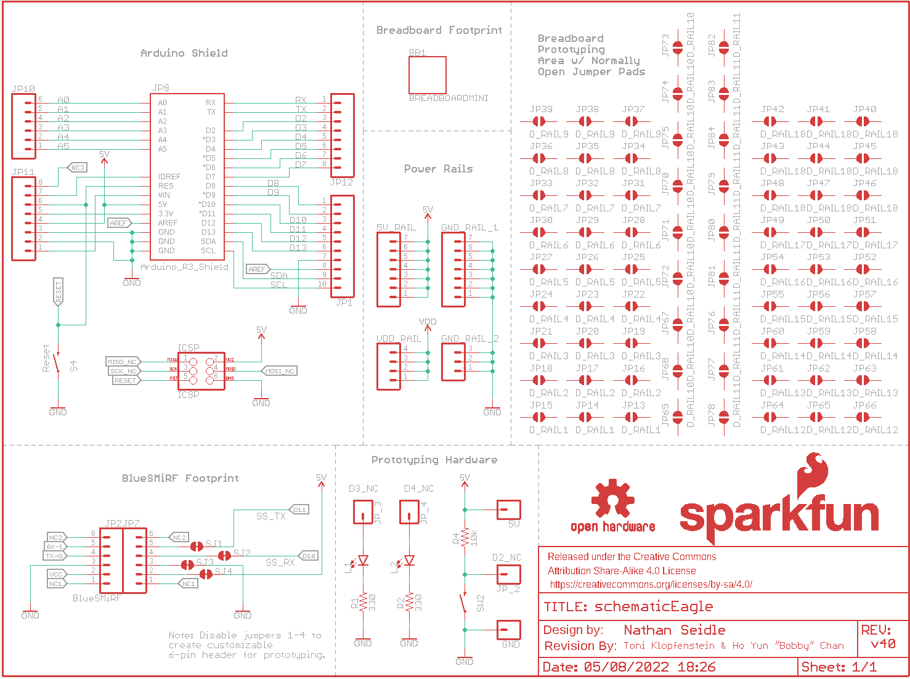
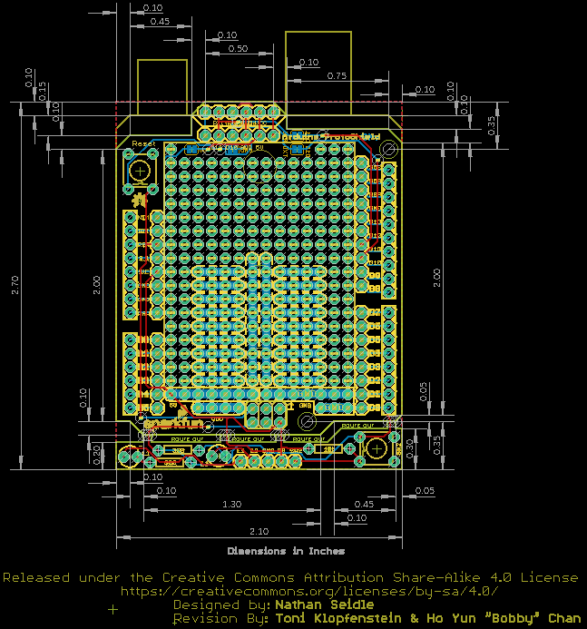

Contents
========

* [PRS13819 > Arduino ProtoShield Bare PCB](#prs13819--arduino-protoshield-bare-pcb)
	* [Schematic](#schematic)
	* [PCB](#pcb)
	* [Interactive BOM](#interactive-bom)
	* [OOMP Parts](#oomp-parts)
	* [Images](#images)
	* [Tags](#tags)
  
![][im]
# PRS13819 > Arduino ProtoShield Bare PCB

- ID: PROJ-SPAR-13819-STAN-01
- Hex ID: PRS13819
- Name: Sparkfun
- Description: Sparkfun
- Long Link: [http://oom.lt/PROJ-SPAR-13819-STAN-01](http://oom.lt/PROJ-SPAR-13819-STAN-01)
- Short Link: [http://oom.lt/PRS13819](http://oom.lt/PRS13819)

## Schematic
  

## PCB
  

## Interactive BOM

- Interactive BOM page: [ibom.html](https://htmlpreview.github.io/?https://github.com/oomlout/oomlout_OOMP_projects/blob/main/PROJ-SPAR-13819-STAN-01/kicad/bom/ibom.html)

## OOMP Parts
  

|OOMP Parts|
| :---: |
|HEAD-I01-X-PI01-01 5V, GND, JP_2, JP_3, JP_4|
|[HEAD-I01-X-PI07-01  2.54 mm 7 Pin Header  5V_RAIL, GND_RAIL_1](https://github.com/oomlout/oomlout_OOMP_parts/tree/main/HEAD-I01-X-PI07-01/)|
|UNMATCHED-UNMATCHED-X-UNMATCHED-01 BB1, ICSP, JP8, JP13, JP14, JP15, JP16, JP17, JP18, JP19, JP20, JP21, JP22, JP23, JP24, JP25, JP26, JP27, JP28, JP29, JP30, JP31, JP32, JP33, JP34, JP35, JP36, JP37, JP38, JP39, JP40, JP41, JP42, JP43, JP44, JP45, JP46, JP47, JP48, JP49, JP50, JP51, JP52, JP53, JP54, JP55, JP56, JP57, JP58, JP59, JP60, JP61, JP62, JP63, JP64, JP65, JP66, JP67, JP68, JP69, JP70, JP71, JP72, JP73, JP74, JP75, JP76, JP77, JP78, JP79, JP80, JP81, JP82, JP83, JP84, S4, SW2|
|[HEAD-I01-X-PI03-01  2.54 mm 3 Pin Header  GND_RAIL_2](https://github.com/oomlout/oomlout_OOMP_parts/tree/main/HEAD-I01-X-PI03-01/)|
|[HEAD-I01-X-PI10-01  2.54 mm 10 Pin Header  JP1](https://github.com/oomlout/oomlout_OOMP_parts/tree/main/HEAD-I01-X-PI10-01/)|
|[HEAD-I01-X-PI06-01  2.54 mm 6 Pin Header  JP2, JP7, JP10](https://github.com/oomlout/oomlout_OOMP_parts/tree/main/HEAD-I01-X-PI06-01/)|
|[HEAD-I01-X-PI08-01  2.54 mm 8 Pin Header  JP11, JP12](https://github.com/oomlout/oomlout_OOMP_parts/tree/main/HEAD-I01-X-PI08-01/)|
|LEDS-UNMATCHED-G-STAN-01 L1, L2|
|RESE-UNMATCHED-X-O331-01 R1, R2|
|RESE-UNMATCHED-X-O103-01 R4|
|[HEAD-I01-X-PI04-01  2.54 mm 4 Pin Header  VDD_RAIL](https://github.com/oomlout/oomlout_OOMP_parts/tree/main/HEAD-I01-X-PI04-01/)|

## Images
  
  

|kicadPcb3d|kicadPcb3dFront|kicadPcb3dBack|eagleImage|eagleSchemImage|
| :---: | :---: | :---: | :---: | :---: |
||||||

## Tags

- hexID: PRS13819
- oompType: PROJ
- oompSize: SPAR
- oompColor: 13819
- oompDesc: STAN
- oompIndex: 01
- oompName: Arduino ProtoShield Bare PCB
- sources: All source files from https://github.com/sparkfun/Arduino_ProtoShield_Bare_PCB (source licence details in srcLicense.md)
- linkBuyPage: https://www.sparkfun.com/products/13819
- oompID: PROJ-SPAR-13819-STAN-01
- oompParts: 5V,HEAD-I01-X-PI01-01
- oompParts: 5V_RAIL,HEAD-I01-X-PI07-01
- oompParts: BB1,UNMATCHED-UNMATCHED-X-UNMATCHED-01
- oompParts: GND,HEAD-I01-X-PI01-01
- oompParts: GND_RAIL_1,HEAD-I01-X-PI07-01
- oompParts: GND_RAIL_2,HEAD-I01-X-PI03-01
- oompParts: ICSP,UNMATCHED-UNMATCHED-X-UNMATCHED-01
- oompParts: JP1,HEAD-I01-X-PI10-01
- oompParts: JP2,HEAD-I01-X-PI06-01
- oompParts: JP7,HEAD-I01-X-PI06-01
- oompParts: JP8,UNMATCHED-UNMATCHED-X-UNMATCHED-01
- oompParts: JP10,HEAD-I01-X-PI06-01
- oompParts: JP11,HEAD-I01-X-PI08-01
- oompParts: JP12,HEAD-I01-X-PI08-01
- oompParts: JP13,UNMATCHED-UNMATCHED-X-UNMATCHED-01
- oompParts: JP14,UNMATCHED-UNMATCHED-X-UNMATCHED-01
- oompParts: JP15,UNMATCHED-UNMATCHED-X-UNMATCHED-01
- oompParts: JP16,UNMATCHED-UNMATCHED-X-UNMATCHED-01
- oompParts: JP17,UNMATCHED-UNMATCHED-X-UNMATCHED-01
- oompParts: JP18,UNMATCHED-UNMATCHED-X-UNMATCHED-01
- oompParts: JP19,UNMATCHED-UNMATCHED-X-UNMATCHED-01
- oompParts: JP20,UNMATCHED-UNMATCHED-X-UNMATCHED-01
- oompParts: JP21,UNMATCHED-UNMATCHED-X-UNMATCHED-01
- oompParts: JP22,UNMATCHED-UNMATCHED-X-UNMATCHED-01
- oompParts: JP23,UNMATCHED-UNMATCHED-X-UNMATCHED-01
- oompParts: JP24,UNMATCHED-UNMATCHED-X-UNMATCHED-01
- oompParts: JP25,UNMATCHED-UNMATCHED-X-UNMATCHED-01
- oompParts: JP26,UNMATCHED-UNMATCHED-X-UNMATCHED-01
- oompParts: JP27,UNMATCHED-UNMATCHED-X-UNMATCHED-01
- oompParts: JP28,UNMATCHED-UNMATCHED-X-UNMATCHED-01
- oompParts: JP29,UNMATCHED-UNMATCHED-X-UNMATCHED-01
- oompParts: JP30,UNMATCHED-UNMATCHED-X-UNMATCHED-01
- oompParts: JP31,UNMATCHED-UNMATCHED-X-UNMATCHED-01
- oompParts: JP32,UNMATCHED-UNMATCHED-X-UNMATCHED-01
- oompParts: JP33,UNMATCHED-UNMATCHED-X-UNMATCHED-01
- oompParts: JP34,UNMATCHED-UNMATCHED-X-UNMATCHED-01
- oompParts: JP35,UNMATCHED-UNMATCHED-X-UNMATCHED-01
- oompParts: JP36,UNMATCHED-UNMATCHED-X-UNMATCHED-01
- oompParts: JP37,UNMATCHED-UNMATCHED-X-UNMATCHED-01
- oompParts: JP38,UNMATCHED-UNMATCHED-X-UNMATCHED-01
- oompParts: JP39,UNMATCHED-UNMATCHED-X-UNMATCHED-01
- oompParts: JP40,UNMATCHED-UNMATCHED-X-UNMATCHED-01
- oompParts: JP41,UNMATCHED-UNMATCHED-X-UNMATCHED-01
- oompParts: JP42,UNMATCHED-UNMATCHED-X-UNMATCHED-01
- oompParts: JP43,UNMATCHED-UNMATCHED-X-UNMATCHED-01
- oompParts: JP44,UNMATCHED-UNMATCHED-X-UNMATCHED-01
- oompParts: JP45,UNMATCHED-UNMATCHED-X-UNMATCHED-01
- oompParts: JP46,UNMATCHED-UNMATCHED-X-UNMATCHED-01
- oompParts: JP47,UNMATCHED-UNMATCHED-X-UNMATCHED-01
- oompParts: JP48,UNMATCHED-UNMATCHED-X-UNMATCHED-01
- oompParts: JP49,UNMATCHED-UNMATCHED-X-UNMATCHED-01
- oompParts: JP50,UNMATCHED-UNMATCHED-X-UNMATCHED-01
- oompParts: JP51,UNMATCHED-UNMATCHED-X-UNMATCHED-01
- oompParts: JP52,UNMATCHED-UNMATCHED-X-UNMATCHED-01
- oompParts: JP53,UNMATCHED-UNMATCHED-X-UNMATCHED-01
- oompParts: JP54,UNMATCHED-UNMATCHED-X-UNMATCHED-01
- oompParts: JP55,UNMATCHED-UNMATCHED-X-UNMATCHED-01
- oompParts: JP56,UNMATCHED-UNMATCHED-X-UNMATCHED-01
- oompParts: JP57,UNMATCHED-UNMATCHED-X-UNMATCHED-01
- oompParts: JP58,UNMATCHED-UNMATCHED-X-UNMATCHED-01
- oompParts: JP59,UNMATCHED-UNMATCHED-X-UNMATCHED-01
- oompParts: JP60,UNMATCHED-UNMATCHED-X-UNMATCHED-01
- oompParts: JP61,UNMATCHED-UNMATCHED-X-UNMATCHED-01
- oompParts: JP62,UNMATCHED-UNMATCHED-X-UNMATCHED-01
- oompParts: JP63,UNMATCHED-UNMATCHED-X-UNMATCHED-01
- oompParts: JP64,UNMATCHED-UNMATCHED-X-UNMATCHED-01
- oompParts: JP65,UNMATCHED-UNMATCHED-X-UNMATCHED-01
- oompParts: JP66,UNMATCHED-UNMATCHED-X-UNMATCHED-01
- oompParts: JP67,UNMATCHED-UNMATCHED-X-UNMATCHED-01
- oompParts: JP68,UNMATCHED-UNMATCHED-X-UNMATCHED-01
- oompParts: JP69,UNMATCHED-UNMATCHED-X-UNMATCHED-01
- oompParts: JP70,UNMATCHED-UNMATCHED-X-UNMATCHED-01
- oompParts: JP71,UNMATCHED-UNMATCHED-X-UNMATCHED-01
- oompParts: JP72,UNMATCHED-UNMATCHED-X-UNMATCHED-01
- oompParts: JP73,UNMATCHED-UNMATCHED-X-UNMATCHED-01
- oompParts: JP74,UNMATCHED-UNMATCHED-X-UNMATCHED-01
- oompParts: JP75,UNMATCHED-UNMATCHED-X-UNMATCHED-01
- oompParts: JP76,UNMATCHED-UNMATCHED-X-UNMATCHED-01
- oompParts: JP77,UNMATCHED-UNMATCHED-X-UNMATCHED-01
- oompParts: JP78,UNMATCHED-UNMATCHED-X-UNMATCHED-01
- oompParts: JP79,UNMATCHED-UNMATCHED-X-UNMATCHED-01
- oompParts: JP80,UNMATCHED-UNMATCHED-X-UNMATCHED-01
- oompParts: JP81,UNMATCHED-UNMATCHED-X-UNMATCHED-01
- oompParts: JP82,UNMATCHED-UNMATCHED-X-UNMATCHED-01
- oompParts: JP83,UNMATCHED-UNMATCHED-X-UNMATCHED-01
- oompParts: JP84,UNMATCHED-UNMATCHED-X-UNMATCHED-01
- oompParts: JP_2,HEAD-I01-X-PI01-01
- oompParts: JP_3,HEAD-I01-X-PI01-01
- oompParts: JP_4,HEAD-I01-X-PI01-01
- oompParts: L1,LEDS-UNMATCHED-G-STAN-01
- oompParts: L2,LEDS-UNMATCHED-G-STAN-01
- oompParts: R1,RESE-UNMATCHED-X-O331-01
- oompParts: R2,RESE-UNMATCHED-X-O331-01
- oompParts: R4,RESE-UNMATCHED-X-O103-01
- oompParts: S4,UNMATCHED-UNMATCHED-X-UNMATCHED-01
- oompParts: SW2,UNMATCHED-UNMATCHED-X-UNMATCHED-01
- oompParts: VDD_RAIL,HEAD-I01-X-PI04-01
- rawParts: 5V,,CONN_01,1X01,Single connection point. Often used as Generic Header-pin footprint for 0.1 inch spaced/style header connections,,,,
- rawParts: 5V_RAIL,,CONN_07NO_SILK,1X07_NO_SILK,Multi connection point. Often used as Generic Header-pin footprint for 0.1 inch spaced/style header connections,,,,
- rawParts: BB1,BREADBOARDMINI,BREADBOARDMINI,BREADBOARD-MINI,SparkFun Breadboard Mini,COMP-12034,,,
- rawParts: FRAME1,FRAME-LETTER,FRAME-LETTER,CREATIVE_COMMONS,Schematic Frame - Letter,,,,
- rawParts: GND,,CONN_01,1X01,Single connection point. Often used as Generic Header-pin footprint for 0.1 inch spaced/style header connections,,,,
- rawParts: GND_RAIL_1,,CONN_07NO_SILK,1X07_NO_SILK,Multi connection point. Often used as Generic Header-pin footprint for 0.1 inch spaced/style header connections,,,,
- rawParts: GND_RAIL_2,,CONN_031X03_NO_SILK,1X03_NO_SILK,Multi connection point. Often used as Generic Header-pin footprint for 0.1 inch spaced/style header connections,,,,
- rawParts: ICSP,ICSP,AVR_SPI_PROG_3X2PTH,2X3,AVR ISP 6 Pin,,,,
- rawParts: JP1,,CONN_10,1X10,Multi connection point. Often used as Generic Header-pin footprint for 0.1 inch spaced/style header connections,CONN-11563,,,
- rawParts: JP2,BlueSMiRF,CONN_06SILK_FEMALE_PTH,1X06,Multi connection point. Often used as Generic Header-pin footprint for 0.1 inch spaced/style header connections,CONN-08437,,,
- rawParts: JP7,,CONN_06SILK_FEMALE_PTH,1X06,Multi connection point. Often used as Generic Header-pin footprint for 0.1 inch spaced/style header connections,CONN-08437,,,
- rawParts: JP8,ARDUINO_R3_SHIELDR3_PROTO_SHIELD,ARDUINO_R3_SHIELDR3_PROTO_SHIELD,UNO_R3_PROTO_SHIELD,Shield form compatible with the Arduino Uno R3.,,,,
- rawParts: JP10,,CONN_06SILK_FEMALE_PTH,1X06,Multi connection point. Often used as Generic Header-pin footprint for 0.1 inch spaced/style header connections,CONN-08437,,,
- rawParts: JP11,,CONN_08,1X08,Multi connection point. Often used as Generic Header-pin footprint for 0.1 inch spaced/style header connections,CONN-08438,,,
- rawParts: JP12,,CONN_08,1X08,Multi connection point. Often used as Generic Header-pin footprint for 0.1 inch spaced/style header connections,CONN-08438,,,
- rawParts: JP13,D_RAIL1,JUMPER-SMT_2_NO_NO-SILK,SMT-JUMPER_2_NO_NO-SILK,Normally open jumper,,,,
- rawParts: JP14,D_RAIL1,JUMPER-SMT_2_NO_NO-SILK,SMT-JUMPER_2_NO_NO-SILK,Normally open jumper,,,,
- rawParts: JP15,D_RAIL1,JUMPER-SMT_2_NO_NO-SILK,SMT-JUMPER_2_NO_NO-SILK,Normally open jumper,,,,
- rawParts: JP16,D_RAIL2,JUMPER-SMT_2_NO_NO-SILK,SMT-JUMPER_2_NO_NO-SILK,Normally open jumper,,,,
- rawParts: JP17,D_RAIL2,JUMPER-SMT_2_NO_NO-SILK,SMT-JUMPER_2_NO_NO-SILK,Normally open jumper,,,,
- rawParts: JP18,D_RAIL2,JUMPER-SMT_2_NO_NO-SILK,SMT-JUMPER_2_NO_NO-SILK,Normally open jumper,,,,
- rawParts: JP19,D_RAIL3,JUMPER-SMT_2_NO_NO-SILK,SMT-JUMPER_2_NO_NO-SILK,Normally open jumper,,,,
- rawParts: JP20,D_RAIL3,JUMPER-SMT_2_NO_NO-SILK,SMT-JUMPER_2_NO_NO-SILK,Normally open jumper,,,,
- rawParts: JP21,D_RAIL3,JUMPER-SMT_2_NO_NO-SILK,SMT-JUMPER_2_NO_NO-SILK,Normally open jumper,,,,
- rawParts: JP22,D_RAIL4,JUMPER-SMT_2_NO_NO-SILK,SMT-JUMPER_2_NO_NO-SILK,Normally open jumper,,,,
- rawParts: JP23,D_RAIL4,JUMPER-SMT_2_NO_NO-SILK,SMT-JUMPER_2_NO_NO-SILK,Normally open jumper,,,,
- rawParts: JP24,D_RAIL4,JUMPER-SMT_2_NO_NO-SILK,SMT-JUMPER_2_NO_NO-SILK,Normally open jumper,,,,
- rawParts: JP25,D_RAIL5,JUMPER-SMT_2_NO_NO-SILK,SMT-JUMPER_2_NO_NO-SILK,Normally open jumper,,,,
- rawParts: JP26,D_RAIL5,JUMPER-SMT_2_NO_NO-SILK,SMT-JUMPER_2_NO_NO-SILK,Normally open jumper,,,,
- rawParts: JP27,D_RAIL5,JUMPER-SMT_2_NO_NO-SILK,SMT-JUMPER_2_NO_NO-SILK,Normally open jumper,,,,
- rawParts: JP28,D_RAIL6,JUMPER-SMT_2_NO_NO-SILK,SMT-JUMPER_2_NO_NO-SILK,Normally open jumper,,,,
- rawParts: JP29,D_RAIL6,JUMPER-SMT_2_NO_NO-SILK,SMT-JUMPER_2_NO_NO-SILK,Normally open jumper,,,,
- rawParts: JP30,D_RAIL6,JUMPER-SMT_2_NO_NO-SILK,SMT-JUMPER_2_NO_NO-SILK,Normally open jumper,,,,
- rawParts: JP31,D_RAIL7,JUMPER-SMT_2_NO_NO-SILK,SMT-JUMPER_2_NO_NO-SILK,Normally open jumper,,,,
- rawParts: JP32,D_RAIL7,JUMPER-SMT_2_NO_NO-SILK,SMT-JUMPER_2_NO_NO-SILK,Normally open jumper,,,,
- rawParts: JP33,D_RAIL7,JUMPER-SMT_2_NO_NO-SILK,SMT-JUMPER_2_NO_NO-SILK,Normally open jumper,,,,
- rawParts: JP34,D_RAIL8,JUMPER-SMT_2_NO_NO-SILK,SMT-JUMPER_2_NO_NO-SILK,Normally open jumper,,,,
- rawParts: JP35,D_RAIL8,JUMPER-SMT_2_NO_NO-SILK,SMT-JUMPER_2_NO_NO-SILK,Normally open jumper,,,,
- rawParts: JP36,D_RAIL8,JUMPER-SMT_2_NO_NO-SILK,SMT-JUMPER_2_NO_NO-SILK,Normally open jumper,,,,
- rawParts: JP37,D_RAIL9,JUMPER-SMT_2_NO_NO-SILK,SMT-JUMPER_2_NO_NO-SILK,Normally open jumper,,,,
- rawParts: JP38,D_RAIL9,JUMPER-SMT_2_NO_NO-SILK,SMT-JUMPER_2_NO_NO-SILK,Normally open jumper,,,,
- rawParts: JP39,D_RAIL9,JUMPER-SMT_2_NO_NO-SILK,SMT-JUMPER_2_NO_NO-SILK,Normally open jumper,,,,
- rawParts: JP40,D_RAIL18,JUMPER-SMT_2_NO_NO-SILK,SMT-JUMPER_2_NO_NO-SILK,Normally open jumper,,,,
- rawParts: JP41,D_RAIL18,JUMPER-SMT_2_NO_NO-SILK,SMT-JUMPER_2_NO_NO-SILK,Normally open jumper,,,,
- rawParts: JP42,D_RAIL18,JUMPER-SMT_2_NO_NO-SILK,SMT-JUMPER_2_NO_NO-SILK,Normally open jumper,,,,
- rawParts: JP43,D_RAIL18,JUMPER-SMT_2_NO_NO-SILK,SMT-JUMPER_2_NO_NO-SILK,Normally open jumper,,,,
- rawParts: JP44,D_RAIL18,JUMPER-SMT_2_NO_NO-SILK,SMT-JUMPER_2_NO_NO-SILK,Normally open jumper,,,,
- rawParts: JP45,D_RAIL18,JUMPER-SMT_2_NO_NO-SILK,SMT-JUMPER_2_NO_NO-SILK,Normally open jumper,,,,
- rawParts: JP46,D_RAIL18,JUMPER-SMT_2_NO_NO-SILK,SMT-JUMPER_2_NO_NO-SILK,Normally open jumper,,,,
- rawParts: JP47,D_RAIL18,JUMPER-SMT_2_NO_NO-SILK,SMT-JUMPER_2_NO_NO-SILK,Normally open jumper,,,,
- rawParts: JP48,D_RAIL18,JUMPER-SMT_2_NO_NO-SILK,SMT-JUMPER_2_NO_NO-SILK,Normally open jumper,,,,
- rawParts: JP49,D_RAIL17,JUMPER-SMT_2_NO_NO-SILK,SMT-JUMPER_2_NO_NO-SILK,Normally open jumper,,,,
- rawParts: JP50,D_RAIL17,JUMPER-SMT_2_NO_NO-SILK,SMT-JUMPER_2_NO_NO-SILK,Normally open jumper,,,,
- rawParts: JP51,D_RAIL17,JUMPER-SMT_2_NO_NO-SILK,SMT-JUMPER_2_NO_NO-SILK,Normally open jumper,,,,
- rawParts: JP52,D_RAIL16,JUMPER-SMT_2_NO_NO-SILK,SMT-JUMPER_2_NO_NO-SILK,Normally open jumper,,,,
- rawParts: JP53,D_RAIL16,JUMPER-SMT_2_NO_NO-SILK,SMT-JUMPER_2_NO_NO-SILK,Normally open jumper,,,,
- rawParts: JP54,D_RAIL16,JUMPER-SMT_2_NO_NO-SILK,SMT-JUMPER_2_NO_NO-SILK,Normally open jumper,,,,
- rawParts: JP55,D_RAIL15,JUMPER-SMT_2_NO_NO-SILK,SMT-JUMPER_2_NO_NO-SILK,Normally open jumper,,,,
- rawParts: JP56,D_RAIL15,JUMPER-SMT_2_NO_NO-SILK,SMT-JUMPER_2_NO_NO-SILK,Normally open jumper,,,,
- rawParts: JP57,D_RAIL15,JUMPER-SMT_2_NO_NO-SILK,SMT-JUMPER_2_NO_NO-SILK,Normally open jumper,,,,
- rawParts: JP58,D_RAIL14,JUMPER-SMT_2_NO_NO-SILK,SMT-JUMPER_2_NO_NO-SILK,Normally open jumper,,,,
- rawParts: JP59,D_RAIL14,JUMPER-SMT_2_NO_NO-SILK,SMT-JUMPER_2_NO_NO-SILK,Normally open jumper,,,,
- rawParts: JP60,D_RAIL14,JUMPER-SMT_2_NO_NO-SILK,SMT-JUMPER_2_NO_NO-SILK,Normally open jumper,,,,
- rawParts: JP61,D_RAIL13,JUMPER-SMT_2_NO_NO-SILK,SMT-JUMPER_2_NO_NO-SILK,Normally open jumper,,,,
- rawParts: JP62,D_RAIL13,JUMPER-SMT_2_NO_NO-SILK,SMT-JUMPER_2_NO_NO-SILK,Normally open jumper,,,,
- rawParts: JP63,D_RAIL13,JUMPER-SMT_2_NO_NO-SILK,SMT-JUMPER_2_NO_NO-SILK,Normally open jumper,,,,
- rawParts: JP64,D_RAIL12,JUMPER-SMT_2_NO_NO-SILK,SMT-JUMPER_2_NO_NO-SILK,Normally open jumper,,,,
- rawParts: JP65,D_RAIL12,JUMPER-SMT_2_NO_NO-SILK,SMT-JUMPER_2_NO_NO-SILK,Normally open jumper,,,,
- rawParts: JP66,D_RAIL12,JUMPER-SMT_2_NO_NO-SILK,SMT-JUMPER_2_NO_NO-SILK,Normally open jumper,,,,
- rawParts: JP67,D_RAIL10,JUMPER-SMT_2_NO_NO-SILK,SMT-JUMPER_2_NO_NO-SILK,Normally open jumper,,,,
- rawParts: JP68,D_RAIL10,JUMPER-SMT_2_NO_NO-SILK,SMT-JUMPER_2_NO_NO-SILK,Normally open jumper,,,,
- rawParts: JP69,D_RAIL10,JUMPER-SMT_2_NO_NO-SILK,SMT-JUMPER_2_NO_NO-SILK,Normally open jumper,,,,
- rawParts: JP70,D_RAIL10,JUMPER-SMT_2_NO_NO-SILK,SMT-JUMPER_2_NO_NO-SILK,Normally open jumper,,,,
- rawParts: JP71,D_RAIL10,JUMPER-SMT_2_NO_NO-SILK,SMT-JUMPER_2_NO_NO-SILK,Normally open jumper,,,,
- rawParts: JP72,D_RAIL10,JUMPER-SMT_2_NO_NO-SILK,SMT-JUMPER_2_NO_NO-SILK,Normally open jumper,,,,
- rawParts: JP73,D_RAIL10,JUMPER-SMT_2_NO_NO-SILK,SMT-JUMPER_2_NO_NO-SILK,Normally open jumper,,,,
- rawParts: JP74,D_RAIL10,JUMPER-SMT_2_NO_NO-SILK,SMT-JUMPER_2_NO_NO-SILK,Normally open jumper,,,,
- rawParts: JP75,D_RAIL10,JUMPER-SMT_2_NO_NO-SILK,SMT-JUMPER_2_NO_NO-SILK,Normally open jumper,,,,
- rawParts: JP76,D_RAIL11,JUMPER-SMT_2_NO_NO-SILK,SMT-JUMPER_2_NO_NO-SILK,Normally open jumper,,,,
- rawParts: JP77,D_RAIL11,JUMPER-SMT_2_NO_NO-SILK,SMT-JUMPER_2_NO_NO-SILK,Normally open jumper,,,,
- rawParts: JP78,D_RAIL11,JUMPER-SMT_2_NO_NO-SILK,SMT-JUMPER_2_NO_NO-SILK,Normally open jumper,,,,
- rawParts: JP79,D_RAIL11,JUMPER-SMT_2_NO_NO-SILK,SMT-JUMPER_2_NO_NO-SILK,Normally open jumper,,,,
- rawParts: JP80,D_RAIL11,JUMPER-SMT_2_NO_NO-SILK,SMT-JUMPER_2_NO_NO-SILK,Normally open jumper,,,,
- rawParts: JP81,D_RAIL11,JUMPER-SMT_2_NO_NO-SILK,SMT-JUMPER_2_NO_NO-SILK,Normally open jumper,,,,
- rawParts: JP82,D_RAIL11,JUMPER-SMT_2_NO_NO-SILK,SMT-JUMPER_2_NO_NO-SILK,Normally open jumper,,,,
- rawParts: JP83,D_RAIL11,JUMPER-SMT_2_NO_NO-SILK,SMT-JUMPER_2_NO_NO-SILK,Normally open jumper,,,,
- rawParts: JP84,D_RAIL11,JUMPER-SMT_2_NO_NO-SILK,SMT-JUMPER_2_NO_NO-SILK,Normally open jumper,,,,
- rawParts: JP_2,,CONN_01,1X01,Single connection point. Often used as Generic Header-pin footprint for 0.1 inch spaced/style header connections,,,,
- rawParts: JP_3,,CONN_01,1X01,Single connection point. Often used as Generic Header-pin footprint for 0.1 inch spaced/style header connections,,,,
- rawParts: JP_4,,CONN_01,1X01,Single connection point. Often used as Generic Header-pin footprint for 0.1 inch spaced/style header connections,,,,
- rawParts: L1,,LED3MM,LED_3MM,LED (Generic),DIO-08794,,,
- rawParts: L2,,LED3MM,LED_3MM,LED (Generic),DIO-08794,,,
- rawParts: LOGO1,OSHW-LOGOS,OSHW-LOGOS,OSHW-LOGO-S,Open-Source Hardware (OSHW) Logo,,,,
- rawParts: R1,330,330OHM-HORIZ-1/10W-5%,AXIAL-0.3,330Ω resistor,RES-8371,,330,
- rawParts: R2,330,330OHM-HORIZ-1/10W-5%,AXIAL-0.3,330Ω resistor,RES-8371,,330,
- rawParts: R4,10k,10KOHM-HORIZ-1/4W-5%,AXIAL-0.3,10kΩ resistor,RES-09435,,10k,
- rawParts: S4,MOMENTARY-SWITCH-SPST-PTH-6.0MM,MOMENTARY-SWITCH-SPST-PTH-6.0MM,TACTILE_SWITCH_PTH_6.0MM,Momentary Switch (Pushbutton) - SPST, SWCH-08441,COM-00097,,
- rawParts: SJ1,JUMPER-SMT_2_NC_TRACE_SILK,JUMPER-SMT_2_NC_TRACE_SILK,SMT-JUMPER_2_NC_TRACE_SILK,Normally closed trace jumper,,,,
- rawParts: SJ2,JUMPER-SMT_2_NC_TRACE_SILK,JUMPER-SMT_2_NC_TRACE_SILK,SMT-JUMPER_2_NC_TRACE_SILK,Normally closed trace jumper,,,,
- rawParts: SJ3,JUMPER-SMT_2_NC_TRACE_SILK,JUMPER-SMT_2_NC_TRACE_SILK,SMT-JUMPER_2_NC_TRACE_SILK,Normally closed trace jumper,,,,
- rawParts: SJ4,JUMPER-SMT_2_NC_TRACE_SILK,JUMPER-SMT_2_NC_TRACE_SILK,SMT-JUMPER_2_NC_TRACE_SILK,Normally closed trace jumper,,,,
- rawParts: SW2,MOMENTARY-SWITCH-SPST-PTH-6.0MM,MOMENTARY-SWITCH-SPST-PTH-6.0MM,TACTILE_SWITCH_PTH_6.0MM,Momentary Switch (Pushbutton) - SPST, SWCH-08441,COM-00097,,
- rawParts: U$1,SFE_LOGO_NAME_FLAME.1_INCH,SFE_LOGO_NAME_FLAME.1_INCH,SFE_LOGO_NAME_FLAME_.1,SparkFun Font Logo w/ Flame,,,,
- rawParts: U$2,REVISION,REVISION,REVISION,,,,,
- rawParts: VDD_RAIL,,CONN_041X04_NO_SILK,1X04_NO_SILK,Multi connection point. Often used as Generic Header-pin footprint for 0.1 inch spaced/style header connections,CONN-09696,,,

[im]: kicadPcb3d_450.png
