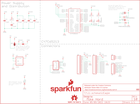

Contents
========

* [PRS13830 > USB UART Serial Breakout-CY7C65213](#prs13830--usb-uart-serial-breakout-cy7c65213)
	* [Schematic](#schematic)
	* [PCB](#pcb)
	* [Interactive BOM](#interactive-bom)
	* [OOMP Parts](#oomp-parts)
	* [Images](#images)
	* [Tags](#tags)
  
![][im]
# PRS13830 > USB UART Serial Breakout-CY7C65213

- ID: PROJ-SPAR-13830-STAN-01
- Hex ID: PRS13830
- Name: Sparkfun
- Description: Sparkfun
- Long Link: [http://oom.lt/PROJ-SPAR-13830-STAN-01](http://oom.lt/PROJ-SPAR-13830-STAN-01)
- Short Link: [http://oom.lt/PRS13830](http://oom.lt/PRS13830)

## Schematic
  

## PCB
  

## Interactive BOM

- Interactive BOM page: [ibom.html](https://htmlpreview.github.io/?https://github.com/oomlout/oomlout_OOMP_projects/blob/main/PROJ-SPAR-13830-STAN-01/kicad/bom/ibom.html)

## OOMP Parts
  

|OOMP Parts|
| :---: |
|[CAPC-0603-X-UF22D-V10  SMD (0603) 2.2 uF Capacitor (Ceramic) 10v  C1](https://github.com/oomlout/oomlout_OOMP_parts/tree/main/CAPC-0603-X-UF22D-V10/)|
|[CAPC-0603-X-UF1-V25  SMD (0603) 1 uF Capacitor (Ceramic) 25v  C2](https://github.com/oomlout/oomlout_OOMP_parts/tree/main/CAPC-0603-X-UF1-V25/)|
|CAPC-0603-X-UF1D-01 C3, C5|
|CAPC-UNMATCHED-X-UF47D-01 C4, C6|
|[CAPC-0603-X-PF10-V50  SMD (0603) 10 pF Capacitor (Ceramic) 50v  C7, C8](https://github.com/oomlout/oomlout_OOMP_parts/tree/main/CAPC-0603-X-PF10-V50/)|
|[LEDS-0603-R-STAN-01  SMD (0603) Red LED  D1](https://github.com/oomlout/oomlout_OOMP_parts/tree/main/LEDS-0603-R-STAN-01/)|
|[LEDS-0603-G-STAN-01  SMD (0603) Green LED  D2](https://github.com/oomlout/oomlout_OOMP_parts/tree/main/LEDS-0603-G-STAN-01/)|
|DIOD-S323-X-UNMATCHED-01 D3, D4, D5|
|UNMATCHED-UNMATCHED-X-UNMATCHED-01 J1, U1|
|[HEAD-I01-X-PI02-01  2.54 mm 2 Pin Header  J2](https://github.com/oomlout/oomlout_OOMP_parts/tree/main/HEAD-I01-X-PI02-01/)|
|HEAD-I01-X-UNMATCHED-01 J3|
|[HEAD-I01-X-PI12-01  2.54 mm 12 Pin Header  J4, J5](https://github.com/oomlout/oomlout_OOMP_parts/tree/main/HEAD-I01-X-PI12-01/)|
|RESE-0603-X-UNMATCHED-01 R1|
|[RESE-0603-X-O102-01  SMD (0603) 1k Ohm Resistor  R3, R4](https://github.com/oomlout/oomlout_OOMP_parts/tree/main/RESE-0603-X-O102-01/)|
|VREG-SO235-X-KAP2112K-V33D U2|

## Images
  
  

|kicadPcb3d|kicadPcb3dFront|kicadPcb3dBack|eagleImage|eagleSchemImage|
| :---: | :---: | :---: | :---: | :---: |
||||||

## Tags

- hexID: PRS13830
- oompType: PROJ
- oompSize: SPAR
- oompColor: 13830
- oompDesc: STAN
- oompIndex: 01
- oompName: USB UART Serial Breakout-CY7C65213
- sources: All source files from https://github.com/sparkfun/USB_UART_Serial_Breakout-CY7C65213 (source licence details in srcLicense.md)
- linkBuyPage: https://www.sparkfun.com/products/13830
- oompID: PROJ-SPAR-13830-STAN-01
- oompParts: C1,CAPC-0603-X-UF22D-V10
- oompParts: C2,CAPC-0603-X-UF1-V25
- oompParts: C3,CAPC-0603-X-UF1D-01
- oompParts: C4,CAPC-UNMATCHED-X-UF47D-01
- oompParts: C5,CAPC-0603-X-UF1D-01
- oompParts: C6,CAPC-UNMATCHED-X-UF47D-01
- oompParts: C7,CAPC-0603-X-PF10-V50
- oompParts: C8,CAPC-0603-X-PF10-V50
- oompParts: D1,LEDS-0603-R-STAN-01
- oompParts: D2,LEDS-0603-G-STAN-01
- oompParts: D3,DIOD-S323-X-UNMATCHED-01
- oompParts: D4,DIOD-S323-X-UNMATCHED-01
- oompParts: D5,DIOD-S323-X-UNMATCHED-01
- oompParts: J1,UNMATCHED-UNMATCHED-X-UNMATCHED-01
- oompParts: J2,HEAD-I01-X-PI02-01
- oompParts: J3,HEAD-I01-X-UNMATCHED-01
- oompParts: J4,HEAD-I01-X-PI12-01
- oompParts: J5,HEAD-I01-X-PI12-01
- oompParts: R1,RESE-0603-X-UNMATCHED-01
- oompParts: R3,RESE-0603-X-O102-01
- oompParts: R4,RESE-0603-X-O102-01
- oompParts: U1,UNMATCHED-UNMATCHED-X-UNMATCHED-01
- oompParts: U2,VREG-SO235-X-KAP2112K-V33D
- rawParts: C1,2.2uF,2.2UF-10V-20%(0603),0603-CAP,CAP-07888,CAP-07888,2.2uF,
- rawParts: C2,1.0uF,1.0UF-16V-10%(0603),0603-CAP,CAP-00868,CAP-00868,1.0uF,
- rawParts: C3,0.1uF,0.1UF-25V-5%(0603),0603-CAP,CAP-08604,CAP-08604,0.1uF,
- rawParts: C4,4.7uF,4.7UF-16V-20%,+80%-(1206),1206-CAP,CAP-10300,CAP-10300,4.7uF,
- rawParts: C5,0.1uF,0.1UF-25V-5%(0603),0603-CAP,CAP-08604,CAP-08604,0.1uF,
- rawParts: C6,4.7uF,4.7UF-16V-20%,+80%-(1206),1206-CAP,CAP-10300,CAP-10300,4.7uF,
- rawParts: C7,10pF,10PF-50V-5%(0603),0603-CAP,CAP-11812,CAP-11812,10pF,
- rawParts: C8,10pF,10PF-50V-5%(0603),0603-CAP,CAP-11812,CAP-11812,10pF,
- rawParts: D1,RED,LED-RED0603,LED-0603,Assorted Red LEDs,DIO-00819,RED,
- rawParts: D2,GREEN,LED-GREEN0603,LED-0603,Various green LEDs,DIO-00821,GREEN,
- rawParts: D3,PMEG4005EJ,DIODE-SCHOTTKY-PMEG4005EJ,SOD-323,Schottky diodes in SFEs production catalog,DIO-10955,PMEG4005EJ,
- rawParts: D4,5.6V,DIODE-ZENER5.6V,SOD-323,Zener Diode,DIO-12442,5.6V,
- rawParts: D5,PMEG4005EJ,DIODE-SCHOTTKY-PMEG4005EJ,SOD-323,Schottky diodes in SFEs production catalog,DIO-10955,PMEG4005EJ,
- rawParts: FD1,FIDUCIALUFIDUCIAL,FIDUCIALUFIDUCIAL,MICRO-FIDUCIAL,Fiducial Alignment Points,,,
- rawParts: FD2,FIDUCIALUFIDUCIAL,FIDUCIALUFIDUCIAL,MICRO-FIDUCIAL,Fiducial Alignment Points,,,
- rawParts: FRAME1,FRAME-LETTER,FRAME-LETTER,CREATIVE_COMMONS,Schematic Frame,,,
- rawParts: J1,MICROB,USB_MICROB_PLUGCONN-11752,USB-B-MICRO-SMD_V03,USB Micro-B connectors,CONN-11752,,
- rawParts: J2,,M02PTH,1X02,Standard 2-pin 0.1 header. Use with,,,
- rawParts: J3,FTDI_BASICPTH,FTDI_BASICPTH,FTDI_BASIC,FTDI Basic header with labels,,,
- rawParts: J4,,M12PTH,1X12,Header 12,,,
- rawParts: J5,,M12PTH,1X12,Header 12,,,
- rawParts: JP1,JUMPER-PAD-3-2OF3_NC_BY_PASTE,JUMPER-PAD-3-2OF3_NC_BY_PASTE,PAD-JUMPER-3-2OF3_NC_BY_PASTE_YES_SILK_FULL_BOX,,,,
- rawParts: JP2,JUMPER-PAD-2-NOYES_SILK,JUMPER-PAD-2-NOYES_SILK,PAD-JUMPER-2-NO_YES_SILK,,,,
- rawParts: LOGO1,SFE_LOGO_NAME_FLAME.1_INCH,SFE_LOGO_NAME_FLAME.1_INCH,SFE_LOGO_NAME_FLAME_.1,SFE Logo, name and flame,,,
- rawParts: LOGO2,OSHW-LOGOS,OSHW-LOGOS,OSHW-LOGO-S,Open Source Hardware Logo,,,
- rawParts: R1,0.27,0.27OHM-1/10W-1%(0603),0603-RES,RES-08787,RES-08787,,
- rawParts: R3,1K,1KOHM-1/10W-1%(0603),0603-RES,RES-07856,RES-07856,1K,
- rawParts: R4,1K,1KOHM-1/10W-1%(0603),0603-RES,RES-07856,RES-07856,1K,
- rawParts: U1,CY7C65213,CY7C65213,SSOP28DB,USB UART,IC-12487,,
- rawParts: U2,3.3V,V_REG_AP2112K-3.3V,SOT23-5,AP2112 - 600mA CMOS LDO Regulator w/ Enable,VREG-12457,3.3V,

[im]: kicadPcb3d_450.png
