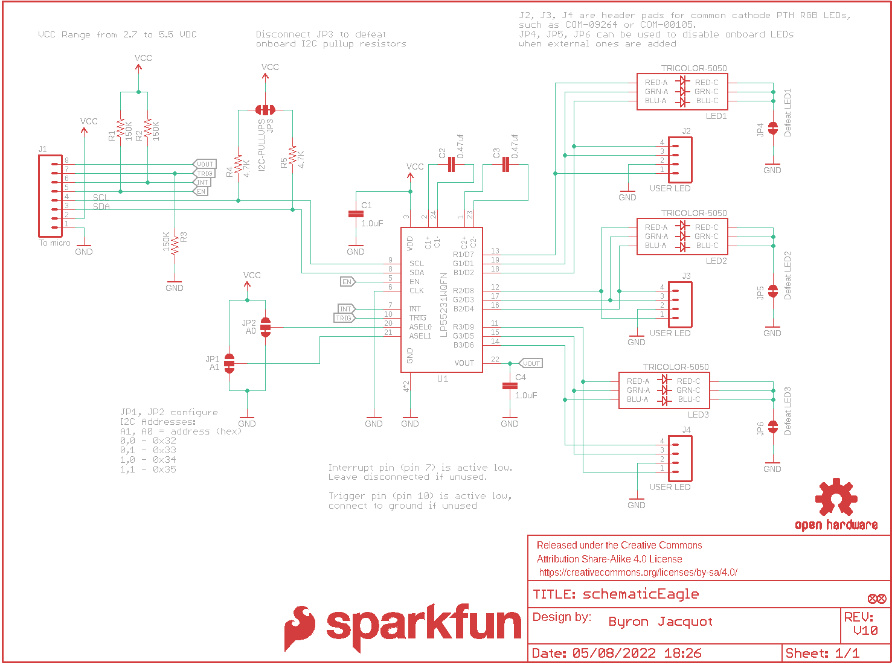
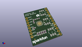
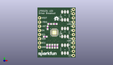
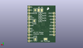
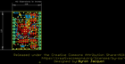
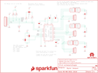

Contents
========

* [PRS13884 > LP55231 Breakout](#prs13884--lp55231-breakout)
	* [Schematic](#schematic)
	* [PCB](#pcb)
	* [Interactive BOM](#interactive-bom)
	* [OOMP Parts](#oomp-parts)
	* [Images](#images)
	* [Tags](#tags)
  
![][im]
# PRS13884 > LP55231 Breakout

- ID: PROJ-SPAR-13884-STAN-01
- Hex ID: PRS13884
- Name: Sparkfun
- Description: Sparkfun
- Long Link: [http://oom.lt/PROJ-SPAR-13884-STAN-01](http://oom.lt/PROJ-SPAR-13884-STAN-01)
- Short Link: [http://oom.lt/PRS13884](http://oom.lt/PRS13884)

## Schematic
  

## PCB
  

## Interactive BOM

- Interactive BOM page: [ibom.html](https://htmlpreview.github.io/?https://github.com/oomlout/oomlout_OOMP_projects/blob/main/PROJ-SPAR-13884-STAN-01/kicad/bom/ibom.html)

## OOMP Parts
  

|OOMP Parts|
| :---: |
|C1 C1,CAPC-0603-X-UF1-01|
|C2 C2,CAPC-0603-X-NF470-01|
|C3 C3,CAPC-0603-X-NF470-01|
|C4 C4,CAPC-0603-X-UF1-01|
|J1 J1,UNMATCHED-UNMATCHED-X-UNMATCHED-01|
|J2 J2,UNMATCHED-UNMATCHED-X-UNMATCHED-01|
|J3 J3,UNMATCHED-UNMATCHED-X-UNMATCHED-01|
|J4 J4,UNMATCHED-UNMATCHED-X-UNMATCHED-01|
|LED1 LED1,LEDS-5050-G-STAN-01|
|LED2 LED2,LEDS-5050-G-STAN-01|
|LED3 LED3,LEDS-5050-G-STAN-01|
|R1 R1,RESE-0603-X-O1503-01|
|R2 R2,RESE-0603-X-O1503-01|
|R3 R3,RESE-0603-X-O1503-01|
|[R4 RESE-0603-X-O472-01 SMD (0603) 4.7k Ohm Resistor](https://github.com/oomlout/oomlout_OOMP_parts/tree/main/RESE-0603-X-O472-01/)|
|[R5 RESE-0603-X-O472-01 SMD (0603) 4.7k Ohm Resistor](https://github.com/oomlout/oomlout_OOMP_parts/tree/main/RESE-0603-X-O472-01/)|
|U1 U1,UNMATCHED-UNMATCHED-X-UNMATCHED-01|

## Images
  
  

|kicadPcb3d|kicadPcb3dFront|kicadPcb3dBack|eagleImage|eagleSchemImage|
| :---: | :---: | :---: | :---: | :---: |
||||||

## Tags

- hexID: PRS13884
- oompType: PROJ
- oompSize: SPAR
- oompColor: 13884
- oompDesc: STAN
- oompIndex: 01
- oompName: LP55231 Breakout
- sources: All source files from https://github.com/sparkfun/LP55231_Breakout (source licence details in srcLicense.md)
- linkBuyPage: https://www.sparkfun.com/products/13884
- oompID: PROJ-SPAR-13884-STAN-01
- oompParts: C1,CAPC-0603-X-UF1-01
- oompParts: C2,CAPC-0603-X-NF470-01
- oompParts: C3,CAPC-0603-X-NF470-01
- oompParts: C4,CAPC-0603-X-UF1-01
- oompParts: J1,UNMATCHED-UNMATCHED-X-UNMATCHED-01
- oompParts: J2,UNMATCHED-UNMATCHED-X-UNMATCHED-01
- oompParts: J3,UNMATCHED-UNMATCHED-X-UNMATCHED-01
- oompParts: J4,UNMATCHED-UNMATCHED-X-UNMATCHED-01
- oompParts: LED1,LEDS-5050-G-STAN-01
- oompParts: LED2,LEDS-5050-G-STAN-01
- oompParts: LED3,LEDS-5050-G-STAN-01
- oompParts: R1,RESE-0603-X-O1503-01
- oompParts: R2,RESE-0603-X-O1503-01
- oompParts: R3,RESE-0603-X-O1503-01
- oompParts: R4,RESE-0603-X-O472-01
- oompParts: R5,RESE-0603-X-O472-01
- oompParts: U1,UNMATCHED-UNMATCHED-X-UNMATCHED-01
- rawParts: C1,1.0uF,1.0UF-16V-10%(0603),0603-CAP,CAP-00868,CAP-00868,,1.0uF,
- rawParts: C2,0.47uf,CAP0603-CAP,0603-CAP,Capacitor,CAP-13216,battery-babysitter,,
- rawParts: C3,0.47uf,CAP0603-CAP,0603-CAP,Capacitor,CAP-13216,battery bayasitter,,
- rawParts: C4,1.0uF,1.0UF-16V-10%(0603),0603-CAP,CAP-00868,CAP-00868,,1.0uF,
- rawParts: FD1,FIDUCIALUFIDUCIAL,FIDUCIALUFIDUCIAL,MICRO-FIDUCIAL,Fiducial Alignment Points,,,,
- rawParts: FD2,FIDUCIALUFIDUCIAL,FIDUCIALUFIDUCIAL,MICRO-FIDUCIAL,Fiducial Alignment Points,,,,
- rawParts: FRAME1,FRAME-LETTER,FRAME-LETTER,CREATIVE_COMMONS,Schematic Frame,,,,
- rawParts: J1,To micro,M08NO_SILK_FEMALE_PTH,1X08_NO_SILK,Header 8,CONN-08438,,,
- rawParts: J2,USER LED,M04NO_SILK_ALL_ROUND,1X04_NO_SILK_ALL_ROUND,Header 4,CONN-09696,,,
- rawParts: J3,USER LED,M04NO_SILK_ALL_ROUND,1X04_NO_SILK_ALL_ROUND,Header 4,CONN-09696,,,
- rawParts: J4,USER LED,M04NO_SILK_ALL_ROUND,1X04_NO_SILK_ALL_ROUND,Header 4,CONN-09696,,,
- rawParts: JP1,A1,JUMPER-PAD-3-2OF3_NC_BY_TRACE_SMALL,PAD-JUMPER-3-2OF3_NC_BY_TRACE_YES_SILK_FULL_BOX,,,,,
- rawParts: JP2,A0,JUMPER-PAD-3-2OF3_NC_BY_TRACE_SMALL,PAD-JUMPER-3-2OF3_NC_BY_TRACE_YES_SILK_FULL_BOX,,,,,
- rawParts: JP3,I2C-PULLUPS,JUMPER-PAD-3-NC_BY_TRACE,PAD-JUMPER-3-3OF3_NC_BY_TRACE_YES_SILK_FULL_BOX,,,,,
- rawParts: JP4,Defeat LED1,JUMPER-PAD-2-NC_BY_TRACENO_SILK,PAD-JUMPER-2-NC_BY_TRACE_NO_SILK,,,,,
- rawParts: JP5,Defeat LED2,JUMPER-PAD-2-NC_BY_TRACENO_SILK,PAD-JUMPER-2-NC_BY_TRACE_NO_SILK,,,,,
- rawParts: JP6,Defeat LED3,JUMPER-PAD-2-NC_BY_TRACENO_SILK,PAD-JUMPER-2-NC_BY_TRACE_NO_SILK,,,,,
- rawParts: LED1,TRICOLOR-5050,LED-TRICOLOR-5050NO_IC,LED-TRICOLOR-5050,,DIO-10298,,,
- rawParts: LED2,TRICOLOR-5050,LED-TRICOLOR-5050NO_IC,LED-TRICOLOR-5050,,DIO-10298,,,
- rawParts: LED3,TRICOLOR-5050,LED-TRICOLOR-5050NO_IC,LED-TRICOLOR-5050,,DIO-10298,,,
- rawParts: LOGO1,SFE_LOGO_FLAME.1_INCH,SFE_LOGO_FLAME.1_INCH,SFE_LOGO_FLAME_.1,SFE Logo, flame only,,,,
- rawParts: LOGO2,SFE_LOGO_NAME.1_INCH,SFE_LOGO_NAME.1_INCH,SFE_LOGO_NAME_.1,SFE Logo, name only,,,,
- rawParts: LOGO3,OSHW-LOGOS,OSHW-LOGOS,OSHW-LOGO-S,Open Source Hardware Logo,,,,
- rawParts: R1,150K,150KOHM1/10W1%(0603),0603-RES,RES-09117,RES-09117,,150K,
- rawParts: R2,150K,150KOHM1/10W1%(0603),0603-RES,RES-09117,RES-09117,,150K,
- rawParts: R3,150K,150KOHM1/10W1%(0603),0603-RES,RES-09117,RES-09117,,150K,
- rawParts: R4,4.7K,4.7KOHM-1/10W-1%(0603),0603-RES,RES-07857,RES-07857,,4.7K,
- rawParts: R5,4.7K,4.7KOHM-1/10W-1%(0603),0603-RES,RES-07857,RES-07857,,4.7K,
- rawParts: U1,LP55231WQFN,LP55231WQFN,WQFN-24,,IC-13302,,,

[im]: kicadPcb3d_450.png
