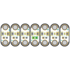
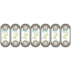
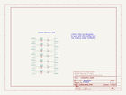
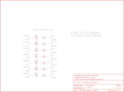
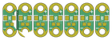
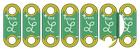

Contents
========

* [PRS13903 > LilyPad LED Rainbow](#prs13903--lilypad-led-rainbow)
	* [Schematic](#schematic)
	* [PCB](#pcb)
	* [Interactive BOM](#interactive-bom)
	* [OOMP Parts](#oomp-parts)
	* [Images](#images)
	* [Tags](#tags)
  
![][im]
# PRS13903 > LilyPad LED Rainbow

- ID: PROJ-SPAR-13903-STAN-01
- Hex ID: PRS13903
- Name: Sparkfun
- Description: Sparkfun
- Long Link: [http://oom.lt/PROJ-SPAR-13903-STAN-01](http://oom.lt/PROJ-SPAR-13903-STAN-01)
- Short Link: [http://oom.lt/PRS13903](http://oom.lt/PRS13903)

## Schematic
  

## PCB
  

## Interactive BOM

- Interactive BOM page: [ibom.html](https://htmlpreview.github.io/?https://github.com/oomlout/oomlout_OOMP_projects/blob/main/PROJ-SPAR-13903-STAN-01/kicad/bom/ibom.html)

## OOMP Parts
  

|OOMP ID|Name|Identifier|
| :---: | :---: | :---: |
|LEDS-1206-G-STAN-01||LED1, LED5, LED7|
|LEDS-1206-P-STAN-01||LED2|
|LEDS-1206-R-STAN-01||LED3|
|LEDS-1206-Y-STAN-01||LED4|
|LEDS-1206-L-STAN-01||LED6|
|[RESE-0603-X-O151-01](https://github.com/oomlout/oomlout_OOMP_parts/tree/main/RESE-0603-X-O151-01/)|[SMD (0603) 150 Ohm Resistor](https://github.com/oomlout/oomlout_OOMP_parts/tree/main/RESE-0603-X-O151-01/)|[R1, R2, R3, R4, R5, R6, R7](https://github.com/oomlout/oomlout_OOMP_parts/tree/main/RESE-0603-X-O151-01/)|

## Images
  
  

|bominteractivefront|bominteractiveback|kicadPcb3d|kicadPcb3dFront|kicadPcb3dBack|kicadSchem|eagleImage|eagleSchemImage|pcbdraw|pcbdrawback|
| :---: | :---: | :---: | :---: | :---: | :---: | :---: | :---: | :---: | :---: |
|||||||||||

## Tags

- hexID: PRS13903
- oompType: PROJ
- oompSize: SPAR
- oompColor: 13903
- oompDesc: STAN
- oompIndex: 01
- oompName: LilyPad LED Rainbow
- sources: All source files from https://github.com/sparkfun/LilyPad_LED_Rainbow (source licence details in srcLicense.md)
- linkBuyPage: https://www.sparkfun.com/products/13903
- oompID: PROJ-SPAR-13903-STAN-01
- oompParts: LED1,LEDS-1206-G-STAN-01
- oompParts: LED2,LEDS-1206-P-STAN-01
- oompParts: LED3,LEDS-1206-R-STAN-01
- oompParts: LED4,LEDS-1206-Y-STAN-01
- oompParts: LED5,LEDS-1206-G-STAN-01
- oompParts: LED6,LEDS-1206-L-STAN-01
- oompParts: LED7,LEDS-1206-G-STAN-01
- oompParts: R1,RESE-0603-X-O151-01
- oompParts: R2,RESE-0603-X-O151-01
- oompParts: R3,RESE-0603-X-O151-01
- oompParts: R4,RESE-0603-X-O151-01
- oompParts: R5,RESE-0603-X-O151-01
- oompParts: R6,RESE-0603-X-O151-01
- oompParts: R7,RESE-0603-X-O151-01
- rawParts: FRAME1,FRAME-LETTER,FRAME-LETTER,CREATIVE_COMMONS,Schematic Frame,,,,
- rawParts: LED+1,SEWTAP6,SEWTAP6,PETAL-SMALL-2SIDE,Sew Taps for LilyPad Boards.,,,,
- rawParts: LED+2,SEWTAP6,SEWTAP6,PETAL-SMALL-2SIDE,Sew Taps for LilyPad Boards.,,,,
- rawParts: LED+3,SEWTAP6,SEWTAP6,PETAL-SMALL-2SIDE,Sew Taps for LilyPad Boards.,,,,
- rawParts: LED+4,SEWTAP6,SEWTAP6,PETAL-SMALL-2SIDE,Sew Taps for LilyPad Boards.,,,,
- rawParts: LED+5,SEWTAP6,SEWTAP6,PETAL-SMALL-2SIDE,Sew Taps for LilyPad Boards.,,,,
- rawParts: LED+6,SEWTAP6,SEWTAP6,PETAL-SMALL-2SIDE,Sew Taps for LilyPad Boards.,,,,
- rawParts: LED+7,SEWTAP6,SEWTAP6,PETAL-SMALL-2SIDE,Sew Taps for LilyPad Boards.,,,,
- rawParts: LED-1,SEWTAP6,SEWTAP6,PETAL-SMALL-2SIDE,Sew Taps for LilyPad Boards.,,,,
- rawParts: LED-2,SEWTAP6,SEWTAP6,PETAL-SMALL-2SIDE,Sew Taps for LilyPad Boards.,,,,
- rawParts: LED-3,SEWTAP6,SEWTAP6,PETAL-SMALL-2SIDE,Sew Taps for LilyPad Boards.,,,,
- rawParts: LED-4,SEWTAP6,SEWTAP6,PETAL-SMALL-2SIDE,Sew Taps for LilyPad Boards.,,,,
- rawParts: LED-5,SEWTAP6,SEWTAP6,PETAL-SMALL-2SIDE,Sew Taps for LilyPad Boards.,,,,
- rawParts: LED-6,SEWTAP6,SEWTAP6,PETAL-SMALL-2SIDE,Sew Taps for LilyPad Boards.,,,,
- rawParts: LED-7,SEWTAP6,SEWTAP6,PETAL-SMALL-2SIDE,Sew Taps for LilyPad Boards.,,,,
- rawParts: LED1,WHITE,LED-WHITE1206,LED-1206,White SMD LEDs,,DIO-09955,WHITE,
- rawParts: LED2,PINK,LED-PINK1206,LED-1206,Various Pink LEDs,,DIO-10415,PINK,
- rawParts: LED3,RED,LED-REDLILYPAD,LED-1206,Assorted Red LEDs,,DIO-09912,RED,
- rawParts: LED4,YELLOW,LED-YELLOWLILYPAD,LED-1206,Yellow SMD LEDs,,DIO-09909,Yellow,
- rawParts: LED5,GREEN,LED-GREENLILYPAD,LED-1206,Various green LEDs,,DIO-09910,GREEN,
- rawParts: LED6,BLUE,LED-BLUE1206,LED-1206,Blue LEDs for production use,,DIO-09911,BLUE,
- rawParts: LED7,WHITE,LED-WHITE1206,LED-1206,White SMD LEDs,,DIO-09955,WHITE,
- rawParts: R1,150,150OHM-1/10W-1%(0603),0603-RES,RES-11028,13326,,150,
- rawParts: R2,150,150OHM-1/10W-1%(0603),0603-RES,RES-11028,13326,,150,
- rawParts: R3,150,150OHM-1/10W-1%(0603),0603-RES,RES-11028,13326,,150,
- rawParts: R4,150,150OHM-1/10W-1%(0603),0603-RES,RES-11028,13326,,150,
- rawParts: R5,150,150OHM-1/10W-1%(0603),0603-RES,RES-11028,13326,,150,
- rawParts: R6,150,150OHM-1/10W-1%(0603),0603-RES,RES-11028,13326,,150,
- rawParts: R7,150,150OHM-1/10W-1%(0603),0603-RES,RES-11028,13326,,150,
- rawParts: U$1,REVISION,REVISION,REVISION,,,,,

[im]: kicadPcb3d_450.png
