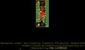
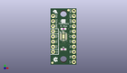
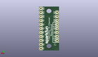
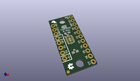

Contents
========

* [PROJ-SPAR-13906-STAN-01>74HC4051 8-Channel Mux Breakout](#proj-spar-13906-stan-0174hc4051-8-channel-mux-breakout)
	* [Images](#images)
	* [Interactive BOM](#interactive-bom)
	* [OOMP Parts](#oomp-parts)
	* [Tags](#tags)
  
![][im]
# PROJ-SPAR-13906-STAN-01>74HC4051 8-Channel Mux Breakout

- ID: PROJ-SPAR-13906-STAN-01
- Hex ID: PRS13906
- Name: 74HC4051 8-Channel Mux Breakout
- Description: 

## Images
  
  

|eagleImage|kicadPcb3dFront|kicadPcb3dBack|kicadPcb3d|
| :---: | :---: | :---: | :---: |
|||||

## Interactive BOM

- Interactive BOM page: [ibom.html](kicad/bom/ibom.html)

## OOMP Parts
  

|OOMP Parts|
| :---: |
|<table><tr><td></td><td> C1</td><td>[CAPC-0603-X-NF100-V50 SMD (0603) 100 nF Capacitor (Ceramic) 50v](https://github.com/oomlout/oomlout_OOMP_parts/tree/main/CAPC-0603-X-NF100-V50/)</td><td>[C6N100](https://github.com/oomlout/oomlout_OOMP_parts/tree/main/CAPC-0603-X-NF100-V50/)</td></tr></table>|
|UNMATCHED-UNMATCHED-X-UNMATCHED-01, J1, 11.43, 1.27, M90,J1, 1X11, SparkFun-Connectors, (0.45, 0.05), MR90|
|UNMATCHED-UNMATCHED-X-UNMATCHED-01, J2, 1.27, 6.35, M90,J2, 1X08_ROUND, SparkFun-Connectors, (0.05, 0.25), MR90|
|<table><tr><td></td><td> R1</td><td>[RESE-0603-X-O103-01 SMD (0603) 10k Ohm Resistor](https://github.com/oomlout/oomlout_OOMP_parts/tree/main/RESE-0603-X-O103-01/)</td><td>[R6103](https://github.com/oomlout/oomlout_OOMP_parts/tree/main/RESE-0603-X-O103-01/)</td></tr></table>|
|UNMATCHED-UNMATCHED-X-UNMATCHED-01, U1, 6.35, 13.97, 270,U1, DHVQFN-16-2.5X3.5MM, SparkFun-IC-Logic, (0.25, 0.55), R270|

## Tags

- hexID: PRS13906
- oompType: PROJ
- oompSize: SPAR
- oompColor: 13906
- oompDesc: STAN
- oompIndex: 01
- oompName: 74HC4051 8-Channel Mux Breakout
- sources: All source files from https://github.com/sparkfun/74HC4051_8-Channel_Mux_Breakout (source licence details in srcLicense.md)
- linkBuyPage: https://www.sparkfun.com/products/13906
- oompID: PROJ-SPAR-13906-STAN-01
- oompPart: CAPC-0603-X-NF100-V50, C1, 6.35, 17.779999999999998, 180
- oompPart: SKIP-UNMATCHED-X-UNMATCHED-01, FD1, 0.889, 0.889, 0
- oompPart: SKIP-UNMATCHED-X-UNMATCHED-01, FD2, 8.762999999999998, 27.051, 0
- oompPart: UNMATCHED-UNMATCHED-X-UNMATCHED-01, J1, 11.43, 1.27, M90
- oompPart: UNMATCHED-UNMATCHED-X-UNMATCHED-01, J2, 1.27, 6.35, M90
- oompPart: SKIP-UNMATCHED-X-UNMATCHED-01, JP1, 6.35, 21.59, 90
- oompPart: RESE-0603-X-O103-01, R1, 6.35, 7.619999999999999, 0
- oompPart: UNMATCHED-UNMATCHED-X-UNMATCHED-01, U1, 6.35, 13.97, 270
- rawPart: C1, 0.1uF, 0603, SparkFun-Capacitors, (0.25, 0.7), R180
- rawPart: FD1, FIDUCIAL1X2, FIDUCIAL-1X2, SparkFun-Aesthetics, (0.035, 0.035), R0
- rawPart: FD2, FIDUCIAL1X2, FIDUCIAL-1X2, SparkFun-Aesthetics, (0.345, 1.065), R0
- rawPart: J1, 1X11, SparkFun-Connectors, (0.45, 0.05), MR90
- rawPart: J2, 1X08_ROUND, SparkFun-Connectors, (0.05, 0.25), MR90
- rawPart: JP1, VEE-GND, PAD-JUMPER-2-NC_BY_PASTE_NO_SILK, SparkFun-Passives, (0.25, 0.85), R90
- rawPart: R1, 10k, 0603, SparkFun-Resistors, (0.25, 0.3), R0
- rawPart: U1, DHVQFN-16-2.5X3.5MM, SparkFun-IC-Logic, (0.25, 0.55), R270

[im]: kicadPcb3d_450.png
