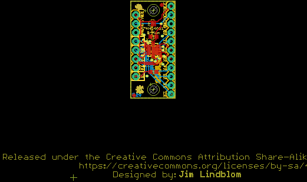
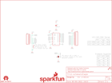

Contents
========

* [PRS13906 > 74HC4051 8-Channel Mux Breakout](#prs13906--74hc4051-8-channel-mux-breakout)
	* [Schematic](#schematic)
	* [PCB](#pcb)
	* [Interactive BOM](#interactive-bom)
	* [OOMP Parts](#oomp-parts)
	* [Images](#images)
	* [Tags](#tags)
  
![][im]
# PRS13906 > 74HC4051 8-Channel Mux Breakout

- ID: PROJ-SPAR-13906-STAN-01
- Hex ID: PRS13906
- Name: Sparkfun
- Description: Sparkfun
- Long Link: [http://oom.lt/PROJ-SPAR-13906-STAN-01](http://oom.lt/PROJ-SPAR-13906-STAN-01)
- Short Link: [http://oom.lt/PRS13906](http://oom.lt/PRS13906)

## Schematic
  

## PCB
  

## Interactive BOM

- Interactive BOM page: [ibom.html](https://htmlpreview.github.io/?https://github.com/oomlout/oomlout_OOMP_projects/blob/main/PROJ-SPAR-13906-STAN-01/kicad/bom/ibom.html)

## OOMP Parts
  

|OOMP Parts|
| :---: |
|C1 C1,CAPC-0603-X-UF1D-01|
|J1 J1,UNMATCHED-UNMATCHED-X-UNMATCHED-01|
|J2 J2,UNMATCHED-UNMATCHED-X-UNMATCHED-01|
|[R1 RESE-0603-X-O103-01 SMD (0603) 10k Ohm Resistor](https://github.com/oomlout/oomlout_OOMP_parts/tree/main/RESE-0603-X-O103-01/)|
|U1 U1,UNMATCHED-UNMATCHED-X-UNMATCHED-01|

## Images
  
  

|kicadPcb3d|kicadPcb3dFront|kicadPcb3dBack|eagleImage|eagleSchemImage|
| :---: | :---: | :---: | :---: | :---: |
||||||

## Tags

- hexID: PRS13906
- oompType: PROJ
- oompSize: SPAR
- oompColor: 13906
- oompDesc: STAN
- oompIndex: 01
- oompName: 74HC4051 8-Channel Mux Breakout
- sources: All source files from https://github.com/sparkfun/74HC4051_8-Channel_Mux_Breakout (source licence details in srcLicense.md)
- linkBuyPage: https://www.sparkfun.com/products/13906
- oompID: PROJ-SPAR-13906-STAN-01
- oompParts: C1,CAPC-0603-X-UF1D-01
- oompParts: J1,UNMATCHED-UNMATCHED-X-UNMATCHED-01
- oompParts: J2,UNMATCHED-UNMATCHED-X-UNMATCHED-01
- oompParts: R1,RESE-0603-X-O103-01
- oompParts: U1,UNMATCHED-UNMATCHED-X-UNMATCHED-01
- rawParts: C1,0.1uF,0.1UF-0603-25V-(+80/-20%),0603,0.1µF ceramic capacitors,CAP-00810,0.1uF,
- rawParts: FD1,FIDUCIAL1X2,FIDUCIAL1X2,FIDUCIAL-1X2,Fiducial Alignment Points,,,
- rawParts: FD2,FIDUCIAL1X2,FIDUCIAL1X2,FIDUCIAL-1X2,Fiducial Alignment Points,,,
- rawParts: FRAME1,FRAME-LETTER,FRAME-LETTER,CREATIVE_COMMONS,Schematic Frame,,,
- rawParts: H1,STAND-OFF,STAND-OFF,STAND-OFF,#4 Stand Off,,,
- rawParts: H2,STAND-OFF,STAND-OFF,STAND-OFF,#4 Stand Off,,,
- rawParts: J1,,M11PTH,1X11,Header 11,,,
- rawParts: J2,,M08,1X08_ROUND,Header 8,CONN-08437,,
- rawParts: JP1,VEE-GND,JUMPER-PAD-2-NC_BY_PASTENO-SILK,PAD-JUMPER-2-NC_BY_PASTE_NO_SILK,,,,
- rawParts: LOGO1,SFE_LOGO_FLAME.1_INCH,SFE_LOGO_FLAME.1_INCH,SFE_LOGO_FLAME_.1,SFE Logo, flame only,,,
- rawParts: LOGO2,OSHW-LOGOMINI,OSHW-LOGOMINI,OSHW-LOGO-MINI,Open Source Hardware Logo,,,
- rawParts: LOGO3,SFE_LOGO_NAME.1_INCH,SFE_LOGO_NAME.1_INCH,SFE_LOGO_NAME_.1,SFE Logo, name only,,,
- rawParts: R1,10k,10KOHM-0603-1/10W-1%,0603,10kΩ resistor,RES-00824,10k,
- rawParts: U1,,74HC4051BQ,DHVQFN-16-2.5X3.5MM,NXP 74HC4051 8-Channel Analog Multiplexer/Demultiplexer,IC-13334,,

[im]: kicadPcb3d_450.png
