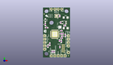
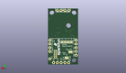
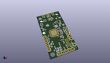

Contents
========

* [PROJ-SPAR-13911-STAN-01>Serial Controlled Motor Driver](#proj-spar-13911-stan-01serial-controlled-motor-driver)
	* [Images](#images)
	* [Interactive BOM](#interactive-bom)
	* [OOMP Parts](#oomp-parts)
	* [Tags](#tags)
  
![][im]
# PROJ-SPAR-13911-STAN-01>Serial Controlled Motor Driver

- ID: PROJ-SPAR-13911-STAN-01
- Hex ID: PRS13911
- Name: Serial Controlled Motor Driver
- Description: 

## Images
  
  

|eagleImage|kicadPcb3dFront|kicadPcb3dBack|kicadPcb3d|
| :---: | :---: | :---: | :---: |
|||||

## Interactive BOM

- Interactive BOM page: [ibom.html](kicad/bom/ibom.html)

## OOMP Parts
  

|OOMP Parts|
| :---: |
|CAPC-0402-X-UNMATCHED-01, C1, 12.303125, 12.858749999999999, 270,C1, 1.0uF, 0402, SparkFun-Capacitors, (0.484375, 0.50625), R270|
|CAPC-0402-X-UNMATCHED-01, C2, 13.97, 14.76375, 0,C2, 1.0uF, 0402, SparkFun-Capacitors, (0.55, 0.58125), R0|
|CAPC-0402-X-UNMATCHED-01, C3, 15.017750000000001, 18.0975, 90,C3, 1.0uF, 0402, SparkFun-Capacitors, (0.59125, 0.7125), R90|
|CAPC-0402-X-UNMATCHED-01, C4, 13.811249999999998, 20.32, 0,C4, 1.0uF, 0402, SparkFun-Capacitors, (0.54375, 0.8), R0|
|CAPC-0402-X-NF100-V50, C5, 14.44625, 16.1925, 0,C5, 0.1uF, 0402, SparkFun-Capacitors, (0.56875, 0.6375), R0|
|CAPC-0402-X-NF100-V50, C6, 13.652499999999998, 18.0975, 90,C6, 0.1uF, 0402, SparkFun-Capacitors, (0.5375, 0.7125), R90|
|CAPC-0402-X-NF100-V50, C7, 12.7, 8.016874999999999, 270,C7, 0.1uF, 0402, SparkFun-Capacitors, (0.5, 0.315625), R270|
|CAPC-0402-X-UNMATCHED-01, C8, 13.342937499999998, 26.669999999999998, 90,C8, 1.0uF, 0402, SparkFun-Capacitors, (0.5253125, 1.05), R90|
|CAPC-0402-X-UNMATCHED-01, C9, 16.3274375, 24.471312499999996, 180,C9, 1.0uF, 0402, SparkFun-Capacitors, (0.6428125, 0.9634375), R180|
|CAPC-UNMATCHED-X-UNMATCHED-01, C10, 16.98625, 22.38375, 0,C10, 10uF, EIA3216, SparkFun-Capacitors, (0.66875, 0.88125), R0|
|CAPC-0402-X-NF100-V50, C11, 12.54125, 31.670624999999998, 270,C11, 0.1uF, 0402, SparkFun-Capacitors, (0.49375, 1.246875), R270|
|CAPC-UNMATCHED-X-UNMATCHED-01, C12, 16.970374999999997, 30.4720625, 0,C12, 10uF, EIA3216, SparkFun-Capacitors, (0.668125, 1.1996875), R0|
|UNMATCHED-0603-X-UNMATCHED-01, D1, 1.74625, 28.416249999999994, 90,D1, RED, LED-0603, SparkFun-LED, (0.06875, 1.11875), R90|
|UNMATCHED-UNMATCHED-X-UNMATCHED-01, J1, 13.97, 36.83, 180,J1, DNP, 1X02_NO_SILK, SparkFun-Connectors, (0.55, 1.45), R180|
|UNMATCHED-UNMATCHED-X-UNMATCHED-01, J2, 6.35, 1.27, 0,J2, DNP, 1X05, SparkFun-Connectors, (0.25, 0.05), R0|
|UNMATCHED-UNMATCHED-X-UNMATCHED-01, J3, 8.889999999999999, 36.83, 180,J3, DNP, 1X02_NO_SILK, SparkFun-Connectors, (0.35, 1.45), R180|
|UNMATCHED-UNMATCHED-X-UNMATCHED-01, J4, 1.27, 6.35, 90,J4, DNP, 1X05, SparkFun-Connectors, (0.05, 0.25), R90|
|UNMATCHED-UNMATCHED-X-UNMATCHED-01, J5, 19.049999999999997, 16.509999999999998, 270,J5, DNP, 1X02@1, SparkFun-Connectors, (0.75, 0.65), R270|
|UNMATCHED-UNMATCHED-X-UNMATCHED-01, J6, 19.049999999999997, 11.43, 270,J6, DNP, 1X02@1, SparkFun-Connectors, (0.75, 0.45), R270|
|UNMATCHED-UNMATCHED-X-UNMATCHED-01, J7, 19.049999999999997, 3.8099999999999996, 0,J7, DNP, 1X01, SparkFun-Connectors, (0.75, 0.15), R0|
|UNMATCHED-UNMATCHED-X-UNMATCHED-01, J8, 15.239999999999998, 6.985, 90,J8, CORTEX_DEBUGPTH, 2X5-PTH-1.27MM, Pete_Connectors_Retired, (0.6, 0.275), R90|
|RESE-0603-X-UNMATCHED-01, R1, 16.748125, 16.906875, 270,R1, 1, 0603, SparkFun-Resistors, (0.659375, 0.665625), R270|
|RESE-0603-X-UNMATCHED-01, R2, 13.731875, 12.382499999999999, 270,R2, 1, 0603, SparkFun-Resistors, (0.540625, 0.4875), R270|
|RESE-0603-X-UNMATCHED-01, R3, 2.69875, 22.701249999999998, 0,R3, 4.7k, 0603, SparkFun-Resistors, (0.10625, 0.89375), R0|
|RESE-0603-X-UNMATCHED-01, R4, 5.159375, 10.16, 90,R4, 4.7k, 0603, SparkFun-Resistors, (0.203125, 0.4), R90|
|RESE-0603-X-UNMATCHED-01, R5, 3.730625, 8.651875, 90,R5, 4.7k, 0603, SparkFun-Resistors, (0.146875, 0.340625), R90|
|RESE-0603-X-UNMATCHED-01, R6, 1.74625, 25.24125, 90,R6, 470, 0603, SparkFun-Resistors, (0.06875, 0.99375), R90|
|RESE-0603-X-UNMATCHED-01, R7, 8.334375, 4.444999999999999, 270,R7, 4.7k, 0603, SparkFun-Resistors, (0.328125, 0.175), R270|
|RESE-0603-X-UNMATCHED-01, R8, 6.905624999999999, 4.444999999999999, 270,R8, 4.7k, 0603, SparkFun-Resistors, (0.271875, 0.175), R270|
|UNMATCHED-UNMATCHED-X-UNMATCHED-01, U$3, 15.978187499999999, 26.6779375, 90,U$3, SPX3819M5_3_3, SOT-23-5-VREG, PSOC4TempLib, (0.6290625, 1.0503125), R90|
|UNMATCHED-UNMATCHED-X-UNMATCHED-01, U1, 8.889999999999999, 17.779999999999998, 180,U1, CY8C4245LQI-483, QFN-40, PSOC4TempLib, (0.35, 0.7), R180|
|UNMATCHED-UNMATCHED-X-UNMATCHED-01, U2, 10.16, 31.75, 180,U2, DRV8835, WSON-12, PSOC4TempLib, (0.4, 1.25), R180|

## Tags

- hexID: PRS13911
- oompType: PROJ
- oompSize: SPAR
- oompColor: 13911
- oompDesc: STAN
- oompIndex: 01
- oompName: Serial Controlled Motor Driver
- sources: All source files from https://github.com/sparkfun/Serial_Controlled_Motor_Driver (source licence details in srcLicense.md)
- linkBuyPage: https://www.sparkfun.com/products/13911
- oompPart: CAPC-0402-X-UNMATCHED-01, C1, 12.303125, 12.858749999999999, 270
- oompPart: CAPC-0402-X-UNMATCHED-01, C2, 13.97, 14.76375, 0
- oompPart: CAPC-0402-X-UNMATCHED-01, C3, 15.017750000000001, 18.0975, 90
- oompPart: CAPC-0402-X-UNMATCHED-01, C4, 13.811249999999998, 20.32, 0
- oompPart: CAPC-0402-X-NF100-V50, C5, 14.44625, 16.1925, 0
- oompPart: CAPC-0402-X-NF100-V50, C6, 13.652499999999998, 18.0975, 90
- oompPart: CAPC-0402-X-NF100-V50, C7, 12.7, 8.016874999999999, 270
- oompPart: CAPC-0402-X-UNMATCHED-01, C8, 13.342937499999998, 26.669999999999998, 90
- oompPart: CAPC-0402-X-UNMATCHED-01, C9, 16.3274375, 24.471312499999996, 180
- oompPart: CAPC-UNMATCHED-X-UNMATCHED-01, C10, 16.98625, 22.38375, 0
- oompPart: CAPC-0402-X-NF100-V50, C11, 12.54125, 31.670624999999998, 270
- oompPart: CAPC-UNMATCHED-X-UNMATCHED-01, C12, 16.970374999999997, 30.4720625, 0
- oompPart: UNMATCHED-0603-X-UNMATCHED-01, D1, 1.74625, 28.416249999999994, 90
- oompPart: SKIP-UNMATCHED-X-UNMATCHED-01, FD1, 19.049999999999997, 1.27, 90
- oompPart: SKIP-UNMATCHED-X-UNMATCHED-01, FD2, 0.9524999999999999, 33.178749999999994, 90
- oompPart: UNMATCHED-UNMATCHED-X-UNMATCHED-01, J1, 13.97, 36.83, 180
- oompPart: UNMATCHED-UNMATCHED-X-UNMATCHED-01, J2, 6.35, 1.27, 0
- oompPart: UNMATCHED-UNMATCHED-X-UNMATCHED-01, J3, 8.889999999999999, 36.83, 180
- oompPart: UNMATCHED-UNMATCHED-X-UNMATCHED-01, J4, 1.27, 6.35, 90
- oompPart: UNMATCHED-UNMATCHED-X-UNMATCHED-01, J5, 19.049999999999997, 16.509999999999998, 270
- oompPart: UNMATCHED-UNMATCHED-X-UNMATCHED-01, J6, 19.049999999999997, 11.43, 270
- oompPart: UNMATCHED-UNMATCHED-X-UNMATCHED-01, J7, 19.049999999999997, 3.8099999999999996, 0
- oompPart: UNMATCHED-UNMATCHED-X-UNMATCHED-01, J8, 15.239999999999998, 6.985, 90
- oompPart: SKIP-UNMATCHED-X-UNMATCHED-01, JP1, 10.7394375, 15.247937499999999, M270
- oompPart: SKIP-UNMATCHED-X-UNMATCHED-01, JP2, 8.6598125, 15.247937499999999, M270
- oompPart: SKIP-UNMATCHED-X-UNMATCHED-01, JP3, 6.580187499999999, 15.247937499999999, M270
- oompPart: SKIP-UNMATCHED-X-UNMATCHED-01, JP4, 4.5005625, 15.247937499999999, M270
- oompPart: SKIP-UNMATCHED-X-UNMATCHED-01, JP5, 12.715874999999999, 23.161624999999997, 180
- oompPart: SKIP-UNMATCHED-X-UNMATCHED-01, JP6, 7.699374999999999, 4.444999999999999, M180
- oompPart: SKIP-UNMATCHED-X-UNMATCHED-01, JP7, 5.08, 8.5725, M0
- oompPart: RESE-0603-X-UNMATCHED-01, R1, 16.748125, 16.906875, 270
- oompPart: RESE-0603-X-UNMATCHED-01, R2, 13.731875, 12.382499999999999, 270
- oompPart: RESE-0603-X-UNMATCHED-01, R3, 2.69875, 22.701249999999998, 0
- oompPart: RESE-0603-X-UNMATCHED-01, R4, 5.159375, 10.16, 90
- oompPart: RESE-0603-X-UNMATCHED-01, R5, 3.730625, 8.651875, 90
- oompPart: RESE-0603-X-UNMATCHED-01, R6, 1.74625, 25.24125, 90
- oompPart: RESE-0603-X-UNMATCHED-01, R7, 8.334375, 4.444999999999999, 270
- oompPart: RESE-0603-X-UNMATCHED-01, R8, 6.905624999999999, 4.444999999999999, 270
- oompPart: UNMATCHED-UNMATCHED-X-UNMATCHED-01, U$3, 15.978187499999999, 26.6779375, 90
- oompPart: UNMATCHED-UNMATCHED-X-UNMATCHED-01, U1, 8.889999999999999, 17.779999999999998, 180
- oompPart: UNMATCHED-UNMATCHED-X-UNMATCHED-01, U2, 10.16, 31.75, 180
- rawPart: C1, 1.0uF, 0402, SparkFun-Capacitors, (0.484375, 0.50625), R270
- rawPart: C2, 1.0uF, 0402, SparkFun-Capacitors, (0.55, 0.58125), R0
- rawPart: C3, 1.0uF, 0402, SparkFun-Capacitors, (0.59125, 0.7125), R90
- rawPart: C4, 1.0uF, 0402, SparkFun-Capacitors, (0.54375, 0.8), R0
- rawPart: C5, 0.1uF, 0402, SparkFun-Capacitors, (0.56875, 0.6375), R0
- rawPart: C6, 0.1uF, 0402, SparkFun-Capacitors, (0.5375, 0.7125), R90
- rawPart: C7, 0.1uF, 0402, SparkFun-Capacitors, (0.5, 0.315625), R270
- rawPart: C8, 1.0uF, 0402, SparkFun-Capacitors, (0.5253125, 1.05), R90
- rawPart: C9, 1.0uF, 0402, SparkFun-Capacitors, (0.6428125, 0.9634375), R180
- rawPart: C10, 10uF, EIA3216, SparkFun-Capacitors, (0.66875, 0.88125), R0
- rawPart: C11, 0.1uF, 0402, SparkFun-Capacitors, (0.49375, 1.246875), R270
- rawPart: C12, 10uF, EIA3216, SparkFun-Capacitors, (0.668125, 1.1996875), R0
- rawPart: D1, RED, LED-0603, SparkFun-LED, (0.06875, 1.11875), R90
- rawPart: FD1, FIDUCIALUFIDUCIAL, MICRO-FIDUCIAL, SparkFun-Aesthetics, (0.75, 0.05), R90
- rawPart: FD2, FIDUCIALUFIDUCIAL, MICRO-FIDUCIAL, SparkFun-Aesthetics, (0.0375, 1.30625), R90
- rawPart: J1, DNP, 1X02_NO_SILK, SparkFun-Connectors, (0.55, 1.45), R180
- rawPart: J2, DNP, 1X05, SparkFun-Connectors, (0.25, 0.05), R0
- rawPart: J3, DNP, 1X02_NO_SILK, SparkFun-Connectors, (0.35, 1.45), R180
- rawPart: J4, DNP, 1X05, SparkFun-Connectors, (0.05, 0.25), R90
- rawPart: J5, DNP, 1X02@1, SparkFun-Connectors, (0.75, 0.65), R270
- rawPart: J6, DNP, 1X02@1, SparkFun-Connectors, (0.75, 0.45), R270
- rawPart: J7, DNP, 1X01, SparkFun-Connectors, (0.75, 0.15), R0
- rawPart: J8, CORTEX_DEBUGPTH, 2X5-PTH-1.27MM, Pete_Connectors_Retired, (0.6, 0.275), R90
- rawPart: JP1, JUMPER-PAD-2, PAD-JUMPER-2-NO_YES_SILK, SparkFun-Passives, (0.4228125, 0.6003125), MR270
- rawPart: JP2, JUMPER-PAD-2, PAD-JUMPER-2-NO_YES_SILK, SparkFun-Passives, (0.3409375, 0.6003125), MR270
- rawPart: JP3, JUMPER-PAD-2, PAD-JUMPER-2-NO_YES_SILK, SparkFun-Passives, (0.2590625, 0.6003125), MR270
- rawPart: JP4, JUMPER-PAD-2, PAD-JUMPER-2-NO_YES_SILK, SparkFun-Passives, (0.1771875, 0.6003125), MR270
- rawPart: JP5, JUMPER-PAD-2, PAD-JUMPER-2-NC_BY_PASTE_YES_SILK, SparkFun-Jumpers, (0.500625, 0.911875), R180
- rawPart: JP6, JUMPER-PAD-3-NOYES_SILK, PAD-JUMPER-3-NO_YES_SILK, SparkFun-Passives, (0.303125, 0.175), MR180
- rawPart: JP7, JUMPER-PAD-3-NOYES_SILK, PAD-JUMPER-3-NO_YES_SILK, SparkFun-Passives, (0.2, 0.3375), MR0
- rawPart: R1, 1, 0603, SparkFun-Resistors, (0.659375, 0.665625), R270
- rawPart: R2, 1, 0603, SparkFun-Resistors, (0.540625, 0.4875), R270
- rawPart: R3, 4.7k, 0603, SparkFun-Resistors, (0.10625, 0.89375), R0
- rawPart: R4, 4.7k, 0603, SparkFun-Resistors, (0.203125, 0.4), R90
- rawPart: R5, 4.7k, 0603, SparkFun-Resistors, (0.146875, 0.340625), R90
- rawPart: R6, 470, 0603, SparkFun-Resistors, (0.06875, 0.99375), R90
- rawPart: R7, 4.7k, 0603, SparkFun-Resistors, (0.328125, 0.175), R270
- rawPart: R8, 4.7k, 0603, SparkFun-Resistors, (0.271875, 0.175), R270
- rawPart: U$3, SPX3819M5_3_3, SOT-23-5-VREG, PSOC4TempLib, (0.6290625, 1.0503125), R90
- rawPart: U1, CY8C4245LQI-483, QFN-40, PSOC4TempLib, (0.35, 0.7), R180
- rawPart: U2, DRV8835, WSON-12, PSOC4TempLib, (0.4, 1.25), R180
- oompID: PROJ-SPAR-13911-STAN-01

[im]: kicadPcb3d_450.png
