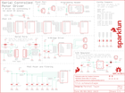

Contents
========

* [PRS13911 > Serial Controlled Motor Driver](#prs13911--serial-controlled-motor-driver)
	* [Schematic](#schematic)
	* [PCB](#pcb)
	* [Interactive BOM](#interactive-bom)
	* [OOMP Parts](#oomp-parts)
	* [Images](#images)
	* [Tags](#tags)
  
![][im]
# PRS13911 > Serial Controlled Motor Driver

- ID: PROJ-SPAR-13911-STAN-01
- Hex ID: PRS13911
- Name: Sparkfun
- Description: Sparkfun
- Long Link: [http://oom.lt/PROJ-SPAR-13911-STAN-01](http://oom.lt/PROJ-SPAR-13911-STAN-01)
- Short Link: [http://oom.lt/PRS13911](http://oom.lt/PRS13911)

## Schematic
  

## PCB
  

## Interactive BOM

- Interactive BOM page: [ibom.html](https://htmlpreview.github.io/?https://github.com/oomlout/oomlout_OOMP_projects/blob/main/PROJ-SPAR-13911-STAN-01/kicad/bom/ibom.html)

## OOMP Parts
  

|OOMP ID|Name|Identifier|
| :---: | :---: | :---: |
|CAPC-0402-X-UNMATCHED-01||C1, C2, C3, C4, C8, C9|
|[CAPC-0402-X-NF100-V10](https://github.com/oomlout/oomlout_OOMP_parts/tree/main/CAPC-0402-X-NF100-V10/)|[SMD (0402) 100 nF Capacitor (Ceramic) 10v](https://github.com/oomlout/oomlout_OOMP_parts/tree/main/CAPC-0402-X-NF100-V10/)|[C5, C6, C7, C11](https://github.com/oomlout/oomlout_OOMP_parts/tree/main/CAPC-0402-X-NF100-V10/)|
|[CAPT-3216-X-UF10-V10](https://github.com/oomlout/oomlout_OOMP_parts/tree/main/CAPT-3216-X-UF10-V10/)|[SMD (3216) 10 uF Capacitor (Tantalum) 10v](https://github.com/oomlout/oomlout_OOMP_parts/tree/main/CAPT-3216-X-UF10-V10/)|[C10, C12](https://github.com/oomlout/oomlout_OOMP_parts/tree/main/CAPT-3216-X-UF10-V10/)|
|[LEDS-0603-R-STAN-01](https://github.com/oomlout/oomlout_OOMP_parts/tree/main/LEDS-0603-R-STAN-01/)|[SMD (0603) Red LED](https://github.com/oomlout/oomlout_OOMP_parts/tree/main/LEDS-0603-R-STAN-01/)|[D1](https://github.com/oomlout/oomlout_OOMP_parts/tree/main/LEDS-0603-R-STAN-01/)|
|UNMATCHED-UNMATCHED-X-UNMATCHED-01||J8, U1, U2|
|RESE-0603-X-O10-01||R1, R2|
|[RESE-0603-X-O472-01](https://github.com/oomlout/oomlout_OOMP_parts/tree/main/RESE-0603-X-O472-01/)|[SMD (0603) 4.7k Ohm Resistor](https://github.com/oomlout/oomlout_OOMP_parts/tree/main/RESE-0603-X-O472-01/)|[R3, R4, R5, R7, R8](https://github.com/oomlout/oomlout_OOMP_parts/tree/main/RESE-0603-X-O472-01/)|
|[RESE-0603-X-O471-01](https://github.com/oomlout/oomlout_OOMP_parts/tree/main/RESE-0603-X-O471-01/)|[SMD (0603) 470 Ohm Resistor](https://github.com/oomlout/oomlout_OOMP_parts/tree/main/RESE-0603-X-O471-01/)|[R6](https://github.com/oomlout/oomlout_OOMP_parts/tree/main/RESE-0603-X-O471-01/)|
|UNMATCHED-SO235-X-UNMATCHED-01||U$3|

## Images
  
  

|bominteractivefront|bominteractiveback|kicadPcb3d|kicadPcb3dFront|kicadPcb3dBack|kicadSchem|eagleImage|eagleSchemImage|pcbdraw|pcbdrawback|
| :---: | :---: | :---: | :---: | :---: | :---: | :---: | :---: | :---: | :---: |
|||||||||||

## Tags

- hexID: PRS13911
- oompType: PROJ
- oompSize: SPAR
- oompColor: 13911
- oompDesc: STAN
- oompIndex: 01
- oompName: Serial Controlled Motor Driver
- sources: All source files from https://github.com/sparkfun/Serial_Controlled_Motor_Driver (source licence details in srcLicense.md)
- linkBuyPage: https://www.sparkfun.com/products/13911
- oompID: PROJ-SPAR-13911-STAN-01
- oompParts: C1,CAPC-0402-X-UNMATCHED-01
- oompParts: C2,CAPC-0402-X-UNMATCHED-01
- oompParts: C3,CAPC-0402-X-UNMATCHED-01
- oompParts: C4,CAPC-0402-X-UNMATCHED-01
- oompParts: C5,CAPC-0402-X-NF100-V10
- oompParts: C6,CAPC-0402-X-NF100-V10
- oompParts: C7,CAPC-0402-X-NF100-V10
- oompParts: C8,CAPC-0402-X-UNMATCHED-01
- oompParts: C9,CAPC-0402-X-UNMATCHED-01
- oompParts: C10,CAPT-3216-X-UF10-V10
- oompParts: C11,CAPC-0402-X-NF100-V10
- oompParts: C12,CAPT-3216-X-UF10-V10
- oompParts: D1,LEDS-0603-R-STAN-01
- oompParts: J8,UNMATCHED-UNMATCHED-X-UNMATCHED-01
- oompParts: R1,RESE-0603-X-O10-01
- oompParts: R2,RESE-0603-X-O10-01
- oompParts: R3,RESE-0603-X-O472-01
- oompParts: R4,RESE-0603-X-O472-01
- oompParts: R5,RESE-0603-X-O472-01
- oompParts: R6,RESE-0603-X-O471-01
- oompParts: R7,RESE-0603-X-O472-01
- oompParts: R8,RESE-0603-X-O472-01
- oompParts: U$3,UNMATCHED-SO235-X-UNMATCHED-01
- oompParts: U1,UNMATCHED-UNMATCHED-X-UNMATCHED-01
- oompParts: U2,UNMATCHED-UNMATCHED-X-UNMATCHED-01
- rawParts: C1,1.0uF,1.0UF-0402-16V-10%,0402,1µF ceramic capacitors,CAP-12417,1.0uF,
- rawParts: C2,1.0uF,1.0UF-0402-16V-10%,0402,1µF ceramic capacitors,CAP-12417,1.0uF,
- rawParts: C3,1.0uF,1.0UF-0402-16V-10%,0402,1µF ceramic capacitors,CAP-12417,1.0uF,
- rawParts: C4,1.0uF,1.0UF-0402-16V-10%,0402,1µF ceramic capacitors,CAP-12417,1.0uF,
- rawParts: C5,0.1uF,0.1UF-0402-16V-10%,0402,0.1µF ceramic capacitors,CAP-12416,0.1uF,
- rawParts: C6,0.1uF,0.1UF-0402-16V-10%,0402,0.1µF ceramic capacitors,CAP-12416,0.1uF,
- rawParts: C7,0.1uF,0.1UF-0402-16V-10%,0402,0.1µF ceramic capacitors,CAP-12416,0.1uF,
- rawParts: C8,1.0uF,1.0UF-0402-16V-10%,0402,1µF ceramic capacitors,CAP-12417,1.0uF,
- rawParts: C9,1.0uF,1.0UF-0402-16V-10%,0402,1µF ceramic capacitors,CAP-12417,1.0uF,
- rawParts: C10,10uF,10UF-POLAR-EIA3216-16V-10%(TANT),EIA3216,10.0µF polarized capacitors,CAP-00811,10uF,
- rawParts: C11,0.1uF,0.1UF-0402-16V-10%,0402,0.1µF ceramic capacitors,CAP-12416,0.1uF,
- rawParts: C12,10uF,10UF-POLAR-EIA3216-16V-10%(TANT),EIA3216,10.0µF polarized capacitors,CAP-00811,10uF,
- rawParts: D1,RED,LED-RED0603,LED-0603,Red SMD LED,DIO-00819,RED,
- rawParts: FD1,FIDUCIALUFIDUCIAL,FIDUCIALUFIDUCIAL,MICRO-FIDUCIAL,Fiducial Alignment Points,,,
- rawParts: FD2,FIDUCIALUFIDUCIAL,FIDUCIALUFIDUCIAL,MICRO-FIDUCIAL,Fiducial Alignment Points,,,
- rawParts: FRAME1,FRAME-LETTER,FRAME-LETTER,CREATIVE_COMMONS,Schematic Frame,,,
- rawParts: H1,STAND-OFF,STAND-OFF,STAND-OFF,#4 Stand Off,,,
- rawParts: H2,STAND-OFF,STAND-OFF,STAND-OFF,#4 Stand Off,,,
- rawParts: H3,STAND-OFF,STAND-OFF,STAND-OFF,#4 Stand Off,,,
- rawParts: H4,STAND-OFF,STAND-OFF,STAND-OFF,#4 Stand Off,,,
- rawParts: J1,DNP,CONN_021X02_NO_SILK,1X02_NO_SILK,Standard 2-pin 0.1 header. Use with,,,
- rawParts: J2,DNP,M05PTH,1X05,Header 5,,,
- rawParts: J3,DNP,CONN_021X02_NO_SILK,1X02_NO_SILK,Standard 2-pin 0.1 header. Use with,,,
- rawParts: J4,DNP,M05PTH,1X05,Header 5,,,
- rawParts: J5,DNP,M02PTH,1X02@1,Standard 2-pin 0.1 header. Use with,,,
- rawParts: J6,DNP,M02PTH,1X02@1,Standard 2-pin 0.1 header. Use with,,,
- rawParts: J7,DNP,CONN_01PTH,1X01,Header 1,,,
- rawParts: J8,CORTEX_DEBUGPTH,CORTEX_DEBUGPTH,2X5-PTH-1.27MM,Cortex Debug Connector,,,
- rawParts: JP1,JUMPER-PAD-2,JUMPER-PAD-2-NOYES_SILK,PAD-JUMPER-2-NO_YES_SILK,,,,
- rawParts: JP2,JUMPER-PAD-2,JUMPER-PAD-2-NOYES_SILK,PAD-JUMPER-2-NO_YES_SILK,,,,
- rawParts: JP3,JUMPER-PAD-2,JUMPER-PAD-2-NOYES_SILK,PAD-JUMPER-2-NO_YES_SILK,,,,
- rawParts: JP4,JUMPER-PAD-2,JUMPER-PAD-2-NOYES_SILK,PAD-JUMPER-2-NO_YES_SILK,,,,
- rawParts: JP5,JUMPER-PAD-2,JUMPER-PAD-2-NC_BY_PASTE,PAD-JUMPER-2-NC_BY_PASTE_YES_SILK,,,,
- rawParts: JP6,JUMPER-PAD-3-NOYES_SILK,JUMPER-PAD-3-NOYES_SILK,PAD-JUMPER-3-NO_YES_SILK,,,,
- rawParts: JP7,JUMPER-PAD-3-NOYES_SILK,JUMPER-PAD-3-NOYES_SILK,PAD-JUMPER-3-NO_YES_SILK,,,,
- rawParts: LOGO1,SFE_LOGO_FLAME.1_INCH,SFE_LOGO_FLAME.1_INCH,SFE_LOGO_FLAME_.1,SFE Logo, flame only,,,
- rawParts: LOGO2,OSHW-LOGOMINI,OSHW-LOGOMINI,OSHW-LOGO-MINI,Open Source Hardware Logo,,,
- rawParts: LOGO3,SFE_LOGO_NAME_FLAME.1_INCH,SFE_LOGO_NAME_FLAME.1_INCH,SFE_LOGO_NAME_FLAME_.1,SFE Logo, name and flame,,,
- rawParts: R1,1,1OHM-0603-1/10W-1%,0603,1Ω resistor,RES-08269,1,
- rawParts: R2,1,1OHM-0603-1/10W-1%,0603,1Ω resistor,RES-08269,1,
- rawParts: R3,4.7k,4.7KOHM-0603-1/10W-1%,0603,4.7kΩ resistor,RES-07857,4.7k,
- rawParts: R4,4.7k,4.7KOHM-0603-1/10W-1%,0603,4.7kΩ resistor,RES-07857,4.7k,
- rawParts: R5,4.7k,4.7KOHM-0603-1/10W-1%,0603,4.7kΩ resistor,RES-07857,4.7k,
- rawParts: R6,470,470OHM-0603-1/10W-1%,0603,470Ω resistor,RES-07869,470,
- rawParts: R7,4.7k,4.7KOHM-0603-1/10W-1%,0603,4.7kΩ resistor,RES-07857,4.7k,
- rawParts: R8,4.7k,4.7KOHM-0603-1/10W-1%,0603,4.7kΩ resistor,RES-07857,4.7k,
- rawParts: U$3,SPX3819M5_3_3,SPX3819,SOT-23-5-VREG,,VREG-13321,SPX3819M5_3_3,
- rawParts: U1,CY8C4245LQI-483,CY8C4245LQI,QFN-40,PSOC 4200,IC-13292,CY8C4245LQI-483,
- rawParts: U2,DRV8835,DRV883X,WSON-12,,IC-13342,DRV8835,

[im]: kicadPcb3d_450.png
