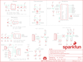

Contents
========

* [PRS13956 > Weather Shield](#prs13956--weather-shield)
	* [Schematic](#schematic)
	* [PCB](#pcb)
	* [Interactive BOM](#interactive-bom)
	* [OOMP Parts](#oomp-parts)
	* [Images](#images)
	* [Tags](#tags)
  
![][im]
# PRS13956 > Weather Shield

- ID: PROJ-SPAR-13956-STAN-01
- Hex ID: PRS13956
- Name: Sparkfun
- Description: Sparkfun
- Long Link: [http://oom.lt/PROJ-SPAR-13956-STAN-01](http://oom.lt/PROJ-SPAR-13956-STAN-01)
- Short Link: [http://oom.lt/PRS13956](http://oom.lt/PRS13956)

## Schematic
  

## PCB
  

## Interactive BOM

- Interactive BOM page: [ibom.html](https://htmlpreview.github.io/?https://github.com/oomlout/oomlout_OOMP_projects/blob/main/PROJ-SPAR-13956-STAN-01/kicad/bom/ibom.html)

## OOMP Parts
  

|OOMP Parts|
| :---: |
|CAPC-0603-X-UNMATCHED-01 C1, C8|
|[CAPC-0603-X-NF100-V50  SMD (0603) 100 nF Capacitor (Ceramic) 50v  C2, C5, C6, C7](https://github.com/oomlout/oomlout_OOMP_parts/tree/main/CAPC-0603-X-NF100-V50/)|
|CAPT-3216-X-UF10-01 C13, C14|
|[LEDS-0603-L-STAN-01  SMD (0603) Blue LED  D1](https://github.com/oomlout/oomlout_OOMP_parts/tree/main/LEDS-0603-L-STAN-01/)|
|[LEDS-0603-G-STAN-01  SMD (0603) Green LED  D3](https://github.com/oomlout/oomlout_OOMP_parts/tree/main/LEDS-0603-G-STAN-01/)|
|DIOD-S323-X-UNMATCHED-01 D5, D6, D7, D8, D9, D10|
|UNMATCHED-UNMATCHED-X-UNMATCHED-01 J1, JP9-DNP, JP10-DNP, S2, U1, U3, U4, U5|
|[HEAD-I01-X-PI02-01  2.54 mm 2 Pin Header  JP2](https://github.com/oomlout/oomlout_OOMP_parts/tree/main/HEAD-I01-X-PI02-01/)|
|UNMATCHED-SO23-X-UNMATCHED-01 Q1, Q2|
|[RESE-0603-X-O102-01  SMD (0603) 1k Ohm Resistor  R1, R6, R7, R11, R12, R13, R14, R15, R16](https://github.com/oomlout/oomlout_OOMP_parts/tree/main/RESE-0603-X-O102-01/)|
|[RESE-0603-X-O472-01  SMD (0603) 4.7k Ohm Resistor  R2, R3, R4, R5, R9, R17](https://github.com/oomlout/oomlout_OOMP_parts/tree/main/RESE-0603-X-O472-01/)|
|[RESE-0603-X-O392-01  SMD (0603) 3.9k Ohm Resistor  R8](https://github.com/oomlout/oomlout_OOMP_parts/tree/main/RESE-0603-X-O392-01/)|
|[RESE-0603-X-O103-01  SMD (0603) 10k Ohm Resistor  R10](https://github.com/oomlout/oomlout_OOMP_parts/tree/main/RESE-0603-X-O103-01/)|
|VREG-SO235-X-KMIC5205-01 U6|

## Images
  
  

|bominteractivefront|bominteractiveback|kicadPcb3d|kicadPcb3dFront|kicadPcb3dBack|eagleImage|eagleSchemImage|
| :---: | :---: | :---: | :---: | :---: | :---: | :---: |
||||||||

## Tags

- hexID: PRS13956
- oompType: PROJ
- oompSize: SPAR
- oompColor: 13956
- oompDesc: STAN
- oompIndex: 01
- oompName: Weather Shield
- sources: All source files from https://github.com/sparkfun/Weather_Shield (source licence details in srcLicense.md)
- linkBuyPage: https://www.sparkfun.com/products/13956
- oompID: PROJ-SPAR-13956-STAN-01
- oompParts: C1,CAPC-0603-X-UNMATCHED-01
- oompParts: C2,CAPC-0603-X-NF100-V50
- oompParts: C5,CAPC-0603-X-NF100-V50
- oompParts: C6,CAPC-0603-X-NF100-V50
- oompParts: C7,CAPC-0603-X-NF100-V50
- oompParts: C8,CAPC-0603-X-UNMATCHED-01
- oompParts: C13,CAPT-3216-X-UF10-01
- oompParts: C14,CAPT-3216-X-UF10-01
- oompParts: D1,LEDS-0603-L-STAN-01
- oompParts: D3,LEDS-0603-G-STAN-01
- oompParts: D5,DIOD-S323-X-UNMATCHED-01
- oompParts: D6,DIOD-S323-X-UNMATCHED-01
- oompParts: D7,DIOD-S323-X-UNMATCHED-01
- oompParts: D8,DIOD-S323-X-UNMATCHED-01
- oompParts: D9,DIOD-S323-X-UNMATCHED-01
- oompParts: D10,DIOD-S323-X-UNMATCHED-01
- oompParts: J1,UNMATCHED-UNMATCHED-X-UNMATCHED-01
- oompParts: JP2,HEAD-I01-X-PI02-01
- oompParts: JP9-DNP,UNMATCHED-UNMATCHED-X-UNMATCHED-01
- oompParts: JP10-DNP,UNMATCHED-UNMATCHED-X-UNMATCHED-01
- oompParts: Q1,UNMATCHED-SO23-X-UNMATCHED-01
- oompParts: Q2,UNMATCHED-SO23-X-UNMATCHED-01
- oompParts: R1,RESE-0603-X-O102-01
- oompParts: R2,RESE-0603-X-O472-01
- oompParts: R3,RESE-0603-X-O472-01
- oompParts: R4,RESE-0603-X-O472-01
- oompParts: R5,RESE-0603-X-O472-01
- oompParts: R6,RESE-0603-X-O102-01
- oompParts: R7,RESE-0603-X-O102-01
- oompParts: R8,RESE-0603-X-O392-01
- oompParts: R9,RESE-0603-X-O472-01
- oompParts: R10,RESE-0603-X-O103-01
- oompParts: R11,RESE-0603-X-O102-01
- oompParts: R12,RESE-0603-X-O102-01
- oompParts: R13,RESE-0603-X-O102-01
- oompParts: R14,RESE-0603-X-O102-01
- oompParts: R15,RESE-0603-X-O102-01
- oompParts: R16,RESE-0603-X-O102-01
- oompParts: R17,RESE-0603-X-O472-01
- oompParts: S2,UNMATCHED-UNMATCHED-X-UNMATCHED-01
- oompParts: U1,UNMATCHED-UNMATCHED-X-UNMATCHED-01
- oompParts: U3,UNMATCHED-UNMATCHED-X-UNMATCHED-01
- oompParts: U4,UNMATCHED-UNMATCHED-X-UNMATCHED-01
- oompParts: U5,UNMATCHED-UNMATCHED-X-UNMATCHED-01
- oompParts: U6,VREG-SO235-X-KMIC5205-01
- rawParts: C1,1.0uF,1.0UF-16V-10%(0603),0603-CAP,CAP-00868,CAP-00868,1.0uF,
- rawParts: C2,0.1uF,0.1UF-25V(+80/-20%)(0603),0603-CAP,CAP-00810,CAP-00810,0.1uF,
- rawParts: C5,0.1uF,0.1UF-25V(+80/-20%)(0603),0603-CAP,CAP-00810,CAP-00810,0.1uF,
- rawParts: C6,0.1uF,0.1UF-25V(+80/-20%)(0603),0603-CAP,CAP-00810,CAP-00810,0.1uF,
- rawParts: C7,0.1uF,0.1UF-25V(+80/-20%)(0603),0603-CAP,CAP-00810,CAP-00810,0.1uF,
- rawParts: C8,1.0uF,1.0UF-16V-10%(0603),0603-CAP,CAP-00868,CAP-00868,1.0uF,
- rawParts: C13,10uF,10UF-16V-10%(TANT),EIA3216,CAP-00811,CAP-00811,10uF,
- rawParts: C14,10uF,10UF-16V-10%(TANT),EIA3216,CAP-00811,CAP-00811,10uF,
- rawParts: D1,BLUE,LED-BLUE0603,LED-0603,Blue LEDs for production use,DIO-08575,BLUE,
- rawParts: D3,GREEN,LED-GREEN0603,LED-0603,Various green LEDs,DIO-00821,GREEN,
- rawParts: D5,250mA/100V,DIODEBAS16,SOD-323,Diode,DIO-09646,250mA/100V,
- rawParts: D6,250mA/100V,DIODEBAS16,SOD-323,Diode,DIO-09646,250mA/100V,
- rawParts: D7,250mA/100V,DIODEBAS16,SOD-323,Diode,DIO-09646,250mA/100V,
- rawParts: D8,250mA/100V,DIODEBAS16,SOD-323,Diode,DIO-09646,250mA/100V,
- rawParts: D9,250mA/100V,DIODEBAS16,SOD-323,Diode,DIO-09646,250mA/100V,
- rawParts: D10,250mA/100V,DIODEBAS16,SOD-323,Diode,DIO-09646,250mA/100V,
- rawParts: FD1,FIDUCIAL1X2,FIDUCIAL1X2,FIDUCIAL-1X2,Fiducial Alignment Points,,,
- rawParts: FD2,FIDUCIAL1X2,FIDUCIAL1X2,FIDUCIAL-1X2,Fiducial Alignment Points,,,
- rawParts: FRAME1,FRAME-LETTER,FRAME-LETTER,CREATIVE_COMMONS,Schematic Frame,,,
- rawParts: J1,GP-735,GP-635TSMD,GP-635T,Footprint and symbol for a generic 6-pin JST GPS module connector.,CONN-08249,,
- rawParts: JP1,,JUMPER-PAD-2-NO,PAD-JUMPER-2-NO_NO_SILK,,,,
- rawParts: JP2,External Batt Bckup,M02PTH,1X02,Standard 2-pin 0.1 header. Use with,,,
- rawParts: JP9-DNP,RJ11-RAIN,RJ11-6PTH,RJ11-6,RJ11 Jack,CONN-08590,RJ11,
- rawParts: JP10-DNP,RJ11-WIND,RJ11-6PTH,RJ11-6,RJ11 Jack,CONN-08590,RJ11,
- rawParts: LOGO1,OSHW-LOGOM,OSHW-LOGOM,OSHW-LOGO-M,Open Source Hardware Logo,,,
- rawParts: LOGO2,SFE_LOGO_NAME_FLAME.1_INCH,SFE_LOGO_NAME_FLAME.1_INCH,SFE_LOGO_NAME_FLAME_.1,SFE Logo, name and flame,,,
- rawParts: Q1,200mA/50V,MOSFET-NCHANNELBSS138,SOT23-3,Common NMOSFET Parts,TRANS-00830,200mA/50V,
- rawParts: Q2,200mA/50V,MOSFET-NCHANNELBSS138,SOT23-3,Common NMOSFET Parts,TRANS-00830,200mA/50V,
- rawParts: R1,1K,1KOHM-1/10W-1%(0603),0603-RES,RES-07856,RES-07856,1K,
- rawParts: R2,4.7K,4.7KOHM-1/10W-1%(0603),0603-RES,RES-07857,RES-07857,4.7K,
- rawParts: R3,4.7K,4.7KOHM-1/10W-1%(0603),0603-RES,RES-07857,RES-07857,4.7K,
- rawParts: R4,4.7K,4.7KOHM-1/10W-1%(0603),0603-RES,RES-07857,RES-07857,4.7K,
- rawParts: R5,4.7K,4.7KOHM-1/10W-1%(0603),0603-RES,RES-07857,RES-07857,4.7K,
- rawParts: R6,1K,1KOHM-1/10W-1%(0603),0603-RES,RES-07856,RES-07856,1K,
- rawParts: R7,1K,1KOHM-1/10W-1%(0603),0603-RES,RES-07856,RES-07856,1K,
- rawParts: R8,3.9K,3.9KOHM1/10W1%(0603),0603,RES-08701,RES-08701,3.9K,
- rawParts: R9,4.7K,4.7KOHM-1/10W-1%(0603),0603-RES,RES-07857,RES-07857,4.7K,
- rawParts: R10,10K,10KOHM-1/10W-1%(0603)0603,0603-RES,RES-00824,RES-00824,10K,
- rawParts: R11,1K,1KOHM-1/10W-1%(0603),0603-RES,RES-07856,RES-07856,1K,
- rawParts: R12,1K,1KOHM-1/10W-1%(0603),0603-RES,RES-07856,RES-07856,1K,
- rawParts: R13,1K,1KOHM-1/10W-1%(0603),0603-RES,RES-07856,RES-07856,1K,
- rawParts: R14,1K,1KOHM-1/10W-1%(0603),0603-RES,RES-07856,RES-07856,1K,
- rawParts: R15,1K,1KOHM-1/10W-1%(0603),0603-RES,RES-07856,RES-07856,1K,
- rawParts: R16,1K,1KOHM-1/10W-1%(0603),0603-RES,RES-07856,RES-07856,1K,
- rawParts: R17,4.7K,4.7KOHM-1/10W-1%(0603),0603-RES,RES-07857,RES-07857,4.7K,
- rawParts: S2,DPDT,SWITCH-DPDTAYZ0202,AYZ0202,DPDT Version of the COM-00597,SWCH-08179,DPDT,
- rawParts: U$2,REVISION,REVISION,REVISION,,,,
- rawParts: U1,ARDUINO_R3_SHIELD,ARDUINO_R3_SHIELD,UNO_R3_SHIELD,Shield form compatible with the Arduino Uno R3.,,,
- rawParts: U3,ALS-PT19,LIGHTSENSORALS,ALS-PT19,Ambient Light Sensor,IC-11836,,
- rawParts: U4,MPL3115A2LGA8,MPL3115A2LGA8,LGA8,Altimeter/Pressure Sensor, I2C, 1.95V-3.6V supply, 50 to 110kPa,IC-10869,,
- rawParts: U5,SI7021,SI7021,SI7021,The Si7021 is an I2C Humidity and Temperature Sensor,IC-13093,,
- rawParts: U6,3.3V/150mA,V_REG_MIC52053.3V,SOT23-5,V_REG MIC5205 Standard 3.3V, 5V, and Adjustable 150mA LDO voltage regulator in SOT-23 layout. Micrel part MIC5205. BP (by-pass) pin is used to lower output noise with 470pF cap, may be left open. On the adjustable version BP is used to set output.,VREG-00822,3.3V/150mA,

[im]: kicadPcb3d_450.png
