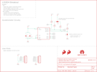

Contents
========

* [PRS13963 > Sparkfun](#prs13963--sparkfun)
	* [Images](#images)
	* [Tags](#tags)
  
![][im]
# PRS13963 > Sparkfun

- ID: PROJ-SPAR-13963-STAN-01
- Hex ID: PRS13963
- Name: Sparkfun
- Description: Sparkfun

## Images
  
  

|kicadPcb3d|kicadPcb3dFront|kicadPcb3dBack|eagleImage|eagleSchemImage|
| :---: | :---: | :---: | :---: | :---: |
||||||

## Tags

- hexID: PRS13963
- oompType: PROJ
- oompSize: SPAR
- oompColor: 13963
- oompDesc: STAN
- oompIndex: 01
- oompName: LIS3DH Breakout
- sources: All source files from https://github.com/sparkfun/LIS3DH_Breakout (source licence details in srcLicense.md)
- linkBuyPage: https://www.sparkfun.com/products/13963
- oompID: PROJ-SPAR-13963-STAN-01
- oompParts: C1,UNMATCHED-UNMATCHED-UNMATCHED-UNMATCHED-UNMATCHED
- oompParts: C2,UNMATCHED-UNMATCHED-UNMATCHED-UNMATCHED-UNMATCHED
- oompParts: FRAME2,UNMATCHED-UNMATCHED-UNMATCHED-UNMATCHED-UNMATCHED
- oompParts: J1,UNMATCHED-UNMATCHED-UNMATCHED-UNMATCHED-UNMATCHED
- oompParts: J2,UNMATCHED-UNMATCHED-UNMATCHED-UNMATCHED-UNMATCHED
- oompParts: JP3,UNMATCHED-UNMATCHED-UNMATCHED-UNMATCHED-UNMATCHED
- oompParts: JP4,UNMATCHED-UNMATCHED-UNMATCHED-UNMATCHED-UNMATCHED
- oompParts: LOGO1,UNMATCHED-UNMATCHED-UNMATCHED-UNMATCHED-UNMATCHED
- oompParts: LOGO2,UNMATCHED-UNMATCHED-UNMATCHED-UNMATCHED-UNMATCHED
- oompParts: R1,UNMATCHED-UNMATCHED-UNMATCHED-UNMATCHED-UNMATCHED
- oompParts: R2,UNMATCHED-UNMATCHED-UNMATCHED-UNMATCHED-UNMATCHED
- oompParts: R3,UNMATCHED-UNMATCHED-UNMATCHED-UNMATCHED-UNMATCHED
- oompParts: R4,UNMATCHED-UNMATCHED-UNMATCHED-UNMATCHED-UNMATCHED
- oompParts: SJ1,UNMATCHED-UNMATCHED-UNMATCHED-UNMATCHED-UNMATCHED
- oompParts: SJ2,UNMATCHED-UNMATCHED-UNMATCHED-UNMATCHED-UNMATCHED
- oompParts: U$1,UNMATCHED-UNMATCHED-UNMATCHED-UNMATCHED-UNMATCHED
- oompParts: U1,UNMATCHED-UNMATCHED-UNMATCHED-UNMATCHED-UNMATCHED
- rawParts: C1,0.1uF,0.1UF-0402-16V-10%,0402,0.1µF ceramic capacitors,CAP-12416,,0.1uF,
- rawParts: C2,10uF,10UF-0603-6.3V-20%,0603,10.0µF ceramic capacitors,CAP-11015,,10uF,
- rawParts: FRAME2,FRAME-LETTER,FRAME-LETTER,CREATIVE_COMMONS,Schematic Frame,,,,
- rawParts: J1,,CONN_06NO_SILK_FEMALE_PTH,1X06_NO_SILK,Header 6,CONN-08437,,,
- rawParts: J2,,CONN_06NO_SILK_FEMALE_PTH,1X06_NO_SILK,Header 6,CONN-08437,,,
- rawParts: JP2,FIDUCIALUFIDUCIAL,FIDUCIALUFIDUCIAL,MICRO-FIDUCIAL,Fiducial Alignment Points,,,,
- rawParts: JP3,STAND-OFF,STAND-OFF,STAND-OFF,Stand Off,,,,
- rawParts: JP4,STAND-OFF,STAND-OFF,STAND-OFF,Stand Off,,,,
- rawParts: JP6,FIDUCIALUFIDUCIAL,FIDUCIALUFIDUCIAL,MICRO-FIDUCIAL,Fiducial Alignment Points,,,,
- rawParts: LOGO1,SFE_LOGO_FLAME.1_INCH,SFE_LOGO_FLAME.1_INCH,SFE_LOGO_FLAME_.1,SFE Logo, flame only,,,,
- rawParts: LOGO2,SFE_LOGO_FLAME.1_INCH,SFE_LOGO_FLAME.1_INCH,SFE_LOGO_FLAME_.1,SFE Logo, flame only,,,,
- rawParts: R1,4.7k,4.7KOHM-0603-1/10W-1%,0603,4.7kΩ resistor,RES-07857,,4.7k,
- rawParts: R2,4.7k,4.7KOHM-0603-1/10W-1%,0603,4.7kΩ resistor,RES-07857,,4.7k,
- rawParts: R3,10k,10KOHM-0603-1/10W-1%,0603,10kΩ resistor,RES-00824,,10k,
- rawParts: R4,10k,10KOHM-0603-1/10W-1%,0603,10kΩ resistor,RES-00824,,10k,
- rawParts: SJ1,,SOLDERJUMPERNO,SJ_2S-NO,Solder Jumper,,,,
- rawParts: SJ2,,JUMPER-PAD-3-NC_BY_TRACE,PAD-JUMPER-3-3OF3_NC_BY_TRACE_YES_SILK_FULL_BOX,,,,,
- rawParts: U$1,OSHW-LOGOS,OSHW-LOGOS,OSHW-LOGO-S,Open Source Hardware Logo This logo indicates the piece of hardware it is found on incorporates a OSHW license and/or adheres to the definition of open source hardware found here: http://freedomdefined.org/OSHW,,,,
- rawParts: U1,LIS3DH,LIS3DH,LGA-16-3X3,ST Microelectronics LIS3DH 3-Axis +/-2/4/8/16g SPI/I2C Accelerometer,IC-13419,N/A,,

[im]: kicadPcb3d_450.png
