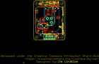
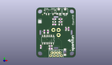
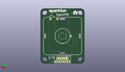
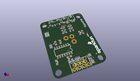

Contents
========

* [PROJ-SPAR-13968-STAN-01>OpenPIR](#proj-spar-13968-stan-01openpir)
	* [Images](#images)
	* [Interactive BOM](#interactive-bom)
	* [OOMP Parts](#oomp-parts)
	* [Tags](#tags)
  
![][im]
# PROJ-SPAR-13968-STAN-01>OpenPIR

- ID: PROJ-SPAR-13968-STAN-01
- Hex ID: PRS13968
- Name: OpenPIR
- Description: 

## Images
  
  

|eagleImage|kicadPcb3dFront|kicadPcb3dBack|kicadPcb3d|
| :---: | :---: | :---: | :---: |
|||||

## Interactive BOM

- Interactive BOM page: [ibom.html](kicad/bom/ibom.html)

## OOMP Parts
  

|OOMP Parts|
| :---: |
|CAPE-0805-X-UNMATCHED-01, C1, 12.7, 25.4, 0,C1, 22uF, 0805, SparkFun-Capacitors, (0.5, 1), R0|
|CAPE-0603-X-UNMATCHED-01, C2, 8.254999999999999, 18.415, 270,C2, 10nF, 0603, SparkFun-Capacitors, (0.325, 0.725), R270|
|CAPE-0805-X-UNMATCHED-01, C3, 17.145, 23.495, 0,C3, 22uF, 0805, SparkFun-Capacitors, (0.675, 0.925), R0|
|CAPE-0603-X-UNMATCHED-01, C4, 17.145, 27.304999999999996, 0,C4, 10nF, 0603, SparkFun-Capacitors, (0.675, 1.075), R0|
|CAPE-0603-X-NF100-01, C5, 22.86, 20.32, 90,C5, 0.1uF, 0603, SparkFun-Capacitors, (0.9, 0.8), R90|
|CAPE-0603-X-NF100-01, C6, 5.715, 18.415, 90,C6, 0.1uF, 0603, SparkFun-Capacitors, (0.225, 0.725), R90|
|CAPE-0603-X-NF100-01, C7, 10.16, 6.35, 180,C7, 0.1uF, 0603, SparkFun-Capacitors, (0.4, 0.25), R180|
|UNMATCHED-UNMATCHED-X-UNMATCHED-01, D1, 20.32, 3.8099999999999996, 270,D1, Green, LED-1206-BOTTOM, SparkFun-LED, (0.8, 0.15), R270|
|UNMATCHED-UNMATCHED-X-UNMATCHED-01, FD1, 4.571999999999999, 30.479999999999997, 0,FD1, FIDUCIALUFIDUCIAL, MICRO-FIDUCIAL, SparkFun-Aesthetics, (0.18, 1.2), R0|
|UNMATCHED-UNMATCHED-X-UNMATCHED-01, FD2, 24.13, 5.08, 0,FD2, FIDUCIALUFIDUCIAL, MICRO-FIDUCIAL, SparkFun-Aesthetics, (0.95, 0.2), R0|
|UNMATCHED-UNMATCHED-X-UNMATCHED-01, J2, 13.97, 2.794, 180,J2, JST-4-PTH-VERT-NS, openPIR-temp, (0.55, 0.11), R180|
|UNMATCHED-UNMATCHED-X-UNMATCHED-01, J8, 17.779999999999998, 1.27, 180,J8, 1X04_NO_SILK_ALL_ROUND, SparkFun-Connectors, (0.7, 0.05), R180|
|<table><tr><td></td><td> R1</td><td>[RESE-0603-X-O103-01 SMD (0603) 10k Ohm Resistor](https://github.com/oomlout/oomlout_OOMP_parts/tree/main/RESE-0603-X-O103-01/)</td><td>[R6103](https://github.com/oomlout/oomlout_OOMP_parts/tree/main/RESE-0603-X-O103-01/)</td></tr></table>|
|<table><tr><td></td><td> R2</td><td>[RESE-0603-X-O564-01 SMD (0603) 560k Ohm Resistor](https://github.com/oomlout/oomlout_OOMP_parts/tree/main/RESE-0603-X-O564-01/)</td><td>[R6564](https://github.com/oomlout/oomlout_OOMP_parts/tree/main/RESE-0603-X-O564-01/)</td></tr></table>|
|<table><tr><td></td><td> R3</td><td>[RESE-0603-X-O103-01 SMD (0603) 10k Ohm Resistor](https://github.com/oomlout/oomlout_OOMP_parts/tree/main/RESE-0603-X-O103-01/)</td><td>[R6103](https://github.com/oomlout/oomlout_OOMP_parts/tree/main/RESE-0603-X-O103-01/)</td></tr></table>|
|RESE-UNMATCHED-X-UNMATCHED-01, R4, 20.5105, 32.892999999999994, 0,R4, 1M, TRIMPOT-TC33X, openPIR-temp, (0.8075, 1.295), R0|
|<table><tr><td></td><td> R5</td><td>[RESE-0603-X-O433-01 SMD (0603) 43k Ohm Resistor](https://github.com/oomlout/oomlout_OOMP_parts/tree/main/RESE-0603-X-O433-01/)</td><td>[R6433](https://github.com/oomlout/oomlout_OOMP_parts/tree/main/RESE-0603-X-O433-01/)</td></tr></table>|
|<table><tr><td></td><td> R6</td><td>[RESE-0603-X-O513-01 SMD (0603) 51k Ohm Resistor](https://github.com/oomlout/oomlout_OOMP_parts/tree/main/RESE-0603-X-O513-01/)</td><td>[R6513](https://github.com/oomlout/oomlout_OOMP_parts/tree/main/RESE-0603-X-O513-01/)</td></tr></table>|
|RESE-UNMATCHED-X-UNMATCHED-01, R7, 15.875, 32.892999999999994, 0,R7, 1M, TRIMPOT-TC33X, openPIR-temp, (0.625, 1.295), R0|
|RESE-0603-X-UNMATCHED-01, R8, 3.175, 7.619999999999999, 270,R8, 1k, 0603, SparkFun-Resistors, (0.125, 0.3), R270|
|UNMATCHED-UNMATCHED-X-UNMATCHED-01, S1, 9.5504, 32.638999999999996, 0,S1, SWITCH-SPST-SMD-A, SparkFun-Electromechanical, (0.376, 1.285), R0|
|UNMATCHED-UNMATCHED-X-UNMATCHED-01, SJ1, 2.54, 25.4, 0,SJ1, LED-EN, SJ_2S, SparkFun-Retired, (0.1, 1), R0|
|UNMATCHED-UNMATCHED-X-UNMATCHED-01, TP1, 21.59, 28.701999999999995, M0,TP1, PAD.03X.05, SparkFun-Connectors, (0.85, 1.13), MR0|
|UNMATCHED-UNMATCHED-X-UNMATCHED-01, TP2, 17.145, 28.701999999999995, M0,TP2, PAD.03X.05, SparkFun-Connectors, (0.675, 1.13), MR0|
|UNMATCHED-UNMATCHED-X-UNMATCHED-01, U1, 8.254999999999999, 12.7, 180,U1, NCS36000, SO14, openPIR-temp, (0.325, 0.5), R180|
|UNMATCHED-UNMATCHED-X-UNMATCHED-01, U2, 13.97, 17.779999999999998, M180,U2, PIR, PIR, openPIR-temp, (0.55, 0.7), MR180|

## Tags

- hexID: PRS13968
- oompType: PROJ
- oompSize: SPAR
- oompColor: 13968
- oompDesc: STAN
- oompIndex: 01
- oompName: OpenPIR
- sources: All source files from https://github.com/sparkfun/OpenPIR (source licence details in srcLicense.md)
- linkBuyPage: https://www.sparkfun.com/products/13968
- oompPart: CAPE-0805-X-UNMATCHED-01, C1, 12.7, 25.4, 0
- oompPart: CAPE-0603-X-UNMATCHED-01, C2, 8.254999999999999, 18.415, 270
- oompPart: CAPE-0805-X-UNMATCHED-01, C3, 17.145, 23.495, 0
- oompPart: CAPE-0603-X-UNMATCHED-01, C4, 17.145, 27.304999999999996, 0
- oompPart: CAPE-0603-X-NF100-01, C5, 22.86, 20.32, 90
- oompPart: CAPE-0603-X-NF100-01, C6, 5.715, 18.415, 90
- oompPart: CAPE-0603-X-NF100-01, C7, 10.16, 6.35, 180
- oompPart: UNMATCHED-UNMATCHED-X-UNMATCHED-01, D1, 20.32, 3.8099999999999996, 270
- oompPart: UNMATCHED-UNMATCHED-X-UNMATCHED-01, FD1, 4.571999999999999, 30.479999999999997, 0
- oompPart: UNMATCHED-UNMATCHED-X-UNMATCHED-01, FD2, 24.13, 5.08, 0
- oompPart: UNMATCHED-UNMATCHED-X-UNMATCHED-01, J2, 13.97, 2.794, 180
- oompPart: UNMATCHED-UNMATCHED-X-UNMATCHED-01, J8, 17.779999999999998, 1.27, 180
- oompPart: RESE-0603-X-O103-01, R1, 12.7, 27.304999999999996, 0
- oompPart: RESE-0603-X-O564-01, R2, 12.7, 23.495, 0
- oompPart: RESE-0603-X-O103-01, R3, 17.145, 25.4, 0
- oompPart: RESE-UNMATCHED-X-UNMATCHED-01, R4, 20.5105, 32.892999999999994, 0
- oompPart: RESE-0603-X-O433-01, R5, 20.955, 20.32, 270
- oompPart: RESE-0603-X-O513-01, R6, 10.16, 8.254999999999999, 180
- oompPart: RESE-UNMATCHED-X-UNMATCHED-01, R7, 15.875, 32.892999999999994, 0
- oompPart: RESE-0603-X-UNMATCHED-01, R8, 3.175, 7.619999999999999, 270
- oompPart: UNMATCHED-UNMATCHED-X-UNMATCHED-01, S1, 9.5504, 32.638999999999996, 0
- oompPart: UNMATCHED-UNMATCHED-X-UNMATCHED-01, SJ1, 2.54, 25.4, 0
- oompPart: UNMATCHED-UNMATCHED-X-UNMATCHED-01, TP1, 21.59, 28.701999999999995, M0
- oompPart: UNMATCHED-UNMATCHED-X-UNMATCHED-01, TP2, 17.145, 28.701999999999995, M0
- oompPart: UNMATCHED-UNMATCHED-X-UNMATCHED-01, U1, 8.254999999999999, 12.7, 180
- oompPart: UNMATCHED-UNMATCHED-X-UNMATCHED-01, U2, 13.97, 17.779999999999998, M180
- rawPart: C1, 22uF, 0805, SparkFun-Capacitors, (0.5, 1), R0
- rawPart: C2, 10nF, 0603, SparkFun-Capacitors, (0.325, 0.725), R270
- rawPart: C3, 22uF, 0805, SparkFun-Capacitors, (0.675, 0.925), R0
- rawPart: C4, 10nF, 0603, SparkFun-Capacitors, (0.675, 1.075), R0
- rawPart: C5, 0.1uF, 0603, SparkFun-Capacitors, (0.9, 0.8), R90
- rawPart: C6, 0.1uF, 0603, SparkFun-Capacitors, (0.225, 0.725), R90
- rawPart: C7, 0.1uF, 0603, SparkFun-Capacitors, (0.4, 0.25), R180
- rawPart: D1, Green, LED-1206-BOTTOM, SparkFun-LED, (0.8, 0.15), R270
- rawPart: FD1, FIDUCIALUFIDUCIAL, MICRO-FIDUCIAL, SparkFun-Aesthetics, (0.18, 1.2), R0
- rawPart: FD2, FIDUCIALUFIDUCIAL, MICRO-FIDUCIAL, SparkFun-Aesthetics, (0.95, 0.2), R0
- rawPart: J2, JST-4-PTH-VERT-NS, openPIR-temp, (0.55, 0.11), R180
- rawPart: J8, 1X04_NO_SILK_ALL_ROUND, SparkFun-Connectors, (0.7, 0.05), R180
- rawPart: R1, 10k, 0603, SparkFun-Resistors, (0.5, 1.075), R0
- rawPart: R2, 560k, 0603, openPIR-temp, (0.5, 0.925), R0
- rawPart: R3, 10k, 0603, SparkFun-Resistors, (0.675, 1), R0
- rawPart: R4, 1M, TRIMPOT-TC33X, openPIR-temp, (0.8075, 1.295), R0
- rawPart: R5, 43k, 0603, SparkFun-Resistors, (0.825, 0.8), R270
- rawPart: R6, 51k, 0603, openPIR-temp, (0.4, 0.325), R180
- rawPart: R7, 1M, TRIMPOT-TC33X, openPIR-temp, (0.625, 1.295), R0
- rawPart: R8, 1k, 0603, SparkFun-Resistors, (0.125, 0.3), R270
- rawPart: S1, SWITCH-SPST-SMD-A, SparkFun-Electromechanical, (0.376, 1.285), R0
- rawPart: SJ1, LED-EN, SJ_2S, SparkFun-Retired, (0.1, 1), R0
- rawPart: TP1, PAD.03X.05, SparkFun-Connectors, (0.85, 1.13), MR0
- rawPart: TP2, PAD.03X.05, SparkFun-Connectors, (0.675, 1.13), MR0
- rawPart: U1, NCS36000, SO14, openPIR-temp, (0.325, 0.5), R180
- rawPart: U2, PIR, PIR, openPIR-temp, (0.55, 0.7), MR180

[im]: kicadPcb3d_450.png
