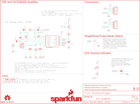

Contents
========

* [PRS13968 > OpenPIR](#prs13968--openpir)
	* [Schematic](#schematic)
	* [PCB](#pcb)
	* [Interactive BOM](#interactive-bom)
	* [OOMP Parts](#oomp-parts)
	* [Images](#images)
	* [Tags](#tags)
  
![][im]
# PRS13968 > OpenPIR

- ID: PROJ-SPAR-13968-STAN-01
- Hex ID: PRS13968
- Name: Sparkfun
- Description: Sparkfun
- Long Link: [http://oom.lt/PROJ-SPAR-13968-STAN-01](http://oom.lt/PROJ-SPAR-13968-STAN-01)
- Short Link: [http://oom.lt/PRS13968](http://oom.lt/PRS13968)

## Schematic
  

## PCB
  

## Interactive BOM

- Interactive BOM page: [ibom.html](https://htmlpreview.github.io/?https://github.com/oomlout/oomlout_OOMP_projects/blob/main/PROJ-SPAR-13968-STAN-01/kicad/bom/ibom.html)

## OOMP Parts
  

|OOMP Parts|
| :---: |
|[CAPC-0805-X-UF22-V63D  SMD (0805) 22 uF Capacitor (Ceramic) 6.3v  C1, C3](https://github.com/oomlout/oomlout_OOMP_parts/tree/main/CAPC-0805-X-UF22-V63D/)|
|[CAPC-0603-X-NF10-V50  SMD (0603) 10 nF Capacitor (Ceramic) 50v  C2, C4](https://github.com/oomlout/oomlout_OOMP_parts/tree/main/CAPC-0603-X-NF10-V50/)|
|[CAPC-0603-X-NF100-V50  SMD (0603) 100 nF Capacitor (Ceramic) 50v  C5, C6, C7](https://github.com/oomlout/oomlout_OOMP_parts/tree/main/CAPC-0603-X-NF100-V50/)|
|LEDS-1206-G-STAN-01 D1|
|HEAD-I01-X-UNMATCHED-01 J2|
|[HEAD-I01-X-PI04-01  2.54 mm 4 Pin Header  J8](https://github.com/oomlout/oomlout_OOMP_parts/tree/main/HEAD-I01-X-PI04-01/)|
|[RESE-0603-X-O103-01  SMD (0603) 10k Ohm Resistor  R1, R3](https://github.com/oomlout/oomlout_OOMP_parts/tree/main/RESE-0603-X-O103-01/)|
|RESE-0603-X-O5603-01 R2|
|RESE-UNMATCHED-X-O105-01 R4, R7|
|[RESE-0603-X-O433-01  SMD (0603) 43k Ohm Resistor  R5](https://github.com/oomlout/oomlout_OOMP_parts/tree/main/RESE-0603-X-O433-01/)|
|[RESE-0603-X-O513-01  SMD (0603) 51k Ohm Resistor  R6](https://github.com/oomlout/oomlout_OOMP_parts/tree/main/RESE-0603-X-O513-01/)|
|[RESE-0603-X-O102-01  SMD (0603) 1k Ohm Resistor  R8](https://github.com/oomlout/oomlout_OOMP_parts/tree/main/RESE-0603-X-O102-01/)|
|UNMATCHED-UNMATCHED-X-UNMATCHED-01 S1, TP1, TP2, U$1, U1, U2|

## Images
  
  

|bominteractivefront|bominteractiveback|kicadPcb3d|kicadPcb3dFront|kicadPcb3dBack|eagleImage|eagleSchemImage|
| :---: | :---: | :---: | :---: | :---: | :---: | :---: |
||||||||

## Tags

- hexID: PRS13968
- oompType: PROJ
- oompSize: SPAR
- oompColor: 13968
- oompDesc: STAN
- oompIndex: 01
- oompName: OpenPIR
- sources: All source files from https://github.com/sparkfun/OpenPIR (source licence details in srcLicense.md)
- linkBuyPage: https://www.sparkfun.com/products/13968
- oompID: PROJ-SPAR-13968-STAN-01
- oompParts: C1,CAPC-0805-X-UF22-V63D
- oompParts: C2,CAPC-0603-X-NF10-V50
- oompParts: C3,CAPC-0805-X-UF22-V63D
- oompParts: C4,CAPC-0603-X-NF10-V50
- oompParts: C5,CAPC-0603-X-NF100-V50
- oompParts: C6,CAPC-0603-X-NF100-V50
- oompParts: C7,CAPC-0603-X-NF100-V50
- oompParts: D1,LEDS-1206-G-STAN-01
- oompParts: J2,HEAD-I01-X-UNMATCHED-01
- oompParts: J8,HEAD-I01-X-PI04-01
- oompParts: R1,RESE-0603-X-O103-01
- oompParts: R2,RESE-0603-X-O5603-01
- oompParts: R3,RESE-0603-X-O103-01
- oompParts: R4,RESE-UNMATCHED-X-O105-01
- oompParts: R5,RESE-0603-X-O433-01
- oompParts: R6,RESE-0603-X-O513-01
- oompParts: R7,RESE-UNMATCHED-X-O105-01
- oompParts: R8,RESE-0603-X-O102-01
- oompParts: S1,UNMATCHED-UNMATCHED-X-UNMATCHED-01
- oompParts: TP1,UNMATCHED-UNMATCHED-X-UNMATCHED-01
- oompParts: TP2,UNMATCHED-UNMATCHED-X-UNMATCHED-01
- oompParts: U$1,UNMATCHED-UNMATCHED-X-UNMATCHED-01
- oompParts: U1,UNMATCHED-UNMATCHED-X-UNMATCHED-01
- oompParts: U2,UNMATCHED-UNMATCHED-X-UNMATCHED-01
- rawParts: C1,22uF,22UF-0805-6.3V-20%,0805,22µF ceramic capacitors,CAP-08402,22uF,
- rawParts: C2,10nF,10NF-0603-50V-10%,0603,0.01uF/10nF/10,000pF ceramic capacitors,CAP-00867,10nF,
- rawParts: C3,22uF,22UF-0805-6.3V-20%,0805,22µF ceramic capacitors,CAP-08402,22uF,
- rawParts: C4,10nF,10NF-0603-50V-10%,0603,0.01uF/10nF/10,000pF ceramic capacitors,CAP-00867,10nF,
- rawParts: C5,0.1uF,0.1UF-0603-25V-(+80/-20%),0603,0.1µF ceramic capacitors,CAP-00810,0.1uF,
- rawParts: C6,0.1uF,0.1UF-0603-25V-(+80/-20%),0603,0.1µF ceramic capacitors,CAP-00810,0.1uF,
- rawParts: C7,0.1uF,0.1UF-0603-25V-(+80/-20%),0603,0.1µF ceramic capacitors,CAP-00810,0.1uF,
- rawParts: D1,Green,LED-GREEN1206-BOTTOM,LED-1206-BOTTOM,Green SMD LED,DIO-11076,Green,
- rawParts: FD1,FIDUCIALUFIDUCIAL,FIDUCIALUFIDUCIAL,MICRO-FIDUCIAL,Fiducial Alignment Points,,,
- rawParts: FD2,FIDUCIALUFIDUCIAL,FIDUCIALUFIDUCIAL,MICRO-FIDUCIAL,Fiducial Alignment Points,,,
- rawParts: FRAME1,FRAME-LETTER,FRAME-LETTER,CREATIVE_COMMONS,Schematic Frame,,,
- rawParts: H1,STAND-OFF,STAND-OFF,STAND-OFF,#4 Stand Off,,,
- rawParts: H2,STAND-OFF,STAND-OFF,STAND-OFF,#4 Stand Off,,,
- rawParts: H3,STAND-OFF,STAND-OFF,STAND-OFF,#4 Stand Off,,,
- rawParts: H4,STAND-OFF,STAND-OFF,STAND-OFF,#4 Stand Off,,,
- rawParts: J2,,CONN_04JST-PTH-VERT-NS,JST-4-PTH-VERT-NS,Header 4,,,
- rawParts: J8,,CONN_04NO_SILK_ALL_ROUND,1X04_NO_SILK_ALL_ROUND,Header 4,CONN-09696,,
- rawParts: LOGO1,SFE_LOGO_NAME_FLAME.1_INCH,SFE_LOGO_NAME_FLAME.1_INCH,SFE_LOGO_NAME_FLAME_.1,SparkFun Font Logo w/ Flame,,,
- rawParts: LOGO3,SFE_LOGO_NAME.1_INCH,SFE_LOGO_NAME.1_INCH,SFE_LOGO_NAME_.1,SFE Logo, name only,,,
- rawParts: LOGO4,OSHW-LOGOS,OSHW-LOGOS,OSHW-LOGO-S,Open Source Hardware Logo,,,
- rawParts: R1,10k,10KOHM-0603-1/10W-1%,0603,10kΩ resistor,RES-00824,10k,
- rawParts: R2,560k,560KOHM-0603-1/10W-5%,0603,560kΩ resistor,RES-10301,560k,
- rawParts: R3,10k,10KOHM-0603-1/10W-1%,0603,10kΩ resistor,RES-00824,10k,
- rawParts: R4,1M,TRIMPOTTX33X-1M,TRIMPOT-TC33X,Various small potentiometers for set-and-forget applications,RES-13431,1M,
- rawParts: R5,43k,43KOHM-0603-1/10W-1%,0603,43kΩ resistor,RES-07858,43k,
- rawParts: R6,51k,51KOHM-0603-1/10W-1%,0603,51kΩ resistor,RES-08495,51k,
- rawParts: R7,1M,TRIMPOTTX33X-1M,TRIMPOT-TC33X,Various small potentiometers for set-and-forget applications,RES-13431,1M,
- rawParts: R8,1k,1KOHM-0603-1/10W-1%,0603,1kΩ resistor,RES-07856,1k,
- rawParts: S1,,SWITCH-SPDT-SMD-A,SWITCH-SPST-SMD-A,SPDT Switch,SWCH-10651,,
- rawParts: SJ1,LED-EN,SOLDERJUMPERNC,SJ_2S,Solder Jumper,,,
- rawParts: TP1,,TEST-POINT3X5,PAD.03X.05,Bare copper test points for troubleshooting or ICT,,,
- rawParts: TP2,,TEST-POINT3X5,PAD.03X.05,Bare copper test points for troubleshooting or ICT,,,
- rawParts: U$1,CWM 0.5 GI V1,PIR-LENSCWM-0.5-GI-V1,LENS-CWM-0.5-GI-V1,,,CWM 0.5 GI V1,
- rawParts: U1,NCS36000,NCS36000,SO14,,IC-13432,,
- rawParts: U2,PIR,PIR,PIR,,IC-13430,,

[im]: kicadPcb3d_450.png
