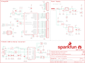

Contents
========

* [PRS13975 > RedBoard](#prs13975--redboard)
	* [Schematic](#schematic)
	* [PCB](#pcb)
	* [Interactive BOM](#interactive-bom)
	* [OOMP Parts](#oomp-parts)
	* [Images](#images)
	* [Tags](#tags)
  
![][im]
# PRS13975 > RedBoard

- ID: PROJ-SPAR-13975-STAN-01
- Hex ID: PRS13975
- Name: Sparkfun
- Description: Sparkfun
- Long Link: [http://oom.lt/PROJ-SPAR-13975-STAN-01](http://oom.lt/PROJ-SPAR-13975-STAN-01)
- Short Link: [http://oom.lt/PRS13975](http://oom.lt/PRS13975)

## Schematic
  

## PCB
  

## Interactive BOM

- Interactive BOM page: [ibom.html](https://htmlpreview.github.io/?https://github.com/oomlout/oomlout_OOMP_projects/blob/main/PROJ-SPAR-13975-STAN-01/kicad/bom/ibom.html)

## OOMP Parts
  

|OOMP Parts|
| :---: |
|[CAPC-0603-X-NF100-V50  SMD (0603) 100 nF Capacitor (Ceramic) 50v  C1, C2, C4, C8, C10, C12, C14](https://github.com/oomlout/oomlout_OOMP_parts/tree/main/CAPC-0603-X-NF100-V50/)|
|CAPT-3216-X-UF10-01 C3, C6, C15|
|CAPE-PAND-X-UF47-01 C5|
|CAPC-0603-X-UNMATCHED-01 C7|
|CAPC-0603-X-PF47-01 C9, C13|
|DIOD-UNMATCHED-X-UNMATCHED-01 D1|
|UNMATCHED-1206-X-UNMATCHED-01 F1|
|UNMATCHED-UNMATCHED-X-UNMATCHED-01 IC3, J2, JP12, S1, TP1, TP2, TP3, TP4, TP5, TP6, U1, U4, Y1|
|[DCJP-21D-X-STAN-01  2.1 mm DC Jack  J3](https://github.com/oomlout/oomlout_OOMP_parts/tree/main/DCJP-21D-X-STAN-01/)|
|[HEAD-I01-X-PI10-01  2.54 mm 10 Pin Header  JP2](https://github.com/oomlout/oomlout_OOMP_parts/tree/main/HEAD-I01-X-PI10-01/)|
|[HEAD-I01-X-PI08-01  2.54 mm 8 Pin Header  JP10, JP11](https://github.com/oomlout/oomlout_OOMP_parts/tree/main/HEAD-I01-X-PI08-01/)|
|[HEAD-I01-X-PI06-01  2.54 mm 6 Pin Header  JP13](https://github.com/oomlout/oomlout_OOMP_parts/tree/main/HEAD-I01-X-PI06-01/)|
|LEDS-1206-L-STAN-01 LED1|
|LEDS-1206-G-STAN-01 LED2|
|LEDS-1206-R-STAN-01 LED3|
|LEDS-1206-Y-STAN-01 LED4|
|MOSP-SO23-X-UNMATCHED-01 Q1|
|MOSN-UNMATCHED-X-UNMATCHED-01 Q2|
|[RESE-0603-X-O102-01  SMD (0603) 1k Ohm Resistor  R1, R6, R7, R8, R9](https://github.com/oomlout/oomlout_OOMP_parts/tree/main/RESE-0603-X-O102-01/)|
|[RESE-0603-X-O472-01  SMD (0603) 4.7k Ohm Resistor  R2](https://github.com/oomlout/oomlout_OOMP_parts/tree/main/RESE-0603-X-O472-01/)|
|[RESE-0603-X-O103-01  SMD (0603) 10k Ohm Resistor  R3, R4, R11, R13](https://github.com/oomlout/oomlout_OOMP_parts/tree/main/RESE-0603-X-O103-01/)|
|RESE-0603-X-O270-01 R5, R10|
|RESE-0603-X-O711-01 R14|
|[RESE-0603-X-O241-01  SMD (0603) 240 Ohm Resistor  R15](https://github.com/oomlout/oomlout_OOMP_parts/tree/main/RESE-0603-X-O241-01/)|
|VREG-SO235-X-KMIC5205-01 U2|

## Images
  
  

|bominteractivefront|bominteractiveback|kicadPcb3d|kicadPcb3dFront|kicadPcb3dBack|eagleImage|eagleSchemImage|
| :---: | :---: | :---: | :---: | :---: | :---: | :---: |
||||||||

## Tags

- hexID: PRS13975
- oompType: PROJ
- oompSize: SPAR
- oompColor: 13975
- oompDesc: STAN
- oompIndex: 01
- oompName: RedBoard
- sources: All source files from https://github.com/sparkfun/RedBoard (source licence details in srcLicense.md)
- linkBuyPage: https://www.sparkfun.com/products/13975
- oompID: PROJ-SPAR-13975-STAN-01
- oompParts: C1,CAPC-0603-X-NF100-V50
- oompParts: C2,CAPC-0603-X-NF100-V50
- oompParts: C3,CAPT-3216-X-UF10-01
- oompParts: C4,CAPC-0603-X-NF100-V50
- oompParts: C5,CAPE-PAND-X-UF47-01
- oompParts: C6,CAPT-3216-X-UF10-01
- oompParts: C7,CAPC-0603-X-UNMATCHED-01
- oompParts: C8,CAPC-0603-X-NF100-V50
- oompParts: C9,CAPC-0603-X-PF47-01
- oompParts: C10,CAPC-0603-X-NF100-V50
- oompParts: C12,CAPC-0603-X-NF100-V50
- oompParts: C13,CAPC-0603-X-PF47-01
- oompParts: C14,CAPC-0603-X-NF100-V50
- oompParts: C15,CAPT-3216-X-UF10-01
- oompParts: D1,DIOD-UNMATCHED-X-UNMATCHED-01
- oompParts: F1,UNMATCHED-1206-X-UNMATCHED-01
- oompParts: IC3,UNMATCHED-UNMATCHED-X-UNMATCHED-01
- oompParts: J2,UNMATCHED-UNMATCHED-X-UNMATCHED-01
- oompParts: J3,DCJP-21D-X-STAN-01
- oompParts: JP2,HEAD-I01-X-PI10-01
- oompParts: JP10,HEAD-I01-X-PI08-01
- oompParts: JP11,HEAD-I01-X-PI08-01
- oompParts: JP12,UNMATCHED-UNMATCHED-X-UNMATCHED-01
- oompParts: JP13,HEAD-I01-X-PI06-01
- oompParts: LED1,LEDS-1206-L-STAN-01
- oompParts: LED2,LEDS-1206-G-STAN-01
- oompParts: LED3,LEDS-1206-R-STAN-01
- oompParts: LED4,LEDS-1206-Y-STAN-01
- oompParts: Q1,MOSP-SO23-X-UNMATCHED-01
- oompParts: Q2,MOSN-UNMATCHED-X-UNMATCHED-01
- oompParts: R1,RESE-0603-X-O102-01
- oompParts: R2,RESE-0603-X-O472-01
- oompParts: R3,RESE-0603-X-O103-01
- oompParts: R4,RESE-0603-X-O103-01
- oompParts: R5,RESE-0603-X-O270-01
- oompParts: R6,RESE-0603-X-O102-01
- oompParts: R7,RESE-0603-X-O102-01
- oompParts: R8,RESE-0603-X-O102-01
- oompParts: R9,RESE-0603-X-O102-01
- oompParts: R10,RESE-0603-X-O270-01
- oompParts: R11,RESE-0603-X-O103-01
- oompParts: R13,RESE-0603-X-O103-01
- oompParts: R14,RESE-0603-X-O711-01
- oompParts: R15,RESE-0603-X-O241-01
- oompParts: S1,UNMATCHED-UNMATCHED-X-UNMATCHED-01
- oompParts: TP1,UNMATCHED-UNMATCHED-X-UNMATCHED-01
- oompParts: TP2,UNMATCHED-UNMATCHED-X-UNMATCHED-01
- oompParts: TP3,UNMATCHED-UNMATCHED-X-UNMATCHED-01
- oompParts: TP4,UNMATCHED-UNMATCHED-X-UNMATCHED-01
- oompParts: TP5,UNMATCHED-UNMATCHED-X-UNMATCHED-01
- oompParts: TP6,UNMATCHED-UNMATCHED-X-UNMATCHED-01
- oompParts: U1,UNMATCHED-UNMATCHED-X-UNMATCHED-01
- oompParts: U2,VREG-SO235-X-KMIC5205-01
- oompParts: U4,UNMATCHED-UNMATCHED-X-UNMATCHED-01
- oompParts: Y1,UNMATCHED-UNMATCHED-X-UNMATCHED-01
- rawParts: C1,0.1uF,0.1UF-0603-25V-(+80/-20%),0603,0.1µF ceramic capacitors,CAP-00810,0.1uF,
- rawParts: C2,0.1uF,0.1UF-0603-25V-(+80/-20%),0603,0.1µF ceramic capacitors,CAP-00810,0.1uF,
- rawParts: C3,10uF,10UF-POLAR-EIA3216-16V-10%(TANT),EIA3216,10.0µF polarized capacitors,CAP-00811,10uF,
- rawParts: C4,0.1uF,0.1UF-0603-25V-(+80/-20%),0603,0.1µF ceramic capacitors,CAP-00810,0.1uF,
- rawParts: C5,47uF,47UF-POLAR-PANASONIC_D-35V-20%,PANASONIC_D,47µF polarized capacitors,CAP-08478,47uF,
- rawParts: C6,10uF,10UF-POLAR-EIA3216-16V-10%(TANT),EIA3216,10.0µF polarized capacitors,CAP-00811,10uF,
- rawParts: C7,1.0uF,1.0UF-0603-16V-10%,0603,1µF ceramic capacitors,CAP-00868,1.0uF,
- rawParts: C8,0.1uF,0.1UF-0603-25V-(+80/-20%),0603,0.1µF ceramic capacitors,CAP-00810,0.1uF,
- rawParts: C9,47pF,47PF-0603-50V-5%,0603,47pF ceramic capacitors,CAP-08913,47pF,
- rawParts: C10,0.1uF,0.1UF-0603-25V-(+80/-20%),0603,0.1µF ceramic capacitors,CAP-00810,0.1uF,
- rawParts: C12,0.1uF,0.1UF-0603-25V-(+80/-20%),0603,0.1µF ceramic capacitors,CAP-00810,0.1uF,
- rawParts: C13,47pF,47PF-0603-50V-5%,0603,47pF ceramic capacitors,CAP-08913,47pF,
- rawParts: C14,0.1uF,0.1UF-0603-25V-(+80/-20%),0603,0.1µF ceramic capacitors,CAP-00810,0.1uF,
- rawParts: C15,10uF,10UF-POLAR-EIA3216-16V-10%(TANT),EIA3216,10.0µF polarized capacitors,CAP-00811,10uF,
- rawParts: D1,MBRA140,MBRA140,SMA-DIODE,40V, 1A Schottky rectifier,DIO-08053,,
- rawParts: F1,6V/0.5A,PTC-HALF_AMP,1206,Resettable Fuse PTC,RES-08585,6V/0.5A,
- rawParts: FRAME2,FRAME-LETTER,FRAME-LETTER,CREATIVE_COMMONS,Schematic Frame,,,
- rawParts: IC3,LM1117,V_REG_LM1117ALT1,SOT223-ALT1,Voltage Regulator LM1117,VREG-08170,,
- rawParts: J2,ICSP,AVR_SPI_PROG_3X2SMD,2X3_SMT_POSTS,AVR ISP 6 Pin,CONN-11415,,
- rawParts: J3,POWER_JACKSUPER_BOMB_DIGITY,POWER_JACKSUPER_BOMB_DIGITY,POWER_JACK_SMD_OVERPASTE_SUPER_BOMB_DIGITY,Power Jack,CONN-08106,,
- rawParts: JP1,SFE_LOGO_NAME.1_INCH,SFE_LOGO_NAME.1_INCH,SFE_LOGO_NAME_.1,SFE Logo, name only,,,
- rawParts: JP2,M10SMD_COMBO,M10SMD_COMBO,1X10_SMD_COMBINED,Header 10,CONN-11219,,
- rawParts: JP3,STAND-OFF,STAND-OFF,STAND-OFF,Stand Off,,,
- rawParts: JP4,STAND-OFF,STAND-OFF,STAND-OFF,Stand Off,,,
- rawParts: JP5,STAND-OFF,STAND-OFF,STAND-OFF,Stand Off,,,
- rawParts: JP6,STAND-OFF,STAND-OFF,STAND-OFF,Stand Off,,,
- rawParts: JP7,SFE_LOGO_FLAME.1_INCH,SFE_LOGO_FLAME.1_INCH,SFE_LOGO_FLAME_.1,SFE Logo, flame only,,,
- rawParts: JP8,FIDUCIAL1X2,FIDUCIAL1X2,FIDUCIAL-1X2,Fiducial Alignment Points,,,
- rawParts: JP9,FIDUCIAL1X2,FIDUCIAL1X2,FIDUCIAL-1X2,Fiducial Alignment Points,,,
- rawParts: JP10,JP10,M08SMD-COMBO,1X08_SMD_COMBINED,Header 8,CONN-10204,,
- rawParts: JP11,IOL,M08SMD-COMBO,1X08_SMD_COMBINED,Header 8,CONN-10204,,
- rawParts: JP12,USB-MINIB-5PIN,USB-MINIB-5PIN,USB-MINIB,Mini-USB B connector with 5th pin broken out.,CONN-08193,,
- rawParts: JP13,AD,M06SMD-STRAIGHT-COMBO,1X06_SMD_STRAIGHT_COMBO,Header 6,CONN-10203,,
- rawParts: LED1,Blue,LED1206,LED-1206,LED (Generic),DIO-09911,,
- rawParts: LED2,Green,LED1206,LED-1206,LED (Generic),DIO-09910,,
- rawParts: LED3,Red,LED1206,LED-1206,LED (Generic),DIO-09912,,
- rawParts: LED4,Yellow,LED1206,LED-1206,LED (Generic),DIO-09909,,
- rawParts: Q1,1A/60V/500mΩ,MOSFET-PCH-ZXMP6A13F,SOT23-3,P-channel MOSFETs,TRANS-08285,1A/60V/500mΩ,
- rawParts: Q2,2N7002PW,MOSFET-NCH-2N7002PW,SOT323,N-channel MOSFETs,TRANS-11151,310mA/60V/1.6Ω,
- rawParts: R1,1k,1KOHM-0603-1/10W-1%,0603,1kΩ resistor,RES-07856,1k,
- rawParts: R2,4.7k,4.7KOHM-0603-1/10W-1%,0603,4.7kΩ resistor,RES-07857,4.7k,
- rawParts: R3,10k,10KOHM-0603-1/10W-1%,0603,10kΩ resistor,RES-00824,10k,
- rawParts: R4,10k,10KOHM-0603-1/10W-1%,0603,10kΩ resistor,RES-00824,10k,
- rawParts: R5,27,27OHM-0603-1/10W-1%,0603,27Ω resistor,RES-09334,27,
- rawParts: R6,1k,1KOHM-0603-1/10W-1%,0603,1kΩ resistor,RES-07856,1k,
- rawParts: R7,1k,1KOHM-0603-1/10W-1%,0603,1kΩ resistor,RES-07856,1k,
- rawParts: R8,1k,1KOHM-0603-1/10W-1%,0603,1kΩ resistor,RES-07856,1k,
- rawParts: R9,1k,1KOHM-0603-1/10W-1%,0603,1kΩ resistor,RES-07856,1k,
- rawParts: R10,27,27OHM-0603-1/10W-1%,0603,27Ω resistor,RES-09334,27,
- rawParts: R11,10k,10KOHM-0603-1/10W-1%,0603,10kΩ resistor,RES-00824,10k,
- rawParts: R13,10k,10KOHM-0603-1/10W-1%,0603,10kΩ resistor,RES-00824,10k,
- rawParts: R14,715,715OHM-0603-1/10W-1%,0603,715Ω resistor,RES-07850,715,
- rawParts: R15,240,240OHM-0603-1/10W-1%,0603,240Ω resistor,RES-07849,240,
- rawParts: S1,RESET,SWITCH_SPST_4_PINSQUARE,TACTILE-SWITCH-SMD,,SWCH-08247,,
- rawParts: TP1,TP-3x5,TEST-POINT3X5,PAD.03X.05,Bare copper test points for troubleshooting or ICT,,,
- rawParts: TP2,TP-3x5,TEST-POINT3X5,PAD.03X.05,Bare copper test points for troubleshooting or ICT,,,
- rawParts: TP3,TP-3x5,TEST-POINT3X5,PAD.03X.05,Bare copper test points for troubleshooting or ICT,,,
- rawParts: TP4,TP-3x5,TEST-POINT3X5,PAD.03X.05,Bare copper test points for troubleshooting or ICT,,,
- rawParts: TP5,TP-3x5,TEST-POINT3X5,PAD.03X.05,Bare copper test points for troubleshooting or ICT,,,
- rawParts: TP6,TP-3x5,TEST-POINT3X5,PAD.03X.05,Bare copper test points for troubleshooting or ICT,,,
- rawParts: U$16,OSHW-LOGOS,OSHW-LOGOS,OSHW-LOGO-S,Open Source Hardware Logo,,,
- rawParts: U1,FT231XS,FT231XS,SSOP20_L,FTDI FT231X Full Speed USB to Full-handshake UART,IC-11524,FT231XS,
- rawParts: U2,MIC5205,MIC52053.3V,SOT23-5,MIC5205 150mA vreg,VREG-00822,,
- rawParts: U4,ATMEGA328P_TQFP,ATMEGA328P_TQFP,TQFP32-08,,IC-09069,ATMEGA328P_TQFP,
- rawParts: Y1,16MHz,RESONATOR-16MHZSMD_3.2X1.3,RESONATOR-SMD-3.2X1.3,16MHz Resonator,XTAL-08900,16MHz,

[im]: kicadPcb3d_450.png
