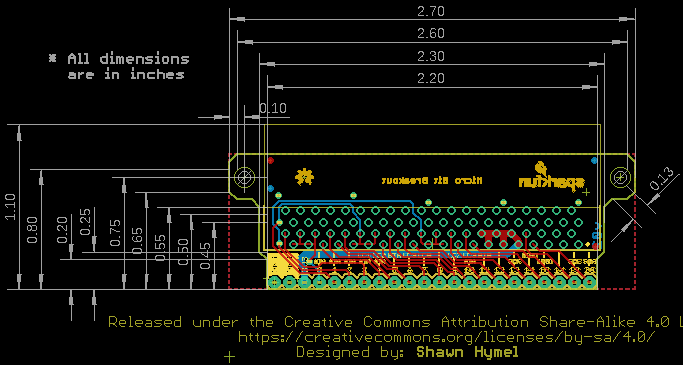
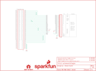

Contents
========

* [PRS13988 > Micro Bit Breakout](#prs13988--micro-bit-breakout)
	* [Schematic](#schematic)
	* [PCB](#pcb)
	* [Interactive BOM](#interactive-bom)
	* [OOMP Parts](#oomp-parts)
	* [Images](#images)
	* [Tags](#tags)
  
![][im]
# PRS13988 > Micro Bit Breakout

- ID: PROJ-SPAR-13988-STAN-01
- Hex ID: PRS13988
- Name: Sparkfun
- Description: Sparkfun
- Long Link: [http://oom.lt/PROJ-SPAR-13988-STAN-01](http://oom.lt/PROJ-SPAR-13988-STAN-01)
- Short Link: [http://oom.lt/PRS13988](http://oom.lt/PRS13988)

## Schematic
  

## PCB
  

## Interactive BOM

- Interactive BOM page: [ibom.html](https://htmlpreview.github.io/?https://github.com/oomlout/oomlout_OOMP_projects/blob/main/PROJ-SPAR-13988-STAN-01/kicad/bom/ibom.html)

## OOMP Parts
  

|OOMP Parts|
| :---: |
|UNMATCHED-UNMATCHED-X-UNMATCHED-01 J1|
|HEAD-I01-X-PI22-01 J2|

## Images
  
  

|kicadPcb3d|kicadPcb3dFront|kicadPcb3dBack|eagleImage|eagleSchemImage|
| :---: | :---: | :---: | :---: | :---: |
||||||

## Tags

- hexID: PRS13988
- oompType: PROJ
- oompSize: SPAR
- oompColor: 13988
- oompDesc: STAN
- oompIndex: 01
- oompName: Micro Bit Breakout
- sources: All source files from https://github.com/sparkfun/Micro_Bit_Breakout (source licence details in srcLicense.md)
- linkBuyPage: https://www.sparkfun.com/products/13988
- oompID: PROJ-SPAR-13988-STAN-01
- oompParts: J1,UNMATCHED-UNMATCHED-X-UNMATCHED-01
- oompParts: J2,HEAD-I01-X-PI22-01
- rawParts: FD1,FIDUCIAL1X2,FIDUCIAL1X2,FIDUCIAL-1X2,Fiducial Alignment Points,,
- rawParts: FD2,FIDUCIAL1X2,FIDUCIAL1X2,FIDUCIAL-1X2,Fiducial Alignment Points,,
- rawParts: FD3,FIDUCIAL1X2,FIDUCIAL1X2,FIDUCIAL-1X2,Fiducial Alignment Points,,
- rawParts: FD4,FIDUCIAL1X2,FIDUCIAL1X2,FIDUCIAL-1X2,Fiducial Alignment Points,,
- rawParts: FRAME1,FRAME-LETTER,FRAME-LETTER,CREATIVE_COMMONS,Schematic Frame,,
- rawParts: H1,STAND-OFF,STAND-OFF,STAND-OFF,#4 Stand Off,,
- rawParts: H2,STAND-OFF,STAND-OFF,STAND-OFF,#4 Stand Off,,
- rawParts: J1,EDGE-80PTH-RA,EDGE-80PTH-RA,VEC-127-080-R,Card edge connector (80 pin) for accepting a PCB with finger edge pins. This connector will accept the BBC micro:bit board.,CONN-13452,
- rawParts: J2,M22PTH,M22PTH,1X22,Standard 22-pin 0.1 header,CONN-13453,
- rawParts: LOGO2,SFE_LOGO_NAME_FLAME.1_INCH,SFE_LOGO_NAME_FLAME.1_INCH,SFE_LOGO_NAME_FLAME_.1,SFE Logo, name and flame,,
- rawParts: LOGO3,OSHW-LOGOS,OSHW-LOGOS,OSHW-LOGO-S,Open Source Hardware Logo,,

[im]: kicadPcb3d_450.png
