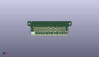
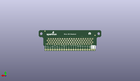
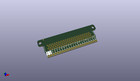

Contents
========

* [PROJ-SPAR-13988-STAN-01>Micro Bit Breakout](#proj-spar-13988-stan-01micro-bit-breakout)
	* [Images](#images)
	* [Interactive BOM](#interactive-bom)
	* [OOMP Parts](#oomp-parts)
	* [Tags](#tags)
  
![][im]
# PROJ-SPAR-13988-STAN-01>Micro Bit Breakout

- ID: PROJ-SPAR-13988-STAN-01
- Hex ID: PRS13988
- Name: Micro Bit Breakout
- Description: 

## Images
  
  

|eagleImage|kicadPcb3dFront|kicadPcb3dBack|kicadPcb3d|
| :---: | :---: | :---: | :---: |
|||||

## Interactive BOM

- Interactive BOM page: [ibom.html](kicad/bom/ibom.html)

## OOMP Parts
  

|OOMP Parts|
| :---: |
|UNMATCHED-UNMATCHED-X-UNMATCHED-01, J1, 34.29, 7.619999999999999, 180,J1, EDGE-80PTH-RA, VEC-127-080-R, local_lib, (1.35, 0.3), R180|
|UNMATCHED-UNMATCHED-X-UNMATCHED-01, J2, 7.619999999999999, 1.27, 0,J2, M22PTH, 1X22, local_lib, (0.3, 0.05), R0|

## Tags

- hexID: PRS13988
- oompType: PROJ
- oompSize: SPAR
- oompColor: 13988
- oompDesc: STAN
- oompIndex: 01
- oompName: Micro Bit Breakout
- sources: All source files from https://github.com/sparkfun/Micro_Bit_Breakout (source licence details in srcLicense.md)
- linkBuyPage: https://www.sparkfun.com/products/13988
- oompPart: SKIP-UNMATCHED-X-UNMATCHED-01, FD1, 6.858, 21.843999999999998, 0
- oompPart: SKIP-UNMATCHED-X-UNMATCHED-01, FD2, 61.97599999999999, 7.365999999999999, 0
- oompPart: SKIP-UNMATCHED-X-UNMATCHED-01, FD3, 61.722, 21.843999999999998, M0
- oompPart: SKIP-UNMATCHED-X-UNMATCHED-01, FD4, 6.858, 17.145, M0
- oompPart: UNMATCHED-UNMATCHED-X-UNMATCHED-01, J1, 34.29, 7.619999999999999, 180
- oompPart: UNMATCHED-UNMATCHED-X-UNMATCHED-01, J2, 7.619999999999999, 1.27, 0
- rawPart: FD1, FIDUCIAL1X2, FIDUCIAL-1X2, SparkFun-Aesthetics, (0.27, 0.86), R0
- rawPart: FD2, FIDUCIAL1X2, FIDUCIAL-1X2, SparkFun-Aesthetics, (2.44, 0.29), R0
- rawPart: FD3, FIDUCIAL1X2, FIDUCIAL-1X2, SparkFun-Aesthetics, (2.43, 0.86), MR0
- rawPart: FD4, FIDUCIAL1X2, FIDUCIAL-1X2, SparkFun-Aesthetics, (0.27, 0.675), MR0
- rawPart: J1, EDGE-80PTH-RA, VEC-127-080-R, local_lib, (1.35, 0.3), R180
- rawPart: J2, M22PTH, 1X22, local_lib, (0.3, 0.05), R0
- oompID: PROJ-SPAR-13988-STAN-01

[im]: kicadPcb3d_450.png
