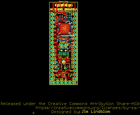
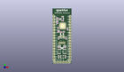
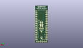
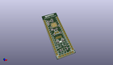

Contents
========

* [PROJ-SPAR-13990-STAN-01>nRF52832 Breakout](#proj-spar-13990-stan-01nrf52832-breakout)
	* [Images](#images)
	* [Interactive BOM](#interactive-bom)
	* [OOMP Parts](#oomp-parts)
	* [Tags](#tags)
  
![][im]
# PROJ-SPAR-13990-STAN-01>nRF52832 Breakout

- ID: PROJ-SPAR-13990-STAN-01
- Hex ID: PRS13990
- Name: nRF52832 Breakout
- Description: 

## Images
  
  

|eagleImage|kicadPcb3dFront|kicadPcb3dBack|kicadPcb3d|
| :---: | :---: | :---: | :---: |
|||||

## Interactive BOM

- Interactive BOM page: [ibom.html](kicad/bom/ibom.html)

## OOMP Parts
  

|OOMP Parts|
| :---: |
|CAPC-0603-X-UNMATCHED-01, C1, 5.715, 6.35, 270,C1, 1.0uF, 0603, SparkFun-Capacitors, (0.225, 0.25), R270|
|CAPC-0603-X-UF22D-01, C2, 12.065, 6.35, 270,C2, 2.2uF, 0603, SparkFun-Capacitors, (0.475, 0.25), R270|
|CAPC-0402-X-NF100-V50, C3, 6.35, 30.479999999999997, 90,C3, 0.1uF, 0402, SparkFun-Capacitors, (0.25, 1.2), R90|
|UNMATCHED-0402-X-UNMATCHED-01, C4, 7.874, 41.91, 270,C4, DNP, 0402, SparkFun-Passives, (0.31, 1.65), R270|
|CAPE-0402-X-UNMATCHED-01, C5, 6.5024, 41.91, 270,C5, 100pF, 0402, nrf52832-breakout-temp, (0.256, 1.65), R270|
|CAPC-0402-X-UNMATCHED-01, C6, 5.08, 33.654999999999994, 270,C6, 1.0uF, 0402, SparkFun-Capacitors, (0.2, 1.325), R270|
|CAPE-0603-X-UNMATCHED-01, C7, 5.715, 24.13, 90,C7, 180pF, 0603, nrf52832-breakout-temp, (0.225, 0.95), R90|
|CAPE-0603-X-UNMATCHED-01, C8, 12.7, 24.13, 90,C8, 180pF, 0603, nrf52832-breakout-temp, (0.5, 0.95), R90|
|CAPC-0402-X-UNMATCHED-01, C9, 4.444999999999999, 43.18, 180,C9, 6pF, 0402, nrf52832-breakout-temp, (0.175, 1.7), R180|
|CAPC-0402-X-UNMATCHED-01, C10, 4.444999999999999, 39.4716, 180,C10, 6pF, 0402, nrf52832-breakout-temp, (0.175, 1.554), R180|
|CAPC-0402-X-UNMATCHED-01, C11, 9.524999999999999, 40.309799999999996, 0,C11, 0.8pF, 0402, nrf52832-breakout-temp, (0.375, 1.587), R0|
|UNMATCHED-0402-X-UNMATCHED-01, C12, 9.524999999999999, 44.449999999999996, 180,C12, DNP, 0402, SparkFun-Passives, (0.375, 1.75), R180|
|CAPC-0402-X-UNMATCHED-01, C13, 8.128, 29.845, 180,C13, 15pF, 0402, SparkFun-Capacitors, (0.32, 1.175), R180|
|CAPC-0402-X-UNMATCHED-01, C14, 10.5918, 29.845, 0,C14, 15pF, 0402, SparkFun-Capacitors, (0.417, 1.175), R0|
|CAPC-0402-X-NF100-V50, C15, 13.97, 32.766, 270,C15, 0.1uF, 0402, SparkFun-Capacitors, (0.55, 1.29), R270|
|CAPC-0402-X-NF100-V50, C16, 4.444999999999999, 38.099999999999994, 180,C16, 0.1uF, 0402, SparkFun-Capacitors, (0.175, 1.5), R180|
|CAPC-0603-X-UNMATCHED-01, C17, 5.08, 30.479999999999997, 270,C17, 4.7uF, 0603, SparkFun-Capacitors, (0.2, 1.2), R270|
|UNMATCHED-0603-X-UNMATCHED-01, D1, 6.35, 16.509999999999998, 0,D1, RED, LED-0603, SparkFun-LED, (0.25, 0.65), R0|
|UNMATCHED-0603-X-UNMATCHED-01, D2, 11.43, 16.509999999999998, 0,D2, BLUE, LED-0603, SparkFun-LED, (0.45, 0.65), R0|
|UNMATCHED-UNMATCHED-X-UNMATCHED-01, E1, 4.444999999999999, 46.99, 0,E1, ANT, TRACE_ANTENNA_2.4GHZ_15.2MM, SparkFun-RF, (0.175, 1.85), R0|
|UNMATCHED-UNMATCHED-X-UNMATCHED-01, J1, 2.54, 1.27, 0,J1, 1X06, SparkFun-Connectors, (0.1, 0.05), R0|
|UNMATCHED-UNMATCHED-X-UNMATCHED-01, J2, 10.16, 25.4, 180,J2, 1X02, SparkFun-Connectors, (0.4, 1), R180|
|UNMATCHED-UNMATCHED-X-UNMATCHED-01, J3, 1.27, 3.8099999999999996, 90,J3, 1X17, SparkFun-Connectors, (0.05, 0.15), R90|
|UNMATCHED-UNMATCHED-X-UNMATCHED-01, J4, 16.509999999999998, 3.8099999999999996, 90,J4, 1X17, SparkFun-Connectors, (0.65, 0.15), R90|
|UNMATCHED-UNMATCHED-X-UNMATCHED-01, J5, 8.889999999999999, 19.558, 0,J5, CORTEX_DEBUGPTH, 2X5-PTH-1.27MM, SparkFun-Connectors, (0.35, 0.77), R0|
|UNMATCHED-UNMATCHED-X-UNMATCHED-01, JP1, 8.889999999999999, 5.715, M0,JP1, VDD-EN, SMT-JUMPER_2_NC_TRACE_SILK, SparkFun-Jumpers, (0.35, 0.225), MR0|
|UNMATCHED-UNMATCHED-X-UNMATCHED-01, JP2, 7.619999999999999, 23.495, M180,JP2, NFC1, SMT-JUMPER_2_NO_SILK, SparkFun-Jumpers, (0.3, 0.925), MR180|
|UNMATCHED-UNMATCHED-X-UNMATCHED-01, JP3, 10.16, 23.495, M0,JP3, NFC2, SMT-JUMPER_2_NO_SILK, SparkFun-Jumpers, (0.4, 0.925), MR0|
|UNMATCHED-0402-X-UNMATCHED-01, L1, 10.105000109999999, 42.545, 270,L1, 3.9nH, 0402, nrf52832-breakout-temp, (0.39783465, 1.675), R270|
|RESE-0603-X-UNMATCHED-01, R1, 11.43, 15.239999999999998, 0,R1, 1k, 0603, SparkFun-Resistors, (0.45, 0.6), R0|
|RESE-0603-X-UNMATCHED-01, R2, 6.35, 15.239999999999998, 0,R2, 1k, 0603, SparkFun-Resistors, (0.25, 0.6), R0|
|UNMATCHED-UNMATCHED-X-UNMATCHED-01, SW1, 6.35, 11.43, 90,SW1, TACTILE_SWITCH_SMD_4_6X2_8MM, TACTILE_SWITCH_SMD_4.6X2.8MM, SparkFun-Electromechanical, (0.25, 0.45), R90|
|UNMATCHED-UNMATCHED-X-UNMATCHED-01, SW2, 11.43, 11.43, 90,SW2, TACTILE_SWITCH_SMD_4_6X2_8MM, TACTILE_SWITCH_SMD_4.6X2.8MM, SparkFun-Electromechanical, (0.45, 0.45), R90|
|UNMATCHED-UNMATCHED-X-UNMATCHED-01, U1, 8.889999999999999, 6.35, 270,U1, AP2112K-3.3V, SOT23-5, SparkFun-PowerIC, (0.35, 0.25), R270|
|UNMATCHED-UNMATCHED-X-UNMATCHED-01, U2, 9.524999999999999, 35.559999999999995, 90,U2, NRF52832, QFN48-6X6MM, nrf52832-breakout-temp, (0.375, 1.4), R90|
|UNMATCHED-UNMATCHED-X-UNMATCHED-01, Y1, 4.444999999999999, 41.275, 90,Y1, 32MHz, CRYSTAL-SMD-2.0X1.6MM, nrf52832-breakout-temp, (0.175, 1.625), R90|
|UNMATCHED-UNMATCHED-X-UNMATCHED-01, Y2, 8.889999999999999, 27.94, 180,Y2, 32.768kHz, CRYSTAL-SMD-3.2X1.5MM, SparkFun-Clocks, (0.35, 1.1), R180|

## Tags

- hexID: PRS13990
- oompType: PROJ
- oompSize: SPAR
- oompColor: 13990
- oompDesc: STAN
- oompIndex: 01
- oompName: nRF52832 Breakout
- sources: All source files from https://github.com/sparkfun/nRF52832_Breakout (source licence details in srcLicense.md)
- linkBuyPage: https://www.sparkfun.com/products/13990
- oompID: PROJ-SPAR-13990-STAN-01
- oompPart: CAPC-0603-X-UNMATCHED-01, C1, 5.715, 6.35, 270
- oompPart: CAPC-0603-X-UF22D-01, C2, 12.065, 6.35, 270
- oompPart: CAPC-0402-X-NF100-V50, C3, 6.35, 30.479999999999997, 90
- oompPart: UNMATCHED-0402-X-UNMATCHED-01, C4, 7.874, 41.91, 270
- oompPart: CAPE-0402-X-UNMATCHED-01, C5, 6.5024, 41.91, 270
- oompPart: CAPC-0402-X-UNMATCHED-01, C6, 5.08, 33.654999999999994, 270
- oompPart: CAPE-0603-X-UNMATCHED-01, C7, 5.715, 24.13, 90
- oompPart: CAPE-0603-X-UNMATCHED-01, C8, 12.7, 24.13, 90
- oompPart: CAPC-0402-X-UNMATCHED-01, C9, 4.444999999999999, 43.18, 180
- oompPart: CAPC-0402-X-UNMATCHED-01, C10, 4.444999999999999, 39.4716, 180
- oompPart: CAPC-0402-X-UNMATCHED-01, C11, 9.524999999999999, 40.309799999999996, 0
- oompPart: UNMATCHED-0402-X-UNMATCHED-01, C12, 9.524999999999999, 44.449999999999996, 180
- oompPart: CAPC-0402-X-UNMATCHED-01, C13, 8.128, 29.845, 180
- oompPart: CAPC-0402-X-UNMATCHED-01, C14, 10.5918, 29.845, 0
- oompPart: CAPC-0402-X-NF100-V50, C15, 13.97, 32.766, 270
- oompPart: CAPC-0402-X-NF100-V50, C16, 4.444999999999999, 38.099999999999994, 180
- oompPart: CAPC-0603-X-UNMATCHED-01, C17, 5.08, 30.479999999999997, 270
- oompPart: UNMATCHED-0603-X-UNMATCHED-01, D1, 6.35, 16.509999999999998, 0
- oompPart: UNMATCHED-0603-X-UNMATCHED-01, D2, 11.43, 16.509999999999998, 0
- oompPart: UNMATCHED-UNMATCHED-X-UNMATCHED-01, E1, 4.444999999999999, 46.99, 0
- oompPart: SKIP-UNMATCHED-X-UNMATCHED-01, FD1, 13.589, 3.175, 0
- oompPart: SKIP-UNMATCHED-X-UNMATCHED-01, FD2, 0.889, 46.355, 0
- oompPart: UNMATCHED-UNMATCHED-X-UNMATCHED-01, J1, 2.54, 1.27, 0
- oompPart: UNMATCHED-UNMATCHED-X-UNMATCHED-01, J2, 10.16, 25.4, 180
- oompPart: UNMATCHED-UNMATCHED-X-UNMATCHED-01, J3, 1.27, 3.8099999999999996, 90
- oompPart: UNMATCHED-UNMATCHED-X-UNMATCHED-01, J4, 16.509999999999998, 3.8099999999999996, 90
- oompPart: UNMATCHED-UNMATCHED-X-UNMATCHED-01, J5, 8.889999999999999, 19.558, 0
- oompPart: UNMATCHED-UNMATCHED-X-UNMATCHED-01, JP1, 8.889999999999999, 5.715, M0
- oompPart: UNMATCHED-UNMATCHED-X-UNMATCHED-01, JP2, 7.619999999999999, 23.495, M180
- oompPart: UNMATCHED-UNMATCHED-X-UNMATCHED-01, JP3, 10.16, 23.495, M0
- oompPart: SKIP-UNMATCHED-X-UNMATCHED-01, JP4, 7.619999999999999, 27.94, M180
- oompPart: SKIP-UNMATCHED-X-UNMATCHED-01, JP5, 10.16, 27.94, M0
- oompPart: SKIP-UNMATCHED-X-UNMATCHED-01, JP6, 8.889999999999999, 15.239999999999998, M0
- oompPart: UNMATCHED-0402-X-UNMATCHED-01, L1, 10.105000109999999, 42.545, 270
- oompPart: RESE-0603-X-UNMATCHED-01, R1, 11.43, 15.239999999999998, 0
- oompPart: RESE-0603-X-UNMATCHED-01, R2, 6.35, 15.239999999999998, 0
- oompPart: UNMATCHED-UNMATCHED-X-UNMATCHED-01, SW1, 6.35, 11.43, 90
- oompPart: UNMATCHED-UNMATCHED-X-UNMATCHED-01, SW2, 11.43, 11.43, 90
- oompPart: SKIP-UNMATCHED-X-UNMATCHED-01, TP1, 7.619999999999999, 21.691599999999998, M0
- oompPart: SKIP-UNMATCHED-X-UNMATCHED-01, TP2, 10.16, 21.691599999999998, M0
- oompPart: UNMATCHED-UNMATCHED-X-UNMATCHED-01, U1, 8.889999999999999, 6.35, 270
- oompPart: UNMATCHED-UNMATCHED-X-UNMATCHED-01, U2, 9.524999999999999, 35.559999999999995, 90
- oompPart: UNMATCHED-UNMATCHED-X-UNMATCHED-01, Y1, 4.444999999999999, 41.275, 90
- oompPart: UNMATCHED-UNMATCHED-X-UNMATCHED-01, Y2, 8.889999999999999, 27.94, 180
- rawPart: C1, 1.0uF, 0603, SparkFun-Capacitors, (0.225, 0.25), R270
- rawPart: C2, 2.2uF, 0603, SparkFun-Capacitors, (0.475, 0.25), R270
- rawPart: C3, 0.1uF, 0402, SparkFun-Capacitors, (0.25, 1.2), R90
- rawPart: C4, DNP, 0402, SparkFun-Passives, (0.31, 1.65), R270
- rawPart: C5, 100pF, 0402, nrf52832-breakout-temp, (0.256, 1.65), R270
- rawPart: C6, 1.0uF, 0402, SparkFun-Capacitors, (0.2, 1.325), R270
- rawPart: C7, 180pF, 0603, nrf52832-breakout-temp, (0.225, 0.95), R90
- rawPart: C8, 180pF, 0603, nrf52832-breakout-temp, (0.5, 0.95), R90
- rawPart: C9, 6pF, 0402, nrf52832-breakout-temp, (0.175, 1.7), R180
- rawPart: C10, 6pF, 0402, nrf52832-breakout-temp, (0.175, 1.554), R180
- rawPart: C11, 0.8pF, 0402, nrf52832-breakout-temp, (0.375, 1.587), R0
- rawPart: C12, DNP, 0402, SparkFun-Passives, (0.375, 1.75), R180
- rawPart: C13, 15pF, 0402, SparkFun-Capacitors, (0.32, 1.175), R180
- rawPart: C14, 15pF, 0402, SparkFun-Capacitors, (0.417, 1.175), R0
- rawPart: C15, 0.1uF, 0402, SparkFun-Capacitors, (0.55, 1.29), R270
- rawPart: C16, 0.1uF, 0402, SparkFun-Capacitors, (0.175, 1.5), R180
- rawPart: C17, 4.7uF, 0603, SparkFun-Capacitors, (0.2, 1.2), R270
- rawPart: D1, RED, LED-0603, SparkFun-LED, (0.25, 0.65), R0
- rawPart: D2, BLUE, LED-0603, SparkFun-LED, (0.45, 0.65), R0
- rawPart: E1, ANT, TRACE_ANTENNA_2.4GHZ_15.2MM, SparkFun-RF, (0.175, 1.85), R0
- rawPart: FD1, FIDUCIALUFIDUCIAL, FIDUCIAL-MICRO, SparkFun-Aesthetics, (0.535, 0.125), R0
- rawPart: FD2, FIDUCIALUFIDUCIAL, FIDUCIAL-MICRO, SparkFun-Aesthetics, (0.035, 1.825), R0
- rawPart: J1, 1X06, SparkFun-Connectors, (0.1, 0.05), R0
- rawPart: J2, 1X02, SparkFun-Connectors, (0.4, 1), R180
- rawPart: J3, 1X17, SparkFun-Connectors, (0.05, 0.15), R90
- rawPart: J4, 1X17, SparkFun-Connectors, (0.65, 0.15), R90
- rawPart: J5, CORTEX_DEBUGPTH, 2X5-PTH-1.27MM, SparkFun-Connectors, (0.35, 0.77), R0
- rawPart: JP1, VDD-EN, SMT-JUMPER_2_NC_TRACE_SILK, SparkFun-Jumpers, (0.35, 0.225), MR0
- rawPart: JP2, NFC1, SMT-JUMPER_2_NO_SILK, SparkFun-Jumpers, (0.3, 0.925), MR180
- rawPart: JP3, NFC2, SMT-JUMPER_2_NO_SILK, SparkFun-Jumpers, (0.4, 0.925), MR0
- rawPart: JP4, XL1, PAD-JUMPER-2-NC_BY_TRACE_YES_SILK, SparkFun-Jumpers, (0.3, 1.1), MR180
- rawPart: JP5, XL2, PAD-JUMPER-2-NC_BY_TRACE_YES_SILK, SparkFun-Jumpers, (0.4, 1.1), MR0
- rawPart: JP6, PWR-LED, PAD-JUMPER-2-NC_BY_TRACE_YES_SILK, SparkFun-Jumpers, (0.35, 0.6), MR0
- rawPart: L1, 3.9nH, 0402, nrf52832-breakout-temp, (0.39783465, 1.675), R270
- rawPart: R1, 1k, 0603, SparkFun-Resistors, (0.45, 0.6), R0
- rawPart: R2, 1k, 0603, SparkFun-Resistors, (0.25, 0.6), R0
- rawPart: SW1, TACTILE_SWITCH_SMD_4_6X2_8MM, TACTILE_SWITCH_SMD_4.6X2.8MM, SparkFun-Electromechanical, (0.25, 0.45), R90
- rawPart: SW2, TACTILE_SWITCH_SMD_4_6X2_8MM, TACTILE_SWITCH_SMD_4.6X2.8MM, SparkFun-Electromechanical, (0.45, 0.45), R90
- rawPart: TP1, TEST-POINT3X4, PAD.03X.04, SparkFun-Connectors, (0.3, 0.854), MR0
- rawPart: TP2, TEST-POINT3X4, PAD.03X.04, SparkFun-Connectors, (0.4, 0.854), MR0
- rawPart: U1, AP2112K-3.3V, SOT23-5, SparkFun-PowerIC, (0.35, 0.25), R270
- rawPart: U2, NRF52832, QFN48-6X6MM, nrf52832-breakout-temp, (0.375, 1.4), R90
- rawPart: Y1, 32MHz, CRYSTAL-SMD-2.0X1.6MM, nrf52832-breakout-temp, (0.175, 1.625), R90
- rawPart: Y2, 32.768kHz, CRYSTAL-SMD-3.2X1.5MM, SparkFun-Clocks, (0.35, 1.1), R180

[im]: kicadPcb3d_450.png
