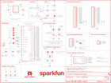

Contents
========

* [PRS13990 > Sparkfun](#prs13990--sparkfun)
	* [Schematic](#schematic)
	* [Interactive BOM](#interactive-bom)
	* [OOMP Parts](#oomp-parts)
	* [Images](#images)
	* [Tags](#tags)
  
![][im]
# PRS13990 > Sparkfun

- ID: PROJ-SPAR-13990-STAN-01
- Hex ID: PRS13990
- Name: Sparkfun
- Description: Sparkfun
- Long Link: [http://oom.lt/PROJ-SPAR-13990-STAN-01](http://oom.lt/PROJ-SPAR-13990-STAN-01)
- Long Link: [http://oom.lt/PRS13990](http://oom.lt/PRS13990)

## Schematic
  
![][schem]
## Interactive BOM

- Interactive BOM page: [ibom.html](https://htmlpreview.github.io/?https://github.com/oomlout/oomlout_OOMP_projects/blob/main/PROJ-SPAR-13990-STAN-01/kicad/bom/ibom.html)

## OOMP Parts
  

|OOMP Parts|
| :---: |
|C1,UNMATCHED-UNMATCHED-UNMATCHED-UNMATCHED-UNMATCHED,C1,1.0uF,1.0UF-0603-16V-10%,0603,1µF ceramic capacitors,CAP-00868,1.0uF,|
|C2,UNMATCHED-UNMATCHED-UNMATCHED-UNMATCHED-UNMATCHED,C2,2.2uF,2.2UF-0603-10V-20%,0603,2.2µF ceramic capacitors,CAP-07888,2.2uF,|
|C3,UNMATCHED-UNMATCHED-UNMATCHED-UNMATCHED-UNMATCHED,C3,0.1uF,0.1UF-0402-16V-10%,0402,0.1µF ceramic capacitors,CAP-12416,0.1uF,|
|C4,UNMATCHED-UNMATCHED-UNMATCHED-UNMATCHED-UNMATCHED,C4,DNP,CAP0402,0402,Capacitor,,,|
|C5,UNMATCHED-UNMATCHED-UNMATCHED-UNMATCHED-UNMATCHED,C5,100pF,100PF-0402-50V-5%,0402,100pF/0.1nF ceramic capacitors,CAP-13458,100pF,|
|C6,UNMATCHED-UNMATCHED-UNMATCHED-UNMATCHED-UNMATCHED,C6,1.0uF,1.0UF-0402-16V-10%,0402,1µF ceramic capacitors,CAP-12417,1.0uF,|
|C7,UNMATCHED-UNMATCHED-UNMATCHED-UNMATCHED-UNMATCHED,C7,180pF,180PF-0603-50V-5%,0603,180pF/0.18nF ceramic capacitors,CAP-11661,180pF,|
|C8,UNMATCHED-UNMATCHED-UNMATCHED-UNMATCHED-UNMATCHED,C8,180pF,180PF-0603-50V-5%,0603,180pF/0.18nF ceramic capacitors,CAP-11661,180pF,|
|C9,UNMATCHED-UNMATCHED-UNMATCHED-UNMATCHED-UNMATCHED,C9,6pF,6PF-0402-50V-0.5%,0402,15pF ceramic capacitors,CAP-13455,6pF,|
|C10,UNMATCHED-UNMATCHED-UNMATCHED-UNMATCHED-UNMATCHED,C10,6pF,6PF-0402-50V-0.5%,0402,15pF ceramic capacitors,CAP-13455,6pF,|
|C11,UNMATCHED-UNMATCHED-UNMATCHED-UNMATCHED-UNMATCHED,C11,0.8pF,0.8PF-0402-50V-0.1PF,0402,0.8pF ceramic capacitors,CAP-13456,0.8pF,|
|C12,UNMATCHED-UNMATCHED-UNMATCHED-UNMATCHED-UNMATCHED,C12,DNP,CAP0402,0402,Capacitor,,,|
|C13,UNMATCHED-UNMATCHED-UNMATCHED-UNMATCHED-UNMATCHED,C13,15pF,15PF-0402-50V-5%,0402,15pF ceramic capacitors,CAP-13063,15pF,|
|C14,UNMATCHED-UNMATCHED-UNMATCHED-UNMATCHED-UNMATCHED,C14,15pF,15PF-0402-50V-5%,0402,15pF ceramic capacitors,CAP-13063,15pF,|
|C15,UNMATCHED-UNMATCHED-UNMATCHED-UNMATCHED-UNMATCHED,C15,0.1uF,0.1UF-0402-16V-10%,0402,0.1µF ceramic capacitors,CAP-12416,0.1uF,|
|C16,UNMATCHED-UNMATCHED-UNMATCHED-UNMATCHED-UNMATCHED,C16,0.1uF,0.1UF-0402-16V-10%,0402,0.1µF ceramic capacitors,CAP-12416,0.1uF,|
|C17,UNMATCHED-UNMATCHED-UNMATCHED-UNMATCHED-UNMATCHED,C17,4.7uF,4.7UF0603,0603,4.7µF ceramic capacitors,CAP-08280,4.7uF,|
|D1,UNMATCHED-UNMATCHED-UNMATCHED-UNMATCHED-UNMATCHED,D1,RED,LED-RED0603,LED-0603,Red SMD LED,DIO-00819,RED,|
|D2,UNMATCHED-UNMATCHED-UNMATCHED-UNMATCHED-UNMATCHED,D2,BLUE,LED-BLUE0603,LED-0603,Blue SMD LED,DIO-08575,BLUE,|
|E1,UNMATCHED-UNMATCHED-UNMATCHED-UNMATCHED-UNMATCHED,E1,ANT,ANTENNA-GROUNDEDTRACE-15.2MM,TRACE_ANTENNA_2.4GHZ_15.2MM,Antenna w/ Ground Connection,,,|
|FRAME1,UNMATCHED-UNMATCHED-UNMATCHED-UNMATCHED-UNMATCHED,FD1,FIDUCIALUFIDUCIAL,FIDUCIALUFIDUCIAL,FIDUCIAL-MICRO,Fiducial Alignment Points,,,|
|J1,UNMATCHED-UNMATCHED-UNMATCHED-UNMATCHED-UNMATCHED,FD2,FIDUCIALUFIDUCIAL,FIDUCIALUFIDUCIAL,FIDUCIAL-MICRO,Fiducial Alignment Points,,,|
|J2,UNMATCHED-UNMATCHED-UNMATCHED-UNMATCHED-UNMATCHED,FRAME1,FRAME-LETTER,FRAME-LETTER,CREATIVE_COMMONS,Schematic Frame,,,|
|J3,UNMATCHED-UNMATCHED-UNMATCHED-UNMATCHED-UNMATCHED,J1,,ARDUINO_SERIAL_PROGRAMPTH,1X06,FTDI connector footprints,,,|
|J4,UNMATCHED-UNMATCHED-UNMATCHED-UNMATCHED-UNMATCHED,J2,,CONN_02PTH,1X02,Multi connection point. Often used as Generic Header-pin footprint for 0.1 inch spaced/style header connections,,,|
|J5,UNMATCHED-UNMATCHED-UNMATCHED-UNMATCHED-UNMATCHED,J3,,CONN_17,1X17,1x17 .1 header,,,|
|JP1,UNMATCHED-UNMATCHED-UNMATCHED-UNMATCHED-UNMATCHED,J4,,CONN_17,1X17,1x17 .1 header,,,|
|JP2,UNMATCHED-UNMATCHED-UNMATCHED-UNMATCHED-UNMATCHED,J5,CORTEX_DEBUGPTH,CORTEX_DEBUGPTH,2X5-PTH-1.27MM,Cortex Debug Connector,,,|
|JP3,UNMATCHED-UNMATCHED-UNMATCHED-UNMATCHED-UNMATCHED,JP1,VDD-EN,JUMPER-SMT_2_NC_TRACE_SILK,SMT-JUMPER_2_NC_TRACE_SILK,Normally closed trace jumper,,,|
|JP4,UNMATCHED-UNMATCHED-UNMATCHED-UNMATCHED-UNMATCHED,JP2,NFC1,JUMPER-SMT_2_NO_SILK,SMT-JUMPER_2_NO_SILK,Normally open jumper,,,|
|JP5,UNMATCHED-UNMATCHED-UNMATCHED-UNMATCHED-UNMATCHED,JP3,NFC2,JUMPER-SMT_2_NO_SILK,SMT-JUMPER_2_NO_SILK,Normally open jumper,,,|
|JP6,UNMATCHED-UNMATCHED-UNMATCHED-UNMATCHED-UNMATCHED,JP4,XL1,JUMPER-PAD-2-NC_BY_TRACE,PAD-JUMPER-2-NC_BY_TRACE_YES_SILK,,,,|
|L1,UNMATCHED-UNMATCHED-UNMATCHED-UNMATCHED-UNMATCHED,JP5,XL2,JUMPER-PAD-2-NC_BY_TRACE,PAD-JUMPER-2-NC_BY_TRACE_YES_SILK,,,,|
|LOGO1,UNMATCHED-UNMATCHED-UNMATCHED-UNMATCHED-UNMATCHED,JP6,PWR-LED,JUMPER-PAD-2-NC_BY_TRACE,PAD-JUMPER-2-NC_BY_TRACE_YES_SILK,,,,|
|LOGO2,UNMATCHED-UNMATCHED-UNMATCHED-UNMATCHED-UNMATCHED,L1,3.9nH,INDUCTOR-0402-3.9NH,0402,Inductors,NDUC-13457,3.9nH,|
|LOGO3,UNMATCHED-UNMATCHED-UNMATCHED-UNMATCHED-UNMATCHED,LOGO1,OSHW-LOGOMINI,OSHW-LOGOMINI,OSHW-LOGO-MINI,Open-Source Hardware (OSHW) Logo,,,|
|R1,UNMATCHED-UNMATCHED-UNMATCHED-UNMATCHED-UNMATCHED,LOGO2,SFE_LOGO_NAME.1_INCH,SFE_LOGO_NAME.1_INCH,SFE_LOGO_NAME_.1,SparkFun Font Logo,,,|
|R2,UNMATCHED-UNMATCHED-UNMATCHED-UNMATCHED-UNMATCHED,LOGO3,SFE_LOGO_NAME.1_INCH,SFE_LOGO_NAME.1_INCH,SFE_LOGO_NAME_.1,SparkFun Font Logo,,,|
|SW1,UNMATCHED-UNMATCHED-UNMATCHED-UNMATCHED-UNMATCHED,R1,1k,1KOHM-0603-1/10W-1%,0603,1kΩ resistor,RES-07856,1k,|
|SW2,UNMATCHED-UNMATCHED-UNMATCHED-UNMATCHED-UNMATCHED,R2,1k,1KOHM-0603-1/10W-1%,0603,1kΩ resistor,RES-07856,1k,|
|TP1,UNMATCHED-UNMATCHED-UNMATCHED-UNMATCHED-UNMATCHED,SW1,TACTILE_SWITCH_SMD_4_6X2_8MM,SWITCH_SPST_4_PINRECT,TACTILE_SWITCH_SMD_4.6X2.8MM,,SWCH-13065,,|
|TP2,UNMATCHED-UNMATCHED-UNMATCHED-UNMATCHED-UNMATCHED,SW2,TACTILE_SWITCH_SMD_4_6X2_8MM,SWITCH_SPST_4_PINRECT,TACTILE_SWITCH_SMD_4.6X2.8MM,,SWCH-13065,,|
|U1,UNMATCHED-UNMATCHED-UNMATCHED-UNMATCHED-UNMATCHED,TP1,TEST-POINT3X4,TEST-POINT3X4,PAD.03X.04,Bare copper test points for troubleshooting or ICT,,,|
|U2,UNMATCHED-UNMATCHED-UNMATCHED-UNMATCHED-UNMATCHED,TP2,TEST-POINT3X4,TEST-POINT3X4,PAD.03X.04,Bare copper test points for troubleshooting or ICT,,,|
|Y1,UNMATCHED-UNMATCHED-UNMATCHED-UNMATCHED-UNMATCHED,U1,AP2112K-3.3V,V_REG_AP2112K-3.3V,SOT23-5,AP2112 - 600mA CMOS LDO Regulator w/ Enable,VREG-12457,3.3V,|
|Y2,UNMATCHED-UNMATCHED-UNMATCHED-UNMATCHED-UNMATCHED,U2,NRF52832,NRF52832,QFN48-6X6MM,Nordic nRF52832 Bluetooth Smart/ANT/2.4GHz RF SoC,IC-13460,,|

## Images
  
  

|kicadPcb3d|kicadPcb3dFront|kicadPcb3dBack|eagleImage|eagleSchemImage|
| :---: | :---: | :---: | :---: | :---: |
||||||

## Tags

- hexID: PRS13990
- oompType: PROJ
- oompSize: SPAR
- oompColor: 13990
- oompDesc: STAN
- oompIndex: 01
- oompName: nRF52832 Breakout
- sources: All source files from https://github.com/sparkfun/nRF52832_Breakout (source licence details in srcLicense.md)
- linkBuyPage: https://www.sparkfun.com/products/13990
- oompID: PROJ-SPAR-13990-STAN-01
- oompParts: C1,UNMATCHED-UNMATCHED-UNMATCHED-UNMATCHED-UNMATCHED
- oompParts: C2,UNMATCHED-UNMATCHED-UNMATCHED-UNMATCHED-UNMATCHED
- oompParts: C3,UNMATCHED-UNMATCHED-UNMATCHED-UNMATCHED-UNMATCHED
- oompParts: C4,UNMATCHED-UNMATCHED-UNMATCHED-UNMATCHED-UNMATCHED
- oompParts: C5,UNMATCHED-UNMATCHED-UNMATCHED-UNMATCHED-UNMATCHED
- oompParts: C6,UNMATCHED-UNMATCHED-UNMATCHED-UNMATCHED-UNMATCHED
- oompParts: C7,UNMATCHED-UNMATCHED-UNMATCHED-UNMATCHED-UNMATCHED
- oompParts: C8,UNMATCHED-UNMATCHED-UNMATCHED-UNMATCHED-UNMATCHED
- oompParts: C9,UNMATCHED-UNMATCHED-UNMATCHED-UNMATCHED-UNMATCHED
- oompParts: C10,UNMATCHED-UNMATCHED-UNMATCHED-UNMATCHED-UNMATCHED
- oompParts: C11,UNMATCHED-UNMATCHED-UNMATCHED-UNMATCHED-UNMATCHED
- oompParts: C12,UNMATCHED-UNMATCHED-UNMATCHED-UNMATCHED-UNMATCHED
- oompParts: C13,UNMATCHED-UNMATCHED-UNMATCHED-UNMATCHED-UNMATCHED
- oompParts: C14,UNMATCHED-UNMATCHED-UNMATCHED-UNMATCHED-UNMATCHED
- oompParts: C15,UNMATCHED-UNMATCHED-UNMATCHED-UNMATCHED-UNMATCHED
- oompParts: C16,UNMATCHED-UNMATCHED-UNMATCHED-UNMATCHED-UNMATCHED
- oompParts: C17,UNMATCHED-UNMATCHED-UNMATCHED-UNMATCHED-UNMATCHED
- oompParts: D1,UNMATCHED-UNMATCHED-UNMATCHED-UNMATCHED-UNMATCHED
- oompParts: D2,UNMATCHED-UNMATCHED-UNMATCHED-UNMATCHED-UNMATCHED
- oompParts: E1,UNMATCHED-UNMATCHED-UNMATCHED-UNMATCHED-UNMATCHED
- oompParts: FRAME1,UNMATCHED-UNMATCHED-UNMATCHED-UNMATCHED-UNMATCHED
- oompParts: J1,UNMATCHED-UNMATCHED-UNMATCHED-UNMATCHED-UNMATCHED
- oompParts: J2,UNMATCHED-UNMATCHED-UNMATCHED-UNMATCHED-UNMATCHED
- oompParts: J3,UNMATCHED-UNMATCHED-UNMATCHED-UNMATCHED-UNMATCHED
- oompParts: J4,UNMATCHED-UNMATCHED-UNMATCHED-UNMATCHED-UNMATCHED
- oompParts: J5,UNMATCHED-UNMATCHED-UNMATCHED-UNMATCHED-UNMATCHED
- oompParts: JP1,UNMATCHED-UNMATCHED-UNMATCHED-UNMATCHED-UNMATCHED
- oompParts: JP2,UNMATCHED-UNMATCHED-UNMATCHED-UNMATCHED-UNMATCHED
- oompParts: JP3,UNMATCHED-UNMATCHED-UNMATCHED-UNMATCHED-UNMATCHED
- oompParts: JP4,UNMATCHED-UNMATCHED-UNMATCHED-UNMATCHED-UNMATCHED
- oompParts: JP5,UNMATCHED-UNMATCHED-UNMATCHED-UNMATCHED-UNMATCHED
- oompParts: JP6,UNMATCHED-UNMATCHED-UNMATCHED-UNMATCHED-UNMATCHED
- oompParts: L1,UNMATCHED-UNMATCHED-UNMATCHED-UNMATCHED-UNMATCHED
- oompParts: LOGO1,UNMATCHED-UNMATCHED-UNMATCHED-UNMATCHED-UNMATCHED
- oompParts: LOGO2,UNMATCHED-UNMATCHED-UNMATCHED-UNMATCHED-UNMATCHED
- oompParts: LOGO3,UNMATCHED-UNMATCHED-UNMATCHED-UNMATCHED-UNMATCHED
- oompParts: R1,UNMATCHED-UNMATCHED-UNMATCHED-UNMATCHED-UNMATCHED
- oompParts: R2,UNMATCHED-UNMATCHED-UNMATCHED-UNMATCHED-UNMATCHED
- oompParts: SW1,UNMATCHED-UNMATCHED-UNMATCHED-UNMATCHED-UNMATCHED
- oompParts: SW2,UNMATCHED-UNMATCHED-UNMATCHED-UNMATCHED-UNMATCHED
- oompParts: TP1,UNMATCHED-UNMATCHED-UNMATCHED-UNMATCHED-UNMATCHED
- oompParts: TP2,UNMATCHED-UNMATCHED-UNMATCHED-UNMATCHED-UNMATCHED
- oompParts: U1,UNMATCHED-UNMATCHED-UNMATCHED-UNMATCHED-UNMATCHED
- oompParts: U2,UNMATCHED-UNMATCHED-UNMATCHED-UNMATCHED-UNMATCHED
- oompParts: Y1,UNMATCHED-UNMATCHED-UNMATCHED-UNMATCHED-UNMATCHED
- oompParts: Y2,UNMATCHED-UNMATCHED-UNMATCHED-UNMATCHED-UNMATCHED
- rawParts: C1,1.0uF,1.0UF-0603-16V-10%,0603,1µF ceramic capacitors,CAP-00868,1.0uF,
- rawParts: C2,2.2uF,2.2UF-0603-10V-20%,0603,2.2µF ceramic capacitors,CAP-07888,2.2uF,
- rawParts: C3,0.1uF,0.1UF-0402-16V-10%,0402,0.1µF ceramic capacitors,CAP-12416,0.1uF,
- rawParts: C4,DNP,CAP0402,0402,Capacitor,,,
- rawParts: C5,100pF,100PF-0402-50V-5%,0402,100pF/0.1nF ceramic capacitors,CAP-13458,100pF,
- rawParts: C6,1.0uF,1.0UF-0402-16V-10%,0402,1µF ceramic capacitors,CAP-12417,1.0uF,
- rawParts: C7,180pF,180PF-0603-50V-5%,0603,180pF/0.18nF ceramic capacitors,CAP-11661,180pF,
- rawParts: C8,180pF,180PF-0603-50V-5%,0603,180pF/0.18nF ceramic capacitors,CAP-11661,180pF,
- rawParts: C9,6pF,6PF-0402-50V-0.5%,0402,15pF ceramic capacitors,CAP-13455,6pF,
- rawParts: C10,6pF,6PF-0402-50V-0.5%,0402,15pF ceramic capacitors,CAP-13455,6pF,
- rawParts: C11,0.8pF,0.8PF-0402-50V-0.1PF,0402,0.8pF ceramic capacitors,CAP-13456,0.8pF,
- rawParts: C12,DNP,CAP0402,0402,Capacitor,,,
- rawParts: C13,15pF,15PF-0402-50V-5%,0402,15pF ceramic capacitors,CAP-13063,15pF,
- rawParts: C14,15pF,15PF-0402-50V-5%,0402,15pF ceramic capacitors,CAP-13063,15pF,
- rawParts: C15,0.1uF,0.1UF-0402-16V-10%,0402,0.1µF ceramic capacitors,CAP-12416,0.1uF,
- rawParts: C16,0.1uF,0.1UF-0402-16V-10%,0402,0.1µF ceramic capacitors,CAP-12416,0.1uF,
- rawParts: C17,4.7uF,4.7UF0603,0603,4.7µF ceramic capacitors,CAP-08280,4.7uF,
- rawParts: D1,RED,LED-RED0603,LED-0603,Red SMD LED,DIO-00819,RED,
- rawParts: D2,BLUE,LED-BLUE0603,LED-0603,Blue SMD LED,DIO-08575,BLUE,
- rawParts: E1,ANT,ANTENNA-GROUNDEDTRACE-15.2MM,TRACE_ANTENNA_2.4GHZ_15.2MM,Antenna w/ Ground Connection,,,
- rawParts: FD1,FIDUCIALUFIDUCIAL,FIDUCIALUFIDUCIAL,FIDUCIAL-MICRO,Fiducial Alignment Points,,,
- rawParts: FD2,FIDUCIALUFIDUCIAL,FIDUCIALUFIDUCIAL,FIDUCIAL-MICRO,Fiducial Alignment Points,,,
- rawParts: FRAME1,FRAME-LETTER,FRAME-LETTER,CREATIVE_COMMONS,Schematic Frame,,,
- rawParts: J1,,ARDUINO_SERIAL_PROGRAMPTH,1X06,FTDI connector footprints,,,
- rawParts: J2,,CONN_02PTH,1X02,Multi connection point. Often used as Generic Header-pin footprint for 0.1 inch spaced/style header connections,,,
- rawParts: J3,,CONN_17,1X17,1x17 .1 header,,,
- rawParts: J4,,CONN_17,1X17,1x17 .1 header,,,
- rawParts: J5,CORTEX_DEBUGPTH,CORTEX_DEBUGPTH,2X5-PTH-1.27MM,Cortex Debug Connector,,,
- rawParts: JP1,VDD-EN,JUMPER-SMT_2_NC_TRACE_SILK,SMT-JUMPER_2_NC_TRACE_SILK,Normally closed trace jumper,,,
- rawParts: JP2,NFC1,JUMPER-SMT_2_NO_SILK,SMT-JUMPER_2_NO_SILK,Normally open jumper,,,
- rawParts: JP3,NFC2,JUMPER-SMT_2_NO_SILK,SMT-JUMPER_2_NO_SILK,Normally open jumper,,,
- rawParts: JP4,XL1,JUMPER-PAD-2-NC_BY_TRACE,PAD-JUMPER-2-NC_BY_TRACE_YES_SILK,,,,
- rawParts: JP5,XL2,JUMPER-PAD-2-NC_BY_TRACE,PAD-JUMPER-2-NC_BY_TRACE_YES_SILK,,,,
- rawParts: JP6,PWR-LED,JUMPER-PAD-2-NC_BY_TRACE,PAD-JUMPER-2-NC_BY_TRACE_YES_SILK,,,,
- rawParts: L1,3.9nH,INDUCTOR-0402-3.9NH,0402,Inductors,NDUC-13457,3.9nH,
- rawParts: LOGO1,OSHW-LOGOMINI,OSHW-LOGOMINI,OSHW-LOGO-MINI,Open-Source Hardware (OSHW) Logo,,,
- rawParts: LOGO2,SFE_LOGO_NAME.1_INCH,SFE_LOGO_NAME.1_INCH,SFE_LOGO_NAME_.1,SparkFun Font Logo,,,
- rawParts: LOGO3,SFE_LOGO_NAME.1_INCH,SFE_LOGO_NAME.1_INCH,SFE_LOGO_NAME_.1,SparkFun Font Logo,,,
- rawParts: R1,1k,1KOHM-0603-1/10W-1%,0603,1kΩ resistor,RES-07856,1k,
- rawParts: R2,1k,1KOHM-0603-1/10W-1%,0603,1kΩ resistor,RES-07856,1k,
- rawParts: SW1,TACTILE_SWITCH_SMD_4_6X2_8MM,SWITCH_SPST_4_PINRECT,TACTILE_SWITCH_SMD_4.6X2.8MM,,SWCH-13065,,
- rawParts: SW2,TACTILE_SWITCH_SMD_4_6X2_8MM,SWITCH_SPST_4_PINRECT,TACTILE_SWITCH_SMD_4.6X2.8MM,,SWCH-13065,,
- rawParts: TP1,TEST-POINT3X4,TEST-POINT3X4,PAD.03X.04,Bare copper test points for troubleshooting or ICT,,,
- rawParts: TP2,TEST-POINT3X4,TEST-POINT3X4,PAD.03X.04,Bare copper test points for troubleshooting or ICT,,,
- rawParts: U1,AP2112K-3.3V,V_REG_AP2112K-3.3V,SOT23-5,AP2112 - 600mA CMOS LDO Regulator w/ Enable,VREG-12457,3.3V,
- rawParts: U2,NRF52832,NRF52832,QFN48-6X6MM,Nordic nRF52832 Bluetooth Smart/ANT/2.4GHz RF SoC,IC-13460,,
- rawParts: Y1,32MHz,CRYSTAL-32MHZ-SMD-2.0X1.6MM,CRYSTAL-SMD-2.0X1.6MM,32MHz Crystal,XTAL-13459,32MHz,
- rawParts: Y2,32.768kHz,CRYSTAL-32.768KHZSMD-3.2X1.5,CRYSTAL-SMD-3.2X1.5MM,32.768kHz Crystal,XTAL-13062,32.768kHz,

[im]: kicadPcb3d_450.png
[schem]: eagleSchemImage.png
