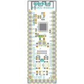
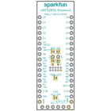
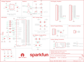

Contents
========

* [PRS13990 > nRF52832 Breakout](#prs13990--nrf52832-breakout)
	* [Schematic](#schematic)
	* [PCB](#pcb)
	* [Interactive BOM](#interactive-bom)
	* [OOMP Parts](#oomp-parts)
	* [Images](#images)
	* [Tags](#tags)
  
![][im]
# PRS13990 > nRF52832 Breakout

- ID: PROJ-SPAR-13990-STAN-01
- Hex ID: PRS13990
- Name: Sparkfun
- Description: Sparkfun
- Long Link: [http://oom.lt/PROJ-SPAR-13990-STAN-01](http://oom.lt/PROJ-SPAR-13990-STAN-01)
- Short Link: [http://oom.lt/PRS13990](http://oom.lt/PRS13990)

## Schematic
  

## PCB
  

## Interactive BOM

- Interactive BOM page: [ibom.html](https://htmlpreview.github.io/?https://github.com/oomlout/oomlout_OOMP_projects/blob/main/PROJ-SPAR-13990-STAN-01/kicad/bom/ibom.html)

## OOMP Parts
  

|OOMP Parts|
| :---: |
|CAPC-0603-X-UNMATCHED-01 C1|
|[CAPC-0603-X-UF22D-V10  SMD (0603) 2.2 uF Capacitor (Ceramic) 10v  C2](https://github.com/oomlout/oomlout_OOMP_parts/tree/main/CAPC-0603-X-UF22D-V10/)|
|[CAPC-0402-X-NF100-V10  SMD (0402) 100 nF Capacitor (Ceramic) 10v  C3, C15, C16](https://github.com/oomlout/oomlout_OOMP_parts/tree/main/CAPC-0402-X-NF100-V10/)|
|[CAPC-0402-X-PF100-V50  SMD (0402) 100 pF Capacitor (Ceramic) 50v  C5](https://github.com/oomlout/oomlout_OOMP_parts/tree/main/CAPC-0402-X-PF100-V50/)|
|CAPC-0402-X-UNMATCHED-01 C6|
|CAPC-0603-X-PF180-01 C7, C8|
|CAPC-0402-X-PF6-01 C9, C10|
|CAPC-0402-X-NF800-01 C11|
|[CAPC-0402-X-PF15-V50  SMD (0402) 15 pF Capacitor (Ceramic) 50v  C13, C14](https://github.com/oomlout/oomlout_OOMP_parts/tree/main/CAPC-0402-X-PF15-V50/)|
|[CAPC-0603-X-UF47D-V10  SMD (0603) 4.7 uF Capacitor (Ceramic) 10v  C17](https://github.com/oomlout/oomlout_OOMP_parts/tree/main/CAPC-0603-X-UF47D-V10/)|
|[LEDS-0603-R-STAN-01  SMD (0603) Red LED  D1](https://github.com/oomlout/oomlout_OOMP_parts/tree/main/LEDS-0603-R-STAN-01/)|
|[LEDS-0603-L-STAN-01  SMD (0603) Blue LED  D2](https://github.com/oomlout/oomlout_OOMP_parts/tree/main/LEDS-0603-L-STAN-01/)|
|UNMATCHED-UNMATCHED-X-UNMATCHED-01 E1, J1, J5, JP1, JP2, JP3, U2, Y1, Y2|
|[HEAD-I01-X-PI02-01  2.54 mm 2 Pin Header  J2](https://github.com/oomlout/oomlout_OOMP_parts/tree/main/HEAD-I01-X-PI02-01/)|
|HEAD-I01-X-PI17-01 J3, J4|
|UNMATCHED-0402-X-UNMATCHED-01 L1|
|[RESE-0603-X-O102-01  SMD (0603) 1k Ohm Resistor  R1, R2](https://github.com/oomlout/oomlout_OOMP_parts/tree/main/RESE-0603-X-O102-01/)|
|UNMATCHED-4628-X-UNMATCHED-01 SW1, SW2|
|VREG-SO235-X-KAP2112K-V33D U1|

## Images
  
  

|bominteractivefront|bominteractiveback|kicadPcb3d|kicadPcb3dFront|kicadPcb3dBack|eagleImage|eagleSchemImage|
| :---: | :---: | :---: | :---: | :---: | :---: | :---: |
||||||||

## Tags

- hexID: PRS13990
- oompType: PROJ
- oompSize: SPAR
- oompColor: 13990
- oompDesc: STAN
- oompIndex: 01
- oompName: nRF52832 Breakout
- sources: All source files from https://github.com/sparkfun/nRF52832_Breakout (source licence details in srcLicense.md)
- linkBuyPage: https://www.sparkfun.com/products/13990
- oompID: PROJ-SPAR-13990-STAN-01
- oompParts: C1,CAPC-0603-X-UNMATCHED-01
- oompParts: C2,CAPC-0603-X-UF22D-V10
- oompParts: C3,CAPC-0402-X-NF100-V10
- oompParts: C5,CAPC-0402-X-PF100-V50
- oompParts: C6,CAPC-0402-X-UNMATCHED-01
- oompParts: C7,CAPC-0603-X-PF180-01
- oompParts: C8,CAPC-0603-X-PF180-01
- oompParts: C9,CAPC-0402-X-PF6-01
- oompParts: C10,CAPC-0402-X-PF6-01
- oompParts: C11,CAPC-0402-X-NF800-01
- oompParts: C13,CAPC-0402-X-PF15-V50
- oompParts: C14,CAPC-0402-X-PF15-V50
- oompParts: C15,CAPC-0402-X-NF100-V10
- oompParts: C16,CAPC-0402-X-NF100-V10
- oompParts: C17,CAPC-0603-X-UF47D-V10
- oompParts: D1,LEDS-0603-R-STAN-01
- oompParts: D2,LEDS-0603-L-STAN-01
- oompParts: E1,UNMATCHED-UNMATCHED-X-UNMATCHED-01
- oompParts: J1,UNMATCHED-UNMATCHED-X-UNMATCHED-01
- oompParts: J2,HEAD-I01-X-PI02-01
- oompParts: J3,HEAD-I01-X-PI17-01
- oompParts: J4,HEAD-I01-X-PI17-01
- oompParts: J5,UNMATCHED-UNMATCHED-X-UNMATCHED-01
- oompParts: JP1,UNMATCHED-UNMATCHED-X-UNMATCHED-01
- oompParts: JP2,UNMATCHED-UNMATCHED-X-UNMATCHED-01
- oompParts: JP3,UNMATCHED-UNMATCHED-X-UNMATCHED-01
- oompParts: L1,UNMATCHED-0402-X-UNMATCHED-01
- oompParts: R1,RESE-0603-X-O102-01
- oompParts: R2,RESE-0603-X-O102-01
- oompParts: SW1,UNMATCHED-4628-X-UNMATCHED-01
- oompParts: SW2,UNMATCHED-4628-X-UNMATCHED-01
- oompParts: U1,VREG-SO235-X-KAP2112K-V33D
- oompParts: U2,UNMATCHED-UNMATCHED-X-UNMATCHED-01
- oompParts: Y1,UNMATCHED-UNMATCHED-X-UNMATCHED-01
- oompParts: Y2,UNMATCHED-UNMATCHED-X-UNMATCHED-01
- rawParts: C1,1.0uF,1.0UF-0603-16V-10%,0603,1µF ceramic capacitors,CAP-00868,1.0uF,
- rawParts: C2,2.2uF,2.2UF-0603-10V-20%,0603,2.2µF ceramic capacitors,CAP-07888,2.2uF,
- rawParts: C3,0.1uF,0.1UF-0402-16V-10%,0402,0.1µF ceramic capacitors,CAP-12416,0.1uF,
- rawParts: C4,DNP,CAP0402,0402,Capacitor,,,
- rawParts: C5,100pF,100PF-0402-50V-5%,0402,100pF/0.1nF ceramic capacitors,CAP-13458,100pF,
- rawParts: C6,1.0uF,1.0UF-0402-16V-10%,0402,1µF ceramic capacitors,CAP-12417,1.0uF,
- rawParts: C7,180pF,180PF-0603-50V-5%,0603,180pF/0.18nF ceramic capacitors,CAP-11661,180pF,
- rawParts: C8,180pF,180PF-0603-50V-5%,0603,180pF/0.18nF ceramic capacitors,CAP-11661,180pF,
- rawParts: C9,6pF,6PF-0402-50V-0.5%,0402,15pF ceramic capacitors,CAP-13455,6pF,
- rawParts: C10,6pF,6PF-0402-50V-0.5%,0402,15pF ceramic capacitors,CAP-13455,6pF,
- rawParts: C11,0.8pF,0.8PF-0402-50V-0.1PF,0402,0.8pF ceramic capacitors,CAP-13456,0.8pF,
- rawParts: C12,DNP,CAP0402,0402,Capacitor,,,
- rawParts: C13,15pF,15PF-0402-50V-5%,0402,15pF ceramic capacitors,CAP-13063,15pF,
- rawParts: C14,15pF,15PF-0402-50V-5%,0402,15pF ceramic capacitors,CAP-13063,15pF,
- rawParts: C15,0.1uF,0.1UF-0402-16V-10%,0402,0.1µF ceramic capacitors,CAP-12416,0.1uF,
- rawParts: C16,0.1uF,0.1UF-0402-16V-10%,0402,0.1µF ceramic capacitors,CAP-12416,0.1uF,
- rawParts: C17,4.7uF,4.7UF0603,0603,4.7µF ceramic capacitors,CAP-08280,4.7uF,
- rawParts: D1,RED,LED-RED0603,LED-0603,Red SMD LED,DIO-00819,RED,
- rawParts: D2,BLUE,LED-BLUE0603,LED-0603,Blue SMD LED,DIO-08575,BLUE,
- rawParts: E1,ANT,ANTENNA-GROUNDEDTRACE-15.2MM,TRACE_ANTENNA_2.4GHZ_15.2MM,Antenna w/ Ground Connection,,,
- rawParts: FD1,FIDUCIALUFIDUCIAL,FIDUCIALUFIDUCIAL,FIDUCIAL-MICRO,Fiducial Alignment Points,,,
- rawParts: FD2,FIDUCIALUFIDUCIAL,FIDUCIALUFIDUCIAL,FIDUCIAL-MICRO,Fiducial Alignment Points,,,
- rawParts: FRAME1,FRAME-LETTER,FRAME-LETTER,CREATIVE_COMMONS,Schematic Frame,,,
- rawParts: J1,,ARDUINO_SERIAL_PROGRAMPTH,1X06,FTDI connector footprints,,,
- rawParts: J2,,CONN_02PTH,1X02,Multi connection point. Often used as Generic Header-pin footprint for 0.1 inch spaced/style header connections,,,
- rawParts: J3,,CONN_17,1X17,1x17 .1 header,,,
- rawParts: J4,,CONN_17,1X17,1x17 .1 header,,,
- rawParts: J5,CORTEX_DEBUGPTH,CORTEX_DEBUGPTH,2X5-PTH-1.27MM,Cortex Debug Connector,,,
- rawParts: JP1,VDD-EN,JUMPER-SMT_2_NC_TRACE_SILK,SMT-JUMPER_2_NC_TRACE_SILK,Normally closed trace jumper,,,
- rawParts: JP2,NFC1,JUMPER-SMT_2_NO_SILK,SMT-JUMPER_2_NO_SILK,Normally open jumper,,,
- rawParts: JP3,NFC2,JUMPER-SMT_2_NO_SILK,SMT-JUMPER_2_NO_SILK,Normally open jumper,,,
- rawParts: JP4,XL1,JUMPER-PAD-2-NC_BY_TRACE,PAD-JUMPER-2-NC_BY_TRACE_YES_SILK,,,,
- rawParts: JP5,XL2,JUMPER-PAD-2-NC_BY_TRACE,PAD-JUMPER-2-NC_BY_TRACE_YES_SILK,,,,
- rawParts: JP6,PWR-LED,JUMPER-PAD-2-NC_BY_TRACE,PAD-JUMPER-2-NC_BY_TRACE_YES_SILK,,,,
- rawParts: L1,3.9nH,INDUCTOR-0402-3.9NH,0402,Inductors,NDUC-13457,3.9nH,
- rawParts: LOGO1,OSHW-LOGOMINI,OSHW-LOGOMINI,OSHW-LOGO-MINI,Open-Source Hardware (OSHW) Logo,,,
- rawParts: LOGO2,SFE_LOGO_NAME.1_INCH,SFE_LOGO_NAME.1_INCH,SFE_LOGO_NAME_.1,SparkFun Font Logo,,,
- rawParts: LOGO3,SFE_LOGO_NAME.1_INCH,SFE_LOGO_NAME.1_INCH,SFE_LOGO_NAME_.1,SparkFun Font Logo,,,
- rawParts: R1,1k,1KOHM-0603-1/10W-1%,0603,1kΩ resistor,RES-07856,1k,
- rawParts: R2,1k,1KOHM-0603-1/10W-1%,0603,1kΩ resistor,RES-07856,1k,
- rawParts: SW1,TACTILE_SWITCH_SMD_4_6X2_8MM,SWITCH_SPST_4_PINRECT,TACTILE_SWITCH_SMD_4.6X2.8MM,,SWCH-13065,,
- rawParts: SW2,TACTILE_SWITCH_SMD_4_6X2_8MM,SWITCH_SPST_4_PINRECT,TACTILE_SWITCH_SMD_4.6X2.8MM,,SWCH-13065,,
- rawParts: TP1,TEST-POINT3X4,TEST-POINT3X4,PAD.03X.04,Bare copper test points for troubleshooting or ICT,,,
- rawParts: TP2,TEST-POINT3X4,TEST-POINT3X4,PAD.03X.04,Bare copper test points for troubleshooting or ICT,,,
- rawParts: U1,AP2112K-3.3V,V_REG_AP2112K-3.3V,SOT23-5,AP2112 - 600mA CMOS LDO Regulator w/ Enable,VREG-12457,3.3V,
- rawParts: U2,NRF52832,NRF52832,QFN48-6X6MM,Nordic nRF52832 Bluetooth Smart/ANT/2.4GHz RF SoC,IC-13460,,
- rawParts: Y1,32MHz,CRYSTAL-32MHZ-SMD-2.0X1.6MM,CRYSTAL-SMD-2.0X1.6MM,32MHz Crystal,XTAL-13459,32MHz,
- rawParts: Y2,32.768kHz,CRYSTAL-32.768KHZSMD-3.2X1.5,CRYSTAL-SMD-3.2X1.5MM,32.768kHz Crystal,XTAL-13062,32.768kHz,

[im]: kicadPcb3d_450.png
