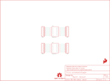

Contents
========

* [PRS13994 > Sparkfun](#prs13994--sparkfun)
	* [Images](#images)
	* [Tags](#tags)
  
![][im]
# PRS13994 > Sparkfun

- ID: PROJ-SPAR-13994-STAN-01
- Hex ID: PRS13994
- Name: Sparkfun
- Description: Sparkfun

## Images
  
  

|kicadPcb3d|kicadPcb3dFront|kicadPcb3dBack|eagleImage|eagleSchemImage|
| :---: | :---: | :---: | :---: | :---: |
||||||

## Tags

- hexID: PRS13994
- oompType: PROJ
- oompSize: SPAR
- oompColor: 13994
- oompDesc: STAN
- oompIndex: 01
- oompName: SSOP-DIP Adapter 16-Pin
- sources: All source files from https://github.com/sparkfun/SSOP-DIP_Adapter_16-Pin (source licence details in srcLicense.md)
- linkBuyPage: https://www.sparkfun.com/products/13994
- oompID: PROJ-SPAR-13994-STAN-01
- oompParts: FRAME1,UNMATCHED-UNMATCHED-UNMATCHED-UNMATCHED-UNMATCHED
- oompParts: JP1,UNMATCHED-UNMATCHED-UNMATCHED-UNMATCHED-UNMATCHED
- oompParts: JP2,UNMATCHED-UNMATCHED-UNMATCHED-UNMATCHED-UNMATCHED
- oompParts: JP3,UNMATCHED-UNMATCHED-UNMATCHED-UNMATCHED-UNMATCHED
- oompParts: JP4,UNMATCHED-UNMATCHED-UNMATCHED-UNMATCHED-UNMATCHED
- oompParts: LOGO1,UNMATCHED-UNMATCHED-UNMATCHED-UNMATCHED-UNMATCHED
- oompParts: LOGO2,UNMATCHED-UNMATCHED-UNMATCHED-UNMATCHED-UNMATCHED
- oompParts: LOGO3,UNMATCHED-UNMATCHED-UNMATCHED-UNMATCHED-UNMATCHED
- oompParts: LOGO4,UNMATCHED-UNMATCHED-UNMATCHED-UNMATCHED-UNMATCHED
- oompParts: U1,UNMATCHED-UNMATCHED-UNMATCHED-UNMATCHED-UNMATCHED
- oompParts: U2,UNMATCHED-UNMATCHED-UNMATCHED-UNMATCHED-UNMATCHED
- rawParts: FRAME1,FRAME-LETTER,FRAME-LETTER,CREATIVE_COMMONS,Schematic Frame,,
- rawParts: JP1,,M08NO_SILK,1X08_PIN1_NO_SILK,Header 8,,
- rawParts: JP2,,M08NO_SILK_FEMALE_PTH,1X08_NO_SILK,Header 8,CONN-08438,
- rawParts: JP3,,M08NO_SILK,1X08_PIN1_NO_SILK,Header 8,,
- rawParts: JP4,,M08NO_SILK_FEMALE_PTH,1X08_NO_SILK,Header 8,CONN-08438,
- rawParts: LOGO1,SFE_LOGO_FLAME.1_INCH,SFE_LOGO_FLAME.1_INCH,SFE_LOGO_FLAME_.1,SFE Logo, flame only,,
- rawParts: LOGO2,SFE_LOGO_FLAME.1_INCH,SFE_LOGO_FLAME.1_INCH,SFE_LOGO_FLAME_.1,SFE Logo, flame only,,
- rawParts: LOGO3,OSHW-LOGOS,OSHW-LOGOS,OSHW-LOGO-S,Open Source Hardware Logo,,
- rawParts: LOGO4,OSHW-LOGOS,OSHW-LOGOS,OSHW-LOGO-S,Open Source Hardware Logo,,
- rawParts: U1,SSOP16,SSOP16,SSOP16,,,
- rawParts: U2,SSOP16,SSOP16,SSOP16,,,

[im]: kicadPcb3d_450.png
