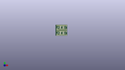
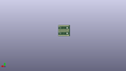

Contents
========

* [PROJ-SPAR-13994-STAN-01>SSOP-DIP Adapter 16-Pin](#proj-spar-13994-stan-01ssop-dip-adapter-16-pin)
	* [Images](#images)
	* [Interactive BOM](#interactive-bom)
	* [OOMP Parts](#oomp-parts)
	* [Tags](#tags)
  
![][im]
# PROJ-SPAR-13994-STAN-01>SSOP-DIP Adapter 16-Pin

- ID: PROJ-SPAR-13994-STAN-01
- Hex ID: PRS13994
- Name: SSOP-DIP Adapter 16-Pin
- Description: 

## Images
  
  

|eagleImage|kicadPcb3dFront|kicadPcb3dBack|kicadPcb3d|
| :---: | :---: | :---: | :---: |
|||||

## Interactive BOM

- Interactive BOM page: [ibom.html](kicad/bom/ibom.html)

## OOMP Parts
  

|OOMP Parts|
| :---: |
|HEAD-I01-X-PI081-01, JP1, 1.27, 1.27, 0,JP1, 1X08_PIN1_NO_SILK, SparkFun-Connectors, (0.05, 0.05), R0|
|<table><tr><td></td><td> JP2</td><td>[HEAD-I01-X-PI08-01 2.54 mm 8 Pin Header](https://github.com/oomlout/oomlout_OOMP_parts/tree/main/HEAD-I01-X-PI08-01/)</td><td>[H08](https://github.com/oomlout/oomlout_OOMP_parts/tree/main/HEAD-I01-X-PI08-01/)</td></tr></table>|
|HEAD-I01-X-PI081-01, JP3, 1.27, 11.937999999999999, 0,JP3, 1X08_PIN1_NO_SILK, SparkFun-Connectors, (0.05, 0.47), R0|
|<table><tr><td></td><td> JP4</td><td>[HEAD-I01-X-PI08-01 2.54 mm 8 Pin Header](https://github.com/oomlout/oomlout_OOMP_parts/tree/main/HEAD-I01-X-PI08-01/)</td><td>[H08](https://github.com/oomlout/oomlout_OOMP_parts/tree/main/HEAD-I01-X-PI08-01/)</td></tr></table>|
|UNMATCHED-UNMATCHED-X-UNMATCHED-01, U1, 10.16, 5.08, 270,U1, SSOP16, SSOP16, generic-ssop16, (0.4, 0.2), R270|
|UNMATCHED-UNMATCHED-X-UNMATCHED-01, U2, 10.16, 15.748, 270,U2, SSOP16, SSOP16, generic-ssop16, (0.4, 0.62), R270|

## Tags

- hexID: PRS13994
- oompType: PROJ
- oompSize: SPAR
- oompColor: 13994
- oompDesc: STAN
- oompIndex: 01
- oompName: SSOP-DIP Adapter 16-Pin
- sources: All source files from https://github.com/sparkfun/SSOP-DIP_Adapter_16-Pin (source licence details in srcLicense.md)
- linkBuyPage: https://www.sparkfun.com/products/13994
- oompPart: HEAD-I01-X-PI081-01, JP1, 1.27, 1.27, 0
- oompPart: HEAD-I01-X-PI08-01, JP2, 1.27, 8.889999999999999, 0
- oompPart: HEAD-I01-X-PI081-01, JP3, 1.27, 11.937999999999999, 0
- oompPart: HEAD-I01-X-PI08-01, JP4, 1.27, 19.558, 0
- oompPart: UNMATCHED-UNMATCHED-X-UNMATCHED-01, U1, 10.16, 5.08, 270
- oompPart: UNMATCHED-UNMATCHED-X-UNMATCHED-01, U2, 10.16, 15.748, 270
- rawPart: JP1, 1X08_PIN1_NO_SILK, SparkFun-Connectors, (0.05, 0.05), R0
- rawPart: JP2, 1X08_NO_SILK, SparkFun-Connectors, (0.05, 0.35), R0
- rawPart: JP3, 1X08_PIN1_NO_SILK, SparkFun-Connectors, (0.05, 0.47), R0
- rawPart: JP4, 1X08_NO_SILK, SparkFun-Connectors, (0.05, 0.77), R0
- rawPart: U1, SSOP16, SSOP16, generic-ssop16, (0.4, 0.2), R270
- rawPart: U2, SSOP16, SSOP16, generic-ssop16, (0.4, 0.62), R270
- oompID: PROJ-SPAR-13994-STAN-01

[im]: kicadPcb3d_450.png
