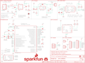

Contents
========

* [PRS14001 > 9DOF Razor IMU](#prs14001--9dof-razor-imu)
	* [Schematic](#schematic)
	* [PCB](#pcb)
	* [Interactive BOM](#interactive-bom)
	* [OOMP Parts](#oomp-parts)
	* [Images](#images)
	* [Tags](#tags)
  
![][im]
# PRS14001 > 9DOF Razor IMU

- ID: PROJ-SPAR-14001-STAN-01
- Hex ID: PRS14001
- Name: Sparkfun
- Description: Sparkfun
- Long Link: [http://oom.lt/PROJ-SPAR-14001-STAN-01](http://oom.lt/PROJ-SPAR-14001-STAN-01)
- Short Link: [http://oom.lt/PRS14001](http://oom.lt/PRS14001)

## Schematic
  

## PCB
  

## Interactive BOM

- Interactive BOM page: [ibom.html](https://htmlpreview.github.io/?https://github.com/oomlout/oomlout_OOMP_projects/blob/main/PROJ-SPAR-14001-STAN-01/kicad/bom/ibom.html)

## OOMP Parts
  

|OOMP Parts|
| :---: |
|CAPC-0603-X-UNMATCHED-01 C1|
|[CAPC-0603-X-UF22D-V10  SMD (0603) 2.2 uF Capacitor (Ceramic) 10v  C2](https://github.com/oomlout/oomlout_OOMP_parts/tree/main/CAPC-0603-X-UF22D-V10/)|
|[CAPC-0603-X-UF47D-V10  SMD (0603) 4.7 uF Capacitor (Ceramic) 10v  C3, C4](https://github.com/oomlout/oomlout_OOMP_parts/tree/main/CAPC-0603-X-UF47D-V10/)|
|[CAPC-0603-X-NF100-V50  SMD (0603) 100 nF Capacitor (Ceramic) 50v  C5, C6, C7, C8, C9, C11](https://github.com/oomlout/oomlout_OOMP_parts/tree/main/CAPC-0603-X-NF100-V50/)|
|[CAPC-0603-X-PF15-V50  SMD (0603) 15 pF Capacitor (Ceramic) 50v  C10, C12](https://github.com/oomlout/oomlout_OOMP_parts/tree/main/CAPC-0603-X-PF15-V50/)|
|DIOD-S323-X-UNMATCHED-01 D1|
|[LEDS-0603-Y-STAN-01  SMD (0603) Yellow LED  D2](https://github.com/oomlout/oomlout_OOMP_parts/tree/main/LEDS-0603-Y-STAN-01/)|
|[LEDS-0603-R-STAN-01  SMD (0603) Red LED  D3](https://github.com/oomlout/oomlout_OOMP_parts/tree/main/LEDS-0603-R-STAN-01/)|
|[LEDS-0603-L-STAN-01  SMD (0603) Blue LED  D4](https://github.com/oomlout/oomlout_OOMP_parts/tree/main/LEDS-0603-L-STAN-01/)|
|UNMATCHED-1206-X-UNMATCHED-01 F1|
|HEAD-I01-X-UNMATCHED-01 J1|
|UNMATCHED-UNMATCHED-X-UNMATCHED-01 J2, J3, J7, JP1, JP3, S1, U3, U4, Y1|
|[HEAD-I01-X-PI07-01  2.54 mm 7 Pin Header  J4](https://github.com/oomlout/oomlout_OOMP_parts/tree/main/HEAD-I01-X-PI07-01/)|
|[HEAD-I01-X-PI08-01  2.54 mm 8 Pin Header  J5](https://github.com/oomlout/oomlout_OOMP_parts/tree/main/HEAD-I01-X-PI08-01/)|
|[HEAD-I01-X-PI02-01  2.54 mm 2 Pin Header  J6](https://github.com/oomlout/oomlout_OOMP_parts/tree/main/HEAD-I01-X-PI02-01/)|
|HEAD-I01-X-PI01-01 J8|
|[RESE-0603-X-O472-01  SMD (0603) 4.7k Ohm Resistor  R1, R2](https://github.com/oomlout/oomlout_OOMP_parts/tree/main/RESE-0603-X-O472-01/)|
|[RESE-0603-X-O102-01  SMD (0603) 1k Ohm Resistor  R3, R5, R9](https://github.com/oomlout/oomlout_OOMP_parts/tree/main/RESE-0603-X-O102-01/)|
|[RESE-0603-X-O222-01  SMD (0603) 2.2k Ohm Resistor  R4](https://github.com/oomlout/oomlout_OOMP_parts/tree/main/RESE-0603-X-O222-01/)|
|RESE-0603-X-O1003-01 R6, R7|
|[RESE-0603-X-O103-01  SMD (0603) 10k Ohm Resistor  R8](https://github.com/oomlout/oomlout_OOMP_parts/tree/main/RESE-0603-X-O103-01/)|
|[VREG-SO235-X-KAP2112K-V33D  SMD (SOT-23-5) AP2112K Voltage Regulator 3.3v  U1](https://github.com/oomlout/oomlout_OOMP_parts/tree/main/VREG-SO235-X-KAP2112K-V33D/)|
|UNMATCHED-SO235-X-UNMATCHED-01 U2|

## Images
  
  

|bominteractivefront|bominteractiveback|kicadPcb3d|kicadPcb3dFront|kicadPcb3dBack|eagleImage|eagleSchemImage|pcbdraw|pcbdrawback|
| :---: | :---: | :---: | :---: | :---: | :---: | :---: | :---: | :---: |
||||||||||

## Tags

- hexID: PRS14001
- oompType: PROJ
- oompSize: SPAR
- oompColor: 14001
- oompDesc: STAN
- oompIndex: 01
- oompName: 9DOF Razor IMU
- sources: All source files from https://github.com/sparkfun/9DOF_Razor_IMU (source licence details in srcLicense.md)
- linkBuyPage: https://www.sparkfun.com/products/14001
- oompID: PROJ-SPAR-14001-STAN-01
- oompParts: C1,CAPC-0603-X-UNMATCHED-01
- oompParts: C2,CAPC-0603-X-UF22D-V10
- oompParts: C3,CAPC-0603-X-UF47D-V10
- oompParts: C4,CAPC-0603-X-UF47D-V10
- oompParts: C5,CAPC-0603-X-NF100-V50
- oompParts: C6,CAPC-0603-X-NF100-V50
- oompParts: C7,CAPC-0603-X-NF100-V50
- oompParts: C8,CAPC-0603-X-NF100-V50
- oompParts: C9,CAPC-0603-X-NF100-V50
- oompParts: C10,CAPC-0603-X-PF15-V50
- oompParts: C11,CAPC-0603-X-NF100-V50
- oompParts: C12,CAPC-0603-X-PF15-V50
- oompParts: D1,DIOD-S323-X-UNMATCHED-01
- oompParts: D2,LEDS-0603-Y-STAN-01
- oompParts: D3,LEDS-0603-R-STAN-01
- oompParts: D4,LEDS-0603-L-STAN-01
- oompParts: F1,UNMATCHED-1206-X-UNMATCHED-01
- oompParts: J1,HEAD-I01-X-UNMATCHED-01
- oompParts: J2,UNMATCHED-UNMATCHED-X-UNMATCHED-01
- oompParts: J3,UNMATCHED-UNMATCHED-X-UNMATCHED-01
- oompParts: J4,HEAD-I01-X-PI07-01
- oompParts: J5,HEAD-I01-X-PI08-01
- oompParts: J6,HEAD-I01-X-PI02-01
- oompParts: J7,UNMATCHED-UNMATCHED-X-UNMATCHED-01
- oompParts: J8,HEAD-I01-X-PI01-01
- oompParts: JP1,UNMATCHED-UNMATCHED-X-UNMATCHED-01
- oompParts: JP3,UNMATCHED-UNMATCHED-X-UNMATCHED-01
- oompParts: R1,RESE-0603-X-O472-01
- oompParts: R2,RESE-0603-X-O472-01
- oompParts: R3,RESE-0603-X-O102-01
- oompParts: R4,RESE-0603-X-O222-01
- oompParts: R5,RESE-0603-X-O102-01
- oompParts: R6,RESE-0603-X-O1003-01
- oompParts: R7,RESE-0603-X-O1003-01
- oompParts: R8,RESE-0603-X-O103-01
- oompParts: R9,RESE-0603-X-O102-01
- oompParts: S1,UNMATCHED-UNMATCHED-X-UNMATCHED-01
- oompParts: U1,VREG-SO235-X-KAP2112K-V33D
- oompParts: U2,UNMATCHED-SO235-X-UNMATCHED-01
- oompParts: U3,UNMATCHED-UNMATCHED-X-UNMATCHED-01
- oompParts: U4,UNMATCHED-UNMATCHED-X-UNMATCHED-01
- oompParts: Y1,UNMATCHED-UNMATCHED-X-UNMATCHED-01
- rawParts: C1,1.0uF,1.0UF-0603-16V-10%,0603,1µF ceramic capacitors,CAP-00868,1.0uF,
- rawParts: C2,2.2uF,2.2UF-0603-10V-20%,0603,2.2µF ceramic capacitors,CAP-07888,2.2uF,
- rawParts: C3,4.7uF,4.7UF0603,0603,4.7µF ceramic capacitors,CAP-08280,4.7uF,
- rawParts: C4,4.7uF,4.7UF0603,0603,4.7µF ceramic capacitors,CAP-08280,4.7uF,
- rawParts: C5,0.1uF,0.1UF-0603-25V-(+80/-20%),0603,0.1µF ceramic capacitors,CAP-00810,0.1uF,
- rawParts: C6,0.1uF,0.1UF-0603-25V-(+80/-20%),0603,0.1µF ceramic capacitors,CAP-00810,0.1uF,
- rawParts: C7,0.1uF,0.1UF-0603-25V-(+80/-20%),0603,0.1µF ceramic capacitors,CAP-00810,0.1uF,
- rawParts: C8,0.1uF,0.1UF-0603-25V-(+80/-20%),0603,0.1µF ceramic capacitors,CAP-00810,0.1uF,
- rawParts: C9,0.1uF,0.1UF-0603-25V-(+80/-20%),0603,0.1µF ceramic capacitors,CAP-00810,0.1uF,
- rawParts: C10,15pF,15PF-0603-50V-5%,0603,15pF ceramic capacitors,CAP-07881,15pF,
- rawParts: C11,0.1uF,0.1UF-0603-100V-10%,0603,0.1µF ceramic capacitors,CAP-08390,0.1uF,
- rawParts: C12,15pF,15PF-0603-50V-5%,0603,15pF ceramic capacitors,CAP-07881,15pF,
- rawParts: D1,1A/23V/620mV,DIODE-SCHOTTKY-BAT20J,SOD-323,Schottky diode,DIO-11623,1A/23V/620mV,
- rawParts: D2,Yellow,LED-YELLOW0603,LED-0603,Yellow SMD LED,DIO-09003,Yellow,
- rawParts: D3,RED,LED-RED0603,LED-0603,Red SMD LED,DIO-00819,RED,
- rawParts: D4,BLUE,LED-BLUE0603,LED-0603,Blue SMD LED,DIO-08575,BLUE,
- rawParts: F1,6V/0.5A,PPTC_HALF-AMP,1206,Resettable Fuse PPTC,RES-08585,6V/0.5A,
- rawParts: FD1,FIDUCIAL1X2,FIDUCIAL1X2,FIDUCIAL-1X2,Fiducial Alignment Points,,,
- rawParts: FD2,FIDUCIAL1X2,FIDUCIAL1X2,FIDUCIAL-1X2,Fiducial Alignment Points,,,
- rawParts: FD3,FIDUCIAL1X2,FIDUCIAL1X2,FIDUCIAL-1X2,Fiducial Alignment Points,,,
- rawParts: FD4,FIDUCIAL1X2,FIDUCIAL1X2,FIDUCIAL-1X2,Fiducial Alignment Points,,,
- rawParts: FRAME1,FRAME-LETTER,FRAME-LETTER,CREATIVE_COMMONS,Schematic Frame - Letter,,,
- rawParts: H1,STAND-OFF,STAND-OFF,STAND-OFF,#4 Stand Off,,,
- rawParts: H2,STAND-OFF,STAND-OFF,STAND-OFF,#4 Stand Off,,,
- rawParts: H3,STAND-OFF,STAND-OFF,STAND-OFF,#4 Stand Off,,,
- rawParts: H4,STAND-OFF,STAND-OFF,STAND-OFF,#4 Stand Off,,,
- rawParts: J1,LiPo,CONN_02-JST-2MM-SMT,JST-2-SMD,Multi connection point. Often used as Generic Header-pin footprint for 0.1 inch spaced/style header connections,CONN-11443,,
- rawParts: J2,,USB_MICROB_PLUGCONN-11752,USB-B-MICRO-SMD_V03,USB Micro-B connectors,CONN-11752,,
- rawParts: J3,USD_CONNECTOR,USD_CONNECTOR,MICRO-SD-SOCKET-PP,microSD Socket,CONN-07820,,
- rawParts: J4,,CONN_07,1X07,Multi connection point. Often used as Generic Header-pin footprint for 0.1 inch spaced/style header connections,,,
- rawParts: J5,,CONN_08,1X08,Multi connection point. Often used as Generic Header-pin footprint for 0.1 inch spaced/style header connections,,,
- rawParts: J6,,CONN_02,1X02,Multi connection point. Often used as Generic Header-pin footprint for 0.1 inch spaced/style header connections,,,
- rawParts: J7,,I2C_STANDARD,1X04,SparkFun has standardized on a pinout for all I2C based sensor breakouts.,,,
- rawParts: J8,,CONN_01,1X01,Single connection point. Often used as Generic Header-pin footprint for 0.1 inch spaced/style header connections,,,
- rawParts: JP1,LED,JUMPER-SMT_2_NC_PASTE_NO-SILK,SMT-JUMPER_2_NC_PASTE_NO-SILK,Normally closed solder jumper,,,
- rawParts: JP3,CORTEX_DEBUGPTH,CORTEX_DEBUGPTH,2X5-PTH-1.27MM,Cortex Debug Connector,,,
- rawParts: LOGO1,SFE_LOGO_FLAME.1_INCH,SFE_LOGO_FLAME.1_INCH,SFE_LOGO_FLAME_.1,SFE Logo, flame only,,,
- rawParts: LOGO2,OSHW-LOGOS,OSHW-LOGOS,OSHW-LOGO-S,Open Source Hardware Logo,,,
- rawParts: LOGO3,SFE_LOGO_NAME.1_INCH,SFE_LOGO_NAME.1_INCH,SFE_LOGO_NAME_.1,SparkFun Font Logo,,,
- rawParts: R1,4.7k,4.7KOHM-0603-1/10W-1%,0603,4.7kΩ resistor,RES-07857,4.7k,
- rawParts: R2,4.7k,4.7KOHM-0603-1/10W-1%,0603,4.7kΩ resistor,RES-07857,4.7k,
- rawParts: R3,1k,1KOHM-0603-1/10W-1%,0603,1kΩ resistor,RES-07856,1k,
- rawParts: R4,2.2k,2.2KOHM-0603-1/10W-1%,0603,2.2kΩ resistor,RES-08272,2.2k,
- rawParts: R5,1k,1KOHM-0603-1/10W-1%,0603,1kΩ resistor,RES-07856,1k,
- rawParts: R6,100k,100KOHM-0603-1/10W-1%,0603,100kΩ resistor,RES-07828,100k,
- rawParts: R7,100k,100KOHM-0603-1/10W-1%,0603,100kΩ resistor,RES-07828,100k,
- rawParts: R8,10k,10KOHM-0603-1/10W-1%,0603,10kΩ resistor,RES-00824,10k,
- rawParts: R9,1k,1KOHM-0603-1/10W-1%,0603,1kΩ resistor,RES-07856,1k,
- rawParts: S1,SWITCH-SPST-SMD-A,SWITCH-SPDT-SMD-A,SWITCH-SPST-SMD-A,SPDT Switch,SWCH-10651,,
- rawParts: TP1,TEST-POINT3,TEST-POINT3,PAD.03X.03,Bare copper test points for troubleshooting or ICT,,,
- rawParts: TP2,TEST-POINT3,TEST-POINT3,PAD.03X.03,Bare copper test points for troubleshooting or ICT,,,
- rawParts: U1,3.3V,V_REG_AP2112K-3.3V,SOT23-5,AP2112 - 600mA CMOS LDO Regulator w/ Enable,VREG-12457,3.3V,
- rawParts: U2,MCP73831,MCP73831,SOT23-5,Miniature single cell, fully integrated Li-Ion, Li-polymer charge management controller,IC-09995,,
- rawParts: U3,MPU-9250,MPU-9250,QFN24-3X3,NC pin 19. 2-6 & 14-17 not internally connected. May be used for PCB trace routing.,IC-13192,,
- rawParts: U4,ATSAMD21G-A,ATSAMD21G-A,TQFP-48,Atmel SAMD21G SMART ARM-Based Microcontroller,IC-13064,,
- rawParts: Y1,32.768kHz,CRYSTAL-32.768KHZSMD-3.2X1.5,CRYSTAL-SMD-3.2X1.5MM,32.768kHz Crystal,XTAL-13062,32.768kHz,

[im]: kicadPcb3d_450.png
