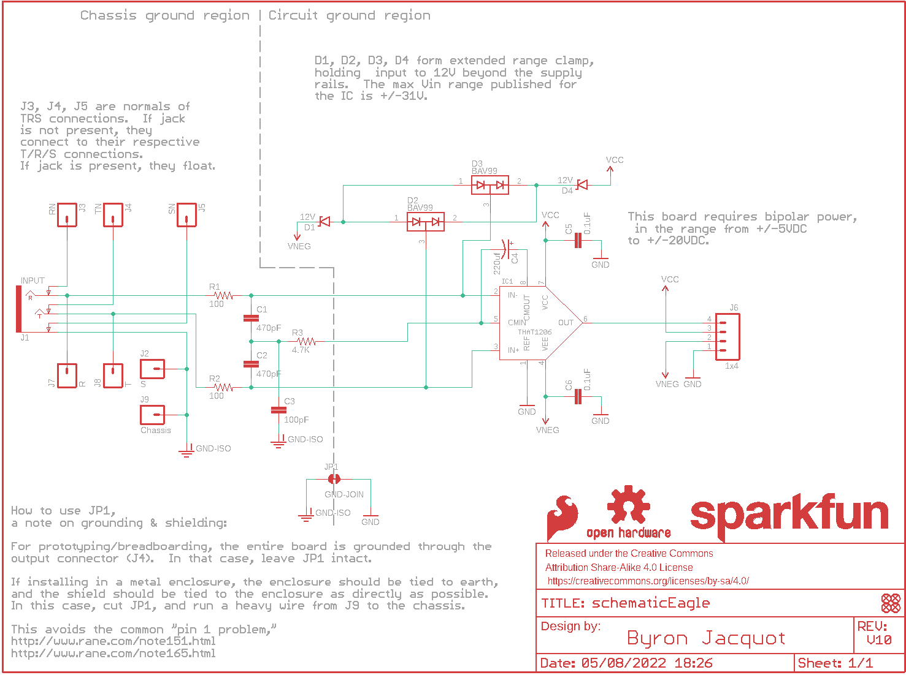
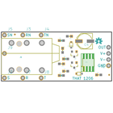
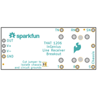
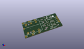
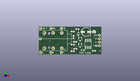
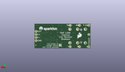
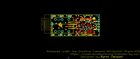
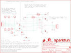
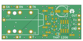
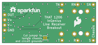

Contents
========

* [PRS14002 > THAT 1206 Breakout](#prs14002--that-1206-breakout)
	* [Schematic](#schematic)
	* [PCB](#pcb)
	* [Interactive BOM](#interactive-bom)
	* [OOMP Parts](#oomp-parts)
	* [Images](#images)
	* [Tags](#tags)
  
![][im]
# PRS14002 > THAT 1206 Breakout

- ID: PROJ-SPAR-14002-STAN-01
- Hex ID: PRS14002
- Name: Sparkfun
- Description: Sparkfun
- Long Link: [http://oom.lt/PROJ-SPAR-14002-STAN-01](http://oom.lt/PROJ-SPAR-14002-STAN-01)
- Short Link: [http://oom.lt/PRS14002](http://oom.lt/PRS14002)

## Schematic
  

## PCB
  

## Interactive BOM

- Interactive BOM page: [ibom.html](https://htmlpreview.github.io/?https://github.com/oomlout/oomlout_OOMP_projects/blob/main/PROJ-SPAR-14002-STAN-01/kicad/bom/ibom.html)

## OOMP Parts
  

|OOMP ID|Name|Identifier|
| :---: | :---: | :---: |
|CAPC-0603-X-PF470-01||C1, C2|
|[CAPC-0603-X-PF100-V50](https://github.com/oomlout/oomlout_OOMP_parts/tree/main/CAPC-0603-X-PF100-V50/)|[SMD (0603) 100 pF Capacitor (Ceramic) 50v](https://github.com/oomlout/oomlout_OOMP_parts/tree/main/CAPC-0603-X-PF100-V50/)|[C3](https://github.com/oomlout/oomlout_OOMP_parts/tree/main/CAPC-0603-X-PF100-V50/)|
|CAPE-PAND-X-UF220-01||C4|
|[CAPC-0603-X-NF100-V50](https://github.com/oomlout/oomlout_OOMP_parts/tree/main/CAPC-0603-X-NF100-V50/)|[SMD (0603) 100 nF Capacitor (Ceramic) 50v](https://github.com/oomlout/oomlout_OOMP_parts/tree/main/CAPC-0603-X-NF100-V50/)|[C5, C6](https://github.com/oomlout/oomlout_OOMP_parts/tree/main/CAPC-0603-X-NF100-V50/)|
|DIOD-S323-X-UNMATCHED-01||D1, D4|
|DIOD-SO23-X-UNMATCHED-01||D2, D3|
|UNMATCHED-UNMATCHED-X-UNMATCHED-01||IC1, J1|
|HEAD-I01-X-PI01-01||J2, J3, J4, J5, J7, J8, J9|
|[HEAD-I01-X-PI04-01](https://github.com/oomlout/oomlout_OOMP_parts/tree/main/HEAD-I01-X-PI04-01/)|[2.54 mm 4 Pin Header](https://github.com/oomlout/oomlout_OOMP_parts/tree/main/HEAD-I01-X-PI04-01/)|[J6](https://github.com/oomlout/oomlout_OOMP_parts/tree/main/HEAD-I01-X-PI04-01/)|
|[RESE-0603-X-O101-01](https://github.com/oomlout/oomlout_OOMP_parts/tree/main/RESE-0603-X-O101-01/)|[SMD (0603) 100 Ohm Resistor](https://github.com/oomlout/oomlout_OOMP_parts/tree/main/RESE-0603-X-O101-01/)|[R1, R2](https://github.com/oomlout/oomlout_OOMP_parts/tree/main/RESE-0603-X-O101-01/)|
|[RESE-0603-X-O472-01](https://github.com/oomlout/oomlout_OOMP_parts/tree/main/RESE-0603-X-O472-01/)|[SMD (0603) 4.7k Ohm Resistor](https://github.com/oomlout/oomlout_OOMP_parts/tree/main/RESE-0603-X-O472-01/)|[R3](https://github.com/oomlout/oomlout_OOMP_parts/tree/main/RESE-0603-X-O472-01/)|

## Images
  
  

|bominteractivefront|bominteractiveback|kicadPcb3d|kicadPcb3dFront|kicadPcb3dBack|eagleImage|eagleSchemImage|pcbdraw|pcbdrawback|
| :---: | :---: | :---: | :---: | :---: | :---: | :---: | :---: | :---: |
||||||||||

## Tags

- hexID: PRS14002
- oompType: PROJ
- oompSize: SPAR
- oompColor: 14002
- oompDesc: STAN
- oompIndex: 01
- oompName: THAT 1206 Breakout
- sources: All source files from https://github.com/sparkfun/THAT_1206_Breakout (source licence details in srcLicense.md)
- linkBuyPage: https://www.sparkfun.com/products/14002
- oompID: PROJ-SPAR-14002-STAN-01
- oompParts: C1,CAPC-0603-X-PF470-01
- oompParts: C2,CAPC-0603-X-PF470-01
- oompParts: C3,CAPC-0603-X-PF100-V50
- oompParts: C4,CAPE-PAND-X-UF220-01
- oompParts: C5,CAPC-0603-X-NF100-V50
- oompParts: C6,CAPC-0603-X-NF100-V50
- oompParts: D1,DIOD-S323-X-UNMATCHED-01
- oompParts: D2,DIOD-SO23-X-UNMATCHED-01
- oompParts: D3,DIOD-SO23-X-UNMATCHED-01
- oompParts: D4,DIOD-S323-X-UNMATCHED-01
- oompParts: IC1,UNMATCHED-UNMATCHED-X-UNMATCHED-01
- oompParts: J1,UNMATCHED-UNMATCHED-X-UNMATCHED-01
- oompParts: J2,HEAD-I01-X-PI01-01
- oompParts: J3,HEAD-I01-X-PI01-01
- oompParts: J4,HEAD-I01-X-PI01-01
- oompParts: J5,HEAD-I01-X-PI01-01
- oompParts: J6,HEAD-I01-X-PI04-01
- oompParts: J7,HEAD-I01-X-PI01-01
- oompParts: J8,HEAD-I01-X-PI01-01
- oompParts: J9,HEAD-I01-X-PI01-01
- oompParts: R1,RESE-0603-X-O101-01
- oompParts: R2,RESE-0603-X-O101-01
- oompParts: R3,RESE-0603-X-O472-01
- rawParts: C1,470pF,470PF-50V-5%(0603)SMD,0603-CAP,CAP-07884,,,,CAP-07884,,470pF,
- rawParts: C2,470pF,470PF-50V-5%(0603)SMD,0603-CAP,CAP-07884,,,,CAP-07884,,470pF,
- rawParts: C3,100pF,100PF-50V-5%(0603),0603-CAP,CAP-07883,,,,CAP-07883,,100pF,
- rawParts: C4,220uf,PANA-EEE-FKOJ221P,PANASONIC_D,220 uF 6.3 V cap.,,,,CAP-13470,,220uf,
- rawParts: C5,0.1uF,0.1UF-25V-5%(0603),0603-CAP,CAP-08604,,,,CAP-08604,,0.1uF,
- rawParts: C6,0.1uF,0.1UF-25V-5%(0603),0603-CAP,CAP-08604,,,,CAP-08604,,0.1uF,
- rawParts: D1,12V,12V-ZENER-DIODE,SOD-323,,MM3Z12VT1GOSCT-ND,ON Semi,MM3Z12VT1G,DIO-13471,,12V,
- rawParts: D2,BAV99,BAV99,SOT23-3,Two small signal silicon diodes connected anode to cathode.,,,,DIO-10647,,,
- rawParts: D3,BAV99,BAV99,SOT23-3,Two small signal silicon diodes connected anode to cathode.,,,,DIO-10647,,,
- rawParts: D4,12V,12V-ZENER-DIODE,SOD-323,,MM3Z12VT1GOSCT-ND,ON Semi,MM3Z12VT1G,DIO-13471,,12V,
- rawParts: FD1,FIDUCIALUFIDUCIAL,FIDUCIALUFIDUCIAL,MICRO-FIDUCIAL,Fiducial Alignment Points,,,,,,,
- rawParts: FD2,FIDUCIALUFIDUCIAL,FIDUCIALUFIDUCIAL,MICRO-FIDUCIAL,Fiducial Alignment Points,,,,,,,
- rawParts: FD3,FIDUCIALUFIDUCIAL,FIDUCIALUFIDUCIAL,MICRO-FIDUCIAL,Fiducial Alignment Points,,,,,,,
- rawParts: FD4,FIDUCIALUFIDUCIAL,FIDUCIALUFIDUCIAL,MICRO-FIDUCIAL,Fiducial Alignment Points,,,,,,,
- rawParts: FRAME1,FRAME-LETTER,FRAME-LETTER,CREATIVE_COMMONS,Schematic Frame,,,,,,,
- rawParts: IC1,THAT1206,THAT1206,SO08,THAT Corporation 1206 InGenius series balanced line receiver.,,,,IC-13469,,THAT1206,
- rawParts: J1,INPUT,AUDIO_JACK_TRS_0.25_PTH_RA,AUDIO_JACK_0.25_TRS_PTH_RA,Audio Jack, 1/4 TRS jack, horizontal, PTH, aka Phono jack,,,,CONN-12339,COM-11144,,
- rawParts: J2,S,M01PTH_NO_SILK_YES_STOP,1X01_NO_SILK,Header 1,,,,,,,
- rawParts: J3,RN,M01PTH_NO_SILK_YES_STOP,1X01_NO_SILK,Header 1,,,,,,,
- rawParts: J4,TN,M01PTH_NO_SILK_YES_STOP,1X01_NO_SILK,Header 1,,,,,,,
- rawParts: J5,SN,M01PTH_NO_SILK_YES_STOP,1X01_NO_SILK,Header 1,,,,,,,
- rawParts: J6,1x4,M04NO_SILK_ALL_ROUND,1X04_NO_SILK_ALL_ROUND,Header 4,,,,CONN-09696,,,
- rawParts: J7,R,M01PTH_NO_SILK_YES_STOP,1X01_NO_SILK,Header 1,,,,,,,
- rawParts: J8,T,M01PTH_NO_SILK_YES_STOP,1X01_NO_SILK,Header 1,,,,,,,
- rawParts: J9,Chassis,M01PTH_NO_SILK_YES_STOP,1X01_NO_SILK,Header 1,,,,,,,
- rawParts: JP1,GND-JOIN,JUMPER-PAD-2-NC_BY_TRACE,PAD-JUMPER-2-NC_BY_TRACE_YES_SILK,,,,,,,,
- rawParts: LOGO2,SFE_LOGO_FLAME.2_INCH,SFE_LOGO_FLAME.2_INCH,SFE_LOGO_FLAME_.2,SFE Logo, flame only,,,,,,,
- rawParts: LOGO3,OSHW-LOGOS,OSHW-LOGOS,OSHW-LOGO-S,Open Source Hardware Logo,,,,,,,
- rawParts: LOGO4,OSHW-LOGOS,OSHW-LOGOS,OSHW-LOGO-S,Open Source Hardware Logo,,,,,,,
- rawParts: LOGO5,SFE_LOGO_NAME.1_INCH,SFE_LOGO_NAME.1_INCH,SFE_LOGO_NAME_.1,SFE Logo, name only,,,,,,,
- rawParts: R1,100,100OHM-1/10W-1%(0603),0603-RES,RES-07863,,,,RES-07863,,100,
- rawParts: R2,100,100OHM-1/10W-1%(0603),0603-RES,RES-07863,,,,RES-07863,,100,
- rawParts: R3,4.7K,4.7KOHM-1/10W-1%(0603),0603-RES,RES-07857,,,,RES-07857,,4.7K,

[im]: kicadPcb3d_450.png
