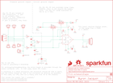

Contents
========

* [PRS14002 > Sparkfun](#prs14002--sparkfun)
	* [Images](#images)
	* [Tags](#tags)
  
![][im]
# PRS14002 > Sparkfun

- ID: PROJ-SPAR-14002-STAN-01
- Hex ID: PRS14002
- Name: Sparkfun
- Description: Sparkfun

## Images
  
  

|kicadPcb3d|kicadPcb3dFront|kicadPcb3dBack|eagleImage|eagleSchemImage|
| :---: | :---: | :---: | :---: | :---: |
||||||

## Tags

- hexID: PRS14002
- oompType: PROJ
- oompSize: SPAR
- oompColor: 14002
- oompDesc: STAN
- oompIndex: 01
- oompName: THAT 1206 Breakout
- sources: All source files from https://github.com/sparkfun/THAT_1206_Breakout (source licence details in srcLicense.md)
- linkBuyPage: https://www.sparkfun.com/products/14002
- oompID: PROJ-SPAR-14002-STAN-01
- oompParts: C1,UNMATCHED-UNMATCHED-UNMATCHED-UNMATCHED-UNMATCHED
- oompParts: C2,UNMATCHED-UNMATCHED-UNMATCHED-UNMATCHED-UNMATCHED
- oompParts: C3,UNMATCHED-UNMATCHED-UNMATCHED-UNMATCHED-UNMATCHED
- oompParts: C4,UNMATCHED-UNMATCHED-UNMATCHED-UNMATCHED-UNMATCHED
- oompParts: C5,UNMATCHED-UNMATCHED-UNMATCHED-UNMATCHED-UNMATCHED
- oompParts: C6,UNMATCHED-UNMATCHED-UNMATCHED-UNMATCHED-UNMATCHED
- oompParts: D1,UNMATCHED-UNMATCHED-UNMATCHED-UNMATCHED-UNMATCHED
- oompParts: D2,UNMATCHED-UNMATCHED-UNMATCHED-UNMATCHED-UNMATCHED
- oompParts: D3,UNMATCHED-UNMATCHED-UNMATCHED-UNMATCHED-UNMATCHED
- oompParts: D4,UNMATCHED-UNMATCHED-UNMATCHED-UNMATCHED-UNMATCHED
- oompParts: FRAME1,UNMATCHED-UNMATCHED-UNMATCHED-UNMATCHED-UNMATCHED
- oompParts: IC1,UNMATCHED-UNMATCHED-UNMATCHED-UNMATCHED-UNMATCHED
- oompParts: J1,UNMATCHED-UNMATCHED-UNMATCHED-UNMATCHED-UNMATCHED
- oompParts: J2,UNMATCHED-UNMATCHED-UNMATCHED-UNMATCHED-UNMATCHED
- oompParts: J3,UNMATCHED-UNMATCHED-UNMATCHED-UNMATCHED-UNMATCHED
- oompParts: J4,UNMATCHED-UNMATCHED-UNMATCHED-UNMATCHED-UNMATCHED
- oompParts: J5,UNMATCHED-UNMATCHED-UNMATCHED-UNMATCHED-UNMATCHED
- oompParts: J6,UNMATCHED-UNMATCHED-UNMATCHED-UNMATCHED-UNMATCHED
- oompParts: J7,UNMATCHED-UNMATCHED-UNMATCHED-UNMATCHED-UNMATCHED
- oompParts: J8,UNMATCHED-UNMATCHED-UNMATCHED-UNMATCHED-UNMATCHED
- oompParts: J9,UNMATCHED-UNMATCHED-UNMATCHED-UNMATCHED-UNMATCHED
- oompParts: JP1,UNMATCHED-UNMATCHED-UNMATCHED-UNMATCHED-UNMATCHED
- oompParts: LOGO2,UNMATCHED-UNMATCHED-UNMATCHED-UNMATCHED-UNMATCHED
- oompParts: LOGO3,UNMATCHED-UNMATCHED-UNMATCHED-UNMATCHED-UNMATCHED
- oompParts: LOGO4,UNMATCHED-UNMATCHED-UNMATCHED-UNMATCHED-UNMATCHED
- oompParts: LOGO5,UNMATCHED-UNMATCHED-UNMATCHED-UNMATCHED-UNMATCHED
- oompParts: R1,UNMATCHED-UNMATCHED-UNMATCHED-UNMATCHED-UNMATCHED
- oompParts: R2,UNMATCHED-UNMATCHED-UNMATCHED-UNMATCHED-UNMATCHED
- oompParts: R3,UNMATCHED-UNMATCHED-UNMATCHED-UNMATCHED-UNMATCHED
- rawParts: C1,470pF,470PF-50V-5%(0603)SMD,0603-CAP,CAP-07884,,,,CAP-07884,,470pF,
- rawParts: C2,470pF,470PF-50V-5%(0603)SMD,0603-CAP,CAP-07884,,,,CAP-07884,,470pF,
- rawParts: C3,100pF,100PF-50V-5%(0603),0603-CAP,CAP-07883,,,,CAP-07883,,100pF,
- rawParts: C4,220uf,PANA-EEE-FKOJ221P,PANASONIC_D,220 uF 6.3 V cap.,,,,CAP-13470,,220uf,
- rawParts: C5,0.1uF,0.1UF-25V-5%(0603),0603-CAP,CAP-08604,,,,CAP-08604,,0.1uF,
- rawParts: C6,0.1uF,0.1UF-25V-5%(0603),0603-CAP,CAP-08604,,,,CAP-08604,,0.1uF,
- rawParts: D1,12V,12V-ZENER-DIODE,SOD-323,,MM3Z12VT1GOSCT-ND,ON Semi,MM3Z12VT1G,DIO-13471,,12V,
- rawParts: D2,BAV99,BAV99,SOT23-3,Two small signal silicon diodes connected anode to cathode.,,,,DIO-10647,,,
- rawParts: D3,BAV99,BAV99,SOT23-3,Two small signal silicon diodes connected anode to cathode.,,,,DIO-10647,,,
- rawParts: D4,12V,12V-ZENER-DIODE,SOD-323,,MM3Z12VT1GOSCT-ND,ON Semi,MM3Z12VT1G,DIO-13471,,12V,
- rawParts: FD1,FIDUCIALUFIDUCIAL,FIDUCIALUFIDUCIAL,MICRO-FIDUCIAL,Fiducial Alignment Points,,,,,,,
- rawParts: FD2,FIDUCIALUFIDUCIAL,FIDUCIALUFIDUCIAL,MICRO-FIDUCIAL,Fiducial Alignment Points,,,,,,,
- rawParts: FD3,FIDUCIALUFIDUCIAL,FIDUCIALUFIDUCIAL,MICRO-FIDUCIAL,Fiducial Alignment Points,,,,,,,
- rawParts: FD4,FIDUCIALUFIDUCIAL,FIDUCIALUFIDUCIAL,MICRO-FIDUCIAL,Fiducial Alignment Points,,,,,,,
- rawParts: FRAME1,FRAME-LETTER,FRAME-LETTER,CREATIVE_COMMONS,Schematic Frame,,,,,,,
- rawParts: IC1,THAT1206,THAT1206,SO08,THAT Corporation 1206 InGenius series balanced line receiver.,,,,IC-13469,,THAT1206,
- rawParts: J1,INPUT,AUDIO_JACK_TRS_0.25_PTH_RA,AUDIO_JACK_0.25_TRS_PTH_RA,Audio Jack, 1/4 TRS jack, horizontal, PTH, aka Phono jack,,,,CONN-12339,COM-11144,,
- rawParts: J2,S,M01PTH_NO_SILK_YES_STOP,1X01_NO_SILK,Header 1,,,,,,,
- rawParts: J3,RN,M01PTH_NO_SILK_YES_STOP,1X01_NO_SILK,Header 1,,,,,,,
- rawParts: J4,TN,M01PTH_NO_SILK_YES_STOP,1X01_NO_SILK,Header 1,,,,,,,
- rawParts: J5,SN,M01PTH_NO_SILK_YES_STOP,1X01_NO_SILK,Header 1,,,,,,,
- rawParts: J6,1x4,M04NO_SILK_ALL_ROUND,1X04_NO_SILK_ALL_ROUND,Header 4,,,,CONN-09696,,,
- rawParts: J7,R,M01PTH_NO_SILK_YES_STOP,1X01_NO_SILK,Header 1,,,,,,,
- rawParts: J8,T,M01PTH_NO_SILK_YES_STOP,1X01_NO_SILK,Header 1,,,,,,,
- rawParts: J9,Chassis,M01PTH_NO_SILK_YES_STOP,1X01_NO_SILK,Header 1,,,,,,,
- rawParts: JP1,GND-JOIN,JUMPER-PAD-2-NC_BY_TRACE,PAD-JUMPER-2-NC_BY_TRACE_YES_SILK,,,,,,,,
- rawParts: LOGO2,SFE_LOGO_FLAME.2_INCH,SFE_LOGO_FLAME.2_INCH,SFE_LOGO_FLAME_.2,SFE Logo, flame only,,,,,,,
- rawParts: LOGO3,OSHW-LOGOS,OSHW-LOGOS,OSHW-LOGO-S,Open Source Hardware Logo,,,,,,,
- rawParts: LOGO4,OSHW-LOGOS,OSHW-LOGOS,OSHW-LOGO-S,Open Source Hardware Logo,,,,,,,
- rawParts: LOGO5,SFE_LOGO_NAME.1_INCH,SFE_LOGO_NAME.1_INCH,SFE_LOGO_NAME_.1,SFE Logo, name only,,,,,,,
- rawParts: R1,100,100OHM-1/10W-1%(0603),0603-RES,RES-07863,,,,RES-07863,,100,
- rawParts: R2,100,100OHM-1/10W-1%(0603),0603-RES,RES-07863,,,,RES-07863,,100,
- rawParts: R3,4.7K,4.7KOHM-1/10W-1%(0603),0603-RES,RES-07857,,,,RES-07857,,4.7K,

[im]: kicadPcb3d_450.png
