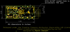
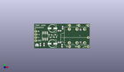
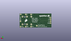
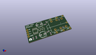

Contents
========

* [PROJ-SPAR-14003-STAN-01>THAT 1646 Breakout](#proj-spar-14003-stan-01that-1646-breakout)
	* [Images](#images)
	* [Interactive BOM](#interactive-bom)
	* [Tags](#tags)
  
![][im]
# PROJ-SPAR-14003-STAN-01>THAT 1646 Breakout

- ID: PROJ-SPAR-14003-STAN-01
- Hex ID: PRS14003
- Name: THAT 1646 Breakout
- Description: 

## Images
  
  

|eagleImage|kicadPcb3dFront|kicadPcb3dBack|kicadPcb3d|
| :---: | :---: | :---: | :---: |
|||||

## Interactive BOM

- Interactive BOM page: [ibom.html](kicad/bom/ibom.html)

## Tags

- hexID: PRS14003
- oompType: PROJ
- oompSize: SPAR
- oompColor: 14003
- oompDesc: STAN
- oompIndex: 01
- oompName: THAT 1646 Breakout
- sources: All source files from https://github.com/sparkfun/THAT_1646_Breakout (source licence details in srcLicense.md)
- linkBuyPage: https://www.sparkfun.com/products/14003
- oompID: PROJ-SPAR-14003-STAN-01
- oompParts: C1,UNMATCHED-UNMATCHED-UNMATCHED-UNMATCHED-UNMATCHED
- oompParts: C2,UNMATCHED-UNMATCHED-UNMATCHED-UNMATCHED-UNMATCHED
- oompParts: C3,UNMATCHED-UNMATCHED-UNMATCHED-UNMATCHED-UNMATCHED
- oompParts: C4,UNMATCHED-UNMATCHED-UNMATCHED-UNMATCHED-UNMATCHED
- oompParts: C5,UNMATCHED-UNMATCHED-UNMATCHED-UNMATCHED-UNMATCHED
- oompParts: C6,UNMATCHED-UNMATCHED-UNMATCHED-UNMATCHED-UNMATCHED
- oompParts: D1,UNMATCHED-UNMATCHED-UNMATCHED-UNMATCHED-UNMATCHED
- oompParts: D2,UNMATCHED-UNMATCHED-UNMATCHED-UNMATCHED-UNMATCHED
- oompParts: FRAME1,UNMATCHED-UNMATCHED-UNMATCHED-UNMATCHED-UNMATCHED
- oompParts: IC1,UNMATCHED-UNMATCHED-UNMATCHED-UNMATCHED-UNMATCHED
- oompParts: J1,UNMATCHED-UNMATCHED-UNMATCHED-UNMATCHED-UNMATCHED
- oompParts: J2,UNMATCHED-UNMATCHED-UNMATCHED-UNMATCHED-UNMATCHED
- oompParts: J3,UNMATCHED-UNMATCHED-UNMATCHED-UNMATCHED-UNMATCHED
- oompParts: J4,UNMATCHED-UNMATCHED-UNMATCHED-UNMATCHED-UNMATCHED
- oompParts: J5,UNMATCHED-UNMATCHED-UNMATCHED-UNMATCHED-UNMATCHED
- oompParts: J6,UNMATCHED-UNMATCHED-UNMATCHED-UNMATCHED-UNMATCHED
- oompParts: J7,UNMATCHED-UNMATCHED-UNMATCHED-UNMATCHED-UNMATCHED
- oompParts: J8,UNMATCHED-UNMATCHED-UNMATCHED-UNMATCHED-UNMATCHED
- oompParts: J9,UNMATCHED-UNMATCHED-UNMATCHED-UNMATCHED-UNMATCHED
- oompParts: JP1,UNMATCHED-UNMATCHED-UNMATCHED-UNMATCHED-UNMATCHED
- oompParts: L1,UNMATCHED-UNMATCHED-UNMATCHED-UNMATCHED-UNMATCHED
- oompParts: L2,UNMATCHED-UNMATCHED-UNMATCHED-UNMATCHED-UNMATCHED
- oompParts: LOGO1,UNMATCHED-UNMATCHED-UNMATCHED-UNMATCHED-UNMATCHED
- oompParts: LOGO2,UNMATCHED-UNMATCHED-UNMATCHED-UNMATCHED-UNMATCHED
- oompParts: LOGO4,UNMATCHED-UNMATCHED-UNMATCHED-UNMATCHED-UNMATCHED
- oompParts: LOGO5,UNMATCHED-UNMATCHED-UNMATCHED-UNMATCHED-UNMATCHED
- rawParts: C1,0.1uF,0.1UF-25V-5%(0603),0603-CAP,CAP-08604,,,,CAP-08604,,0.1uF,
- rawParts: C2,0.1uF,0.1UF-25V-5%(0603),0603-CAP,CAP-08604,,,,CAP-08604,,0.1uF,
- rawParts: C3,10uf NP,PANA-EEE-1EA100NP,PANASONIC_D,Panasonic 10uf 25V nonpolar.,PCE4294TR-ND,Panasonic,1ea100np,CAP-13474,,10uf NP,
- rawParts: C4,10uf NP,PANA-EEE-1EA100NP,PANASONIC_D,Panasonic 10uf 25V nonpolar.,PCE4294TR-ND,Panasonic,1ea100np,CAP-13474,,10uf NP,
- rawParts: C5,100pF,100PF-50V-5%(0603),0603-CAP,CAP-07883,,,,CAP-07883,,100pF,
- rawParts: C6,100pF,100PF-50V-5%(0603),0603-CAP,CAP-07883,,,,CAP-07883,,100pF,
- rawParts: D1,BAV99,BAV99,SOT23-3,Two small signal silicon diodes connected anode to cathode.,,,,DIO-10647,,,
- rawParts: D2,BAV99,BAV99,SOT23-3,Two small signal silicon diodes connected anode to cathode.,,,,DIO-10647,,,
- rawParts: FD1,FIDUCIALUFIDUCIAL,FIDUCIALUFIDUCIAL,MICRO-FIDUCIAL,Fiducial Alignment Points,,,,,,,
- rawParts: FD2,FIDUCIALUFIDUCIAL,FIDUCIALUFIDUCIAL,MICRO-FIDUCIAL,Fiducial Alignment Points,,,,,,,
- rawParts: FD3,FIDUCIALUFIDUCIAL,FIDUCIALUFIDUCIAL,MICRO-FIDUCIAL,Fiducial Alignment Points,,,,,,,
- rawParts: FD4,FIDUCIALUFIDUCIAL,FIDUCIALUFIDUCIAL,MICRO-FIDUCIAL,Fiducial Alignment Points,,,,,,,
- rawParts: FRAME1,FRAME-LETTER,FRAME-LETTER,CREATIVE_COMMONS,Schematic Frame,,,,,,,
- rawParts: IC1,THAT1646,THAT1646,SO08,THAT Corporation 1646 OutSmarts Balanced line driver,,,,IC-13473,,THAT1646,
- rawParts: J1,1x4,M04NO_SILK_ALL_ROUND,1X04_NO_SILK_ALL_ROUND,Header 4,,,,CONN-09696,,,
- rawParts: J2,SN,M01PTH_NO_SILK_YES_STOP,1X01_NO_SILK,Header 1,,,,,,,
- rawParts: J3,S,M01PTH_NO_SILK_YES_STOP,1X01_NO_SILK,Header 1,,,,,,,
- rawParts: J4,TN,M01PTH_NO_SILK_YES_STOP,1X01_NO_SILK,Header 1,,,,,,,
- rawParts: J5,RN,M01PTH_NO_SILK_YES_STOP,1X01_NO_SILK,Header 1,,,,,,,
- rawParts: J6,OUTPUT,AUDIO_JACK_TRS_0.25_PTH_RA,AUDIO_JACK_0.25_TRS_PTH_RA,Audio Jack, 1/4 TRS jack, horizontal, PTH, aka Phono jack,,,,CONN-12339,COM-11144,,
- rawParts: J7,T,M01PTH_NO_SILK_YES_STOP,1X01_NO_SILK,Header 1,,,,,,,
- rawParts: J8,R,M01PTH_NO_SILK_YES_STOP,1X01_NO_SILK,Header 1,,,,,,,
- rawParts: J9,Chassis,M01PTH_NO_SILK_YES_STOP,1X01_NO_SILK,Header 1,,,,,,,
- rawParts: JP1,GND-JOIN,JUMPER-PAD-2-NC_BY_TRACE,PAD-JUMPER-2-NC_BY_TRACE_YES_SILK,,,,,,,,
- rawParts: L1,27uH,INDUCTOR0603,0603,Inductors,,,,NDUC-12579,,,
- rawParts: L2,27uH,INDUCTOR0603,0603,Inductors,,,,NDUC-12579,,,
- rawParts: LOGO1,OSHW-LOGOS,OSHW-LOGOS,OSHW-LOGO-S,Open Source Hardware Logo,,,,,,,
- rawParts: LOGO2,OSHW-LOGOS,OSHW-LOGOS,OSHW-LOGO-S,Open Source Hardware Logo,,,,,,,
- rawParts: LOGO4,SFE_LOGO_FLAME.2_INCH,SFE_LOGO_FLAME.2_INCH,SFE_LOGO_FLAME_.2,SFE Logo, flame only,,,,,,,
- rawParts: LOGO5,SFE_LOGO_NAME.1_INCH,SFE_LOGO_NAME.1_INCH,SFE_LOGO_NAME_.1,SFE Logo, name only,,,,,,,

[im]: kicadPcb3d_450.png
