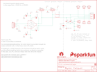
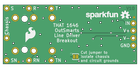

Contents
========

* [PRS14003 > THAT 1646 Breakout](#prs14003--that-1646-breakout)
	* [Schematic](#schematic)
	* [PCB](#pcb)
	* [Interactive BOM](#interactive-bom)
	* [OOMP Parts](#oomp-parts)
	* [Images](#images)
	* [Tags](#tags)
  
![][im]
# PRS14003 > THAT 1646 Breakout

- ID: PROJ-SPAR-14003-STAN-01
- Hex ID: PRS14003
- Name: Sparkfun
- Description: Sparkfun
- Long Link: [http://oom.lt/PROJ-SPAR-14003-STAN-01](http://oom.lt/PROJ-SPAR-14003-STAN-01)
- Short Link: [http://oom.lt/PRS14003](http://oom.lt/PRS14003)

## Schematic
  

## PCB
  

## Interactive BOM

- Interactive BOM page: [ibom.html](https://htmlpreview.github.io/?https://github.com/oomlout/oomlout_OOMP_projects/blob/main/PROJ-SPAR-14003-STAN-01/kicad/bom/ibom.html)

## OOMP Parts
  

|OOMP Parts|
| :---: |
|[CAPC-0603-X-NF100-V50  SMD (0603) 100 nF Capacitor (Ceramic) 50v  C1, C2](https://github.com/oomlout/oomlout_OOMP_parts/tree/main/CAPC-0603-X-NF100-V50/)|
|CAPE-PAND-X-UNMATCHED-01 C3, C4|
|[CAPC-0603-X-PF100-V50  SMD (0603) 100 pF Capacitor (Ceramic) 50v  C5, C6](https://github.com/oomlout/oomlout_OOMP_parts/tree/main/CAPC-0603-X-PF100-V50/)|
|DIOD-SO23-X-UNMATCHED-01 D1, D2|
|UNMATCHED-UNMATCHED-X-UNMATCHED-01 IC1, J6|
|[HEAD-I01-X-PI04-01  2.54 mm 4 Pin Header  J1](https://github.com/oomlout/oomlout_OOMP_parts/tree/main/HEAD-I01-X-PI04-01/)|
|HEAD-I01-X-PI01-01 J2, J3, J4, J5, J7, J8, J9|
|UNMATCHED-0603-X-UNMATCHED-01 L1, L2|

## Images
  
  

|bominteractivefront|bominteractiveback|kicadPcb3d|kicadPcb3dFront|kicadPcb3dBack|eagleImage|eagleSchemImage|pcbdraw|pcbdrawback|
| :---: | :---: | :---: | :---: | :---: | :---: | :---: | :---: | :---: |
||||||||||

## Tags

- hexID: PRS14003
- oompType: PROJ
- oompSize: SPAR
- oompColor: 14003
- oompDesc: STAN
- oompIndex: 01
- oompName: THAT 1646 Breakout
- sources: All source files from https://github.com/sparkfun/THAT_1646_Breakout (source licence details in srcLicense.md)
- linkBuyPage: https://www.sparkfun.com/products/14003
- oompID: PROJ-SPAR-14003-STAN-01
- oompParts: C1,CAPC-0603-X-NF100-V50
- oompParts: C2,CAPC-0603-X-NF100-V50
- oompParts: C3,CAPE-PAND-X-UNMATCHED-01
- oompParts: C4,CAPE-PAND-X-UNMATCHED-01
- oompParts: C5,CAPC-0603-X-PF100-V50
- oompParts: C6,CAPC-0603-X-PF100-V50
- oompParts: D1,DIOD-SO23-X-UNMATCHED-01
- oompParts: D2,DIOD-SO23-X-UNMATCHED-01
- oompParts: IC1,UNMATCHED-UNMATCHED-X-UNMATCHED-01
- oompParts: J1,HEAD-I01-X-PI04-01
- oompParts: J2,HEAD-I01-X-PI01-01
- oompParts: J3,HEAD-I01-X-PI01-01
- oompParts: J4,HEAD-I01-X-PI01-01
- oompParts: J5,HEAD-I01-X-PI01-01
- oompParts: J6,UNMATCHED-UNMATCHED-X-UNMATCHED-01
- oompParts: J7,HEAD-I01-X-PI01-01
- oompParts: J8,HEAD-I01-X-PI01-01
- oompParts: J9,HEAD-I01-X-PI01-01
- oompParts: L1,UNMATCHED-0603-X-UNMATCHED-01
- oompParts: L2,UNMATCHED-0603-X-UNMATCHED-01
- rawParts: C1,0.1uF,0.1UF-25V-5%(0603),0603-CAP,CAP-08604,,,,CAP-08604,,0.1uF,
- rawParts: C2,0.1uF,0.1UF-25V-5%(0603),0603-CAP,CAP-08604,,,,CAP-08604,,0.1uF,
- rawParts: C3,10uf NP,PANA-EEE-1EA100NP,PANASONIC_D,Panasonic 10uf 25V nonpolar.,PCE4294TR-ND,Panasonic,1ea100np,CAP-13474,,10uf NP,
- rawParts: C4,10uf NP,PANA-EEE-1EA100NP,PANASONIC_D,Panasonic 10uf 25V nonpolar.,PCE4294TR-ND,Panasonic,1ea100np,CAP-13474,,10uf NP,
- rawParts: C5,100pF,100PF-50V-5%(0603),0603-CAP,CAP-07883,,,,CAP-07883,,100pF,
- rawParts: C6,100pF,100PF-50V-5%(0603),0603-CAP,CAP-07883,,,,CAP-07883,,100pF,
- rawParts: D1,BAV99,BAV99,SOT23-3,Two small signal silicon diodes connected anode to cathode.,,,,DIO-10647,,,
- rawParts: D2,BAV99,BAV99,SOT23-3,Two small signal silicon diodes connected anode to cathode.,,,,DIO-10647,,,
- rawParts: FD1,FIDUCIALUFIDUCIAL,FIDUCIALUFIDUCIAL,MICRO-FIDUCIAL,Fiducial Alignment Points,,,,,,,
- rawParts: FD2,FIDUCIALUFIDUCIAL,FIDUCIALUFIDUCIAL,MICRO-FIDUCIAL,Fiducial Alignment Points,,,,,,,
- rawParts: FD3,FIDUCIALUFIDUCIAL,FIDUCIALUFIDUCIAL,MICRO-FIDUCIAL,Fiducial Alignment Points,,,,,,,
- rawParts: FD4,FIDUCIALUFIDUCIAL,FIDUCIALUFIDUCIAL,MICRO-FIDUCIAL,Fiducial Alignment Points,,,,,,,
- rawParts: FRAME1,FRAME-LETTER,FRAME-LETTER,CREATIVE_COMMONS,Schematic Frame,,,,,,,
- rawParts: IC1,THAT1646,THAT1646,SO08,THAT Corporation 1646 OutSmarts Balanced line driver,,,,IC-13473,,THAT1646,
- rawParts: J1,1x4,M04NO_SILK_ALL_ROUND,1X04_NO_SILK_ALL_ROUND,Header 4,,,,CONN-09696,,,
- rawParts: J2,SN,M01PTH_NO_SILK_YES_STOP,1X01_NO_SILK,Header 1,,,,,,,
- rawParts: J3,S,M01PTH_NO_SILK_YES_STOP,1X01_NO_SILK,Header 1,,,,,,,
- rawParts: J4,TN,M01PTH_NO_SILK_YES_STOP,1X01_NO_SILK,Header 1,,,,,,,
- rawParts: J5,RN,M01PTH_NO_SILK_YES_STOP,1X01_NO_SILK,Header 1,,,,,,,
- rawParts: J6,OUTPUT,AUDIO_JACK_TRS_0.25_PTH_RA,AUDIO_JACK_0.25_TRS_PTH_RA,Audio Jack, 1/4 TRS jack, horizontal, PTH, aka Phono jack,,,,CONN-12339,COM-11144,,
- rawParts: J7,T,M01PTH_NO_SILK_YES_STOP,1X01_NO_SILK,Header 1,,,,,,,
- rawParts: J8,R,M01PTH_NO_SILK_YES_STOP,1X01_NO_SILK,Header 1,,,,,,,
- rawParts: J9,Chassis,M01PTH_NO_SILK_YES_STOP,1X01_NO_SILK,Header 1,,,,,,,
- rawParts: JP1,GND-JOIN,JUMPER-PAD-2-NC_BY_TRACE,PAD-JUMPER-2-NC_BY_TRACE_YES_SILK,,,,,,,,
- rawParts: L1,27uH,INDUCTOR0603,0603,Inductors,,,,NDUC-12579,,,
- rawParts: L2,27uH,INDUCTOR0603,0603,Inductors,,,,NDUC-12579,,,
- rawParts: LOGO1,OSHW-LOGOS,OSHW-LOGOS,OSHW-LOGO-S,Open Source Hardware Logo,,,,,,,
- rawParts: LOGO2,OSHW-LOGOS,OSHW-LOGOS,OSHW-LOGO-S,Open Source Hardware Logo,,,,,,,
- rawParts: LOGO4,SFE_LOGO_FLAME.2_INCH,SFE_LOGO_FLAME.2_INCH,SFE_LOGO_FLAME_.2,SFE Logo, flame only,,,,,,,
- rawParts: LOGO5,SFE_LOGO_NAME.1_INCH,SFE_LOGO_NAME.1_INCH,SFE_LOGO_NAME_.1,SFE Logo, name only,,,,,,,

[im]: kicadPcb3d_450.png
