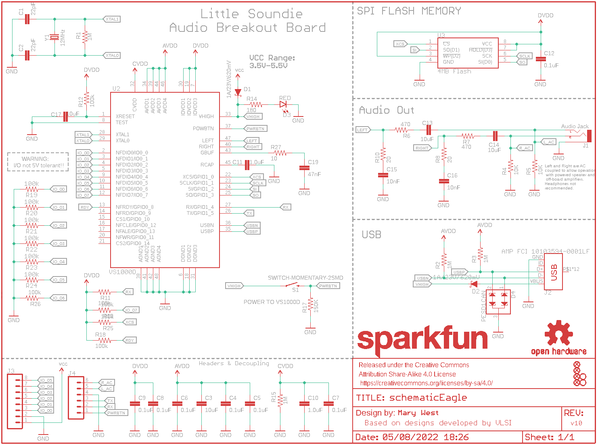
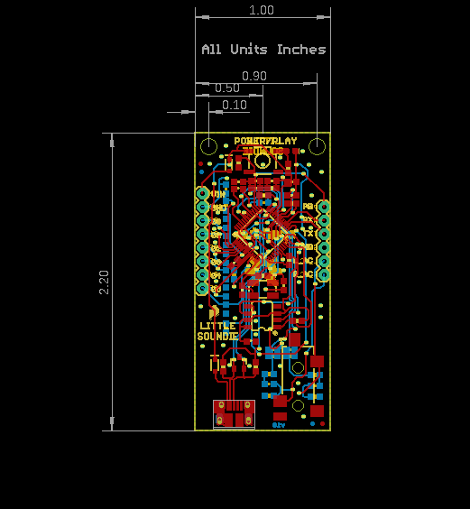
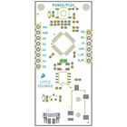
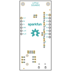
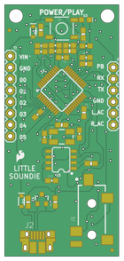
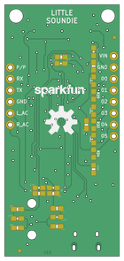

Contents
========

* [PRS14006 > Lil Soundie Audio Player](#prs14006--lil-soundie-audio-player)
	* [Schematic](#schematic)
	* [PCB](#pcb)
	* [Interactive BOM](#interactive-bom)
	* [OOMP Parts](#oomp-parts)
	* [Images](#images)
	* [Tags](#tags)
  
![][im]
# PRS14006 > Lil Soundie Audio Player

- ID: PROJ-SPAR-14006-STAN-01
- Hex ID: PRS14006
- Name: Sparkfun
- Description: Sparkfun
- Long Link: [http://oom.lt/PROJ-SPAR-14006-STAN-01](http://oom.lt/PROJ-SPAR-14006-STAN-01)
- Short Link: [http://oom.lt/PRS14006](http://oom.lt/PRS14006)

## Schematic
  

## PCB
  

## Interactive BOM

- Interactive BOM page: [ibom.html](https://htmlpreview.github.io/?https://github.com/oomlout/oomlout_OOMP_projects/blob/main/PROJ-SPAR-14006-STAN-01/kicad/bom/ibom.html)

## OOMP Parts
  

|OOMP Parts|
| :---: |
|[CAPC-0603-X-PF22-V50  SMD (0603) 22 pF Capacitor (Ceramic) 50v  C1, C2](https://github.com/oomlout/oomlout_OOMP_parts/tree/main/CAPC-0603-X-PF22-V50/)|
|[CAPC-0603-X-UF10-V63D  SMD (0603) 10 uF Capacitor (Ceramic) 6.3v  C3, C13, C14, C17](https://github.com/oomlout/oomlout_OOMP_parts/tree/main/CAPC-0603-X-UF10-V63D/)|
|[CAPC-0603-X-NF100-V50  SMD (0603) 100 nF Capacitor (Ceramic) 50v  C4, C5, C6, C7, C8, C9, C12](https://github.com/oomlout/oomlout_OOMP_parts/tree/main/CAPC-0603-X-NF100-V50/)|
|CAPC-0603-X-UNMATCHED-01 C10, C11|
|[CAPC-0603-X-NF10-V50  SMD (0603) 10 nF Capacitor (Ceramic) 50v  C15, C16](https://github.com/oomlout/oomlout_OOMP_parts/tree/main/CAPC-0603-X-NF10-V50/)|
|CAPC-0603-X-NF47-01 C19|
|DIOD-S323-X-UNMATCHED-01 D1, D2|
|[LEDS-0603-R-STAN-01  SMD (0603) Red LED  D3](https://github.com/oomlout/oomlout_OOMP_parts/tree/main/LEDS-0603-R-STAN-01/)|
|DIOD-SO23-X-UNMATCHED-01 D4|
|TERS-35D-L-UNMATCHED-01 J1|
|UNMATCHED-UNMATCHED-X-UNMATCHED-01 J2, S1, U2, U3, Y1|
|[HEAD-I01-X-PI08-01  2.54 mm 8 Pin Header  J3](https://github.com/oomlout/oomlout_OOMP_parts/tree/main/HEAD-I01-X-PI08-01/)|
|[HEAD-I01-X-PI06-01  2.54 mm 6 Pin Header  J4](https://github.com/oomlout/oomlout_OOMP_parts/tree/main/HEAD-I01-X-PI06-01/)|
|[RESE-0603-X-O105-01  SMD (0603) 1M Ohm Resistor  R1, R2, R3, R15](https://github.com/oomlout/oomlout_OOMP_parts/tree/main/RESE-0603-X-O105-01/)|
|[RESE-0603-X-O103-01  SMD (0603) 10k Ohm Resistor  R4, R5](https://github.com/oomlout/oomlout_OOMP_parts/tree/main/RESE-0603-X-O103-01/)|
|[RESE-0603-X-O471-01  SMD (0603) 470 Ohm Resistor  R6, R7](https://github.com/oomlout/oomlout_OOMP_parts/tree/main/RESE-0603-X-O471-01/)|
|[RESE-0603-X-O200-01  SMD (0603) 20 Ohm Resistor  R8, R10](https://github.com/oomlout/oomlout_OOMP_parts/tree/main/RESE-0603-X-O200-01/)|
|RESE-0603-X-O1003-01 R11, R12, R13, R18, R19, R20, R21, R22, R23, R24, R25, R26|
|RESE-0603-X-O181-01 R14|
|RESE-0603-X-O1503-01 R17|
|[RESE-0603-X-O100-01  SMD (0603) 10 Ohm Resistor  R27](https://github.com/oomlout/oomlout_OOMP_parts/tree/main/RESE-0603-X-O100-01/)|

## Images
  
  

|bominteractivefront|bominteractiveback|kicadPcb3d|kicadPcb3dFront|kicadPcb3dBack|eagleImage|eagleSchemImage|pcbdraw|pcbdrawback|
| :---: | :---: | :---: | :---: | :---: | :---: | :---: | :---: | :---: |
||||||||||

## Tags

- hexID: PRS14006
- oompType: PROJ
- oompSize: SPAR
- oompColor: 14006
- oompDesc: STAN
- oompIndex: 01
- oompName: Lil Soundie Audio Player
- sources: All source files from https://github.com/sparkfun/Lil_Soundie_Audio_Player (source licence details in srcLicense.md)
- linkBuyPage: https://www.sparkfun.com/products/14006
- oompID: PROJ-SPAR-14006-STAN-01
- oompParts: C1,CAPC-0603-X-PF22-V50
- oompParts: C2,CAPC-0603-X-PF22-V50
- oompParts: C3,CAPC-0603-X-UF10-V63D
- oompParts: C4,CAPC-0603-X-NF100-V50
- oompParts: C5,CAPC-0603-X-NF100-V50
- oompParts: C6,CAPC-0603-X-NF100-V50
- oompParts: C7,CAPC-0603-X-NF100-V50
- oompParts: C8,CAPC-0603-X-NF100-V50
- oompParts: C9,CAPC-0603-X-NF100-V50
- oompParts: C10,CAPC-0603-X-UNMATCHED-01
- oompParts: C11,CAPC-0603-X-UNMATCHED-01
- oompParts: C12,CAPC-0603-X-NF100-V50
- oompParts: C13,CAPC-0603-X-UF10-V63D
- oompParts: C14,CAPC-0603-X-UF10-V63D
- oompParts: C15,CAPC-0603-X-NF10-V50
- oompParts: C16,CAPC-0603-X-NF10-V50
- oompParts: C17,CAPC-0603-X-UF10-V63D
- oompParts: C19,CAPC-0603-X-NF47-01
- oompParts: D1,DIOD-S323-X-UNMATCHED-01
- oompParts: D2,DIOD-S323-X-UNMATCHED-01
- oompParts: D3,LEDS-0603-R-STAN-01
- oompParts: D4,DIOD-SO23-X-UNMATCHED-01
- oompParts: J1,TERS-35D-L-UNMATCHED-01
- oompParts: J2,UNMATCHED-UNMATCHED-X-UNMATCHED-01
- oompParts: J3,HEAD-I01-X-PI08-01
- oompParts: J4,HEAD-I01-X-PI06-01
- oompParts: R1,RESE-0603-X-O105-01
- oompParts: R2,RESE-0603-X-O105-01
- oompParts: R3,RESE-0603-X-O105-01
- oompParts: R4,RESE-0603-X-O103-01
- oompParts: R5,RESE-0603-X-O103-01
- oompParts: R6,RESE-0603-X-O471-01
- oompParts: R7,RESE-0603-X-O471-01
- oompParts: R8,RESE-0603-X-O200-01
- oompParts: R10,RESE-0603-X-O200-01
- oompParts: R11,RESE-0603-X-O1003-01
- oompParts: R12,RESE-0603-X-O1003-01
- oompParts: R13,RESE-0603-X-O1003-01
- oompParts: R14,RESE-0603-X-O181-01
- oompParts: R15,RESE-0603-X-O105-01
- oompParts: R17,RESE-0603-X-O1503-01
- oompParts: R18,RESE-0603-X-O1003-01
- oompParts: R19,RESE-0603-X-O1003-01
- oompParts: R20,RESE-0603-X-O1003-01
- oompParts: R21,RESE-0603-X-O1003-01
- oompParts: R22,RESE-0603-X-O1003-01
- oompParts: R23,RESE-0603-X-O1003-01
- oompParts: R24,RESE-0603-X-O1003-01
- oompParts: R25,RESE-0603-X-O1003-01
- oompParts: R26,RESE-0603-X-O1003-01
- oompParts: R27,RESE-0603-X-O100-01
- oompParts: S1,UNMATCHED-UNMATCHED-X-UNMATCHED-01
- oompParts: U2,UNMATCHED-UNMATCHED-X-UNMATCHED-01
- oompParts: U3,UNMATCHED-UNMATCHED-X-UNMATCHED-01
- oompParts: Y1,UNMATCHED-UNMATCHED-X-UNMATCHED-01
- rawParts: C1,22pF,22PF-50V-5%(0603),0603-CAP,CAP-07876,CAP-07876,22pF,
- rawParts: C2,22pF,22PF-50V-5%(0603),0603-CAP,CAP-07876,CAP-07876,22pF,
- rawParts: C3,10uF,10UF-6.3V-20%(0603),0603-CAP,CAP-11015,CAP-11015,10uF,
- rawParts: C4,0.1uF,0.1UF-25V(+80/-20%)(0603),0603-CAP,CAP-00810,CAP-00810,0.1uF,
- rawParts: C5,0.1uF,0.1UF-25V(+80/-20%)(0603),0603-CAP,CAP-00810,CAP-00810,0.1uF,
- rawParts: C6,0.1uF,0.1UF-25V(+80/-20%)(0603),0603-CAP,CAP-00810,CAP-00810,0.1uF,
- rawParts: C7,0.1uF,0.1UF-25V(+80/-20%)(0603),0603-CAP,CAP-00810,CAP-00810,0.1uF,
- rawParts: C8,0.1uF,0.1UF-25V(+80/-20%)(0603),0603-CAP,CAP-00810,CAP-00810,0.1uF,
- rawParts: C9,0.1uF,0.1UF-25V(+80/-20%)(0603),0603-CAP,CAP-00810,CAP-00810,0.1uF,
- rawParts: C10,1.0uF,1.0UF-16V-10%(0603),0603-CAP,CAP-00868,CAP-00868,1.0uF,
- rawParts: C11,1.0uF,1.0UF-16V-10%(0603),0603-CAP,CAP-00868,CAP-00868,1.0uF,
- rawParts: C12,0.1uF,0.1UF-25V(+80/-20%)(0603),0603-CAP,CAP-00810,CAP-00810,0.1uF,
- rawParts: C13,10uF,10UF-6.3V-20%(0603),0603-CAP,CAP-11015,CAP-11015,10uF,
- rawParts: C14,10uF,10UF-6.3V-20%(0603),0603-CAP,CAP-11015,CAP-11015,10uF,
- rawParts: C15,10nF,10NF/10000PF-50V-10%(0603),0603-CAP,CAP-00867,CAP-00867,10nF,
- rawParts: C16,10nF,10NF/10000PF-50V-10%(0603),0603-CAP,CAP-00867,CAP-00867,10nF,
- rawParts: C17,10uF,10UF-6.3V-20%(0603),0603-CAP,CAP-11015,CAP-11015,10uF,
- rawParts: C19,47nF,47NF(0.047UF/47000PF)-25V-5%(0603)SMD,0603-CAP,CAP-08605,CAP-08605,47nF,
- rawParts: D1,1A/23V/620mV,DIODE-SCHOTTKY-BAT20J,SOD-323,Schottky diode,DIO-11623,1A/23V/620mV,
- rawParts: D2,1A/23V/620mV,DIODE-SCHOTTKY-BAT20J,SOD-323,Schottky diode,DIO-11623,1A/23V/620mV,
- rawParts: D3,RED,LED-RED0603,LED-0603,Red SMD LED,DIO-00819,RED,
- rawParts: D4,PESD1CAN,PESD1CAN,SOT23-3,CAN bus ESD protection diode,DIO-12501,,
- rawParts: FD1,FIDUCIALUFIDUCIAL,FIDUCIALUFIDUCIAL,FIDUCIAL-MICRO,Fiducial Alignment Points,,,
- rawParts: FD2,FIDUCIALUFIDUCIAL,FIDUCIALUFIDUCIAL,FIDUCIAL-MICRO,Fiducial Alignment Points,,,
- rawParts: FD3,FIDUCIALUFIDUCIAL,FIDUCIALUFIDUCIAL,FIDUCIAL-MICRO,Fiducial Alignment Points,,,
- rawParts: FD4,FIDUCIALUFIDUCIAL,FIDUCIALUFIDUCIAL,FIDUCIAL-MICRO,Fiducial Alignment Points,,,
- rawParts: FRAME1,FRAME-LETTER,FRAME-LETTER,CREATIVE_COMMONS,Schematic Frame - Letter,,,
- rawParts: H1,STAND-OFFTIGHT,STAND-OFFTIGHT,STAND-OFF-TIGHT,#4 Stand Off,,,
- rawParts: H4,STAND-OFFTIGHT,STAND-OFFTIGHT,STAND-OFF-TIGHT,#4 Stand Off,,,
- rawParts: J1,Audio Jack,AUDIO-JACKSMD2,AUDIO-JACK-3.5MM-SMD,3.5mm Audio Jack,CONN-10353,,
- rawParts: J2,AMP FCI 10103594-0001LF,USB_MICRO-B_HALF_PTH,USB-MICROB-PTH,USB Type Micro-B Connector,CONN-13711,AMP FCI 10103594-0001LF,
- rawParts: J3,,CONN_08,1X08,Multi connection point. Often used as Generic Header-pin footprint for 0.1 inch spaced/style header connections,CONN-08438,,
- rawParts: J4,,CONN_06SILK_FEMALE_PTH,1X06,Multi connection point. Often used as Generic Header-pin footprint for 0.1 inch spaced/style header connections,CONN-08437,,
- rawParts: LOGO1,OSHW-LOGOL,OSHW-LOGOL,OSHW-LOGO-L,Open-Source Hardware (OSHW) Logo,,,
- rawParts: LOGO2,SFE_LOGO_NAME.1_INCH,SFE_LOGO_NAME.1_INCH,SFE_LOGO_NAME_.1,SparkFun Font Logo,,,
- rawParts: R1,1M,1MOHM-1/10W-1%(0603),0603-RES,RES-07868,RES-07868,1M,
- rawParts: R2,1M,1MOHM-1/10W-1%(0603),0603-RES,RES-07868,RES-07868,1M,
- rawParts: R3,1M,1MOHM-1/10W-1%(0603),0603-RES,RES-07868,RES-07868,1M,
- rawParts: R4,10K,10KOHM-1/10W-1%(0603)0603,0603-RES,RES-00824,RES-00824,10K,
- rawParts: R5,10K,10KOHM-1/10W-1%(0603)0603,0603-RES,RES-00824,RES-00824,10K,
- rawParts: R6,470,470OHM1/10W1%(0603),0603-RES,RES-07869,RES-07869,470,
- rawParts: R7,470,470OHM1/10W1%(0603),0603-RES,RES-07869,RES-07869,470,
- rawParts: R8,20,20OHM1/10W1%(0603)SMD,0603-RES,RES-07862,RES-07862,20,
- rawParts: R10,20,20OHM1/10W1%(0603)SMD,0603-RES,RES-07862,RES-07862,20,
- rawParts: R11,100k,100KOHM-1/10W-1%(0603),0603-RES,RES-07828,RES-07828,100k,
- rawParts: R12,100k,100KOHM-1/10W-1%(0603),0603-RES,RES-07828,RES-07828,100k,
- rawParts: R13,100k,100KOHM-1/10W-1%(0603),0603-RES,RES-07828,RES-07828,100k,
- rawParts: R14,180,180OHM1/10W1%(0603),0603-RES,RES-08788,RES-08788,180,
- rawParts: R15,1M,1MOHM-1/10W-1%(0603),0603-RES,RES-07868,RES-07868,1M,
- rawParts: R17,150K,150KOHM1/10W1%(0603),0603-RES,RES-09117,RES-09117,150K,
- rawParts: R18,100k,100KOHM-1/10W-1%(0603),0603-RES,RES-07828,RES-07828,100k,
- rawParts: R19,100k,100KOHM-0603-1/10W-1%,0603,100kΩ resistor,RES-07828,100k,
- rawParts: R20,100k,100KOHM-0603-1/10W-1%,0603,100kΩ resistor,RES-07828,100k,
- rawParts: R21,100k,100KOHM-0603-1/10W-1%,0603,100kΩ resistor,RES-07828,100k,
- rawParts: R22,100k,100KOHM-0603-1/10W-1%,0603,100kΩ resistor,RES-07828,100k,
- rawParts: R23,100k,100KOHM-0603-1/10W-1%,0603,100kΩ resistor,RES-07828,100k,
- rawParts: R24,100k,100KOHM-0603-1/10W-1%,0603,100kΩ resistor,RES-07828,100k,
- rawParts: R25,100k,100KOHM-1/10W-1%(0603),0603-RES,RES-07828,RES-07828,100k,
- rawParts: R26,100k,100KOHM-1/10W-1%(0603),0603-RES,RES-07828,RES-07828,100k,
- rawParts: R27,10,10OHM-1/10W-5%0603SMD,0603-RES,RES-09834,RES-09834,10,
- rawParts: S1,SWITCH-MOMENTARY-2SMD,SWITCH-MOMENTARY-2SMD,TACTILE-SWITCH-SMD,Various NO switches- pushbuttons, reed, etc,SWCH-08247,,
- rawParts: U2,VS1000D,VS1000,LQFP-48,VS1000D,LPA-12743,VS1000D,
- rawParts: U3,4MB Flash,AT25SF041,SO08,AT25SF041 4Mb Serial Flash Memory,IC-12455,4MB Flash,
- rawParts: Y1,12MHz,CRYSTALCRYSTAL-SMD-5X3-12MHZ,CRYSTAL-SMD-5X3,Various standard crystals. Proven footprints.,XTAL-08297,12MHz,

[im]: kicadPcb3d_450.png
