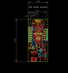
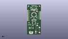
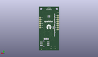
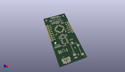

Contents
========

* [PROJ-SPAR-14006-STAN-01>Lil Soundie Audio Player](#proj-spar-14006-stan-01lil-soundie-audio-player)
	* [Images](#images)
	* [Interactive BOM](#interactive-bom)
	* [OOMP Parts](#oomp-parts)
	* [Tags](#tags)
  
![][im]
# PROJ-SPAR-14006-STAN-01>Lil Soundie Audio Player

- ID: PROJ-SPAR-14006-STAN-01
- Hex ID: PRS14006
- Name: Lil Soundie Audio Player
- Description: 

## Images
  
  

|eagleImage|kicadPcb3dFront|kicadPcb3dBack|kicadPcb3d|
| :---: | :---: | :---: | :---: |
|||||

## Interactive BOM

- Interactive BOM page: [ibom.html](kicad/bom/ibom.html)

## OOMP Parts
  

|OOMP Parts|
| :---: |
|CAPE-0603-X-UNMATCHED-01, C1, 16.637, 27.178, 90,C1, 22pF, 0603-CAP, SparkFun-Capacitors, (0.655, 1.07), R90|
|CAPE-0603-X-UNMATCHED-01, C2, 8.85825, 26.44775, 90,C2, 22pF, 0603-CAP, SparkFun-Capacitors, (0.34875, 1.04125), R90|
|CAPE-0603-X-UNMATCHED-01, C3, 11.271249999999998, 46.83125, 0,C3, 10uF, 0603-CAP, SparkFun-Capacitors, (0.44375, 1.84375), R0|
|CAPE-0603-X-NF100-01, C4, 8.149750019999999, 46.740500118, 180,C4, 0.1uF, 0603-CAP, SparkFun-Capacitors, (0.3208563, 1.84017717), R180|
|CAPE-0603-X-NF100-01, C5, 11.271249999999998, 45.561249999999994, 0,C5, 0.1uF, 0603-CAP, SparkFun-Capacitors, (0.44375, 1.79375), R0|
|CAPE-0603-X-NF100-01, C6, 12.858749999999999, 44.1325, 180,C6, 0.1uF, 0603-CAP, SparkFun-Capacitors, (0.50625, 1.7375), R180|
|CAPE-0603-X-NF100-01, C7, 14.44625, 46.83125, 180,C7, 0.1uF, 0603-CAP, SparkFun-Capacitors, (0.56875, 1.84375), R180|
|CAPE-0603-X-NF100-01, C8, 18.0975, 44.1325, 0,C8, 0.1uF, 0603-CAP, SparkFun-Capacitors, (0.7125, 1.7375), R0|
|CAPE-0603-X-NF100-01, C9, 7.34695, 31.47695, 225,C9, 0.1uF, 0603-CAP, SparkFun-Capacitors, (0.28925, 1.23925), R225|
|CAPE-0603-X-UNMATCHED-01, C10, 18.130000062, 46.688749904, 0,C10, 1.0uF, 0603-CAP, SparkFun-Capacitors, (0.71377953, 1.83813976), R0|
|CAPE-0603-X-UNMATCHED-01, C11, 8.104000048, 45.417000098, 0,C11, 1.0uF, 0603-CAP, SparkFun-Capacitors, (0.31905512, 1.78807087), R0|
|CAPE-0603-X-NF100-01, C12, 10.4775, 16.827499999999997, 0,C12, 0.1uF, 0603-CAP, SparkFun-Capacitors, (0.4125, 0.6625), R0|
|CAPE-0603-X-UNMATCHED-01, C13, 22.542499999999997, 8.413749999999999, M0,C13, 10uF, 0603-CAP, SparkFun-Capacitors, (0.8875, 0.33125), MR0|
|CAPE-0603-X-UNMATCHED-01, C14, 13.811249999999998, 8.73125, M180,C14, 10uF, 0603-CAP, SparkFun-Capacitors, (0.54375, 0.34375), MR180|
|CAPE-0603-X-UNMATCHED-01, C15, 17.779999999999998, 15.239999999999998, M0,C15, 10nF, 0603-CAP, SparkFun-Capacitors, (0.7, 0.6), MR0|
|CAPE-0603-X-UNMATCHED-01, C16, 14.604999999999999, 15.239999999999998, M180,C16, 10nF, 0603-CAP, SparkFun-Capacitors, (0.575, 0.6), MR180|
|CAPE-0603-X-UNMATCHED-01, C17, 5.715, 45.402499999999996, M270,C17, 10uF, 0603-CAP, SparkFun-Capacitors, (0.225, 1.7875), MR270|
|CAPE-0603-X-UNMATCHED-01, C19, 12.92225, 42.799, M0,C19, 47nF, 0603-CAP, SparkFun-Capacitors, (0.50875, 1.685), MR0|
|UNMATCHED-UNMATCHED-X-UNMATCHED-01, D1, 6.35, 49.8475, 270,D1, 1A/23V/620mV, SOD-323, SparkFun-DiscreteSemi, (0.25, 1.9625), R270|
|UNMATCHED-UNMATCHED-X-UNMATCHED-01, D2, 3.7464999999999997, 12.2555, 270,D2, 1A/23V/620mV, SOD-323, SparkFun-DiscreteSemi, (0.1475, 0.4825), R270|
|UNMATCHED-0603-X-UNMATCHED-01, D3, 17.93875, 52.51449999999999, 0,D3, RED, LED-0603, SparkFun-LED, (0.70625, 2.0675), R0|
|UNMATCHED-UNMATCHED-X-UNMATCHED-01, D4, 8.254999999999999, 12.7, 0,D4, PESD1CAN, SOT23-3, SparkFun-DiscreteSemi, (0.325, 0.5), R0|
|UNMATCHED-UNMATCHED-X-UNMATCHED-01, FD1, 23.875999999999998, 1.397, 270,FD1, FIDUCIALUFIDUCIAL, FIDUCIAL-MICRO, SparkFun-Aesthetics, (0.94, 0.055), R270|
|UNMATCHED-UNMATCHED-X-UNMATCHED-01, FD2, 1.0795000000000001, 50.165, 270,FD2, FIDUCIALUFIDUCIAL, FIDUCIAL-MICRO, SparkFun-Aesthetics, (0.0425, 1.975), R270|
|UNMATCHED-UNMATCHED-X-UNMATCHED-01, FD3, 22.06625, 1.27, M0,FD3, FIDUCIALUFIDUCIAL, FIDUCIAL-MICRO, SparkFun-Aesthetics, (0.86875, 0.05), MR0|
|UNMATCHED-UNMATCHED-X-UNMATCHED-01, FD4, 1.1112499999999998, 48.5775, M0,FD4, FIDUCIALUFIDUCIAL, FIDUCIAL-MICRO, SparkFun-Aesthetics, (0.04375, 1.9125), MR0|
|ERROR, J1 Audio Jack, 0, 0, 0,J1, Audio, Jack, AUDIO-JACK-3.5MM-SMD, SparkFun-Connectors, (0.7625, 0.05), R90|
|ERROR, J2 AMP FCI, 0, 0, 0,J2, AMP, FCI, 10103594-0001LF, USB-MICROB-PTH, SparkFun-Connectors, (0.2875, 0.13125), R0|
|UNMATCHED-UNMATCHED-X-UNMATCHED-01, J3, 1.27, 44.449999999999996, 270,J3, 1X08, SparkFun-Connectors, (0.05, 1.75), R270|
|UNMATCHED-UNMATCHED-X-UNMATCHED-01, J4, 24.13, 41.91, 270,J4, 1X06, SparkFun-Connectors, (0.95, 1.65), R270|
|RESE-0603-X-UNMATCHED-01, R1, 12.7, 29.159199999999995, 0,R1, 1M, 0603-RES, SparkFun-Resistors, (0.5, 1.148), R0|
|RESE-0603-X-UNMATCHED-01, R2, 5.23875, 12.065, 90,R2, 1M, 0603-RES, SparkFun-Resistors, (0.20625, 0.475), R90|
|RESE-0603-X-UNMATCHED-01, R3, 11.271249999999998, 12.065, 90,R3, 1M, 0603-RES, SparkFun-Resistors, (0.44375, 0.475), R90|
|<table><tr><td></td><td> R4</td><td>[RESE-0603-X-O103-01 SMD (0603) 10k Ohm Resistor](https://github.com/oomlout/oomlout_OOMP_parts/tree/main/RESE-0603-X-O103-01/)</td><td>[R6103](https://github.com/oomlout/oomlout_OOMP_parts/tree/main/RESE-0603-X-O103-01/)</td></tr></table>|
|<table><tr><td></td><td> R5</td><td>[RESE-0603-X-O103-01 SMD (0603) 10k Ohm Resistor](https://github.com/oomlout/oomlout_OOMP_parts/tree/main/RESE-0603-X-O103-01/)</td><td>[R6103](https://github.com/oomlout/oomlout_OOMP_parts/tree/main/RESE-0603-X-O103-01/)</td></tr></table>|
|RESE-0603-X-UNMATCHED-01, R6, 22.542499999999997, 10.4775, M0,R6, 470, 0603-RES, SparkFun-Resistors, (0.8875, 0.4125), MR0|
|RESE-0603-X-UNMATCHED-01, R7, 13.811249999999998, 10.63625, M180,R7, 470, 0603-RES, SparkFun-Resistors, (0.54375, 0.41875), MR180|
|RESE-0603-X-UNMATCHED-01, R8, 14.604999999999999, 13.97, M180,R8, 20, 0603-RES, SparkFun-Resistors, (0.575, 0.55), MR180|
|RESE-0603-X-UNMATCHED-01, R10, 17.779999999999998, 13.97, M0,R10, 20, 0603-RES, SparkFun-Resistors, (0.7, 0.55), MR0|
|<table><tr><td></td><td> R11</td><td>[RESE-0603-X-O104-01 SMD (0603) 100k Ohm Resistor](https://github.com/oomlout/oomlout_OOMP_parts/tree/main/RESE-0603-X-O104-01/)</td><td>[R6104](https://github.com/oomlout/oomlout_OOMP_parts/tree/main/RESE-0603-X-O104-01/)</td></tr></table>|
|<table><tr><td></td><td> R12</td><td>[RESE-0603-X-O104-01 SMD (0603) 100k Ohm Resistor](https://github.com/oomlout/oomlout_OOMP_parts/tree/main/RESE-0603-X-O104-01/)</td><td>[R6104](https://github.com/oomlout/oomlout_OOMP_parts/tree/main/RESE-0603-X-O104-01/)</td></tr></table>|
|<table><tr><td></td><td> R13</td><td>[RESE-0603-X-O104-01 SMD (0603) 100k Ohm Resistor](https://github.com/oomlout/oomlout_OOMP_parts/tree/main/RESE-0603-X-O104-01/)</td><td>[R6104](https://github.com/oomlout/oomlout_OOMP_parts/tree/main/RESE-0603-X-O104-01/)</td></tr></table>|
|RESE-0603-X-UNMATCHED-01, R14, 17.4625, 49.30775, 90,R14, 180, 0603-RES, SparkFun-Resistors, (0.6875, 1.94125), R90|
|RESE-0603-X-UNMATCHED-01, R15, 14.44625, 45.561249999999994, 0,R15, 1M, 0603-RES, SparkFun-Resistors, (0.56875, 1.79375), R0|
|<table><tr><td></td><td> R17</td><td>[RESE-0603-X-O154-01 SMD (0603) 150k Ohm Resistor](https://github.com/oomlout/oomlout_OOMP_parts/tree/main/RESE-0603-X-O154-01/)</td><td>[R6154](https://github.com/oomlout/oomlout_OOMP_parts/tree/main/RESE-0603-X-O154-01/)</td></tr></table>|
|<table><tr><td></td><td> R18</td><td>[RESE-0603-X-O104-01 SMD (0603) 100k Ohm Resistor](https://github.com/oomlout/oomlout_OOMP_parts/tree/main/RESE-0603-X-O104-01/)</td><td>[R6104](https://github.com/oomlout/oomlout_OOMP_parts/tree/main/RESE-0603-X-O104-01/)</td></tr></table>|
|<table><tr><td></td><td> R19</td><td>[RESE-0603-X-O104-01 SMD (0603) 100k Ohm Resistor](https://github.com/oomlout/oomlout_OOMP_parts/tree/main/RESE-0603-X-O104-01/)</td><td>[R6104](https://github.com/oomlout/oomlout_OOMP_parts/tree/main/RESE-0603-X-O104-01/)</td></tr></table>|
|<table><tr><td></td><td> R20</td><td>[RESE-0603-X-O104-01 SMD (0603) 100k Ohm Resistor](https://github.com/oomlout/oomlout_OOMP_parts/tree/main/RESE-0603-X-O104-01/)</td><td>[R6104](https://github.com/oomlout/oomlout_OOMP_parts/tree/main/RESE-0603-X-O104-01/)</td></tr></table>|
|<table><tr><td></td><td> R21</td><td>[RESE-0603-X-O104-01 SMD (0603) 100k Ohm Resistor](https://github.com/oomlout/oomlout_OOMP_parts/tree/main/RESE-0603-X-O104-01/)</td><td>[R6104](https://github.com/oomlout/oomlout_OOMP_parts/tree/main/RESE-0603-X-O104-01/)</td></tr></table>|
|<table><tr><td></td><td> R22</td><td>[RESE-0603-X-O104-01 SMD (0603) 100k Ohm Resistor](https://github.com/oomlout/oomlout_OOMP_parts/tree/main/RESE-0603-X-O104-01/)</td><td>[R6104](https://github.com/oomlout/oomlout_OOMP_parts/tree/main/RESE-0603-X-O104-01/)</td></tr></table>|
|<table><tr><td></td><td> R23</td><td>[RESE-0603-X-O104-01 SMD (0603) 100k Ohm Resistor](https://github.com/oomlout/oomlout_OOMP_parts/tree/main/RESE-0603-X-O104-01/)</td><td>[R6104](https://github.com/oomlout/oomlout_OOMP_parts/tree/main/RESE-0603-X-O104-01/)</td></tr></table>|
|<table><tr><td></td><td> R24</td><td>[RESE-0603-X-O104-01 SMD (0603) 100k Ohm Resistor](https://github.com/oomlout/oomlout_OOMP_parts/tree/main/RESE-0603-X-O104-01/)</td><td>[R6104](https://github.com/oomlout/oomlout_OOMP_parts/tree/main/RESE-0603-X-O104-01/)</td></tr></table>|
|<table><tr><td></td><td> R25</td><td>[RESE-0603-X-O104-01 SMD (0603) 100k Ohm Resistor](https://github.com/oomlout/oomlout_OOMP_parts/tree/main/RESE-0603-X-O104-01/)</td><td>[R6104](https://github.com/oomlout/oomlout_OOMP_parts/tree/main/RESE-0603-X-O104-01/)</td></tr></table>|
|<table><tr><td></td><td> R26</td><td>[RESE-0603-X-O104-01 SMD (0603) 100k Ohm Resistor](https://github.com/oomlout/oomlout_OOMP_parts/tree/main/RESE-0603-X-O104-01/)</td><td>[R6104](https://github.com/oomlout/oomlout_OOMP_parts/tree/main/RESE-0603-X-O104-01/)</td></tr></table>|
|RESE-0603-X-UNMATCHED-01, R27, 12.858749999999999, 44.22774999999999, M180,R27, 10, 0603-RES, SparkFun-Resistors, (0.50625, 1.74125), MR180|
|UNMATCHED-UNMATCHED-X-UNMATCHED-01, S1, 12.7, 50.546, 0,S1, SWITCH-MOMENTARY-2SMD, TACTILE-SWITCH-SMD, SparkFun-Electromechanical, (0.5, 1.99), R0|
|UNMATCHED-UNMATCHED-X-UNMATCHED-01, U2, 12.7, 36.83, 315,U2, VS1000D, LQFP-48, SparkFun-IC-Conversion, (0.5, 1.45), R315|
|ERROR, U3 4MB Flash, 0, 0, 0,U3, 4MB, Flash, SO08, SparkFun-IC-Memory, (0.49375, 0.84375), R90|
|UNMATCHED-UNMATCHED-X-UNMATCHED-01, Y1, 12.7, 26.542999999999996, 0,Y1, 12MHz, CRYSTAL-SMD-5X3, SparkFun-FreqCtrl, (0.5, 1.045), R0|

## Tags

- hexID: PRS14006
- oompType: PROJ
- oompSize: SPAR
- oompColor: 14006
- oompDesc: STAN
- oompIndex: 01
- oompName: Lil Soundie Audio Player
- sources: All source files from https://github.com/sparkfun/Lil_Soundie_Audio_Player (source licence details in srcLicense.md)
- linkBuyPage: https://www.sparkfun.com/products/14006
- oompPart: CAPE-0603-X-UNMATCHED-01, C1, 16.637, 27.178, 90
- oompPart: CAPE-0603-X-UNMATCHED-01, C2, 8.85825, 26.44775, 90
- oompPart: CAPE-0603-X-UNMATCHED-01, C3, 11.271249999999998, 46.83125, 0
- oompPart: CAPE-0603-X-NF100-01, C4, 8.149750019999999, 46.740500118, 180
- oompPart: CAPE-0603-X-NF100-01, C5, 11.271249999999998, 45.561249999999994, 0
- oompPart: CAPE-0603-X-NF100-01, C6, 12.858749999999999, 44.1325, 180
- oompPart: CAPE-0603-X-NF100-01, C7, 14.44625, 46.83125, 180
- oompPart: CAPE-0603-X-NF100-01, C8, 18.0975, 44.1325, 0
- oompPart: CAPE-0603-X-NF100-01, C9, 7.34695, 31.47695, 225
- oompPart: CAPE-0603-X-UNMATCHED-01, C10, 18.130000062, 46.688749904, 0
- oompPart: CAPE-0603-X-UNMATCHED-01, C11, 8.104000048, 45.417000098, 0
- oompPart: CAPE-0603-X-NF100-01, C12, 10.4775, 16.827499999999997, 0
- oompPart: CAPE-0603-X-UNMATCHED-01, C13, 22.542499999999997, 8.413749999999999, M0
- oompPart: CAPE-0603-X-UNMATCHED-01, C14, 13.811249999999998, 8.73125, M180
- oompPart: CAPE-0603-X-UNMATCHED-01, C15, 17.779999999999998, 15.239999999999998, M0
- oompPart: CAPE-0603-X-UNMATCHED-01, C16, 14.604999999999999, 15.239999999999998, M180
- oompPart: CAPE-0603-X-UNMATCHED-01, C17, 5.715, 45.402499999999996, M270
- oompPart: CAPE-0603-X-UNMATCHED-01, C19, 12.92225, 42.799, M0
- oompPart: UNMATCHED-UNMATCHED-X-UNMATCHED-01, D1, 6.35, 49.8475, 270
- oompPart: UNMATCHED-UNMATCHED-X-UNMATCHED-01, D2, 3.7464999999999997, 12.2555, 270
- oompPart: UNMATCHED-0603-X-UNMATCHED-01, D3, 17.93875, 52.51449999999999, 0
- oompPart: UNMATCHED-UNMATCHED-X-UNMATCHED-01, D4, 8.254999999999999, 12.7, 0
- oompPart: UNMATCHED-UNMATCHED-X-UNMATCHED-01, FD1, 23.875999999999998, 1.397, 270
- oompPart: UNMATCHED-UNMATCHED-X-UNMATCHED-01, FD2, 1.0795000000000001, 50.165, 270
- oompPart: UNMATCHED-UNMATCHED-X-UNMATCHED-01, FD3, 22.06625, 1.27, M0
- oompPart: UNMATCHED-UNMATCHED-X-UNMATCHED-01, FD4, 1.1112499999999998, 48.5775, M0
- oompPart: ERROR, J1 Audio Jack, 0, 0, 0
- oompPart: ERROR, J2 AMP FCI, 0, 0, 0
- oompPart: UNMATCHED-UNMATCHED-X-UNMATCHED-01, J3, 1.27, 44.449999999999996, 270
- oompPart: UNMATCHED-UNMATCHED-X-UNMATCHED-01, J4, 24.13, 41.91, 270
- oompPart: RESE-0603-X-UNMATCHED-01, R1, 12.7, 29.159199999999995, 0
- oompPart: RESE-0603-X-UNMATCHED-01, R2, 5.23875, 12.065, 90
- oompPart: RESE-0603-X-UNMATCHED-01, R3, 11.271249999999998, 12.065, 90
- oompPart: RESE-0603-X-O103-01, R4, 13.811249999999998, 6.6674999999999995, M180
- oompPart: RESE-0603-X-O103-01, R5, 22.542499999999997, 6.35, M0
- oompPart: RESE-0603-X-UNMATCHED-01, R6, 22.542499999999997, 10.4775, M0
- oompPart: RESE-0603-X-UNMATCHED-01, R7, 13.811249999999998, 10.63625, M180
- oompPart: RESE-0603-X-UNMATCHED-01, R8, 14.604999999999999, 13.97, M180
- oompPart: RESE-0603-X-UNMATCHED-01, R10, 17.779999999999998, 13.97, M0
- oompPart: RESE-0603-X-O104-01, R11, 18.0975, 42.70374999999999, 0
- oompPart: RESE-0603-X-O104-01, R12, 5.715, 42.2275, M270
- oompPart: RESE-0603-X-O104-01, R13, 7.302499999999999, 29.209999999999997, M90
- oompPart: RESE-0603-X-UNMATCHED-01, R14, 17.4625, 49.30775, 90
- oompPart: RESE-0603-X-UNMATCHED-01, R15, 14.44625, 45.561249999999994, 0
- oompPart: RESE-0603-X-O154-01, R17, 8.064499999999999, 50.19675, 90
- oompPart: RESE-0603-X-O104-01, R18, 17.62125, 31.90875, 270
- oompPart: RESE-0603-X-O104-01, R19, 5.715, 38.976299999999995, M90
- oompPart: RESE-0603-X-O104-01, R20, 5.715, 35.7378, M270
- oompPart: RESE-0603-X-O104-01, R21, 5.715, 32.3088, M90
- oompPart: RESE-0603-X-O104-01, R22, 5.715, 29.209999999999997, M270
- oompPart: RESE-0603-X-O104-01, R23, 5.715, 26.060399999999998, M90
- oompPart: RESE-0603-X-O104-01, R24, 5.715, 22.8346, M270
- oompPart: RESE-0603-X-O104-01, R25, 19.20875, 20.6375, 0
- oompPart: RESE-0603-X-O104-01, R26, 5.715, 19.367499999999996, M270
- oompPart: RESE-0603-X-UNMATCHED-01, R27, 12.858749999999999, 44.22774999999999, M180
- oompPart: UNMATCHED-UNMATCHED-X-UNMATCHED-01, S1, 12.7, 50.546, 0
- oompPart: UNMATCHED-UNMATCHED-X-UNMATCHED-01, U2, 12.7, 36.83, 315
- oompPart: ERROR, U3 4MB Flash, 0, 0, 0
- oompPart: UNMATCHED-UNMATCHED-X-UNMATCHED-01, Y1, 12.7, 26.542999999999996, 0
- rawPart: C1, 22pF, 0603-CAP, SparkFun-Capacitors, (0.655, 1.07), R90
- rawPart: C2, 22pF, 0603-CAP, SparkFun-Capacitors, (0.34875, 1.04125), R90
- rawPart: C3, 10uF, 0603-CAP, SparkFun-Capacitors, (0.44375, 1.84375), R0
- rawPart: C4, 0.1uF, 0603-CAP, SparkFun-Capacitors, (0.3208563, 1.84017717), R180
- rawPart: C5, 0.1uF, 0603-CAP, SparkFun-Capacitors, (0.44375, 1.79375), R0
- rawPart: C6, 0.1uF, 0603-CAP, SparkFun-Capacitors, (0.50625, 1.7375), R180
- rawPart: C7, 0.1uF, 0603-CAP, SparkFun-Capacitors, (0.56875, 1.84375), R180
- rawPart: C8, 0.1uF, 0603-CAP, SparkFun-Capacitors, (0.7125, 1.7375), R0
- rawPart: C9, 0.1uF, 0603-CAP, SparkFun-Capacitors, (0.28925, 1.23925), R225
- rawPart: C10, 1.0uF, 0603-CAP, SparkFun-Capacitors, (0.71377953, 1.83813976), R0
- rawPart: C11, 1.0uF, 0603-CAP, SparkFun-Capacitors, (0.31905512, 1.78807087), R0
- rawPart: C12, 0.1uF, 0603-CAP, SparkFun-Capacitors, (0.4125, 0.6625), R0
- rawPart: C13, 10uF, 0603-CAP, SparkFun-Capacitors, (0.8875, 0.33125), MR0
- rawPart: C14, 10uF, 0603-CAP, SparkFun-Capacitors, (0.54375, 0.34375), MR180
- rawPart: C15, 10nF, 0603-CAP, SparkFun-Capacitors, (0.7, 0.6), MR0
- rawPart: C16, 10nF, 0603-CAP, SparkFun-Capacitors, (0.575, 0.6), MR180
- rawPart: C17, 10uF, 0603-CAP, SparkFun-Capacitors, (0.225, 1.7875), MR270
- rawPart: C19, 47nF, 0603-CAP, SparkFun-Capacitors, (0.50875, 1.685), MR0
- rawPart: D1, 1A/23V/620mV, SOD-323, SparkFun-DiscreteSemi, (0.25, 1.9625), R270
- rawPart: D2, 1A/23V/620mV, SOD-323, SparkFun-DiscreteSemi, (0.1475, 0.4825), R270
- rawPart: D3, RED, LED-0603, SparkFun-LED, (0.70625, 2.0675), R0
- rawPart: D4, PESD1CAN, SOT23-3, SparkFun-DiscreteSemi, (0.325, 0.5), R0
- rawPart: FD1, FIDUCIALUFIDUCIAL, FIDUCIAL-MICRO, SparkFun-Aesthetics, (0.94, 0.055), R270
- rawPart: FD2, FIDUCIALUFIDUCIAL, FIDUCIAL-MICRO, SparkFun-Aesthetics, (0.0425, 1.975), R270
- rawPart: FD3, FIDUCIALUFIDUCIAL, FIDUCIAL-MICRO, SparkFun-Aesthetics, (0.86875, 0.05), MR0
- rawPart: FD4, FIDUCIALUFIDUCIAL, FIDUCIAL-MICRO, SparkFun-Aesthetics, (0.04375, 1.9125), MR0
- rawPart: J1, Audio, Jack, AUDIO-JACK-3.5MM-SMD, SparkFun-Connectors, (0.7625, 0.05), R90
- rawPart: J2, AMP, FCI, 10103594-0001LF, USB-MICROB-PTH, SparkFun-Connectors, (0.2875, 0.13125), R0
- rawPart: J3, 1X08, SparkFun-Connectors, (0.05, 1.75), R270
- rawPart: J4, 1X06, SparkFun-Connectors, (0.95, 1.65), R270
- rawPart: R1, 1M, 0603-RES, SparkFun-Resistors, (0.5, 1.148), R0
- rawPart: R2, 1M, 0603-RES, SparkFun-Resistors, (0.20625, 0.475), R90
- rawPart: R3, 1M, 0603-RES, SparkFun-Resistors, (0.44375, 0.475), R90
- rawPart: R4, 10K, 0603-RES, SparkFun-Resistors, (0.54375, 0.2625), MR180
- rawPart: R5, 10K, 0603-RES, SparkFun-Resistors, (0.8875, 0.25), MR0
- rawPart: R6, 470, 0603-RES, SparkFun-Resistors, (0.8875, 0.4125), MR0
- rawPart: R7, 470, 0603-RES, SparkFun-Resistors, (0.54375, 0.41875), MR180
- rawPart: R8, 20, 0603-RES, SparkFun-Resistors, (0.575, 0.55), MR180
- rawPart: R10, 20, 0603-RES, SparkFun-Resistors, (0.7, 0.55), MR0
- rawPart: R11, 100k, 0603-RES, SparkFun-Resistors, (0.7125, 1.68125), R0
- rawPart: R12, 100k, 0603-RES, SparkFun-Resistors, (0.225, 1.6625), MR270
- rawPart: R13, 100k, 0603-RES, SparkFun-Resistors, (0.2875, 1.15), MR90
- rawPart: R14, 180, 0603-RES, SparkFun-Resistors, (0.6875, 1.94125), R90
- rawPart: R15, 1M, 0603-RES, SparkFun-Resistors, (0.56875, 1.79375), R0
- rawPart: R17, 150K, 0603-RES, SparkFun-Resistors, (0.3175, 1.97625), R90
- rawPart: R18, 100k, 0603-RES, SparkFun-Resistors, (0.69375, 1.25625), R270
- rawPart: R19, 100k, 0603, SparkFun-Resistors, (0.225, 1.5345), MR90
- rawPart: R20, 100k, 0603, SparkFun-Resistors, (0.225, 1.407), MR270
- rawPart: R21, 100k, 0603, SparkFun-Resistors, (0.225, 1.272), MR90
- rawPart: R22, 100k, 0603, SparkFun-Resistors, (0.225, 1.15), MR270
- rawPart: R23, 100k, 0603, SparkFun-Resistors, (0.225, 1.026), MR90
- rawPart: R24, 100k, 0603, SparkFun-Resistors, (0.225, 0.899), MR270
- rawPart: R25, 100k, 0603-RES, SparkFun-Resistors, (0.75625, 0.8125), R0
- rawPart: R26, 100k, 0603-RES, SparkFun-Resistors, (0.225, 0.7625), MR270
- rawPart: R27, 10, 0603-RES, SparkFun-Resistors, (0.50625, 1.74125), MR180
- rawPart: S1, SWITCH-MOMENTARY-2SMD, TACTILE-SWITCH-SMD, SparkFun-Electromechanical, (0.5, 1.99), R0
- rawPart: U2, VS1000D, LQFP-48, SparkFun-IC-Conversion, (0.5, 1.45), R315
- rawPart: U3, 4MB, Flash, SO08, SparkFun-IC-Memory, (0.49375, 0.84375), R90
- rawPart: Y1, 12MHz, CRYSTAL-SMD-5X3, SparkFun-FreqCtrl, (0.5, 1.045), R0

[im]: kicadPcb3d_450.png
