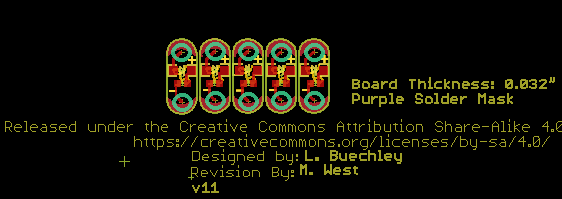
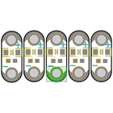
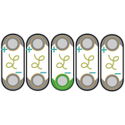
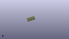
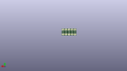
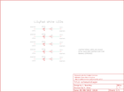
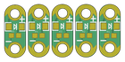
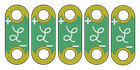

Contents
========

* [PRS14010 > LilyPad LED 5pcs](#prs14010--lilypad-led-5pcs)
	* [Schematic](#schematic)
	* [PCB](#pcb)
	* [Interactive BOM](#interactive-bom)
	* [OOMP Parts](#oomp-parts)
	* [Images](#images)
	* [Tags](#tags)
  
![][im]
# PRS14010 > LilyPad LED 5pcs

- ID: PROJ-SPAR-14010-STAN-01
- Hex ID: PRS14010
- Name: Sparkfun
- Description: Sparkfun
- Long Link: [http://oom.lt/PROJ-SPAR-14010-STAN-01](http://oom.lt/PROJ-SPAR-14010-STAN-01)
- Short Link: [http://oom.lt/PRS14010](http://oom.lt/PRS14010)

## Schematic
  

## PCB
  

## Interactive BOM

- Interactive BOM page: [ibom.html](https://htmlpreview.github.io/?https://github.com/oomlout/oomlout_OOMP_projects/blob/main/PROJ-SPAR-14010-STAN-01/kicad/bom/ibom.html)

## OOMP Parts
  

|OOMP Parts|
| :---: |
|LEDS-1206-G-STAN-01 D1, D2, D3, D4, D5|
|RESE-0603-X-O151-01 R1, R2, R3, R4, R5|

## Images
  
  

|bominteractivefront|bominteractiveback|kicadPcb3d|kicadPcb3dFront|kicadPcb3dBack|eagleImage|eagleSchemImage|pcbdraw|pcbdrawback|
| :---: | :---: | :---: | :---: | :---: | :---: | :---: | :---: | :---: |
||||||||||

## Tags

- hexID: PRS14010
- oompType: PROJ
- oompSize: SPAR
- oompColor: 14010
- oompDesc: STAN
- oompIndex: 01
- oompName: LilyPad LED 5pcs
- sources: All source files from https://github.com/sparkfun/LilyPad_LED_5pcs (source licence details in srcLicense.md)
- linkBuyPage: https://www.sparkfun.com/products/14010
- oompID: PROJ-SPAR-14010-STAN-01
- oompParts: D1,LEDS-1206-G-STAN-01
- oompParts: D2,LEDS-1206-G-STAN-01
- oompParts: D3,LEDS-1206-G-STAN-01
- oompParts: D4,LEDS-1206-G-STAN-01
- oompParts: D5,LEDS-1206-G-STAN-01
- oompParts: R1,RESE-0603-X-O151-01
- oompParts: R2,RESE-0603-X-O151-01
- oompParts: R3,RESE-0603-X-O151-01
- oompParts: R4,RESE-0603-X-O151-01
- oompParts: R5,RESE-0603-X-O151-01
- rawParts: D1,WHITE,LED-WHITE1206,LED-1206,White SMD LEDs,,DIO-09955,WHITE,
- rawParts: D2,WHITE,LED-WHITE1206,LED-1206,White SMD LEDs,,DIO-09955,WHITE,
- rawParts: D3,WHITE,LED-WHITE1206,LED-1206,White SMD LEDs,,DIO-09955,WHITE,
- rawParts: D4,WHITE,LED-WHITE1206,LED-1206,White SMD LEDs,,DIO-09955,WHITE,
- rawParts: D5,WHITE,LED-WHITE1206,LED-1206,White SMD LEDs,,DIO-09955,WHITE,
- rawParts: FRAME1,FRAME-LETTER,FRAME-LETTER,CREATIVE_COMMONS,Schematic Frame,,,,
- rawParts: LED+1,SEWTAP6,SEWTAP6,PETAL-SMALL-2SIDE,Sew Taps for LilyPad Boards.,,,,
- rawParts: LED+2,SEWTAP6,SEWTAP6,PETAL-SMALL-2SIDE,Sew Taps for LilyPad Boards.,,,,
- rawParts: LED+3,SEWTAP6,SEWTAP6,PETAL-SMALL-2SIDE,Sew Taps for LilyPad Boards.,,,,
- rawParts: LED+4,SEWTAP6,SEWTAP6,PETAL-SMALL-2SIDE,Sew Taps for LilyPad Boards.,,,,
- rawParts: LED+5,SEWTAP6,SEWTAP6,PETAL-SMALL-2SIDE,Sew Taps for LilyPad Boards.,,,,
- rawParts: LED-1,SEWTAP6,SEWTAP6,PETAL-SMALL-2SIDE,Sew Taps for LilyPad Boards.,,,,
- rawParts: LED-2,SEWTAP6,SEWTAP6,PETAL-SMALL-2SIDE,Sew Taps for LilyPad Boards.,,,,
- rawParts: LED-3,SEWTAP6,SEWTAP6,PETAL-SMALL-2SIDE,Sew Taps for LilyPad Boards.,,,,
- rawParts: LED-4,SEWTAP6,SEWTAP6,PETAL-SMALL-2SIDE,Sew Taps for LilyPad Boards.,,,,
- rawParts: LED-5,SEWTAP6,SEWTAP6,PETAL-SMALL-2SIDE,Sew Taps for LilyPad Boards.,,,,
- rawParts: R1,150,150OHM-1/10W-1%(0603),0603-RES,RES-11028,13326,,150,
- rawParts: R2,150,150OHM-1/10W-1%(0603),0603-RES,RES-11028,13326,,150,
- rawParts: R3,150,150OHM-1/10W-1%(0603),0603-RES,RES-11028,13326,,150,
- rawParts: R4,150,150OHM-1/10W-1%(0603),0603-RES,RES-11028,13326,,150,
- rawParts: R5,150,150OHM-1/10W-1%(0603),0603-RES,RES-11028,13326,,150,
- rawParts: U$6,REVISION,REVISION,REVISION,,,,,

[im]: kicadPcb3d_450.png
