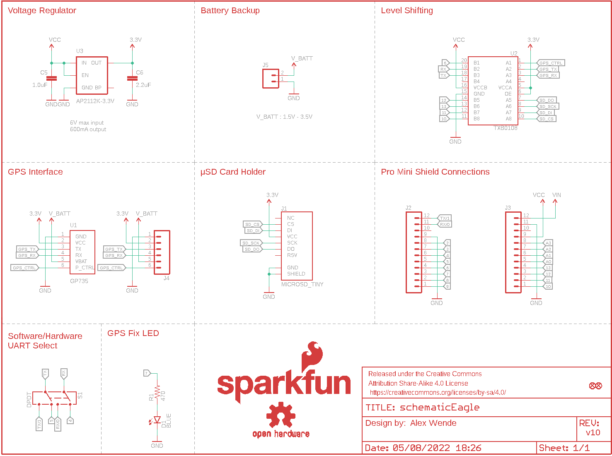
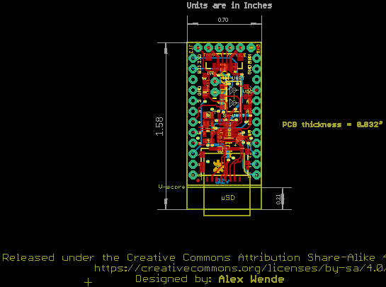
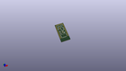
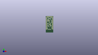
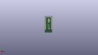
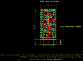
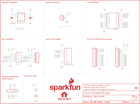

Contents
========

* [PRS14030 > Mini GPS Shield](#prs14030--mini-gps-shield)
	* [Schematic](#schematic)
	* [PCB](#pcb)
	* [Interactive BOM](#interactive-bom)
	* [OOMP Parts](#oomp-parts)
	* [Images](#images)
	* [Tags](#tags)
  
![][im]
# PRS14030 > Mini GPS Shield

- ID: PROJ-SPAR-14030-STAN-01
- Hex ID: PRS14030
- Name: Sparkfun
- Description: Sparkfun
- Long Link: [http://oom.lt/PROJ-SPAR-14030-STAN-01](http://oom.lt/PROJ-SPAR-14030-STAN-01)
- Short Link: [http://oom.lt/PRS14030](http://oom.lt/PRS14030)

## Schematic
  

## PCB
  

## Interactive BOM

- Interactive BOM page: [ibom.html](https://htmlpreview.github.io/?https://github.com/oomlout/oomlout_OOMP_projects/blob/main/PROJ-SPAR-14030-STAN-01/kicad/bom/ibom.html)

## OOMP Parts
  

|OOMP Parts|
| :---: |
|[CAPC-0805-X-UF1-V25  SMD (0805) 1 uF Capacitor (Ceramic) 25v  C5](https://github.com/oomlout/oomlout_OOMP_parts/tree/main/CAPC-0805-X-UF1-V25/)|
|[CAPC-0603-X-UF22D-V10  SMD (0603) 2.2 uF Capacitor (Ceramic) 10v  C6](https://github.com/oomlout/oomlout_OOMP_parts/tree/main/CAPC-0603-X-UF22D-V10/)|
|[LEDS-0603-L-STAN-01  SMD (0603) Blue LED  D1](https://github.com/oomlout/oomlout_OOMP_parts/tree/main/LEDS-0603-L-STAN-01/)|
|UNMATCHED-UNMATCHED-X-UNMATCHED-01 J1, S1, U1, U2|
|[HEAD-I01-X-PI12-01  2.54 mm 12 Pin Header  J2, J3](https://github.com/oomlout/oomlout_OOMP_parts/tree/main/HEAD-I01-X-PI12-01/)|
|[HEAD-I01-X-PI06-01  2.54 mm 6 Pin Header  J4](https://github.com/oomlout/oomlout_OOMP_parts/tree/main/HEAD-I01-X-PI06-01/)|
|[HEAD-I01-X-PI02-01  2.54 mm 2 Pin Header  J5](https://github.com/oomlout/oomlout_OOMP_parts/tree/main/HEAD-I01-X-PI02-01/)|
|[RESE-0603-X-O471-01  SMD (0603) 470 Ohm Resistor  R1](https://github.com/oomlout/oomlout_OOMP_parts/tree/main/RESE-0603-X-O471-01/)|
|VREG-SO235-X-KAP2112K-V33D U3|

## Images
  
  

|kicadPcb3d|kicadPcb3dFront|kicadPcb3dBack|eagleImage|eagleSchemImage|
| :---: | :---: | :---: | :---: | :---: |
||||||

## Tags

- hexID: PRS14030
- oompType: PROJ
- oompSize: SPAR
- oompColor: 14030
- oompDesc: STAN
- oompIndex: 01
- oompName: Mini GPS Shield
- sources: All source files from https://github.com/sparkfun/Mini_GPS_Shield (source licence details in srcLicense.md)
- linkBuyPage: https://www.sparkfun.com/products/14030
- oompID: PROJ-SPAR-14030-STAN-01
- oompParts: C5,CAPC-0805-X-UF1-V25
- oompParts: C6,CAPC-0603-X-UF22D-V10
- oompParts: D1,LEDS-0603-L-STAN-01
- oompParts: J1,UNMATCHED-UNMATCHED-X-UNMATCHED-01
- oompParts: J2,HEAD-I01-X-PI12-01
- oompParts: J3,HEAD-I01-X-PI12-01
- oompParts: J4,HEAD-I01-X-PI06-01
- oompParts: J5,HEAD-I01-X-PI02-01
- oompParts: R1,RESE-0603-X-O471-01
- oompParts: S1,UNMATCHED-UNMATCHED-X-UNMATCHED-01
- oompParts: U1,UNMATCHED-UNMATCHED-X-UNMATCHED-01
- oompParts: U2,UNMATCHED-UNMATCHED-X-UNMATCHED-01
- oompParts: U3,VREG-SO235-X-KAP2112K-V33D
- rawParts: C5,1.0uF,1.0UF-25V-+80/-20(0805),0805-CAP,CAP-11625,CAP-11625,1.0uF,
- rawParts: C6,2.2uF,2.2UF-10V-20%(0603),0603-CAP,CAP-07888,CAP-07888,2.2uF,
- rawParts: D1,BLUE,LED-BLUE0603,LED-0603,Blue LEDs for production use,DIO-08575,BLUE,
- rawParts: FD1,FIDUCIALUFIDUCIAL,FIDUCIALUFIDUCIAL,MICRO-FIDUCIAL,Fiducial Alignment Points,,,
- rawParts: FD2,FIDUCIALUFIDUCIAL,FIDUCIALUFIDUCIAL,MICRO-FIDUCIAL,Fiducial Alignment Points,,,
- rawParts: FRAME1,FRAME-LETTER,FRAME-LETTER,CREATIVE_COMMONS,Schematic Frame,,,
- rawParts: J1,MICROSD_TINY,MICROSD_TINY,MICROSD_TINY,,CONN-13500,,
- rawParts: J2,,M12NO_SILK,1X12_NO_SILK,Header 12,,,
- rawParts: J3,,M12NO_SILK,1X12_NO_SILK,Header 12,,,
- rawParts: J4,,M06NO_SILK_FEMALE_PTH,1X06_NO_SILK,Header 6,CONN-08437,,
- rawParts: J5,,M021X02_NO_SILK,1X02_NO_SILK,Standard 2-pin 0.1 header. Use with,,,
- rawParts: LOGO1,OSHW-LOGOS,OSHW-LOGOS,OSHW-LOGO-S,Open Source Hardware Logo,,,
- rawParts: LOGO3,SFE_LOGO_FLAME.1_INCH,SFE_LOGO_FLAME.1_INCH,SFE_LOGO_FLAME_.1,SFE Logo, flame only,,,
- rawParts: LOGO4,SFE_LOGO_NAME.1_INCH,SFE_LOGO_NAME.1_INCH,SFE_LOGO_NAME_.1,SFE Logo, name only,,,
- rawParts: R1,470,470OHM1/10W1%(0603),0603-RES,RES-07869,RES-07869,470,
- rawParts: S1,DPDT,SWITCH-DPDTAYZ0202,AYZ0202,DPDT Version of the COM-00597,SWCH-08179,DPDT,
- rawParts: U1,GP735,GP735,GP735,,CONN-08249,,
- rawParts: U2,TXB0108,TXB0108,UFDFN-20,8-Bit Bi-Directional Level Shifter,IC-12292,,
- rawParts: U3,AP2112K-3.3V,V_REG_LDOSMD,SOT23-5,Voltage Regulator LDO,VREG-12457,,

[im]: kicadPcb3d_450.png
