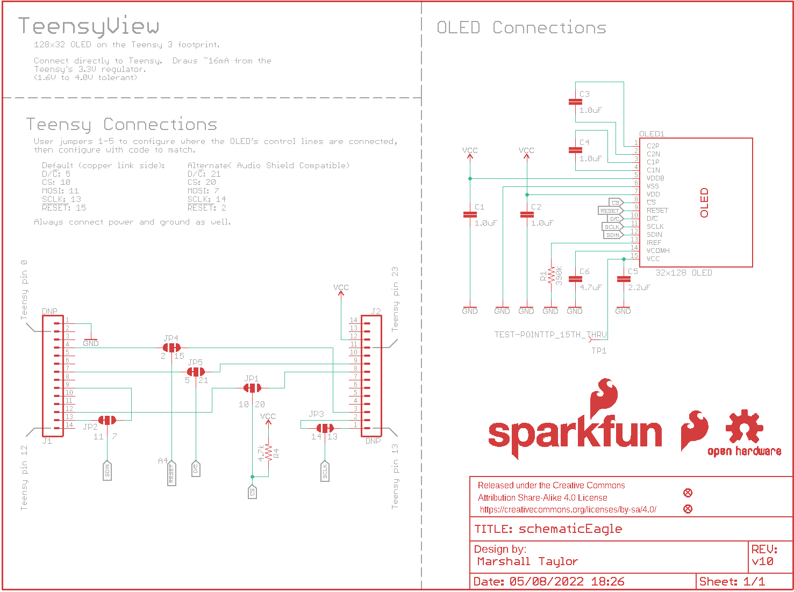
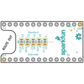
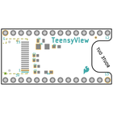
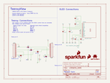
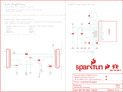
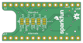
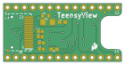

Contents
========

* [PRS14048 > TeensyView](#prs14048--teensyview)
	* [Schematic](#schematic)
	* [PCB](#pcb)
	* [Interactive BOM](#interactive-bom)
	* [OOMP Parts](#oomp-parts)
	* [Images](#images)
	* [Tags](#tags)
  
![][im]
# PRS14048 > TeensyView

- ID: PROJ-SPAR-14048-STAN-01
- Hex ID: PRS14048
- Name: Sparkfun
- Description: Sparkfun
- Long Link: [http://oom.lt/PROJ-SPAR-14048-STAN-01](http://oom.lt/PROJ-SPAR-14048-STAN-01)
- Short Link: [http://oom.lt/PRS14048](http://oom.lt/PRS14048)

## Schematic
  

## PCB
  

## Interactive BOM

- Interactive BOM page: [ibom.html](https://htmlpreview.github.io/?https://github.com/oomlout/oomlout_OOMP_projects/blob/main/PROJ-SPAR-14048-STAN-01/kicad/bom/ibom.html)

## OOMP Parts
  

|OOMP ID|Name|Identifier|
| :---: | :---: | :---: |
|CAPC-0402-X-UNMATCHED-01||C1, C2, C3, C4|
|[CAPC-0805-X-UF22D-V25](https://github.com/oomlout/oomlout_OOMP_parts/tree/main/CAPC-0805-X-UF22D-V25/)|[SMD (0805) 2.2 uF Capacitor (Ceramic) 25v](https://github.com/oomlout/oomlout_OOMP_parts/tree/main/CAPC-0805-X-UF22D-V25/)|[C5](https://github.com/oomlout/oomlout_OOMP_parts/tree/main/CAPC-0805-X-UF22D-V25/)|
|CAPC-1206-X-UF47D-01||C6|
|UNMATCHED-UNMATCHED-X-UNMATCHED-01||OLED1|
|RESE-0603-X-O3903-01||R1|
|[RESE-0603-X-O472-01](https://github.com/oomlout/oomlout_OOMP_parts/tree/main/RESE-0603-X-O472-01/)|[SMD (0603) 4.7k Ohm Resistor](https://github.com/oomlout/oomlout_OOMP_parts/tree/main/RESE-0603-X-O472-01/)|[R4](https://github.com/oomlout/oomlout_OOMP_parts/tree/main/RESE-0603-X-O472-01/)|

## Images
  
  

|bominteractivefront|bominteractiveback|kicadPcb3d|kicadPcb3dFront|kicadPcb3dBack|kicadSchem|eagleImage|eagleSchemImage|pcbdraw|pcbdrawback|
| :---: | :---: | :---: | :---: | :---: | :---: | :---: | :---: | :---: | :---: |
|||||||||||

## Tags

- hexID: PRS14048
- oompType: PROJ
- oompSize: SPAR
- oompColor: 14048
- oompDesc: STAN
- oompIndex: 01
- oompName: TeensyView
- sources: All source files from https://github.com/sparkfun/TeensyView (source licence details in srcLicense.md)
- linkBuyPage: https://www.sparkfun.com/products/14048
- oompID: PROJ-SPAR-14048-STAN-01
- oompParts: C1,CAPC-0402-X-UNMATCHED-01
- oompParts: C2,CAPC-0402-X-UNMATCHED-01
- oompParts: C3,CAPC-0402-X-UNMATCHED-01
- oompParts: C4,CAPC-0402-X-UNMATCHED-01
- oompParts: C5,CAPC-0805-X-UF22D-V25
- oompParts: C6,CAPC-1206-X-UF47D-01
- oompParts: OLED1,UNMATCHED-UNMATCHED-X-UNMATCHED-01
- oompParts: R1,RESE-0603-X-O3903-01
- oompParts: R4,RESE-0603-X-O472-01
- rawParts: C1,1.0uF,1.0UF-0402-16V-10%,0402,1µF ceramic capacitors,CAP-12417,1.0uF,
- rawParts: C2,1.0uF,1.0UF-0402-16V-10%,0402,1µF ceramic capacitors,CAP-12417,1.0uF,
- rawParts: C3,1.0uF,1.0UF-0402-16V-10%,0402,1µF ceramic capacitors,CAP-12417,1.0uF,
- rawParts: C4,1.0uF,1.0UF-0402-16V-10%,0402,1µF ceramic capacitors,CAP-12417,1.0uF,
- rawParts: C5,2.2uF,2.2UF-0805-25V-(+80/-20%),0805,2.2µF ceramic capacitors,CAP-11624,2.2uF,
- rawParts: C6,4.7uF,4.7UF-1206-16V-(+80/-20%),1206,4.7µF ceramic capacitors,CAP-10300,4.7uF,
- rawParts: FD1,FIDUCIALUFIDUCIAL,FIDUCIALUFIDUCIAL,FIDUCIAL-MICRO,Fiducial Alignment Points,,,
- rawParts: FD2,FIDUCIALUFIDUCIAL,FIDUCIALUFIDUCIAL,FIDUCIAL-MICRO,Fiducial Alignment Points,,,
- rawParts: FRAME1,FRAME-LETTER,FRAME-LETTER,CREATIVE_COMMONS,Schematic Frame - Letter,,,
- rawParts: J1,DNP,CONN_14NO_SILK,1X14_NO_SILK,Multi connection point. Often used as Generic Header-pin footprint for 0.1 inch spaced/style header connections,,,
- rawParts: J2,DNP,CONN_14NO_SILK,1X14_NO_SILK,Multi connection point. Often used as Generic Header-pin footprint for 0.1 inch spaced/style header connections,,,
- rawParts: JP1,JUMPER-SMT_3_1-NC_TRACE_SILK,JUMPER-SMT_3_1-NC_TRACE_SILK,SMT-JUMPER_3_1-NC_TRACE_SILK,Normally closed trace jumper (1 of 2 connections),,,
- rawParts: JP2,JUMPER-SMT_3_1-NC_TRACE_SILK,JUMPER-SMT_3_1-NC_TRACE_SILK,SMT-JUMPER_3_1-NC_TRACE_SILK,Normally closed trace jumper (1 of 2 connections),,,
- rawParts: JP3,JUMPER-SMT_3_1-NC_TRACE_SILK,JUMPER-SMT_3_1-NC_TRACE_SILK,SMT-JUMPER_3_1-NC_TRACE_SILK,Normally closed trace jumper (1 of 2 connections),,,
- rawParts: JP4,JUMPER-SMT_3_1-NC_TRACE_SILK,JUMPER-SMT_3_1-NC_TRACE_SILK,SMT-JUMPER_3_1-NC_TRACE_SILK,Normally closed trace jumper (1 of 2 connections),,,
- rawParts: JP5,JUMPER-SMT_3_1-NC_TRACE_SILK,JUMPER-SMT_3_1-NC_TRACE_SILK,SMT-JUMPER_3_1-NC_TRACE_SILK,Normally closed trace jumper (1 of 2 connections),,,
- rawParts: LOGO1,SFE_LOGO_FLAME.1_INCH,SFE_LOGO_FLAME.1_INCH,SFE_LOGO_FLAME_.1,SparkFun Flame Logo,,,
- rawParts: LOGO2,OSHW-LOGOS,OSHW-LOGOS,OSHW-LOGO-S,Open-Source Hardware (OSHW) Logo,,,
- rawParts: LOGO3,SFE_LOGO_NAME_FLAME.1_INCH,SFE_LOGO_NAME_FLAME.1_INCH,SFE_LOGO_NAME_FLAME_.1,SparkFun Font Logo w/ Flame,,,
- rawParts: OLED1,32x128 OLED,OLED128X64SIDEREAR-MOUNT,OLED-UG-2832TSWGG01-REAR,Micro OLED,LCD-13577,32x128 OLED,
- rawParts: R1,390k,390KOHM-0603-1/10W-1%,0603,390kΩ resistor,RES-12024,390k,
- rawParts: R4,4.7k,4.7KOHM-0603-1/10W-1%,0603,4.7kΩ resistor,RES-07857,4.7k,
- rawParts: TP1,TEST-POINTTP_15TH_THRU,TEST-POINTTP_15TH_THRU,TP_15TH,SparkFun Test Points,,,

[im]: kicadPcb3d_450.png
