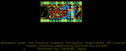
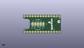
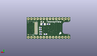
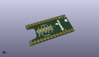

Contents
========

* [PROJ-SPAR-14048-STAN-01>TeensyView](#proj-spar-14048-stan-01teensyview)
	* [Images](#images)
	* [Interactive BOM](#interactive-bom)
	* [OOMP Parts](#oomp-parts)
	* [Tags](#tags)
  
![][im]
# PROJ-SPAR-14048-STAN-01>TeensyView

- ID: PROJ-SPAR-14048-STAN-01
- Hex ID: PRS14048
- Name: TeensyView
- Description: 

## Images
  
  

|eagleImage|kicadPcb3dFront|kicadPcb3dBack|kicadPcb3d|
| :---: | :---: | :---: | :---: |
|||||

## Interactive BOM

- Interactive BOM page: [ibom.html](kicad/bom/ibom.html)

## OOMP Parts
  

|OOMP Parts|
| :---: |
|CAPC-0402-X-UNMATCHED-01, C1, 24.447499999999998, 7.619999999999999, M0,C1, 1.0uF, 0402, SparkFun-Capacitors, (0.9625, 0.3), MR0|
|CAPC-0402-X-UNMATCHED-01, C2, 24.447499999999998, 9.2075, M0,C2, 1.0uF, 0402, SparkFun-Capacitors, (0.9625, 0.3625), MR0|
|CAPC-0402-X-UNMATCHED-01, C3, 24.13, 3.8099999999999996, M0,C3, 1.0uF, 0402, SparkFun-Capacitors, (0.95, 0.15), MR0|
|CAPC-0402-X-UNMATCHED-01, C4, 24.13, 5.715, M0,C4, 1.0uF, 0402, SparkFun-Capacitors, (0.95, 0.225), MR0|
|CAPC-0805-X-UF22D-01, C5, 22.86, 13.97, M0,C5, 2.2uF, 0805, SparkFun-Capacitors, (0.9, 0.55), MR0|
|CAPC-UNMATCHED-X-UNMATCHED-01, C6, 22.224999999999998, 12.065, M0,C6, 4.7uF, 1206, SparkFun-Capacitors, (0.875, 0.475), MR0|
|UNMATCHED-UNMATCHED-X-UNMATCHED-01, J1, 34.29, 16.509999999999998, 180,J1, DNP, 1X14_NO_SILK, SparkFun-Connectors, (1.35, 0.65), R180|
|UNMATCHED-UNMATCHED-X-UNMATCHED-01, J2, 1.27, 1.27, 0,J2, DNP, 1X14_NO_SILK, SparkFun-Connectors, (0.05, 0.05), R0|
|UNMATCHED-UNMATCHED-X-UNMATCHED-01, JP1, 13.97, 8.889999999999999, 90,JP1, JUMPER-SMT_3_1-NC_TRACE_SILK, SMT-JUMPER_3_1-NC_TRACE_SILK, SparkFun-Jumpers, (0.55, 0.35), R90|
|UNMATCHED-UNMATCHED-X-UNMATCHED-01, JP2, 11.43, 8.889999999999999, 90,JP2, JUMPER-SMT_3_1-NC_TRACE_SILK, SMT-JUMPER_3_1-NC_TRACE_SILK, SparkFun-Jumpers, (0.45, 0.35), R90|
|UNMATCHED-UNMATCHED-X-UNMATCHED-01, JP3, 8.889999999999999, 8.889999999999999, 90,JP3, JUMPER-SMT_3_1-NC_TRACE_SILK, SMT-JUMPER_3_1-NC_TRACE_SILK, SparkFun-Jumpers, (0.35, 0.35), R90|
|UNMATCHED-UNMATCHED-X-UNMATCHED-01, JP4, 16.509999999999998, 8.889999999999999, 90,JP4, JUMPER-SMT_3_1-NC_TRACE_SILK, SMT-JUMPER_3_1-NC_TRACE_SILK, SparkFun-Jumpers, (0.65, 0.35), R90|
|UNMATCHED-UNMATCHED-X-UNMATCHED-01, JP5, 19.049999999999997, 8.889999999999999, 90,JP5, JUMPER-SMT_3_1-NC_TRACE_SILK, SMT-JUMPER_3_1-NC_TRACE_SILK, SparkFun-Jumpers, (0.75, 0.35), R90|
|ERROR, OLED1 32x128 OLED, 0, 0, 0,OLED1, 32x128, OLED, OLED-UG-2832TSWGG01-REAR, TeensyViewDev, (1.07, 0.575), R0|
|RESE-0603-X-O394-01, R1, 17.779999999999998, 12.065, M0,R1, 390k, 0603, SparkFun-Resistors, (0.7, 0.475), MR0|
|RESE-0603-X-UNMATCHED-01, R4, 20.32, 3.8099999999999996, M180,R4, 4.7k, 0603, SparkFun-Resistors, (0.8, 0.15), MR180|

## Tags

- hexID: PRS14048
- oompType: PROJ
- oompSize: SPAR
- oompColor: 14048
- oompDesc: STAN
- oompIndex: 01
- oompName: TeensyView
- sources: All source files from https://github.com/sparkfun/TeensyView (source licence details in srcLicense.md)
- linkBuyPage: https://www.sparkfun.com/products/14048
- oompID: PROJ-SPAR-14048-STAN-01
- oompPart: CAPC-0402-X-UNMATCHED-01, C1, 24.447499999999998, 7.619999999999999, M0
- oompPart: CAPC-0402-X-UNMATCHED-01, C2, 24.447499999999998, 9.2075, M0
- oompPart: CAPC-0402-X-UNMATCHED-01, C3, 24.13, 3.8099999999999996, M0
- oompPart: CAPC-0402-X-UNMATCHED-01, C4, 24.13, 5.715, M0
- oompPart: CAPC-0805-X-UF22D-01, C5, 22.86, 13.97, M0
- oompPart: CAPC-UNMATCHED-X-UNMATCHED-01, C6, 22.224999999999998, 12.065, M0
- oompPart: SKIP-UNMATCHED-X-UNMATCHED-01, FD1, 34.29, 3.4131249999999995, M0
- oompPart: SKIP-UNMATCHED-X-UNMATCHED-01, FD2, 5.08, 15.001874999999998, M0
- oompPart: UNMATCHED-UNMATCHED-X-UNMATCHED-01, J1, 34.29, 16.509999999999998, 180
- oompPart: UNMATCHED-UNMATCHED-X-UNMATCHED-01, J2, 1.27, 1.27, 0
- oompPart: UNMATCHED-UNMATCHED-X-UNMATCHED-01, JP1, 13.97, 8.889999999999999, 90
- oompPart: UNMATCHED-UNMATCHED-X-UNMATCHED-01, JP2, 11.43, 8.889999999999999, 90
- oompPart: UNMATCHED-UNMATCHED-X-UNMATCHED-01, JP3, 8.889999999999999, 8.889999999999999, 90
- oompPart: UNMATCHED-UNMATCHED-X-UNMATCHED-01, JP4, 16.509999999999998, 8.889999999999999, 90
- oompPart: UNMATCHED-UNMATCHED-X-UNMATCHED-01, JP5, 19.049999999999997, 8.889999999999999, 90
- oompPart: ERROR, OLED1 32x128 OLED, 0, 0, 0
- oompPart: RESE-0603-X-O394-01, R1, 17.779999999999998, 12.065, M0
- oompPart: RESE-0603-X-UNMATCHED-01, R4, 20.32, 3.8099999999999996, M180
- oompPart: SKIP-UNMATCHED-X-UNMATCHED-01, TP1, 30.479999999999997, 13.97, M0
- rawPart: C1, 1.0uF, 0402, SparkFun-Capacitors, (0.9625, 0.3), MR0
- rawPart: C2, 1.0uF, 0402, SparkFun-Capacitors, (0.9625, 0.3625), MR0
- rawPart: C3, 1.0uF, 0402, SparkFun-Capacitors, (0.95, 0.15), MR0
- rawPart: C4, 1.0uF, 0402, SparkFun-Capacitors, (0.95, 0.225), MR0
- rawPart: C5, 2.2uF, 0805, SparkFun-Capacitors, (0.9, 0.55), MR0
- rawPart: C6, 4.7uF, 1206, SparkFun-Capacitors, (0.875, 0.475), MR0
- rawPart: FD1, FIDUCIALUFIDUCIAL, FIDUCIAL-MICRO, SparkFun-Aesthetics, (1.35, 0.134375), MR0
- rawPart: FD2, FIDUCIALUFIDUCIAL, FIDUCIAL-MICRO, SparkFun-Aesthetics, (0.2, 0.590625), MR0
- rawPart: J1, DNP, 1X14_NO_SILK, SparkFun-Connectors, (1.35, 0.65), R180
- rawPart: J2, DNP, 1X14_NO_SILK, SparkFun-Connectors, (0.05, 0.05), R0
- rawPart: JP1, JUMPER-SMT_3_1-NC_TRACE_SILK, SMT-JUMPER_3_1-NC_TRACE_SILK, SparkFun-Jumpers, (0.55, 0.35), R90
- rawPart: JP2, JUMPER-SMT_3_1-NC_TRACE_SILK, SMT-JUMPER_3_1-NC_TRACE_SILK, SparkFun-Jumpers, (0.45, 0.35), R90
- rawPart: JP3, JUMPER-SMT_3_1-NC_TRACE_SILK, SMT-JUMPER_3_1-NC_TRACE_SILK, SparkFun-Jumpers, (0.35, 0.35), R90
- rawPart: JP4, JUMPER-SMT_3_1-NC_TRACE_SILK, SMT-JUMPER_3_1-NC_TRACE_SILK, SparkFun-Jumpers, (0.65, 0.35), R90
- rawPart: JP5, JUMPER-SMT_3_1-NC_TRACE_SILK, SMT-JUMPER_3_1-NC_TRACE_SILK, SparkFun-Jumpers, (0.75, 0.35), R90
- rawPart: OLED1, 32x128, OLED, OLED-UG-2832TSWGG01-REAR, TeensyViewDev, (1.07, 0.575), R0
- rawPart: R1, 390k, 0603, SparkFun-Resistors, (0.7, 0.475), MR0
- rawPart: R4, 4.7k, 0603, SparkFun-Resistors, (0.8, 0.15), MR180
- rawPart: TP1, TEST-POINTTP_15TH_THRU, TP_15TH, SparkFun-Connectors, (1.2, 0.55), MR0

[im]: kicadPcb3d_450.png
