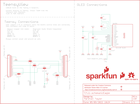

Contents
========

* [PRS14048 > Sparkfun](#prs14048--sparkfun)
	* [Schematic](#schematic)
	* [Interactive BOM](#interactive-bom)
	* [OOMP Parts](#oomp-parts)
	* [Images](#images)
	* [Tags](#tags)
  
![][im]
# PRS14048 > Sparkfun

- ID: PROJ-SPAR-14048-STAN-01
- Hex ID: PRS14048
- Name: Sparkfun
- Description: Sparkfun
- Long Link: [http://oom.lt/PROJ-SPAR-14048-STAN-01](http://oom.lt/PROJ-SPAR-14048-STAN-01)
- Short Link: [http://oom.lt/PRS14048](http://oom.lt/PRS14048)

## Schematic
  

## Interactive BOM

- Interactive BOM page: [ibom.html](https://htmlpreview.github.io/?https://github.com/oomlout/oomlout_OOMP_projects/blob/main/PROJ-SPAR-14048-STAN-01/kicad/bom/ibom.html)

## OOMP Parts
  

|OOMP Parts|
| :---: |
|C1,CAPC-0402-X-UNMATCHED-01,C1,1.0uF,1.0UF-0402-16V-10%,0402,1µF ceramic capacitors,CAP-12417,1.0uF,|
|C2,CAPC-0402-X-UNMATCHED-01,C2,1.0uF,1.0UF-0402-16V-10%,0402,1µF ceramic capacitors,CAP-12417,1.0uF,|
|C3,CAPC-0402-X-UNMATCHED-01,C3,1.0uF,1.0UF-0402-16V-10%,0402,1µF ceramic capacitors,CAP-12417,1.0uF,|
|C4,CAPC-0402-X-UNMATCHED-01,C4,1.0uF,1.0UF-0402-16V-10%,0402,1µF ceramic capacitors,CAP-12417,1.0uF,|
|C5,CAPC-0805-X-UNMATCHED-01,C5,2.2uF,2.2UF-0805-25V-(+80/-20%),0805,2.2µF ceramic capacitors,CAP-11624,2.2uF,|
|C6,CAPC-1206-X-UNMATCHED-01,C6,4.7uF,4.7UF-1206-16V-(+80/-20%),1206,4.7µF ceramic capacitors,CAP-10300,4.7uF,|
|JP1,UNMATCHED-UNMATCHED-X-UNMATCHED-01,FD1,FIDUCIALUFIDUCIAL,FIDUCIALUFIDUCIAL,FIDUCIAL-MICRO,Fiducial Alignment Points,,,|
|JP2,UNMATCHED-UNMATCHED-X-UNMATCHED-01,FD2,FIDUCIALUFIDUCIAL,FIDUCIALUFIDUCIAL,FIDUCIAL-MICRO,Fiducial Alignment Points,,,|
|JP3,UNMATCHED-UNMATCHED-X-UNMATCHED-01,FRAME1,FRAME-LETTER,FRAME-LETTER,CREATIVE_COMMONS,Schematic Frame - Letter,,,|
|JP4,UNMATCHED-UNMATCHED-X-UNMATCHED-01,J1,DNP,CONN_14NO_SILK,1X14_NO_SILK,Multi connection point. Often used as Generic Header-pin footprint for 0.1 inch spaced/style header connections,,,|
|JP5,UNMATCHED-UNMATCHED-X-UNMATCHED-01,J2,DNP,CONN_14NO_SILK,1X14_NO_SILK,Multi connection point. Often used as Generic Header-pin footprint for 0.1 inch spaced/style header connections,,,|
|OLED1,UNMATCHED-UNMATCHED-X-UNMATCHED-01,JP1,JUMPER-SMT_3_1-NC_TRACE_SILK,JUMPER-SMT_3_1-NC_TRACE_SILK,SMT-JUMPER_3_1-NC_TRACE_SILK,Normally closed trace jumper (1 of 2 connections),,,|
|R1,RESE-0603-X-O3903-01,JP2,JUMPER-SMT_3_1-NC_TRACE_SILK,JUMPER-SMT_3_1-NC_TRACE_SILK,SMT-JUMPER_3_1-NC_TRACE_SILK,Normally closed trace jumper (1 of 2 connections),,,|
|R4,RESE-0603-X-UNMATCHED-01,JP3,JUMPER-SMT_3_1-NC_TRACE_SILK,JUMPER-SMT_3_1-NC_TRACE_SILK,SMT-JUMPER_3_1-NC_TRACE_SILK,Normally closed trace jumper (1 of 2 connections),,,|
|TP1,UNMATCHED-UNMATCHED-X-UNMATCHED-01,JP4,JUMPER-SMT_3_1-NC_TRACE_SILK,JUMPER-SMT_3_1-NC_TRACE_SILK,SMT-JUMPER_3_1-NC_TRACE_SILK,Normally closed trace jumper (1 of 2 connections),,,|

## Images
  
  

|kicadPcb3d|kicadPcb3dFront|kicadPcb3dBack|eagleImage|eagleSchemImage|
| :---: | :---: | :---: | :---: | :---: |
||||||

## Tags

- hexID: PRS14048
- oompType: PROJ
- oompSize: SPAR
- oompColor: 14048
- oompDesc: STAN
- oompIndex: 01
- oompName: TeensyView
- sources: All source files from https://github.com/sparkfun/TeensyView (source licence details in srcLicense.md)
- linkBuyPage: https://www.sparkfun.com/products/14048
- oompID: PROJ-SPAR-14048-STAN-01
- oompParts: C1,CAPC-0402-X-UNMATCHED-01
- oompParts: C2,CAPC-0402-X-UNMATCHED-01
- oompParts: C3,CAPC-0402-X-UNMATCHED-01
- oompParts: C4,CAPC-0402-X-UNMATCHED-01
- oompParts: C5,CAPC-0805-X-UNMATCHED-01
- oompParts: C6,CAPC-1206-X-UNMATCHED-01
- oompParts: JP1,UNMATCHED-UNMATCHED-X-UNMATCHED-01
- oompParts: JP2,UNMATCHED-UNMATCHED-X-UNMATCHED-01
- oompParts: JP3,UNMATCHED-UNMATCHED-X-UNMATCHED-01
- oompParts: JP4,UNMATCHED-UNMATCHED-X-UNMATCHED-01
- oompParts: JP5,UNMATCHED-UNMATCHED-X-UNMATCHED-01
- oompParts: OLED1,UNMATCHED-UNMATCHED-X-UNMATCHED-01
- oompParts: R1,RESE-0603-X-O3903-01
- oompParts: R4,RESE-0603-X-UNMATCHED-01
- oompParts: TP1,UNMATCHED-UNMATCHED-X-UNMATCHED-01
- rawParts: C1,1.0uF,1.0UF-0402-16V-10%,0402,1µF ceramic capacitors,CAP-12417,1.0uF,
- rawParts: C2,1.0uF,1.0UF-0402-16V-10%,0402,1µF ceramic capacitors,CAP-12417,1.0uF,
- rawParts: C3,1.0uF,1.0UF-0402-16V-10%,0402,1µF ceramic capacitors,CAP-12417,1.0uF,
- rawParts: C4,1.0uF,1.0UF-0402-16V-10%,0402,1µF ceramic capacitors,CAP-12417,1.0uF,
- rawParts: C5,2.2uF,2.2UF-0805-25V-(+80/-20%),0805,2.2µF ceramic capacitors,CAP-11624,2.2uF,
- rawParts: C6,4.7uF,4.7UF-1206-16V-(+80/-20%),1206,4.7µF ceramic capacitors,CAP-10300,4.7uF,
- rawParts: FD1,FIDUCIALUFIDUCIAL,FIDUCIALUFIDUCIAL,FIDUCIAL-MICRO,Fiducial Alignment Points,,,
- rawParts: FD2,FIDUCIALUFIDUCIAL,FIDUCIALUFIDUCIAL,FIDUCIAL-MICRO,Fiducial Alignment Points,,,
- rawParts: FRAME1,FRAME-LETTER,FRAME-LETTER,CREATIVE_COMMONS,Schematic Frame - Letter,,,
- rawParts: J1,DNP,CONN_14NO_SILK,1X14_NO_SILK,Multi connection point. Often used as Generic Header-pin footprint for 0.1 inch spaced/style header connections,,,
- rawParts: J2,DNP,CONN_14NO_SILK,1X14_NO_SILK,Multi connection point. Often used as Generic Header-pin footprint for 0.1 inch spaced/style header connections,,,
- rawParts: JP1,JUMPER-SMT_3_1-NC_TRACE_SILK,JUMPER-SMT_3_1-NC_TRACE_SILK,SMT-JUMPER_3_1-NC_TRACE_SILK,Normally closed trace jumper (1 of 2 connections),,,
- rawParts: JP2,JUMPER-SMT_3_1-NC_TRACE_SILK,JUMPER-SMT_3_1-NC_TRACE_SILK,SMT-JUMPER_3_1-NC_TRACE_SILK,Normally closed trace jumper (1 of 2 connections),,,
- rawParts: JP3,JUMPER-SMT_3_1-NC_TRACE_SILK,JUMPER-SMT_3_1-NC_TRACE_SILK,SMT-JUMPER_3_1-NC_TRACE_SILK,Normally closed trace jumper (1 of 2 connections),,,
- rawParts: JP4,JUMPER-SMT_3_1-NC_TRACE_SILK,JUMPER-SMT_3_1-NC_TRACE_SILK,SMT-JUMPER_3_1-NC_TRACE_SILK,Normally closed trace jumper (1 of 2 connections),,,
- rawParts: JP5,JUMPER-SMT_3_1-NC_TRACE_SILK,JUMPER-SMT_3_1-NC_TRACE_SILK,SMT-JUMPER_3_1-NC_TRACE_SILK,Normally closed trace jumper (1 of 2 connections),,,
- rawParts: LOGO1,SFE_LOGO_FLAME.1_INCH,SFE_LOGO_FLAME.1_INCH,SFE_LOGO_FLAME_.1,SparkFun Flame Logo,,,
- rawParts: LOGO2,OSHW-LOGOS,OSHW-LOGOS,OSHW-LOGO-S,Open-Source Hardware (OSHW) Logo,,,
- rawParts: LOGO3,SFE_LOGO_NAME_FLAME.1_INCH,SFE_LOGO_NAME_FLAME.1_INCH,SFE_LOGO_NAME_FLAME_.1,SparkFun Font Logo w/ Flame,,,
- rawParts: OLED1,32x128 OLED,OLED128X64SIDEREAR-MOUNT,OLED-UG-2832TSWGG01-REAR,Micro OLED,LCD-13577,32x128 OLED,
- rawParts: R1,390k,390KOHM-0603-1/10W-1%,0603,390kΩ resistor,RES-12024,390k,
- rawParts: R4,4.7k,4.7KOHM-0603-1/10W-1%,0603,4.7kΩ resistor,RES-07857,4.7k,
- rawParts: TP1,TEST-POINTTP_15TH_THRU,TEST-POINTTP_15TH_THRU,TP_15TH,SparkFun Test Points,,,

[im]: kicadPcb3d_450.png
