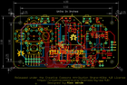
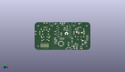
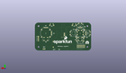
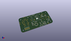

Contents
========

* [PROJ-SPAR-14051-STAN-01>Wireless Joystick](#proj-spar-14051-stan-01wireless-joystick)
	* [Images](#images)
	* [Interactive BOM](#interactive-bom)
	* [OOMP Parts](#oomp-parts)
	* [Tags](#tags)
  
![][im]
# PROJ-SPAR-14051-STAN-01>Wireless Joystick

- ID: PROJ-SPAR-14051-STAN-01
- Hex ID: PRS14051
- Name: Wireless Joystick
- Description: 

## Images
  
  

|eagleImage|kicadPcb3dFront|kicadPcb3dBack|kicadPcb3d|
| :---: | :---: | :---: | :---: |
|||||

## Interactive BOM

- Interactive BOM page: [ibom.html](kicad/bom/ibom.html)

## OOMP Parts
  

|OOMP Parts|
| :---: |
|CAPE-0805-X-UNMATCHED-01, C1, 61.6458, 7.238999999999999, 0,C1, 1.0uF, 0805-CAP, SparkFun-Capacitors, (2.427, 0.285), R0|
|CAPE-0603-X-UF22D-01, C2, 61.59499999999999, 13.589, 0,C2, 2.2uF, 0603-CAP, SparkFun-Capacitors, (2.425, 0.535), R0|
|CAPE-0603-X-UNMATCHED-01, C3, 74.93, 10.033, 0,C3, 4.7uF, 0603-CAP, SparkFun-Capacitors, (2.95, 0.395), R0|
|CAPE-0603-X-UNMATCHED-01, C4, 90.04299999999999, 30.733999999999998, 0,C4, 1.0uF, 0603-CAP, SparkFun-Capacitors, (3.545, 1.21), R0|
|CAPE-0603-X-UNMATCHED-01, C5, 90.04299999999999, 32.766, 0,C5, 10nF, 0603-CAP, SparkFun-Capacitors, (3.545, 1.29), R0|
|CAPE-0603-X-UNMATCHED-01, C6, 78.48599999999999, 10.033, 180,C6, 10uF, 0603-CAP, SparkFun-Capacitors, (3.09, 0.395), R180|
|CAPE-0603-X-NF100-01, C7, 37.465, 13.462, 180,C7, 0.1uF, 0603-CAP, SparkFun-Capacitors, (1.475, 0.53), R180|
|CAPE-0603-X-NF100-01, C8, 46.608999999999995, 20.32, 90,C8, 0.1uF, 0603-CAP, SparkFun-Capacitors, (1.835, 0.8), R90|
|CAPE-0603-X-UNMATCHED-01, C9, 37.465, 18.034, 0,C9, 15pF, 0603-CAP, SparkFun-Capacitors, (1.475, 0.71), R0|
|CAPE-0603-X-UNMATCHED-01, C10, 37.465, 15.493999999999998, 0,C10, 15pF, 0603-CAP, SparkFun-Capacitors, (1.475, 0.61), R0|
|CAPE-0603-X-NF100-01, C11, 48.641, 20.32, 90,C11, 0.1uF, 0603-CAP, SparkFun-Capacitors, (1.915, 0.8), R90|
|CAPE-0603-X-NF100-01, C12, 53.213, 20.32, 90,C12, 0.1uF, 0603-CAP, SparkFun-Capacitors, (2.095, 0.8), R90|
|UNMATCHED-0603-X-UNMATCHED-01, D1, 81.026, 48.894999999999996, 90,D1, RED, LED-0603, SparkFun-LED, (3.19, 1.925), R90|
|UNMATCHED-0603-X-UNMATCHED-01, D2, 76.708, 2.413, 270,D2, BLUE, LED-0603, SparkFun-LED, (3.02, 0.095), R270|
|UNMATCHED-0603-X-UNMATCHED-01, D3, 68.326, 21.59, 270,D3, GREEN, LED-0603, SparkFun-LED, (2.69, 0.85), R270|
|UNMATCHED-0603-X-UNMATCHED-01, D4, 37.465, 21.59, 90,D4, Yellow, LED-0603, SparkFun-LED, (1.475, 0.85), R90|
|UNMATCHED-0603-X-UNMATCHED-01, D5, 38.099999999999994, 48.894999999999996, 90,D5, RED, LED-0603, SparkFun-LED, (1.5, 1.925), R90|
|UNMATCHED-UNMATCHED-X-UNMATCHED-01, D6, 74.93, 11.811, 0,D6, 1A/23V/620mV, SOD-323, SparkFun-DiscreteSemi, (2.95, 0.465), R0|
|UNMATCHED-UNMATCHED-X-UNMATCHED-01, F1, 59.181999999999995, 42.799, 270,F1, 500mA, PTC-1206, SparkFun-PowerIC, (2.33, 1.685), R270|
|UNMATCHED-UNMATCHED-X-UNMATCHED-01, FD1, 5.08, 2.54, 0,FD1, FIDUCIALUFIDUCIAL, MICRO-FIDUCIAL, SparkFun-Aesthetics, (0.2, 0.1), R0|
|UNMATCHED-UNMATCHED-X-UNMATCHED-01, FD2, 99.05999999999999, 46.99, 0,FD2, FIDUCIALUFIDUCIAL, MICRO-FIDUCIAL, SparkFun-Aesthetics, (3.9, 1.85), R0|
|UNMATCHED-UNMATCHED-X-UNMATCHED-01, J1, 50.8, 48.767999999999994, 270,J1, USB-AB-MICRO-SMD_V03, SparkFun-Connectors, (2, 1.92), R270|
|UNMATCHED-UNMATCHED-X-UNMATCHED-01, J2, 11.937999999999999, 8.889999999999999, 0,J2, 1X06_NO_SILK, SparkFun-Connectors, (0.47, 0.35), R0|
|UNMATCHED-UNMATCHED-X-UNMATCHED-01, J3, 11.937999999999999, 6.35, 0,J3, 1X06_NO_SILK, SparkFun-Connectors, (0.47, 0.25), R0|
|UNMATCHED-UNMATCHED-X-UNMATCHED-01, J4, 95.25, 25.4, 270,J4, 1X04_NO_SILK, SparkFun-Connectors, (3.75, 1), R270|
|UNMATCHED-UNMATCHED-X-UNMATCHED-01, J5, 89.154, 13.462, 90,J5, JST-2-SMD, SparkFun-Connectors, (3.51, 0.53), R90|
|UNMATCHED-UNMATCHED-X-UNMATCHED-01, J6, 86.36, 2.54, 180,J6, 1X02_NO_SILK, SparkFun-Connectors, (3.4, 0.1), R180|
|UNMATCHED-UNMATCHED-X-UNMATCHED-01, J7, 48.26, 29.209999999999997, M90,J7, CORTEX_DEBUGPTH, 2X5-PTH-1.27MM, SparkFun-Connectors, (1.9, 1.15), MR90|
|UNMATCHED-UNMATCHED-X-UNMATCHED-01, JP1, 71.62799999999999, 6.223, 270,JP1, PAD-JUMPER-3-2OF3_NC_BY_PASTE_YES_SILK_FULL_BOX, SparkFun-Passives, (2.82, 0.245), R270|
|UNMATCHED-UNMATCHED-X-UNMATCHED-01, JP2, 76.327, 32.892999999999994, 180,JP2, PAD-JUMPER-3-NC_BY_PASTE_YES_SILK_FULL_BOX, SparkFun-Passives, (3.005, 1.295), R180|
|ERROR, L1 FB -, 0, 0, 0,L1, FB, -, 30, Ohm, 0603, SparkFun-Passives, (1.475, 0.45), R0|
|UNMATCHED-UNMATCHED-X-UNMATCHED-01, Q1, 59.181999999999995, 37.846, 0,Q1, 2.5A/30V, SOT23-3@1, SparkFun-DiscreteSemi, (2.33, 1.49), R0|
|<table><tr><td></td><td> R1</td><td>[RESE-0603-X-O104-01 SMD (0603) 100k Ohm Resistor](https://github.com/oomlout/oomlout_OOMP_parts/tree/main/RESE-0603-X-O104-01/)</td><td>[R6104](https://github.com/oomlout/oomlout_OOMP_parts/tree/main/RESE-0603-X-O104-01/)</td></tr></table>|
|<table><tr><td></td><td> R2</td><td>[RESE-0603-X-O331-01 SMD (0603) 330 Ohm Resistor](https://github.com/oomlout/oomlout_OOMP_parts/tree/main/RESE-0603-X-O331-01/)</td><td>[R6331](https://github.com/oomlout/oomlout_OOMP_parts/tree/main/RESE-0603-X-O331-01/)</td></tr></table>|
|<table><tr><td></td><td> R3</td><td>[RESE-0603-X-O473-01 SMD (0603) 47k Ohm Resistor](https://github.com/oomlout/oomlout_OOMP_parts/tree/main/RESE-0603-X-O473-01/)</td><td>[R6473](https://github.com/oomlout/oomlout_OOMP_parts/tree/main/RESE-0603-X-O473-01/)</td></tr></table>|
|RESE-0603-X-UNMATCHED-01, R4, 81.026, 47.370999999999995, 180,R4, 470, 0603-RES, SparkFun-Resistors, (3.19, 1.865), R180|
|RESE-0603-X-UNMATCHED-01, R5, 90.04299999999999, 28.955999999999996, 180,R5, 1K, 0603-RES, SparkFun-Resistors, (3.545, 1.14), R180|
|RESE-0603-X-UNMATCHED-01, R6, 76.708, 4.3180000000000005, 180,R6, 470, 0603-RES, SparkFun-Resistors, (3.02, 0.17), R180|
|RESE-0603-X-UNMATCHED-01, R7, 90.04299999999999, 34.544000000000004, 0,R7, 180, 0603-RES, SparkFun-Resistors, (3.545, 1.36), R0|
|RESE-0603-X-UNMATCHED-01, R8, 72.4916, 2.413, 180,R8, 2.0k, 0603-RES, SparkFun-Resistors, (2.854, 0.095), R180|
|RESE-UNMATCHED-X-UNMATCHED-01, R9, 68.3768, 11.049, 270,R9, R_PROG, AXIAL-0.4, SparkFun-Resistors, (2.692, 0.435), R270|
|RESE-0603-X-UNMATCHED-01, R10, 80.264, 29.845, 0,R10, 4.7K, 0603-RES, SparkFun-Resistors, (3.16, 1.175), R0|
|RESE-0603-X-UNMATCHED-01, R11, 80.264, 31.305499999999995, 0,R11, 4.7K, 0603-RES, SparkFun-Resistors, (3.16, 1.2325), R0|
|RESE-0603-X-UNMATCHED-01, R12, 80.264, 32.766, 0,R12, 4.7K, 0603-RES, SparkFun-Resistors, (3.16, 1.29), R0|
|<table><tr><td></td><td> R13</td><td>[RESE-0603-X-O103-01 SMD (0603) 10k Ohm Resistor](https://github.com/oomlout/oomlout_OOMP_parts/tree/main/RESE-0603-X-O103-01/)</td><td>[R6103](https://github.com/oomlout/oomlout_OOMP_parts/tree/main/RESE-0603-X-O103-01/)</td></tr></table>|
|<table><tr><td></td><td> R14</td><td>[RESE-0603-X-O331-01 SMD (0603) 330 Ohm Resistor](https://github.com/oomlout/oomlout_OOMP_parts/tree/main/RESE-0603-X-O331-01/)</td><td>[R6331](https://github.com/oomlout/oomlout_OOMP_parts/tree/main/RESE-0603-X-O331-01/)</td></tr></table>|
|<table><tr><td></td><td> R15</td><td>[RESE-0603-X-O331-01 SMD (0603) 330 Ohm Resistor](https://github.com/oomlout/oomlout_OOMP_parts/tree/main/RESE-0603-X-O331-01/)</td><td>[R6331](https://github.com/oomlout/oomlout_OOMP_parts/tree/main/RESE-0603-X-O331-01/)</td></tr></table>|
|RESE-0603-X-UNMATCHED-01, R16, 38.099999999999994, 47.1551, 180,R16, 470, 0603-RES, SparkFun-Resistors, (1.5, 1.8565), R180|
|UNMATCHED-UNMATCHED-X-UNMATCHED-01, S1, 19.685, 42.925999999999995, M270,S1, TACTILE-PTH-12MM, SparkFun-Electromechanical, (0.775, 1.69), MR270|
|UNMATCHED-UNMATCHED-X-UNMATCHED-01, S2, 19.685, 19.558, M180,S2, TACTILE-PTH-12MM, SparkFun-Electromechanical, (0.775, 0.77), MR180|
|UNMATCHED-UNMATCHED-X-UNMATCHED-01, S3, 8.001, 31.241999999999997, M180,S3, TACTILE-PTH-12MM, SparkFun-Electromechanical, (0.315, 1.23), MR180|
|UNMATCHED-UNMATCHED-X-UNMATCHED-01, S4, 31.369, 31.241999999999997, M0,S4, TACTILE-PTH-12MM, SparkFun-Electromechanical, (1.235, 1.23), MR0|
|UNMATCHED-UNMATCHED-X-UNMATCHED-01, S5, 71.11999999999999, 48.26, 180,S5, TACTILE-PTH-SIDEEZ, SparkFun-Electromechanical, (2.8, 1.9), R180|
|UNMATCHED-UNMATCHED-X-UNMATCHED-01, S6, 30.479999999999997, 48.26, 180,S6, TACTILE-PTH-SIDEEZ, SparkFun-Electromechanical, (1.2, 1.9), R180|
|UNMATCHED-UNMATCHED-X-UNMATCHED-01, S7, 62.0395, 2.032, 0,S7, KPS-1290, SparkFun-Electromechanical, (2.4425, 0.08), R0|
|UNMATCHED-UNMATCHED-X-UNMATCHED-01, S8, 77.34299999999999, 37.592, 270,S8, TACTILE_SWITCH_SMD_4.6X2.8MM, SparkFun-Switches, (3.045, 1.48), R270|
|UNMATCHED-UNMATCHED-X-UNMATCHED-01, TP1, 40.64, 12.7, 0,TP1, PAD.03X.03, SparkFun-Passives, (1.6, 0.5), R0|
|UNMATCHED-UNMATCHED-X-UNMATCHED-01, TP2, 48.26, 24.13, M0,TP2, PAD.03X.03, SparkFun-Passives, (1.9, 0.95), MR0|
|UNMATCHED-UNMATCHED-X-UNMATCHED-01, TP3, 50.8, 24.13, M0,TP3, PAD.03X.03, SparkFun-Passives, (2, 0.95), MR0|
|UNMATCHED-UNMATCHED-X-UNMATCHED-01, TP4, 53.339999999999996, 24.13, M0,TP4, PAD.03X.03, SparkFun-Passives, (2.1, 0.95), MR0|
|UNMATCHED-UNMATCHED-X-UNMATCHED-01, U1, 81.91499999999999, 31.241999999999997, M180,U1, JOYSTICKPTH, JOYSTICK, SparkFun-Electromechanical, (3.225, 1.23), MR180|
|UNMATCHED-UNMATCHED-X-UNMATCHED-01, U2, 19.685, 31.241999999999997, M180,U2, JOYSTICKPTH, JOYSTICK, SparkFun-Electromechanical, (0.775, 1.23), MR180|
|UNMATCHED-UNMATCHED-X-UNMATCHED-01, U3, 54.991, 36.83, 270,U3, 74AHC1G125, SOT23-5, SparkFun-DigitalIC, (2.165, 1.45), R270|
|UNMATCHED-UNMATCHED-X-UNMATCHED-01, U4, 61.69659999999999, 10.668, 0,U4, AP2112K-3.3V, SOT23-5, SparkFun-PowerIC, (2.429, 0.42), R0|
|UNMATCHED-UNMATCHED-X-UNMATCHED-01, U5, 53.339999999999996, 22.86, 0,U5, XBEE-2B3, XBEE-SMD, SparkFun-RF, (2.1, 0.9), R0|
|UNMATCHED-UNMATCHED-X-UNMATCHED-01, U6, 86.106, 31.75, 180,U6, MAX1704X, TDFN-8, SparkFun-PowerIC, (3.39, 1.25), R180|
|UNMATCHED-UNMATCHED-X-UNMATCHED-01, U7, 76.708, 6.858, 90,U7, MCP73831, SOT23-5, SparkFun-PowerIC, (3.02, 0.27), R90|
|UNMATCHED-UNMATCHED-X-UNMATCHED-01, U8, 48.132999999999996, 11.302999999999999, 0,U8, ATSAMD21G-A, TQFP-48, SparkFun-DigitalIC, (1.895, 0.445), R0|
|UNMATCHED-UNMATCHED-X-UNMATCHED-01, Y1, 40.259, 16.764, 90,Y1, 32.768kHz, CRYSTAL-SMD-3.2X1.5MM, SparkFun-FreqCtrl, (1.585, 0.66), R90|

## Tags

- hexID: PRS14051
- oompType: PROJ
- oompSize: SPAR
- oompColor: 14051
- oompDesc: STAN
- oompIndex: 01
- oompName: Wireless Joystick
- sources: All source files from https://github.com/sparkfun/Wireless_Joystick (source licence details in srcLicense.md)
- linkBuyPage: https://www.sparkfun.com/products/14051
- oompPart: CAPE-0805-X-UNMATCHED-01, C1, 61.6458, 7.238999999999999, 0
- oompPart: CAPE-0603-X-UF22D-01, C2, 61.59499999999999, 13.589, 0
- oompPart: CAPE-0603-X-UNMATCHED-01, C3, 74.93, 10.033, 0
- oompPart: CAPE-0603-X-UNMATCHED-01, C4, 90.04299999999999, 30.733999999999998, 0
- oompPart: CAPE-0603-X-UNMATCHED-01, C5, 90.04299999999999, 32.766, 0
- oompPart: CAPE-0603-X-UNMATCHED-01, C6, 78.48599999999999, 10.033, 180
- oompPart: CAPE-0603-X-NF100-01, C7, 37.465, 13.462, 180
- oompPart: CAPE-0603-X-NF100-01, C8, 46.608999999999995, 20.32, 90
- oompPart: CAPE-0603-X-UNMATCHED-01, C9, 37.465, 18.034, 0
- oompPart: CAPE-0603-X-UNMATCHED-01, C10, 37.465, 15.493999999999998, 0
- oompPart: CAPE-0603-X-NF100-01, C11, 48.641, 20.32, 90
- oompPart: CAPE-0603-X-NF100-01, C12, 53.213, 20.32, 90
- oompPart: UNMATCHED-0603-X-UNMATCHED-01, D1, 81.026, 48.894999999999996, 90
- oompPart: UNMATCHED-0603-X-UNMATCHED-01, D2, 76.708, 2.413, 270
- oompPart: UNMATCHED-0603-X-UNMATCHED-01, D3, 68.326, 21.59, 270
- oompPart: UNMATCHED-0603-X-UNMATCHED-01, D4, 37.465, 21.59, 90
- oompPart: UNMATCHED-0603-X-UNMATCHED-01, D5, 38.099999999999994, 48.894999999999996, 90
- oompPart: UNMATCHED-UNMATCHED-X-UNMATCHED-01, D6, 74.93, 11.811, 0
- oompPart: UNMATCHED-UNMATCHED-X-UNMATCHED-01, F1, 59.181999999999995, 42.799, 270
- oompPart: UNMATCHED-UNMATCHED-X-UNMATCHED-01, FD1, 5.08, 2.54, 0
- oompPart: UNMATCHED-UNMATCHED-X-UNMATCHED-01, FD2, 99.05999999999999, 46.99, 0
- oompPart: UNMATCHED-UNMATCHED-X-UNMATCHED-01, J1, 50.8, 48.767999999999994, 270
- oompPart: UNMATCHED-UNMATCHED-X-UNMATCHED-01, J2, 11.937999999999999, 8.889999999999999, 0
- oompPart: UNMATCHED-UNMATCHED-X-UNMATCHED-01, J3, 11.937999999999999, 6.35, 0
- oompPart: UNMATCHED-UNMATCHED-X-UNMATCHED-01, J4, 95.25, 25.4, 270
- oompPart: UNMATCHED-UNMATCHED-X-UNMATCHED-01, J5, 89.154, 13.462, 90
- oompPart: UNMATCHED-UNMATCHED-X-UNMATCHED-01, J6, 86.36, 2.54, 180
- oompPart: UNMATCHED-UNMATCHED-X-UNMATCHED-01, J7, 48.26, 29.209999999999997, M90
- oompPart: UNMATCHED-UNMATCHED-X-UNMATCHED-01, JP1, 71.62799999999999, 6.223, 270
- oompPart: UNMATCHED-UNMATCHED-X-UNMATCHED-01, JP2, 76.327, 32.892999999999994, 180
- oompPart: ERROR, L1 FB -, 0, 0, 0
- oompPart: UNMATCHED-UNMATCHED-X-UNMATCHED-01, Q1, 59.181999999999995, 37.846, 0
- oompPart: RESE-0603-X-O104-01, R1, 54.991, 39.37, 0
- oompPart: RESE-0603-X-O331-01, R2, 54.991, 41.401999999999994, 180
- oompPart: RESE-0603-X-O473-01, R3, 59.181999999999995, 34.925, 0
- oompPart: RESE-0603-X-UNMATCHED-01, R4, 81.026, 47.370999999999995, 180
- oompPart: RESE-0603-X-UNMATCHED-01, R5, 90.04299999999999, 28.955999999999996, 180
- oompPart: RESE-0603-X-UNMATCHED-01, R6, 76.708, 4.3180000000000005, 180
- oompPart: RESE-0603-X-UNMATCHED-01, R7, 90.04299999999999, 34.544000000000004, 0
- oompPart: RESE-0603-X-UNMATCHED-01, R8, 72.4916, 2.413, 180
- oompPart: RESE-UNMATCHED-X-UNMATCHED-01, R9, 68.3768, 11.049, 270
- oompPart: RESE-0603-X-UNMATCHED-01, R10, 80.264, 29.845, 0
- oompPart: RESE-0603-X-UNMATCHED-01, R11, 80.264, 31.305499999999995, 0
- oompPart: RESE-0603-X-UNMATCHED-01, R12, 80.264, 32.766, 0
- oompPart: RESE-0603-X-O103-01, R13, 51.053999999999995, 20.32, 90
- oompPart: RESE-0603-X-O331-01, R14, 68.326, 19.939, 0
- oompPart: RESE-0603-X-O331-01, R15, 37.465, 19.812, 180
- oompPart: RESE-0603-X-UNMATCHED-01, R16, 38.099999999999994, 47.1551, 180
- oompPart: UNMATCHED-UNMATCHED-X-UNMATCHED-01, S1, 19.685, 42.925999999999995, M270
- oompPart: UNMATCHED-UNMATCHED-X-UNMATCHED-01, S2, 19.685, 19.558, M180
- oompPart: UNMATCHED-UNMATCHED-X-UNMATCHED-01, S3, 8.001, 31.241999999999997, M180
- oompPart: UNMATCHED-UNMATCHED-X-UNMATCHED-01, S4, 31.369, 31.241999999999997, M0
- oompPart: UNMATCHED-UNMATCHED-X-UNMATCHED-01, S5, 71.11999999999999, 48.26, 180
- oompPart: UNMATCHED-UNMATCHED-X-UNMATCHED-01, S6, 30.479999999999997, 48.26, 180
- oompPart: UNMATCHED-UNMATCHED-X-UNMATCHED-01, S7, 62.0395, 2.032, 0
- oompPart: UNMATCHED-UNMATCHED-X-UNMATCHED-01, S8, 77.34299999999999, 37.592, 270
- oompPart: UNMATCHED-UNMATCHED-X-UNMATCHED-01, TP1, 40.64, 12.7, 0
- oompPart: UNMATCHED-UNMATCHED-X-UNMATCHED-01, TP2, 48.26, 24.13, M0
- oompPart: UNMATCHED-UNMATCHED-X-UNMATCHED-01, TP3, 50.8, 24.13, M0
- oompPart: UNMATCHED-UNMATCHED-X-UNMATCHED-01, TP4, 53.339999999999996, 24.13, M0
- oompPart: UNMATCHED-UNMATCHED-X-UNMATCHED-01, U1, 81.91499999999999, 31.241999999999997, M180
- oompPart: UNMATCHED-UNMATCHED-X-UNMATCHED-01, U2, 19.685, 31.241999999999997, M180
- oompPart: UNMATCHED-UNMATCHED-X-UNMATCHED-01, U3, 54.991, 36.83, 270
- oompPart: UNMATCHED-UNMATCHED-X-UNMATCHED-01, U4, 61.69659999999999, 10.668, 0
- oompPart: UNMATCHED-UNMATCHED-X-UNMATCHED-01, U5, 53.339999999999996, 22.86, 0
- oompPart: UNMATCHED-UNMATCHED-X-UNMATCHED-01, U6, 86.106, 31.75, 180
- oompPart: UNMATCHED-UNMATCHED-X-UNMATCHED-01, U7, 76.708, 6.858, 90
- oompPart: UNMATCHED-UNMATCHED-X-UNMATCHED-01, U8, 48.132999999999996, 11.302999999999999, 0
- oompPart: UNMATCHED-UNMATCHED-X-UNMATCHED-01, Y1, 40.259, 16.764, 90
- rawPart: C1, 1.0uF, 0805-CAP, SparkFun-Capacitors, (2.427, 0.285), R0
- rawPart: C2, 2.2uF, 0603-CAP, SparkFun-Capacitors, (2.425, 0.535), R0
- rawPart: C3, 4.7uF, 0603-CAP, SparkFun-Capacitors, (2.95, 0.395), R0
- rawPart: C4, 1.0uF, 0603-CAP, SparkFun-Capacitors, (3.545, 1.21), R0
- rawPart: C5, 10nF, 0603-CAP, SparkFun-Capacitors, (3.545, 1.29), R0
- rawPart: C6, 10uF, 0603-CAP, SparkFun-Capacitors, (3.09, 0.395), R180
- rawPart: C7, 0.1uF, 0603-CAP, SparkFun-Capacitors, (1.475, 0.53), R180
- rawPart: C8, 0.1uF, 0603-CAP, SparkFun-Capacitors, (1.835, 0.8), R90
- rawPart: C9, 15pF, 0603-CAP, SparkFun-Capacitors, (1.475, 0.71), R0
- rawPart: C10, 15pF, 0603-CAP, SparkFun-Capacitors, (1.475, 0.61), R0
- rawPart: C11, 0.1uF, 0603-CAP, SparkFun-Capacitors, (1.915, 0.8), R90
- rawPart: C12, 0.1uF, 0603-CAP, SparkFun-Capacitors, (2.095, 0.8), R90
- rawPart: D1, RED, LED-0603, SparkFun-LED, (3.19, 1.925), R90
- rawPart: D2, BLUE, LED-0603, SparkFun-LED, (3.02, 0.095), R270
- rawPart: D3, GREEN, LED-0603, SparkFun-LED, (2.69, 0.85), R270
- rawPart: D4, Yellow, LED-0603, SparkFun-LED, (1.475, 0.85), R90
- rawPart: D5, RED, LED-0603, SparkFun-LED, (1.5, 1.925), R90
- rawPart: D6, 1A/23V/620mV, SOD-323, SparkFun-DiscreteSemi, (2.95, 0.465), R0
- rawPart: F1, 500mA, PTC-1206, SparkFun-PowerIC, (2.33, 1.685), R270
- rawPart: FD1, FIDUCIALUFIDUCIAL, MICRO-FIDUCIAL, SparkFun-Aesthetics, (0.2, 0.1), R0
- rawPart: FD2, FIDUCIALUFIDUCIAL, MICRO-FIDUCIAL, SparkFun-Aesthetics, (3.9, 1.85), R0
- rawPart: J1, USB-AB-MICRO-SMD_V03, SparkFun-Connectors, (2, 1.92), R270
- rawPart: J2, 1X06_NO_SILK, SparkFun-Connectors, (0.47, 0.35), R0
- rawPart: J3, 1X06_NO_SILK, SparkFun-Connectors, (0.47, 0.25), R0
- rawPart: J4, 1X04_NO_SILK, SparkFun-Connectors, (3.75, 1), R270
- rawPart: J5, JST-2-SMD, SparkFun-Connectors, (3.51, 0.53), R90
- rawPart: J6, 1X02_NO_SILK, SparkFun-Connectors, (3.4, 0.1), R180
- rawPart: J7, CORTEX_DEBUGPTH, 2X5-PTH-1.27MM, SparkFun-Connectors, (1.9, 1.15), MR90
- rawPart: JP1, PAD-JUMPER-3-2OF3_NC_BY_PASTE_YES_SILK_FULL_BOX, SparkFun-Passives, (2.82, 0.245), R270
- rawPart: JP2, PAD-JUMPER-3-NC_BY_PASTE_YES_SILK_FULL_BOX, SparkFun-Passives, (3.005, 1.295), R180
- rawPart: L1, FB, -, 30, Ohm, 0603, SparkFun-Passives, (1.475, 0.45), R0
- rawPart: Q1, 2.5A/30V, SOT23-3@1, SparkFun-DiscreteSemi, (2.33, 1.49), R0
- rawPart: R1, 100k, 0603-RES, SparkFun-Resistors, (2.165, 1.55), R0
- rawPart: R2, 330, 0603-RES, SparkFun-Resistors, (2.165, 1.63), R180
- rawPart: R3, 47K, 0603-RES, SparkFun-Resistors, (2.33, 1.375), R0
- rawPart: R4, 470, 0603-RES, SparkFun-Resistors, (3.19, 1.865), R180
- rawPart: R5, 1K, 0603-RES, SparkFun-Resistors, (3.545, 1.14), R180
- rawPart: R6, 470, 0603-RES, SparkFun-Resistors, (3.02, 0.17), R180
- rawPart: R7, 180, 0603-RES, SparkFun-Resistors, (3.545, 1.36), R0
- rawPart: R8, 2.0k, 0603-RES, SparkFun-Resistors, (2.854, 0.095), R180
- rawPart: R9, R_PROG, AXIAL-0.4, SparkFun-Resistors, (2.692, 0.435), R270
- rawPart: R10, 4.7K, 0603-RES, SparkFun-Resistors, (3.16, 1.175), R0
- rawPart: R11, 4.7K, 0603-RES, SparkFun-Resistors, (3.16, 1.2325), R0
- rawPart: R12, 4.7K, 0603-RES, SparkFun-Resistors, (3.16, 1.29), R0
- rawPart: R13, 10K, 0603-RES, SparkFun-Resistors, (2.01, 0.8), R90
- rawPart: R14, 330, 0603-RES, SparkFun-Resistors, (2.69, 0.785), R0
- rawPart: R15, 330, 0603-RES, SparkFun-Resistors, (1.475, 0.78), R180
- rawPart: R16, 470, 0603-RES, SparkFun-Resistors, (1.5, 1.8565), R180
- rawPart: S1, TACTILE-PTH-12MM, SparkFun-Electromechanical, (0.775, 1.69), MR270
- rawPart: S2, TACTILE-PTH-12MM, SparkFun-Electromechanical, (0.775, 0.77), MR180
- rawPart: S3, TACTILE-PTH-12MM, SparkFun-Electromechanical, (0.315, 1.23), MR180
- rawPart: S4, TACTILE-PTH-12MM, SparkFun-Electromechanical, (1.235, 1.23), MR0
- rawPart: S5, TACTILE-PTH-SIDEEZ, SparkFun-Electromechanical, (2.8, 1.9), R180
- rawPart: S6, TACTILE-PTH-SIDEEZ, SparkFun-Electromechanical, (1.2, 1.9), R180
- rawPart: S7, KPS-1290, SparkFun-Electromechanical, (2.4425, 0.08), R0
- rawPart: S8, TACTILE_SWITCH_SMD_4.6X2.8MM, SparkFun-Switches, (3.045, 1.48), R270
- rawPart: TP1, PAD.03X.03, SparkFun-Passives, (1.6, 0.5), R0
- rawPart: TP2, PAD.03X.03, SparkFun-Passives, (1.9, 0.95), MR0
- rawPart: TP3, PAD.03X.03, SparkFun-Passives, (2, 0.95), MR0
- rawPart: TP4, PAD.03X.03, SparkFun-Passives, (2.1, 0.95), MR0
- rawPart: U1, JOYSTICKPTH, JOYSTICK, SparkFun-Electromechanical, (3.225, 1.23), MR180
- rawPart: U2, JOYSTICKPTH, JOYSTICK, SparkFun-Electromechanical, (0.775, 1.23), MR180
- rawPart: U3, 74AHC1G125, SOT23-5, SparkFun-DigitalIC, (2.165, 1.45), R270
- rawPart: U4, AP2112K-3.3V, SOT23-5, SparkFun-PowerIC, (2.429, 0.42), R0
- rawPart: U5, XBEE-2B3, XBEE-SMD, SparkFun-RF, (2.1, 0.9), R0
- rawPart: U6, MAX1704X, TDFN-8, SparkFun-PowerIC, (3.39, 1.25), R180
- rawPart: U7, MCP73831, SOT23-5, SparkFun-PowerIC, (3.02, 0.27), R90
- rawPart: U8, ATSAMD21G-A, TQFP-48, SparkFun-DigitalIC, (1.895, 0.445), R0
- rawPart: Y1, 32.768kHz, CRYSTAL-SMD-3.2X1.5MM, SparkFun-FreqCtrl, (1.585, 0.66), R90

[im]: kicadPcb3d_450.png
