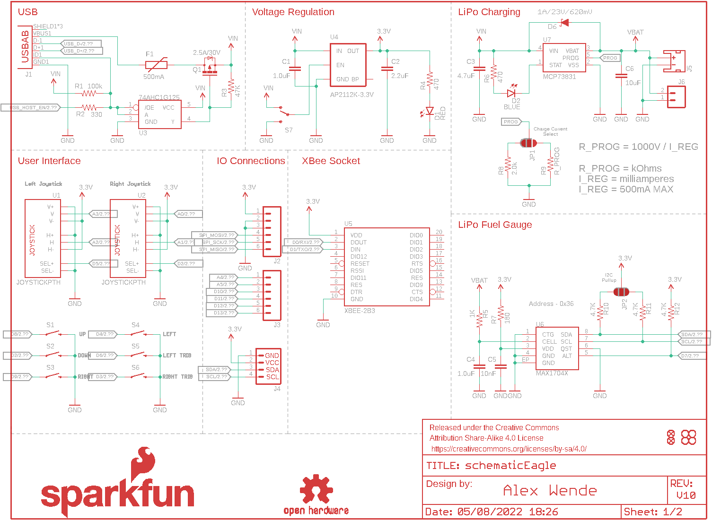
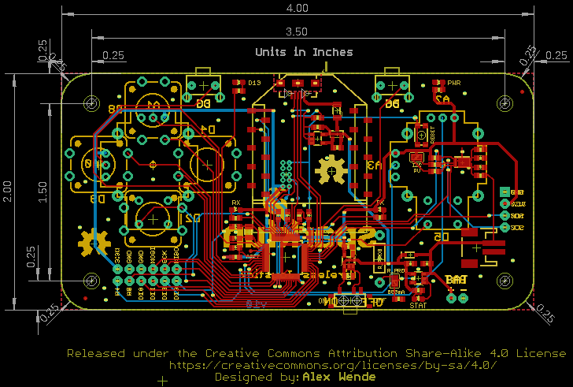
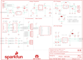

Contents
========

* [PRS14051 > Wireless Joystick](#prs14051--wireless-joystick)
	* [Schematic](#schematic)
	* [PCB](#pcb)
	* [Interactive BOM](#interactive-bom)
	* [OOMP Parts](#oomp-parts)
	* [Images](#images)
	* [Tags](#tags)
  
![][im]
# PRS14051 > Wireless Joystick

- ID: PROJ-SPAR-14051-STAN-01
- Hex ID: PRS14051
- Name: Sparkfun
- Description: Sparkfun
- Long Link: [http://oom.lt/PROJ-SPAR-14051-STAN-01](http://oom.lt/PROJ-SPAR-14051-STAN-01)
- Short Link: [http://oom.lt/PRS14051](http://oom.lt/PRS14051)

## Schematic
  

## PCB
  

## Interactive BOM

- Interactive BOM page: [ibom.html](https://htmlpreview.github.io/?https://github.com/oomlout/oomlout_OOMP_projects/blob/main/PROJ-SPAR-14051-STAN-01/kicad/bom/ibom.html)

## OOMP Parts
  

|OOMP Parts|
| :---: |
|[CAPC-0805-X-UF1-V25  SMD (0805) 1 uF Capacitor (Ceramic) 25v  C1](https://github.com/oomlout/oomlout_OOMP_parts/tree/main/CAPC-0805-X-UF1-V25/)|
|[CAPC-0603-X-UF22D-V10  SMD (0603) 2.2 uF Capacitor (Ceramic) 10v  C2](https://github.com/oomlout/oomlout_OOMP_parts/tree/main/CAPC-0603-X-UF22D-V10/)|
|[CAPC-0603-X-UF47D-V10  SMD (0603) 4.7 uF Capacitor (Ceramic) 10v  C3](https://github.com/oomlout/oomlout_OOMP_parts/tree/main/CAPC-0603-X-UF47D-V10/)|
|[CAPC-0603-X-UF1-V25  SMD (0603) 1 uF Capacitor (Ceramic) 25v  C4](https://github.com/oomlout/oomlout_OOMP_parts/tree/main/CAPC-0603-X-UF1-V25/)|
|[CAPC-0603-X-NF10-V50  SMD (0603) 10 nF Capacitor (Ceramic) 50v  C5](https://github.com/oomlout/oomlout_OOMP_parts/tree/main/CAPC-0603-X-NF10-V50/)|
|[CAPC-0603-X-UF10-V63D  SMD (0603) 10 uF Capacitor (Ceramic) 6.3v  C6](https://github.com/oomlout/oomlout_OOMP_parts/tree/main/CAPC-0603-X-UF10-V63D/)|
|CAPC-0603-X-UF1D-01 C7, C8, C11, C12|
|[CAPC-0603-X-PF15-V50  SMD (0603) 15 pF Capacitor (Ceramic) 50v  C9, C10](https://github.com/oomlout/oomlout_OOMP_parts/tree/main/CAPC-0603-X-PF15-V50/)|
|[LEDS-0603-R-STAN-01  SMD (0603) Red LED  D1, D5](https://github.com/oomlout/oomlout_OOMP_parts/tree/main/LEDS-0603-R-STAN-01/)|
|[LEDS-0603-L-STAN-01  SMD (0603) Blue LED  D2](https://github.com/oomlout/oomlout_OOMP_parts/tree/main/LEDS-0603-L-STAN-01/)|
|[LEDS-0603-G-STAN-01  SMD (0603) Green LED  D3](https://github.com/oomlout/oomlout_OOMP_parts/tree/main/LEDS-0603-G-STAN-01/)|
|[LEDS-0603-Y-STAN-01  SMD (0603) Yellow LED  D4](https://github.com/oomlout/oomlout_OOMP_parts/tree/main/LEDS-0603-Y-STAN-01/)|
|DIOD-S323-X-UNMATCHED-01 D6|
|REFU-1206-X-UNMATCHED-01 F1|
|UNMATCHED-UNMATCHED-X-UNMATCHED-01 J1, J4, J5, J7, L1, S1, S2, S3, S4, S5, S6, S7, TP1, TP2, TP3, TP4, U1, U2, U5, U6, U8, Y1|
|[HEAD-I01-X-PI06-01  2.54 mm 6 Pin Header  J2, J3](https://github.com/oomlout/oomlout_OOMP_parts/tree/main/HEAD-I01-X-PI06-01/)|
|[HEAD-I01-X-PI02-01  2.54 mm 2 Pin Header  J6](https://github.com/oomlout/oomlout_OOMP_parts/tree/main/HEAD-I01-X-PI02-01/)|
|UNMATCHED-SO23-X-UNMATCHED-01 Q1|
|RESE-0603-X-O1003-01 R1|
|[RESE-0603-X-O331-01  SMD (0603) 330 Ohm Resistor  R2, R14, R15](https://github.com/oomlout/oomlout_OOMP_parts/tree/main/RESE-0603-X-O331-01/)|
|[RESE-0603-X-O473-01  SMD (0603) 47k Ohm Resistor  R3](https://github.com/oomlout/oomlout_OOMP_parts/tree/main/RESE-0603-X-O473-01/)|
|[RESE-0603-X-O471-01  SMD (0603) 470 Ohm Resistor  R4, R6, R16](https://github.com/oomlout/oomlout_OOMP_parts/tree/main/RESE-0603-X-O471-01/)|
|[RESE-0603-X-O102-01  SMD (0603) 1k Ohm Resistor  R5](https://github.com/oomlout/oomlout_OOMP_parts/tree/main/RESE-0603-X-O102-01/)|
|RESE-0603-X-O181-01 R7|
|RESE-0603-X-UNMATCHED-01 R8|
|RESE-UNMATCHED-X-UNMATCHED-01 R9|
|[RESE-0603-X-O472-01  SMD (0603) 4.7k Ohm Resistor  R10, R11, R12](https://github.com/oomlout/oomlout_OOMP_parts/tree/main/RESE-0603-X-O472-01/)|
|[RESE-0603-X-O103-01  SMD (0603) 10k Ohm Resistor  R13](https://github.com/oomlout/oomlout_OOMP_parts/tree/main/RESE-0603-X-O103-01/)|
|UNMATCHED-4628-X-UNMATCHED-01 S8|
|UNMATCHED-SO235-X-UNMATCHED-01 U3, U7|
|VREG-SO235-X-KAP2112K-V33D U4|

## Images
  
  

|kicadPcb3d|kicadPcb3dFront|kicadPcb3dBack|eagleImage|eagleSchemImage|
| :---: | :---: | :---: | :---: | :---: |
||||||

## Tags

- hexID: PRS14051
- oompType: PROJ
- oompSize: SPAR
- oompColor: 14051
- oompDesc: STAN
- oompIndex: 01
- oompName: Wireless Joystick
- sources: All source files from https://github.com/sparkfun/Wireless_Joystick (source licence details in srcLicense.md)
- linkBuyPage: https://www.sparkfun.com/products/14051
- oompID: PROJ-SPAR-14051-STAN-01
- oompParts: C1,CAPC-0805-X-UF1-V25
- oompParts: C2,CAPC-0603-X-UF22D-V10
- oompParts: C3,CAPC-0603-X-UF47D-V10
- oompParts: C4,CAPC-0603-X-UF1-V25
- oompParts: C5,CAPC-0603-X-NF10-V50
- oompParts: C6,CAPC-0603-X-UF10-V63D
- oompParts: C7,CAPC-0603-X-UF1D-01
- oompParts: C8,CAPC-0603-X-UF1D-01
- oompParts: C9,CAPC-0603-X-PF15-V50
- oompParts: C10,CAPC-0603-X-PF15-V50
- oompParts: C11,CAPC-0603-X-UF1D-01
- oompParts: C12,CAPC-0603-X-UF1D-01
- oompParts: D1,LEDS-0603-R-STAN-01
- oompParts: D2,LEDS-0603-L-STAN-01
- oompParts: D3,LEDS-0603-G-STAN-01
- oompParts: D4,LEDS-0603-Y-STAN-01
- oompParts: D5,LEDS-0603-R-STAN-01
- oompParts: D6,DIOD-S323-X-UNMATCHED-01
- oompParts: F1,REFU-1206-X-UNMATCHED-01
- oompParts: J1,UNMATCHED-UNMATCHED-X-UNMATCHED-01
- oompParts: J2,HEAD-I01-X-PI06-01
- oompParts: J3,HEAD-I01-X-PI06-01
- oompParts: J4,UNMATCHED-UNMATCHED-X-UNMATCHED-01
- oompParts: J5,UNMATCHED-UNMATCHED-X-UNMATCHED-01
- oompParts: J6,HEAD-I01-X-PI02-01
- oompParts: J7,UNMATCHED-UNMATCHED-X-UNMATCHED-01
- oompParts: L1,UNMATCHED-UNMATCHED-X-UNMATCHED-01
- oompParts: Q1,UNMATCHED-SO23-X-UNMATCHED-01
- oompParts: R1,RESE-0603-X-O1003-01
- oompParts: R2,RESE-0603-X-O331-01
- oompParts: R3,RESE-0603-X-O473-01
- oompParts: R4,RESE-0603-X-O471-01
- oompParts: R5,RESE-0603-X-O102-01
- oompParts: R6,RESE-0603-X-O471-01
- oompParts: R7,RESE-0603-X-O181-01
- oompParts: R8,RESE-0603-X-UNMATCHED-01
- oompParts: R9,RESE-UNMATCHED-X-UNMATCHED-01
- oompParts: R10,RESE-0603-X-O472-01
- oompParts: R11,RESE-0603-X-O472-01
- oompParts: R12,RESE-0603-X-O472-01
- oompParts: R13,RESE-0603-X-O103-01
- oompParts: R14,RESE-0603-X-O331-01
- oompParts: R15,RESE-0603-X-O331-01
- oompParts: R16,RESE-0603-X-O471-01
- oompParts: S1,UNMATCHED-UNMATCHED-X-UNMATCHED-01
- oompParts: S2,UNMATCHED-UNMATCHED-X-UNMATCHED-01
- oompParts: S3,UNMATCHED-UNMATCHED-X-UNMATCHED-01
- oompParts: S4,UNMATCHED-UNMATCHED-X-UNMATCHED-01
- oompParts: S5,UNMATCHED-UNMATCHED-X-UNMATCHED-01
- oompParts: S6,UNMATCHED-UNMATCHED-X-UNMATCHED-01
- oompParts: S7,UNMATCHED-UNMATCHED-X-UNMATCHED-01
- oompParts: S8,UNMATCHED-4628-X-UNMATCHED-01
- oompParts: TP1,UNMATCHED-UNMATCHED-X-UNMATCHED-01
- oompParts: TP2,UNMATCHED-UNMATCHED-X-UNMATCHED-01
- oompParts: TP3,UNMATCHED-UNMATCHED-X-UNMATCHED-01
- oompParts: TP4,UNMATCHED-UNMATCHED-X-UNMATCHED-01
- oompParts: U1,UNMATCHED-UNMATCHED-X-UNMATCHED-01
- oompParts: U2,UNMATCHED-UNMATCHED-X-UNMATCHED-01
- oompParts: U3,UNMATCHED-SO235-X-UNMATCHED-01
- oompParts: U4,VREG-SO235-X-KAP2112K-V33D
- oompParts: U5,UNMATCHED-UNMATCHED-X-UNMATCHED-01
- oompParts: U6,UNMATCHED-UNMATCHED-X-UNMATCHED-01
- oompParts: U7,UNMATCHED-SO235-X-UNMATCHED-01
- oompParts: U8,UNMATCHED-UNMATCHED-X-UNMATCHED-01
- oompParts: Y1,UNMATCHED-UNMATCHED-X-UNMATCHED-01
- rawParts: C1,1.0uF,1.0UF-25V-+80/-20(0805),0805-CAP,CAP-11625,,,,,CAP-11625,,,1.0uF,,
- rawParts: C2,2.2uF,2.2UF-10V-20%(0603),0603-CAP,CAP-07888,,,,,CAP-07888,,,2.2uF,,
- rawParts: C3,4.7uF,4.7UF-6.3V-10%(0603)0603,0603-CAP,CAP-08280,,,,,CAP-08280,,,4.7uF,,
- rawParts: C4,1.0uF,1.0UF-16V-10%(0603),0603-CAP,CAP-00868,,,,,CAP-00868,,,1.0uF,,
- rawParts: C5,10nF,10NF/10000PF-50V-10%(0603),0603-CAP,CAP-00867,,,,,CAP-00867,,,10nF,,
- rawParts: C6,10uF,10UF-6.3V-20%(0603),0603-CAP,CAP-11015,,,,,CAP-11015,,,10uF,,
- rawParts: C7,0.1uF,0.1UF-25V(+80/-20%)(0603),0603-CAP,CAP-00810,,,,,CAP-00810,,,0.1uF,,
- rawParts: C8,0.1uF,0.1UF-25V(+80/-20%)(0603),0603-CAP,CAP-00810,,,,,CAP-00810,,,0.1uF,,
- rawParts: C9,15pF,15PF-50V-5%(0603),0603-CAP,CAP-07881,,,,,CAP-07881,,,15pF,,
- rawParts: C10,15pF,15PF-50V-5%(0603),0603-CAP,CAP-07881,,,,,CAP-07881,,,15pF,,
- rawParts: C11,0.1uF,0.1UF-25V(+80/-20%)(0603),0603-CAP,CAP-00810,,,,,CAP-00810,,,0.1uF,,
- rawParts: C12,0.1uF,0.1UF-25V(+80/-20%)(0603),0603-CAP,CAP-00810,,,,,CAP-00810,,,0.1uF,,
- rawParts: D1,RED,LED-RED0603,LED-0603,Assorted Red LEDs,,,,,DIO-00819,,,RED,,
- rawParts: D2,BLUE,LED-BLUE0603,LED-0603,Blue LEDs for production use,,,,,DIO-08575,,,BLUE,,
- rawParts: D3,GREEN,LED-GREEN0603,LED-0603,Various green LEDs,,,,,DIO-00821,,,GREEN,,
- rawParts: D4,Yellow,LED-YELLOW0603,LED-0603,Yellow SMD LEDs,,,,,DIO-09003,,,Yellow,,
- rawParts: D5,RED,LED-RED0603,LED-0603,Assorted Red LEDs,,,,,DIO-00819,,,RED,,
- rawParts: D6,1A/23V/620mV,DIODE-SCHOTTKY-BAT20J,SOD-323,Schottky diode,,,,,DIO-11623,,,1A/23V/620mV,,
- rawParts: F1,500mA,PTCSMD,PTC-1206,Resettable Fuse PTC,,,,,RES-11150,,,,,
- rawParts: FD1,FIDUCIALUFIDUCIAL,FIDUCIALUFIDUCIAL,MICRO-FIDUCIAL,Fiducial Alignment Points,,,,,,,,,,
- rawParts: FD2,FIDUCIALUFIDUCIAL,FIDUCIALUFIDUCIAL,MICRO-FIDUCIAL,Fiducial Alignment Points,,,,,,,,,,
- rawParts: FRAME1,FRAME-LETTER,FRAME-LETTER,CREATIVE_COMMONS,Schematic Frame,,,,,,,,,,
- rawParts: FRAME2,FRAME-LETTERNO_PACKAGE,FRAME-LETTERNO_PACKAGE,DUMMY,Schematic Frame,,,Nobody,,,,,,v01,
- rawParts: H1,STAND-OFF,STAND-OFF,STAND-OFF,#4 Stand Off,,,,,,,,,,
- rawParts: H2,STAND-OFF,STAND-OFF,STAND-OFF,#4 Stand Off,,,,,,,,,,
- rawParts: H3,STAND-OFF,STAND-OFF,STAND-OFF,#4 Stand Off,,,,,,,,,,
- rawParts: H4,STAND-OFF,STAND-OFF,STAND-OFF,#4 Stand Off,,,,,,,,,,
- rawParts: J1,,USB-ABCONN-11794,USB-AB-MICRO-SMD_V03,This is a USB AB connector that is compatible with USB OTG. i.e. this connector can serve as a host or device,,,,,CONN-11794,,,,,
- rawParts: J2,,M06NO_SILK_FEMALE_PTH,1X06_NO_SILK,Header 6,,,,,CONN-08437,,,,,
- rawParts: J3,,M06NO_SILK_FEMALE_PTH,1X06_NO_SILK,Header 6,,,,,CONN-08437,,,,,
- rawParts: J4,,I2C_STANDARD_NO_SILK,1X04_NO_SILK,SparkFun has standardized on a pinout for all I2C based sensor breakouts.,,,,,,,,,,
- rawParts: J5,,JST_2MM_MALE,JST-2-SMD,Mates to single-cell LiPo batteries.,-,+,,,CONN-11443,-,+,,,
- rawParts: J6,,M021X02_NO_SILK,1X02_NO_SILK,Standard 2-pin 0.1 header. Use with,,,,,,,,,,
- rawParts: J7,CORTEX_DEBUGPTH,CORTEX_DEBUGPTH,2X5-PTH-1.27MM,Cortex Debug Connector,,,,,,,,,,
- rawParts: JP1,,JUMPER-PAD-3-2OF3_NC_BY_PASTE,PAD-JUMPER-3-2OF3_NC_BY_PASTE_YES_SILK_FULL_BOX,,,,,,,,,,,
- rawParts: JP2,,JUMPER-PAD-3-NC_BY_PASTE,PAD-JUMPER-3-NC_BY_PASTE_YES_SILK_FULL_BOX,,,,,,,,,,,
- rawParts: L1,FB - 30 Ohm,INDUCTOR30OHM,1.8A,0603,Inductors,,,,,NDUC-07859,,,,,
- rawParts: LOGO1,SFE_LOGO_NAME_FLAME.3_INCH,SFE_LOGO_NAME_FLAME.3_INCH,SFE_LOGO_NAME_FLAME_.3,SFE Logo, name and flame,,,,,,,,,,
- rawParts: LOGO2,OSHW-LOGOL,OSHW-LOGOL,OSHW-LOGO-L,Open Source Hardware Logo,,,,,,,,,,
- rawParts: Q1,2.5A/30V,MOSFET-PCHANNELDMG2307L,SOT23-3@1,Generic PMOSFET,,,,,TRANS-11308,,,2.5A/30V,,
- rawParts: R1,100k,100KOHM-1/10W-1%(0603),0603-RES,RES-07828,,,,,RES-07828,,,100k,,
- rawParts: R2,330,330OHM1/10W1%(0603),0603-RES,RES-00818,,,,,RES-00818,,,330,,
- rawParts: R3,47K,47KOHM1/10W1%(0603),0603-RES,RES-07871,,,,,RES-07871,,,47K,,
- rawParts: R4,470,470OHM1/10W1%(0603),0603-RES,RES-07869,,,,,RES-07869,,,470,,
- rawParts: R5,1K,1KOHM-1/10W-1%(0603),0603-RES,RES-07856,,,,,RES-07856,,,1K,,
- rawParts: R6,470,470OHM1/10W1%(0603),0603-RES,RES-07869,,,,,RES-07869,,,470,,
- rawParts: R7,180,180OHM1/10W1%(0603),0603-RES,RES-08788,,,,,RES-08788,,,180,,
- rawParts: R8,2.0k,2.0KOHM1/10W5%(0603),0603-RES,RES-08296,,,,,RES-08296,,,2.0k,,
- rawParts: R9,R_PROG,RESISTORPTH-1/4W,AXIAL-0.4,Resistor,,,,,,,,,,
- rawParts: R10,4.7K,4.7KOHM-1/10W-1%(0603),0603-RES,RES-07857,,,,,RES-07857,,,4.7K,,
- rawParts: R11,4.7K,4.7KOHM-1/10W-1%(0603),0603-RES,RES-07857,,,,,RES-07857,,,4.7K,,
- rawParts: R12,4.7K,4.7KOHM-1/10W-1%(0603),0603-RES,RES-07857,,,,,RES-07857,,,4.7K,,
- rawParts: R13,10K,10KOHM-1/10W-1%(0603)0603,0603-RES,RES-00824,,,,,RES-00824,,,10K,,
- rawParts: R14,330,330OHM1/10W1%(0603),0603-RES,RES-00818,,,,,RES-00818,,,330,,
- rawParts: R15,330,330OHM1/10W1%(0603),0603-RES,RES-00818,,,,,RES-00818,,,330,,
- rawParts: R16,470,470OHM1/10W1%(0603),0603-RES,RES-07869,,,,,RES-07869,,,470,,
- rawParts: S1,,SWITCH-MOMENTARY-212MM,TACTILE-PTH-12MM,Various NO switches- pushbuttons, reed, etc,,,,,SWCH-09185,,,,,
- rawParts: S2,,SWITCH-MOMENTARY-212MM,TACTILE-PTH-12MM,Various NO switches- pushbuttons, reed, etc,,,,,SWCH-09185,,,,,
- rawParts: S3,,SWITCH-MOMENTARY-212MM,TACTILE-PTH-12MM,Various NO switches- pushbuttons, reed, etc,,,,,SWCH-09185,,,,,
- rawParts: S4,,SWITCH-MOMENTARY-212MM,TACTILE-PTH-12MM,Various NO switches- pushbuttons, reed, etc,,,,,SWCH-09185,,,,,
- rawParts: S5,,SWITCH-MOMENTARY-2SIDE_EZ,TACTILE-PTH-SIDEEZ,Various NO switches- pushbuttons, reed, etc,,,,,,,,,,
- rawParts: S6,,SWITCH-MOMENTARY-2SIDE_EZ,TACTILE-PTH-SIDEEZ,Various NO switches- pushbuttons, reed, etc,,,,,,,,,,
- rawParts: S7,,SWITCH_SPDT,KPS-1290,SWCH-10651,,,,,SWCH-10651,,,,,
- rawParts: S8,,MOMENTARY-SWITCH-SPST-SMD-4.6X2.8MM,TACTILE_SWITCH_SMD_4.6X2.8MM,Momentary Switch (Pushbutton) - SPST,,,,,SWCH-13065,,,,,
- rawParts: TP1,,TEST-POINT3,PAD.03X.03,Bare copper test points for troubleshooting or ICT,,,,,,,,,,
- rawParts: TP2,,TEST-POINT3,PAD.03X.03,Bare copper test points for troubleshooting or ICT,,,,,,,,,,
- rawParts: TP3,,TEST-POINT3,PAD.03X.03,Bare copper test points for troubleshooting or ICT,,,,,,,,,,
- rawParts: TP4,,TEST-POINT3,PAD.03X.03,Bare copper test points for troubleshooting or ICT,,,,,,,,,,
- rawParts: U1,JOYSTICKPTH,JOYSTICKPTH,JOYSTICK,Thumb Joystick,,,,,,,,,,
- rawParts: U2,JOYSTICKPTH,JOYSTICKPTH,JOYSTICK,Thumb Joystick,,,,,,,,,,
- rawParts: U3,74AHC1G125,74AHC1G125,SOT23-5,Single bus buffer gate with 3-state output,,,,,IC-11920,,,,,
- rawParts: U4,AP2112K-3.3V,V_REG_LDOSMD,SOT23-5,Voltage Regulator LDO,,,,,VREG-12457,,,,,
- rawParts: U5,XBEE-2B3,XBEE-2B3,XBEE-SMD,Xbee module footprints,,,,,CONN-09042,,,,,
- rawParts: U6,MAX1704X,MAX1704X,TDFN-8,MAX17043/MAX17044: Battery Fuel Guage (43 is 1cell, 44 is 2cell),,,,IC-10399,,,,,,
- rawParts: U7,MCP73831,MCP73831,SOT23-5,Miniature single cell, fully integrated Li-Ion, Li-polymer charge management controller,,,,,IC-09995,,,,,
- rawParts: U8,ATSAMD21G-A,ATSAMD21G-A,TQFP-48,Atmel SAMD21G SMART ARM-Based Microcontroller,,,,,IC-13064,,,,,
- rawParts: Y1,32.768kHz,CRYSTAL3.2X1.5MM,CRYSTAL-SMD-3.2X1.5MM,Various standard crystals. Proven footprints.,,,,,XTAL-13062,,,32.768kHz,,

[im]: kicadPcb3d_450.png
