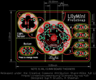
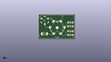
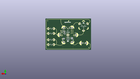
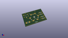

Contents
========

* [PROJ-SPAR-14063-STAN-01>LilyPad LilyMini ProtoSnap](#proj-spar-14063-stan-01lilypad-lilymini-protosnap)
	* [Images](#images)
	* [Interactive BOM](#interactive-bom)
	* [Tags](#tags)
  
![][im]
# PROJ-SPAR-14063-STAN-01>LilyPad LilyMini ProtoSnap

- ID: PROJ-SPAR-14063-STAN-01
- Hex ID: PRS14063
- Name: LilyPad LilyMini ProtoSnap
- Description: 

## Images
  
  

|eagleImage|kicadPcb3dFront|kicadPcb3dBack|kicadPcb3d|
| :---: | :---: | :---: | :---: |
|||||

## Interactive BOM

- Interactive BOM page: [ibom.html](kicad/bom/ibom.html)

## Tags

- hexID: PRS14063
- oompType: PROJ
- oompSize: SPAR
- oompColor: 14063
- oompDesc: STAN
- oompIndex: 01
- oompName: LilyPad LilyMini ProtoSnap
- sources: All source files from https://github.com/sparkfun/LilyPad_LilyMini_ProtoSnap (source licence details in srcLicense.md)
- linkBuyPage: https://www.sparkfun.com/products/14063
- oompID: PROJ-SPAR-14063-STAN-01
- oompParts: $1_61_$_2016-09-25_21-56-09,UNMATCHED-UNMATCHED-UNMATCHED-UNMATCHED-UNMATCHED
- oompParts: BAT1,UNMATCHED-UNMATCHED-UNMATCHED-UNMATCHED-UNMATCHED
- oompParts: C1,UNMATCHED-UNMATCHED-UNMATCHED-UNMATCHED-UNMATCHED
- oompParts: C2,UNMATCHED-UNMATCHED-UNMATCHED-UNMATCHED-UNMATCHED
- oompParts: C3,UNMATCHED-UNMATCHED-UNMATCHED-UNMATCHED-UNMATCHED
- oompParts: C4,UNMATCHED-UNMATCHED-UNMATCHED-UNMATCHED-UNMATCHED
- oompParts: D1,UNMATCHED-UNMATCHED-UNMATCHED-UNMATCHED-UNMATCHED
- oompParts: D2,UNMATCHED-UNMATCHED-UNMATCHED-UNMATCHED-UNMATCHED
- oompParts: D3,UNMATCHED-UNMATCHED-UNMATCHED-UNMATCHED-UNMATCHED
- oompParts: D4,UNMATCHED-UNMATCHED-UNMATCHED-UNMATCHED-UNMATCHED
- oompParts: D5,UNMATCHED-UNMATCHED-UNMATCHED-UNMATCHED-UNMATCHED
- oompParts: D6,UNMATCHED-UNMATCHED-UNMATCHED-UNMATCHED-UNMATCHED
- oompParts: FRAME1,UNMATCHED-UNMATCHED-UNMATCHED-UNMATCHED-UNMATCHED
- oompParts: JP1,UNMATCHED-UNMATCHED-UNMATCHED-UNMATCHED-UNMATCHED
- oompParts: JP2,UNMATCHED-UNMATCHED-UNMATCHED-UNMATCHED-UNMATCHED
- oompParts: JP3,UNMATCHED-UNMATCHED-UNMATCHED-UNMATCHED-UNMATCHED
- oompParts: JP4,UNMATCHED-UNMATCHED-UNMATCHED-UNMATCHED-UNMATCHED
- oompParts: JP5,UNMATCHED-UNMATCHED-UNMATCHED-UNMATCHED-UNMATCHED
- oompParts: JP6,UNMATCHED-UNMATCHED-UNMATCHED-UNMATCHED-UNMATCHED
- oompParts: JP7,UNMATCHED-UNMATCHED-UNMATCHED-UNMATCHED-UNMATCHED
- oompParts: JP8,UNMATCHED-UNMATCHED-UNMATCHED-UNMATCHED-UNMATCHED
- oompParts: JP9,UNMATCHED-UNMATCHED-UNMATCHED-UNMATCHED-UNMATCHED
- oompParts: JP12,UNMATCHED-UNMATCHED-UNMATCHED-UNMATCHED-UNMATCHED
- oompParts: JP13,UNMATCHED-UNMATCHED-UNMATCHED-UNMATCHED-UNMATCHED
- oompParts: JP20,UNMATCHED-UNMATCHED-UNMATCHED-UNMATCHED-UNMATCHED
- oompParts: JP21,UNMATCHED-UNMATCHED-UNMATCHED-UNMATCHED-UNMATCHED
- oompParts: JP22,UNMATCHED-UNMATCHED-UNMATCHED-UNMATCHED-UNMATCHED
- oompParts: JP23,UNMATCHED-UNMATCHED-UNMATCHED-UNMATCHED-UNMATCHED
- oompParts: JP24,UNMATCHED-UNMATCHED-UNMATCHED-UNMATCHED-UNMATCHED
- oompParts: JP25,UNMATCHED-UNMATCHED-UNMATCHED-UNMATCHED-UNMATCHED
- oompParts: JP26,UNMATCHED-UNMATCHED-UNMATCHED-UNMATCHED-UNMATCHED
- oompParts: JP27,UNMATCHED-UNMATCHED-UNMATCHED-UNMATCHED-UNMATCHED
- oompParts: LOGO1,UNMATCHED-UNMATCHED-UNMATCHED-UNMATCHED-UNMATCHED
- oompParts: LOGO2,UNMATCHED-UNMATCHED-UNMATCHED-UNMATCHED-UNMATCHED
- oompParts: LOGO4,UNMATCHED-UNMATCHED-UNMATCHED-UNMATCHED-UNMATCHED
- oompParts: Q1,UNMATCHED-UNMATCHED-UNMATCHED-UNMATCHED-UNMATCHED
- oompParts: R1,UNMATCHED-UNMATCHED-UNMATCHED-UNMATCHED-UNMATCHED
- oompParts: R2,UNMATCHED-UNMATCHED-UNMATCHED-UNMATCHED-UNMATCHED
- oompParts: R3,UNMATCHED-UNMATCHED-UNMATCHED-UNMATCHED-UNMATCHED
- oompParts: R4,UNMATCHED-UNMATCHED-UNMATCHED-UNMATCHED-UNMATCHED
- oompParts: R5,UNMATCHED-UNMATCHED-UNMATCHED-UNMATCHED-UNMATCHED
- oompParts: R6,UNMATCHED-UNMATCHED-UNMATCHED-UNMATCHED-UNMATCHED
- oompParts: R7,UNMATCHED-UNMATCHED-UNMATCHED-UNMATCHED-UNMATCHED
- oompParts: R8,UNMATCHED-UNMATCHED-UNMATCHED-UNMATCHED-UNMATCHED
- oompParts: R9,UNMATCHED-UNMATCHED-UNMATCHED-UNMATCHED-UNMATCHED
- oompParts: R10,UNMATCHED-UNMATCHED-UNMATCHED-UNMATCHED-UNMATCHED
- oompParts: S1,UNMATCHED-UNMATCHED-UNMATCHED-UNMATCHED-UNMATCHED
- oompParts: S2,UNMATCHED-UNMATCHED-UNMATCHED-UNMATCHED-UNMATCHED
- oompParts: SEWTAP+,UNMATCHED-UNMATCHED-UNMATCHED-UNMATCHED-UNMATCHED
- oompParts: SEWTAP-,UNMATCHED-UNMATCHED-UNMATCHED-UNMATCHED-UNMATCHED
- oompParts: SEWTAP1,UNMATCHED-UNMATCHED-UNMATCHED-UNMATCHED-UNMATCHED
- oompParts: SEWTAP2,UNMATCHED-UNMATCHED-UNMATCHED-UNMATCHED-UNMATCHED
- oompParts: SEWTAP3,UNMATCHED-UNMATCHED-UNMATCHED-UNMATCHED-UNMATCHED
- oompParts: SEWTAP4,UNMATCHED-UNMATCHED-UNMATCHED-UNMATCHED-UNMATCHED
- oompParts: SEWTAPLS+,UNMATCHED-UNMATCHED-UNMATCHED-UNMATCHED-UNMATCHED
- oompParts: SEWTAPLS-,UNMATCHED-UNMATCHED-UNMATCHED-UNMATCHED-UNMATCHED
- oompParts: SEWTAPLSOUT,UNMATCHED-UNMATCHED-UNMATCHED-UNMATCHED-UNMATCHED
- oompParts: SJ1,UNMATCHED-UNMATCHED-UNMATCHED-UNMATCHED-UNMATCHED
- oompParts: ST1,UNMATCHED-UNMATCHED-UNMATCHED-UNMATCHED-UNMATCHED
- oompParts: ST2,UNMATCHED-UNMATCHED-UNMATCHED-UNMATCHED-UNMATCHED
- oompParts: ST3,UNMATCHED-UNMATCHED-UNMATCHED-UNMATCHED-UNMATCHED
- oompParts: U1,UNMATCHED-UNMATCHED-UNMATCHED-UNMATCHED-UNMATCHED
- oompParts: U2,UNMATCHED-UNMATCHED-UNMATCHED-UNMATCHED-UNMATCHED
- oompParts: U3,UNMATCHED-UNMATCHED-UNMATCHED-UNMATCHED-UNMATCHED
- oompParts: Y1,UNMATCHED-UNMATCHED-UNMATCHED-UNMATCHED-UNMATCHED
- rawParts: $1_61_$_2016-09-25_21-56-09,OSHW-LOGOS,OSHW-LOGOS,OSHW-LOGO-S,Open Source Hardware Logo,,,
- rawParts: BAT1,CR2032,BATTERY20MM_PTH_KIT,BATTERY_20MM_PTH_KIT,Battery Holders,BATT-11519,,
- rawParts: C1,15pF,15PF-50V-5%(0603),0603-CAP,CAP-07881,CAP-07881,15pF,
- rawParts: C2,15pF,15PF-50V-5%(0603),0603-CAP,CAP-07881,CAP-07881,15pF,
- rawParts: C3,0.1uF,0.1UF-25V(+80/-20%)(0603),0603-CAP,CAP-00810,CAP-00810,0.1uF,
- rawParts: C4,0.1uF,0.1UF-25V(+80/-20%)(0603),0603-CAP,CAP-00810,CAP-00810,0.1uF,
- rawParts: D1,,0.13_RGB_LEDPLCC,P-LCC-4-3,Everlight Red/Green/Blue LED,DIO-12986,,
- rawParts: D2,RB751,DIODE-SCHOTTKY-RB751,SOD-523,Schottky diodes in SFEs production catalog,DIO-11018,RB751,
- rawParts: D3,,LED-WHITE1206,LED-1206,White SMD LEDs,DIO-09955,WHITE,
- rawParts: D4,,LED-WHITE1206,LED-1206,White SMD LEDs,DIO-09955,WHITE,
- rawParts: D5,,LED-WHITE1206,LED-1206,White SMD LEDs,DIO-09955,WHITE,
- rawParts: D6,,LED-WHITE1206,LED-1206,White SMD LEDs,DIO-09955,WHITE,
- rawParts: FD1,FIDUCIAL1X2,FIDUCIAL1X2,FIDUCIAL-1X2,Fiducial Alignment Points,,,
- rawParts: FD2,FIDUCIAL1X2,FIDUCIAL1X2,FIDUCIAL-1X2,Fiducial Alignment Points,,,
- rawParts: FD3,FIDUCIAL1X2,FIDUCIAL1X2,FIDUCIAL-1X2,Fiducial Alignment Points,,,
- rawParts: FD4,FIDUCIAL1X2,FIDUCIAL1X2,FIDUCIAL-1X2,Fiducial Alignment Points,,,
- rawParts: FRAME1,FRAME-LETTER,FRAME-LETTER,CREATIVE_COMMONS,Schematic Frame,,,
- rawParts: JP1,,USB_MICROB_PLUGUSB-B-MICRO-SMD-VERT,USB-B-MICRO-SMD_VERT,USB Micro-B connectors,,,
- rawParts: JP2,,M01SMDNS,1X01NS,Header 1,,,
- rawParts: JP3,,M01_POGOPAD_20M_NS_1S_SQUARE,1X01_POGOPIN_PAD_NOSILK_1SIDE_SQUARE,Header 1,,,
- rawParts: JP4,,M01_POGOPAD_20M_NS_1S_ROUND,1X01_POGOPIN_PAD_NOSILK_1SIDE_ROUND,Header 1,,,
- rawParts: JP5,,M01_POGOPAD_20M_NS_1S_ROUND,1X01_POGOPIN_PAD_NOSILK_1SIDE_ROUND,Header 1,,,
- rawParts: JP6,,M01_POGOPAD_20M_NS_1S_ROUND,1X01_POGOPIN_PAD_NOSILK_1SIDE_ROUND,Header 1,,,
- rawParts: JP7,,M01_POGOPAD_20M_NS_1S_ROUND,1X01_POGOPIN_PAD_NOSILK_1SIDE_ROUND,Header 1,,,
- rawParts: JP8,,M01_POGOPAD_20M_NS_1S_ROUND,1X01_POGOPIN_PAD_NOSILK_1SIDE_ROUND,Header 1,,,
- rawParts: JP9,,M01_POGOPAD_20M_NS_1S_ROUND,1X01_POGOPIN_PAD_NOSILK_1SIDE_ROUND,Header 1,,,
- rawParts: JP12,,SEWTAP8,PETAL-MEDIUM-2SIDE,Sew Taps for LilyPad Boards.,,,
- rawParts: JP13,,SEWTAP8,PETAL-MEDIUM-2SIDE,Sew Taps for LilyPad Boards.,,,
- rawParts: JP20,,SEWTAP6,PETAL-SMALL-2SIDE,Sew Taps for LilyPad Boards.,,,
- rawParts: JP21,,SEWTAP6,PETAL-SMALL-2SIDE,Sew Taps for LilyPad Boards.,,,
- rawParts: JP22,,SEWTAP6,PETAL-SMALL-2SIDE,Sew Taps for LilyPad Boards.,,,
- rawParts: JP23,,SEWTAP6,PETAL-SMALL-2SIDE,Sew Taps for LilyPad Boards.,,,
- rawParts: JP24,,SEWTAP6,PETAL-SMALL-2SIDE,Sew Taps for LilyPad Boards.,,,
- rawParts: JP25,,SEWTAP6,PETAL-SMALL-2SIDE,Sew Taps for LilyPad Boards.,,,
- rawParts: JP26,,SEWTAP6,PETAL-SMALL-2SIDE,Sew Taps for LilyPad Boards.,,,
- rawParts: JP27,,SEWTAP6,PETAL-SMALL-2SIDE,Sew Taps for LilyPad Boards.,,,
- rawParts: LOGO1,,LOGO-LPL,LOGO-L,,,,
- rawParts: LOGO2,,LILYLOGO-L-TOP,LOGO-L-TOP,,,,
- rawParts: LOGO4,SFE_LOGO_NAME.1_INCH,SFE_LOGO_NAME.1_INCH,SFE_LOGO_NAME_.1,SFE Logo, name only,,,
- rawParts: Q1,ZXMP6A13F,MOSFET-PCHANNEL,SOT23-3,Generic PMOSFET,TRANS-08285,,
- rawParts: R1,10K,10KOHM-1/10W-1%(0603)0603,0603-RES,RES-00824,RES-00824,10K,
- rawParts: R2,330,330OHM1/10W1%(0603),0603-RES,RES-00818,RES-00818,330,
- rawParts: R3,2K,2.0KOHM1/10W5%(0603),0603-RES,RES-08296,RES-08296,2.0k,
- rawParts: R4,1K,1KOHM-1/10W-1%(0603),0603-RES,RES-07856,RES-07856,1K,
- rawParts: R5,330,330OHM1/10W1%(0603),0603-RES,RES-00818,RES-00818,330,
- rawParts: R6,10K,10KOHM-1/10W-1%(0603)0603,0603-RES,RES-00824,RES-00824,10K,
- rawParts: R7,150,RESISTOR0603,0603-RES,Resistor,,,
- rawParts: R8,150,RESISTOR0603,0603-RES,Resistor,,,
- rawParts: R9,150,RESISTOR0603,0603-RES,Resistor,,,
- rawParts: R10,150,RESISTOR0603,0603-RES,Resistor,,,
- rawParts: S1,,SWITCH-MOMENTARY-2SMD-4.6X2.8MM,TACTILE_SWITCH_SMD_4.6X2.8MM,Various NO switches- pushbuttons, reed, etc,SWCH-13065,,
- rawParts: S2,,SWITCH-MOMENTARY-2SMD-REDUNDANT,TACTILE-SWITCH-SMD,Various NO switches- pushbuttons, reed, etc,SWCH-08247,,
- rawParts: SEWTAP+,,SEWTAP8,PETAL-MEDIUM-2SIDE,Sew Taps for LilyPad Boards.,,,
- rawParts: SEWTAP-,,SEWTAP8,PETAL-MEDIUM-2SIDE,Sew Taps for LilyPad Boards.,,,
- rawParts: SEWTAP1,,SEWTAP8,PETAL-MEDIUM-2SIDE,Sew Taps for LilyPad Boards.,,,
- rawParts: SEWTAP2,,SEWTAP8,PETAL-MEDIUM-2SIDE,Sew Taps for LilyPad Boards.,,,
- rawParts: SEWTAP3,,SEWTAP8,PETAL-MEDIUM-2SIDE,Sew Taps for LilyPad Boards.,,,
- rawParts: SEWTAP4,,SEWTAP8,PETAL-MEDIUM-2SIDE,Sew Taps for LilyPad Boards.,,,
- rawParts: SEWTAPLS+,PLUS,SEWTAP6,PETAL-SMALL-2SIDE,Sew Taps for LilyPad Boards.,,,
- rawParts: SEWTAPLS-,MINUS,SEWTAP6,PETAL-SMALL-2SIDE,Sew Taps for LilyPad Boards.,,,
- rawParts: SEWTAPLSOUT,OUT,SEWTAP6,PETAL-SMALL-2SIDE,Sew Taps for LilyPad Boards.,,,
- rawParts: SJ1,,JUMPER-PAD-2-NO,PAD-JUMPER-2-NO_NO_SILK,,,,
- rawParts: ST1,,SEWTAP-NOHOLE2,PETAL-NOHOLE-2SIDE,,,,
- rawParts: ST2,,SEWTAP-NOHOLE2,PETAL-NOHOLE-2SIDE,,,,
- rawParts: ST3,,SEWTAP-NOHOLE2,PETAL-NOHOLE-2SIDE,,,,
- rawParts: U1,SAMD11D14A-M,SAMD11D14A-M,QFN-24_ALT2,,,,
- rawParts: U2,AP2112K-3.3V,V_REG_AP2112K-3.3V,SOT23-5,AP2112 - 600mA CMOS LDO Regulator w/ Enable,VREG-12457,3.3V,
- rawParts: U3,ALS-PT19,LIGHTSENSORALS,ALS-PT19,Ambient Light Sensor,IC-11836,,
- rawParts: Y1,32.768kHz,CRYSTAL3.2X1.5MM,CRYSTAL-SMD-3.2X1.5MM,Various standard crystals. Proven footprints.,XTAL-13062,32.768kHz,

[im]: kicadPcb3d_450.png
