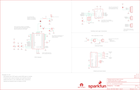

Contents
========

* [PRS14066 > Simultaneous RFID Tag Reader](#prs14066--simultaneous-rfid-tag-reader)
	* [Schematic](#schematic)
	* [PCB](#pcb)
	* [Interactive BOM](#interactive-bom)
	* [OOMP Parts](#oomp-parts)
	* [Images](#images)
	* [Tags](#tags)
  
![][im]
# PRS14066 > Simultaneous RFID Tag Reader

- ID: PROJ-SPAR-14066-STAN-01
- Hex ID: PRS14066
- Name: Sparkfun
- Description: Sparkfun
- Long Link: [http://oom.lt/PROJ-SPAR-14066-STAN-01](http://oom.lt/PROJ-SPAR-14066-STAN-01)
- Short Link: [http://oom.lt/PRS14066](http://oom.lt/PRS14066)

## Schematic
  

## PCB
  

## Interactive BOM

- Interactive BOM page: [ibom.html](https://htmlpreview.github.io/?https://github.com/oomlout/oomlout_OOMP_projects/blob/main/PROJ-SPAR-14066-STAN-01/kicad/bom/ibom.html)

## OOMP Parts
  

|OOMP Parts|
| :---: |
|UNMATCHED-UNMATCHED-X-UNMATCHED-01 B1, E1, J4, JP1, JP2, S1, SG1, SJ2, TP1, U2, U3, U4|
|[CAPC-0805-X-UF10-V10  SMD (0805) 10 uF Capacitor (Ceramic) 10v  C2](https://github.com/oomlout/oomlout_OOMP_parts/tree/main/CAPC-0805-X-UF10-V10/)|
|CAPC-0603-X-UNMATCHED-01 C7|
|[CAPC-0603-X-NF100-V50  SMD (0603) 100 nF Capacitor (Ceramic) 50v  C9, C12](https://github.com/oomlout/oomlout_OOMP_parts/tree/main/CAPC-0603-X-NF100-V50/)|
|[LEDS-0603-R-STAN-01  SMD (0603) Red LED  D1](https://github.com/oomlout/oomlout_OOMP_parts/tree/main/LEDS-0603-R-STAN-01/)|
|DIOD-UNMATCHED-X-UNMATCHED-01 D2|
|[HEAD-I01-X-PI06-01  2.54 mm 6 Pin Header  J2](https://github.com/oomlout/oomlout_OOMP_parts/tree/main/HEAD-I01-X-PI06-01/)|
|HEAD-I01-X-UNMATCHED-01 J3|
|[HEAD-I01-X-PI03-01  2.54 mm 3 Pin Header  J5, J7](https://github.com/oomlout/oomlout_OOMP_parts/tree/main/HEAD-I01-X-PI03-01/)|
|[TERS-35D-L-PI02-01  3.5 mm 2 Pin Blue Screw Terminal  J6](https://github.com/oomlout/oomlout_OOMP_parts/tree/main/TERS-35D-L-PI02-01/)|
|UNMATCHED-0603-X-UNMATCHED-01 L1|
|[RESE-0603-X-O102-01  SMD (0603) 1k Ohm Resistor  R1, R3](https://github.com/oomlout/oomlout_OOMP_parts/tree/main/RESE-0603-X-O102-01/)|

## Images
  
  

|bominteractivefront|bominteractiveback|kicadPcb3d|kicadPcb3dFront|kicadPcb3dBack|eagleImage|eagleSchemImage|pcbdraw|pcbdrawback|
| :---: | :---: | :---: | :---: | :---: | :---: | :---: | :---: | :---: |
||||||||||

## Tags

- hexID: PRS14066
- oompType: PROJ
- oompSize: SPAR
- oompColor: 14066
- oompDesc: STAN
- oompIndex: 01
- oompName: Simultaneous RFID Tag Reader
- sources: All source files from https://github.com/sparkfun/Simultaneous_RFID_Tag_Reader (source licence details in srcLicense.md)
- linkBuyPage: https://www.sparkfun.com/products/14066
- oompID: PROJ-SPAR-14066-STAN-01
- oompParts: B1,UNMATCHED-UNMATCHED-X-UNMATCHED-01
- oompParts: C2,CAPC-0805-X-UF10-V10
- oompParts: C7,CAPC-0603-X-UNMATCHED-01
- oompParts: C9,CAPC-0603-X-NF100-V50
- oompParts: C12,CAPC-0603-X-NF100-V50
- oompParts: D1,LEDS-0603-R-STAN-01
- oompParts: D2,DIOD-UNMATCHED-X-UNMATCHED-01
- oompParts: E1,UNMATCHED-UNMATCHED-X-UNMATCHED-01
- oompParts: J2,HEAD-I01-X-PI06-01
- oompParts: J3,HEAD-I01-X-UNMATCHED-01
- oompParts: J4,UNMATCHED-UNMATCHED-X-UNMATCHED-01
- oompParts: J5,HEAD-I01-X-PI03-01
- oompParts: J6,TERS-35D-L-PI02-01
- oompParts: J7,HEAD-I01-X-PI03-01
- oompParts: JP1,UNMATCHED-UNMATCHED-X-UNMATCHED-01
- oompParts: JP2,UNMATCHED-UNMATCHED-X-UNMATCHED-01
- oompParts: L1,UNMATCHED-0603-X-UNMATCHED-01
- oompParts: R1,RESE-0603-X-O102-01
- oompParts: R3,RESE-0603-X-O102-01
- oompParts: S1,UNMATCHED-UNMATCHED-X-UNMATCHED-01
- oompParts: SG1,UNMATCHED-UNMATCHED-X-UNMATCHED-01
- oompParts: SJ2,UNMATCHED-UNMATCHED-X-UNMATCHED-01
- oompParts: TP1,UNMATCHED-UNMATCHED-X-UNMATCHED-01
- oompParts: U2,UNMATCHED-UNMATCHED-X-UNMATCHED-01
- oompParts: U3,UNMATCHED-UNMATCHED-X-UNMATCHED-01
- oompParts: U4,UNMATCHED-UNMATCHED-X-UNMATCHED-01
- rawParts: B1,ARDUINO_UNO_SHIELD,ARDUINO_UNO_R3_SHIELDBASIC,UNO_R3_SHIELD,Arduino R3 Shield Footprint,,,,,
- rawParts: C2,10uF,10UF-0805-10V-10%,0805,10.0µF ceramic capacitors,CAP-11330,,,10uF,
- rawParts: C3,DNP,1.0PF-0603-50V-25%,0603,1pF ceramic capacitors,CAP-07879,,,1.0pF,
- rawParts: C4,DNP,1.0PF-0603-50V-25%,0603,1pF ceramic capacitors,CAP-07879,,,1.0pF,
- rawParts: C7,0.0,1.0PF-0603-50V-25%,0603,1pF ceramic capacitors,CAP-07879,,,1.0pF,
- rawParts: C9,0.1uF,0.1UF-0603-25V-(+80/-20%),0603,0.1µF ceramic capacitors,CAP-00810,,,0.1uF,
- rawParts: C12,0.1uF,0.1UF-0603-25V-(+80/-20%),0603,0.1µF ceramic capacitors,CAP-00810,,,0.1uF,
- rawParts: D1,RED,LED-RED0603,LED-0603,Assorted Red LEDs,DIO-00819,,,RED,
- rawParts: D2,B340A,DIODE-SCHOTTKY-B340A,SMA-DIODE,Schottky diodes in SFEs production catalog,DIO-09886,,,B340A,
- rawParts: E1,Trace Antenna,ANTENNA_GROUNDED1,915MHZ_ANTENNA_TRIMBLE,,,,,,
- rawParts: FID1,FIDUCIAL1X2,FIDUCIAL1X2,FIDUCIAL-1X2,Fiducial Alignment Points,,,,,
- rawParts: FID2,FIDUCIAL1X2,FIDUCIAL1X2,FIDUCIAL-1X2,Fiducial Alignment Points,,,,,
- rawParts: FRAME1,FRAME-LEDGER,FRAME-LEDGER,CREATIVE_COMMONS,Schematic Frame,,,,,
- rawParts: J2,FTDI,CONN_06SILK_FEMALE_PTH,1X06,Multi connection point. Often used as Generic Header-pin footprint for 0.1 inch spaced/style header connections,CONN-08437,,,,
- rawParts: J3,JST,CONN_02JST-PTH-2,JST-2-PTH,Multi connection point. Often used as Generic Header-pin footprint for 0.1 inch spaced/style header connections,CONN-09863,,PRT-09914,,
- rawParts: J4,U.FL,U.FL,U.FL,SMD antenna connector- WRL-09144,CONN-09193,,,U.FL,
- rawParts: J5,Extra,CONN_03,1X03,Multi connection point. Often used as Generic Header-pin footprint for 0.1 inch spaced/style header connections,,,,,
- rawParts: J6,Screw Terminal,CONN_023.5MM,SCREWTERMINAL-3.5MM-2,Multi connection point. Often used as Generic Header-pin footprint for 0.1 inch spaced/style header connections,CONN-08399,,,,
- rawParts: J7,GPIOs,CONN_03,1X03,Multi connection point. Often used as Generic Header-pin footprint for 0.1 inch spaced/style header connections,,,,,
- rawParts: JP1,,JUMPER-SMT_2_NC_TRACE_SILK,SMT-JUMPER_2_NC_TRACE_SILK,Normally closed trace jumper,,,,,
- rawParts: JP2,SJ1,JUMPER-SMT_2_NO_NO-SILK,SMT-JUMPER_2_NO_NO-SILK,Normally open jumper,,,,,
- rawParts: L1,3.9nH,3.9NH_-+0.3NH_300MA(0603)0603,0603,,NDUC-08761,,,3.9nH,
- rawParts: LOGO1,SFE_LOGO_NAME_FLAME.1_INCH,SFE_LOGO_NAME_FLAME.1_INCH,SFE_LOGO_NAME_FLAME_.1,SFE Logo, name and flame,,,,,
- rawParts: LOGO2,OSHW-LOGOS,OSHW-LOGOS,OSHW-LOGO-S,Open Source Hardware Logo,,,,,
- rawParts: LOGO3,SFE_LOGO_NAME_FLAME.1_INCH,SFE_LOGO_NAME_FLAME.1_INCH,SFE_LOGO_NAME_FLAME_.1,SFE Logo, name and flame,,,,,
- rawParts: R1,1k,1KOHM-0603-1/10W-1%,0603,1kΩ resistor,RES-07856,,,1k,
- rawParts: R3,1k,1KOHM-0603-1/10W-1%,0603,1kΩ resistor,RES-07856,,,1k,
- rawParts: S1,Serial Select,SWITCH-DPDT-SMD-AYZ0202,SWITCH_DPDT_SMD_AYZ0202,Double-Pole, Double-Throw (DPDT) Switch,SWCH-08179,COM-00597,,,
- rawParts: SG1,Buzzer,BUZZERSMD2,BUZZER-CCV,Buzzer 12mm,COMP-08568,,,Buzzer,
- rawParts: SJ2,,JUMPER-SMT_2_NO_NO-SILK,SMT-JUMPER_2_NO_NO-SILK,Normally open jumper,,,,,
- rawParts: STANDOFF1,STAND-OFF,STAND-OFF,STAND-OFF,#4 Stand Off,,,,,
- rawParts: STANDOFF2,STAND-OFF,STAND-OFF,STAND-OFF,#4 Stand Off,,,,,
- rawParts: STANDOFF3,STAND-OFF,STAND-OFF,STAND-OFF,#4 Stand Off,,,,,
- rawParts: STANDOFF4,STAND-OFF,STAND-OFF,STAND-OFF,#4 Stand Off,,,,,
- rawParts: STANDOFF7,STAND-OFF,STAND-OFF,STAND-OFF,#4 Stand Off,,,,,
- rawParts: STANDOFF8,STAND-OFF,STAND-OFF,STAND-OFF,#4 Stand Off,,,,,
- rawParts: TP1,,TEST-POINT3,PAD.03X.03,Bare copper test points for troubleshooting or ICT,,,,,
- rawParts: U2,TXB0104,TXB0104PWRSOIC14,SO14,4-Bit Bi-Directional Level Shifter,IC-11329,,,TXB0104,
- rawParts: U3,ESD Diode,TVS_DIODE_ARRAYSMD,SOT-23-6,,IC-13538,,,ESD Diode,
- rawParts: U4,Nano,UHF_RFID_NANO_MODULE,NANO_MODULE,UHF 860 and 920MHz RFID Module from ThingMagic,IC-13540,,,Nano,

[im]: kicadPcb3d_450.png
