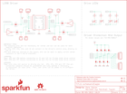

Contents
========

* [PRS14129 > Ardumoto-Motor Driver Shield](#prs14129--ardumoto-motor-driver-shield)
	* [Schematic](#schematic)
	* [PCB](#pcb)
	* [Interactive BOM](#interactive-bom)
	* [OOMP Parts](#oomp-parts)
	* [Images](#images)
	* [Tags](#tags)
  
![][im]
# PRS14129 > Ardumoto-Motor Driver Shield

- ID: PROJ-SPAR-14129-STAN-01
- Hex ID: PRS14129
- Name: Sparkfun
- Description: Sparkfun
- Long Link: [http://oom.lt/PROJ-SPAR-14129-STAN-01](http://oom.lt/PROJ-SPAR-14129-STAN-01)
- Short Link: [http://oom.lt/PRS14129](http://oom.lt/PRS14129)

## Schematic
  

## PCB
  

## Interactive BOM

- Interactive BOM page: [ibom.html](https://htmlpreview.github.io/?https://github.com/oomlout/oomlout_OOMP_projects/blob/main/PROJ-SPAR-14129-STAN-01/kicad/bom/ibom.html)

## OOMP Parts
  

|OOMP ID|Name|Identifier|
| :---: | :---: | :---: |
|[CAPC-0603-X-NF100-V50](https://github.com/oomlout/oomlout_OOMP_parts/tree/main/CAPC-0603-X-NF100-V50/)|[SMD (0603) 100 nF Capacitor (Ceramic) 50v](https://github.com/oomlout/oomlout_OOMP_parts/tree/main/CAPC-0603-X-NF100-V50/)|[C1, C8](https://github.com/oomlout/oomlout_OOMP_parts/tree/main/CAPC-0603-X-NF100-V50/)|
|CAPE-PAND-X-UF100-01||C3|
|DIOD-UNMATCHED-X-UNMATCHED-01||D1, D2, D3, D4, D5, D6, D7, D8|
|[LEDS-0603-R-STAN-01](https://github.com/oomlout/oomlout_OOMP_parts/tree/main/LEDS-0603-R-STAN-01/)|[SMD (0603) Red LED](https://github.com/oomlout/oomlout_OOMP_parts/tree/main/LEDS-0603-R-STAN-01/)|[D9, D10, D11, D12](https://github.com/oomlout/oomlout_OOMP_parts/tree/main/LEDS-0603-R-STAN-01/)|
|[HEAD-I01-X-PI08-01](https://github.com/oomlout/oomlout_OOMP_parts/tree/main/HEAD-I01-X-PI08-01/)|[2.54 mm 8 Pin Header](https://github.com/oomlout/oomlout_OOMP_parts/tree/main/HEAD-I01-X-PI08-01/)|[J1](https://github.com/oomlout/oomlout_OOMP_parts/tree/main/HEAD-I01-X-PI08-01/)|
|HEAD-I01-X-PI01-01||J2, J6, J11, J12, J13, J14|
|[HEAD-I01-X-PI06-01](https://github.com/oomlout/oomlout_OOMP_parts/tree/main/HEAD-I01-X-PI06-01/)|[2.54 mm 6 Pin Header](https://github.com/oomlout/oomlout_OOMP_parts/tree/main/HEAD-I01-X-PI06-01/)|[J3, J5](https://github.com/oomlout/oomlout_OOMP_parts/tree/main/HEAD-I01-X-PI06-01/)|
|[HEAD-I01-X-PI07-01](https://github.com/oomlout/oomlout_OOMP_parts/tree/main/HEAD-I01-X-PI07-01/)|[2.54 mm 7 Pin Header](https://github.com/oomlout/oomlout_OOMP_parts/tree/main/HEAD-I01-X-PI07-01/)|[J4](https://github.com/oomlout/oomlout_OOMP_parts/tree/main/HEAD-I01-X-PI07-01/)|
|[TERS-35D-L-PI04-01](https://github.com/oomlout/oomlout_OOMP_parts/tree/main/TERS-35D-L-PI04-01/)|[3.5 mm 4 Pin Blue Screw Terminal](https://github.com/oomlout/oomlout_OOMP_parts/tree/main/TERS-35D-L-PI04-01/)|[J7](https://github.com/oomlout/oomlout_OOMP_parts/tree/main/TERS-35D-L-PI04-01/)|
|[HEAD-I01-X-PI04-01](https://github.com/oomlout/oomlout_OOMP_parts/tree/main/HEAD-I01-X-PI04-01/)|[2.54 mm 4 Pin Header](https://github.com/oomlout/oomlout_OOMP_parts/tree/main/HEAD-I01-X-PI04-01/)|[J8](https://github.com/oomlout/oomlout_OOMP_parts/tree/main/HEAD-I01-X-PI04-01/)|
|[HEAD-I01-X-PI02-01](https://github.com/oomlout/oomlout_OOMP_parts/tree/main/HEAD-I01-X-PI02-01/)|[2.54 mm 2 Pin Header](https://github.com/oomlout/oomlout_OOMP_parts/tree/main/HEAD-I01-X-PI02-01/)|[J9, J15, JP9, JP10](https://github.com/oomlout/oomlout_OOMP_parts/tree/main/HEAD-I01-X-PI02-01/)|
|[TERS-35D-L-PI02-01](https://github.com/oomlout/oomlout_OOMP_parts/tree/main/TERS-35D-L-PI02-01/)|[3.5 mm 2 Pin Blue Screw Terminal](https://github.com/oomlout/oomlout_OOMP_parts/tree/main/TERS-35D-L-PI02-01/)|[J10](https://github.com/oomlout/oomlout_OOMP_parts/tree/main/TERS-35D-L-PI02-01/)|
|UNMATCHED-UNMATCHED-X-UNMATCHED-01||JP1, JP2, JP3, JP4, JP5, JP6, JP7, JP8, JP11, U1, U2, U5, U6|
|[LEDS-0603-L-STAN-01](https://github.com/oomlout/oomlout_OOMP_parts/tree/main/LEDS-0603-L-STAN-01/)|[SMD (0603) Blue LED](https://github.com/oomlout/oomlout_OOMP_parts/tree/main/LEDS-0603-L-STAN-01/)|[LED1, LED4](https://github.com/oomlout/oomlout_OOMP_parts/tree/main/LEDS-0603-L-STAN-01/)|
|[LEDS-0603-Y-STAN-01](https://github.com/oomlout/oomlout_OOMP_parts/tree/main/LEDS-0603-Y-STAN-01/)|[SMD (0603) Yellow LED](https://github.com/oomlout/oomlout_OOMP_parts/tree/main/LEDS-0603-Y-STAN-01/)|[LED2, LED3](https://github.com/oomlout/oomlout_OOMP_parts/tree/main/LEDS-0603-Y-STAN-01/)|
|[RESE-0603-X-O102-01](https://github.com/oomlout/oomlout_OOMP_parts/tree/main/RESE-0603-X-O102-01/)|[SMD (0603) 1k Ohm Resistor](https://github.com/oomlout/oomlout_OOMP_parts/tree/main/RESE-0603-X-O102-01/)|[R1, R2, R3, R4, R5, R6, R7, R8](https://github.com/oomlout/oomlout_OOMP_parts/tree/main/RESE-0603-X-O102-01/)|

## Images
  
  

|bominteractivefront|bominteractiveback|kicadPcb3d|kicadPcb3dFront|kicadPcb3dBack|kicadSchem|eagleImage|eagleSchemImage|pcbdraw|pcbdrawback|
| :---: | :---: | :---: | :---: | :---: | :---: | :---: | :---: | :---: | :---: |
|||||||||||

## Tags

- hexID: PRS14129
- oompType: PROJ
- oompSize: SPAR
- oompColor: 14129
- oompDesc: STAN
- oompIndex: 01
- oompName: Ardumoto-Motor Driver Shield
- sources: All source files from https://github.com/sparkfun/Ardumoto-Motor_Driver_Shield (source licence details in srcLicense.md)
- linkBuyPage: https://www.sparkfun.com/products/14129
- oompID: PROJ-SPAR-14129-STAN-01
- oompParts: C1,CAPC-0603-X-NF100-V50
- oompParts: C3,CAPE-PAND-X-UF100-01
- oompParts: C8,CAPC-0603-X-NF100-V50
- oompParts: D1,DIOD-UNMATCHED-X-UNMATCHED-01
- oompParts: D2,DIOD-UNMATCHED-X-UNMATCHED-01
- oompParts: D3,DIOD-UNMATCHED-X-UNMATCHED-01
- oompParts: D4,DIOD-UNMATCHED-X-UNMATCHED-01
- oompParts: D5,DIOD-UNMATCHED-X-UNMATCHED-01
- oompParts: D6,DIOD-UNMATCHED-X-UNMATCHED-01
- oompParts: D7,DIOD-UNMATCHED-X-UNMATCHED-01
- oompParts: D8,DIOD-UNMATCHED-X-UNMATCHED-01
- oompParts: D9,LEDS-0603-R-STAN-01
- oompParts: D10,LEDS-0603-R-STAN-01
- oompParts: D11,LEDS-0603-R-STAN-01
- oompParts: D12,LEDS-0603-R-STAN-01
- oompParts: J1,HEAD-I01-X-PI08-01
- oompParts: J2,HEAD-I01-X-PI01-01
- oompParts: J3,HEAD-I01-X-PI06-01
- oompParts: J4,HEAD-I01-X-PI07-01
- oompParts: J5,HEAD-I01-X-PI06-01
- oompParts: J6,HEAD-I01-X-PI01-01
- oompParts: J7,TERS-35D-L-PI04-01
- oompParts: J8,HEAD-I01-X-PI04-01
- oompParts: J9,HEAD-I01-X-PI02-01
- oompParts: J10,TERS-35D-L-PI02-01
- oompParts: J11,HEAD-I01-X-PI01-01
- oompParts: J12,HEAD-I01-X-PI01-01
- oompParts: J13,HEAD-I01-X-PI01-01
- oompParts: J14,HEAD-I01-X-PI01-01
- oompParts: J15,HEAD-I01-X-PI02-01
- oompParts: JP1,UNMATCHED-UNMATCHED-X-UNMATCHED-01
- oompParts: JP2,UNMATCHED-UNMATCHED-X-UNMATCHED-01
- oompParts: JP3,UNMATCHED-UNMATCHED-X-UNMATCHED-01
- oompParts: JP4,UNMATCHED-UNMATCHED-X-UNMATCHED-01
- oompParts: JP5,UNMATCHED-UNMATCHED-X-UNMATCHED-01
- oompParts: JP6,UNMATCHED-UNMATCHED-X-UNMATCHED-01
- oompParts: JP7,UNMATCHED-UNMATCHED-X-UNMATCHED-01
- oompParts: JP8,UNMATCHED-UNMATCHED-X-UNMATCHED-01
- oompParts: JP9,HEAD-I01-X-PI02-01
- oompParts: JP10,HEAD-I01-X-PI02-01
- oompParts: JP11,UNMATCHED-UNMATCHED-X-UNMATCHED-01
- oompParts: LED1,LEDS-0603-L-STAN-01
- oompParts: LED2,LEDS-0603-Y-STAN-01
- oompParts: LED3,LEDS-0603-Y-STAN-01
- oompParts: LED4,LEDS-0603-L-STAN-01
- oompParts: R1,RESE-0603-X-O102-01
- oompParts: R2,RESE-0603-X-O102-01
- oompParts: R3,RESE-0603-X-O102-01
- oompParts: R4,RESE-0603-X-O102-01
- oompParts: R5,RESE-0603-X-O102-01
- oompParts: R6,RESE-0603-X-O102-01
- oompParts: R7,RESE-0603-X-O102-01
- oompParts: R8,RESE-0603-X-O102-01
- oompParts: U1,UNMATCHED-UNMATCHED-X-UNMATCHED-01
- oompParts: U2,UNMATCHED-UNMATCHED-X-UNMATCHED-01
- oompParts: U5,UNMATCHED-UNMATCHED-X-UNMATCHED-01
- oompParts: U6,UNMATCHED-UNMATCHED-X-UNMATCHED-01
- rawParts: C1,0.1uF,0.1UF-0603-25V-5%,0603,0.1µF ceramic capacitors,,CAP-08604,,0.1uF,,
- rawParts: C3,100uF,100UF-POLAR-25V-20%(ELEC),PANASONIC_D,100µF polarized capacitors,,CAP-12547,,100uF,,
- rawParts: C8,0.1uF,0.1UF-0603-25V-5%,0603,0.1µF ceramic capacitors,,CAP-08604,,0.1uF,,
- rawParts: D1,1A/40V/500mV,DIODE-SCHOTTKY-SS14,SMA-DIODE,Schottky diode,,DIO-08053,,1A/40V/500mV,,
- rawParts: D2,1A/40V/500mV,DIODE-SCHOTTKY-SS14,SMA-DIODE,Schottky diode,,DIO-08053,,1A/40V/500mV,,
- rawParts: D3,1A/40V/500mV,DIODE-SCHOTTKY-SS14,SMA-DIODE,Schottky diode,,DIO-08053,,1A/40V/500mV,,
- rawParts: D4,1A/40V/500mV,DIODE-SCHOTTKY-SS14,SMA-DIODE,Schottky diode,,DIO-08053,,1A/40V/500mV,,
- rawParts: D5,1A/40V/500mV,DIODE-SCHOTTKY-SS14,SMA-DIODE,Schottky diode,,DIO-08053,,1A/40V/500mV,,
- rawParts: D6,1A/40V/500mV,DIODE-SCHOTTKY-SS14,SMA-DIODE,Schottky diode,,DIO-08053,,1A/40V/500mV,,
- rawParts: D7,1A/40V/500mV,DIODE-SCHOTTKY-SS14,SMA-DIODE,Schottky diode,,DIO-08053,,1A/40V/500mV,,
- rawParts: D8,1A/40V/500mV,DIODE-SCHOTTKY-SS14,SMA-DIODE,Schottky diode,,DIO-08053,,1A/40V/500mV,,
- rawParts: D9,RED,LED-RED0603,LED-0603,Red SMD LED,,DIO-00819,,RED,,
- rawParts: D10,RED,LED-RED0603,LED-0603,Red SMD LED,,DIO-00819,,RED,,
- rawParts: D11,RED,LED-RED0603,LED-0603,Red SMD LED,,DIO-00819,,RED,,
- rawParts: D12,RED,LED-RED0603,LED-0603,Red SMD LED,,DIO-00819,,RED,,
- rawParts: FD1,FIDUCIALUFIDUCIAL,FIDUCIALUFIDUCIAL,MICRO-FIDUCIAL,Fiducial Alignment Points,,,,,,
- rawParts: FD2,FIDUCIALUFIDUCIAL,FIDUCIALUFIDUCIAL,MICRO-FIDUCIAL,Fiducial Alignment Points,,,,,,
- rawParts: FRAME1,FRAME-LETTER,FRAME-LETTER,CREATIVE_COMMONS,Schematic Frame - Letter,,,,,,
- rawParts: FRAME2,FRAME-LETTERNO_PACKAGE,FRAME-LETTERNO_PACKAGE,DUMMY,Schematic Frame - Letter,Nobody,,,,v01,
- rawParts: H1,STAND-OFF,STAND-OFF,STAND-OFF,Stand Off,,,,,,
- rawParts: H2,STAND-OFF,STAND-OFF,STAND-OFF,Stand Off,,,,,,
- rawParts: J1,,CONN_08NO_SILK_FEMALE_PTH,1X08_NO_SILK,Multi connection point. Often used as Generic Header-pin footprint for 0.1 inch spaced/style header connections,,CONN-08438,,,,
- rawParts: J2,,CONN_01PTH_NO_SILK_YES_STOP,1X01_NO_SILK,Single connection point. Often used as Generic Header-pin footprint for 0.1 inch spaced/style header connections,,,,,,
- rawParts: J3,,CONN_06NO_SILK_FEMALE_PTH,1X06_NO_SILK,Multi connection point. Often used as Generic Header-pin footprint for 0.1 inch spaced/style header connections,,CONN-08437,,,,
- rawParts: J4,,CONN_07NO_SILK,1X07_NO_SILK,Multi connection point. Often used as Generic Header-pin footprint for 0.1 inch spaced/style header connections,,,,,,
- rawParts: J5,,CONN_06NO_SILK_FEMALE_PTH,1X06_NO_SILK,Multi connection point. Often used as Generic Header-pin footprint for 0.1 inch spaced/style header connections,,CONN-08437,,,,
- rawParts: J6,,CONN_01PTH_NO_SILK_YES_STOP,1X01_NO_SILK,Single connection point. Often used as Generic Header-pin footprint for 0.1 inch spaced/style header connections,,,,,,
- rawParts: J7,,CONN_04SCREW,SCREWTERMINAL-3.5MM-4,Multi connection point. Often used as Generic Header-pin footprint for 0.1 inch spaced/style header connections,,2xCONN-08399,2xPRT-08084,,,
- rawParts: J8,,CONN_04,1X04,Multi connection point. Often used as Generic Header-pin footprint for 0.1 inch spaced/style header connections,,CONN-09696,,,,
- rawParts: J9,,CONN_02,1X02,Multi connection point. Often used as Generic Header-pin footprint for 0.1 inch spaced/style header connections,,,,,,
- rawParts: J10,,CONN_023.5MM,SCREWTERMINAL-3.5MM-2,Multi connection point. Often used as Generic Header-pin footprint for 0.1 inch spaced/style header connections,,CONN-08399,,,,
- rawParts: J11,,CONN_01PTH_NO_SILK_YES_STOP,1X01_NO_SILK,Single connection point. Often used as Generic Header-pin footprint for 0.1 inch spaced/style header connections,,,,,,
- rawParts: J12,,CONN_01PTH_NO_SILK_YES_STOP,1X01_NO_SILK,Single connection point. Often used as Generic Header-pin footprint for 0.1 inch spaced/style header connections,,,,,,
- rawParts: J13,,CONN_01PTH_NO_SILK_YES_STOP,1X01_NO_SILK,Single connection point. Often used as Generic Header-pin footprint for 0.1 inch spaced/style header connections,,,,,,
- rawParts: J14,,CONN_01PTH_NO_SILK_YES_STOP,1X01_NO_SILK,Single connection point. Often used as Generic Header-pin footprint for 0.1 inch spaced/style header connections,,,,,,
- rawParts: J15,,CONN_021X02_NO_SILK,1X02_NO_SILK,Multi connection point. Often used as Generic Header-pin footprint for 0.1 inch spaced/style header connections,,,,,,
- rawParts: JP1,31NCT,JUMPER-SMT_3_1-NC_TRACE_SILK,SMT-JUMPER_3_1-NC_TRACE_SILK,Normally closed trace jumper (1 of 2 connections),,,,,,
- rawParts: JP2,31NCT,JUMPER-SMT_3_1-NC_TRACE_SILK,SMT-JUMPER_3_1-NC_TRACE_SILK,Normally closed trace jumper (1 of 2 connections),,,,,,
- rawParts: JP3,31NCT,JUMPER-SMT_3_1-NC_TRACE_SILK,SMT-JUMPER_3_1-NC_TRACE_SILK,Normally closed trace jumper (1 of 2 connections),,,,,,
- rawParts: JP4,31NCT,JUMPER-SMT_3_1-NC_TRACE_SILK,SMT-JUMPER_3_1-NC_TRACE_SILK,Normally closed trace jumper (1 of 2 connections),,,,,,
- rawParts: JP5,2NCT,JUMPER-SMT_2_NC_TRACE_SILK,SMT-JUMPER_2_NC_TRACE_SILK,Normally closed trace jumper,,,,,,
- rawParts: JP6,2NCT,JUMPER-SMT_2_NC_TRACE_SILK,SMT-JUMPER_2_NC_TRACE_SILK,Normally closed trace jumper,,,,,,
- rawParts: JP7,2NCT,JUMPER-SMT_2_NC_TRACE_SILK,SMT-JUMPER_2_NC_TRACE_SILK,Normally closed trace jumper,,,,,,
- rawParts: JP8,2NCT,JUMPER-SMT_2_NC_TRACE_SILK,SMT-JUMPER_2_NC_TRACE_SILK,Normally closed trace jumper,,,,,,
- rawParts: JP9,,CONN_021X02_NO_SILK,1X02_NO_SILK,Multi connection point. Often used as Generic Header-pin footprint for 0.1 inch spaced/style header connections,,,,,,
- rawParts: JP10,,CONN_021X02_NO_SILK,1X02_NO_SILK,Multi connection point. Often used as Generic Header-pin footprint for 0.1 inch spaced/style header connections,,,,,,
- rawParts: JP11,31NCT,JUMPER-SMT_3_1-NC_TRACE_SILK,SMT-JUMPER_3_1-NC_TRACE_SILK,Normally closed trace jumper (1 of 2 connections),,,,,,
- rawParts: LED1,BLUE,LED-BLUE0603,LED-0603,Blue SMD LED,,DIO-08575,,BLUE,,
- rawParts: LED2,Yellow,LED-YELLOW0603,LED-0603,Yellow SMD LED,,DIO-09003,,Yellow,,
- rawParts: LED3,Yellow,LED-YELLOW0603,LED-0603,Yellow SMD LED,,DIO-09003,,Yellow,,
- rawParts: LED4,BLUE,LED-BLUE0603,LED-0603,Blue SMD LED,,DIO-08575,,BLUE,,
- rawParts: LOGO1,SFE_LOGO_NAME_FLAME.2_INCH,SFE_LOGO_NAME_FLAME.2_INCH,SFE_LOGO_NAME_FLAME_.2,SparkFun Font Logo w/ Flame,,,,,,
- rawParts: LOGO2,SFE_LOGO_NAME_FLAME.1_INCH,SFE_LOGO_NAME_FLAME.1_INCH,SFE_LOGO_NAME_FLAME_.1,SparkFun Font Logo w/ Flame,,,,,,
- rawParts: R1,1k,1KOHM-0603-1/10W-1%,0603,1kΩ resistor,,RES-07856,,1k,,
- rawParts: R2,1k,1KOHM-0603-1/10W-1%,0603,1kΩ resistor,,RES-07856,,1k,,
- rawParts: R3,1k,1KOHM-0603-1/10W-1%,0603,1kΩ resistor,,RES-07856,,1k,,
- rawParts: R4,1k,1KOHM-0603-1/10W-1%,0603,1kΩ resistor,,RES-07856,,1k,,
- rawParts: R5,1k,1KOHM-0603-1/10W-1%,0603,1kΩ resistor,,RES-07856,,1k,,
- rawParts: R6,1k,1KOHM-0603-1/10W-1%,0603,1kΩ resistor,,RES-07856,,1k,,
- rawParts: R7,1k,1KOHM-0603-1/10W-1%,0603,1kΩ resistor,,RES-07856,,1k,,
- rawParts: R8,1k,1KOHM-0603-1/10W-1%,0603,1kΩ resistor,,RES-07856,,1k,,
- rawParts: U$1,OSHW-LOGOS,OSHW-LOGOS,OSHW-LOGO-S,Open Source Hardware Logo This logo indicates the piece of hardware it is found on incorporates a OSHW license and/or adheres to the definition of open source hardware found here: http://freedomdefined.org/OSHW,,,,,,
- rawParts: U1,ARDUINO,ARDUINO_UNO_R3_SHIELDNOLABELS,UNO_R3_SHIELD_NOLABELS,Arduino R3 Shield Footprint,,,,,,
- rawParts: U2,L298,L298_SMD_W_PAD,POWERSO20_L298_PAD,Full-bridge power driver IC,,IC-09133,,L298,,
- rawParts: U5,74HC1G04,74HC1G04,SOT353,Single Inverter,,COMP-08268,,74HC1G04,,
- rawParts: U6,74HC1G04,74HC1G04,SOT353,Single Inverter,,COMP-08268,,74HC1G04,,

[im]: kicadPcb3d_450.png
