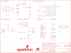

Contents
========

* [PRS14130 > Roshamglo](#prs14130--roshamglo)
	* [Schematic](#schematic)
	* [PCB](#pcb)
	* [Interactive BOM](#interactive-bom)
	* [OOMP Parts](#oomp-parts)
	* [Images](#images)
	* [Tags](#tags)
  
![][im]
# PRS14130 > Roshamglo

- ID: PROJ-SPAR-14130-STAN-01
- Hex ID: PRS14130
- Name: Sparkfun
- Description: Sparkfun
- Long Link: [http://oom.lt/PROJ-SPAR-14130-STAN-01](http://oom.lt/PROJ-SPAR-14130-STAN-01)
- Short Link: [http://oom.lt/PRS14130](http://oom.lt/PRS14130)

## Schematic
  

## PCB
  

## Interactive BOM

- Interactive BOM page: [ibom.html](https://htmlpreview.github.io/?https://github.com/oomlout/oomlout_OOMP_projects/blob/main/PROJ-SPAR-14130-STAN-01/kicad/bom/ibom.html)

## OOMP Parts
  

|OOMP Parts|
| :---: |
|UNMATCHED-UNMATCHED-X-UNMATCHED-01 BT1, BT2, BT3, IC1, J2, JP1, JP2, JP3, JP4, JP5, S1, S2, U$5, U1|
|[CAPC-0603-X-NF100-V50  SMD (0603) 100 nF Capacitor (Ceramic) 50v  C1](https://github.com/oomlout/oomlout_OOMP_parts/tree/main/CAPC-0603-X-NF100-V50/)|
|CAPC-0805-X-UNMATCHED-01 C5|
|[CAPC-0603-X-UF22D-V10  SMD (0603) 2.2 uF Capacitor (Ceramic) 10v  C6](https://github.com/oomlout/oomlout_OOMP_parts/tree/main/CAPC-0603-X-UF22D-V10/)|
|LEDS-UNMATCHED-G-STAN-01 D3, D6|
|DIOD-S323-X-UNMATCHED-01 D4|
|[LEDS-0603-R-STAN-01  SMD (0603) Red LED  D5](https://github.com/oomlout/oomlout_OOMP_parts/tree/main/LEDS-0603-R-STAN-01/)|
|[HEAD-I01-X-PI02-01  2.54 mm 2 Pin Header  J1](https://github.com/oomlout/oomlout_OOMP_parts/tree/main/HEAD-I01-X-PI02-01/)|
|[HEAD-I01-X-PI06-01  2.54 mm 6 Pin Header  J3](https://github.com/oomlout/oomlout_OOMP_parts/tree/main/HEAD-I01-X-PI06-01/)|
|[HEAD-I01-X-PI07-01  2.54 mm 7 Pin Header  J5](https://github.com/oomlout/oomlout_OOMP_parts/tree/main/HEAD-I01-X-PI07-01/)|
|UNMATCHED-SO23-X-UNMATCHED-01 Q1|
|[RESE-0603-X-O680-01  SMD (0603) 68 Ohm Resistor  R1, R2](https://github.com/oomlout/oomlout_OOMP_parts/tree/main/RESE-0603-X-O680-01/)|
|RESE-0603-X-UNMATCHED-01 R3, R6|
|[RESE-0603-X-O101-01  SMD (0603) 100 Ohm Resistor  R4, R5](https://github.com/oomlout/oomlout_OOMP_parts/tree/main/RESE-0603-X-O101-01/)|
|[RESE-0603-X-O102-01  SMD (0603) 1k Ohm Resistor  R7, R9](https://github.com/oomlout/oomlout_OOMP_parts/tree/main/RESE-0603-X-O102-01/)|
|[RESE-0603-X-O103-01  SMD (0603) 10k Ohm Resistor  R8](https://github.com/oomlout/oomlout_OOMP_parts/tree/main/RESE-0603-X-O103-01/)|
|UNMATCHED-4628-X-UNMATCHED-01 S3|
|[VREG-SO235-X-KAP2112K-V33D  SMD (SOT-23-5) AP2112K Voltage Regulator 3.3v  U3](https://github.com/oomlout/oomlout_OOMP_parts/tree/main/VREG-SO235-X-KAP2112K-V33D/)|

## Images
  
  

|bominteractivefront|bominteractiveback|kicadPcb3d|kicadPcb3dFront|kicadPcb3dBack|eagleImage|eagleSchemImage|
| :---: | :---: | :---: | :---: | :---: | :---: | :---: |
||||||||

## Tags

- hexID: PRS14130
- oompType: PROJ
- oompSize: SPAR
- oompColor: 14130
- oompDesc: STAN
- oompIndex: 01
- oompName: Roshamglo
- sources: All source files from https://github.com/sparkfun/Roshamglo (source licence details in srcLicense.md)
- linkBuyPage: https://www.sparkfun.com/products/14130
- oompID: PROJ-SPAR-14130-STAN-01
- oompParts: BT1,UNMATCHED-UNMATCHED-X-UNMATCHED-01
- oompParts: BT2,UNMATCHED-UNMATCHED-X-UNMATCHED-01
- oompParts: BT3,UNMATCHED-UNMATCHED-X-UNMATCHED-01
- oompParts: C1,CAPC-0603-X-NF100-V50
- oompParts: C5,CAPC-0805-X-UNMATCHED-01
- oompParts: C6,CAPC-0603-X-UF22D-V10
- oompParts: D3,LEDS-UNMATCHED-G-STAN-01
- oompParts: D4,DIOD-S323-X-UNMATCHED-01
- oompParts: D5,LEDS-0603-R-STAN-01
- oompParts: D6,LEDS-UNMATCHED-G-STAN-01
- oompParts: IC1,UNMATCHED-UNMATCHED-X-UNMATCHED-01
- oompParts: J1,HEAD-I01-X-PI02-01
- oompParts: J2,UNMATCHED-UNMATCHED-X-UNMATCHED-01
- oompParts: J3,HEAD-I01-X-PI06-01
- oompParts: J5,HEAD-I01-X-PI07-01
- oompParts: JP1,UNMATCHED-UNMATCHED-X-UNMATCHED-01
- oompParts: JP2,UNMATCHED-UNMATCHED-X-UNMATCHED-01
- oompParts: JP3,UNMATCHED-UNMATCHED-X-UNMATCHED-01
- oompParts: JP4,UNMATCHED-UNMATCHED-X-UNMATCHED-01
- oompParts: JP5,UNMATCHED-UNMATCHED-X-UNMATCHED-01
- oompParts: Q1,UNMATCHED-SO23-X-UNMATCHED-01
- oompParts: R1,RESE-0603-X-O680-01
- oompParts: R2,RESE-0603-X-O680-01
- oompParts: R3,RESE-0603-X-UNMATCHED-01
- oompParts: R4,RESE-0603-X-O101-01
- oompParts: R5,RESE-0603-X-O101-01
- oompParts: R6,RESE-0603-X-UNMATCHED-01
- oompParts: R7,RESE-0603-X-O102-01
- oompParts: R8,RESE-0603-X-O103-01
- oompParts: R9,RESE-0603-X-O102-01
- oompParts: S1,UNMATCHED-UNMATCHED-X-UNMATCHED-01
- oompParts: S2,UNMATCHED-UNMATCHED-X-UNMATCHED-01
- oompParts: S3,UNMATCHED-4628-X-UNMATCHED-01
- oompParts: U$5,UNMATCHED-UNMATCHED-X-UNMATCHED-01
- oompParts: U1,UNMATCHED-UNMATCHED-X-UNMATCHED-01
- oompParts: U3,VREG-SO235-X-KAP2112K-V33D
- rawParts: BT1,1.2V,BATTERY-AAA_KIT,BATTERY-AAA-KIT,Battery - Single Cell,BATT-08571,PRT-12718,,
- rawParts: BT2,1.2V,BATTERY-AAA_KIT,BATTERY-AAA-KIT,Battery - Single Cell,BATT-08571,PRT-12718,,
- rawParts: BT3,1.2V,BATTERY-AAA_KIT,BATTERY-AAA-KIT,Battery - Single Cell,BATT-08571,PRT-12718,,
- rawParts: C1,0.1uF,0.1UF-0603-25V-(+80/-20%),0603,0.1µF ceramic capacitors,CAP-00810,,0.1uF,
- rawParts: C5,1.0uF,1.0UF-25V-+80/-20(0805),0805-CAP,CAP-11625,CAP-11625,,1.0uF,
- rawParts: C6,2.2uF,2.2UF-10V-20%(0603),0603-CAP,CAP-07888,CAP-07888,,2.2uF,
- rawParts: D3,RG LED,LED-RGLTST-C195KGJRKT,LTST-C195KGJRKT,LiteOn Technology Corporation LTST-C195KGJRKT - LED GREEN/RED CLEAR 0606 SMD,DIO-12140,,,
- rawParts: D4,800mA/220mV,CUS08F30SOD-323,SOD-323,,DIO-13570,,800mA/220mV,
- rawParts: D5,RED,LED-RED0603,LED-0603,Red SMD LED,DIO-00819,,RED,
- rawParts: D6,LED-IR,LED-IR-SMDSFH4045N,SFH4045N,IR LED - Surface mount,DIO-13574,,,
- rawParts: FD1,FIDUCIALUFIDUCIAL,FIDUCIALUFIDUCIAL,FIDUCIAL-MICRO,Fiducial Alignment Points,,,,
- rawParts: FD2,FIDUCIALUFIDUCIAL,FIDUCIALUFIDUCIAL,FIDUCIAL-MICRO,Fiducial Alignment Points,,,,
- rawParts: FRAME1,FRAME-LETTER,FRAME-LETTER,CREATIVE_COMMONS,Schematic Frame - Letter,,,,
- rawParts: IC1,ATTINY84A,ATTINY84ATTINY84-20MU,QFN20,Atmel 14-pin 2/4/8kB flash uC,IC-13571,,,
- rawParts: J1,R_Ext,CONN_021X02_NO_SILK,1X02_NO_SILK,Multi connection point. Often used as Generic Header-pin footprint for 0.1 inch spaced/style header connections,,,,
- rawParts: J2,USBPCB,USBPCB_NOPASTE,USB-A-PCB-NOPASTE,USB Connectors,,,,
- rawParts: J3,,CONN_06NO_SILK_FEMALE_PTH,1X06_NO_SILK,Multi connection point. Often used as Generic Header-pin footprint for 0.1 inch spaced/style header connections,CONN-08437,,,
- rawParts: J5,,CONN_07NO_SILK,1X07_NO_SILK,Multi connection point. Often used as Generic Header-pin footprint for 0.1 inch spaced/style header connections,,,,
- rawParts: JP1,,JUMPER-SMT_2_NC_TRACE_SILK,SMT-JUMPER_2_NC_TRACE_SILK,Normally closed trace jumper,,,,
- rawParts: JP2,,JUMPER-SMT_2_NC_TRACE_SILK,SMT-JUMPER_2_NC_TRACE_SILK,Normally closed trace jumper,,,,
- rawParts: JP3,,JUMPER-SMT_2_NC_TRACE_SILK,SMT-JUMPER_2_NC_TRACE_SILK,Normally closed trace jumper,,,,
- rawParts: JP4,,JUMPER-SMT_2_NC_TRACE_SILK,SMT-JUMPER_2_NC_TRACE_SILK,Normally closed trace jumper,,,,
- rawParts: JP5,,JUMPER-SMT_2_NC_TRACE_SILK,SMT-JUMPER_2_NC_TRACE_SILK,Normally closed trace jumper,,,,
- rawParts: LOGO1,OSHW-LOGOS,OSHW-LOGOS,OSHW-LOGO-S,Open-Source Hardware (OSHW) Logo,,,,
- rawParts: LOGO2,SFE_LOGO_NAME_FLAME.2_INCH,SFE_LOGO_NAME_FLAME.2_INCH,SFE_LOGO_NAME_FLAME_.2,SparkFun Font Logo w/ Flame,,,,
- rawParts: Q1,600mA/40V,TRANS_NPN-MMBT2222AL,SOT23-3,NPN transistor,TRANS-08049,,600mA/40V,
- rawParts: R1,68,68OHM-0603-1/10W-1%,0603,68Ω resistor,RES-07860,,68,
- rawParts: R2,68,68OHM-0603-1/10W-1%,0603,68Ω resistor,RES-07860,,68,
- rawParts: R3,1.5k,1.5KOHM-0603-1/10W-1%,0603,1.5kΩ resistor,RES-08306,,1.5k,
- rawParts: R4,100,100OHM-0603-1/10W-1%,0603,100Ω resistor,RES-07863,,100,
- rawParts: R5,100,100OHM-0603-1/10W-1%,0603,100Ω resistor,RES-07863,,100,
- rawParts: R6,1.5k,1.5KOHM-0603-1/10W-1%,0603,1.5kΩ resistor,RES-08306,,1.5k,
- rawParts: R7,1k,1KOHM-0603-1/10W-1%,0603,1kΩ resistor,RES-07856,,1k,
- rawParts: R8,10k,10KOHM-0603-1/10W-1%,0603,10kΩ resistor,RES-00824,,10k,
- rawParts: R9,1k,1KOHM-0603-1/10W-1%,0603,1kΩ resistor,RES-07856,,1k,
- rawParts: S1,,JOYSTICK_MINI,JOYSTICK_MINI,Small Tactile Joystick w/ Select Switch,SWCH-09905,COM-10063,,
- rawParts: S2,,SWITCH-SPDT-SMD-RIGHT-ANGLE,SWITCH_SPST_SMD_A,Single Pole, Double Throw (SPDT) Switch,SWCH-10651,COM-10860,,
- rawParts: S3,,MOMENTARY-SWITCH-SPST-SMD-4.6X2.8MM,TACTILE_SWITCH_SMD_4.6X2.8MM,Momentary Switch (Pushbutton) - SPST,SWCH-13065,,,
- rawParts: U$5,SPECIAL_INSTRUCTIONS-ORDERING,SPECIAL_INSTRUCTIONS-ORDERING,ORDERING_INSTRUCTIONS,Special Ordering/Production Instructions Alert,,,,
- rawParts: U1,IR-Receiver,TSOP75XXXWSIDE_VIEW,TSOP75XXXWTR,Vishay TSOP75xxxW - IR receiver,SEN-13572,,,
- rawParts: U3,AP2112K-3.3V,V_REG_LDOSMD,SOT23-5,Voltage Regulator LDO,VREG-12457,,,

[im]: kicadPcb3d_450.png
