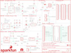

Contents
========

* [PRS14153 > Sparkfun](#prs14153--sparkfun)
	* [Schematic](#schematic)
	* [Interactive BOM](#interactive-bom)
	* [OOMP Parts](#oomp-parts)
	* [Images](#images)
	* [Tags](#tags)
  
![][im]
# PRS14153 > Sparkfun

- ID: PROJ-SPAR-14153-STAN-01
- Hex ID: PRS14153
- Name: Sparkfun
- Description: Sparkfun
- Long Link: [http://oom.lt/PROJ-SPAR-14153-STAN-01](http://oom.lt/PROJ-SPAR-14153-STAN-01)
- Short Link: [http://oom.lt/PRS14153](http://oom.lt/PRS14153)

## Schematic
  

## Interactive BOM

- Interactive BOM page: [ibom.html](https://htmlpreview.github.io/?https://github.com/oomlout/oomlout_OOMP_projects/blob/main/PROJ-SPAR-14153-STAN-01/kicad/bom/ibom.html)

## OOMP Parts
  

|OOMP Parts|
| :---: |
|B1,UNMATCHED-UNMATCHED-UNMATCHED-UNMATCHED-UNMATCHED,B1,ESP32_THING_WO_ANT_KEEPOUT,ESP32_THING_WO_ANT_KEEPOUT,ESP32_THING_NO_ANT,SparkFun ESP32 Thing Board,,,,|
|C1,UNMATCHED-UNMATCHED-UNMATCHED-UNMATCHED-UNMATCHED,C1,0.1uF,0.1UF-0603-25V-(+80/-20%),0603,0.1µF ceramic capacitors,CAP-00810,,0.1uF,|
|C2,UNMATCHED-UNMATCHED-UNMATCHED-UNMATCHED-UNMATCHED,C2,1.0uF,1.0UF-0603-16V-10%,0603,1µF ceramic capacitors,CAP-00868,,1.0uF,|
|C3,UNMATCHED-UNMATCHED-UNMATCHED-UNMATCHED-UNMATCHED,C3,1.0uF,1.0UF-0603-16V-10%,0603,1µF ceramic capacitors,CAP-00868,,1.0uF,|
|C4,UNMATCHED-UNMATCHED-UNMATCHED-UNMATCHED-UNMATCHED,C4,0.1uF,0.1UF-0603-25V-(+80/-20%),0603,0.1µF ceramic capacitors,CAP-00810,,0.1uF,|
|C5,UNMATCHED-UNMATCHED-UNMATCHED-UNMATCHED-UNMATCHED,C5,1.0uF,1.0UF-0603-16V-10%,0603,1µF ceramic capacitors,CAP-00868,,1.0uF,|
|C6,UNMATCHED-UNMATCHED-UNMATCHED-UNMATCHED-UNMATCHED,C6,0.1uF,0.1UF-0603-25V-(+80/-20%),0603,0.1µF ceramic capacitors,CAP-00810,,0.1uF,|
|FRAME1,UNMATCHED-UNMATCHED-UNMATCHED-UNMATCHED-UNMATCHED,FD1,FIDUCIAL1X2,FIDUCIAL1X2,FIDUCIAL-1X2,Fiducial Alignment Points,,,,|
|H1,UNMATCHED-UNMATCHED-UNMATCHED-UNMATCHED-UNMATCHED,FD2,FIDUCIAL1X2,FIDUCIAL1X2,FIDUCIAL-1X2,Fiducial Alignment Points,,,,|
|H2,UNMATCHED-UNMATCHED-UNMATCHED-UNMATCHED-UNMATCHED,FD3,FIDUCIAL1X2,FIDUCIAL1X2,FIDUCIAL-1X2,Fiducial Alignment Points,,,,|
|H3,UNMATCHED-UNMATCHED-UNMATCHED-UNMATCHED-UNMATCHED,FD4,FIDUCIAL1X2,FIDUCIAL1X2,FIDUCIAL-1X2,Fiducial Alignment Points,,,,|
|H4,UNMATCHED-UNMATCHED-UNMATCHED-UNMATCHED-UNMATCHED,FRAME1,FRAME-LETTER,FRAME-LETTER,CREATIVE_COMMONS,Schematic Frame - Letter,,,,|
|J1,UNMATCHED-UNMATCHED-UNMATCHED-UNMATCHED-UNMATCHED,H1,STAND-OFF,STAND-OFF,STAND-OFF,Stand Off,,,,|
|J2,UNMATCHED-UNMATCHED-UNMATCHED-UNMATCHED-UNMATCHED,H2,STAND-OFF,STAND-OFF,STAND-OFF,Stand Off,,,,|
|J3,UNMATCHED-UNMATCHED-UNMATCHED-UNMATCHED-UNMATCHED,H3,STAND-OFF,STAND-OFF,STAND-OFF,Stand Off,,,,|
|J4,UNMATCHED-UNMATCHED-UNMATCHED-UNMATCHED-UNMATCHED,H4,STAND-OFF,STAND-OFF,STAND-OFF,Stand Off,,,,|
|J5,UNMATCHED-UNMATCHED-UNMATCHED-UNMATCHED-UNMATCHED,J1,WEATHER_METER-WIND,WEATHER_METER-WIND,RJ11-6,RJ11 Jack - 6 pin,CONN-08590,PRT-00132,,|
|J7,UNMATCHED-UNMATCHED-UNMATCHED-UNMATCHED-UNMATCHED,J2,WEATHER_METER-RAIN,WEATHER_METER-RAIN,RJ11-6,Weather Meter - Rain Gauge Symbol,CONN-08590,SEN-08942,,|
|J8,UNMATCHED-UNMATCHED-UNMATCHED-UNMATCHED-UNMATCHED,J3,,CONN_03,1X03,Multi connection point. Often used as Generic Header-pin footprint for 0.1 inch spaced/style header connections,,,,|
|J9,UNMATCHED-UNMATCHED-UNMATCHED-UNMATCHED-UNMATCHED,J4,,CONN_20NOSILK,1X20_NOSILK,Multi connection point. Often used as Generic Header-pin footprint for 0.1 inch spaced/style header connections,,,,|
|J10,UNMATCHED-UNMATCHED-UNMATCHED-UNMATCHED-UNMATCHED,J5,,CONN_03,1X03,Multi connection point. Often used as Generic Header-pin footprint for 0.1 inch spaced/style header connections,,,,|
|J11,UNMATCHED-UNMATCHED-UNMATCHED-UNMATCHED-UNMATCHED,J7,,CONN_03SCREW-NS,SCREWTERMINAL-3.5MM-3-NS,Multi connection point. Often used as Generic Header-pin footprint for 0.1 inch spaced/style header connections,,,,|
|J12,UNMATCHED-UNMATCHED-UNMATCHED-UNMATCHED-UNMATCHED,J8,,I2C_STANDARD,1X04,SparkFun I2C Standard Pinout Header,,,,|
|J13,UNMATCHED-UNMATCHED-UNMATCHED-UNMATCHED-UNMATCHED,J9,,CONN_20NOSILK,1X20_NOSILK,Multi connection point. Often used as Generic Header-pin footprint for 0.1 inch spaced/style header connections,,,,|
|JP1,UNMATCHED-UNMATCHED-UNMATCHED-UNMATCHED-UNMATCHED,J10,,CONN_20NOSILK,1X20_NOSILK,Multi connection point. Often used as Generic Header-pin footprint for 0.1 inch spaced/style header connections,,,,|
|JP2,UNMATCHED-UNMATCHED-UNMATCHED-UNMATCHED-UNMATCHED,J11,,CONN_20NOSILK,1X20_NOSILK,Multi connection point. Often used as Generic Header-pin footprint for 0.1 inch spaced/style header connections,,,,|
|JP3,UNMATCHED-UNMATCHED-UNMATCHED-UNMATCHED-UNMATCHED,J12,,CONN_20NOSILK,1X20_NOSILK,Multi connection point. Often used as Generic Header-pin footprint for 0.1 inch spaced/style header connections,,,,|
|JP4,UNMATCHED-UNMATCHED-UNMATCHED-UNMATCHED-UNMATCHED,J13,,CONN_20NOSILK,1X20_NOSILK,Multi connection point. Often used as Generic Header-pin footprint for 0.1 inch spaced/style header connections,,,,|
|JP5,UNMATCHED-UNMATCHED-UNMATCHED-UNMATCHED-UNMATCHED,JP1,,JUMPER-SMT_2_NO_SILK,SMT-JUMPER_2_NO_SILK,Normally open jumper,,,,|
|LOGO1,UNMATCHED-UNMATCHED-UNMATCHED-UNMATCHED-UNMATCHED,JP2,,JUMPER-SMT_2_NO_SILK,SMT-JUMPER_2_NO_SILK,Normally open jumper,,,,|
|LOGO2,UNMATCHED-UNMATCHED-UNMATCHED-UNMATCHED-UNMATCHED,JP3,,JUMPER-SMT_3_NO_SILK,SMT-JUMPER_3_NO_SILK,Normally open jumper,,,,|
|LOGO3,UNMATCHED-UNMATCHED-UNMATCHED-UNMATCHED-UNMATCHED,JP4,,JUMPER-SMT_2_NC_TRACE_SILK,SMT-JUMPER_2_NC_TRACE_SILK,Normally closed trace jumper,,,,|
|LOGO4,UNMATCHED-UNMATCHED-UNMATCHED-UNMATCHED-UNMATCHED,JP5,,JUMPER-SMT_3_2-NC_TRACE_SILK,SMT-JUMPER_3_2-NC_TRACE_SILK,Normally closed trace jumper (2 of 2 connections),,,,|
|R1,UNMATCHED-UNMATCHED-UNMATCHED-UNMATCHED-UNMATCHED,LOGO1,SFE_LOGO_NAME.1_INCH,SFE_LOGO_NAME.1_INCH,SFE_LOGO_NAME_.1,SparkFun Font Logo,,,,|
|R2,UNMATCHED-UNMATCHED-UNMATCHED-UNMATCHED-UNMATCHED,LOGO2,SFE_LOGO_NAME_FLAME.1_INCH,SFE_LOGO_NAME_FLAME.1_INCH,SFE_LOGO_NAME_FLAME_.1,SparkFun Font Logo w/ Flame,,,,|
|R3,UNMATCHED-UNMATCHED-UNMATCHED-UNMATCHED-UNMATCHED,LOGO3,SFE_LOGO_FLAME.1_INCH,SFE_LOGO_FLAME.1_INCH,SFE_LOGO_FLAME_.1,SparkFun Flame Logo,,,,|
|R4,UNMATCHED-UNMATCHED-UNMATCHED-UNMATCHED-UNMATCHED,LOGO4,OSHW-LOGOS,OSHW-LOGOS,OSHW-LOGO-S,Open-Source Hardware (OSHW) Logo,,,,|
|R6,UNMATCHED-UNMATCHED-UNMATCHED-UNMATCHED-UNMATCHED,R1,100k,100KOHM-0603-1/10W-1%,0603,100kΩ resistor,RES-07828,,100k,|
|R7,UNMATCHED-UNMATCHED-UNMATCHED-UNMATCHED-UNMATCHED,R2,10k,10KOHM-0603-1/10W-1%,0603,10kΩ resistor,RES-00824,,10k,|
|R8,UNMATCHED-UNMATCHED-UNMATCHED-UNMATCHED-UNMATCHED,R3,1k,1KOHM-0603-1/10W-1%,0603,1kΩ resistor,RES-07856,,1k,|
|R9,UNMATCHED-UNMATCHED-UNMATCHED-UNMATCHED-UNMATCHED,R4,100k,100KOHM-0603-1/10W-1%,0603,100kΩ resistor,RES-07828,,100k,|
|R10,UNMATCHED-UNMATCHED-UNMATCHED-UNMATCHED-UNMATCHED,R6,100k,100KOHM-0603-1/10W-1%,0603,100kΩ resistor,RES-07828,,100k,|
|R12,UNMATCHED-UNMATCHED-UNMATCHED-UNMATCHED-UNMATCHED,R7,100k,100KOHM-0603-1/10W-1%,0603,100kΩ resistor,RES-07828,,100k,|
|R13,UNMATCHED-UNMATCHED-UNMATCHED-UNMATCHED-UNMATCHED,R8,10k,NTC-THERMISTOR-0603,0603,NTC Thermistor,RES-13608,,10k,|
|R14,UNMATCHED-UNMATCHED-UNMATCHED-UNMATCHED-UNMATCHED,R9,1k,1KOHM-0603-1/10W-1%,0603,1kΩ resistor,RES-07856,,1k,|
|U1,UNMATCHED-UNMATCHED-UNMATCHED-UNMATCHED-UNMATCHED,R10,10k,10KOHM-0603-1/10W-1%,0603,10kΩ resistor,RES-00824,,10k,|
|U2,UNMATCHED-UNMATCHED-UNMATCHED-UNMATCHED-UNMATCHED,R12,DNP,NTC-THERMISTOR-AXIAL-0.1,AXIAL-0.1,NTC Thermistor,,SEN-00250,10k,|
|U3,UNMATCHED-UNMATCHED-UNMATCHED-UNMATCHED-UNMATCHED,R13,4.7k,4.7KOHM-0603-1/10W-1%,0603,4.7kΩ resistor,RES-07857,,4.7k,|
|U4,UNMATCHED-UNMATCHED-UNMATCHED-UNMATCHED-UNMATCHED,R14,4.7k,4.7KOHM-0603-1/10W-1%,0603,4.7kΩ resistor,RES-07857,,4.7k,|

## Images
  
  

|kicadPcb3d|kicadPcb3dFront|kicadPcb3dBack|eagleImage|eagleSchemImage|
| :---: | :---: | :---: | :---: | :---: |
||||||

## Tags

- hexID: PRS14153
- oompType: PROJ
- oompSize: SPAR
- oompColor: 14153
- oompDesc: STAN
- oompIndex: 01
- oompName: ESP32 Environment Sensor Shield
- sources: All source files from https://github.com/sparkfun/ESP32_Environment_Sensor_Shield (source licence details in srcLicense.md)
- linkBuyPage: https://www.sparkfun.com/products/14153
- oompID: PROJ-SPAR-14153-STAN-01
- oompParts: B1,UNMATCHED-UNMATCHED-UNMATCHED-UNMATCHED-UNMATCHED
- oompParts: C1,UNMATCHED-UNMATCHED-UNMATCHED-UNMATCHED-UNMATCHED
- oompParts: C2,UNMATCHED-UNMATCHED-UNMATCHED-UNMATCHED-UNMATCHED
- oompParts: C3,UNMATCHED-UNMATCHED-UNMATCHED-UNMATCHED-UNMATCHED
- oompParts: C4,UNMATCHED-UNMATCHED-UNMATCHED-UNMATCHED-UNMATCHED
- oompParts: C5,UNMATCHED-UNMATCHED-UNMATCHED-UNMATCHED-UNMATCHED
- oompParts: C6,UNMATCHED-UNMATCHED-UNMATCHED-UNMATCHED-UNMATCHED
- oompParts: FRAME1,UNMATCHED-UNMATCHED-UNMATCHED-UNMATCHED-UNMATCHED
- oompParts: H1,UNMATCHED-UNMATCHED-UNMATCHED-UNMATCHED-UNMATCHED
- oompParts: H2,UNMATCHED-UNMATCHED-UNMATCHED-UNMATCHED-UNMATCHED
- oompParts: H3,UNMATCHED-UNMATCHED-UNMATCHED-UNMATCHED-UNMATCHED
- oompParts: H4,UNMATCHED-UNMATCHED-UNMATCHED-UNMATCHED-UNMATCHED
- oompParts: J1,UNMATCHED-UNMATCHED-UNMATCHED-UNMATCHED-UNMATCHED
- oompParts: J2,UNMATCHED-UNMATCHED-UNMATCHED-UNMATCHED-UNMATCHED
- oompParts: J3,UNMATCHED-UNMATCHED-UNMATCHED-UNMATCHED-UNMATCHED
- oompParts: J4,UNMATCHED-UNMATCHED-UNMATCHED-UNMATCHED-UNMATCHED
- oompParts: J5,UNMATCHED-UNMATCHED-UNMATCHED-UNMATCHED-UNMATCHED
- oompParts: J7,UNMATCHED-UNMATCHED-UNMATCHED-UNMATCHED-UNMATCHED
- oompParts: J8,UNMATCHED-UNMATCHED-UNMATCHED-UNMATCHED-UNMATCHED
- oompParts: J9,UNMATCHED-UNMATCHED-UNMATCHED-UNMATCHED-UNMATCHED
- oompParts: J10,UNMATCHED-UNMATCHED-UNMATCHED-UNMATCHED-UNMATCHED
- oompParts: J11,UNMATCHED-UNMATCHED-UNMATCHED-UNMATCHED-UNMATCHED
- oompParts: J12,UNMATCHED-UNMATCHED-UNMATCHED-UNMATCHED-UNMATCHED
- oompParts: J13,UNMATCHED-UNMATCHED-UNMATCHED-UNMATCHED-UNMATCHED
- oompParts: JP1,UNMATCHED-UNMATCHED-UNMATCHED-UNMATCHED-UNMATCHED
- oompParts: JP2,UNMATCHED-UNMATCHED-UNMATCHED-UNMATCHED-UNMATCHED
- oompParts: JP3,UNMATCHED-UNMATCHED-UNMATCHED-UNMATCHED-UNMATCHED
- oompParts: JP4,UNMATCHED-UNMATCHED-UNMATCHED-UNMATCHED-UNMATCHED
- oompParts: JP5,UNMATCHED-UNMATCHED-UNMATCHED-UNMATCHED-UNMATCHED
- oompParts: LOGO1,UNMATCHED-UNMATCHED-UNMATCHED-UNMATCHED-UNMATCHED
- oompParts: LOGO2,UNMATCHED-UNMATCHED-UNMATCHED-UNMATCHED-UNMATCHED
- oompParts: LOGO3,UNMATCHED-UNMATCHED-UNMATCHED-UNMATCHED-UNMATCHED
- oompParts: LOGO4,UNMATCHED-UNMATCHED-UNMATCHED-UNMATCHED-UNMATCHED
- oompParts: R1,UNMATCHED-UNMATCHED-UNMATCHED-UNMATCHED-UNMATCHED
- oompParts: R2,UNMATCHED-UNMATCHED-UNMATCHED-UNMATCHED-UNMATCHED
- oompParts: R3,UNMATCHED-UNMATCHED-UNMATCHED-UNMATCHED-UNMATCHED
- oompParts: R4,UNMATCHED-UNMATCHED-UNMATCHED-UNMATCHED-UNMATCHED
- oompParts: R6,UNMATCHED-UNMATCHED-UNMATCHED-UNMATCHED-UNMATCHED
- oompParts: R7,UNMATCHED-UNMATCHED-UNMATCHED-UNMATCHED-UNMATCHED
- oompParts: R8,UNMATCHED-UNMATCHED-UNMATCHED-UNMATCHED-UNMATCHED
- oompParts: R9,UNMATCHED-UNMATCHED-UNMATCHED-UNMATCHED-UNMATCHED
- oompParts: R10,UNMATCHED-UNMATCHED-UNMATCHED-UNMATCHED-UNMATCHED
- oompParts: R12,UNMATCHED-UNMATCHED-UNMATCHED-UNMATCHED-UNMATCHED
- oompParts: R13,UNMATCHED-UNMATCHED-UNMATCHED-UNMATCHED-UNMATCHED
- oompParts: R14,UNMATCHED-UNMATCHED-UNMATCHED-UNMATCHED-UNMATCHED
- oompParts: U1,UNMATCHED-UNMATCHED-UNMATCHED-UNMATCHED-UNMATCHED
- oompParts: U2,UNMATCHED-UNMATCHED-UNMATCHED-UNMATCHED-UNMATCHED
- oompParts: U3,UNMATCHED-UNMATCHED-UNMATCHED-UNMATCHED-UNMATCHED
- oompParts: U4,UNMATCHED-UNMATCHED-UNMATCHED-UNMATCHED-UNMATCHED
- rawParts: B1,ESP32_THING_WO_ANT_KEEPOUT,ESP32_THING_WO_ANT_KEEPOUT,ESP32_THING_NO_ANT,SparkFun ESP32 Thing Board,,,,
- rawParts: C1,0.1uF,0.1UF-0603-25V-(+80/-20%),0603,0.1µF ceramic capacitors,CAP-00810,,0.1uF,
- rawParts: C2,1.0uF,1.0UF-0603-16V-10%,0603,1µF ceramic capacitors,CAP-00868,,1.0uF,
- rawParts: C3,1.0uF,1.0UF-0603-16V-10%,0603,1µF ceramic capacitors,CAP-00868,,1.0uF,
- rawParts: C4,0.1uF,0.1UF-0603-25V-(+80/-20%),0603,0.1µF ceramic capacitors,CAP-00810,,0.1uF,
- rawParts: C5,1.0uF,1.0UF-0603-16V-10%,0603,1µF ceramic capacitors,CAP-00868,,1.0uF,
- rawParts: C6,0.1uF,0.1UF-0603-25V-(+80/-20%),0603,0.1µF ceramic capacitors,CAP-00810,,0.1uF,
- rawParts: FD1,FIDUCIAL1X2,FIDUCIAL1X2,FIDUCIAL-1X2,Fiducial Alignment Points,,,,
- rawParts: FD2,FIDUCIAL1X2,FIDUCIAL1X2,FIDUCIAL-1X2,Fiducial Alignment Points,,,,
- rawParts: FD3,FIDUCIAL1X2,FIDUCIAL1X2,FIDUCIAL-1X2,Fiducial Alignment Points,,,,
- rawParts: FD4,FIDUCIAL1X2,FIDUCIAL1X2,FIDUCIAL-1X2,Fiducial Alignment Points,,,,
- rawParts: FRAME1,FRAME-LETTER,FRAME-LETTER,CREATIVE_COMMONS,Schematic Frame - Letter,,,,
- rawParts: H1,STAND-OFF,STAND-OFF,STAND-OFF,Stand Off,,,,
- rawParts: H2,STAND-OFF,STAND-OFF,STAND-OFF,Stand Off,,,,
- rawParts: H3,STAND-OFF,STAND-OFF,STAND-OFF,Stand Off,,,,
- rawParts: H4,STAND-OFF,STAND-OFF,STAND-OFF,Stand Off,,,,
- rawParts: J1,WEATHER_METER-WIND,WEATHER_METER-WIND,RJ11-6,RJ11 Jack - 6 pin,CONN-08590,PRT-00132,,
- rawParts: J2,WEATHER_METER-RAIN,WEATHER_METER-RAIN,RJ11-6,Weather Meter - Rain Gauge Symbol,CONN-08590,SEN-08942,,
- rawParts: J3,,CONN_03,1X03,Multi connection point. Often used as Generic Header-pin footprint for 0.1 inch spaced/style header connections,,,,
- rawParts: J4,,CONN_20NOSILK,1X20_NOSILK,Multi connection point. Often used as Generic Header-pin footprint for 0.1 inch spaced/style header connections,,,,
- rawParts: J5,,CONN_03,1X03,Multi connection point. Often used as Generic Header-pin footprint for 0.1 inch spaced/style header connections,,,,
- rawParts: J7,,CONN_03SCREW-NS,SCREWTERMINAL-3.5MM-3-NS,Multi connection point. Often used as Generic Header-pin footprint for 0.1 inch spaced/style header connections,,,,
- rawParts: J8,,I2C_STANDARD,1X04,SparkFun I2C Standard Pinout Header,,,,
- rawParts: J9,,CONN_20NOSILK,1X20_NOSILK,Multi connection point. Often used as Generic Header-pin footprint for 0.1 inch spaced/style header connections,,,,
- rawParts: J10,,CONN_20NOSILK,1X20_NOSILK,Multi connection point. Often used as Generic Header-pin footprint for 0.1 inch spaced/style header connections,,,,
- rawParts: J11,,CONN_20NOSILK,1X20_NOSILK,Multi connection point. Often used as Generic Header-pin footprint for 0.1 inch spaced/style header connections,,,,
- rawParts: J12,,CONN_20NOSILK,1X20_NOSILK,Multi connection point. Often used as Generic Header-pin footprint for 0.1 inch spaced/style header connections,,,,
- rawParts: J13,,CONN_20NOSILK,1X20_NOSILK,Multi connection point. Often used as Generic Header-pin footprint for 0.1 inch spaced/style header connections,,,,
- rawParts: JP1,,JUMPER-SMT_2_NO_SILK,SMT-JUMPER_2_NO_SILK,Normally open jumper,,,,
- rawParts: JP2,,JUMPER-SMT_2_NO_SILK,SMT-JUMPER_2_NO_SILK,Normally open jumper,,,,
- rawParts: JP3,,JUMPER-SMT_3_NO_SILK,SMT-JUMPER_3_NO_SILK,Normally open jumper,,,,
- rawParts: JP4,,JUMPER-SMT_2_NC_TRACE_SILK,SMT-JUMPER_2_NC_TRACE_SILK,Normally closed trace jumper,,,,
- rawParts: JP5,,JUMPER-SMT_3_2-NC_TRACE_SILK,SMT-JUMPER_3_2-NC_TRACE_SILK,Normally closed trace jumper (2 of 2 connections),,,,
- rawParts: LOGO1,SFE_LOGO_NAME.1_INCH,SFE_LOGO_NAME.1_INCH,SFE_LOGO_NAME_.1,SparkFun Font Logo,,,,
- rawParts: LOGO2,SFE_LOGO_NAME_FLAME.1_INCH,SFE_LOGO_NAME_FLAME.1_INCH,SFE_LOGO_NAME_FLAME_.1,SparkFun Font Logo w/ Flame,,,,
- rawParts: LOGO3,SFE_LOGO_FLAME.1_INCH,SFE_LOGO_FLAME.1_INCH,SFE_LOGO_FLAME_.1,SparkFun Flame Logo,,,,
- rawParts: LOGO4,OSHW-LOGOS,OSHW-LOGOS,OSHW-LOGO-S,Open-Source Hardware (OSHW) Logo,,,,
- rawParts: R1,100k,100KOHM-0603-1/10W-1%,0603,100kΩ resistor,RES-07828,,100k,
- rawParts: R2,10k,10KOHM-0603-1/10W-1%,0603,10kΩ resistor,RES-00824,,10k,
- rawParts: R3,1k,1KOHM-0603-1/10W-1%,0603,1kΩ resistor,RES-07856,,1k,
- rawParts: R4,100k,100KOHM-0603-1/10W-1%,0603,100kΩ resistor,RES-07828,,100k,
- rawParts: R6,100k,100KOHM-0603-1/10W-1%,0603,100kΩ resistor,RES-07828,,100k,
- rawParts: R7,100k,100KOHM-0603-1/10W-1%,0603,100kΩ resistor,RES-07828,,100k,
- rawParts: R8,10k,NTC-THERMISTOR-0603,0603,NTC Thermistor,RES-13608,,10k,
- rawParts: R9,1k,1KOHM-0603-1/10W-1%,0603,1kΩ resistor,RES-07856,,1k,
- rawParts: R10,10k,10KOHM-0603-1/10W-1%,0603,10kΩ resistor,RES-00824,,10k,
- rawParts: R12,DNP,NTC-THERMISTOR-AXIAL-0.1,AXIAL-0.1,NTC Thermistor,,SEN-00250,10k,
- rawParts: R13,4.7k,4.7KOHM-0603-1/10W-1%,0603,4.7kΩ resistor,RES-07857,,4.7k,
- rawParts: R14,4.7k,4.7KOHM-0603-1/10W-1%,0603,4.7kΩ resistor,RES-07857,,4.7k,
- rawParts: U1,BME280,BME280,LGA-8-2.5X2.5,Bosch BME280 &ndash, Combined Humidity and Pressure Sensor,IC-13090,,BME280,
- rawParts: U2,CCS811,CCS811,LGA10-2.7X4.0MM,AMS CCS811 &ndash, I2C Digital Gas Sensor,IC-13607,,,
- rawParts: U3,APDS-9301,APDS-9301,CHIPLED-6,,IC-13662,,APDS-9301,
- rawParts: U4,TVS Diode,TVS_DIODE_ARRAYSMD,SOT-23-6,,IC-13538,,ESD Diode,

[im]: kicadPcb3d_450.png
