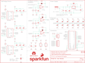

Contents
========

* [PRS14155 > ESP32 Power Control Shield](#prs14155--esp32-power-control-shield)
	* [Schematic](#schematic)
	* [Interactive BOM](#interactive-bom)
	* [OOMP Parts](#oomp-parts)
	* [Images](#images)
	* [Tags](#tags)
  
![][im]
# PRS14155 > ESP32 Power Control Shield

- ID: PROJ-SPAR-14155-STAN-01
- Hex ID: PRS14155
- Name: Sparkfun
- Description: Sparkfun
- Long Link: [http://oom.lt/PROJ-SPAR-14155-STAN-01](http://oom.lt/PROJ-SPAR-14155-STAN-01)
- Short Link: [http://oom.lt/PRS14155](http://oom.lt/PRS14155)

## Schematic
  

## Interactive BOM

- Interactive BOM page: [ibom.html](https://htmlpreview.github.io/?https://github.com/oomlout/oomlout_OOMP_projects/blob/main/PROJ-SPAR-14155-STAN-01/kicad/bom/ibom.html)

## OOMP Parts
  

|OOMP ID|Name|Identifier|
| :---: | :---: | :---: |
|UNMATCHED-UNMATCHED-X-UNMATCHED-01||B1, IC1, IC2, JP1, JP2, JP3, JP4, JP5, U1, U2, U3, U4|
|[CAPC-0603-X-NF33-V50](https://github.com/oomlout/oomlout_OOMP_parts/tree/main/CAPC-0603-X-NF33-V50/)|[SMD (0603) 33 nF Capacitor (Ceramic) 50v](https://github.com/oomlout/oomlout_OOMP_parts/tree/main/CAPC-0603-X-NF33-V50/)|[C1, C2, C3](https://github.com/oomlout/oomlout_OOMP_parts/tree/main/CAPC-0603-X-NF33-V50/)|
|CAPX-UNMATCHED-X-UF10-01||C4, C5, C6, C16|
|[CAPC-0603-X-NF100-V50](https://github.com/oomlout/oomlout_OOMP_parts/tree/main/CAPC-0603-X-NF100-V50/)|[SMD (0603) 100 nF Capacitor (Ceramic) 50v](https://github.com/oomlout/oomlout_OOMP_parts/tree/main/CAPC-0603-X-NF100-V50/)|[C7, C8, C9, C10, C11, C17, C18](https://github.com/oomlout/oomlout_OOMP_parts/tree/main/CAPC-0603-X-NF100-V50/)|
|CAPC-0603-X-UNMATCHED-01||C12, C13, C14|
|CAPX-UNMATCHED-X-UNMATCHED-01||C15|
|DIOD-UNMATCHED-X-UNMATCHED-01||D1, D2, D3, D4, D5, D6, D7, D8, D9, D10, D11, D12|
|TERS-35D-L-UNMATCHED-01||J1|
|[DCJP-21D-X-STAN-01](https://github.com/oomlout/oomlout_OOMP_parts/tree/main/DCJP-21D-X-STAN-01/)|[2.1 mm DC Jack](https://github.com/oomlout/oomlout_OOMP_parts/tree/main/DCJP-21D-X-STAN-01/)|[J2](https://github.com/oomlout/oomlout_OOMP_parts/tree/main/DCJP-21D-X-STAN-01/)|
|[TERS-35D-L-PI03-01](https://github.com/oomlout/oomlout_OOMP_parts/tree/main/TERS-35D-L-PI03-01/)|[3.5 mm 3 Pin Blue Screw Terminal](https://github.com/oomlout/oomlout_OOMP_parts/tree/main/TERS-35D-L-PI03-01/)|[J3](https://github.com/oomlout/oomlout_OOMP_parts/tree/main/TERS-35D-L-PI03-01/)|
|[RESE-0603-X-O103-01](https://github.com/oomlout/oomlout_OOMP_parts/tree/main/RESE-0603-X-O103-01/)|[SMD (0603) 10k Ohm Resistor](https://github.com/oomlout/oomlout_OOMP_parts/tree/main/RESE-0603-X-O103-01/)|[R1, R2, R3, R4, R5, R6](https://github.com/oomlout/oomlout_OOMP_parts/tree/main/RESE-0603-X-O103-01/)|
|[RESE-0603-X-O221-01](https://github.com/oomlout/oomlout_OOMP_parts/tree/main/RESE-0603-X-O221-01/)|[SMD (0603) 220 Ohm Resistor](https://github.com/oomlout/oomlout_OOMP_parts/tree/main/RESE-0603-X-O221-01/)|[R7, R8, R9](https://github.com/oomlout/oomlout_OOMP_parts/tree/main/RESE-0603-X-O221-01/)|
|RESE-UNMATCHED-X-UNMATCHED-01||R10, R11, R12|
|[RESE-0603-X-O102-01](https://github.com/oomlout/oomlout_OOMP_parts/tree/main/RESE-0603-X-O102-01/)|[SMD (0603) 1k Ohm Resistor](https://github.com/oomlout/oomlout_OOMP_parts/tree/main/RESE-0603-X-O102-01/)|[R13](https://github.com/oomlout/oomlout_OOMP_parts/tree/main/RESE-0603-X-O102-01/)|

## Images
  
  

|bominteractivefront|bominteractiveback|kicadPcb3d|kicadPcb3dFront|kicadPcb3dBack|eagleSchemImage|pcbdraw|pcbdrawback|
| :---: | :---: | :---: | :---: | :---: | :---: | :---: | :---: |
|||||||||

## Tags

- hexID: PRS14155
- oompType: PROJ
- oompSize: SPAR
- oompColor: 14155
- oompDesc: STAN
- oompIndex: 01
- oompName: ESP32 Power Control Shield
- sources: All source files from https://github.com/sparkfun/ESP32_Power_Control_Shield (source licence details in srcLicense.md)
- linkBuyPage: https://www.sparkfun.com/products/14155
- oompID: PROJ-SPAR-14155-STAN-01
- oompParts: B1,UNMATCHED-UNMATCHED-X-UNMATCHED-01
- oompParts: C1,CAPC-0603-X-NF33-V50
- oompParts: C2,CAPC-0603-X-NF33-V50
- oompParts: C3,CAPC-0603-X-NF33-V50
- oompParts: C4,CAPX-UNMATCHED-X-UF10-01
- oompParts: C5,CAPX-UNMATCHED-X-UF10-01
- oompParts: C6,CAPX-UNMATCHED-X-UF10-01
- oompParts: C7,CAPC-0603-X-NF100-V50
- oompParts: C8,CAPC-0603-X-NF100-V50
- oompParts: C9,CAPC-0603-X-NF100-V50
- oompParts: C10,CAPC-0603-X-NF100-V50
- oompParts: C11,CAPC-0603-X-NF100-V50
- oompParts: C12,CAPC-0603-X-UNMATCHED-01
- oompParts: C13,CAPC-0603-X-UNMATCHED-01
- oompParts: C14,CAPC-0603-X-UNMATCHED-01
- oompParts: C15,CAPX-UNMATCHED-X-UNMATCHED-01
- oompParts: C16,CAPX-UNMATCHED-X-UF10-01
- oompParts: C17,CAPC-0603-X-NF100-V50
- oompParts: C18,CAPC-0603-X-NF100-V50
- oompParts: D1,DIOD-UNMATCHED-X-UNMATCHED-01
- oompParts: D2,DIOD-UNMATCHED-X-UNMATCHED-01
- oompParts: D3,DIOD-UNMATCHED-X-UNMATCHED-01
- oompParts: D4,DIOD-UNMATCHED-X-UNMATCHED-01
- oompParts: D5,DIOD-UNMATCHED-X-UNMATCHED-01
- oompParts: D6,DIOD-UNMATCHED-X-UNMATCHED-01
- oompParts: D7,DIOD-UNMATCHED-X-UNMATCHED-01
- oompParts: D8,DIOD-UNMATCHED-X-UNMATCHED-01
- oompParts: D9,DIOD-UNMATCHED-X-UNMATCHED-01
- oompParts: D10,DIOD-UNMATCHED-X-UNMATCHED-01
- oompParts: D11,DIOD-UNMATCHED-X-UNMATCHED-01
- oompParts: D12,DIOD-UNMATCHED-X-UNMATCHED-01
- oompParts: IC1,UNMATCHED-UNMATCHED-X-UNMATCHED-01
- oompParts: IC2,UNMATCHED-UNMATCHED-X-UNMATCHED-01
- oompParts: J1,TERS-35D-L-UNMATCHED-01
- oompParts: J2,DCJP-21D-X-STAN-01
- oompParts: J3,TERS-35D-L-PI03-01
- oompParts: JP1,UNMATCHED-UNMATCHED-X-UNMATCHED-01
- oompParts: JP2,UNMATCHED-UNMATCHED-X-UNMATCHED-01
- oompParts: JP3,UNMATCHED-UNMATCHED-X-UNMATCHED-01
- oompParts: JP4,UNMATCHED-UNMATCHED-X-UNMATCHED-01
- oompParts: JP5,UNMATCHED-UNMATCHED-X-UNMATCHED-01
- oompParts: R1,RESE-0603-X-O103-01
- oompParts: R2,RESE-0603-X-O103-01
- oompParts: R3,RESE-0603-X-O103-01
- oompParts: R4,RESE-0603-X-O103-01
- oompParts: R5,RESE-0603-X-O103-01
- oompParts: R6,RESE-0603-X-O103-01
- oompParts: R7,RESE-0603-X-O221-01
- oompParts: R8,RESE-0603-X-O221-01
- oompParts: R9,RESE-0603-X-O221-01
- oompParts: R10,RESE-UNMATCHED-X-UNMATCHED-01
- oompParts: R11,RESE-UNMATCHED-X-UNMATCHED-01
- oompParts: R12,RESE-UNMATCHED-X-UNMATCHED-01
- oompParts: R13,RESE-0603-X-O102-01
- oompParts: U1,UNMATCHED-UNMATCHED-X-UNMATCHED-01
- oompParts: U2,UNMATCHED-UNMATCHED-X-UNMATCHED-01
- oompParts: U3,UNMATCHED-UNMATCHED-X-UNMATCHED-01
- oompParts: U4,UNMATCHED-UNMATCHED-X-UNMATCHED-01
- rawParts: B1,ESP32_THING,ESP32_THING,ESP32_THING,SparkFun ESP32 Thing Board,,DEV-13907,,
- rawParts: C1,33nF,33NF-0603-50V-10%,0603,33nF ceramic capacitors,CAP-07887,,33nF,
- rawParts: C2,33nF,33NF-0603-50V-10%,0603,33nF ceramic capacitors,CAP-07887,,33nF,
- rawParts: C3,33nF,33NF-0603-50V-10%,0603,33nF ceramic capacitors,CAP-07887,,33nF,
- rawParts: C4,10uF,10UF-1210-50V-20%,1210,10.0µF ceramic capacitors,CAP-09824,,10uF,
- rawParts: C5,10uF,10UF-1210-50V-20%,1210,10.0µF ceramic capacitors,CAP-09824,,10uF,
- rawParts: C6,10uF,10UF-1210-50V-20%,1210,10.0µF ceramic capacitors,CAP-09824,,10uF,
- rawParts: C7,0.1uF,0.1UF-0603-100V-10%,0603,0.1µF ceramic capacitors,CAP-08390,,0.1uF,
- rawParts: C8,0.1uF,0.1UF-0603-100V-10%,0603,0.1µF ceramic capacitors,CAP-08390,,0.1uF,
- rawParts: C9,0.1uF,0.1UF-0603-100V-10%,0603,0.1µF ceramic capacitors,CAP-08390,,0.1uF,
- rawParts: C10,0.1uF,0.1UF-0603-100V-10%,0603,0.1µF ceramic capacitors,CAP-08390,,0.1uF,
- rawParts: C11,0.1uF,0.1UF-0603-100V-10%,0603,0.1µF ceramic capacitors,CAP-08390,,0.1uF,
- rawParts: C12,1.0uF,1.0UF-0603-16V-10%,0603,1µF ceramic capacitors,CAP-00868,,1.0uF,
- rawParts: C13,1.0uF,1.0UF-0603-16V-10%,0603,1µF ceramic capacitors,CAP-00868,,1.0uF,
- rawParts: C14,1.0uF,1.0UF-0603-16V-10%,0603,1µF ceramic capacitors,CAP-00868,,1.0uF,
- rawParts: C15,Ext.,100UF-POLAR-RADIAL-2.5MM-25V-20%,CPOL-RADIAL-2.5MM-6.5MM,100µF polarized capacitors,CAP-08439,,100uF,
- rawParts: C16,10uF,10UF-1210-50V-20%,1210,10.0µF ceramic capacitors,CAP-09824,,10uF,
- rawParts: C17,0.1uF,0.1UF-0603-100V-10%,0603,0.1µF ceramic capacitors,CAP-08390,,0.1uF,
- rawParts: C18,0.1uF,0.1UF-0603-100V-10%,0603,0.1µF ceramic capacitors,CAP-08390,,0.1uF,
- rawParts: D1,1N4001,DIODE-PTH,DIODE-1N4001,Diode,DIO-09176,,1A/50V/1.1V,
- rawParts: D2,1N4001,DIODE-PTH,DIODE-1N4001,Diode,DIO-09176,,1A/50V/1.1V,
- rawParts: D3,1N4001,DIODE-PTH,DIODE-1N4001,Diode,DIO-09176,,1A/50V/1.1V,
- rawParts: D4,1N4001,DIODE-PTH,DIODE-1N4001,Diode,DIO-09176,,1A/50V/1.1V,
- rawParts: D5,1N4001,DIODE-PTH,DIODE-1N4001,Diode,DIO-09176,,1A/50V/1.1V,
- rawParts: D6,1N4001,DIODE-PTH,DIODE-1N4001,Diode,DIO-09176,,1A/50V/1.1V,
- rawParts: D7,1N4001,DIODE-PTH,DIODE-1N4001,Diode,DIO-09176,,1A/50V/1.1V,
- rawParts: D8,1N4001,DIODE-PTH,DIODE-1N4001,Diode,DIO-09176,,1A/50V/1.1V,
- rawParts: D9,1N4001,DIODE-PTH,DIODE-1N4001,Diode,DIO-09176,,1A/50V/1.1V,
- rawParts: D10,1N4001,DIODE-PTH,DIODE-1N4001,Diode,DIO-09176,,1A/50V/1.1V,
- rawParts: D11,1N4001,DIODE-PTH,DIODE-1N4001,Diode,DIO-09176,,1A/50V/1.1V,
- rawParts: D12,1N4001,DIODE-PTH,DIODE-1N4001,Diode,DIO-09176,,1A/50V/1.1V,
- rawParts: FD1,FIDUCIALUFIDUCIAL,FIDUCIALUFIDUCIAL,FIDUCIAL-MICRO,Fiducial Alignment Points,,,,
- rawParts: FD2,FIDUCIALUFIDUCIAL,FIDUCIALUFIDUCIAL,FIDUCIAL-MICRO,Fiducial Alignment Points,,,,
- rawParts: FRAME1,FRAME-LETTER,FRAME-LETTER,CREATIVE_COMMONS,Schematic Frame - Letter,,,,
- rawParts: H1,STAND-OFF,STAND-OFF,STAND-OFF,Stand Off,,,,
- rawParts: H2,STAND-OFF,STAND-OFF,STAND-OFF,Stand Off,,,,
- rawParts: H3,STAND-OFF,STAND-OFF,STAND-OFF,Stand Off,,,,
- rawParts: H4,STAND-OFF,STAND-OFF,STAND-OFF,Stand Off,,,,
- rawParts: IC1,LMV358,OPAMP-DUALU,SO08,Generic op-amp footprint,IC-09657,,OP-AMP,
- rawParts: IC2,LMV358,OPAMP-DUALU,SO08,Generic op-amp footprint,IC-09657,,OP-AMP,
- rawParts: J1,,CONN_063.5MM-6,SCREWTERMINAL-3.5MM-6,Multi connection point. Often used as Generic Header-pin footprint for 0.1 inch spaced/style header connections,CONN-13617,,,
- rawParts: J2,POWER_JACKPTH_LOCK,POWER_JACKPTH_LOCK,POWER_JACK_PTH_LOCK,Power Jack Connector,CONN-08197,PRT-00119,,
- rawParts: J3,,CONN_03SCREW,SCREWTERMINAL-3.5MM-3,Multi connection point. Often used as Generic Header-pin footprint for 0.1 inch spaced/style header connections,CONN-08288,PRT-08235,,
- rawParts: JP1,,JUMPER-SMT_3_1-NC_TRACE_SILK,SMT-JUMPER_3_1-NC_TRACE_SILK,Normally closed trace jumper (1 of 2 connections),,,,
- rawParts: JP2,,JUMPER-SMT_2_NC_PASTE_NO-SILK,SMT-JUMPER_2_NC_PASTE_NO-SILK,Normally closed solder jumper,,,,
- rawParts: JP3,,JUMPER-SMT_2_NC_PASTE_NO-SILK,SMT-JUMPER_2_NC_PASTE_NO-SILK,Normally closed solder jumper,,,,
- rawParts: JP4,,JUMPER-SMT_2_NC_PASTE_NO-SILK,SMT-JUMPER_2_NC_PASTE_NO-SILK,Normally closed solder jumper,,,,
- rawParts: JP5,5V Bypass,JUMPER-SMT_2_NO_SILK,SMT-JUMPER_2_NO_SILK,Normally open jumper,,,,
- rawParts: LOGO1,SFE_LOGO_NAME_FLAME.2_INCH,SFE_LOGO_NAME_FLAME.2_INCH,SFE_LOGO_NAME_FLAME_.2,SparkFun Font Logo w/ Flame,,,,
- rawParts: LOGO2,OSHW-LOGOM,OSHW-LOGOM,OSHW-LOGO-M,Open-Source Hardware (OSHW) Logo,,,,
- rawParts: R1,10k,10KOHM-0603-1/10W-1%,0603,10kΩ resistor,RES-00824,,10k,
- rawParts: R2,10k,10KOHM-0603-1/10W-1%,0603,10kΩ resistor,RES-00824,,10k,
- rawParts: R3,10k,10KOHM-0603-1/10W-1%,0603,10kΩ resistor,RES-00824,,10k,
- rawParts: R4,10k,10KOHM-0603-1/10W-1%,0603,10kΩ resistor,RES-00824,,10k,
- rawParts: R5,10k,10KOHM-0603-1/10W-1%,0603,10kΩ resistor,RES-00824,,10k,
- rawParts: R6,10k,10KOHM-0603-1/10W-1%,0603,10kΩ resistor,RES-00824,,10k,
- rawParts: R7,220,220OHM-0603-1/10W-1%,0603,220Ω resistor,RES-07861,,220,
- rawParts: R8,220,220OHM-0603-1/10W-1%,0603,220Ω resistor,RES-07861,,220,
- rawParts: R9,220,220OHM-0603-1/10W-1%,0603,220Ω resistor,RES-07861,,220,
- rawParts: R10,,1KOHM-HORIZ-1/4W-1%,AXIAL-0.3,1kΩ resistor,RES-12182,,1k,
- rawParts: R11,,1KOHM-HORIZ-1/4W-1%,AXIAL-0.3,1kΩ resistor,RES-12182,,1k,
- rawParts: R12,,1KOHM-HORIZ-1/4W-1%,AXIAL-0.3,1kΩ resistor,RES-12182,,1k,
- rawParts: R13,1k,1KOHM-0603-1/10W-1%,0603,1kΩ resistor,RES-07856,,1k,
- rawParts: U1,MC33926,MC33926,32-PQFN,,IC-13616,,,
- rawParts: U2,MC33926,MC33926,32-PQFN,,IC-13616,,,
- rawParts: U3,MC33926,MC33926,32-PQFN,,IC-13616,,,
- rawParts: U4,R-78E5.0-1.0,R-78E5.0-1.0,DC-DC_CONVERTER_78XX,Recom Power 5V 1A DC/DC Converter,COM-13655,,,

[im]: kicadPcb3d_450.png
