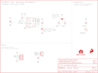

Contents
========

* [PRS14193 > CCS811 Air Quality Breakout](#prs14193--ccs811-air-quality-breakout)
	* [Schematic](#schematic)
	* [PCB](#pcb)
	* [Interactive BOM](#interactive-bom)
	* [OOMP Parts](#oomp-parts)
	* [Images](#images)
	* [Tags](#tags)
  
![][im]
# PRS14193 > CCS811 Air Quality Breakout

- ID: PROJ-SPAR-14193-STAN-01
- Hex ID: PRS14193
- Name: Sparkfun
- Description: Sparkfun
- Long Link: [http://oom.lt/PROJ-SPAR-14193-STAN-01](http://oom.lt/PROJ-SPAR-14193-STAN-01)
- Short Link: [http://oom.lt/PRS14193](http://oom.lt/PRS14193)

## Schematic
  

## PCB
  

## Interactive BOM

- Interactive BOM page: [ibom.html](https://htmlpreview.github.io/?https://github.com/oomlout/oomlout_OOMP_projects/blob/main/PROJ-SPAR-14193-STAN-01/kicad/bom/ibom.html)

## OOMP Parts
  

|OOMP Parts|
| :---: |
|CAPC-0603-X-UNMATCHED-01 C2|
|[HEAD-I01-X-PI03-01  2.54 mm 3 Pin Header  J2](https://github.com/oomlout/oomlout_OOMP_parts/tree/main/HEAD-I01-X-PI03-01/)|
|[HEAD-I01-X-PI04-01  2.54 mm 4 Pin Header  J8](https://github.com/oomlout/oomlout_OOMP_parts/tree/main/HEAD-I01-X-PI04-01/)|
|UNMATCHED-UNMATCHED-X-UNMATCHED-01 JP1, JP2, U2|
|RESE-0603-X-O1003-01 R1, R6|
|[RESE-0603-X-O472-01  SMD (0603) 4.7k Ohm Resistor  R2, R13, R14](https://github.com/oomlout/oomlout_OOMP_parts/tree/main/RESE-0603-X-O472-01/)|
|[RESE-0603-X-O103-01  SMD (0603) 10k Ohm Resistor  R10](https://github.com/oomlout/oomlout_OOMP_parts/tree/main/RESE-0603-X-O103-01/)|
|RESE-UNMATCHED-X-O103-01 R12|

## Images
  
  

|bominteractivefront|bominteractiveback|kicadPcb3d|kicadPcb3dFront|kicadPcb3dBack|eagleImage|eagleSchemImage|
| :---: | :---: | :---: | :---: | :---: | :---: | :---: |
||||||||

## Tags

- hexID: PRS14193
- oompType: PROJ
- oompSize: SPAR
- oompColor: 14193
- oompDesc: STAN
- oompIndex: 01
- oompName: CCS811 Air Quality Breakout
- sources: All source files from https://github.com/sparkfun/CCS811_Air_Quality_Breakout (source licence details in srcLicense.md)
- linkBuyPage: https://www.sparkfun.com/products/14193
- oompID: PROJ-SPAR-14193-STAN-01
- oompParts: C2,CAPC-0603-X-UNMATCHED-01
- oompParts: J2,HEAD-I01-X-PI03-01
- oompParts: J8,HEAD-I01-X-PI04-01
- oompParts: JP1,UNMATCHED-UNMATCHED-X-UNMATCHED-01
- oompParts: JP2,UNMATCHED-UNMATCHED-X-UNMATCHED-01
- oompParts: R1,RESE-0603-X-O1003-01
- oompParts: R2,RESE-0603-X-O472-01
- oompParts: R6,RESE-0603-X-O1003-01
- oompParts: R10,RESE-0603-X-O103-01
- oompParts: R12,RESE-UNMATCHED-X-O103-01
- oompParts: R13,RESE-0603-X-O472-01
- oompParts: R14,RESE-0603-X-O472-01
- oompParts: U2,UNMATCHED-UNMATCHED-X-UNMATCHED-01
- rawParts: C2,1.0uF,1.0UF-0603-16V-10%,0603,1µF ceramic capacitors,CAP-00868,,1.0uF,
- rawParts: FD1,FIDUCIAL1X2,FIDUCIAL1X2,FIDUCIAL-1X2,Fiducial Alignment Points,,,,
- rawParts: FD2,FIDUCIAL1X2,FIDUCIAL1X2,FIDUCIAL-1X2,Fiducial Alignment Points,,,,
- rawParts: FRAME1,FRAME-LETTER,FRAME-LETTER,CREATIVE_COMMONS,Schematic Frame - Letter,,,,
- rawParts: H2,STAND-OFF,STAND-OFF,STAND-OFF,Stand Off,,,,
- rawParts: H4,STAND-OFF,STAND-OFF,STAND-OFF,Stand Off,,,,
- rawParts: J2,,CONN_031X03_NO_SILK,1X03_NO_SILK,Multi connection point. Often used as Generic Header-pin footprint for 0.1 inch spaced/style header connections,,,,
- rawParts: J8,,I2C_STANDARD_NO_SILK,1X04_NO_SILK,SparkFun I2C Standard Pinout Header,,,,
- rawParts: JP1,,JUMPER-SMT_3_2-NC_TRACE_SILK,SMT-JUMPER_3_2-NC_TRACE_SILK,Normally closed trace jumper (2 of 2 connections),,,,
- rawParts: JP2,,JUMPER-SMT_2_NO_SILK,SMT-JUMPER_2_NO_SILK,Normally open jumper,,,,
- rawParts: LOGO1,SFE_LOGO_FLAME.2_INCH,SFE_LOGO_FLAME.2_INCH,SFE_LOGO_FLAME_.2,SparkFun Flame Logo,,,,
- rawParts: LOGO4,OSHW-LOGOS,OSHW-LOGOS,OSHW-LOGO-S,Open-Source Hardware (OSHW) Logo,,,,
- rawParts: R1,100k,100KOHM-0603-1/10W-1%,0603,100kΩ resistor,RES-07828,,100k,
- rawParts: R2,4.7k,4.7KOHM-0603-1/10W-1%,0603,4.7kΩ resistor,RES-07857,,4.7k,
- rawParts: R6,100k,100KOHM-0603-1/10W-1%,0603,100kΩ resistor,RES-07828,,100k,
- rawParts: R10,10k,10KOHM-0603-1/10W-1%,0603,10kΩ resistor,RES-00824,,10k,
- rawParts: R12,10k,NTC-THERMISTOR-AXIAL-0.1,AXIAL-0.1,NTC Thermistor,N/A,SEN-00250,10k,
- rawParts: R13,4.7k,4.7KOHM-0603-1/10W-1%,0603,4.7kΩ resistor,RES-07857,,4.7k,
- rawParts: R14,4.7k,4.7KOHM-0603-1/10W-1%,0603,4.7kΩ resistor,RES-07857,,4.7k,
- rawParts: U2,CCS811,CCS811,LGA10,AMS CCS811 &ndash, I2C Digital Gas Sensor,IC-13607,,CCS811,

[im]: kicadPcb3d_450.png
