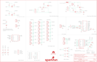

Contents
========

* [PRS14285 > Wireless Motor Driver Shield](#prs14285--wireless-motor-driver-shield)
	* [Schematic](#schematic)
	* [PCB](#pcb)
	* [Interactive BOM](#interactive-bom)
	* [OOMP Parts](#oomp-parts)
	* [Images](#images)
	* [Tags](#tags)
  
![][im]
# PRS14285 > Wireless Motor Driver Shield

- ID: PROJ-SPAR-14285-STAN-01
- Hex ID: PRS14285
- Name: Sparkfun
- Description: Sparkfun
- Long Link: [http://oom.lt/PROJ-SPAR-14285-STAN-01](http://oom.lt/PROJ-SPAR-14285-STAN-01)
- Short Link: [http://oom.lt/PRS14285](http://oom.lt/PRS14285)

## Schematic
  

## PCB
  

## Interactive BOM

- Interactive BOM page: [ibom.html](https://htmlpreview.github.io/?https://github.com/oomlout/oomlout_OOMP_projects/blob/main/PROJ-SPAR-14285-STAN-01/kicad/bom/ibom.html)

## OOMP Parts
  

|OOMP Parts|
| :---: |
|[CAPC-0603-X-NF100-V50  SMD (0603) 100 nF Capacitor (Ceramic) 50v  C1, C2](https://github.com/oomlout/oomlout_OOMP_parts/tree/main/CAPC-0603-X-NF100-V50/)|
|CAPX-UNMATCHED-X-UF10-01 C3, C4|
|[LEDS-0603-Y-STAN-01  SMD (0603) Yellow LED  D1, D5, D7](https://github.com/oomlout/oomlout_OOMP_parts/tree/main/LEDS-0603-Y-STAN-01/)|
|[LEDS-0603-G-STAN-01  SMD (0603) Green LED  D2, D8](https://github.com/oomlout/oomlout_OOMP_parts/tree/main/LEDS-0603-G-STAN-01/)|
|[LEDS-0603-R-STAN-01  SMD (0603) Red LED  D3](https://github.com/oomlout/oomlout_OOMP_parts/tree/main/LEDS-0603-R-STAN-01/)|
|[LEDS-0603-L-STAN-01  SMD (0603) Blue LED  D4, D6](https://github.com/oomlout/oomlout_OOMP_parts/tree/main/LEDS-0603-L-STAN-01/)|
|DIOD-UNMATCHED-X-UNMATCHED-01 D9, D10|
|REFU-1206-X-UNMATCHED-01 F2, F3, F4|
|UNMATCHED-UNMATCHED-X-UNMATCHED-01 J1, S1, S2, S3, S4, TP1, TP2, TP3, TP4, TP5, TP6, TP7, TP8, TP9, TP10, TP11, TP12, U1, U2, U3|
|[HEAD-I01-X-PI04-01  2.54 mm 4 Pin Header  J2, JP21, JP22](https://github.com/oomlout/oomlout_OOMP_parts/tree/main/HEAD-I01-X-PI04-01/)|
|[HEAD-I01-X-PI02-01  2.54 mm 2 Pin Header  J3](https://github.com/oomlout/oomlout_OOMP_parts/tree/main/HEAD-I01-X-PI02-01/)|
|[HEAD-I01-X-PI03-01  2.54 mm 3 Pin Header  JP0, JP1, JP2, JP3, JP4, JP5, JP6, JP7, JP8, JP9, JP10, JP11, JP12, JP13, JP14, JP15, JP16, JP17, JP18, JP19, JP23, JP24](https://github.com/oomlout/oomlout_OOMP_parts/tree/main/HEAD-I01-X-PI03-01/)|
|UNMATCHED-SO23-X-KBSS138-01 Q1, Q2|
|UNMATCHED-SO23-X-UNMATCHED-01 Q3, Q4, Q5, Q6|
|[RESE-0603-X-O102-01  SMD (0603) 1k Ohm Resistor  R1, R2, R3, R4, R6, R7, R8, R9, R10, R11, R12, R13, R14](https://github.com/oomlout/oomlout_OOMP_parts/tree/main/RESE-0603-X-O102-01/)|
|[RESE-0603-X-O331-01  SMD (0603) 330 Ohm Resistor  R5](https://github.com/oomlout/oomlout_OOMP_parts/tree/main/RESE-0603-X-O331-01/)|
|[RESE-0603-X-O103-01  SMD (0603) 10k Ohm Resistor  R15, R16, R17, R18](https://github.com/oomlout/oomlout_OOMP_parts/tree/main/RESE-0603-X-O103-01/)|

## Images
  
  

|bominteractivefront|bominteractiveback|kicadPcb3d|kicadPcb3dFront|kicadPcb3dBack|eagleImage|eagleSchemImage|pcbdraw|pcbdrawback|
| :---: | :---: | :---: | :---: | :---: | :---: | :---: | :---: | :---: |
||||||||||

## Tags

- hexID: PRS14285
- oompType: PROJ
- oompSize: SPAR
- oompColor: 14285
- oompDesc: STAN
- oompIndex: 01
- oompName: Wireless Motor Driver Shield
- sources: All source files from https://github.com/sparkfun/Wireless_Motor_Driver_Shield (source licence details in srcLicense.md)
- linkBuyPage: https://www.sparkfun.com/products/14285
- oompID: PROJ-SPAR-14285-STAN-01
- oompParts: C1,CAPC-0603-X-NF100-V50
- oompParts: C2,CAPC-0603-X-NF100-V50
- oompParts: C3,CAPX-UNMATCHED-X-UF10-01
- oompParts: C4,CAPX-UNMATCHED-X-UF10-01
- oompParts: D1,LEDS-0603-Y-STAN-01
- oompParts: D2,LEDS-0603-G-STAN-01
- oompParts: D3,LEDS-0603-R-STAN-01
- oompParts: D4,LEDS-0603-L-STAN-01
- oompParts: D5,LEDS-0603-Y-STAN-01
- oompParts: D6,LEDS-0603-L-STAN-01
- oompParts: D7,LEDS-0603-Y-STAN-01
- oompParts: D8,LEDS-0603-G-STAN-01
- oompParts: D9,DIOD-UNMATCHED-X-UNMATCHED-01
- oompParts: D10,DIOD-UNMATCHED-X-UNMATCHED-01
- oompParts: F2,REFU-1206-X-UNMATCHED-01
- oompParts: F3,REFU-1206-X-UNMATCHED-01
- oompParts: F4,REFU-1206-X-UNMATCHED-01
- oompParts: J1,UNMATCHED-UNMATCHED-X-UNMATCHED-01
- oompParts: J2,HEAD-I01-X-PI04-01
- oompParts: J3,HEAD-I01-X-PI02-01
- oompParts: JP0,HEAD-I01-X-PI03-01
- oompParts: JP1,HEAD-I01-X-PI03-01
- oompParts: JP2,HEAD-I01-X-PI03-01
- oompParts: JP3,HEAD-I01-X-PI03-01
- oompParts: JP4,HEAD-I01-X-PI03-01
- oompParts: JP5,HEAD-I01-X-PI03-01
- oompParts: JP6,HEAD-I01-X-PI03-01
- oompParts: JP7,HEAD-I01-X-PI03-01
- oompParts: JP8,HEAD-I01-X-PI03-01
- oompParts: JP9,HEAD-I01-X-PI03-01
- oompParts: JP10,HEAD-I01-X-PI03-01
- oompParts: JP11,HEAD-I01-X-PI03-01
- oompParts: JP12,HEAD-I01-X-PI03-01
- oompParts: JP13,HEAD-I01-X-PI03-01
- oompParts: JP14,HEAD-I01-X-PI03-01
- oompParts: JP15,HEAD-I01-X-PI03-01
- oompParts: JP16,HEAD-I01-X-PI03-01
- oompParts: JP17,HEAD-I01-X-PI03-01
- oompParts: JP18,HEAD-I01-X-PI03-01
- oompParts: JP19,HEAD-I01-X-PI03-01
- oompParts: JP21,HEAD-I01-X-PI04-01
- oompParts: JP22,HEAD-I01-X-PI04-01
- oompParts: JP23,HEAD-I01-X-PI03-01
- oompParts: JP24,HEAD-I01-X-PI03-01
- oompParts: Q1,UNMATCHED-SO23-X-KBSS138-01
- oompParts: Q2,UNMATCHED-SO23-X-KBSS138-01
- oompParts: Q3,UNMATCHED-SO23-X-UNMATCHED-01
- oompParts: Q4,UNMATCHED-SO23-X-UNMATCHED-01
- oompParts: Q5,UNMATCHED-SO23-X-UNMATCHED-01
- oompParts: Q6,UNMATCHED-SO23-X-UNMATCHED-01
- oompParts: R1,RESE-0603-X-O102-01
- oompParts: R2,RESE-0603-X-O102-01
- oompParts: R3,RESE-0603-X-O102-01
- oompParts: R4,RESE-0603-X-O102-01
- oompParts: R5,RESE-0603-X-O331-01
- oompParts: R6,RESE-0603-X-O102-01
- oompParts: R7,RESE-0603-X-O102-01
- oompParts: R8,RESE-0603-X-O102-01
- oompParts: R9,RESE-0603-X-O102-01
- oompParts: R10,RESE-0603-X-O102-01
- oompParts: R11,RESE-0603-X-O102-01
- oompParts: R12,RESE-0603-X-O102-01
- oompParts: R13,RESE-0603-X-O102-01
- oompParts: R14,RESE-0603-X-O102-01
- oompParts: R15,RESE-0603-X-O103-01
- oompParts: R16,RESE-0603-X-O103-01
- oompParts: R17,RESE-0603-X-O103-01
- oompParts: R18,RESE-0603-X-O103-01
- oompParts: S1,UNMATCHED-UNMATCHED-X-UNMATCHED-01
- oompParts: S2,UNMATCHED-UNMATCHED-X-UNMATCHED-01
- oompParts: S3,UNMATCHED-UNMATCHED-X-UNMATCHED-01
- oompParts: S4,UNMATCHED-UNMATCHED-X-UNMATCHED-01
- oompParts: TP1,UNMATCHED-UNMATCHED-X-UNMATCHED-01
- oompParts: TP2,UNMATCHED-UNMATCHED-X-UNMATCHED-01
- oompParts: TP3,UNMATCHED-UNMATCHED-X-UNMATCHED-01
- oompParts: TP4,UNMATCHED-UNMATCHED-X-UNMATCHED-01
- oompParts: TP5,UNMATCHED-UNMATCHED-X-UNMATCHED-01
- oompParts: TP6,UNMATCHED-UNMATCHED-X-UNMATCHED-01
- oompParts: TP7,UNMATCHED-UNMATCHED-X-UNMATCHED-01
- oompParts: TP8,UNMATCHED-UNMATCHED-X-UNMATCHED-01
- oompParts: TP9,UNMATCHED-UNMATCHED-X-UNMATCHED-01
- oompParts: TP10,UNMATCHED-UNMATCHED-X-UNMATCHED-01
- oompParts: TP11,UNMATCHED-UNMATCHED-X-UNMATCHED-01
- oompParts: TP12,UNMATCHED-UNMATCHED-X-UNMATCHED-01
- oompParts: U1,UNMATCHED-UNMATCHED-X-UNMATCHED-01
- oompParts: U2,UNMATCHED-UNMATCHED-X-UNMATCHED-01
- oompParts: U3,UNMATCHED-UNMATCHED-X-UNMATCHED-01
- rawParts: C1,0.1uF,0.1UF-0603-25V-5%,0603,0.1µF ceramic capacitors,CAP-08604,,0.1uF,
- rawParts: C2,0.1uF,0.1UF-0603-25V-5%,0603,0.1µF ceramic capacitors,CAP-08604,,0.1uF,
- rawParts: C3,10uF,10UF-1210-50V-20%,1210,10.0µF ceramic capacitors,CAP-09824,,10uF,
- rawParts: C4,10uF,10UF-1210-50V-20%,1210,10.0µF ceramic capacitors,CAP-09824,,10uF,
- rawParts: D1,Yellow,LED-YELLOW0603,LED-0603,Yellow SMD LED,DIO-09003,,Yellow,
- rawParts: D2,GREEN,LED-GREEN0603,LED-0603,Green SMD LED,DIO-00821,,GREEN,
- rawParts: D3,RED,LED-RED0603,LED-0603,Red SMD LED,DIO-00819,,RED,
- rawParts: D4,BLUE,LED-BLUE0603,LED-0603,Blue SMD LED,DIO-08575,,BLUE,
- rawParts: D5,Yellow,LED-YELLOW0603,LED-0603,Yellow SMD LED,DIO-09003,,Yellow,
- rawParts: D6,BLUE,LED-BLUE0603,LED-0603,Blue SMD LED,DIO-08575,,BLUE,
- rawParts: D7,Yellow,LED-YELLOW0603,LED-0603,Yellow SMD LED,DIO-09003,,Yellow,
- rawParts: D8,GREEN,LED-GREEN0603,LED-0603,Green SMD LED,DIO-00821,,GREEN,
- rawParts: D9,B340A,DIODE-SCHOTTKY-B340A,SMA-DIODE,Schottky diodes in SFEs production catalog,DIO-09886,,B340A,
- rawParts: D10,B340A,DIODE-SCHOTTKY-B340A,SMA-DIODE,Schottky diodes in SFEs production catalog,DIO-09886,,B340A,
- rawParts: F2,,PTCSMD,PTC-1206,Resettable Fuse PTC,RES-11150,,,
- rawParts: F3,,PTCSMD,PTC-1206,Resettable Fuse PTC,RES-11150,,,
- rawParts: F4,,PTCSMD,PTC-1206,Resettable Fuse PTC,RES-11150,,,
- rawParts: FID1,FIDUCIAL1X2,FIDUCIAL1X2,FIDUCIAL-1X2,Fiducial Alignment Points,,,,
- rawParts: FID2,FIDUCIAL1X2,FIDUCIAL1X2,FIDUCIAL-1X2,Fiducial Alignment Points,,,,
- rawParts: FID3,FIDUCIAL1X2,FIDUCIAL1X2,FIDUCIAL-1X2,Fiducial Alignment Points,,,,
- rawParts: FID4,FIDUCIAL1X2,FIDUCIAL1X2,FIDUCIAL-1X2,Fiducial Alignment Points,,,,
- rawParts: FRAME1,FRAME-LEDGER,FRAME-LEDGER,CREATIVE_COMMONS,Schematic Frame,,,,
- rawParts: J1,5.5x2.1mm Barrel,POWER_JACKSMD,POWER_JACK_SMD,Power Jack Connector,CONN-08106,PRT-12748,5.5x2.1mm Barrel,
- rawParts: J2,,CONN_04SMD_RA_FEMALE,1X04_SMD_RA_FEMALE,Multi connection point. Often used as Generic Header-pin footprint for 0.1 inch spaced/style header connections,CONN-12382,,,
- rawParts: J3,,CONN_021X02_NO_SILK,1X02_NO_SILK,Multi connection point. Often used as Generic Header-pin footprint for 0.1 inch spaced/style header connections,,,,
- rawParts: JP0,D0,M03LOCK,1X03_LOCK,Header 3,,,,
- rawParts: JP1,D1,M03LOCK,1X03_LOCK,Header 3,,,,
- rawParts: JP2,D2,M03LOCK,1X03_LOCK,Header 3,,,,
- rawParts: JP3,D3,M03LOCK,1X03_LOCK,Header 3,,,,
- rawParts: JP4,D4,M03LOCK,1X03_LOCK,Header 3,,,,
- rawParts: JP5,D5,M03LOCK,1X03_LOCK,Header 3,,,,
- rawParts: JP6,D6,M03LOCK,1X03_LOCK,Header 3,,,,
- rawParts: JP7,D7,M03LOCK,1X03_LOCK,Header 3,,,,
- rawParts: JP8,D8,M03LOCK,1X03_LOCK,Header 3,,,,
- rawParts: JP9,D9,M03LOCK,1X03_LOCK,Header 3,,,,
- rawParts: JP10,D10,M03LOCK,1X03_LOCK,Header 3,,,,
- rawParts: JP11,D11,M03LOCK,1X03_LOCK,Header 3,,,,
- rawParts: JP12,D12,M03LOCK,1X03_LOCK,Header 3,,,,
- rawParts: JP13,D13,M03LOCK,1X03_LOCK,Header 3,,,,
- rawParts: JP14,A0,M03LOCK,1X03_LOCK,Header 3,,,,
- rawParts: JP15,A1,M03LOCK,1X03_LOCK,Header 3,,,,
- rawParts: JP16,A2,M03LOCK,1X03_LOCK,Header 3,,,,
- rawParts: JP17,A3,M03LOCK,1X03_LOCK,Header 3,,,,
- rawParts: JP18,A4,M03LOCK,1X03_LOCK,Header 3,,,,
- rawParts: JP19,A5,M03LOCK,1X03_LOCK,Header 3,,,,
- rawParts: JP21,,M04PTH,1X04@1,Header 4,CONN-09696,,,
- rawParts: JP22,,M04LOCK,1X04_LOCK@1,Header 4,CONN-09696,,,
- rawParts: JP23,,M031X03_NO_SILK,1X03_NO_SILK,Header 3,,,,
- rawParts: JP24,,M031X03_NO_SILK,1X03_NO_SILK,Header 3,,,,
- rawParts: LOGO1,OSHW-LOGOM,OSHW-LOGOM,OSHW-LOGO-M,Open Source Hardware Logo,,,,
- rawParts: LOGO2,SFE_LOGO_NAME_FLAME.1_INCH,SFE_LOGO_NAME_FLAME.1_INCH,SFE_LOGO_NAME_FLAME_.1,SFE Logo, name and flame,,,,
- rawParts: LOGO3,SFE_LOGO_FLAME.2_INCH,SFE_LOGO_FLAME.2_INCH,SFE_LOGO_FLAME_.2,SFE Logo, flame only,,,,
- rawParts: LOGO4,SFE_LOGO_NAME_FLAME.1_INCH,SFE_LOGO_NAME_FLAME.1_INCH,SFE_LOGO_NAME_FLAME_.1,SFE Logo, name and flame,,,,
- rawParts: Q1,MOSFET-NCHANNELBSS138,MOSFET-NCHANNELBSS138,SOT23-3,Common NMOSFET Parts,TRANS-00830,,200mA/50V,
- rawParts: Q2,MOSFET-NCHANNELBSS138,MOSFET-NCHANNELBSS138,SOT23-3,Common NMOSFET Parts,TRANS-00830,,200mA/50V,
- rawParts: Q3,MMBT2222A,TRANSISTOR_NPNMMBT2222A,SOT23-3,Generic NPN BJT,TRANS-08049,,MMBT2222A,
- rawParts: Q4,DMG2307L,MOSFET-PCHANNELDMG2307L,SOT23-3,Generic PMOSFET,TRANS-11308,,2.5A/30V,
- rawParts: Q5,DMG2307L,MOSFET-PCHANNELDMG2307L,SOT23-3,Generic PMOSFET,TRANS-11308,,2.5A/30V,
- rawParts: Q6,DMG2307L,MOSFET-PCHANNELDMG2307L,SOT23-3,Generic PMOSFET,TRANS-11308,,2.5A/30V,
- rawParts: R1,1k,1KOHM-0603-1/10W-1%,0603,1kΩ resistor,RES-07856,,1k,
- rawParts: R2,1k,1KOHM-0603-1/10W-1%,0603,1kΩ resistor,RES-07856,,1k,
- rawParts: R3,1k,1KOHM-0603-1/10W-1%,0603,1kΩ resistor,RES-07856,,1k,
- rawParts: R4,1k,1KOHM-0603-1/10W-1%,0603,1kΩ resistor,RES-07856,,1k,
- rawParts: R5,330,330OHM-0603-1/10W-1%,0603,330Ω resistor,RES-00818,,330,
- rawParts: R6,1k,1KOHM-0603-1/10W-1%,0603,1kΩ resistor,RES-07856,,1k,
- rawParts: R7,1k,1KOHM-0603-1/10W-1%,0603,1kΩ resistor,RES-07856,,1k,
- rawParts: R8,1k,1KOHM-0603-1/10W-1%,0603,1kΩ resistor,RES-07856,,1k,
- rawParts: R9,1k,1KOHM-0603-1/10W-1%,0603,1kΩ resistor,RES-07856,,1k,
- rawParts: R10,1k,1KOHM-0603-1/10W-1%,0603,1kΩ resistor,RES-07856,,1k,
- rawParts: R11,1k,1KOHM-0603-1/10W-1%,0603,1kΩ resistor,RES-07856,,1k,
- rawParts: R12,1k,1KOHM-0603-1/10W-1%,0603,1kΩ resistor,RES-07856,,1k,
- rawParts: R13,1k,1KOHM-0603-1/10W-1%,0603,1kΩ resistor,RES-07856,,1k,
- rawParts: R14,1k,1KOHM-0603-1/10W-1%,0603,1kΩ resistor,RES-07856,,1k,
- rawParts: R15,10k,10KOHM-0603-1/10W-1%,0603,10kΩ resistor,RES-00824,,10k,
- rawParts: R16,10k,10KOHM-0603-1/10W-1%,0603,10kΩ resistor,RES-00824,,10k,
- rawParts: R17,10k,10KOHM-0603-1/10W-1%,0603,10kΩ resistor,RES-00824,,10k,
- rawParts: R18,10k,10KOHM-0603-1/10W-1%,0603,10kΩ resistor,RES-00824,,10k,
- rawParts: S1,,SWITCH-DPDTAYZ0202,AYZ0202,DPDT Version of the COM-00597,SWCH-08179,,DPDT,
- rawParts: S2,DPDT,SWITCH-DPDTAYZ0202,AYZ0202,DPDT Version of the COM-00597,SWCH-08179,,DPDT,
- rawParts: S3,,SWITCH-DPDTAYZ0202,AYZ0202,DPDT Version of the COM-00597,SWCH-08179,,DPDT,
- rawParts: S4,RESET,TAC_SWITCHSMD,TACTILE-SWITCH-SMD,Momentary Switch,SWCH-08247,,TAC_SWITCHSMD,
- rawParts: SJ5,,SOLDERJUMPERNO,SJ_2S-NO,Solder Jumper,,,,
- rawParts: TP1,,TEST-POINT3X5,PAD.03X.05,Bare copper test points for troubleshooting or ICT,,,,
- rawParts: TP2,,TEST-POINT3X5,PAD.03X.05,Bare copper test points for troubleshooting or ICT,,,,
- rawParts: TP3,,TEST-POINT3X5,PAD.03X.05,Bare copper test points for troubleshooting or ICT,,,,
- rawParts: TP4,,TEST-POINT3X5,PAD.03X.05,Bare copper test points for troubleshooting or ICT,,,,
- rawParts: TP5,,TEST-POINT3X5,PAD.03X.05,Bare copper test points for troubleshooting or ICT,,,,
- rawParts: TP6,,TEST-POINT3X5,PAD.03X.05,Bare copper test points for troubleshooting or ICT,,,,
- rawParts: TP7,,TEST-POINT3X5,PAD.03X.05,Bare copper test points for troubleshooting or ICT,,,,
- rawParts: TP8,,TEST-POINT3X5,PAD.03X.05,Bare copper test points for troubleshooting or ICT,,,,
- rawParts: TP9,,TEST-POINT3X5,PAD.03X.05,Bare copper test points for troubleshooting or ICT,,,,
- rawParts: TP10,,TEST-POINT3X5,PAD.03X.05,Bare copper test points for troubleshooting or ICT,,,,
- rawParts: TP11,,TEST-POINT3X5,PAD.03X.05,Bare copper test points for troubleshooting or ICT,,,,
- rawParts: TP12,,TEST-POINT3X5,PAD.03X.05,Bare copper test points for troubleshooting or ICT,,,,
- rawParts: U1,XBEE-1XBEE-1_LOCK,XBEE-1XBEE-1_LOCK,XBEE-1_LOCK,Xbee module footprints,,,,
- rawParts: U2,ARDUINO,ARDUINO_R3_SHIELDUNO_R3_SHIELD_NOLABELS_LOCK,UNO_R3_SHIELD_NOLABELS_LOCK,Shield form compatible with the Arduino Uno R3.,,,,
- rawParts: U3,TB6612FNG,TB6612FNG,SSOP24,Toshiba 1A dual motor driver,IC-09363,,TB6612FNG,

[im]: kicadPcb3d_450.png
