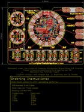
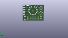
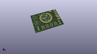

Contents
========

* [PROJ-SPAR-14346-STAN-01>LilyPad ProtoSnap Plus](#proj-spar-14346-stan-01lilypad-protosnap-plus)
	* [Images](#images)
	* [Interactive BOM](#interactive-bom)
	* [OOMP Parts](#oomp-parts)
	* [Tags](#tags)
  
![][im]
# PROJ-SPAR-14346-STAN-01>LilyPad ProtoSnap Plus

- ID: PROJ-SPAR-14346-STAN-01
- Hex ID: PRS14346
- Name: LilyPad ProtoSnap Plus
- Description: 

## Images
  
  

|eagleImage|kicadPcb3dFront|kicadPcb3dBack|kicadPcb3d|
| :---: | :---: | :---: | :---: |
|||||

## Interactive BOM

- Interactive BOM page: [ibom.html](kicad/bom/ibom.html)

## OOMP Parts
  

|OOMP Parts|
| :---: |
|UNMATCHED-UNMATCHED-X-UNMATCHED-01, B1, 13.97, 40.64, 90,B1, Buzzer, BUZZER-CCV, SparkFun-Electromechanical, (0.55, 1.6), R90|
|CAPC-0402-X-NF100-V50, C2, 58.80099695199999, 55.292628048, 180,C2, 0.1uF, 0402, SparkFun-Capacitors, (2.31499988, 2.17687512), R180|
|CAPC-0402-X-NF100-V50, C3, 65.43674695200001, 65.516128048, 45,C3, 0.1uF, 0402, SparkFun-Capacitors, (2.57624988, 2.57937512), R45|
|CAPC-0402-X-NF100-V50, C4, 66.167003048, 57.531003047999995, 90,C4, 0.1uF, 0402, SparkFun-Capacitors, (2.60500012, 2.26500012), R90|
|CAPC-0402-X-UNMATCHED-01, C5, 55.117999999999995, 61.46799365, 270,C5, 1.0uF, 0402, SparkFun-Capacitors, (2.17, 2.41999975), R270|
|CAPC-0603-X-UNMATCHED-01, C6, 71.247003048, 55.371996951999996, 0,C6, 4.7uF, 0603, SparkFun-Capacitors, (2.80500012, 2.17999988), R0|
|CAPC-0603-X-UNMATCHED-01, C7, 59.81699695199999, 69.469, 90,C7, 4.7uF, 0603, SparkFun-Capacitors, (2.35499988, 2.735), R90|
|CAPC-0603-X-UNMATCHED-01, C8, 49.212496952, 37.465003048, 180,C8, 4.7uF, 0603, SparkFun-Capacitors, (1.93749988, 1.47500012), R180|
|UNMATCHED-UNMATCHED-X-UNMATCHED-01, D1, 47.625003047999996, 41.528999999999996, 0,D1, 3A/40V/500mV, SMA-DIODE, SparkFun-DiscreteSemi, (1.87500012, 1.635), R0|
|UNMATCHED-UNMATCHED-X-UNMATCHED-01, D2, 67.30999999999999, 13.97, 0,D2, GREEN, LED-1206, SparkFun-LED, (2.65, 0.55), R0|
|UNMATCHED-UNMATCHED-X-UNMATCHED-01, D3, 34.29, 13.97, 0,D3, Yellow, LED-1206, SparkFun-LED, (1.35, 0.55), R0|
|UNMATCHED-UNMATCHED-X-UNMATCHED-01, D4, 27.94, 13.97, 0,D4, Yellow, LED-1206, SparkFun-LED, (1.1, 0.55), R0|
|UNMATCHED-UNMATCHED-X-UNMATCHED-01, D5, 44.449999999999996, 13.97, 0,D5, RED, LED-1206, SparkFun-LED, (1.75, 0.55), R0|
|UNMATCHED-UNMATCHED-X-UNMATCHED-01, D6, 50.8, 13.97, 0,D6, RED, LED-1206, SparkFun-LED, (2, 0.55), R0|
|UNMATCHED-UNMATCHED-X-UNMATCHED-01, D7, 60.959999999999994, 13.97, 0,D7, GREEN, LED-1206, SparkFun-LED, (2.4, 0.55), R0|
|UNMATCHED-UNMATCHED-X-UNMATCHED-01, D8, 77.46999999999998, 13.97, 0,D8, BLUE, LED-1206, SparkFun-LED, (3.05, 0.55), R0|
|UNMATCHED-UNMATCHED-X-UNMATCHED-01, D9, 83.82, 13.97, 0,D9, BLUE, LED-1206, SparkFun-LED, (3.3, 0.55), R0|
|UNMATCHED-UNMATCHED-X-UNMATCHED-01, D10, 55.88, 52.06999999999999, 270,D10, XZM2CRKM2DGFBB45SCCB, PLCC4SMDLED, SparkFun-LED, (2.2, 2.05), R270|
|UNMATCHED-UNMATCHED-X-UNMATCHED-01, J1, 46.931581269999995, 72.16901872999999, 294,J1, SEWTAP_LONG-2SIDE, PETAL-LONG-1-2SIDE, LilyPad-Wearables, (1.84770005, 2.84129995), R294|
|UNMATCHED-UNMATCHED-X-UNMATCHED-01, J2, 39.53001873, 66.79184050799999, 318,J2, SEWTAP_LONG-2SIDE, PETAL-LONG-1-2SIDE, LilyPad-Wearables, (1.55629995, 2.62960002), R318|
|UNMATCHED-UNMATCHED-X-UNMATCHED-01, J3, 34.95801873, 58.86958127, 342,J3, SEWTAP_LONG-2SIDE, PETAL-LONG-1-2SIDE, LilyPad-Wearables, (1.37629995, 2.31770005), R342|
|UNMATCHED-UNMATCHED-X-UNMATCHED-01, J4, 34.000440508, 49.7713, 6,J4, SEWTAP_LONG-2SIDE, PETAL-LONG-1-2SIDE, LilyPad-Wearables, (1.33860002, 1.9595), R6|
|UNMATCHED-UNMATCHED-X-UNMATCHED-01, J5, 36.827459492, 41.06925949199999, 30,J5, SEWTAP_LONG-2SIDE, PETAL-LONG-1-2SIDE, LilyPad-Wearables, (1.44989998, 1.61689998), R30|
|UNMATCHED-UNMATCHED-X-UNMATCHED-01, J6, 42.948859492, 34.27221873, 54,J6, SEWTAP_LONG-2SIDE, PETAL-LONG-1-2SIDE, LilyPad-Wearables, (1.69089998, 1.34929995), R54|
|UNMATCHED-UNMATCHED-X-UNMATCHED-01, J7, 51.305459492, 30.551118729999995, 78,J7, SEWTAP_LONG-2SIDE, PETAL-LONG-1-2SIDE, LilyPad-Wearables, (2.01989998, 1.20279995), R78|
|UNMATCHED-UNMATCHED-X-UNMATCHED-01, J8, 60.454540507999994, 30.551118729999995, 102,J8, SEWTAP_LONG-2SIDE, PETAL-LONG-1-2SIDE, LilyPad-Wearables, (2.38010002, 1.20279995), R102|
|UNMATCHED-UNMATCHED-X-UNMATCHED-01, J9, 68.811140508, 34.27221873, 126,J9, SEWTAP_LONG-2SIDE, PETAL-LONG-1-2SIDE, LilyPad-Wearables, (2.70910002, 1.34929995), R126|
|UNMATCHED-UNMATCHED-X-UNMATCHED-01, J10, 74.93254050799999, 41.06925949199999, 150,J10, SEWTAP_LONG-2SIDE, PETAL-LONG-1-2SIDE, LilyPad-Wearables, (2.95010002, 1.61689998), R150|
|UNMATCHED-UNMATCHED-X-UNMATCHED-01, J11, 77.759559492, 49.7713, 174,J11, SEWTAP_LONG-2SIDE, PETAL-LONG-1-2SIDE, LilyPad-Wearables, (3.06139998, 1.9595), R174|
|UNMATCHED-UNMATCHED-X-UNMATCHED-01, J12, 76.80198127, 58.86958127, 198,J12, SEWTAP_LONG-2SIDE, PETAL-LONG-1-2SIDE, LilyPad-Wearables, (3.02370005, 2.31770005), R198|
|UNMATCHED-UNMATCHED-X-UNMATCHED-01, J13, 72.22998127, 66.79184050799999, 222,J13, SEWTAP_LONG-2SIDE, PETAL-LONG-1-2SIDE, LilyPad-Wearables, (2.84370005, 2.62960002), R222|
|UNMATCHED-UNMATCHED-X-UNMATCHED-01, J14, 64.82841873, 72.16901872999999, 246,J14, SEWTAP_LONG-2SIDE, PETAL-LONG-1-2SIDE, LilyPad-Wearables, (2.55229995, 2.84129995), R246|
|ERROR, J15 AMP FCI, 0, 0, 0,J15, AMP, FCI, 10103594-0001LF, USB-MICROB-PTH, SparkFun-Connectors, (2.2, 2.934375), R180|
|UNMATCHED-UNMATCHED-X-UNMATCHED-01, J16, 55.88, 38.57625, 180,J16, JST-2-SMD, SparkFun-Connectors, (2.2, 1.51875), R180|
|UNMATCHED-UNMATCHED-X-UNMATCHED-01, JP1, 67.30999999999999, 8.889999999999999, 0,JP1, SEWTAP_SMALL-2SIDE, PETAL-SMALL-2SIDE, LilyPad-Wearables, (2.65, 0.35), R0|
|UNMATCHED-UNMATCHED-X-UNMATCHED-01, JP4, 60.959999999999994, 8.889999999999999, 0,JP4, SEWTAP_SMALL-2SIDE, PETAL-SMALL-2SIDE, LilyPad-Wearables, (2.4, 0.35), R0|
|UNMATCHED-UNMATCHED-X-UNMATCHED-01, JP5, 77.46999999999998, 8.889999999999999, 0,JP5, SEWTAP_SMALL-2SIDE, PETAL-SMALL-2SIDE, LilyPad-Wearables, (3.05, 0.35), R0|
|UNMATCHED-UNMATCHED-X-UNMATCHED-01, JP6, 83.82, 8.889999999999999, 0,JP6, SEWTAP_SMALL-2SIDE, PETAL-SMALL-2SIDE, LilyPad-Wearables, (3.3, 0.35), R0|
|UNMATCHED-UNMATCHED-X-UNMATCHED-01, JP7, 67.30999999999999, 17.779999999999998, 180,JP7, SEWTAP_SMALL-2SIDE, PETAL-SMALL-2SIDE, LilyPad-Wearables, (2.65, 0.7), R180|
|UNMATCHED-UNMATCHED-X-UNMATCHED-01, JP8, 60.959999999999994, 17.779999999999998, 180,JP8, SEWTAP_SMALL-2SIDE, PETAL-SMALL-2SIDE, LilyPad-Wearables, (2.4, 0.7), R180|
|UNMATCHED-UNMATCHED-X-UNMATCHED-01, JP9, 83.82, 17.779999999999998, 180,JP9, SEWTAP_SMALL-2SIDE, PETAL-SMALL-2SIDE, LilyPad-Wearables, (3.3, 0.7), R180|
|UNMATCHED-UNMATCHED-X-UNMATCHED-01, JP10, 77.46999999999998, 17.779999999999998, 180,JP10, SEWTAP_SMALL-2SIDE, PETAL-SMALL-2SIDE, LilyPad-Wearables, (3.05, 0.7), R180|
|UNMATCHED-UNMATCHED-X-UNMATCHED-01, JP12, 13.97, 17.779999999999998, 180,JP12, SEWTAP_MEDIUM-2SIDE, PETAL-MEDIUM-2SIDE, LilyPad-Wearables, (0.55, 0.7), R180|
|UNMATCHED-UNMATCHED-X-UNMATCHED-01, JP13, 13.97, 10.16, 0,JP13, SEWTAP_MEDIUM-2SIDE, PETAL-MEDIUM-2SIDE, LilyPad-Wearables, (0.55, 0.4), R0|
|UNMATCHED-UNMATCHED-X-UNMATCHED-01, JP20, 34.29, 17.779999999999998, 180,JP20, SEWTAP_SMALL-2SIDE, PETAL-SMALL-2SIDE, LilyPad-Wearables, (1.35, 0.7), R180|
|UNMATCHED-UNMATCHED-X-UNMATCHED-01, JP21, 34.29, 8.889999999999999, 0,JP21, SEWTAP_SMALL-2SIDE, PETAL-SMALL-2SIDE, LilyPad-Wearables, (1.35, 0.35), R0|
|UNMATCHED-UNMATCHED-X-UNMATCHED-01, JP22, 27.94, 17.779999999999998, 180,JP22, SEWTAP_SMALL-2SIDE, PETAL-SMALL-2SIDE, LilyPad-Wearables, (1.1, 0.7), R180|
|UNMATCHED-UNMATCHED-X-UNMATCHED-01, JP23, 27.94, 8.889999999999999, 0,JP23, SEWTAP_SMALL-2SIDE, PETAL-SMALL-2SIDE, LilyPad-Wearables, (1.1, 0.35), R0|
|UNMATCHED-UNMATCHED-X-UNMATCHED-01, JP24, 50.8, 17.779999999999998, 180,JP24, SEWTAP_SMALL-2SIDE, PETAL-SMALL-2SIDE, LilyPad-Wearables, (2, 0.7), R180|
|UNMATCHED-UNMATCHED-X-UNMATCHED-01, JP25, 44.449999999999996, 8.889999999999999, 0,JP25, SEWTAP_SMALL-2SIDE, PETAL-SMALL-2SIDE, LilyPad-Wearables, (1.75, 0.35), R0|
|UNMATCHED-UNMATCHED-X-UNMATCHED-01, JP26, 44.449999999999996, 17.779999999999998, 180,JP26, SEWTAP_SMALL-2SIDE, PETAL-SMALL-2SIDE, LilyPad-Wearables, (1.75, 0.7), R180|
|UNMATCHED-UNMATCHED-X-UNMATCHED-01, JP27, 50.8, 8.889999999999999, 0,JP27, SEWTAP_SMALL-2SIDE, PETAL-SMALL-2SIDE, LilyPad-Wearables, (2, 0.35), R0|
|UNMATCHED-0603-X-UNMATCHED-01, LED1, 62.484003048, 36.57599999999999, 0,LED1, RED, LED-0603, SparkFun-LED, (2.46000012, 1.44), R0|
|UNMATCHED-0603-X-UNMATCHED-01, LED2, 42.068743649999995, 52.06999999999999, 270,LED2, Yellow, LED-0603, SparkFun-LED, (1.65624975, 2.05), R270|
|UNMATCHED-0603-X-UNMATCHED-01, LED3, 40.63999365, 52.069996952, 270,LED3, GREEN, LED-0603, SparkFun-LED, (1.59999975, 2.04999988), R270|
|UNMATCHED-0603-X-UNMATCHED-01, LED4, 49.291875, 52.06999999999999, 90,LED4, WHITE, LED-0603, SparkFun-LED, (1.940625, 2.05), R90|
|UNMATCHED-0603-X-UNMATCHED-01, LED5, 51.990624999999994, 52.06999999999999, 90,LED5, WHITE, LED-0603, SparkFun-LED, (2.046875, 2.05), R90|
|UNMATCHED-0603-X-UNMATCHED-01, LED6, 50.64124999999999, 52.06999999999999, 90,LED6, WHITE, LED-0603, SparkFun-LED, (1.99375, 2.05), R90|
|UNMATCHED-0603-X-UNMATCHED-01, LED7, 45.24375, 52.06999999999999, 90,LED7, WHITE, LED-0603, SparkFun-LED, (1.78125, 2.05), R90|
|UNMATCHED-0603-X-UNMATCHED-01, LED8, 47.942499999999995, 52.06999999999999, 90,LED8, WHITE, LED-0603, SparkFun-LED, (1.8875, 2.05), R90|
|UNMATCHED-0603-X-UNMATCHED-01, LED9, 46.593125, 52.06999999999999, 90,LED9, WHITE, LED-0603, SparkFun-LED, (1.834375, 2.05), R90|
|<table><tr><td></td><td> R1</td><td>[RESE-0603-X-O331-01 SMD (0603) 330 Ohm Resistor](https://github.com/oomlout/oomlout_OOMP_parts/tree/main/RESE-0603-X-O331-01/)</td><td>[R6331](https://github.com/oomlout/oomlout_OOMP_parts/tree/main/RESE-0603-X-O331-01/)</td></tr></table>|
|<table><tr><td></td><td> R2</td><td>[RESE-0603-X-O103-01 SMD (0603) 10k Ohm Resistor](https://github.com/oomlout/oomlout_OOMP_parts/tree/main/RESE-0603-X-O103-01/)</td><td>[R6103](https://github.com/oomlout/oomlout_OOMP_parts/tree/main/RESE-0603-X-O103-01/)</td></tr></table>|
|<table><tr><td></td><td> R3</td><td>[RESE-0603-X-O103-01 SMD (0603) 10k Ohm Resistor](https://github.com/oomlout/oomlout_OOMP_parts/tree/main/RESE-0603-X-O103-01/)</td><td>[R6103](https://github.com/oomlout/oomlout_OOMP_parts/tree/main/RESE-0603-X-O103-01/)</td></tr></table>|
|RESE-0402-X-UNMATCHED-01, R4, 55.895875, 69.69125, 90,R4, 22, 0402, SparkFun-Resistors, (2.200625, 2.74375), R90|
|RESE-0402-X-UNMATCHED-01, R5, 57.213499999999996, 69.69125, 90,R5, 22, 0402, SparkFun-Resistors, (2.2525, 2.74375), R90|
|RESE-0603-X-UNMATCHED-01, R6, 43.576871952, 51.990628048, 90,R6, 2.2k, 0603, SparkFun-Resistors, (1.71562488, 2.04687512), R90|
|<table><tr><td></td><td> R7</td><td>[RESE-0603-X-O331-01 SMD (0603) 330 Ohm Resistor](https://github.com/oomlout/oomlout_OOMP_parts/tree/main/RESE-0603-X-O331-01/)</td><td>[R6331](https://github.com/oomlout/oomlout_OOMP_parts/tree/main/RESE-0603-X-O331-01/)</td></tr></table>|
|RESE-0402-X-UNMATCHED-01, R8, 49.291875, 49.291875, 270,R8, 470, 0402, SparkFun-Resistors, (1.940625, 1.940625), R270|
|RESE-0402-X-UNMATCHED-01, R9, 51.990624999999994, 49.291875, 270,R9, 470, 0402, SparkFun-Resistors, (2.046875, 1.940625), R270|
|RESE-0402-X-UNMATCHED-01, R10, 50.64124999999999, 49.291875, 270,R10, 470, 0402, SparkFun-Resistors, (1.99375, 1.940625), R270|
|RESE-0402-X-UNMATCHED-01, R11, 45.24375, 49.291875, 270,R11, 470, 0402, SparkFun-Resistors, (1.78125, 1.940625), R270|
|RESE-0402-X-UNMATCHED-01, R12, 47.942499999999995, 49.291875, 270,R12, 470, 0402, SparkFun-Resistors, (1.8875, 1.940625), R270|
|RESE-0402-X-UNMATCHED-01, R13, 46.593125, 49.291875, 270,R13, 470, 0402, SparkFun-Resistors, (1.834375, 1.940625), R270|
|<table><tr><td></td><td> R14</td><td>[RESE-0603-X-O331-01 SMD (0603) 330 Ohm Resistor](https://github.com/oomlout/oomlout_OOMP_parts/tree/main/RESE-0603-X-O331-01/)</td><td>[R6331](https://github.com/oomlout/oomlout_OOMP_parts/tree/main/RESE-0603-X-O331-01/)</td></tr></table>|
|RESE-0402-X-UNMATCHED-01, R15, 53.49875, 50.561875, 90,R15, 22, 0402, SparkFun-Resistors, (2.10625, 1.990625), R90|
|RESE-0402-X-UNMATCHED-01, R16, 56.03874999999999, 49.291875, 0,R16, 22, 0402, SparkFun-Resistors, (2.20625, 1.940625), R0|
|RESE-0603-X-UNMATCHED-01, R17, 89.535, 3.8099999999999996, 180,R17, 1k, 0603, SparkFun-Resistors, (3.525, 0.15), R180|
|<table><tr><td></td><td> R24</td><td>[RESE-0603-X-O103-01 SMD (0603) 10k Ohm Resistor](https://github.com/oomlout/oomlout_OOMP_parts/tree/main/RESE-0603-X-O103-01/)</td><td>[R6103](https://github.com/oomlout/oomlout_OOMP_parts/tree/main/RESE-0603-X-O103-01/)</td></tr></table>|
|RESE-0603-X-UNMATCHED-01, R25, 34.29, 11.7475, 0,R25, 100, 0603, SparkFun-Resistors, (1.35, 0.4625), R0|
|RESE-0603-X-UNMATCHED-01, R26, 27.94, 11.7475, 0,R26, 100, 0603, SparkFun-Resistors, (1.1, 0.4625), R0|
|RESE-0603-X-UNMATCHED-01, R27, 44.449999999999996, 11.7475, 0,R27, 150, 0603, SparkFun-Resistors, (1.75, 0.4625), R0|
|RESE-0603-X-UNMATCHED-01, R28, 50.8, 11.7475, 0,R28, 150, 0603, SparkFun-Resistors, (2, 0.4625), R0|
|RESE-0603-X-UNMATCHED-01, R29, 67.30999999999999, 11.7475, 0,R29, 100, 0603, SparkFun-Resistors, (2.65, 0.4625), R0|
|RESE-0603-X-UNMATCHED-01, R30, 60.959999999999994, 11.7475, 0,R30, 100, 0603, SparkFun-Resistors, (2.4, 0.4625), R0|
|RESE-0603-X-UNMATCHED-01, R31, 77.46999999999998, 11.7475, 0,R31, 150, 0603, SparkFun-Resistors, (3.05, 0.4625), R0|
|RESE-0603-X-UNMATCHED-01, R32, 83.82, 11.7475, 0,R32, 150, 0603, SparkFun-Resistors, (3.3, 0.4625), R0|
|UNMATCHED-UNMATCHED-X-UNMATCHED-01, S1, 68.19899364999999, 46.99, 90,S1, SWITCH_DPDT_SMD_AYZ0202, SparkFun-Switches, (2.68499975, 1.85), R90|
|UNMATCHED-UNMATCHED-X-UNMATCHED-01, S2, 43.815, 56.896003048, 180,S2, !RESET, TACTILE_SWITCH_SMD_5.2MM, SparkFun-Switches, (1.725, 2.24000012), R180|
|UNMATCHED-UNMATCHED-X-UNMATCHED-01, S3, 97.78999999999999, 13.334999999999999, 270,S3, SWITCH_DPDT_SMD_AYZ0202, SparkFun-Switches, (3.85, 0.525), R270|
|UNMATCHED-UNMATCHED-X-UNMATCHED-01, S4, 13.97, 13.97, 0,S4, MOMENTARY-SWITCH-SPST-SMD-5.2-REDUNDANT, TACTILE_SWITCH_SMD_5.2MM, SparkFun-Switches, (0.55, 0.55), R0|
|UNMATCHED-UNMATCHED-X-UNMATCHED-01, SLIDEOFF, 97.78999999999999, 8.128, 0,SLIDEOFF, SEWTAP_MEDIUM-2SIDE, PETAL-MEDIUM-2SIDE, LilyPad-Wearables, (3.85, 0.32), R0|
|UNMATCHED-UNMATCHED-X-UNMATCHED-01, SLIDEON, 97.78999999999999, 18.541999999999998, 180,SLIDEON, SEWTAP_MEDIUM-2SIDE, PETAL-MEDIUM-2SIDE, LilyPad-Wearables, (3.85, 0.73), R180|
|UNMATCHED-UNMATCHED-X-UNMATCHED-01, U$38, 10.21999988, 34.140000046, 330,U$38, SEWTAP_SMALL-2SIDE, PETAL-SMALL-2SIDE, LilyPad-Wearables, (0.4023622, 1.34409449), R330|
|UNMATCHED-UNMATCHED-X-UNMATCHED-01, U$39, 17.720000119999998, 47.129999974, 150,U$39, SEWTAP_SMALL-2SIDE, PETAL-SMALL-2SIDE, LilyPad-Wearables, (0.6976378, 1.85551181), R150|
|UNMATCHED-UNMATCHED-X-UNMATCHED-01, U1, 63.5, 40.63999365, 90,U1, MCP73831, SOT23-5, SparkFun-PowerIC, (2.5, 1.59999975), R90|
|UNMATCHED-UNMATCHED-X-UNMATCHED-01, U2, 70.485, 52.832, 270,U2, 3.3V, SOT23-5, SparkFun-IC-Power, (2.775, 2.08), R270|
|UNMATCHED-UNMATCHED-X-UNMATCHED-01, U3, 13.97, 66.03999999999999, 0,U3, ALS-PT19, ALS-PT19, SparkFun-Sensors, (0.55, 2.6), R0|
|UNMATCHED-UNMATCHED-X-UNMATCHED-01, U5, 60.959999999999994, 60.959999999999994, 0,U5, 32U4, QFN-44-PAD_1:1-LESS_PASTE, SparkFun-IC-Microcontroller, (2.4, 2.4), R0|
|UNMATCHED-UNMATCHED-X-UNMATCHED-01, Y1, 61.340999999999994, 53.08600635, 180,Y1, 8MHz, RESONATOR-SMD, SparkFun-FreqCtrl, (2.415, 2.09000025), R180|

## Tags

- hexID: PRS14346
- oompType: PROJ
- oompSize: SPAR
- oompColor: 14346
- oompDesc: STAN
- oompIndex: 01
- oompName: LilyPad ProtoSnap Plus
- sources: All source files from https://github.com/sparkfun/LilyPad_ProtoSnap_Plus (source licence details in srcLicense.md)
- linkBuyPage: https://www.sparkfun.com/products/14346
- oompID: PROJ-SPAR-14346-STAN-01
- oompPart: UNMATCHED-UNMATCHED-X-UNMATCHED-01, B1, 13.97, 40.64, 90
- oompPart: CAPC-0402-X-NF100-V50, C2, 58.80099695199999, 55.292628048, 180
- oompPart: CAPC-0402-X-NF100-V50, C3, 65.43674695200001, 65.516128048, 45
- oompPart: CAPC-0402-X-NF100-V50, C4, 66.167003048, 57.531003047999995, 90
- oompPart: CAPC-0402-X-UNMATCHED-01, C5, 55.117999999999995, 61.46799365, 270
- oompPart: CAPC-0603-X-UNMATCHED-01, C6, 71.247003048, 55.371996951999996, 0
- oompPart: CAPC-0603-X-UNMATCHED-01, C7, 59.81699695199999, 69.469, 90
- oompPart: CAPC-0603-X-UNMATCHED-01, C8, 49.212496952, 37.465003048, 180
- oompPart: UNMATCHED-UNMATCHED-X-UNMATCHED-01, D1, 47.625003047999996, 41.528999999999996, 0
- oompPart: UNMATCHED-UNMATCHED-X-UNMATCHED-01, D2, 67.30999999999999, 13.97, 0
- oompPart: UNMATCHED-UNMATCHED-X-UNMATCHED-01, D3, 34.29, 13.97, 0
- oompPart: UNMATCHED-UNMATCHED-X-UNMATCHED-01, D4, 27.94, 13.97, 0
- oompPart: UNMATCHED-UNMATCHED-X-UNMATCHED-01, D5, 44.449999999999996, 13.97, 0
- oompPart: UNMATCHED-UNMATCHED-X-UNMATCHED-01, D6, 50.8, 13.97, 0
- oompPart: UNMATCHED-UNMATCHED-X-UNMATCHED-01, D7, 60.959999999999994, 13.97, 0
- oompPart: UNMATCHED-UNMATCHED-X-UNMATCHED-01, D8, 77.46999999999998, 13.97, 0
- oompPart: UNMATCHED-UNMATCHED-X-UNMATCHED-01, D9, 83.82, 13.97, 0
- oompPart: UNMATCHED-UNMATCHED-X-UNMATCHED-01, D10, 55.88, 52.06999999999999, 270
- oompPart: UNMATCHED-UNMATCHED-X-UNMATCHED-01, J1, 46.931581269999995, 72.16901872999999, 294
- oompPart: UNMATCHED-UNMATCHED-X-UNMATCHED-01, J2, 39.53001873, 66.79184050799999, 318
- oompPart: UNMATCHED-UNMATCHED-X-UNMATCHED-01, J3, 34.95801873, 58.86958127, 342
- oompPart: UNMATCHED-UNMATCHED-X-UNMATCHED-01, J4, 34.000440508, 49.7713, 6
- oompPart: UNMATCHED-UNMATCHED-X-UNMATCHED-01, J5, 36.827459492, 41.06925949199999, 30
- oompPart: UNMATCHED-UNMATCHED-X-UNMATCHED-01, J6, 42.948859492, 34.27221873, 54
- oompPart: UNMATCHED-UNMATCHED-X-UNMATCHED-01, J7, 51.305459492, 30.551118729999995, 78
- oompPart: UNMATCHED-UNMATCHED-X-UNMATCHED-01, J8, 60.454540507999994, 30.551118729999995, 102
- oompPart: UNMATCHED-UNMATCHED-X-UNMATCHED-01, J9, 68.811140508, 34.27221873, 126
- oompPart: UNMATCHED-UNMATCHED-X-UNMATCHED-01, J10, 74.93254050799999, 41.06925949199999, 150
- oompPart: UNMATCHED-UNMATCHED-X-UNMATCHED-01, J11, 77.759559492, 49.7713, 174
- oompPart: UNMATCHED-UNMATCHED-X-UNMATCHED-01, J12, 76.80198127, 58.86958127, 198
- oompPart: UNMATCHED-UNMATCHED-X-UNMATCHED-01, J13, 72.22998127, 66.79184050799999, 222
- oompPart: UNMATCHED-UNMATCHED-X-UNMATCHED-01, J14, 64.82841873, 72.16901872999999, 246
- oompPart: ERROR, J15 AMP FCI, 0, 0, 0
- oompPart: UNMATCHED-UNMATCHED-X-UNMATCHED-01, J16, 55.88, 38.57625, 180
- oompPart: UNMATCHED-UNMATCHED-X-UNMATCHED-01, JP1, 67.30999999999999, 8.889999999999999, 0
- oompPart: SKIP-UNMATCHED-X-UNMATCHED-01, JP2, 41.910003048, 40.640003048, 0
- oompPart: SKIP-UNMATCHED-X-UNMATCHED-01, JP3, 71.89787195199999, 61.198121952, 0
- oompPart: UNMATCHED-UNMATCHED-X-UNMATCHED-01, JP4, 60.959999999999994, 8.889999999999999, 0
- oompPart: UNMATCHED-UNMATCHED-X-UNMATCHED-01, JP5, 77.46999999999998, 8.889999999999999, 0
- oompPart: UNMATCHED-UNMATCHED-X-UNMATCHED-01, JP6, 83.82, 8.889999999999999, 0
- oompPart: UNMATCHED-UNMATCHED-X-UNMATCHED-01, JP7, 67.30999999999999, 17.779999999999998, 180
- oompPart: UNMATCHED-UNMATCHED-X-UNMATCHED-01, JP8, 60.959999999999994, 17.779999999999998, 180
- oompPart: UNMATCHED-UNMATCHED-X-UNMATCHED-01, JP9, 83.82, 17.779999999999998, 180
- oompPart: UNMATCHED-UNMATCHED-X-UNMATCHED-01, JP10, 77.46999999999998, 17.779999999999998, 180
- oompPart: SKIP-UNMATCHED-X-UNMATCHED-01, JP11, 105.41, 3.8099999999999996, 0
- oompPart: UNMATCHED-UNMATCHED-X-UNMATCHED-01, JP12, 13.97, 17.779999999999998, 180
- oompPart: UNMATCHED-UNMATCHED-X-UNMATCHED-01, JP13, 13.97, 10.16, 0
- oompPart: SKIP-UNMATCHED-X-UNMATCHED-01, JP14, 3.8099999999999996, 78.74, 0
- oompPart: UNMATCHED-UNMATCHED-X-UNMATCHED-01, JP20, 34.29, 17.779999999999998, 180
- oompPart: UNMATCHED-UNMATCHED-X-UNMATCHED-01, JP21, 34.29, 8.889999999999999, 0
- oompPart: UNMATCHED-UNMATCHED-X-UNMATCHED-01, JP22, 27.94, 17.779999999999998, 180
- oompPart: UNMATCHED-UNMATCHED-X-UNMATCHED-01, JP23, 27.94, 8.889999999999999, 0
- oompPart: UNMATCHED-UNMATCHED-X-UNMATCHED-01, JP24, 50.8, 17.779999999999998, 180
- oompPart: UNMATCHED-UNMATCHED-X-UNMATCHED-01, JP25, 44.449999999999996, 8.889999999999999, 0
- oompPart: UNMATCHED-UNMATCHED-X-UNMATCHED-01, JP26, 44.449999999999996, 17.779999999999998, 180
- oompPart: UNMATCHED-UNMATCHED-X-UNMATCHED-01, JP27, 50.8, 8.889999999999999, 0
- oompPart: UNMATCHED-0603-X-UNMATCHED-01, LED1, 62.484003048, 36.57599999999999, 0
- oompPart: UNMATCHED-0603-X-UNMATCHED-01, LED2, 42.068743649999995, 52.06999999999999, 270
- oompPart: UNMATCHED-0603-X-UNMATCHED-01, LED3, 40.63999365, 52.069996952, 270
- oompPart: UNMATCHED-0603-X-UNMATCHED-01, LED4, 49.291875, 52.06999999999999, 90
- oompPart: UNMATCHED-0603-X-UNMATCHED-01, LED5, 51.990624999999994, 52.06999999999999, 90
- oompPart: UNMATCHED-0603-X-UNMATCHED-01, LED6, 50.64124999999999, 52.06999999999999, 90
- oompPart: UNMATCHED-0603-X-UNMATCHED-01, LED7, 45.24375, 52.06999999999999, 90
- oompPart: UNMATCHED-0603-X-UNMATCHED-01, LED8, 47.942499999999995, 52.06999999999999, 90
- oompPart: UNMATCHED-0603-X-UNMATCHED-01, LED9, 46.593125, 52.06999999999999, 90
- oompPart: RESE-0603-X-O331-01, R1, 62.48399695199999, 38.227003048, 0
- oompPart: RESE-0603-X-O103-01, R2, 61.08699999999999, 43.94199364999999, 270
- oompPart: RESE-0603-X-O103-01, R3, 47.47419385, 60.682190547999994, 180
- oompPart: RESE-0402-X-UNMATCHED-01, R4, 55.895875, 69.69125, 90
- oompPart: RESE-0402-X-UNMATCHED-01, R5, 57.213499999999996, 69.69125, 90
- oompPart: RESE-0603-X-UNMATCHED-01, R6, 43.576871952, 51.990628048, 90
- oompPart: RESE-0603-X-O331-01, R7, 42.465631349999995, 49.450624999999995, 0
- oompPart: RESE-0402-X-UNMATCHED-01, R8, 49.291875, 49.291875, 270
- oompPart: RESE-0402-X-UNMATCHED-01, R9, 51.990624999999994, 49.291875, 270
- oompPart: RESE-0402-X-UNMATCHED-01, R10, 50.64124999999999, 49.291875, 270
- oompPart: RESE-0402-X-UNMATCHED-01, R11, 45.24375, 49.291875, 270
- oompPart: RESE-0402-X-UNMATCHED-01, R12, 47.942499999999995, 49.291875, 270
- oompPart: RESE-0402-X-UNMATCHED-01, R13, 46.593125, 49.291875, 270
- oompPart: RESE-0603-X-O331-01, R14, 58.261250000000004, 51.434999999999995, 270
- oompPart: RESE-0402-X-UNMATCHED-01, R15, 53.49875, 50.561875, 90
- oompPart: RESE-0402-X-UNMATCHED-01, R16, 56.03874999999999, 49.291875, 0
- oompPart: RESE-0603-X-UNMATCHED-01, R17, 89.535, 3.8099999999999996, 180
- oompPart: RESE-0603-X-O103-01, R24, 13.97, 63.5, 0
- oompPart: RESE-0603-X-UNMATCHED-01, R25, 34.29, 11.7475, 0
- oompPart: RESE-0603-X-UNMATCHED-01, R26, 27.94, 11.7475, 0
- oompPart: RESE-0603-X-UNMATCHED-01, R27, 44.449999999999996, 11.7475, 0
- oompPart: RESE-0603-X-UNMATCHED-01, R28, 50.8, 11.7475, 0
- oompPart: RESE-0603-X-UNMATCHED-01, R29, 67.30999999999999, 11.7475, 0
- oompPart: RESE-0603-X-UNMATCHED-01, R30, 60.959999999999994, 11.7475, 0
- oompPart: RESE-0603-X-UNMATCHED-01, R31, 77.46999999999998, 11.7475, 0
- oompPart: RESE-0603-X-UNMATCHED-01, R32, 83.82, 11.7475, 0
- oompPart: UNMATCHED-UNMATCHED-X-UNMATCHED-01, S1, 68.19899364999999, 46.99, 90
- oompPart: UNMATCHED-UNMATCHED-X-UNMATCHED-01, S2, 43.815, 56.896003048, 180
- oompPart: UNMATCHED-UNMATCHED-X-UNMATCHED-01, S3, 97.78999999999999, 13.334999999999999, 270
- oompPart: UNMATCHED-UNMATCHED-X-UNMATCHED-01, S4, 13.97, 13.97, 0
- oompPart: SKIP-UNMATCHED-X-UNMATCHED-01, SEWTAPLS+, 10.16, 72.63912193, 210
- oompPart: SKIP-UNMATCHED-X-UNMATCHED-01, SEWTAPLS-, 10.16, 59.440878070000004, 330
- oompPart: SKIP-UNMATCHED-X-UNMATCHED-01, SEWTAPLSOUT, 21.59, 66.03999999999999, 90
- oompPart: UNMATCHED-UNMATCHED-X-UNMATCHED-01, SLIDEOFF, 97.78999999999999, 8.128, 0
- oompPart: UNMATCHED-UNMATCHED-X-UNMATCHED-01, SLIDEON, 97.78999999999999, 18.541999999999998, 180
- oompPart: SKIP-UNMATCHED-X-UNMATCHED-01, TP1, 49.529999999999994, 66.03999999999999, M0
- oompPart: SKIP-UNMATCHED-X-UNMATCHED-01, TP2, 52.06999999999999, 68.58, M0
- oompPart: SKIP-UNMATCHED-X-UNMATCHED-01, TP3, 52.06999999999999, 66.03999999999999, M0
- oompPart: SKIP-UNMATCHED-X-UNMATCHED-01, TP4, 54.60999999999999, 66.03999999999999, M0
- oompPart: SKIP-UNMATCHED-X-UNMATCHED-01, TP5, 54.60999999999999, 68.58, M0
- oompPart: SKIP-UNMATCHED-X-UNMATCHED-01, TP6, 49.529999999999994, 68.58, M0
- oompPart: SKIP-UNMATCHED-X-UNMATCHED-01, TP7, 66.675, 41.1559375, M0
- oompPart: SKIP-UNMATCHED-X-UNMATCHED-01, TP8, 69.215, 46.99, M0
- oompPart: UNMATCHED-UNMATCHED-X-UNMATCHED-01, U$38, 10.21999988, 34.140000046, 330
- oompPart: UNMATCHED-UNMATCHED-X-UNMATCHED-01, U$39, 17.720000119999998, 47.129999974, 150
- oompPart: SKIP-UNMATCHED-X-UNMATCHED-01, U$41, 99.695, 40.64, 0
- oompPart: SKIP-UNMATCHED-X-UNMATCHED-01, U$42, 99.695, 48.26, 0
- oompPart: SKIP-UNMATCHED-X-UNMATCHED-01, U$51/SDA, 99.695, 68.58, 0
- oompPart: SKIP-UNMATCHED-X-UNMATCHED-01, U$52/SCL, 99.695, 58.419999999999995, 0
- oompPart: SKIP-UNMATCHED-X-UNMATCHED-01, U$52/SCL1, 99.695, 30.479999999999997, 0
- oompPart: SKIP-UNMATCHED-X-UNMATCHED-01, U$53, 81.28, 78.74, 0
- oompPart: SKIP-UNMATCHED-X-UNMATCHED-01, U$54, 99.695, 78.74, 0
- oompPart: UNMATCHED-UNMATCHED-X-UNMATCHED-01, U1, 63.5, 40.63999365, 90
- oompPart: UNMATCHED-UNMATCHED-X-UNMATCHED-01, U2, 70.485, 52.832, 270
- oompPart: UNMATCHED-UNMATCHED-X-UNMATCHED-01, U3, 13.97, 66.03999999999999, 0
- oompPart: UNMATCHED-UNMATCHED-X-UNMATCHED-01, U5, 60.959999999999994, 60.959999999999994, 0
- oompPart: UNMATCHED-UNMATCHED-X-UNMATCHED-01, Y1, 61.340999999999994, 53.08600635, 180
- rawPart: B1, Buzzer, BUZZER-CCV, SparkFun-Electromechanical, (0.55, 1.6), R90
- rawPart: C2, 0.1uF, 0402, SparkFun-Capacitors, (2.31499988, 2.17687512), R180
- rawPart: C3, 0.1uF, 0402, SparkFun-Capacitors, (2.57624988, 2.57937512), R45
- rawPart: C4, 0.1uF, 0402, SparkFun-Capacitors, (2.60500012, 2.26500012), R90
- rawPart: C5, 1.0uF, 0402, SparkFun-Capacitors, (2.17, 2.41999975), R270
- rawPart: C6, 4.7uF, 0603, SparkFun-Capacitors, (2.80500012, 2.17999988), R0
- rawPart: C7, 4.7uF, 0603, SparkFun-Capacitors, (2.35499988, 2.735), R90
- rawPart: C8, 4.7uF, 0603, SparkFun-Capacitors, (1.93749988, 1.47500012), R180
- rawPart: D1, 3A/40V/500mV, SMA-DIODE, SparkFun-DiscreteSemi, (1.87500012, 1.635), R0
- rawPart: D2, GREEN, LED-1206, SparkFun-LED, (2.65, 0.55), R0
- rawPart: D3, Yellow, LED-1206, SparkFun-LED, (1.35, 0.55), R0
- rawPart: D4, Yellow, LED-1206, SparkFun-LED, (1.1, 0.55), R0
- rawPart: D5, RED, LED-1206, SparkFun-LED, (1.75, 0.55), R0
- rawPart: D6, RED, LED-1206, SparkFun-LED, (2, 0.55), R0
- rawPart: D7, GREEN, LED-1206, SparkFun-LED, (2.4, 0.55), R0
- rawPart: D8, BLUE, LED-1206, SparkFun-LED, (3.05, 0.55), R0
- rawPart: D9, BLUE, LED-1206, SparkFun-LED, (3.3, 0.55), R0
- rawPart: D10, XZM2CRKM2DGFBB45SCCB, PLCC4SMDLED, SparkFun-LED, (2.2, 2.05), R270
- rawPart: J1, SEWTAP_LONG-2SIDE, PETAL-LONG-1-2SIDE, LilyPad-Wearables, (1.84770005, 2.84129995), R294
- rawPart: J2, SEWTAP_LONG-2SIDE, PETAL-LONG-1-2SIDE, LilyPad-Wearables, (1.55629995, 2.62960002), R318
- rawPart: J3, SEWTAP_LONG-2SIDE, PETAL-LONG-1-2SIDE, LilyPad-Wearables, (1.37629995, 2.31770005), R342
- rawPart: J4, SEWTAP_LONG-2SIDE, PETAL-LONG-1-2SIDE, LilyPad-Wearables, (1.33860002, 1.9595), R6
- rawPart: J5, SEWTAP_LONG-2SIDE, PETAL-LONG-1-2SIDE, LilyPad-Wearables, (1.44989998, 1.61689998), R30
- rawPart: J6, SEWTAP_LONG-2SIDE, PETAL-LONG-1-2SIDE, LilyPad-Wearables, (1.69089998, 1.34929995), R54
- rawPart: J7, SEWTAP_LONG-2SIDE, PETAL-LONG-1-2SIDE, LilyPad-Wearables, (2.01989998, 1.20279995), R78
- rawPart: J8, SEWTAP_LONG-2SIDE, PETAL-LONG-1-2SIDE, LilyPad-Wearables, (2.38010002, 1.20279995), R102
- rawPart: J9, SEWTAP_LONG-2SIDE, PETAL-LONG-1-2SIDE, LilyPad-Wearables, (2.70910002, 1.34929995), R126
- rawPart: J10, SEWTAP_LONG-2SIDE, PETAL-LONG-1-2SIDE, LilyPad-Wearables, (2.95010002, 1.61689998), R150
- rawPart: J11, SEWTAP_LONG-2SIDE, PETAL-LONG-1-2SIDE, LilyPad-Wearables, (3.06139998, 1.9595), R174
- rawPart: J12, SEWTAP_LONG-2SIDE, PETAL-LONG-1-2SIDE, LilyPad-Wearables, (3.02370005, 2.31770005), R198
- rawPart: J13, SEWTAP_LONG-2SIDE, PETAL-LONG-1-2SIDE, LilyPad-Wearables, (2.84370005, 2.62960002), R222
- rawPart: J14, SEWTAP_LONG-2SIDE, PETAL-LONG-1-2SIDE, LilyPad-Wearables, (2.55229995, 2.84129995), R246
- rawPart: J15, AMP, FCI, 10103594-0001LF, USB-MICROB-PTH, SparkFun-Connectors, (2.2, 2.934375), R180
- rawPart: J16, JST-2-SMD, SparkFun-Connectors, (2.2, 1.51875), R180
- rawPart: JP1, SEWTAP_SMALL-2SIDE, PETAL-SMALL-2SIDE, LilyPad-Wearables, (2.65, 0.35), R0
- rawPart: JP2, FIDUCIALUFIDUCIAL, MICRO-FIDUCIAL, SparkFun, (1.65000012, 1.60000012), R0
- rawPart: JP3, FIDUCIALUFIDUCIAL, MICRO-FIDUCIAL, SparkFun, (2.83062488, 2.40937488), R0
- rawPart: JP4, SEWTAP_SMALL-2SIDE, PETAL-SMALL-2SIDE, LilyPad-Wearables, (2.4, 0.35), R0
- rawPart: JP5, SEWTAP_SMALL-2SIDE, PETAL-SMALL-2SIDE, LilyPad-Wearables, (3.05, 0.35), R0
- rawPart: JP6, SEWTAP_SMALL-2SIDE, PETAL-SMALL-2SIDE, LilyPad-Wearables, (3.3, 0.35), R0
- rawPart: JP7, SEWTAP_SMALL-2SIDE, PETAL-SMALL-2SIDE, LilyPad-Wearables, (2.65, 0.7), R180
- rawPart: JP8, SEWTAP_SMALL-2SIDE, PETAL-SMALL-2SIDE, LilyPad-Wearables, (2.4, 0.7), R180
- rawPart: JP9, SEWTAP_SMALL-2SIDE, PETAL-SMALL-2SIDE, LilyPad-Wearables, (3.3, 0.7), R180
- rawPart: JP10, SEWTAP_SMALL-2SIDE, PETAL-SMALL-2SIDE, LilyPad-Wearables, (3.05, 0.7), R180
- rawPart: JP11, FIDUCIALUFIDUCIAL, MICRO-FIDUCIAL, SparkFun, (4.15, 0.15), R0
- rawPart: JP12, SEWTAP_MEDIUM-2SIDE, PETAL-MEDIUM-2SIDE, LilyPad-Wearables, (0.55, 0.7), R180
- rawPart: JP13, SEWTAP_MEDIUM-2SIDE, PETAL-MEDIUM-2SIDE, LilyPad-Wearables, (0.55, 0.4), R0
- rawPart: JP14, FIDUCIALUFIDUCIAL, MICRO-FIDUCIAL, SparkFun, (0.15, 3.1), R0
- rawPart: JP20, SEWTAP_SMALL-2SIDE, PETAL-SMALL-2SIDE, LilyPad-Wearables, (1.35, 0.7), R180
- rawPart: JP21, SEWTAP_SMALL-2SIDE, PETAL-SMALL-2SIDE, LilyPad-Wearables, (1.35, 0.35), R0
- rawPart: JP22, SEWTAP_SMALL-2SIDE, PETAL-SMALL-2SIDE, LilyPad-Wearables, (1.1, 0.7), R180
- rawPart: JP23, SEWTAP_SMALL-2SIDE, PETAL-SMALL-2SIDE, LilyPad-Wearables, (1.1, 0.35), R0
- rawPart: JP24, SEWTAP_SMALL-2SIDE, PETAL-SMALL-2SIDE, LilyPad-Wearables, (2, 0.7), R180
- rawPart: JP25, SEWTAP_SMALL-2SIDE, PETAL-SMALL-2SIDE, LilyPad-Wearables, (1.75, 0.35), R0
- rawPart: JP26, SEWTAP_SMALL-2SIDE, PETAL-SMALL-2SIDE, LilyPad-Wearables, (1.75, 0.7), R180
- rawPart: JP27, SEWTAP_SMALL-2SIDE, PETAL-SMALL-2SIDE, LilyPad-Wearables, (2, 0.35), R0
- rawPart: LED1, RED, LED-0603, SparkFun-LED, (2.46000012, 1.44), R0
- rawPart: LED2, Yellow, LED-0603, SparkFun-LED, (1.65624975, 2.05), R270
- rawPart: LED3, GREEN, LED-0603, SparkFun-LED, (1.59999975, 2.04999988), R270
- rawPart: LED4, WHITE, LED-0603, SparkFun-LED, (1.940625, 2.05), R90
- rawPart: LED5, WHITE, LED-0603, SparkFun-LED, (2.046875, 2.05), R90
- rawPart: LED6, WHITE, LED-0603, SparkFun-LED, (1.99375, 2.05), R90
- rawPart: LED7, WHITE, LED-0603, SparkFun-LED, (1.78125, 2.05), R90
- rawPart: LED8, WHITE, LED-0603, SparkFun-LED, (1.8875, 2.05), R90
- rawPart: LED9, WHITE, LED-0603, SparkFun-LED, (1.834375, 2.05), R90
- rawPart: R1, 330, 0603, SparkFun-Resistors, (2.45999988, 1.50500012), R0
- rawPart: R2, 10k, 0603, SparkFun-Resistors, (2.405, 1.72999975), R270
- rawPart: R3, 10k, 0603, SparkFun-Resistors, (1.86906275, 2.38906262), R180
- rawPart: R4, 22, 0402, SparkFun-Resistors, (2.200625, 2.74375), R90
- rawPart: R5, 22, 0402, SparkFun-Resistors, (2.2525, 2.74375), R90
- rawPart: R6, 2.2k, 0603, SparkFun-Resistors, (1.71562488, 2.04687512), R90
- rawPart: R7, 330, 0603, SparkFun-Resistors, (1.67187525, 1.946875), R0
- rawPart: R8, 470, 0402, SparkFun-Resistors, (1.940625, 1.940625), R270
- rawPart: R9, 470, 0402, SparkFun-Resistors, (2.046875, 1.940625), R270
- rawPart: R10, 470, 0402, SparkFun-Resistors, (1.99375, 1.940625), R270
- rawPart: R11, 470, 0402, SparkFun-Resistors, (1.78125, 1.940625), R270
- rawPart: R12, 470, 0402, SparkFun-Resistors, (1.8875, 1.940625), R270
- rawPart: R13, 470, 0402, SparkFun-Resistors, (1.834375, 1.940625), R270
- rawPart: R14, 330, 0603, SparkFun-Resistors, (2.29375, 2.025), R270
- rawPart: R15, 22, 0402, SparkFun-Resistors, (2.10625, 1.990625), R90
- rawPart: R16, 22, 0402, SparkFun-Resistors, (2.20625, 1.940625), R0
- rawPart: R17, 1k, 0603, SparkFun-Resistors, (3.525, 0.15), R180
- rawPart: R24, 10k, 0603, SparkFun-Resistors, (0.55, 2.5), R0
- rawPart: R25, 100, 0603, SparkFun-Resistors, (1.35, 0.4625), R0
- rawPart: R26, 100, 0603, SparkFun-Resistors, (1.1, 0.4625), R0
- rawPart: R27, 150, 0603, SparkFun-Resistors, (1.75, 0.4625), R0
- rawPart: R28, 150, 0603, SparkFun-Resistors, (2, 0.4625), R0
- rawPart: R29, 100, 0603, SparkFun-Resistors, (2.65, 0.4625), R0
- rawPart: R30, 100, 0603, SparkFun-Resistors, (2.4, 0.4625), R0
- rawPart: R31, 150, 0603, SparkFun-Resistors, (3.05, 0.4625), R0
- rawPart: R32, 150, 0603, SparkFun-Resistors, (3.3, 0.4625), R0
- rawPart: S1, SWITCH_DPDT_SMD_AYZ0202, SparkFun-Switches, (2.68499975, 1.85), R90
- rawPart: S2, !RESET, TACTILE_SWITCH_SMD_5.2MM, SparkFun-Switches, (1.725, 2.24000012), R180
- rawPart: S3, SWITCH_DPDT_SMD_AYZ0202, SparkFun-Switches, (3.85, 0.525), R270
- rawPart: S4, MOMENTARY-SWITCH-SPST-SMD-5.2-REDUNDANT, TACTILE_SWITCH_SMD_5.2MM, SparkFun-Switches, (0.55, 0.55), R0
- rawPart: SEWTAPLS+, PLUS, PETAL-SMALL-2SIDE, LilyPad-Wearables, (0.4, 2.85980795), R210
- rawPart: SEWTAPLS-, MINUS, PETAL-SMALL-2SIDE, LilyPad-Wearables, (0.4, 2.34019205), R330
- rawPart: SEWTAPLSOUT, OUT, PETAL-SMALL-2SIDE, LilyPad-Wearables, (0.85, 2.6), R90
- rawPart: SLIDEOFF, SEWTAP_MEDIUM-2SIDE, PETAL-MEDIUM-2SIDE, LilyPad-Wearables, (3.85, 0.32), R0
- rawPart: SLIDEON, SEWTAP_MEDIUM-2SIDE, PETAL-MEDIUM-2SIDE, LilyPad-Wearables, (3.85, 0.73), R180
- rawPart: TP1, TEST-POINT3, PAD.03X.03, SparkFun-Connectors, (1.95, 2.6), MR0
- rawPart: TP2, TEST-POINT3, PAD.03X.03, SparkFun-Connectors, (2.05, 2.7), MR0
- rawPart: TP3, TEST-POINT3, PAD.03X.03, SparkFun-Connectors, (2.05, 2.6), MR0
- rawPart: TP4, TEST-POINT3, PAD.03X.03, SparkFun-Connectors, (2.15, 2.6), MR0
- rawPart: TP5, TEST-POINT3, PAD.03X.03, SparkFun-Connectors, (2.15, 2.7), MR0
- rawPart: TP6, TEST-POINT3, PAD.03X.03, SparkFun-Connectors, (1.95, 2.7), MR0
- rawPart: TP7, TEST-POINT3, PAD.03X.03, SparkFun-Connectors, (2.625, 1.6203125), MR0
- rawPart: TP8, TEST-POINT3, PAD.03X.03, SparkFun-Connectors, (2.725, 1.85), MR0
- rawPart: U$38, SEWTAP_SMALL-2SIDE, PETAL-SMALL-2SIDE, LilyPad-Wearables, (0.4023622, 1.34409449), R330
- rawPart: U$39, SEWTAP_SMALL-2SIDE, PETAL-SMALL-2SIDE, LilyPad-Wearables, (0.6976378, 1.85551181), R150
- rawPart: U$41, GATOR_HOLE_PAIR, GATOR_HOLES, newLilypadParts, (3.925, 1.6), R0
- rawPart: U$42, GATOR_HOLE_PAIR, GATOR_HOLES, newLilypadParts, (3.925, 1.9), R0
- rawPart: U$51/SDA, GATOR_HOLE_PAIR, GATOR_HOLES, newLilypadParts, (3.925, 2.7), R0
- rawPart: U$52/SCL, GATOR_HOLE_PAIR, GATOR_HOLES, newLilypadParts, (3.925, 2.3), R0
- rawPart: U$52/SCL1, GATOR_HOLE_PAIR, GATOR_HOLES, newLilypadParts, (3.925, 1.2), R0
- rawPart: U$53, GATOR_HOLE_PAIR, GATOR_HOLES, newLilypadParts, (3.2, 3.1), R0
- rawPart: U$54, GATOR_HOLE_PAIR, GATOR_HOLES, newLilypadParts, (3.925, 3.1), R0
- rawPart: U1, MCP73831, SOT23-5, SparkFun-PowerIC, (2.5, 1.59999975), R90
- rawPart: U2, 3.3V, SOT23-5, SparkFun-IC-Power, (2.775, 2.08), R270
- rawPart: U3, ALS-PT19, ALS-PT19, SparkFun-Sensors, (0.55, 2.6), R0
- rawPart: U5, 32U4, QFN-44-PAD_1:1-LESS_PASTE, SparkFun-IC-Microcontroller, (2.4, 2.4), R0
- rawPart: Y1, 8MHz, RESONATOR-SMD, SparkFun-FreqCtrl, (2.415, 2.09000025), R180

[im]: kicadPcb3d_450.png
