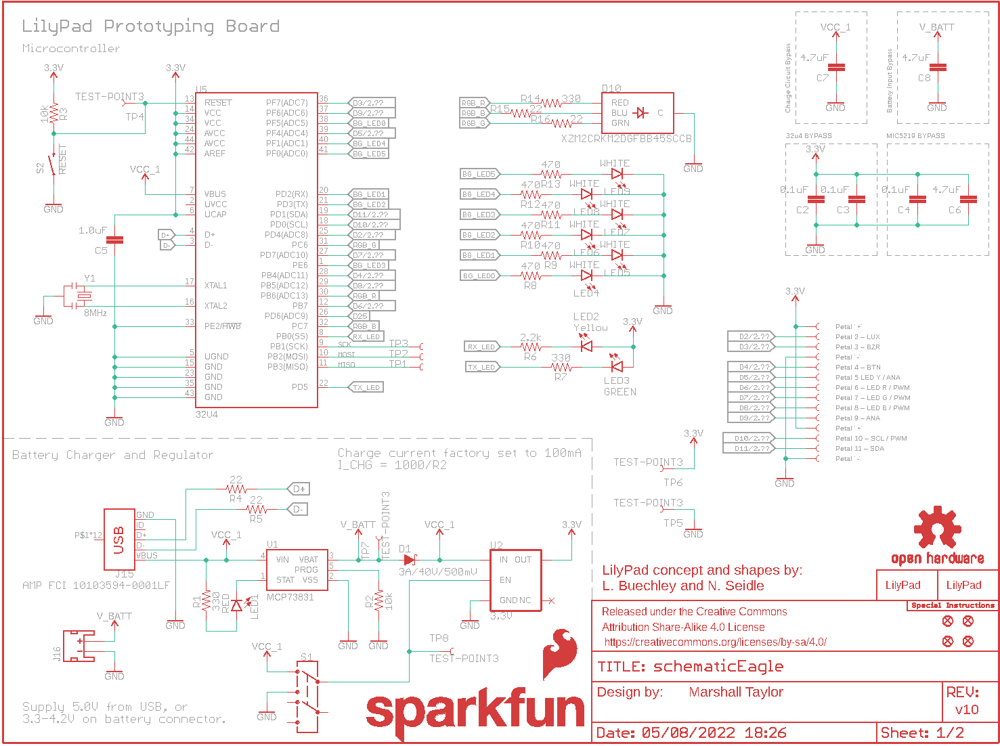
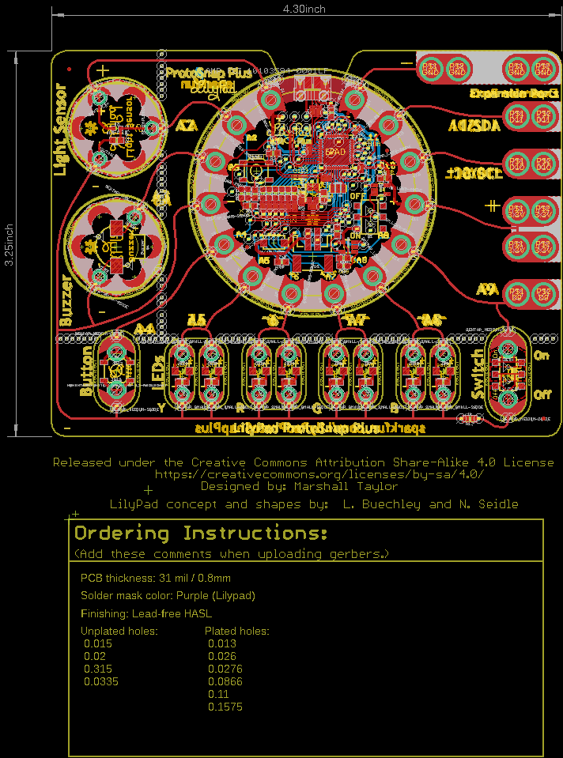
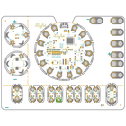
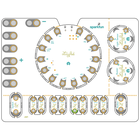
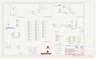
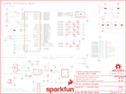
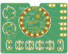
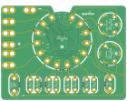

Contents
========

* [PRS14346 > LilyPad ProtoSnap Plus](#prs14346--lilypad-protosnap-plus)
	* [Schematic](#schematic)
	* [PCB](#pcb)
	* [Interactive BOM](#interactive-bom)
	* [OOMP Parts](#oomp-parts)
	* [Images](#images)
	* [Tags](#tags)
  
![][im]
# PRS14346 > LilyPad ProtoSnap Plus

- ID: PROJ-SPAR-14346-STAN-01
- Hex ID: PRS14346
- Name: Sparkfun
- Description: Sparkfun
- Long Link: [http://oom.lt/PROJ-SPAR-14346-STAN-01](http://oom.lt/PROJ-SPAR-14346-STAN-01)
- Short Link: [http://oom.lt/PRS14346](http://oom.lt/PRS14346)

## Schematic
  

## PCB
  

## Interactive BOM

- Interactive BOM page: [ibom.html](https://htmlpreview.github.io/?https://github.com/oomlout/oomlout_OOMP_projects/blob/main/PROJ-SPAR-14346-STAN-01/kicad/bom/ibom.html)

## OOMP Parts
  

|OOMP ID|Name|Identifier|
| :---: | :---: | :---: |
|UNMATCHED-UNMATCHED-X-UNMATCHED-01||B1, J15, J16, S1, S2, S3, S4, SEWTAPLS+, SEWTAPLS-, SEWTAPLSOUT, U$44, U3, U5, Y1|
|[CAPC-0402-X-NF100-V10](https://github.com/oomlout/oomlout_OOMP_parts/tree/main/CAPC-0402-X-NF100-V10/)|[SMD (0402) 100 nF Capacitor (Ceramic) 10v](https://github.com/oomlout/oomlout_OOMP_parts/tree/main/CAPC-0402-X-NF100-V10/)|[C2, C3, C4](https://github.com/oomlout/oomlout_OOMP_parts/tree/main/CAPC-0402-X-NF100-V10/)|
|CAPC-0402-X-UNMATCHED-01||C5|
|[CAPC-0603-X-UF47D-V10](https://github.com/oomlout/oomlout_OOMP_parts/tree/main/CAPC-0603-X-UF47D-V10/)|[SMD (0603) 4.7 uF Capacitor (Ceramic) 10v](https://github.com/oomlout/oomlout_OOMP_parts/tree/main/CAPC-0603-X-UF47D-V10/)|[C6, C7, C8](https://github.com/oomlout/oomlout_OOMP_parts/tree/main/CAPC-0603-X-UF47D-V10/)|
|DIOD-UNMATCHED-X-UNMATCHED-01||D1|
|LEDS-1206-G-STAN-01||D2, D7|
|LEDS-1206-Y-STAN-01||D3, D4|
|LEDS-1206-R-STAN-01||D5, D6|
|LEDS-1206-L-STAN-01||D8, D9|
|LEDS-UNMATCHED-G-STAN-01||D10|
|[LEDS-0603-R-STAN-01](https://github.com/oomlout/oomlout_OOMP_parts/tree/main/LEDS-0603-R-STAN-01/)|[SMD (0603) Red LED](https://github.com/oomlout/oomlout_OOMP_parts/tree/main/LEDS-0603-R-STAN-01/)|[LED1](https://github.com/oomlout/oomlout_OOMP_parts/tree/main/LEDS-0603-R-STAN-01/)|
|[LEDS-0603-Y-STAN-01](https://github.com/oomlout/oomlout_OOMP_parts/tree/main/LEDS-0603-Y-STAN-01/)|[SMD (0603) Yellow LED](https://github.com/oomlout/oomlout_OOMP_parts/tree/main/LEDS-0603-Y-STAN-01/)|[LED2](https://github.com/oomlout/oomlout_OOMP_parts/tree/main/LEDS-0603-Y-STAN-01/)|
|[LEDS-0603-G-STAN-01](https://github.com/oomlout/oomlout_OOMP_parts/tree/main/LEDS-0603-G-STAN-01/)|[SMD (0603) Green LED](https://github.com/oomlout/oomlout_OOMP_parts/tree/main/LEDS-0603-G-STAN-01/)|[LED3, LED4, LED5, LED6, LED7, LED8, LED9](https://github.com/oomlout/oomlout_OOMP_parts/tree/main/LEDS-0603-G-STAN-01/)|
|[RESE-0603-X-O331-01](https://github.com/oomlout/oomlout_OOMP_parts/tree/main/RESE-0603-X-O331-01/)|[SMD (0603) 330 Ohm Resistor](https://github.com/oomlout/oomlout_OOMP_parts/tree/main/RESE-0603-X-O331-01/)|[R1, R7, R14](https://github.com/oomlout/oomlout_OOMP_parts/tree/main/RESE-0603-X-O331-01/)|
|[RESE-0603-X-O103-01](https://github.com/oomlout/oomlout_OOMP_parts/tree/main/RESE-0603-X-O103-01/)|[SMD (0603) 10k Ohm Resistor](https://github.com/oomlout/oomlout_OOMP_parts/tree/main/RESE-0603-X-O103-01/)|[R2, R3, R24](https://github.com/oomlout/oomlout_OOMP_parts/tree/main/RESE-0603-X-O103-01/)|
|[RESE-0402-X-O220-01](https://github.com/oomlout/oomlout_OOMP_parts/tree/main/RESE-0402-X-O220-01/)|[SMD (0402) 22 Ohm Resistor](https://github.com/oomlout/oomlout_OOMP_parts/tree/main/RESE-0402-X-O220-01/)|[R4, R5, R15, R16](https://github.com/oomlout/oomlout_OOMP_parts/tree/main/RESE-0402-X-O220-01/)|
|[RESE-0603-X-O222-01](https://github.com/oomlout/oomlout_OOMP_parts/tree/main/RESE-0603-X-O222-01/)|[SMD (0603) 2.2k Ohm Resistor](https://github.com/oomlout/oomlout_OOMP_parts/tree/main/RESE-0603-X-O222-01/)|[R6](https://github.com/oomlout/oomlout_OOMP_parts/tree/main/RESE-0603-X-O222-01/)|
|[RESE-0402-X-O471-01](https://github.com/oomlout/oomlout_OOMP_parts/tree/main/RESE-0402-X-O471-01/)|[SMD (0402) 470 Ohm Resistor](https://github.com/oomlout/oomlout_OOMP_parts/tree/main/RESE-0402-X-O471-01/)|[R8, R9, R10, R11, R12, R13](https://github.com/oomlout/oomlout_OOMP_parts/tree/main/RESE-0402-X-O471-01/)|
|[RESE-0603-X-O102-01](https://github.com/oomlout/oomlout_OOMP_parts/tree/main/RESE-0603-X-O102-01/)|[SMD (0603) 1k Ohm Resistor](https://github.com/oomlout/oomlout_OOMP_parts/tree/main/RESE-0603-X-O102-01/)|[R17](https://github.com/oomlout/oomlout_OOMP_parts/tree/main/RESE-0603-X-O102-01/)|
|[RESE-0603-X-O101-01](https://github.com/oomlout/oomlout_OOMP_parts/tree/main/RESE-0603-X-O101-01/)|[SMD (0603) 100 Ohm Resistor](https://github.com/oomlout/oomlout_OOMP_parts/tree/main/RESE-0603-X-O101-01/)|[R25, R26, R29, R30](https://github.com/oomlout/oomlout_OOMP_parts/tree/main/RESE-0603-X-O101-01/)|
|[RESE-0603-X-O151-01](https://github.com/oomlout/oomlout_OOMP_parts/tree/main/RESE-0603-X-O151-01/)|[SMD (0603) 150 Ohm Resistor](https://github.com/oomlout/oomlout_OOMP_parts/tree/main/RESE-0603-X-O151-01/)|[R27, R28, R31, R32](https://github.com/oomlout/oomlout_OOMP_parts/tree/main/RESE-0603-X-O151-01/)|
|UNMATCHED-SO235-X-UNMATCHED-01||U1|
|[VREG-SO235-X-KAP2112K-V33D](https://github.com/oomlout/oomlout_OOMP_parts/tree/main/VREG-SO235-X-KAP2112K-V33D/)|[SMD (SOT-23-5) AP2112K Voltage Regulator 3.3v](https://github.com/oomlout/oomlout_OOMP_parts/tree/main/VREG-SO235-X-KAP2112K-V33D/)|[U2](https://github.com/oomlout/oomlout_OOMP_parts/tree/main/VREG-SO235-X-KAP2112K-V33D/)|

## Images
  
  

|bominteractivefront|bominteractiveback|kicadPcb3d|kicadPcb3dFront|kicadPcb3dBack|kicadSchem|eagleImage|eagleSchemImage|pcbdraw|pcbdrawback|
| :---: | :---: | :---: | :---: | :---: | :---: | :---: | :---: | :---: | :---: |
|||||||||||

## Tags

- hexID: PRS14346
- oompType: PROJ
- oompSize: SPAR
- oompColor: 14346
- oompDesc: STAN
- oompIndex: 01
- oompName: LilyPad ProtoSnap Plus
- sources: All source files from https://github.com/sparkfun/LilyPad_ProtoSnap_Plus (source licence details in srcLicense.md)
- linkBuyPage: https://www.sparkfun.com/products/14346
- oompID: PROJ-SPAR-14346-STAN-01
- oompParts: B1,UNMATCHED-UNMATCHED-X-UNMATCHED-01
- oompParts: C2,CAPC-0402-X-NF100-V10
- oompParts: C3,CAPC-0402-X-NF100-V10
- oompParts: C4,CAPC-0402-X-NF100-V10
- oompParts: C5,CAPC-0402-X-UNMATCHED-01
- oompParts: C6,CAPC-0603-X-UF47D-V10
- oompParts: C7,CAPC-0603-X-UF47D-V10
- oompParts: C8,CAPC-0603-X-UF47D-V10
- oompParts: D1,DIOD-UNMATCHED-X-UNMATCHED-01
- oompParts: D2,LEDS-1206-G-STAN-01
- oompParts: D3,LEDS-1206-Y-STAN-01
- oompParts: D4,LEDS-1206-Y-STAN-01
- oompParts: D5,LEDS-1206-R-STAN-01
- oompParts: D6,LEDS-1206-R-STAN-01
- oompParts: D7,LEDS-1206-G-STAN-01
- oompParts: D8,LEDS-1206-L-STAN-01
- oompParts: D9,LEDS-1206-L-STAN-01
- oompParts: D10,LEDS-UNMATCHED-G-STAN-01
- oompParts: J15,UNMATCHED-UNMATCHED-X-UNMATCHED-01
- oompParts: J16,UNMATCHED-UNMATCHED-X-UNMATCHED-01
- oompParts: LED1,LEDS-0603-R-STAN-01
- oompParts: LED2,LEDS-0603-Y-STAN-01
- oompParts: LED3,LEDS-0603-G-STAN-01
- oompParts: LED4,LEDS-0603-G-STAN-01
- oompParts: LED5,LEDS-0603-G-STAN-01
- oompParts: LED6,LEDS-0603-G-STAN-01
- oompParts: LED7,LEDS-0603-G-STAN-01
- oompParts: LED8,LEDS-0603-G-STAN-01
- oompParts: LED9,LEDS-0603-G-STAN-01
- oompParts: R1,RESE-0603-X-O331-01
- oompParts: R2,RESE-0603-X-O103-01
- oompParts: R3,RESE-0603-X-O103-01
- oompParts: R4,RESE-0402-X-O220-01
- oompParts: R5,RESE-0402-X-O220-01
- oompParts: R6,RESE-0603-X-O222-01
- oompParts: R7,RESE-0603-X-O331-01
- oompParts: R8,RESE-0402-X-O471-01
- oompParts: R9,RESE-0402-X-O471-01
- oompParts: R10,RESE-0402-X-O471-01
- oompParts: R11,RESE-0402-X-O471-01
- oompParts: R12,RESE-0402-X-O471-01
- oompParts: R13,RESE-0402-X-O471-01
- oompParts: R14,RESE-0603-X-O331-01
- oompParts: R15,RESE-0402-X-O220-01
- oompParts: R16,RESE-0402-X-O220-01
- oompParts: R17,RESE-0603-X-O102-01
- oompParts: R24,RESE-0603-X-O103-01
- oompParts: R25,RESE-0603-X-O101-01
- oompParts: R26,RESE-0603-X-O101-01
- oompParts: R27,RESE-0603-X-O151-01
- oompParts: R28,RESE-0603-X-O151-01
- oompParts: R29,RESE-0603-X-O101-01
- oompParts: R30,RESE-0603-X-O101-01
- oompParts: R31,RESE-0603-X-O151-01
- oompParts: R32,RESE-0603-X-O151-01
- oompParts: S1,UNMATCHED-UNMATCHED-X-UNMATCHED-01
- oompParts: S2,UNMATCHED-UNMATCHED-X-UNMATCHED-01
- oompParts: S3,UNMATCHED-UNMATCHED-X-UNMATCHED-01
- oompParts: S4,UNMATCHED-UNMATCHED-X-UNMATCHED-01
- oompParts: SEWTAPLS+,UNMATCHED-UNMATCHED-X-UNMATCHED-01
- oompParts: SEWTAPLS-,UNMATCHED-UNMATCHED-X-UNMATCHED-01
- oompParts: SEWTAPLSOUT,UNMATCHED-UNMATCHED-X-UNMATCHED-01
- oompParts: U$44,UNMATCHED-UNMATCHED-X-UNMATCHED-01
- oompParts: U1,UNMATCHED-SO235-X-UNMATCHED-01
- oompParts: U2,VREG-SO235-X-KAP2112K-V33D
- oompParts: U3,UNMATCHED-UNMATCHED-X-UNMATCHED-01
- oompParts: U5,UNMATCHED-UNMATCHED-X-UNMATCHED-01
- oompParts: Y1,UNMATCHED-UNMATCHED-X-UNMATCHED-01
- rawParts: B1,Buzzer,BUZZER-SMD,BUZZER-CCV,Buzzer,,COMP-08568,,,,,
- rawParts: C2,0.1uF,0.1UF-0402-16V-10%,0402,0.1µF ceramic capacitors,,CAP-12416,,,0.1uF,,
- rawParts: C3,0.1uF,0.1UF-0402-16V-10%,0402,0.1µF ceramic capacitors,,CAP-12416,,,0.1uF,,
- rawParts: C4,0.1uF,0.1UF-0402-16V-10%,0402,0.1µF ceramic capacitors,,CAP-12416,,,0.1uF,,
- rawParts: C5,1.0uF,1.0UF-0402-16V-10%,0402,1µF ceramic capacitors,,CAP-12417,,,1.0uF,,
- rawParts: C6,4.7uF,4.7UF0603,0603,4.7µF ceramic capacitors,,CAP-08280,,,4.7uF,,
- rawParts: C7,4.7uF,4.7UF0603,0603,4.7µF ceramic capacitors,,CAP-08280,,,4.7uF,,
- rawParts: C8,4.7uF,4.7UF0603,0603,4.7µF ceramic capacitors,,CAP-08280,,,4.7uF,,
- rawParts: D1,3A/40V/500mV,DIODE-SCHOTTKY-B340A,SMA-DIODE,Schottky diode,,DIO-09886,,,3A/40V/500mV,,
- rawParts: D2,GREEN,LED-GREENLILYPAD,LED-1206,Green SMD LED,,DIO-09910,,,GREEN,,
- rawParts: D3,Yellow,LED-YELLOWLILYPAD,LED-1206,Yellow SMD LED,,DIO-09909,,,Yellow,,
- rawParts: D4,Yellow,LED-YELLOWLILYPAD,LED-1206,Yellow SMD LED,,DIO-09909,,,Yellow,,
- rawParts: D5,RED,LED-RED1206,LED-1206,Red SMD LED,,DIO-09912,,,RED,,
- rawParts: D6,RED,LED-RED1206,LED-1206,Red SMD LED,,DIO-09912,,,RED,,
- rawParts: D7,GREEN,LED-GREENLILYPAD,LED-1206,Green SMD LED,,DIO-09910,,,GREEN,,
- rawParts: D8,BLUE,LED-BLUE1206,LED-1206,Blue SMD LED,,DIO-09911,,,BLUE,,
- rawParts: D9,BLUE,LED-BLUE1206,LED-1206,Blue SMD LED,,DIO-09911,,,BLUE,,
- rawParts: D10,XZM2CRKM2DGFBB45SCCB,SUNLEDSMD1,PLCC4SMDLED,LED-RGB Common Cathode,,DIO-13722,,,XZM2CRKM2DGFBB45SCCB,,
- rawParts: FRAME1,FRAME-LETTER,FRAME-LETTER,CREATIVE_COMMONS,Schematic Frame - Letter,,,,,,,
- rawParts: FRAME2,FRAME-LETTERNO_PACKAGE,FRAME-LETTERNO_PACKAGE,DUMMY,Schematic Frame - Letter,Nobody,,,,,v01,
- rawParts: J1,SEWTAP_LONG-2SIDE,SEWTAP_LONG-2SIDE,PETAL-LONG-1-2SIDE,SparkFun LilyPad Sew Taps,,,,,,,
- rawParts: J2,SEWTAP_LONG-2SIDE,SEWTAP_LONG-2SIDE,PETAL-LONG-1-2SIDE,SparkFun LilyPad Sew Taps,,,,,,,
- rawParts: J3,SEWTAP_LONG-2SIDE,SEWTAP_LONG-2SIDE,PETAL-LONG-1-2SIDE,SparkFun LilyPad Sew Taps,,,,,,,
- rawParts: J4,SEWTAP_LONG-2SIDE,SEWTAP_LONG-2SIDE,PETAL-LONG-1-2SIDE,SparkFun LilyPad Sew Taps,,,,,,,
- rawParts: J5,SEWTAP_LONG-2SIDE,SEWTAP_LONG-2SIDE,PETAL-LONG-1-2SIDE,SparkFun LilyPad Sew Taps,,,,,,,
- rawParts: J6,SEWTAP_LONG-2SIDE,SEWTAP_LONG-2SIDE,PETAL-LONG-1-2SIDE,SparkFun LilyPad Sew Taps,,,,,,,
- rawParts: J7,SEWTAP_LONG-2SIDE,SEWTAP_LONG-2SIDE,PETAL-LONG-1-2SIDE,SparkFun LilyPad Sew Taps,,,,,,,
- rawParts: J8,SEWTAP_LONG-2SIDE,SEWTAP_LONG-2SIDE,PETAL-LONG-1-2SIDE,SparkFun LilyPad Sew Taps,,,,,,,
- rawParts: J9,SEWTAP_LONG-2SIDE,SEWTAP_LONG-2SIDE,PETAL-LONG-1-2SIDE,SparkFun LilyPad Sew Taps,,,,,,,
- rawParts: J10,SEWTAP_LONG-2SIDE,SEWTAP_LONG-2SIDE,PETAL-LONG-1-2SIDE,SparkFun LilyPad Sew Taps,,,,,,,
- rawParts: J11,SEWTAP_LONG-2SIDE,SEWTAP_LONG-2SIDE,PETAL-LONG-1-2SIDE,SparkFun LilyPad Sew Taps,,,,,,,
- rawParts: J12,SEWTAP_LONG-2SIDE,SEWTAP_LONG-2SIDE,PETAL-LONG-1-2SIDE,SparkFun LilyPad Sew Taps,,,,,,,
- rawParts: J13,SEWTAP_LONG-2SIDE,SEWTAP_LONG-2SIDE,PETAL-LONG-1-2SIDE,SparkFun LilyPad Sew Taps,,,,,,,
- rawParts: J14,SEWTAP_LONG-2SIDE,SEWTAP_LONG-2SIDE,PETAL-LONG-1-2SIDE,SparkFun LilyPad Sew Taps,,,,,,,
- rawParts: J15,AMP FCI 10103594-0001LF,USB_MICRO-B_HALF_PTH,USB-MICROB-PTH,USB Type Micro-B Connector,,CONN-13711,,,AMP FCI 10103594-0001LF,,
- rawParts: J16,,JST_2MM_MALE,JST-2-SMD,JST 2MM MALE RA CONNECTOR,,CONN-11443,PRT-08612,,,,
- rawParts: JP1,SEWTAP_SMALL-2SIDE,SEWTAP_SMALL-2SIDE,PETAL-SMALL-2SIDE,SparkFun LilyPad Sew Taps,,,,,,,
- rawParts: JP2,FIDUCIALUFIDUCIAL,FIDUCIALUFIDUCIAL,MICRO-FIDUCIAL,Fiducial Alignment Points,,,,,,,
- rawParts: JP3,FIDUCIALUFIDUCIAL,FIDUCIALUFIDUCIAL,MICRO-FIDUCIAL,Fiducial Alignment Points,,,,,,,
- rawParts: JP4,SEWTAP_SMALL-2SIDE,SEWTAP_SMALL-2SIDE,PETAL-SMALL-2SIDE,SparkFun LilyPad Sew Taps,,,,,,,
- rawParts: JP5,SEWTAP_SMALL-2SIDE,SEWTAP_SMALL-2SIDE,PETAL-SMALL-2SIDE,SparkFun LilyPad Sew Taps,,,,,,,
- rawParts: JP6,SEWTAP_SMALL-2SIDE,SEWTAP_SMALL-2SIDE,PETAL-SMALL-2SIDE,SparkFun LilyPad Sew Taps,,,,,,,
- rawParts: JP7,SEWTAP_SMALL-2SIDE,SEWTAP_SMALL-2SIDE,PETAL-SMALL-2SIDE,SparkFun LilyPad Sew Taps,,,,,,,
- rawParts: JP8,SEWTAP_SMALL-2SIDE,SEWTAP_SMALL-2SIDE,PETAL-SMALL-2SIDE,SparkFun LilyPad Sew Taps,,,,,,,
- rawParts: JP9,SEWTAP_SMALL-2SIDE,SEWTAP_SMALL-2SIDE,PETAL-SMALL-2SIDE,SparkFun LilyPad Sew Taps,,,,,,,
- rawParts: JP10,SEWTAP_SMALL-2SIDE,SEWTAP_SMALL-2SIDE,PETAL-SMALL-2SIDE,SparkFun LilyPad Sew Taps,,,,,,,
- rawParts: JP11,FIDUCIALUFIDUCIAL,FIDUCIALUFIDUCIAL,MICRO-FIDUCIAL,Fiducial Alignment Points,,,,,,,
- rawParts: JP12,SEWTAP_MEDIUM-2SIDE,SEWTAP_MEDIUM-2SIDE,PETAL-MEDIUM-2SIDE,SparkFun LilyPad Sew Taps,,,,,,,
- rawParts: JP13,SEWTAP_MEDIUM-2SIDE,SEWTAP_MEDIUM-2SIDE,PETAL-MEDIUM-2SIDE,SparkFun LilyPad Sew Taps,,,,,,,
- rawParts: JP14,FIDUCIALUFIDUCIAL,FIDUCIALUFIDUCIAL,MICRO-FIDUCIAL,Fiducial Alignment Points,,,,,,,
- rawParts: JP20,SEWTAP_SMALL-2SIDE,SEWTAP_SMALL-2SIDE,PETAL-SMALL-2SIDE,SparkFun LilyPad Sew Taps,,,,,,,
- rawParts: JP21,SEWTAP_SMALL-2SIDE,SEWTAP_SMALL-2SIDE,PETAL-SMALL-2SIDE,SparkFun LilyPad Sew Taps,,,,,,,
- rawParts: JP22,SEWTAP_SMALL-2SIDE,SEWTAP_SMALL-2SIDE,PETAL-SMALL-2SIDE,SparkFun LilyPad Sew Taps,,,,,,,
- rawParts: JP23,SEWTAP_SMALL-2SIDE,SEWTAP_SMALL-2SIDE,PETAL-SMALL-2SIDE,SparkFun LilyPad Sew Taps,,,,,,,
- rawParts: JP24,SEWTAP_SMALL-2SIDE,SEWTAP_SMALL-2SIDE,PETAL-SMALL-2SIDE,SparkFun LilyPad Sew Taps,,,,,,,
- rawParts: JP25,SEWTAP_SMALL-2SIDE,SEWTAP_SMALL-2SIDE,PETAL-SMALL-2SIDE,SparkFun LilyPad Sew Taps,,,,,,,
- rawParts: JP26,SEWTAP_SMALL-2SIDE,SEWTAP_SMALL-2SIDE,PETAL-SMALL-2SIDE,SparkFun LilyPad Sew Taps,,,,,,,
- rawParts: JP27,SEWTAP_SMALL-2SIDE,SEWTAP_SMALL-2SIDE,PETAL-SMALL-2SIDE,SparkFun LilyPad Sew Taps,,,,,,,
- rawParts: LED1,RED,LED-RED0603,LED-0603,Red SMD LED,,DIO-00819,,,RED,,
- rawParts: LED2,Yellow,LED-YELLOW0603,LED-0603,Yellow SMD LED,,DIO-09003,,,Yellow,,
- rawParts: LED3,GREEN,LED-GREEN0603,LED-0603,Green SMD LED,,DIO-00821,,,GREEN,,
- rawParts: LED4,WHITE,LED-WHITE0603,LED-0603,White SMD LED,,DIO-09004,,,WHITE,,
- rawParts: LED5,WHITE,LED-WHITE0603,LED-0603,White SMD LED,,DIO-09004,,,WHITE,,
- rawParts: LED6,WHITE,LED-WHITE0603,LED-0603,White SMD LED,,DIO-09004,,,WHITE,,
- rawParts: LED7,WHITE,LED-WHITE0603,LED-0603,White SMD LED,,DIO-09004,,,WHITE,,
- rawParts: LED8,WHITE,LED-WHITE0603,LED-0603,White SMD LED,,DIO-09004,,,WHITE,,
- rawParts: LED9,WHITE,LED-WHITE0603,LED-0603,White SMD LED,,DIO-09004,,,WHITE,,
- rawParts: LOGO1,SFE_LOGO_NAME.1_INCH,SFE_LOGO_NAME.1_INCH,SFE_LOGO_NAME_.1,SparkFun Font Logo,,,,,,,
- rawParts: LOGO2,SFE_LOGO_FLAME.1EXP,SFE_LOGO_FLAME.1EXP,SFE_LOGO_FLAME_COPPER_EXPOSED_.1,SparkFun Flame Logo,,,,,,,
- rawParts: LOGO4,OSHW-LOGOS,OSHW-LOGOS,OSHW-LOGO-S,Open-Source Hardware (OSHW) Logo,,,,,,,
- rawParts: LOGO5,OSHW-LOGOS,OSHW-LOGOS,OSHW-LOGO-S,Open-Source Hardware (OSHW) Logo,,,,,,,
- rawParts: LOGO6,OSHW-LOGOS,OSHW-LOGOS,OSHW-LOGO-S,Open-Source Hardware (OSHW) Logo,,,,,,,
- rawParts: R1,330,330OHM-0603-1/10W-1%,0603,330Ω resistor,,RES-00818,,,330,,
- rawParts: R2,10k,10KOHM-0603-1/10W-1%,0603,10kΩ resistor,,RES-00824,,,10k,,
- rawParts: R3,10k,10KOHM-0603-1/10W-1%,0603,10kΩ resistor,,RES-00824,,,10k,,
- rawParts: R4,22,22OHM-0402-1/10W-1%,0402,22Ω resistor,,RES-12427,,,22,,
- rawParts: R5,22,22OHM-0402-1/10W-1%,0402,22Ω resistor,,RES-12427,,,22,,
- rawParts: R6,2.2k,2.2KOHM-0603-1/10W-1%,0603,2.2kΩ resistor,,RES-08272,,,2.2k,,
- rawParts: R7,330,330OHM-0603-1/10W-1%,0603,330Ω resistor,,RES-00818,,,330,,
- rawParts: R8,470,470OHM-0402-1/16W-5%,0402,470Ω resistor,,RES-13829,,,470,,
- rawParts: R9,470,470OHM-0402-1/16W-5%,0402,470Ω resistor,,RES-13829,,,470,,
- rawParts: R10,470,470OHM-0402-1/16W-5%,0402,470Ω resistor,,RES-13829,,,470,,
- rawParts: R11,470,470OHM-0402-1/16W-5%,0402,470Ω resistor,,RES-13829,,,470,,
- rawParts: R12,470,470OHM-0402-1/16W-5%,0402,470Ω resistor,,RES-13829,,,470,,
- rawParts: R13,470,470OHM-0402-1/16W-5%,0402,470Ω resistor,,RES-13829,,,470,,
- rawParts: R14,330,330OHM-0603-1/10W-1%,0603,330Ω resistor,,RES-00818,,,330,,
- rawParts: R15,22,22OHM-0402-1/10W-1%,0402,22Ω resistor,,RES-12427,,,22,,
- rawParts: R16,22,22OHM-0402-1/10W-1%,0402,22Ω resistor,,RES-12427,,,22,,
- rawParts: R17,1k,1KOHM-0603-1/10W-1%,0603,1kΩ resistor,,RES-07856,,,1k,,
- rawParts: R24,10k,10KOHM-0603-1/10W-1%,0603,10kΩ resistor,,RES-00824,,,10k,,
- rawParts: R25,100,100OHM-0603-1/10W-1%,0603,100Ω resistor,,RES-07863,,,100,,
- rawParts: R26,100,100OHM-0603-1/10W-1%,0603,100Ω resistor,,RES-07863,,,100,,
- rawParts: R27,150,150OHM-0603-1/10W-1%,0603,150Ω resistor,,RES-11028,,,150,,
- rawParts: R28,150,150OHM-0603-1/10W-1%,0603,150Ω resistor,,RES-11028,,,150,,
- rawParts: R29,100,100OHM-0603-1/10W-1%,0603,100Ω resistor,,RES-07863,,,100,,
- rawParts: R30,100,100OHM-0603-1/10W-1%,0603,100Ω resistor,,RES-07863,,,100,,
- rawParts: R31,150,150OHM-0603-1/10W-1%,0603,150Ω resistor,,RES-11028,,,150,,
- rawParts: R32,150,150OHM-0603-1/10W-1%,0603,150Ω resistor,,RES-11028,,,150,,
- rawParts: S1,,SWITCH-DPDT-SMD-AYZ0202,SWITCH_DPDT_SMD_AYZ0202,Double-Pole, Double-Throw (DPDT) Switch,,SWCH-08179,,COM-00597,,,
- rawParts: S2,!RESET,MOMENTARY-SWITCH-SPST-SMD-5.2-REDUNDANT,TACTILE_SWITCH_SMD_5.2MM,Momentary Switch (Pushbutton) - SPST,,SWCH-08247,,COM-08720,,,
- rawParts: S3,,SWITCH-DPDT-SMD-AYZ0202,SWITCH_DPDT_SMD_AYZ0202,Double-Pole, Double-Throw (DPDT) Switch,,SWCH-08179,,COM-00597,,,
- rawParts: S4,MOMENTARY-SWITCH-SPST-SMD-5.2-REDUNDANT,MOMENTARY-SWITCH-SPST-SMD-5.2-REDUNDANT,TACTILE_SWITCH_SMD_5.2MM,Momentary Switch (Pushbutton) - SPST,,SWCH-08247,,COM-08720,,,
- rawParts: SEWTAPLS+,PLUS,SEWTAP_SMALL-2SIDE,PETAL-SMALL-2SIDE,SparkFun LilyPad Sew Taps,,,,,,,
- rawParts: SEWTAPLS-,MINUS,SEWTAP_SMALL-2SIDE,PETAL-SMALL-2SIDE,SparkFun LilyPad Sew Taps,,,,,,,
- rawParts: SEWTAPLSOUT,OUT,SEWTAP_SMALL-2SIDE,PETAL-SMALL-2SIDE,SparkFun LilyPad Sew Taps,,,,,,,
- rawParts: SLIDEOFF,SEWTAP_MEDIUM-2SIDE,SEWTAP_MEDIUM-2SIDE,PETAL-MEDIUM-2SIDE,SparkFun LilyPad Sew Taps,,,,,,,
- rawParts: SLIDEON,SEWTAP_MEDIUM-2SIDE,SEWTAP_MEDIUM-2SIDE,PETAL-MEDIUM-2SIDE,SparkFun LilyPad Sew Taps,,,,,,,
- rawParts: ST1,SEWTAP-NOHOLE_SM_NH,SEWTAP-NOHOLE_SM_NH,PETAL-SMALL-NOHOLE,SparkFun LilyPad Sew Taps without Holes,,,,,,,
- rawParts: ST2,SEWTAP-NOHOLE_SM_NH,SEWTAP-NOHOLE_SM_NH,PETAL-SMALL-NOHOLE,SparkFun LilyPad Sew Taps without Holes,,,,,,,
- rawParts: ST3,SEWTAP-NOHOLE_SM_NH,SEWTAP-NOHOLE_SM_NH,PETAL-SMALL-NOHOLE,SparkFun LilyPad Sew Taps without Holes,,,,,,,
- rawParts: TP1,TEST-POINT3,TEST-POINT3,PAD.03X.03,SparkFun Test Points,,,,,,,
- rawParts: TP2,TEST-POINT3,TEST-POINT3,PAD.03X.03,SparkFun Test Points,,,,,,,
- rawParts: TP3,TEST-POINT3,TEST-POINT3,PAD.03X.03,SparkFun Test Points,,,,,,,
- rawParts: TP4,TEST-POINT3,TEST-POINT3,PAD.03X.03,SparkFun Test Points,,,,,,,
- rawParts: TP5,TEST-POINT3,TEST-POINT3,PAD.03X.03,SparkFun Test Points,,,,,,,
- rawParts: TP6,TEST-POINT3,TEST-POINT3,PAD.03X.03,SparkFun Test Points,,,,,,,
- rawParts: TP7,TEST-POINT3,TEST-POINT3,PAD.03X.03,SparkFun Test Points,,,,,,,
- rawParts: TP8,TEST-POINT3,TEST-POINT3,PAD.03X.03,SparkFun Test Points,,,,,,,
- rawParts: U$1,LILYLOGO_SHORT,LILYLOGO_SHORT,LILYPAD-WEARABLES_LOGO-LILYPAD,,,,,,,,
- rawParts: U$13,LILYLOGO_SHORT,LILYLOGO_SHORT,LILYPAD-WEARABLES_LOGO-LILYPAD,,,,,,,,
- rawParts: U$35,SEWTAP-NOHOLE_SM_NH,SEWTAP-NOHOLE_SM_NH,PETAL-SMALL-NOHOLE,SparkFun LilyPad Sew Taps without Holes,,,,,,,
- rawParts: U$36,SEWTAP-NOHOLE_SM_NH,SEWTAP-NOHOLE_SM_NH,PETAL-SMALL-NOHOLE,SparkFun LilyPad Sew Taps without Holes,,,,,,,
- rawParts: U$37,SEWTAP-NOHOLE_SM_NH,SEWTAP-NOHOLE_SM_NH,PETAL-SMALL-NOHOLE,SparkFun LilyPad Sew Taps without Holes,,,,,,,
- rawParts: U$38,SEWTAP_SMALL-2SIDE,SEWTAP_SMALL-2SIDE,PETAL-SMALL-2SIDE,SparkFun LilyPad Sew Taps,,,,,,,
- rawParts: U$39,SEWTAP_SMALL-2SIDE,SEWTAP_SMALL-2SIDE,PETAL-SMALL-2SIDE,SparkFun LilyPad Sew Taps,,,,,,,
- rawParts: U$40,SEWTAP-NOHOLE_SM_NH,SEWTAP-NOHOLE_SM_NH,PETAL-SMALL-NOHOLE,SparkFun LilyPad Sew Taps without Holes,,,,,,,
- rawParts: U$41,GATOR_HOLE_PAIR,GATOR_HOLE_PAIR,GATOR_HOLES,,,,,,,,
- rawParts: U$42,GATOR_HOLE_PAIR,GATOR_HOLE_PAIR,GATOR_HOLES,,,,,,,,
- rawParts: U$43,LILYLOGO_SHORT,LILYLOGO_SHORT,LILYPAD-WEARABLES_LOGO-LILYPAD,,,,,,,,
- rawParts: U$44,SPECIAL_INSTRUCTIONS-ORDERING,SPECIAL_INSTRUCTIONS-ORDERING,ORDERING_INSTRUCTIONS,Special Ordering/Production Instructions Alert,,,,,,,
- rawParts: U$51/SDA,GATOR_HOLE_PAIR,GATOR_HOLE_PAIR,GATOR_HOLES,,,,,,,,
- rawParts: U$52/SCL,GATOR_HOLE_PAIR,GATOR_HOLE_PAIR,GATOR_HOLES,,,,,,,,
- rawParts: U$52/SCL1,GATOR_HOLE_PAIR,GATOR_HOLE_PAIR,GATOR_HOLES,,,,,,,,
- rawParts: U$53,GATOR_HOLE_PAIR,GATOR_HOLE_PAIR,GATOR_HOLES,,,,,,,,
- rawParts: U$54,GATOR_HOLE_PAIR,GATOR_HOLE_PAIR,GATOR_HOLES,,,,,,,,
- rawParts: U$73,LILYLOGO_ABR,LILYLOGO_ABR,LILYPAD-WEARABLES_LOGO-L,,,,,,,,
- rawParts: U1,MCP73831,MCP73831,SOT23-5,Miniature single cell, fully integrated Li-Ion, Li-polymer charge management controller,,IC-09995,,,,,
- rawParts: U2,3.3V,V_REG_AP2112K-3.3V,SOT23-5,AP2112 - 600mA CMOS LDO Regulator w/ Enable,,VREG-12457,,,3.3V,,
- rawParts: U3,ALS-PT19,LIGHT_SENSORALS,ALS-PT19,Ambient Light Sensors - Phototransistors,,IC-11836,SEN-12566,,,,
- rawParts: U5,32U4,ATMEGA32U4_NOARDQFN3,QFN-44-PAD_1:1-LESS_PASTE,Atmel MCU, 32KByte,,IC-10828,,,32U4,,
- rawParts: Y1,8MHz,RESONATORSMD,RESONATOR-SMD,Resonator,,XTAL-08895,,,,,

[im]: kicadPcb3d_450.png
