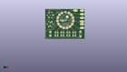
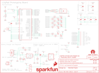

Contents
========

* [PRS14346 > Sparkfun](#prs14346--sparkfun)
	* [Schematic](#schematic)
	* [Interactive BOM](#interactive-bom)
	* [OOMP Parts](#oomp-parts)
	* [Images](#images)
	* [Tags](#tags)
  
![][im]
# PRS14346 > Sparkfun

- ID: PROJ-SPAR-14346-STAN-01
- Hex ID: PRS14346
- Name: Sparkfun
- Description: Sparkfun
- Long Link: [http://oom.lt/PROJ-SPAR-14346-STAN-01](http://oom.lt/PROJ-SPAR-14346-STAN-01)
- Short Link: [http://oom.lt/PRS14346](http://oom.lt/PRS14346)

## Schematic
  

## Interactive BOM

- Interactive BOM page: [ibom.html](https://htmlpreview.github.io/?https://github.com/oomlout/oomlout_OOMP_projects/blob/main/PROJ-SPAR-14346-STAN-01/kicad/bom/ibom.html)

## OOMP Parts
  

|OOMP Parts|
| :---: |
|B1,UNMATCHED-UNMATCHED-X-UNMATCHED-01,B1,Buzzer,BUZZER-SMD,BUZZER-CCV,Buzzer,,COMP-08568,,,,,|
|C2,CAPC-0402-X-NF100-01,C2,0.1uF,0.1UF-0402-16V-10%,0402,0.1µF ceramic capacitors,,CAP-12416,,,0.1uF,,|
|C3,CAPC-0402-X-NF100-01,C3,0.1uF,0.1UF-0402-16V-10%,0402,0.1µF ceramic capacitors,,CAP-12416,,,0.1uF,,|
|C4,CAPC-0402-X-NF100-01,C4,0.1uF,0.1UF-0402-16V-10%,0402,0.1µF ceramic capacitors,,CAP-12416,,,0.1uF,,|
|C5,CAPC-0402-X-UNMATCHED-01,C5,1.0uF,1.0UF-0402-16V-10%,0402,1µF ceramic capacitors,,CAP-12417,,,1.0uF,,|
|C6,CAPC-0603-X-UNMATCHED-01,C6,4.7uF,4.7UF0603,0603,4.7µF ceramic capacitors,,CAP-08280,,,4.7uF,,|
|C7,CAPC-0603-X-UNMATCHED-01,C7,4.7uF,4.7UF0603,0603,4.7µF ceramic capacitors,,CAP-08280,,,4.7uF,,|
|C8,CAPC-0603-X-UNMATCHED-01,C8,4.7uF,4.7UF0603,0603,4.7µF ceramic capacitors,,CAP-08280,,,4.7uF,,|
|D1,DIOD-UNMATCHED-X-UNMATCHED-01,D1,3A/40V/500mV,DIODE-SCHOTTKY-B340A,SMA-DIODE,Schottky diode,,DIO-09886,,,3A/40V/500mV,,|
|D2,LEDS-1206-G-STAN-01,D2,GREEN,LED-GREENLILYPAD,LED-1206,Green SMD LED,,DIO-09910,,,GREEN,,|
|D3,LEDS-1206-G-STAN-01,D3,Yellow,LED-YELLOWLILYPAD,LED-1206,Yellow SMD LED,,DIO-09909,,,Yellow,,|
|D4,LEDS-1206-G-STAN-01,D4,Yellow,LED-YELLOWLILYPAD,LED-1206,Yellow SMD LED,,DIO-09909,,,Yellow,,|
|D5,LEDS-1206-G-STAN-01,D5,RED,LED-RED1206,LED-1206,Red SMD LED,,DIO-09912,,,RED,,|
|D6,LEDS-1206-G-STAN-01,D6,RED,LED-RED1206,LED-1206,Red SMD LED,,DIO-09912,,,RED,,|
|D7,LEDS-1206-G-STAN-01,D7,GREEN,LED-GREENLILYPAD,LED-1206,Green SMD LED,,DIO-09910,,,GREEN,,|
|D8,LEDS-1206-G-STAN-01,D8,BLUE,LED-BLUE1206,LED-1206,Blue SMD LED,,DIO-09911,,,BLUE,,|
|D9,LEDS-1206-G-STAN-01,D9,BLUE,LED-BLUE1206,LED-1206,Blue SMD LED,,DIO-09911,,,BLUE,,|
|D10,DIOD-UNMATCHED-X-UNMATCHED-01,D10,XZM2CRKM2DGFBB45SCCB,SUNLEDSMD1,PLCC4SMDLED,LED-RGB Common Cathode,,DIO-13722,,,XZM2CRKM2DGFBB45SCCB,,|
|J1,UNMATCHED-UNMATCHED-X-UNMATCHED-01,FRAME1,FRAME-LETTER,FRAME-LETTER,CREATIVE_COMMONS,Schematic Frame - Letter,,,,,,,|
|J2,UNMATCHED-UNMATCHED-X-UNMATCHED-01,FRAME2,FRAME-LETTERNO_PACKAGE,FRAME-LETTERNO_PACKAGE,DUMMY,Schematic Frame - Letter,Nobody,,,,,v01,|
|J3,UNMATCHED-UNMATCHED-X-UNMATCHED-01,J1,SEWTAP_LONG-2SIDE,SEWTAP_LONG-2SIDE,PETAL-LONG-1-2SIDE,SparkFun LilyPad Sew Taps,,,,,,,|
|J4,UNMATCHED-UNMATCHED-X-UNMATCHED-01,J2,SEWTAP_LONG-2SIDE,SEWTAP_LONG-2SIDE,PETAL-LONG-1-2SIDE,SparkFun LilyPad Sew Taps,,,,,,,|
|J5,UNMATCHED-UNMATCHED-X-UNMATCHED-01,J3,SEWTAP_LONG-2SIDE,SEWTAP_LONG-2SIDE,PETAL-LONG-1-2SIDE,SparkFun LilyPad Sew Taps,,,,,,,|
|J6,UNMATCHED-UNMATCHED-X-UNMATCHED-01,J4,SEWTAP_LONG-2SIDE,SEWTAP_LONG-2SIDE,PETAL-LONG-1-2SIDE,SparkFun LilyPad Sew Taps,,,,,,,|
|J7,UNMATCHED-UNMATCHED-X-UNMATCHED-01,J5,SEWTAP_LONG-2SIDE,SEWTAP_LONG-2SIDE,PETAL-LONG-1-2SIDE,SparkFun LilyPad Sew Taps,,,,,,,|
|J8,UNMATCHED-UNMATCHED-X-UNMATCHED-01,J6,SEWTAP_LONG-2SIDE,SEWTAP_LONG-2SIDE,PETAL-LONG-1-2SIDE,SparkFun LilyPad Sew Taps,,,,,,,|
|J9,UNMATCHED-UNMATCHED-X-UNMATCHED-01,J7,SEWTAP_LONG-2SIDE,SEWTAP_LONG-2SIDE,PETAL-LONG-1-2SIDE,SparkFun LilyPad Sew Taps,,,,,,,|
|J10,UNMATCHED-UNMATCHED-X-UNMATCHED-01,J8,SEWTAP_LONG-2SIDE,SEWTAP_LONG-2SIDE,PETAL-LONG-1-2SIDE,SparkFun LilyPad Sew Taps,,,,,,,|
|J11,UNMATCHED-UNMATCHED-X-UNMATCHED-01,J9,SEWTAP_LONG-2SIDE,SEWTAP_LONG-2SIDE,PETAL-LONG-1-2SIDE,SparkFun LilyPad Sew Taps,,,,,,,|
|J12,UNMATCHED-UNMATCHED-X-UNMATCHED-01,J10,SEWTAP_LONG-2SIDE,SEWTAP_LONG-2SIDE,PETAL-LONG-1-2SIDE,SparkFun LilyPad Sew Taps,,,,,,,|
|J13,UNMATCHED-UNMATCHED-X-UNMATCHED-01,J11,SEWTAP_LONG-2SIDE,SEWTAP_LONG-2SIDE,PETAL-LONG-1-2SIDE,SparkFun LilyPad Sew Taps,,,,,,,|
|J14,UNMATCHED-UNMATCHED-X-UNMATCHED-01,J12,SEWTAP_LONG-2SIDE,SEWTAP_LONG-2SIDE,PETAL-LONG-1-2SIDE,SparkFun LilyPad Sew Taps,,,,,,,|
|J15,UNMATCHED-UNMATCHED-X-UNMATCHED-01,J13,SEWTAP_LONG-2SIDE,SEWTAP_LONG-2SIDE,PETAL-LONG-1-2SIDE,SparkFun LilyPad Sew Taps,,,,,,,|
|J16,UNMATCHED-UNMATCHED-X-UNMATCHED-01,J14,SEWTAP_LONG-2SIDE,SEWTAP_LONG-2SIDE,PETAL-LONG-1-2SIDE,SparkFun LilyPad Sew Taps,,,,,,,|
|JP1,UNMATCHED-UNMATCHED-X-UNMATCHED-01,J15,AMP FCI 10103594-0001LF,USB_MICRO-B_HALF_PTH,USB-MICROB-PTH,USB Type Micro-B Connector,,CONN-13711,,,AMP FCI 10103594-0001LF,,|
|JP4,UNMATCHED-UNMATCHED-X-UNMATCHED-01,J16,,JST_2MM_MALE,JST-2-SMD,JST 2MM MALE RA CONNECTOR,,CONN-11443,PRT-08612,,,,|
|JP5,UNMATCHED-UNMATCHED-X-UNMATCHED-01,JP1,SEWTAP_SMALL-2SIDE,SEWTAP_SMALL-2SIDE,PETAL-SMALL-2SIDE,SparkFun LilyPad Sew Taps,,,,,,,|
|JP6,UNMATCHED-UNMATCHED-X-UNMATCHED-01,JP2,FIDUCIALUFIDUCIAL,FIDUCIALUFIDUCIAL,MICRO-FIDUCIAL,Fiducial Alignment Points,,,,,,,|
|JP7,UNMATCHED-UNMATCHED-X-UNMATCHED-01,JP3,FIDUCIALUFIDUCIAL,FIDUCIALUFIDUCIAL,MICRO-FIDUCIAL,Fiducial Alignment Points,,,,,,,|
|JP8,UNMATCHED-UNMATCHED-X-UNMATCHED-01,JP4,SEWTAP_SMALL-2SIDE,SEWTAP_SMALL-2SIDE,PETAL-SMALL-2SIDE,SparkFun LilyPad Sew Taps,,,,,,,|
|JP9,UNMATCHED-UNMATCHED-X-UNMATCHED-01,JP5,SEWTAP_SMALL-2SIDE,SEWTAP_SMALL-2SIDE,PETAL-SMALL-2SIDE,SparkFun LilyPad Sew Taps,,,,,,,|
|JP10,UNMATCHED-UNMATCHED-X-UNMATCHED-01,JP6,SEWTAP_SMALL-2SIDE,SEWTAP_SMALL-2SIDE,PETAL-SMALL-2SIDE,SparkFun LilyPad Sew Taps,,,,,,,|
|JP12,UNMATCHED-UNMATCHED-X-UNMATCHED-01,JP7,SEWTAP_SMALL-2SIDE,SEWTAP_SMALL-2SIDE,PETAL-SMALL-2SIDE,SparkFun LilyPad Sew Taps,,,,,,,|
|JP13,UNMATCHED-UNMATCHED-X-UNMATCHED-01,JP8,SEWTAP_SMALL-2SIDE,SEWTAP_SMALL-2SIDE,PETAL-SMALL-2SIDE,SparkFun LilyPad Sew Taps,,,,,,,|
|JP20,UNMATCHED-UNMATCHED-X-UNMATCHED-01,JP9,SEWTAP_SMALL-2SIDE,SEWTAP_SMALL-2SIDE,PETAL-SMALL-2SIDE,SparkFun LilyPad Sew Taps,,,,,,,|
|JP21,UNMATCHED-UNMATCHED-X-UNMATCHED-01,JP10,SEWTAP_SMALL-2SIDE,SEWTAP_SMALL-2SIDE,PETAL-SMALL-2SIDE,SparkFun LilyPad Sew Taps,,,,,,,|
|JP22,UNMATCHED-UNMATCHED-X-UNMATCHED-01,JP11,FIDUCIALUFIDUCIAL,FIDUCIALUFIDUCIAL,MICRO-FIDUCIAL,Fiducial Alignment Points,,,,,,,|
|JP23,UNMATCHED-UNMATCHED-X-UNMATCHED-01,JP12,SEWTAP_MEDIUM-2SIDE,SEWTAP_MEDIUM-2SIDE,PETAL-MEDIUM-2SIDE,SparkFun LilyPad Sew Taps,,,,,,,|
|JP24,UNMATCHED-UNMATCHED-X-UNMATCHED-01,JP13,SEWTAP_MEDIUM-2SIDE,SEWTAP_MEDIUM-2SIDE,PETAL-MEDIUM-2SIDE,SparkFun LilyPad Sew Taps,,,,,,,|
|JP25,UNMATCHED-UNMATCHED-X-UNMATCHED-01,JP14,FIDUCIALUFIDUCIAL,FIDUCIALUFIDUCIAL,MICRO-FIDUCIAL,Fiducial Alignment Points,,,,,,,|
|JP26,UNMATCHED-UNMATCHED-X-UNMATCHED-01,JP20,SEWTAP_SMALL-2SIDE,SEWTAP_SMALL-2SIDE,PETAL-SMALL-2SIDE,SparkFun LilyPad Sew Taps,,,,,,,|
|JP27,UNMATCHED-UNMATCHED-X-UNMATCHED-01,JP21,SEWTAP_SMALL-2SIDE,SEWTAP_SMALL-2SIDE,PETAL-SMALL-2SIDE,SparkFun LilyPad Sew Taps,,,,,,,|
|LED1,LEDS-0603-G-STAN-01,JP22,SEWTAP_SMALL-2SIDE,SEWTAP_SMALL-2SIDE,PETAL-SMALL-2SIDE,SparkFun LilyPad Sew Taps,,,,,,,|
|LED2,LEDS-0603-G-STAN-01,JP23,SEWTAP_SMALL-2SIDE,SEWTAP_SMALL-2SIDE,PETAL-SMALL-2SIDE,SparkFun LilyPad Sew Taps,,,,,,,|
|LED3,LEDS-0603-G-STAN-01,JP24,SEWTAP_SMALL-2SIDE,SEWTAP_SMALL-2SIDE,PETAL-SMALL-2SIDE,SparkFun LilyPad Sew Taps,,,,,,,|
|LED4,LEDS-0603-G-STAN-01,JP25,SEWTAP_SMALL-2SIDE,SEWTAP_SMALL-2SIDE,PETAL-SMALL-2SIDE,SparkFun LilyPad Sew Taps,,,,,,,|
|LED5,LEDS-0603-G-STAN-01,JP26,SEWTAP_SMALL-2SIDE,SEWTAP_SMALL-2SIDE,PETAL-SMALL-2SIDE,SparkFun LilyPad Sew Taps,,,,,,,|
|LED6,LEDS-0603-G-STAN-01,JP27,SEWTAP_SMALL-2SIDE,SEWTAP_SMALL-2SIDE,PETAL-SMALL-2SIDE,SparkFun LilyPad Sew Taps,,,,,,,|
|LED7,LEDS-0603-G-STAN-01,LED1,RED,LED-RED0603,LED-0603,Red SMD LED,,DIO-00819,,,RED,,|
|LED8,LEDS-0603-G-STAN-01,LED2,Yellow,LED-YELLOW0603,LED-0603,Yellow SMD LED,,DIO-09003,,,Yellow,,|
|LED9,LEDS-0603-G-STAN-01,LED3,GREEN,LED-GREEN0603,LED-0603,Green SMD LED,,DIO-00821,,,GREEN,,|
|R1,RESE-0603-X-O331-01,LED4,WHITE,LED-WHITE0603,LED-0603,White SMD LED,,DIO-09004,,,WHITE,,|
|R2,RESE-0603-X-O103-01,LED5,WHITE,LED-WHITE0603,LED-0603,White SMD LED,,DIO-09004,,,WHITE,,|
|R3,RESE-0603-X-O103-01,LED6,WHITE,LED-WHITE0603,LED-0603,White SMD LED,,DIO-09004,,,WHITE,,|
|R4,RESE-0402-X-O21-01,LED7,WHITE,LED-WHITE0603,LED-0603,White SMD LED,,DIO-09004,,,WHITE,,|
|R5,RESE-0402-X-O21-01,LED8,WHITE,LED-WHITE0603,LED-0603,White SMD LED,,DIO-09004,,,WHITE,,|
|R6,RESE-0603-X-UNMATCHED-01,LED9,WHITE,LED-WHITE0603,LED-0603,White SMD LED,,DIO-09004,,,WHITE,,|
|R7,RESE-0603-X-O331-01,LOGO1,SFE_LOGO_NAME.1_INCH,SFE_LOGO_NAME.1_INCH,SFE_LOGO_NAME_.1,SparkFun Font Logo,,,,,,,|
|R8,RESE-0402-X-O471-01,LOGO2,SFE_LOGO_FLAME.1EXP,SFE_LOGO_FLAME.1EXP,SFE_LOGO_FLAME_COPPER_EXPOSED_.1,SparkFun Flame Logo,,,,,,,|
|R9,RESE-0402-X-O471-01,LOGO4,OSHW-LOGOS,OSHW-LOGOS,OSHW-LOGO-S,Open-Source Hardware (OSHW) Logo,,,,,,,|
|R10,RESE-0402-X-O471-01,LOGO5,OSHW-LOGOS,OSHW-LOGOS,OSHW-LOGO-S,Open-Source Hardware (OSHW) Logo,,,,,,,|
|R11,RESE-0402-X-O471-01,LOGO6,OSHW-LOGOS,OSHW-LOGOS,OSHW-LOGO-S,Open-Source Hardware (OSHW) Logo,,,,,,,|
|R12,RESE-0402-X-O471-01,R1,330,330OHM-0603-1/10W-1%,0603,330Ω resistor,,RES-00818,,,330,,|
|R13,RESE-0402-X-O471-01,R2,10k,10KOHM-0603-1/10W-1%,0603,10kΩ resistor,,RES-00824,,,10k,,|
|R14,RESE-0603-X-O331-01,R3,10k,10KOHM-0603-1/10W-1%,0603,10kΩ resistor,,RES-00824,,,10k,,|
|R15,RESE-0402-X-O21-01,R4,22,22OHM-0402-1/10W-1%,0402,22Ω resistor,,RES-12427,,,22,,|
|R16,RESE-0402-X-O21-01,R5,22,22OHM-0402-1/10W-1%,0402,22Ω resistor,,RES-12427,,,22,,|
|R17,RESE-0603-X-O102-01,R6,2.2k,2.2KOHM-0603-1/10W-1%,0603,2.2kΩ resistor,,RES-08272,,,2.2k,,|
|R24,RESE-0603-X-O103-01,R7,330,330OHM-0603-1/10W-1%,0603,330Ω resistor,,RES-00818,,,330,,|
|R25,RESE-0603-X-O101-01,R8,470,470OHM-0402-1/16W-5%,0402,470Ω resistor,,RES-13829,,,470,,|
|R26,RESE-0603-X-O101-01,R9,470,470OHM-0402-1/16W-5%,0402,470Ω resistor,,RES-13829,,,470,,|
|R27,RESE-0603-X-O151-01,R10,470,470OHM-0402-1/16W-5%,0402,470Ω resistor,,RES-13829,,,470,,|
|R28,RESE-0603-X-O151-01,R11,470,470OHM-0402-1/16W-5%,0402,470Ω resistor,,RES-13829,,,470,,|
|R29,RESE-0603-X-O101-01,R12,470,470OHM-0402-1/16W-5%,0402,470Ω resistor,,RES-13829,,,470,,|
|R30,RESE-0603-X-O101-01,R13,470,470OHM-0402-1/16W-5%,0402,470Ω resistor,,RES-13829,,,470,,|
|R31,RESE-0603-X-O151-01,R14,330,330OHM-0603-1/10W-1%,0603,330Ω resistor,,RES-00818,,,330,,|
|R32,RESE-0603-X-O151-01,R15,22,22OHM-0402-1/10W-1%,0402,22Ω resistor,,RES-12427,,,22,,|
|S1,UNMATCHED-UNMATCHED-X-UNMATCHED-01,R16,22,22OHM-0402-1/10W-1%,0402,22Ω resistor,,RES-12427,,,22,,|
|S2,UNMATCHED-UNMATCHED-X-UNMATCHED-01,R17,1k,1KOHM-0603-1/10W-1%,0603,1kΩ resistor,,RES-07856,,,1k,,|
|S3,UNMATCHED-UNMATCHED-X-UNMATCHED-01,R24,10k,10KOHM-0603-1/10W-1%,0603,10kΩ resistor,,RES-00824,,,10k,,|
|S4,UNMATCHED-UNMATCHED-X-UNMATCHED-01,R25,100,100OHM-0603-1/10W-1%,0603,100Ω resistor,,RES-07863,,,100,,|
|SEWTAPLS+,UNMATCHED-UNMATCHED-X-UNMATCHED-01,R26,100,100OHM-0603-1/10W-1%,0603,100Ω resistor,,RES-07863,,,100,,|
|SEWTAPLS-,UNMATCHED-UNMATCHED-X-UNMATCHED-01,R27,150,150OHM-0603-1/10W-1%,0603,150Ω resistor,,RES-11028,,,150,,|
|SEWTAPLSOUT,UNMATCHED-UNMATCHED-X-UNMATCHED-01,R28,150,150OHM-0603-1/10W-1%,0603,150Ω resistor,,RES-11028,,,150,,|
|SLIDEOFF,UNMATCHED-UNMATCHED-X-UNMATCHED-01,R29,100,100OHM-0603-1/10W-1%,0603,100Ω resistor,,RES-07863,,,100,,|
|SLIDEON,UNMATCHED-UNMATCHED-X-UNMATCHED-01,R30,100,100OHM-0603-1/10W-1%,0603,100Ω resistor,,RES-07863,,,100,,|
|ST1,UNMATCHED-UNMATCHED-X-UNMATCHED-01,R31,150,150OHM-0603-1/10W-1%,0603,150Ω resistor,,RES-11028,,,150,,|
|ST2,UNMATCHED-UNMATCHED-X-UNMATCHED-01,R32,150,150OHM-0603-1/10W-1%,0603,150Ω resistor,,RES-11028,,,150,,|
|ST3,UNMATCHED-UNMATCHED-X-UNMATCHED-01,S1,,SWITCH-DPDT-SMD-AYZ0202,SWITCH_DPDT_SMD_AYZ0202,Double-Pole, Double-Throw (DPDT) Switch,,SWCH-08179,,COM-00597,,,|
|TP1,UNMATCHED-UNMATCHED-X-UNMATCHED-01,S2,!RESET,MOMENTARY-SWITCH-SPST-SMD-5.2-REDUNDANT,TACTILE_SWITCH_SMD_5.2MM,Momentary Switch (Pushbutton) - SPST,,SWCH-08247,,COM-08720,,,|
|TP2,UNMATCHED-UNMATCHED-X-UNMATCHED-01,S3,,SWITCH-DPDT-SMD-AYZ0202,SWITCH_DPDT_SMD_AYZ0202,Double-Pole, Double-Throw (DPDT) Switch,,SWCH-08179,,COM-00597,,,|
|TP3,UNMATCHED-UNMATCHED-X-UNMATCHED-01,S4,MOMENTARY-SWITCH-SPST-SMD-5.2-REDUNDANT,MOMENTARY-SWITCH-SPST-SMD-5.2-REDUNDANT,TACTILE_SWITCH_SMD_5.2MM,Momentary Switch (Pushbutton) - SPST,,SWCH-08247,,COM-08720,,,|
|TP4,UNMATCHED-UNMATCHED-X-UNMATCHED-01,SEWTAPLS+,PLUS,SEWTAP_SMALL-2SIDE,PETAL-SMALL-2SIDE,SparkFun LilyPad Sew Taps,,,,,,,|
|TP5,UNMATCHED-UNMATCHED-X-UNMATCHED-01,SEWTAPLS-,MINUS,SEWTAP_SMALL-2SIDE,PETAL-SMALL-2SIDE,SparkFun LilyPad Sew Taps,,,,,,,|
|TP6,UNMATCHED-UNMATCHED-X-UNMATCHED-01,SEWTAPLSOUT,OUT,SEWTAP_SMALL-2SIDE,PETAL-SMALL-2SIDE,SparkFun LilyPad Sew Taps,,,,,,,|
|TP7,UNMATCHED-UNMATCHED-X-UNMATCHED-01,SLIDEOFF,SEWTAP_MEDIUM-2SIDE,SEWTAP_MEDIUM-2SIDE,PETAL-MEDIUM-2SIDE,SparkFun LilyPad Sew Taps,,,,,,,|
|TP8,UNMATCHED-UNMATCHED-X-UNMATCHED-01,SLIDEON,SEWTAP_MEDIUM-2SIDE,SEWTAP_MEDIUM-2SIDE,PETAL-MEDIUM-2SIDE,SparkFun LilyPad Sew Taps,,,,,,,|
|U$35,UNMATCHED-UNMATCHED-X-UNMATCHED-01,ST1,SEWTAP-NOHOLE_SM_NH,SEWTAP-NOHOLE_SM_NH,PETAL-SMALL-NOHOLE,SparkFun LilyPad Sew Taps without Holes,,,,,,,|
|U$36,UNMATCHED-UNMATCHED-X-UNMATCHED-01,ST2,SEWTAP-NOHOLE_SM_NH,SEWTAP-NOHOLE_SM_NH,PETAL-SMALL-NOHOLE,SparkFun LilyPad Sew Taps without Holes,,,,,,,|
|U$37,UNMATCHED-UNMATCHED-X-UNMATCHED-01,ST3,SEWTAP-NOHOLE_SM_NH,SEWTAP-NOHOLE_SM_NH,PETAL-SMALL-NOHOLE,SparkFun LilyPad Sew Taps without Holes,,,,,,,|
|U$38,UNMATCHED-UNMATCHED-X-UNMATCHED-01,TP1,TEST-POINT3,TEST-POINT3,PAD.03X.03,SparkFun Test Points,,,,,,,|
|U$39,UNMATCHED-UNMATCHED-X-UNMATCHED-01,TP2,TEST-POINT3,TEST-POINT3,PAD.03X.03,SparkFun Test Points,,,,,,,|
|U$40,UNMATCHED-UNMATCHED-X-UNMATCHED-01,TP3,TEST-POINT3,TEST-POINT3,PAD.03X.03,SparkFun Test Points,,,,,,,|
|U$41,UNMATCHED-UNMATCHED-X-UNMATCHED-01,TP4,TEST-POINT3,TEST-POINT3,PAD.03X.03,SparkFun Test Points,,,,,,,|
|U$42,UNMATCHED-UNMATCHED-X-UNMATCHED-01,TP5,TEST-POINT3,TEST-POINT3,PAD.03X.03,SparkFun Test Points,,,,,,,|
|U$44,UNMATCHED-UNMATCHED-X-UNMATCHED-01,TP6,TEST-POINT3,TEST-POINT3,PAD.03X.03,SparkFun Test Points,,,,,,,|
|U$51/SDA,UNMATCHED-UNMATCHED-X-UNMATCHED-01,TP7,TEST-POINT3,TEST-POINT3,PAD.03X.03,SparkFun Test Points,,,,,,,|
|U$52/SCL,UNMATCHED-UNMATCHED-X-UNMATCHED-01,TP8,TEST-POINT3,TEST-POINT3,PAD.03X.03,SparkFun Test Points,,,,,,,|
|U$52/SCL1,UNMATCHED-UNMATCHED-X-UNMATCHED-01,U$1,LILYLOGO_SHORT,LILYLOGO_SHORT,LILYPAD-WEARABLES_LOGO-LILYPAD,,,,,,,,|
|U$53,UNMATCHED-UNMATCHED-X-UNMATCHED-01,U$13,LILYLOGO_SHORT,LILYLOGO_SHORT,LILYPAD-WEARABLES_LOGO-LILYPAD,,,,,,,,|
|U$54,UNMATCHED-UNMATCHED-X-UNMATCHED-01,U$35,SEWTAP-NOHOLE_SM_NH,SEWTAP-NOHOLE_SM_NH,PETAL-SMALL-NOHOLE,SparkFun LilyPad Sew Taps without Holes,,,,,,,|
|U1,UNMATCHED-SO235-X-UNMATCHED-01,U$36,SEWTAP-NOHOLE_SM_NH,SEWTAP-NOHOLE_SM_NH,PETAL-SMALL-NOHOLE,SparkFun LilyPad Sew Taps without Holes,,,,,,,|
|U2,VREG-SO235-X-KAP2112K-V33D,U$37,SEWTAP-NOHOLE_SM_NH,SEWTAP-NOHOLE_SM_NH,PETAL-SMALL-NOHOLE,SparkFun LilyPad Sew Taps without Holes,,,,,,,|
|U3,UNMATCHED-UNMATCHED-X-UNMATCHED-01,U$38,SEWTAP_SMALL-2SIDE,SEWTAP_SMALL-2SIDE,PETAL-SMALL-2SIDE,SparkFun LilyPad Sew Taps,,,,,,,|
|U5,UNMATCHED-UNMATCHED-X-UNMATCHED-01,U$39,SEWTAP_SMALL-2SIDE,SEWTAP_SMALL-2SIDE,PETAL-SMALL-2SIDE,SparkFun LilyPad Sew Taps,,,,,,,|
|Y1,UNMATCHED-UNMATCHED-X-UNMATCHED-01,U$40,SEWTAP-NOHOLE_SM_NH,SEWTAP-NOHOLE_SM_NH,PETAL-SMALL-NOHOLE,SparkFun LilyPad Sew Taps without Holes,,,,,,,|

## Images
  
  

|kicadPcb3d|kicadPcb3dFront|kicadPcb3dBack|eagleImage|eagleSchemImage|
| :---: | :---: | :---: | :---: | :---: |
||||||

## Tags

- hexID: PRS14346
- oompType: PROJ
- oompSize: SPAR
- oompColor: 14346
- oompDesc: STAN
- oompIndex: 01
- oompName: LilyPad ProtoSnap Plus
- sources: All source files from https://github.com/sparkfun/LilyPad_ProtoSnap_Plus (source licence details in srcLicense.md)
- linkBuyPage: https://www.sparkfun.com/products/14346
- oompID: PROJ-SPAR-14346-STAN-01
- oompParts: B1,UNMATCHED-UNMATCHED-X-UNMATCHED-01
- oompParts: C2,CAPC-0402-X-NF100-01
- oompParts: C3,CAPC-0402-X-NF100-01
- oompParts: C4,CAPC-0402-X-NF100-01
- oompParts: C5,CAPC-0402-X-UNMATCHED-01
- oompParts: C6,CAPC-0603-X-UNMATCHED-01
- oompParts: C7,CAPC-0603-X-UNMATCHED-01
- oompParts: C8,CAPC-0603-X-UNMATCHED-01
- oompParts: D1,DIOD-UNMATCHED-X-UNMATCHED-01
- oompParts: D2,LEDS-1206-G-STAN-01
- oompParts: D3,LEDS-1206-G-STAN-01
- oompParts: D4,LEDS-1206-G-STAN-01
- oompParts: D5,LEDS-1206-G-STAN-01
- oompParts: D6,LEDS-1206-G-STAN-01
- oompParts: D7,LEDS-1206-G-STAN-01
- oompParts: D8,LEDS-1206-G-STAN-01
- oompParts: D9,LEDS-1206-G-STAN-01
- oompParts: D10,DIOD-UNMATCHED-X-UNMATCHED-01
- oompParts: J1,UNMATCHED-UNMATCHED-X-UNMATCHED-01
- oompParts: J2,UNMATCHED-UNMATCHED-X-UNMATCHED-01
- oompParts: J3,UNMATCHED-UNMATCHED-X-UNMATCHED-01
- oompParts: J4,UNMATCHED-UNMATCHED-X-UNMATCHED-01
- oompParts: J5,UNMATCHED-UNMATCHED-X-UNMATCHED-01
- oompParts: J6,UNMATCHED-UNMATCHED-X-UNMATCHED-01
- oompParts: J7,UNMATCHED-UNMATCHED-X-UNMATCHED-01
- oompParts: J8,UNMATCHED-UNMATCHED-X-UNMATCHED-01
- oompParts: J9,UNMATCHED-UNMATCHED-X-UNMATCHED-01
- oompParts: J10,UNMATCHED-UNMATCHED-X-UNMATCHED-01
- oompParts: J11,UNMATCHED-UNMATCHED-X-UNMATCHED-01
- oompParts: J12,UNMATCHED-UNMATCHED-X-UNMATCHED-01
- oompParts: J13,UNMATCHED-UNMATCHED-X-UNMATCHED-01
- oompParts: J14,UNMATCHED-UNMATCHED-X-UNMATCHED-01
- oompParts: J15,UNMATCHED-UNMATCHED-X-UNMATCHED-01
- oompParts: J16,UNMATCHED-UNMATCHED-X-UNMATCHED-01
- oompParts: JP1,UNMATCHED-UNMATCHED-X-UNMATCHED-01
- oompParts: JP4,UNMATCHED-UNMATCHED-X-UNMATCHED-01
- oompParts: JP5,UNMATCHED-UNMATCHED-X-UNMATCHED-01
- oompParts: JP6,UNMATCHED-UNMATCHED-X-UNMATCHED-01
- oompParts: JP7,UNMATCHED-UNMATCHED-X-UNMATCHED-01
- oompParts: JP8,UNMATCHED-UNMATCHED-X-UNMATCHED-01
- oompParts: JP9,UNMATCHED-UNMATCHED-X-UNMATCHED-01
- oompParts: JP10,UNMATCHED-UNMATCHED-X-UNMATCHED-01
- oompParts: JP12,UNMATCHED-UNMATCHED-X-UNMATCHED-01
- oompParts: JP13,UNMATCHED-UNMATCHED-X-UNMATCHED-01
- oompParts: JP20,UNMATCHED-UNMATCHED-X-UNMATCHED-01
- oompParts: JP21,UNMATCHED-UNMATCHED-X-UNMATCHED-01
- oompParts: JP22,UNMATCHED-UNMATCHED-X-UNMATCHED-01
- oompParts: JP23,UNMATCHED-UNMATCHED-X-UNMATCHED-01
- oompParts: JP24,UNMATCHED-UNMATCHED-X-UNMATCHED-01
- oompParts: JP25,UNMATCHED-UNMATCHED-X-UNMATCHED-01
- oompParts: JP26,UNMATCHED-UNMATCHED-X-UNMATCHED-01
- oompParts: JP27,UNMATCHED-UNMATCHED-X-UNMATCHED-01
- oompParts: LED1,LEDS-0603-G-STAN-01
- oompParts: LED2,LEDS-0603-G-STAN-01
- oompParts: LED3,LEDS-0603-G-STAN-01
- oompParts: LED4,LEDS-0603-G-STAN-01
- oompParts: LED5,LEDS-0603-G-STAN-01
- oompParts: LED6,LEDS-0603-G-STAN-01
- oompParts: LED7,LEDS-0603-G-STAN-01
- oompParts: LED8,LEDS-0603-G-STAN-01
- oompParts: LED9,LEDS-0603-G-STAN-01
- oompParts: R1,RESE-0603-X-O331-01
- oompParts: R2,RESE-0603-X-O103-01
- oompParts: R3,RESE-0603-X-O103-01
- oompParts: R4,RESE-0402-X-O21-01
- oompParts: R5,RESE-0402-X-O21-01
- oompParts: R6,RESE-0603-X-UNMATCHED-01
- oompParts: R7,RESE-0603-X-O331-01
- oompParts: R8,RESE-0402-X-O471-01
- oompParts: R9,RESE-0402-X-O471-01
- oompParts: R10,RESE-0402-X-O471-01
- oompParts: R11,RESE-0402-X-O471-01
- oompParts: R12,RESE-0402-X-O471-01
- oompParts: R13,RESE-0402-X-O471-01
- oompParts: R14,RESE-0603-X-O331-01
- oompParts: R15,RESE-0402-X-O21-01
- oompParts: R16,RESE-0402-X-O21-01
- oompParts: R17,RESE-0603-X-O102-01
- oompParts: R24,RESE-0603-X-O103-01
- oompParts: R25,RESE-0603-X-O101-01
- oompParts: R26,RESE-0603-X-O101-01
- oompParts: R27,RESE-0603-X-O151-01
- oompParts: R28,RESE-0603-X-O151-01
- oompParts: R29,RESE-0603-X-O101-01
- oompParts: R30,RESE-0603-X-O101-01
- oompParts: R31,RESE-0603-X-O151-01
- oompParts: R32,RESE-0603-X-O151-01
- oompParts: S1,UNMATCHED-UNMATCHED-X-UNMATCHED-01
- oompParts: S2,UNMATCHED-UNMATCHED-X-UNMATCHED-01
- oompParts: S3,UNMATCHED-UNMATCHED-X-UNMATCHED-01
- oompParts: S4,UNMATCHED-UNMATCHED-X-UNMATCHED-01
- oompParts: SEWTAPLS+,UNMATCHED-UNMATCHED-X-UNMATCHED-01
- oompParts: SEWTAPLS-,UNMATCHED-UNMATCHED-X-UNMATCHED-01
- oompParts: SEWTAPLSOUT,UNMATCHED-UNMATCHED-X-UNMATCHED-01
- oompParts: SLIDEOFF,UNMATCHED-UNMATCHED-X-UNMATCHED-01
- oompParts: SLIDEON,UNMATCHED-UNMATCHED-X-UNMATCHED-01
- oompParts: ST1,UNMATCHED-UNMATCHED-X-UNMATCHED-01
- oompParts: ST2,UNMATCHED-UNMATCHED-X-UNMATCHED-01
- oompParts: ST3,UNMATCHED-UNMATCHED-X-UNMATCHED-01
- oompParts: TP1,UNMATCHED-UNMATCHED-X-UNMATCHED-01
- oompParts: TP2,UNMATCHED-UNMATCHED-X-UNMATCHED-01
- oompParts: TP3,UNMATCHED-UNMATCHED-X-UNMATCHED-01
- oompParts: TP4,UNMATCHED-UNMATCHED-X-UNMATCHED-01
- oompParts: TP5,UNMATCHED-UNMATCHED-X-UNMATCHED-01
- oompParts: TP6,UNMATCHED-UNMATCHED-X-UNMATCHED-01
- oompParts: TP7,UNMATCHED-UNMATCHED-X-UNMATCHED-01
- oompParts: TP8,UNMATCHED-UNMATCHED-X-UNMATCHED-01
- oompParts: U$35,UNMATCHED-UNMATCHED-X-UNMATCHED-01
- oompParts: U$36,UNMATCHED-UNMATCHED-X-UNMATCHED-01
- oompParts: U$37,UNMATCHED-UNMATCHED-X-UNMATCHED-01
- oompParts: U$38,UNMATCHED-UNMATCHED-X-UNMATCHED-01
- oompParts: U$39,UNMATCHED-UNMATCHED-X-UNMATCHED-01
- oompParts: U$40,UNMATCHED-UNMATCHED-X-UNMATCHED-01
- oompParts: U$41,UNMATCHED-UNMATCHED-X-UNMATCHED-01
- oompParts: U$42,UNMATCHED-UNMATCHED-X-UNMATCHED-01
- oompParts: U$44,UNMATCHED-UNMATCHED-X-UNMATCHED-01
- oompParts: U$51/SDA,UNMATCHED-UNMATCHED-X-UNMATCHED-01
- oompParts: U$52/SCL,UNMATCHED-UNMATCHED-X-UNMATCHED-01
- oompParts: U$52/SCL1,UNMATCHED-UNMATCHED-X-UNMATCHED-01
- oompParts: U$53,UNMATCHED-UNMATCHED-X-UNMATCHED-01
- oompParts: U$54,UNMATCHED-UNMATCHED-X-UNMATCHED-01
- oompParts: U1,UNMATCHED-SO235-X-UNMATCHED-01
- oompParts: U2,VREG-SO235-X-KAP2112K-V33D
- oompParts: U3,UNMATCHED-UNMATCHED-X-UNMATCHED-01
- oompParts: U5,UNMATCHED-UNMATCHED-X-UNMATCHED-01
- oompParts: Y1,UNMATCHED-UNMATCHED-X-UNMATCHED-01
- rawParts: B1,Buzzer,BUZZER-SMD,BUZZER-CCV,Buzzer,,COMP-08568,,,,,
- rawParts: C2,0.1uF,0.1UF-0402-16V-10%,0402,0.1µF ceramic capacitors,,CAP-12416,,,0.1uF,,
- rawParts: C3,0.1uF,0.1UF-0402-16V-10%,0402,0.1µF ceramic capacitors,,CAP-12416,,,0.1uF,,
- rawParts: C4,0.1uF,0.1UF-0402-16V-10%,0402,0.1µF ceramic capacitors,,CAP-12416,,,0.1uF,,
- rawParts: C5,1.0uF,1.0UF-0402-16V-10%,0402,1µF ceramic capacitors,,CAP-12417,,,1.0uF,,
- rawParts: C6,4.7uF,4.7UF0603,0603,4.7µF ceramic capacitors,,CAP-08280,,,4.7uF,,
- rawParts: C7,4.7uF,4.7UF0603,0603,4.7µF ceramic capacitors,,CAP-08280,,,4.7uF,,
- rawParts: C8,4.7uF,4.7UF0603,0603,4.7µF ceramic capacitors,,CAP-08280,,,4.7uF,,
- rawParts: D1,3A/40V/500mV,DIODE-SCHOTTKY-B340A,SMA-DIODE,Schottky diode,,DIO-09886,,,3A/40V/500mV,,
- rawParts: D2,GREEN,LED-GREENLILYPAD,LED-1206,Green SMD LED,,DIO-09910,,,GREEN,,
- rawParts: D3,Yellow,LED-YELLOWLILYPAD,LED-1206,Yellow SMD LED,,DIO-09909,,,Yellow,,
- rawParts: D4,Yellow,LED-YELLOWLILYPAD,LED-1206,Yellow SMD LED,,DIO-09909,,,Yellow,,
- rawParts: D5,RED,LED-RED1206,LED-1206,Red SMD LED,,DIO-09912,,,RED,,
- rawParts: D6,RED,LED-RED1206,LED-1206,Red SMD LED,,DIO-09912,,,RED,,
- rawParts: D7,GREEN,LED-GREENLILYPAD,LED-1206,Green SMD LED,,DIO-09910,,,GREEN,,
- rawParts: D8,BLUE,LED-BLUE1206,LED-1206,Blue SMD LED,,DIO-09911,,,BLUE,,
- rawParts: D9,BLUE,LED-BLUE1206,LED-1206,Blue SMD LED,,DIO-09911,,,BLUE,,
- rawParts: D10,XZM2CRKM2DGFBB45SCCB,SUNLEDSMD1,PLCC4SMDLED,LED-RGB Common Cathode,,DIO-13722,,,XZM2CRKM2DGFBB45SCCB,,
- rawParts: FRAME1,FRAME-LETTER,FRAME-LETTER,CREATIVE_COMMONS,Schematic Frame - Letter,,,,,,,
- rawParts: FRAME2,FRAME-LETTERNO_PACKAGE,FRAME-LETTERNO_PACKAGE,DUMMY,Schematic Frame - Letter,Nobody,,,,,v01,
- rawParts: J1,SEWTAP_LONG-2SIDE,SEWTAP_LONG-2SIDE,PETAL-LONG-1-2SIDE,SparkFun LilyPad Sew Taps,,,,,,,
- rawParts: J2,SEWTAP_LONG-2SIDE,SEWTAP_LONG-2SIDE,PETAL-LONG-1-2SIDE,SparkFun LilyPad Sew Taps,,,,,,,
- rawParts: J3,SEWTAP_LONG-2SIDE,SEWTAP_LONG-2SIDE,PETAL-LONG-1-2SIDE,SparkFun LilyPad Sew Taps,,,,,,,
- rawParts: J4,SEWTAP_LONG-2SIDE,SEWTAP_LONG-2SIDE,PETAL-LONG-1-2SIDE,SparkFun LilyPad Sew Taps,,,,,,,
- rawParts: J5,SEWTAP_LONG-2SIDE,SEWTAP_LONG-2SIDE,PETAL-LONG-1-2SIDE,SparkFun LilyPad Sew Taps,,,,,,,
- rawParts: J6,SEWTAP_LONG-2SIDE,SEWTAP_LONG-2SIDE,PETAL-LONG-1-2SIDE,SparkFun LilyPad Sew Taps,,,,,,,
- rawParts: J7,SEWTAP_LONG-2SIDE,SEWTAP_LONG-2SIDE,PETAL-LONG-1-2SIDE,SparkFun LilyPad Sew Taps,,,,,,,
- rawParts: J8,SEWTAP_LONG-2SIDE,SEWTAP_LONG-2SIDE,PETAL-LONG-1-2SIDE,SparkFun LilyPad Sew Taps,,,,,,,
- rawParts: J9,SEWTAP_LONG-2SIDE,SEWTAP_LONG-2SIDE,PETAL-LONG-1-2SIDE,SparkFun LilyPad Sew Taps,,,,,,,
- rawParts: J10,SEWTAP_LONG-2SIDE,SEWTAP_LONG-2SIDE,PETAL-LONG-1-2SIDE,SparkFun LilyPad Sew Taps,,,,,,,
- rawParts: J11,SEWTAP_LONG-2SIDE,SEWTAP_LONG-2SIDE,PETAL-LONG-1-2SIDE,SparkFun LilyPad Sew Taps,,,,,,,
- rawParts: J12,SEWTAP_LONG-2SIDE,SEWTAP_LONG-2SIDE,PETAL-LONG-1-2SIDE,SparkFun LilyPad Sew Taps,,,,,,,
- rawParts: J13,SEWTAP_LONG-2SIDE,SEWTAP_LONG-2SIDE,PETAL-LONG-1-2SIDE,SparkFun LilyPad Sew Taps,,,,,,,
- rawParts: J14,SEWTAP_LONG-2SIDE,SEWTAP_LONG-2SIDE,PETAL-LONG-1-2SIDE,SparkFun LilyPad Sew Taps,,,,,,,
- rawParts: J15,AMP FCI 10103594-0001LF,USB_MICRO-B_HALF_PTH,USB-MICROB-PTH,USB Type Micro-B Connector,,CONN-13711,,,AMP FCI 10103594-0001LF,,
- rawParts: J16,,JST_2MM_MALE,JST-2-SMD,JST 2MM MALE RA CONNECTOR,,CONN-11443,PRT-08612,,,,
- rawParts: JP1,SEWTAP_SMALL-2SIDE,SEWTAP_SMALL-2SIDE,PETAL-SMALL-2SIDE,SparkFun LilyPad Sew Taps,,,,,,,
- rawParts: JP2,FIDUCIALUFIDUCIAL,FIDUCIALUFIDUCIAL,MICRO-FIDUCIAL,Fiducial Alignment Points,,,,,,,
- rawParts: JP3,FIDUCIALUFIDUCIAL,FIDUCIALUFIDUCIAL,MICRO-FIDUCIAL,Fiducial Alignment Points,,,,,,,
- rawParts: JP4,SEWTAP_SMALL-2SIDE,SEWTAP_SMALL-2SIDE,PETAL-SMALL-2SIDE,SparkFun LilyPad Sew Taps,,,,,,,
- rawParts: JP5,SEWTAP_SMALL-2SIDE,SEWTAP_SMALL-2SIDE,PETAL-SMALL-2SIDE,SparkFun LilyPad Sew Taps,,,,,,,
- rawParts: JP6,SEWTAP_SMALL-2SIDE,SEWTAP_SMALL-2SIDE,PETAL-SMALL-2SIDE,SparkFun LilyPad Sew Taps,,,,,,,
- rawParts: JP7,SEWTAP_SMALL-2SIDE,SEWTAP_SMALL-2SIDE,PETAL-SMALL-2SIDE,SparkFun LilyPad Sew Taps,,,,,,,
- rawParts: JP8,SEWTAP_SMALL-2SIDE,SEWTAP_SMALL-2SIDE,PETAL-SMALL-2SIDE,SparkFun LilyPad Sew Taps,,,,,,,
- rawParts: JP9,SEWTAP_SMALL-2SIDE,SEWTAP_SMALL-2SIDE,PETAL-SMALL-2SIDE,SparkFun LilyPad Sew Taps,,,,,,,
- rawParts: JP10,SEWTAP_SMALL-2SIDE,SEWTAP_SMALL-2SIDE,PETAL-SMALL-2SIDE,SparkFun LilyPad Sew Taps,,,,,,,
- rawParts: JP11,FIDUCIALUFIDUCIAL,FIDUCIALUFIDUCIAL,MICRO-FIDUCIAL,Fiducial Alignment Points,,,,,,,
- rawParts: JP12,SEWTAP_MEDIUM-2SIDE,SEWTAP_MEDIUM-2SIDE,PETAL-MEDIUM-2SIDE,SparkFun LilyPad Sew Taps,,,,,,,
- rawParts: JP13,SEWTAP_MEDIUM-2SIDE,SEWTAP_MEDIUM-2SIDE,PETAL-MEDIUM-2SIDE,SparkFun LilyPad Sew Taps,,,,,,,
- rawParts: JP14,FIDUCIALUFIDUCIAL,FIDUCIALUFIDUCIAL,MICRO-FIDUCIAL,Fiducial Alignment Points,,,,,,,
- rawParts: JP20,SEWTAP_SMALL-2SIDE,SEWTAP_SMALL-2SIDE,PETAL-SMALL-2SIDE,SparkFun LilyPad Sew Taps,,,,,,,
- rawParts: JP21,SEWTAP_SMALL-2SIDE,SEWTAP_SMALL-2SIDE,PETAL-SMALL-2SIDE,SparkFun LilyPad Sew Taps,,,,,,,
- rawParts: JP22,SEWTAP_SMALL-2SIDE,SEWTAP_SMALL-2SIDE,PETAL-SMALL-2SIDE,SparkFun LilyPad Sew Taps,,,,,,,
- rawParts: JP23,SEWTAP_SMALL-2SIDE,SEWTAP_SMALL-2SIDE,PETAL-SMALL-2SIDE,SparkFun LilyPad Sew Taps,,,,,,,
- rawParts: JP24,SEWTAP_SMALL-2SIDE,SEWTAP_SMALL-2SIDE,PETAL-SMALL-2SIDE,SparkFun LilyPad Sew Taps,,,,,,,
- rawParts: JP25,SEWTAP_SMALL-2SIDE,SEWTAP_SMALL-2SIDE,PETAL-SMALL-2SIDE,SparkFun LilyPad Sew Taps,,,,,,,
- rawParts: JP26,SEWTAP_SMALL-2SIDE,SEWTAP_SMALL-2SIDE,PETAL-SMALL-2SIDE,SparkFun LilyPad Sew Taps,,,,,,,
- rawParts: JP27,SEWTAP_SMALL-2SIDE,SEWTAP_SMALL-2SIDE,PETAL-SMALL-2SIDE,SparkFun LilyPad Sew Taps,,,,,,,
- rawParts: LED1,RED,LED-RED0603,LED-0603,Red SMD LED,,DIO-00819,,,RED,,
- rawParts: LED2,Yellow,LED-YELLOW0603,LED-0603,Yellow SMD LED,,DIO-09003,,,Yellow,,
- rawParts: LED3,GREEN,LED-GREEN0603,LED-0603,Green SMD LED,,DIO-00821,,,GREEN,,
- rawParts: LED4,WHITE,LED-WHITE0603,LED-0603,White SMD LED,,DIO-09004,,,WHITE,,
- rawParts: LED5,WHITE,LED-WHITE0603,LED-0603,White SMD LED,,DIO-09004,,,WHITE,,
- rawParts: LED6,WHITE,LED-WHITE0603,LED-0603,White SMD LED,,DIO-09004,,,WHITE,,
- rawParts: LED7,WHITE,LED-WHITE0603,LED-0603,White SMD LED,,DIO-09004,,,WHITE,,
- rawParts: LED8,WHITE,LED-WHITE0603,LED-0603,White SMD LED,,DIO-09004,,,WHITE,,
- rawParts: LED9,WHITE,LED-WHITE0603,LED-0603,White SMD LED,,DIO-09004,,,WHITE,,
- rawParts: LOGO1,SFE_LOGO_NAME.1_INCH,SFE_LOGO_NAME.1_INCH,SFE_LOGO_NAME_.1,SparkFun Font Logo,,,,,,,
- rawParts: LOGO2,SFE_LOGO_FLAME.1EXP,SFE_LOGO_FLAME.1EXP,SFE_LOGO_FLAME_COPPER_EXPOSED_.1,SparkFun Flame Logo,,,,,,,
- rawParts: LOGO4,OSHW-LOGOS,OSHW-LOGOS,OSHW-LOGO-S,Open-Source Hardware (OSHW) Logo,,,,,,,
- rawParts: LOGO5,OSHW-LOGOS,OSHW-LOGOS,OSHW-LOGO-S,Open-Source Hardware (OSHW) Logo,,,,,,,
- rawParts: LOGO6,OSHW-LOGOS,OSHW-LOGOS,OSHW-LOGO-S,Open-Source Hardware (OSHW) Logo,,,,,,,
- rawParts: R1,330,330OHM-0603-1/10W-1%,0603,330Ω resistor,,RES-00818,,,330,,
- rawParts: R2,10k,10KOHM-0603-1/10W-1%,0603,10kΩ resistor,,RES-00824,,,10k,,
- rawParts: R3,10k,10KOHM-0603-1/10W-1%,0603,10kΩ resistor,,RES-00824,,,10k,,
- rawParts: R4,22,22OHM-0402-1/10W-1%,0402,22Ω resistor,,RES-12427,,,22,,
- rawParts: R5,22,22OHM-0402-1/10W-1%,0402,22Ω resistor,,RES-12427,,,22,,
- rawParts: R6,2.2k,2.2KOHM-0603-1/10W-1%,0603,2.2kΩ resistor,,RES-08272,,,2.2k,,
- rawParts: R7,330,330OHM-0603-1/10W-1%,0603,330Ω resistor,,RES-00818,,,330,,
- rawParts: R8,470,470OHM-0402-1/16W-5%,0402,470Ω resistor,,RES-13829,,,470,,
- rawParts: R9,470,470OHM-0402-1/16W-5%,0402,470Ω resistor,,RES-13829,,,470,,
- rawParts: R10,470,470OHM-0402-1/16W-5%,0402,470Ω resistor,,RES-13829,,,470,,
- rawParts: R11,470,470OHM-0402-1/16W-5%,0402,470Ω resistor,,RES-13829,,,470,,
- rawParts: R12,470,470OHM-0402-1/16W-5%,0402,470Ω resistor,,RES-13829,,,470,,
- rawParts: R13,470,470OHM-0402-1/16W-5%,0402,470Ω resistor,,RES-13829,,,470,,
- rawParts: R14,330,330OHM-0603-1/10W-1%,0603,330Ω resistor,,RES-00818,,,330,,
- rawParts: R15,22,22OHM-0402-1/10W-1%,0402,22Ω resistor,,RES-12427,,,22,,
- rawParts: R16,22,22OHM-0402-1/10W-1%,0402,22Ω resistor,,RES-12427,,,22,,
- rawParts: R17,1k,1KOHM-0603-1/10W-1%,0603,1kΩ resistor,,RES-07856,,,1k,,
- rawParts: R24,10k,10KOHM-0603-1/10W-1%,0603,10kΩ resistor,,RES-00824,,,10k,,
- rawParts: R25,100,100OHM-0603-1/10W-1%,0603,100Ω resistor,,RES-07863,,,100,,
- rawParts: R26,100,100OHM-0603-1/10W-1%,0603,100Ω resistor,,RES-07863,,,100,,
- rawParts: R27,150,150OHM-0603-1/10W-1%,0603,150Ω resistor,,RES-11028,,,150,,
- rawParts: R28,150,150OHM-0603-1/10W-1%,0603,150Ω resistor,,RES-11028,,,150,,
- rawParts: R29,100,100OHM-0603-1/10W-1%,0603,100Ω resistor,,RES-07863,,,100,,
- rawParts: R30,100,100OHM-0603-1/10W-1%,0603,100Ω resistor,,RES-07863,,,100,,
- rawParts: R31,150,150OHM-0603-1/10W-1%,0603,150Ω resistor,,RES-11028,,,150,,
- rawParts: R32,150,150OHM-0603-1/10W-1%,0603,150Ω resistor,,RES-11028,,,150,,
- rawParts: S1,,SWITCH-DPDT-SMD-AYZ0202,SWITCH_DPDT_SMD_AYZ0202,Double-Pole, Double-Throw (DPDT) Switch,,SWCH-08179,,COM-00597,,,
- rawParts: S2,!RESET,MOMENTARY-SWITCH-SPST-SMD-5.2-REDUNDANT,TACTILE_SWITCH_SMD_5.2MM,Momentary Switch (Pushbutton) - SPST,,SWCH-08247,,COM-08720,,,
- rawParts: S3,,SWITCH-DPDT-SMD-AYZ0202,SWITCH_DPDT_SMD_AYZ0202,Double-Pole, Double-Throw (DPDT) Switch,,SWCH-08179,,COM-00597,,,
- rawParts: S4,MOMENTARY-SWITCH-SPST-SMD-5.2-REDUNDANT,MOMENTARY-SWITCH-SPST-SMD-5.2-REDUNDANT,TACTILE_SWITCH_SMD_5.2MM,Momentary Switch (Pushbutton) - SPST,,SWCH-08247,,COM-08720,,,
- rawParts: SEWTAPLS+,PLUS,SEWTAP_SMALL-2SIDE,PETAL-SMALL-2SIDE,SparkFun LilyPad Sew Taps,,,,,,,
- rawParts: SEWTAPLS-,MINUS,SEWTAP_SMALL-2SIDE,PETAL-SMALL-2SIDE,SparkFun LilyPad Sew Taps,,,,,,,
- rawParts: SEWTAPLSOUT,OUT,SEWTAP_SMALL-2SIDE,PETAL-SMALL-2SIDE,SparkFun LilyPad Sew Taps,,,,,,,
- rawParts: SLIDEOFF,SEWTAP_MEDIUM-2SIDE,SEWTAP_MEDIUM-2SIDE,PETAL-MEDIUM-2SIDE,SparkFun LilyPad Sew Taps,,,,,,,
- rawParts: SLIDEON,SEWTAP_MEDIUM-2SIDE,SEWTAP_MEDIUM-2SIDE,PETAL-MEDIUM-2SIDE,SparkFun LilyPad Sew Taps,,,,,,,
- rawParts: ST1,SEWTAP-NOHOLE_SM_NH,SEWTAP-NOHOLE_SM_NH,PETAL-SMALL-NOHOLE,SparkFun LilyPad Sew Taps without Holes,,,,,,,
- rawParts: ST2,SEWTAP-NOHOLE_SM_NH,SEWTAP-NOHOLE_SM_NH,PETAL-SMALL-NOHOLE,SparkFun LilyPad Sew Taps without Holes,,,,,,,
- rawParts: ST3,SEWTAP-NOHOLE_SM_NH,SEWTAP-NOHOLE_SM_NH,PETAL-SMALL-NOHOLE,SparkFun LilyPad Sew Taps without Holes,,,,,,,
- rawParts: TP1,TEST-POINT3,TEST-POINT3,PAD.03X.03,SparkFun Test Points,,,,,,,
- rawParts: TP2,TEST-POINT3,TEST-POINT3,PAD.03X.03,SparkFun Test Points,,,,,,,
- rawParts: TP3,TEST-POINT3,TEST-POINT3,PAD.03X.03,SparkFun Test Points,,,,,,,
- rawParts: TP4,TEST-POINT3,TEST-POINT3,PAD.03X.03,SparkFun Test Points,,,,,,,
- rawParts: TP5,TEST-POINT3,TEST-POINT3,PAD.03X.03,SparkFun Test Points,,,,,,,
- rawParts: TP6,TEST-POINT3,TEST-POINT3,PAD.03X.03,SparkFun Test Points,,,,,,,
- rawParts: TP7,TEST-POINT3,TEST-POINT3,PAD.03X.03,SparkFun Test Points,,,,,,,
- rawParts: TP8,TEST-POINT3,TEST-POINT3,PAD.03X.03,SparkFun Test Points,,,,,,,
- rawParts: U$1,LILYLOGO_SHORT,LILYLOGO_SHORT,LILYPAD-WEARABLES_LOGO-LILYPAD,,,,,,,,
- rawParts: U$13,LILYLOGO_SHORT,LILYLOGO_SHORT,LILYPAD-WEARABLES_LOGO-LILYPAD,,,,,,,,
- rawParts: U$35,SEWTAP-NOHOLE_SM_NH,SEWTAP-NOHOLE_SM_NH,PETAL-SMALL-NOHOLE,SparkFun LilyPad Sew Taps without Holes,,,,,,,
- rawParts: U$36,SEWTAP-NOHOLE_SM_NH,SEWTAP-NOHOLE_SM_NH,PETAL-SMALL-NOHOLE,SparkFun LilyPad Sew Taps without Holes,,,,,,,
- rawParts: U$37,SEWTAP-NOHOLE_SM_NH,SEWTAP-NOHOLE_SM_NH,PETAL-SMALL-NOHOLE,SparkFun LilyPad Sew Taps without Holes,,,,,,,
- rawParts: U$38,SEWTAP_SMALL-2SIDE,SEWTAP_SMALL-2SIDE,PETAL-SMALL-2SIDE,SparkFun LilyPad Sew Taps,,,,,,,
- rawParts: U$39,SEWTAP_SMALL-2SIDE,SEWTAP_SMALL-2SIDE,PETAL-SMALL-2SIDE,SparkFun LilyPad Sew Taps,,,,,,,
- rawParts: U$40,SEWTAP-NOHOLE_SM_NH,SEWTAP-NOHOLE_SM_NH,PETAL-SMALL-NOHOLE,SparkFun LilyPad Sew Taps without Holes,,,,,,,
- rawParts: U$41,GATOR_HOLE_PAIR,GATOR_HOLE_PAIR,GATOR_HOLES,,,,,,,,
- rawParts: U$42,GATOR_HOLE_PAIR,GATOR_HOLE_PAIR,GATOR_HOLES,,,,,,,,
- rawParts: U$43,LILYLOGO_SHORT,LILYLOGO_SHORT,LILYPAD-WEARABLES_LOGO-LILYPAD,,,,,,,,
- rawParts: U$44,SPECIAL_INSTRUCTIONS-ORDERING,SPECIAL_INSTRUCTIONS-ORDERING,ORDERING_INSTRUCTIONS,Special Ordering/Production Instructions Alert,,,,,,,
- rawParts: U$51/SDA,GATOR_HOLE_PAIR,GATOR_HOLE_PAIR,GATOR_HOLES,,,,,,,,
- rawParts: U$52/SCL,GATOR_HOLE_PAIR,GATOR_HOLE_PAIR,GATOR_HOLES,,,,,,,,
- rawParts: U$52/SCL1,GATOR_HOLE_PAIR,GATOR_HOLE_PAIR,GATOR_HOLES,,,,,,,,
- rawParts: U$53,GATOR_HOLE_PAIR,GATOR_HOLE_PAIR,GATOR_HOLES,,,,,,,,
- rawParts: U$54,GATOR_HOLE_PAIR,GATOR_HOLE_PAIR,GATOR_HOLES,,,,,,,,
- rawParts: U$73,LILYLOGO_ABR,LILYLOGO_ABR,LILYPAD-WEARABLES_LOGO-L,,,,,,,,
- rawParts: U1,MCP73831,MCP73831,SOT23-5,Miniature single cell, fully integrated Li-Ion, Li-polymer charge management controller,,IC-09995,,,,,
- rawParts: U2,3.3V,V_REG_AP2112K-3.3V,SOT23-5,AP2112 - 600mA CMOS LDO Regulator w/ Enable,,VREG-12457,,,3.3V,,
- rawParts: U3,ALS-PT19,LIGHT_SENSORALS,ALS-PT19,Ambient Light Sensors - Phototransistors,,IC-11836,SEN-12566,,,,
- rawParts: U5,32U4,ATMEGA32U4_NOARDQFN3,QFN-44-PAD_1:1-LESS_PASTE,Atmel MCU, 32KByte,,IC-10828,,,32U4,,
- rawParts: Y1,8MHz,RESONATORSMD,RESONATOR-SMD,Resonator,,XTAL-08895,,,,,

[im]: kicadPcb3d_450.png
