Contents
========

* [PRS14347 > Qwiic Spectral Sensor AS726X](#prs14347--qwiic-spectral-sensor-as726x)
	* [Schematic](#schematic)
	* [PCB](#pcb)
	* [Interactive BOM](#interactive-bom)
	* [OOMP Parts](#oomp-parts)
	* [Images](#images)
	* [Tags](#tags)
  
![][im]
# PRS14347 > Qwiic Spectral Sensor AS726X

- ID: PROJ-SPAR-14347-STAN-01
- Hex ID: PRS14347
- Name: Sparkfun
- Description: Sparkfun
- Long Link: [http://oom.lt/PROJ-SPAR-14347-STAN-01](http://oom.lt/PROJ-SPAR-14347-STAN-01)
- Short Link: [http://oom.lt/PRS14347](http://oom.lt/PRS14347)

## Schematic
  
[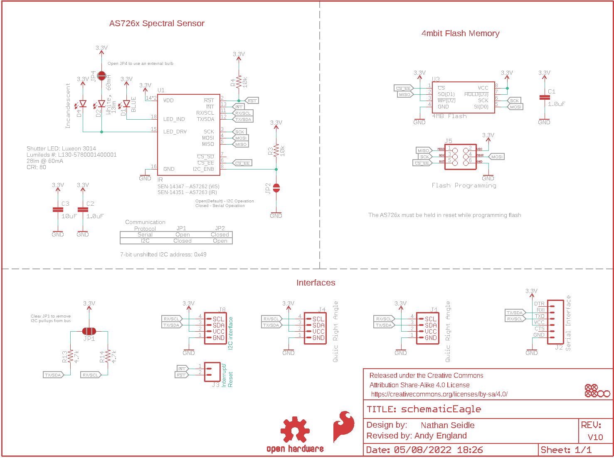](eagleSchemImage.png)
## PCB
  
[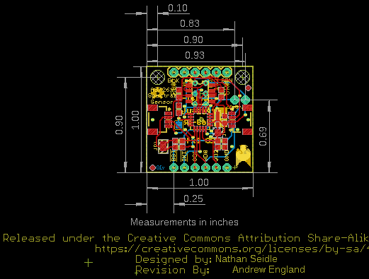](eagleImage.png)
## Interactive BOM

- Interactive BOM page: [ibom.html](https://htmlpreview.github.io/?https://github.com/oomlout/oomlout_OOMP_projects/blob/main/PROJ-SPAR-14347-STAN-01/kicad/bom/ibom.html)

## OOMP Parts
  

|OOMP ID|Name|Identifier|
| :---: | :---: | :---: |
|CAPC-0603-X-UNMATCHED-01||C1, C2|
|[CAPC-0603-X-UF10-V63D](https://github.com/oomlout/oomlout_OOMP_parts/tree/main/CAPC-0603-X-UF10-V63D/)|[SMD (0603) 10 uF Capacitor (Ceramic) 6.3v](https://github.com/oomlout/oomlout_OOMP_parts/tree/main/CAPC-0603-X-UF10-V63D/)|[C3](https://github.com/oomlout/oomlout_OOMP_parts/tree/main/CAPC-0603-X-UF10-V63D/)|
|[LEDS-0603-L-STAN-01](https://github.com/oomlout/oomlout_OOMP_parts/tree/main/LEDS-0603-L-STAN-01/)|[SMD (0603) Blue LED](https://github.com/oomlout/oomlout_OOMP_parts/tree/main/LEDS-0603-L-STAN-01/)|[D1](https://github.com/oomlout/oomlout_OOMP_parts/tree/main/LEDS-0603-L-STAN-01/)|
|LEDS-UNMATCHED-G-STAN-01||D2, D4|
|[HEAD-JSTSH-X-PI04-RS](https://github.com/oomlout/oomlout_OOMP_parts/tree/main/HEAD-JSTSH-X-PI04-RS/)|[JST XH (1 mm) 4 Pin Header Right Angle (SMD)](https://github.com/oomlout/oomlout_OOMP_parts/tree/main/HEAD-JSTSH-X-PI04-RS/)|[J1, J4](https://github.com/oomlout/oomlout_OOMP_parts/tree/main/HEAD-JSTSH-X-PI04-RS/)|
|HEAD-I01-X-UNMATCHED-01||J2|
|[HEAD-I01-X-PI02-01](https://github.com/oomlout/oomlout_OOMP_parts/tree/main/HEAD-I01-X-PI02-01/)|[2.54 mm 2 Pin Header](https://github.com/oomlout/oomlout_OOMP_parts/tree/main/HEAD-I01-X-PI02-01/)|[J3](https://github.com/oomlout/oomlout_OOMP_parts/tree/main/HEAD-I01-X-PI02-01/)|
|[HEAD-I01-X-PI04-01](https://github.com/oomlout/oomlout_OOMP_parts/tree/main/HEAD-I01-X-PI04-01/)|[2.54 mm 4 Pin Header](https://github.com/oomlout/oomlout_OOMP_parts/tree/main/HEAD-I01-X-PI04-01/)|[J8](https://github.com/oomlout/oomlout_OOMP_parts/tree/main/HEAD-I01-X-PI04-01/)|
|UNMATCHED-UNMATCHED-X-UNMATCHED-01||JP1, JP2, JP4, U1, U3|
|[RESE-0603-X-O103-01](https://github.com/oomlout/oomlout_OOMP_parts/tree/main/RESE-0603-X-O103-01/)|[SMD (0603) 10k Ohm Resistor](https://github.com/oomlout/oomlout_OOMP_parts/tree/main/RESE-0603-X-O103-01/)|[R3, R4](https://github.com/oomlout/oomlout_OOMP_parts/tree/main/RESE-0603-X-O103-01/)|
|[RESE-0603-X-O472-01](https://github.com/oomlout/oomlout_OOMP_parts/tree/main/RESE-0603-X-O472-01/)|[SMD (0603) 4.7k Ohm Resistor](https://github.com/oomlout/oomlout_OOMP_parts/tree/main/RESE-0603-X-O472-01/)|[R13, R14](https://github.com/oomlout/oomlout_OOMP_parts/tree/main/RESE-0603-X-O472-01/)|

## Images
  
  

|bominteractivefront|bominteractiveback|kicadPcb3d|kicadPcb3dFront|kicadPcb3dBack|eagleImage|eagleSchemImage|pcbdraw|pcbdrawback|
| :---: | :---: | :---: | :---: | :---: | :---: | :---: | :---: | :---: |
|[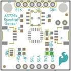](bomFront.png)|[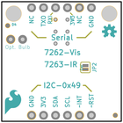](bomBack.png)|[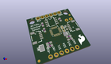](kicadPcb3d.png)|[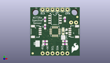](kicadPcb3dFront.png)|[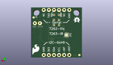](kicadPcb3dBack.png)|[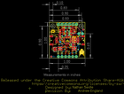](eagleImage.png)|[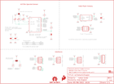](eagleSchemImage.png)|[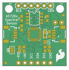](pcbdraw.png)|[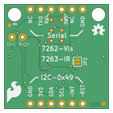](pcbdrawBack.png)|

## Tags

- hexID: PRS14347
- oompType: PROJ
- oompSize: SPAR
- oompColor: 14347
- oompDesc: STAN
- oompIndex: 01
- oompName: Qwiic Spectral Sensor AS726X
- sources: All source files from https://github.com/sparkfun/Qwiic_Spectral_Sensor_AS726X (source licence details in srcLicense.md)
- linkBuyPage: https://www.sparkfun.com/products/14347
- oompID: PROJ-SPAR-14347-STAN-01
- oompParts: C1,CAPC-0603-X-UNMATCHED-01
- oompParts: C2,CAPC-0603-X-UNMATCHED-01
- oompParts: C3,CAPC-0603-X-UF10-V63D
- oompParts: D1,LEDS-0603-L-STAN-01
- oompParts: D2,LEDS-UNMATCHED-G-STAN-01
- oompParts: D4,LEDS-UNMATCHED-G-STAN-01
- oompParts: J1,HEAD-JSTSH-X-PI04-RS
- oompParts: J2,HEAD-I01-X-UNMATCHED-01
- oompParts: J3,HEAD-I01-X-PI02-01
- oompParts: J4,HEAD-JSTSH-X-PI04-RS
- oompParts: J8,HEAD-I01-X-PI04-01
- oompParts: JP1,UNMATCHED-UNMATCHED-X-UNMATCHED-01
- oompParts: JP2,UNMATCHED-UNMATCHED-X-UNMATCHED-01
- oompParts: JP4,UNMATCHED-UNMATCHED-X-UNMATCHED-01
- oompParts: R3,RESE-0603-X-O103-01
- oompParts: R4,RESE-0603-X-O103-01
- oompParts: R13,RESE-0603-X-O472-01
- oompParts: R14,RESE-0603-X-O472-01
- oompParts: U1,UNMATCHED-UNMATCHED-X-UNMATCHED-01
- oompParts: U3,UNMATCHED-UNMATCHED-X-UNMATCHED-01
- rawParts: C1,1.0uF,1.0UF-0603-16V-10%,0603,1µF ceramic capacitors,CAP-00868,1.0uF,
- rawParts: C2,1.0uF,1.0UF-0603-16V-10%,0603,1µF ceramic capacitors,CAP-00868,1.0uF,
- rawParts: C3,10uF,10UF-0603-6.3V-20%,0603,10.0µF ceramic capacitors,CAP-11015,10uF,
- rawParts: D1,BLUE,LED-BLUE0603,LED-0603,Blue SMD LED,DIO-08575,BLUE,
- rawParts: D2,White, 60mA,LED-WHITE3014,SUPER_BRIGHT_SMD_LED_3014,White SMD LED,DIO-13728,White, 60mA,
- rawParts: D4,Incandescent,LEDNS,LED_5MM_NOSILK,,,,
- rawParts: FD1,FIDUCIAL1X2,FIDUCIAL1X2,FIDUCIAL-1X2,Fiducial Alignment Points,,,
- rawParts: FD2,FIDUCIAL1X2,FIDUCIAL1X2,FIDUCIAL-1X2,Fiducial Alignment Points,,,
- rawParts: FD3,FIDUCIAL1X2,FIDUCIAL1X2,FIDUCIAL-1X2,Fiducial Alignment Points,,,
- rawParts: FD4,FIDUCIAL1X2,FIDUCIAL1X2,FIDUCIAL-1X2,Fiducial Alignment Points,,,
- rawParts: FRAME1,FRAME-LETTER,FRAME-LETTER,CREATIVE_COMMONS,Schematic Frame - Letter,,,
- rawParts: H2,STAND-OFF,STAND-OFF,STAND-OFF,Stand Off,,,
- rawParts: H4,STAND-OFF,STAND-OFF,STAND-OFF,Stand Off,,,
- rawParts: J1,Qwiic Right Angle,I2C_STANDARDQWIIC,1X04_1MM_RA,SparkFun I2C Standard Pinout Header,CONN-13694,Qwiic Right Angle,
- rawParts: J2,Serial Interface,6_PIN_SERIAL_CABLEPTH,FTDI_BASIC,6-pin header connection for use with the FTDI BASIC pinout - CABLE SIDE.,,,
- rawParts: J3,,CONN_021X02_NO_SILK,1X02_NO_SILK,Multi connection point. Often used as Generic Header-pin footprint for 0.1 inch spaced/style header connections,,,
- rawParts: J4,Qwiic Right Angle,I2C_STANDARDQWIIC,1X04_1MM_RA,SparkFun I2C Standard Pinout Header,CONN-13694,Qwiic Right Angle,
- rawParts: J5,Flash Programming,AVR_SPI_PROG_3X2TESTPOINTS,2X3_TEST_POINTS,AVR ISP 6 Pin,,,
- rawParts: J8,,I2C_STANDARD_NO_SILK,1X04_NO_SILK,SparkFun I2C Standard Pinout Header,,,
- rawParts: JP1,,JUMPER-SMT_3_2-NC_PASTE_SILK,SMT-JUMPER_3_2-NC_PASTE_SILK,Normally closed solder jumper (2 of 2 connections),,,
- rawParts: JP2,,JUMPER-SMT_2_NO_SILK,SMT-JUMPER_2_NO_SILK,Normally open jumper,,,
- rawParts: JP4,,JUMPER-SMT_2_NC_PASTE_NO-SILK,SMT-JUMPER_2_NC_PASTE_NO-SILK,Normally closed solder jumper,,,
- rawParts: LOGO1,SFE_LOGO_FLAME.2_INCH,SFE_LOGO_FLAME.2_INCH,SFE_LOGO_FLAME_.2,SparkFun Flame Logo,,,
- rawParts: LOGO2,SFE_LOGO_FLAME.2_INCH,SFE_LOGO_FLAME.2_INCH,SFE_LOGO_FLAME_.2,SparkFun Flame Logo,,,
- rawParts: LOGO4,OSHW-LOGOS,OSHW-LOGOS,OSHW-LOGO-S,Open-Source Hardware (OSHW) Logo,,,
- rawParts: R3,10k,10KOHM-0603-1/10W-1%,0603,10kΩ resistor,RES-00824,10k,
- rawParts: R4,10k,10KOHM-0603-1/10W-1%,0603,10kΩ resistor,RES-00824,10k,
- rawParts: R13,4.7k,4.7KOHM-0603-1/10W-1%,0603,4.7kΩ resistor,RES-07857,4.7k,
- rawParts: R14,4.7k,4.7KOHM-0603-1/10W-1%,0603,4.7kΩ resistor,RES-07857,4.7k,
- rawParts: U1,IR,AS726XIR,LGA20,,IC-13731,IR,
- rawParts: U3,4MB Flash,AT25SF041,SO08,AT25SF041 4Mb Serial Flash Memory,IC-12455,4MB Flash,

[im]: kicadPcb3d_450.png
