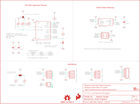

Contents
========

* [PRS14347 > Sparkfun](#prs14347--sparkfun)
	* [Schematic](#schematic)
	* [Interactive BOM](#interactive-bom)
	* [OOMP Parts](#oomp-parts)
	* [Images](#images)
	* [Tags](#tags)
  
![][im]
# PRS14347 > Sparkfun

- ID: PROJ-SPAR-14347-STAN-01
- Hex ID: PRS14347
- Name: Sparkfun
- Description: Sparkfun
- Long Link: [http://oom.lt/PROJ-SPAR-14347-STAN-01](http://oom.lt/PROJ-SPAR-14347-STAN-01)
- Long Link: [http://oom.lt/PRS14347](http://oom.lt/PRS14347)

## Schematic
  
![][schem]
## Interactive BOM

- Interactive BOM page: [ibom.html](https://htmlpreview.github.io/?https://github.com/oomlout/oomlout_OOMP_projects/blob/main/PROJ-SPAR-14347-STAN-01/kicad/bom/ibom.html)

## OOMP Parts
  

|OOMP Parts|
| :---: |
|C1,UNMATCHED-UNMATCHED-UNMATCHED-UNMATCHED-UNMATCHED,C1,1.0uF,1.0UF-0603-16V-10%,0603,1µF ceramic capacitors,CAP-00868,1.0uF,|
|C2,UNMATCHED-UNMATCHED-UNMATCHED-UNMATCHED-UNMATCHED,C2,1.0uF,1.0UF-0603-16V-10%,0603,1µF ceramic capacitors,CAP-00868,1.0uF,|
|C3,UNMATCHED-UNMATCHED-UNMATCHED-UNMATCHED-UNMATCHED,C3,10uF,10UF-0603-6.3V-20%,0603,10.0µF ceramic capacitors,CAP-11015,10uF,|
|D1,UNMATCHED-UNMATCHED-UNMATCHED-UNMATCHED-UNMATCHED,D1,BLUE,LED-BLUE0603,LED-0603,Blue SMD LED,DIO-08575,BLUE,|
|D2,UNMATCHED-UNMATCHED-UNMATCHED-UNMATCHED-UNMATCHED,D2,White, 60mA,LED-WHITE3014,SUPER_BRIGHT_SMD_LED_3014,White SMD LED,DIO-13728,White, 60mA,|
|D4,UNMATCHED-UNMATCHED-UNMATCHED-UNMATCHED-UNMATCHED,D4,Incandescent,LEDNS,LED_5MM_NOSILK,,,,|
|FRAME1,UNMATCHED-UNMATCHED-UNMATCHED-UNMATCHED-UNMATCHED,FD1,FIDUCIAL1X2,FIDUCIAL1X2,FIDUCIAL-1X2,Fiducial Alignment Points,,,|
|H2,UNMATCHED-UNMATCHED-UNMATCHED-UNMATCHED-UNMATCHED,FD2,FIDUCIAL1X2,FIDUCIAL1X2,FIDUCIAL-1X2,Fiducial Alignment Points,,,|
|H4,UNMATCHED-UNMATCHED-UNMATCHED-UNMATCHED-UNMATCHED,FD3,FIDUCIAL1X2,FIDUCIAL1X2,FIDUCIAL-1X2,Fiducial Alignment Points,,,|
|J1,UNMATCHED-UNMATCHED-UNMATCHED-UNMATCHED-UNMATCHED,FD4,FIDUCIAL1X2,FIDUCIAL1X2,FIDUCIAL-1X2,Fiducial Alignment Points,,,|
|J2,UNMATCHED-UNMATCHED-UNMATCHED-UNMATCHED-UNMATCHED,FRAME1,FRAME-LETTER,FRAME-LETTER,CREATIVE_COMMONS,Schematic Frame - Letter,,,|
|J3,UNMATCHED-UNMATCHED-UNMATCHED-UNMATCHED-UNMATCHED,H2,STAND-OFF,STAND-OFF,STAND-OFF,Stand Off,,,|
|J4,UNMATCHED-UNMATCHED-UNMATCHED-UNMATCHED-UNMATCHED,H4,STAND-OFF,STAND-OFF,STAND-OFF,Stand Off,,,|
|J5,UNMATCHED-UNMATCHED-UNMATCHED-UNMATCHED-UNMATCHED,J1,Qwiic Right Angle,I2C_STANDARDQWIIC,1X04_1MM_RA,SparkFun I2C Standard Pinout Header,CONN-13694,Qwiic Right Angle,|
|J8,UNMATCHED-UNMATCHED-UNMATCHED-UNMATCHED-UNMATCHED,J2,Serial Interface,6_PIN_SERIAL_CABLEPTH,FTDI_BASIC,6-pin header connection for use with the FTDI BASIC pinout - CABLE SIDE.,,,|
|JP1,UNMATCHED-UNMATCHED-UNMATCHED-UNMATCHED-UNMATCHED,J3,,CONN_021X02_NO_SILK,1X02_NO_SILK,Multi connection point. Often used as Generic Header-pin footprint for 0.1 inch spaced/style header connections,,,|
|JP2,UNMATCHED-UNMATCHED-UNMATCHED-UNMATCHED-UNMATCHED,J4,Qwiic Right Angle,I2C_STANDARDQWIIC,1X04_1MM_RA,SparkFun I2C Standard Pinout Header,CONN-13694,Qwiic Right Angle,|
|JP4,UNMATCHED-UNMATCHED-UNMATCHED-UNMATCHED-UNMATCHED,J5,Flash Programming,AVR_SPI_PROG_3X2TESTPOINTS,2X3_TEST_POINTS,AVR ISP 6 Pin,,,|
|LOGO1,UNMATCHED-UNMATCHED-UNMATCHED-UNMATCHED-UNMATCHED,J8,,I2C_STANDARD_NO_SILK,1X04_NO_SILK,SparkFun I2C Standard Pinout Header,,,|
|LOGO2,UNMATCHED-UNMATCHED-UNMATCHED-UNMATCHED-UNMATCHED,JP1,,JUMPER-SMT_3_2-NC_PASTE_SILK,SMT-JUMPER_3_2-NC_PASTE_SILK,Normally closed solder jumper (2 of 2 connections),,,|
|LOGO4,UNMATCHED-UNMATCHED-UNMATCHED-UNMATCHED-UNMATCHED,JP2,,JUMPER-SMT_2_NO_SILK,SMT-JUMPER_2_NO_SILK,Normally open jumper,,,|
|R3,UNMATCHED-UNMATCHED-UNMATCHED-UNMATCHED-UNMATCHED,JP4,,JUMPER-SMT_2_NC_PASTE_NO-SILK,SMT-JUMPER_2_NC_PASTE_NO-SILK,Normally closed solder jumper,,,|
|R4,UNMATCHED-UNMATCHED-UNMATCHED-UNMATCHED-UNMATCHED,LOGO1,SFE_LOGO_FLAME.2_INCH,SFE_LOGO_FLAME.2_INCH,SFE_LOGO_FLAME_.2,SparkFun Flame Logo,,,|
|R13,UNMATCHED-UNMATCHED-UNMATCHED-UNMATCHED-UNMATCHED,LOGO2,SFE_LOGO_FLAME.2_INCH,SFE_LOGO_FLAME.2_INCH,SFE_LOGO_FLAME_.2,SparkFun Flame Logo,,,|
|R14,UNMATCHED-UNMATCHED-UNMATCHED-UNMATCHED-UNMATCHED,LOGO4,OSHW-LOGOS,OSHW-LOGOS,OSHW-LOGO-S,Open-Source Hardware (OSHW) Logo,,,|
|U1,UNMATCHED-UNMATCHED-UNMATCHED-UNMATCHED-UNMATCHED,R3,10k,10KOHM-0603-1/10W-1%,0603,10kΩ resistor,RES-00824,10k,|
|U3,UNMATCHED-UNMATCHED-UNMATCHED-UNMATCHED-UNMATCHED,R4,10k,10KOHM-0603-1/10W-1%,0603,10kΩ resistor,RES-00824,10k,|

## Images
  
  

|kicadPcb3d|kicadPcb3dFront|kicadPcb3dBack|eagleImage|eagleSchemImage|
| :---: | :---: | :---: | :---: | :---: |
||||||

## Tags

- hexID: PRS14347
- oompType: PROJ
- oompSize: SPAR
- oompColor: 14347
- oompDesc: STAN
- oompIndex: 01
- oompName: Qwiic Spectral Sensor AS726X
- sources: All source files from https://github.com/sparkfun/Qwiic_Spectral_Sensor_AS726X (source licence details in srcLicense.md)
- linkBuyPage: https://www.sparkfun.com/products/14347
- oompID: PROJ-SPAR-14347-STAN-01
- oompParts: C1,UNMATCHED-UNMATCHED-UNMATCHED-UNMATCHED-UNMATCHED
- oompParts: C2,UNMATCHED-UNMATCHED-UNMATCHED-UNMATCHED-UNMATCHED
- oompParts: C3,UNMATCHED-UNMATCHED-UNMATCHED-UNMATCHED-UNMATCHED
- oompParts: D1,UNMATCHED-UNMATCHED-UNMATCHED-UNMATCHED-UNMATCHED
- oompParts: D2,UNMATCHED-UNMATCHED-UNMATCHED-UNMATCHED-UNMATCHED
- oompParts: D4,UNMATCHED-UNMATCHED-UNMATCHED-UNMATCHED-UNMATCHED
- oompParts: FRAME1,UNMATCHED-UNMATCHED-UNMATCHED-UNMATCHED-UNMATCHED
- oompParts: H2,UNMATCHED-UNMATCHED-UNMATCHED-UNMATCHED-UNMATCHED
- oompParts: H4,UNMATCHED-UNMATCHED-UNMATCHED-UNMATCHED-UNMATCHED
- oompParts: J1,UNMATCHED-UNMATCHED-UNMATCHED-UNMATCHED-UNMATCHED
- oompParts: J2,UNMATCHED-UNMATCHED-UNMATCHED-UNMATCHED-UNMATCHED
- oompParts: J3,UNMATCHED-UNMATCHED-UNMATCHED-UNMATCHED-UNMATCHED
- oompParts: J4,UNMATCHED-UNMATCHED-UNMATCHED-UNMATCHED-UNMATCHED
- oompParts: J5,UNMATCHED-UNMATCHED-UNMATCHED-UNMATCHED-UNMATCHED
- oompParts: J8,UNMATCHED-UNMATCHED-UNMATCHED-UNMATCHED-UNMATCHED
- oompParts: JP1,UNMATCHED-UNMATCHED-UNMATCHED-UNMATCHED-UNMATCHED
- oompParts: JP2,UNMATCHED-UNMATCHED-UNMATCHED-UNMATCHED-UNMATCHED
- oompParts: JP4,UNMATCHED-UNMATCHED-UNMATCHED-UNMATCHED-UNMATCHED
- oompParts: LOGO1,UNMATCHED-UNMATCHED-UNMATCHED-UNMATCHED-UNMATCHED
- oompParts: LOGO2,UNMATCHED-UNMATCHED-UNMATCHED-UNMATCHED-UNMATCHED
- oompParts: LOGO4,UNMATCHED-UNMATCHED-UNMATCHED-UNMATCHED-UNMATCHED
- oompParts: R3,UNMATCHED-UNMATCHED-UNMATCHED-UNMATCHED-UNMATCHED
- oompParts: R4,UNMATCHED-UNMATCHED-UNMATCHED-UNMATCHED-UNMATCHED
- oompParts: R13,UNMATCHED-UNMATCHED-UNMATCHED-UNMATCHED-UNMATCHED
- oompParts: R14,UNMATCHED-UNMATCHED-UNMATCHED-UNMATCHED-UNMATCHED
- oompParts: U1,UNMATCHED-UNMATCHED-UNMATCHED-UNMATCHED-UNMATCHED
- oompParts: U3,UNMATCHED-UNMATCHED-UNMATCHED-UNMATCHED-UNMATCHED
- rawParts: C1,1.0uF,1.0UF-0603-16V-10%,0603,1µF ceramic capacitors,CAP-00868,1.0uF,
- rawParts: C2,1.0uF,1.0UF-0603-16V-10%,0603,1µF ceramic capacitors,CAP-00868,1.0uF,
- rawParts: C3,10uF,10UF-0603-6.3V-20%,0603,10.0µF ceramic capacitors,CAP-11015,10uF,
- rawParts: D1,BLUE,LED-BLUE0603,LED-0603,Blue SMD LED,DIO-08575,BLUE,
- rawParts: D2,White, 60mA,LED-WHITE3014,SUPER_BRIGHT_SMD_LED_3014,White SMD LED,DIO-13728,White, 60mA,
- rawParts: D4,Incandescent,LEDNS,LED_5MM_NOSILK,,,,
- rawParts: FD1,FIDUCIAL1X2,FIDUCIAL1X2,FIDUCIAL-1X2,Fiducial Alignment Points,,,
- rawParts: FD2,FIDUCIAL1X2,FIDUCIAL1X2,FIDUCIAL-1X2,Fiducial Alignment Points,,,
- rawParts: FD3,FIDUCIAL1X2,FIDUCIAL1X2,FIDUCIAL-1X2,Fiducial Alignment Points,,,
- rawParts: FD4,FIDUCIAL1X2,FIDUCIAL1X2,FIDUCIAL-1X2,Fiducial Alignment Points,,,
- rawParts: FRAME1,FRAME-LETTER,FRAME-LETTER,CREATIVE_COMMONS,Schematic Frame - Letter,,,
- rawParts: H2,STAND-OFF,STAND-OFF,STAND-OFF,Stand Off,,,
- rawParts: H4,STAND-OFF,STAND-OFF,STAND-OFF,Stand Off,,,
- rawParts: J1,Qwiic Right Angle,I2C_STANDARDQWIIC,1X04_1MM_RA,SparkFun I2C Standard Pinout Header,CONN-13694,Qwiic Right Angle,
- rawParts: J2,Serial Interface,6_PIN_SERIAL_CABLEPTH,FTDI_BASIC,6-pin header connection for use with the FTDI BASIC pinout - CABLE SIDE.,,,
- rawParts: J3,,CONN_021X02_NO_SILK,1X02_NO_SILK,Multi connection point. Often used as Generic Header-pin footprint for 0.1 inch spaced/style header connections,,,
- rawParts: J4,Qwiic Right Angle,I2C_STANDARDQWIIC,1X04_1MM_RA,SparkFun I2C Standard Pinout Header,CONN-13694,Qwiic Right Angle,
- rawParts: J5,Flash Programming,AVR_SPI_PROG_3X2TESTPOINTS,2X3_TEST_POINTS,AVR ISP 6 Pin,,,
- rawParts: J8,,I2C_STANDARD_NO_SILK,1X04_NO_SILK,SparkFun I2C Standard Pinout Header,,,
- rawParts: JP1,,JUMPER-SMT_3_2-NC_PASTE_SILK,SMT-JUMPER_3_2-NC_PASTE_SILK,Normally closed solder jumper (2 of 2 connections),,,
- rawParts: JP2,,JUMPER-SMT_2_NO_SILK,SMT-JUMPER_2_NO_SILK,Normally open jumper,,,
- rawParts: JP4,,JUMPER-SMT_2_NC_PASTE_NO-SILK,SMT-JUMPER_2_NC_PASTE_NO-SILK,Normally closed solder jumper,,,
- rawParts: LOGO1,SFE_LOGO_FLAME.2_INCH,SFE_LOGO_FLAME.2_INCH,SFE_LOGO_FLAME_.2,SparkFun Flame Logo,,,
- rawParts: LOGO2,SFE_LOGO_FLAME.2_INCH,SFE_LOGO_FLAME.2_INCH,SFE_LOGO_FLAME_.2,SparkFun Flame Logo,,,
- rawParts: LOGO4,OSHW-LOGOS,OSHW-LOGOS,OSHW-LOGO-S,Open-Source Hardware (OSHW) Logo,,,
- rawParts: R3,10k,10KOHM-0603-1/10W-1%,0603,10kΩ resistor,RES-00824,10k,
- rawParts: R4,10k,10KOHM-0603-1/10W-1%,0603,10kΩ resistor,RES-00824,10k,
- rawParts: R13,4.7k,4.7KOHM-0603-1/10W-1%,0603,4.7kΩ resistor,RES-07857,4.7k,
- rawParts: R14,4.7k,4.7KOHM-0603-1/10W-1%,0603,4.7kΩ resistor,RES-07857,4.7k,
- rawParts: U1,IR,AS726XIR,LGA20,,IC-13731,IR,
- rawParts: U3,4MB Flash,AT25SF041,SO08,AT25SF041 4Mb Serial Flash Memory,IC-12455,4MB Flash,

[im]: kicadPcb3d_450.png
[schem]: eagleSchemImage.png
