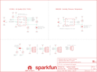
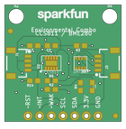

Contents
========

* [PRS14348 > Qwiic BME280 CCS811 Combo](#prs14348--qwiic-bme280-ccs811-combo)
	* [Schematic](#schematic)
	* [PCB](#pcb)
	* [Interactive BOM](#interactive-bom)
	* [OOMP Parts](#oomp-parts)
	* [Images](#images)
	* [Tags](#tags)
  
![][im]
# PRS14348 > Qwiic BME280 CCS811 Combo

- ID: PROJ-SPAR-14348-STAN-01
- Hex ID: PRS14348
- Name: Sparkfun
- Description: Sparkfun
- Long Link: [http://oom.lt/PROJ-SPAR-14348-STAN-01](http://oom.lt/PROJ-SPAR-14348-STAN-01)
- Short Link: [http://oom.lt/PRS14348](http://oom.lt/PRS14348)

## Schematic
  

## PCB
  

## Interactive BOM

- Interactive BOM page: [ibom.html](https://htmlpreview.github.io/?https://github.com/oomlout/oomlout_OOMP_projects/blob/main/PROJ-SPAR-14348-STAN-01/kicad/bom/ibom.html)

## OOMP Parts
  

|OOMP Parts|
| :---: |
|UNMATCHED-UNMATCHED-X-UNMATCHED-01 ADR1, ADR2, JP1, U2, U3|
|[CAPC-0603-X-NF100-V50  SMD (0603) 100 nF Capacitor (Ceramic) 50v  C1](https://github.com/oomlout/oomlout_OOMP_parts/tree/main/CAPC-0603-X-NF100-V50/)|
|CAPC-0603-X-UNMATCHED-01 C2|
|HEAD-UNMATCHED-X-PI04-01 J1, J3|
|[HEAD-I01-X-PI03-01  2.54 mm 3 Pin Header  J2](https://github.com/oomlout/oomlout_OOMP_parts/tree/main/HEAD-I01-X-PI03-01/)|
|[HEAD-I01-X-PI04-01  2.54 mm 4 Pin Header  J4](https://github.com/oomlout/oomlout_OOMP_parts/tree/main/HEAD-I01-X-PI04-01/)|
|[RESE-0603-X-O472-01  SMD (0603) 4.7k Ohm Resistor  R2, R13, R14](https://github.com/oomlout/oomlout_OOMP_parts/tree/main/RESE-0603-X-O472-01/)|
|RESE-0603-X-O1003-01 R3, R4, R6|

## Images
  
  

|bominteractivefront|bominteractiveback|kicadPcb3d|kicadPcb3dFront|kicadPcb3dBack|eagleImage|eagleSchemImage|pcbdraw|pcbdrawback|
| :---: | :---: | :---: | :---: | :---: | :---: | :---: | :---: | :---: |
||||||||||

## Tags

- hexID: PRS14348
- oompType: PROJ
- oompSize: SPAR
- oompColor: 14348
- oompDesc: STAN
- oompIndex: 01
- oompName: Qwiic BME280 CCS811 Combo
- sources: All source files from https://github.com/sparkfun/Qwiic_BME280_CCS811_Combo (source licence details in srcLicense.md)
- linkBuyPage: https://www.sparkfun.com/products/14348
- oompID: PROJ-SPAR-14348-STAN-01
- oompParts: ADR1,UNMATCHED-UNMATCHED-X-UNMATCHED-01
- oompParts: ADR2,UNMATCHED-UNMATCHED-X-UNMATCHED-01
- oompParts: C1,CAPC-0603-X-NF100-V50
- oompParts: C2,CAPC-0603-X-UNMATCHED-01
- oompParts: J1,HEAD-UNMATCHED-X-PI04-01
- oompParts: J2,HEAD-I01-X-PI03-01
- oompParts: J3,HEAD-UNMATCHED-X-PI04-01
- oompParts: J4,HEAD-I01-X-PI04-01
- oompParts: JP1,UNMATCHED-UNMATCHED-X-UNMATCHED-01
- oompParts: R2,RESE-0603-X-O472-01
- oompParts: R3,RESE-0603-X-O1003-01
- oompParts: R4,RESE-0603-X-O1003-01
- oompParts: R6,RESE-0603-X-O1003-01
- oompParts: R13,RESE-0603-X-O472-01
- oompParts: R14,RESE-0603-X-O472-01
- oompParts: U2,UNMATCHED-UNMATCHED-X-UNMATCHED-01
- oompParts: U3,UNMATCHED-UNMATCHED-X-UNMATCHED-01
- rawParts: ADR1,,JUMPER-SMT_2_NO_SILK,SMT-JUMPER_2_NO_SILK,Normally open jumper,,,
- rawParts: ADR2,,JUMPER-SMT_2_NO_SILK,SMT-JUMPER_2_NO_SILK,Normally open jumper,,,
- rawParts: C1,0.1uF,0.1UF-0603-25V-(+80/-20%),0603,0.1µF ceramic capacitors,CAP-00810,0.1uF,
- rawParts: C2,1.0uF,1.0UF-0603-16V-10%,0603,1µF ceramic capacitors,CAP-00868,1.0uF,
- rawParts: FD1,FIDUCIAL1X2,FIDUCIAL1X2,FIDUCIAL-1X2,Fiducial Alignment Points,,,
- rawParts: FD2,FIDUCIAL1X2,FIDUCIAL1X2,FIDUCIAL-1X2,Fiducial Alignment Points,,,
- rawParts: FD3,FIDUCIAL1X2,FIDUCIAL1X2,FIDUCIAL-1X2,Fiducial Alignment Points,,,
- rawParts: FD4,FIDUCIAL1X2,FIDUCIAL1X2,FIDUCIAL-1X2,Fiducial Alignment Points,,,
- rawParts: FRAME1,FRAME-LETTER,FRAME-LETTER,CREATIVE_COMMONS,Schematic Frame - Letter,,,
- rawParts: H2,STAND-OFF,STAND-OFF,STAND-OFF,Stand Off,,,
- rawParts: H4,STAND-OFF,STAND-OFF,STAND-OFF,Stand Off,,,
- rawParts: J1,Qwiic Right Angle,I2C_STANDARDQWIIC,1X04_1MM_RA,SparkFun I2C Standard Pinout Header,CONN-13729,Qwiic Right Angle,
- rawParts: J2,CCS811 Options,CONN_031X03_NO_SILK,1X03_NO_SILK,Multi connection point. Often used as Generic Header-pin footprint for 0.1 inch spaced/style header connections,,,
- rawParts: J3,Qwiic Right Angle,I2C_STANDARDQWIIC,1X04_1MM_RA,SparkFun I2C Standard Pinout Header,CONN-13729,Qwiic Right Angle,
- rawParts: J4,PTH,I2C_STANDARD_NO_SILK,1X04_NO_SILK,SparkFun I2C Standard Pinout Header,,,
- rawParts: JP1,,JUMPER-SMT_3_2-NC_TRACE_SILK,SMT-JUMPER_3_2-NC_TRACE_SILK,Normally closed trace jumper (2 of 2 connections),,,
- rawParts: LOGO1,SFE_LOGO_NAME.1_INCH,SFE_LOGO_NAME.1_INCH,SFE_LOGO_NAME_.1,SparkFun Font Logo,,,
- rawParts: LOGO2,REVISION,REVISION,REVISION,Revision By Text,,,
- rawParts: LOGO4,OSHW-LOGOS,OSHW-LOGOS,OSHW-LOGO-S,Open-Source Hardware (OSHW) Logo,,,
- rawParts: R2,4.7k,4.7KOHM-0603-1/10W-1%,0603,4.7kΩ resistor,RES-07857,4.7k,
- rawParts: R3,100k,100KOHM-0603-1/10W-1%,0603,100kΩ resistor,RES-07828,100k,
- rawParts: R4,100k,100KOHM-0603-1/10W-1%,0603,100kΩ resistor,RES-07828,100k,
- rawParts: R6,100k,100KOHM-0603-1/10W-1%,0603,100kΩ resistor,RES-07828,100k,
- rawParts: R13,4.7k,4.7KOHM-0603-1/10W-1%,0603,4.7kΩ resistor,RES-07857,4.7k,
- rawParts: R14,4.7k,4.7KOHM-0603-1/10W-1%,0603,4.7kΩ resistor,RES-07857,4.7k,
- rawParts: U2,CCS811,CCS811PRODUCTION,LGA10,AMS CCS811 &ndash, I2C Digital Gas Sensor,IC-13607,CCS811,
- rawParts: U3,BME280,BME280,LGA-8-2.5X2.5,Bosch BME280 &ndash, Combined Humidity and Pressure Sensor,IC-13090,BME280,

[im]: kicadPcb3d_450.png
