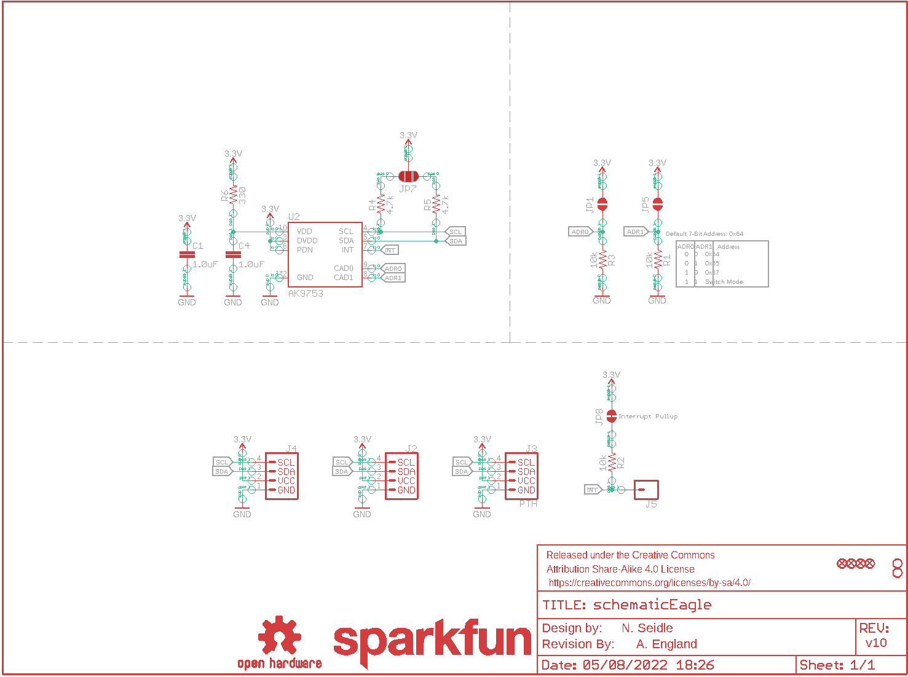
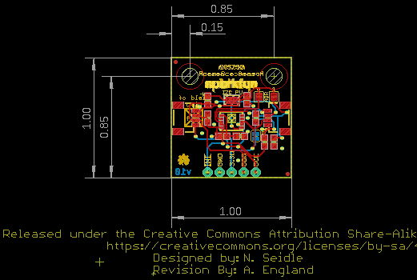

Contents
========

* [PRS14349 > Qwiic Human Presence Sensor Breakout AK9753](#prs14349--qwiic-human-presence-sensor-breakout-ak9753)
	* [Schematic](#schematic)
	* [PCB](#pcb)
	* [Interactive BOM](#interactive-bom)
	* [OOMP Parts](#oomp-parts)
	* [Images](#images)
	* [Tags](#tags)
  
![][im]
# PRS14349 > Qwiic Human Presence Sensor Breakout AK9753

- ID: PROJ-SPAR-14349-STAN-01
- Hex ID: PRS14349
- Name: Sparkfun
- Description: Sparkfun
- Long Link: [http://oom.lt/PROJ-SPAR-14349-STAN-01](http://oom.lt/PROJ-SPAR-14349-STAN-01)
- Short Link: [http://oom.lt/PRS14349](http://oom.lt/PRS14349)

## Schematic
  

## PCB
  

## Interactive BOM

- Interactive BOM page: [ibom.html](https://htmlpreview.github.io/?https://github.com/oomlout/oomlout_OOMP_projects/blob/main/PROJ-SPAR-14349-STAN-01/kicad/bom/ibom.html)

## OOMP Parts
  

|OOMP Parts|
| :---: |
|[CAPC-0603-X-UF1-V25  SMD (0603) 1 uF Capacitor (Ceramic) 25v  C1, C4](https://github.com/oomlout/oomlout_OOMP_parts/tree/main/CAPC-0603-X-UF1-V25/)|
|UNMATCHED-UNMATCHED-X-UNMATCHED-01 J2, J4, JP1, JP5, JP7, JP8, U2|
|[HEAD-I01-X-PI04-01  2.54 mm 4 Pin Header  J3](https://github.com/oomlout/oomlout_OOMP_parts/tree/main/HEAD-I01-X-PI04-01/)|
|HEAD-I01-X-PI01-01 J5|
|[RESE-0603-X-O103-01  SMD (0603) 10k Ohm Resistor  R1, R2, R3](https://github.com/oomlout/oomlout_OOMP_parts/tree/main/RESE-0603-X-O103-01/)|
|[RESE-0603-X-O472-01  SMD (0603) 4.7k Ohm Resistor  R4, R5](https://github.com/oomlout/oomlout_OOMP_parts/tree/main/RESE-0603-X-O472-01/)|
|[RESE-0603-X-O331-01  SMD (0603) 330 Ohm Resistor  R6](https://github.com/oomlout/oomlout_OOMP_parts/tree/main/RESE-0603-X-O331-01/)|

## Images
  
  

|kicadPcb3d|kicadPcb3dFront|kicadPcb3dBack|eagleImage|eagleSchemImage|
| :---: | :---: | :---: | :---: | :---: |
||||||

## Tags

- hexID: PRS14349
- oompType: PROJ
- oompSize: SPAR
- oompColor: 14349
- oompDesc: STAN
- oompIndex: 01
- oompName: Qwiic Human Presence Sensor Breakout AK9753
- sources: All source files from https://github.com/sparkfun/Qwiic_Human_Presence_Sensor_Breakout_AK9753 (source licence details in srcLicense.md)
- linkBuyPage: https://www.sparkfun.com/products/14349
- oompID: PROJ-SPAR-14349-STAN-01
- oompParts: C1,CAPC-0603-X-UF1-V25
- oompParts: C4,CAPC-0603-X-UF1-V25
- oompParts: J2,UNMATCHED-UNMATCHED-X-UNMATCHED-01
- oompParts: J3,HEAD-I01-X-PI04-01
- oompParts: J4,UNMATCHED-UNMATCHED-X-UNMATCHED-01
- oompParts: J5,HEAD-I01-X-PI01-01
- oompParts: JP1,UNMATCHED-UNMATCHED-X-UNMATCHED-01
- oompParts: JP5,UNMATCHED-UNMATCHED-X-UNMATCHED-01
- oompParts: JP7,UNMATCHED-UNMATCHED-X-UNMATCHED-01
- oompParts: JP8,UNMATCHED-UNMATCHED-X-UNMATCHED-01
- oompParts: R1,RESE-0603-X-O103-01
- oompParts: R2,RESE-0603-X-O103-01
- oompParts: R3,RESE-0603-X-O103-01
- oompParts: R4,RESE-0603-X-O472-01
- oompParts: R5,RESE-0603-X-O472-01
- oompParts: R6,RESE-0603-X-O331-01
- oompParts: U2,UNMATCHED-UNMATCHED-X-UNMATCHED-01
- rawParts: C1,1.0uF,1.0UF-0603-16V-10%,0603,1µF ceramic capacitors,CAP-00868,1.0uF,
- rawParts: C4,1.0uF,1.0UF-0603-16V-10%,0603,1µF ceramic capacitors,CAP-00868,1.0uF,
- rawParts: FRAME1,FRAME-LETTER,FRAME-LETTER,CREATIVE_COMMONS,Schematic Frame - Letter,,,
- rawParts: J2,,QWIIC_CONNECTORJS-1MM,1X04_1MM_RA,SparkFun I2C Standard Qwiic Connector,CONN-13694,,
- rawParts: J3,PTH,I2C_STANDARD_NO_SILK,1X04_NO_SILK,SparkFun I2C Standard Pinout Header,,,
- rawParts: J4,,QWIIC_CONNECTORJS-1MM,1X04_1MM_RA,SparkFun I2C Standard Qwiic Connector,CONN-13694,,
- rawParts: J5,,CONN_01PTH_NO_SILK_YES_STOP,1X01_NO_SILK,Single connection point. Often used as Generic Header-pin footprint for 0.1 inch spaced/style header connections,,,
- rawParts: JP1,,JUMPER-SMT_2_NO_SILK,SMT-JUMPER_2_NO_SILK,Normally open jumper,,,
- rawParts: JP2,FIDUCIALUFIDUCIAL,FIDUCIALUFIDUCIAL,MICRO-FIDUCIAL,Fiducial Alignment Points,,,
- rawParts: JP3,STAND-OFF,STAND-OFF,STAND-OFF,Stand Off,,,
- rawParts: JP4,STAND-OFF,STAND-OFF,STAND-OFF,Stand Off,,,
- rawParts: JP5,,JUMPER-SMT_2_NO_SILK,SMT-JUMPER_2_NO_SILK,Normally open jumper,,,
- rawParts: JP6,FIDUCIALUFIDUCIAL,FIDUCIALUFIDUCIAL,MICRO-FIDUCIAL,Fiducial Alignment Points,,,
- rawParts: JP7,,JUMPER-SMT_3_2-NC_PASTE_SILK,SMT-JUMPER_3_2-NC_PASTE_SILK,Normally closed solder jumper (2 of 2 connections),,,
- rawParts: JP8,,JUMPER-SMT_2_NC_TRACE_SILK,SMT-JUMPER_2_NC_TRACE_SILK,Normally closed trace jumper,,,
- rawParts: JP9,FIDUCIALUFIDUCIAL,FIDUCIALUFIDUCIAL,MICRO-FIDUCIAL,Fiducial Alignment Points,,,
- rawParts: JP10,FIDUCIALUFIDUCIAL,FIDUCIALUFIDUCIAL,MICRO-FIDUCIAL,Fiducial Alignment Points,,,
- rawParts: LOGO1,OSHW-LOGOMINI,OSHW-LOGOMINI,OSHW-LOGO-MINI,Open-Source Hardware (OSHW) Logo,,,
- rawParts: LOGO2,SFE_LOGO_NAME.1_INCH,SFE_LOGO_NAME.1_INCH,SFE_LOGO_NAME_.1,SparkFun Font Logo,,,
- rawParts: LOGO3,REVISION,REVISION,REVISION,Revision By Text,,,
- rawParts: R1,10k,10KOHM-0603-1/10W-1%,0603,10kΩ resistor,RES-00824,10k,
- rawParts: R2,10k,10KOHM-0603-1/10W-1%,0603,10kΩ resistor,RES-00824,10k,
- rawParts: R3,10k,10KOHM-0603-1/10W-1%,0603,10kΩ resistor,RES-00824,10k,
- rawParts: R4,4.7k,4.7KOHM-0603-1/10W-1%,0603,4.7kΩ resistor,RES-07857,4.7k,
- rawParts: R5,4.7k,4.7KOHM-0603-1/10W-1%,0603,4.7kΩ resistor,RES-07857,4.7k,
- rawParts: R6,330,330OHM-0603-1/10W-1%,0603,330Ω resistor,RES-00818,330,
- rawParts: U2,AK9753,AK9750,SON10,AK9750/AK9753 Human Movement Sensor,SEN_13772,AK9753,

[im]: kicadPcb3d_450.png
